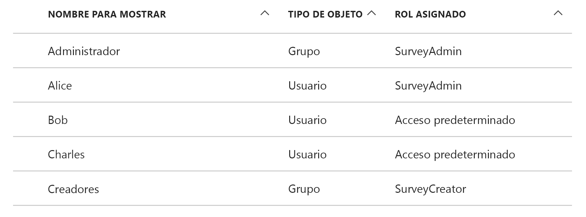
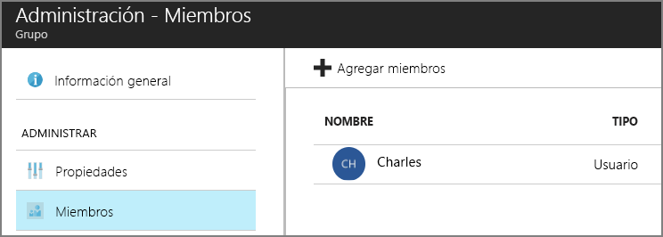

# <a name="application-roles"></a><span data-ttu-id="87efb-103">Roles de la aplicación</span><span class="sxs-lookup"><span data-stu-id="87efb-103">Application roles</span></span>

<span data-ttu-id="87efb-104">[ Código de ejemplo][sample application]</span><span class="sxs-lookup"><span data-stu-id="87efb-104">[ Sample code][sample application]</span></span>

<span data-ttu-id="87efb-105">Los roles de aplicación se usan para asignar permisos a usuarios.</span><span class="sxs-lookup"><span data-stu-id="87efb-105">Application roles are used to assign permissions to users.</span></span> <span data-ttu-id="87efb-106">Por ejemplo, la aplicación [Surveys de Tailspin][Tailspin] define los siguientes roles:</span><span class="sxs-lookup"><span data-stu-id="87efb-106">For example, the [Tailspin Surveys][Tailspin] application defines the following roles:</span></span>

* <span data-ttu-id="87efb-107">Administrador.</span><span class="sxs-lookup"><span data-stu-id="87efb-107">Administrator.</span></span> <span data-ttu-id="87efb-108">Puede realizar todas las operaciones CRUD en cualquier encuesta que pertenezca a ese inquilino.</span><span class="sxs-lookup"><span data-stu-id="87efb-108">Can perform all CRUD operations on any survey that belongs to that tenant.</span></span>
* <span data-ttu-id="87efb-109">Creador.</span><span class="sxs-lookup"><span data-stu-id="87efb-109">Creator.</span></span> <span data-ttu-id="87efb-110">Puede crear nuevas encuestas.</span><span class="sxs-lookup"><span data-stu-id="87efb-110">Can create new surveys.</span></span>
* <span data-ttu-id="87efb-111">Lector.</span><span class="sxs-lookup"><span data-stu-id="87efb-111">Reader.</span></span> <span data-ttu-id="87efb-112">Puede leer cualquier encuesta que pertenezca a ese inquilino.</span><span class="sxs-lookup"><span data-stu-id="87efb-112">Can read any surveys that belong to that tenant.</span></span>

<span data-ttu-id="87efb-113">Puede ver que los roles finalmente se traducen en permisos durante la [autorización].</span><span class="sxs-lookup"><span data-stu-id="87efb-113">You can see that roles ultimately get translated into permissions, during [authorization].</span></span> <span data-ttu-id="87efb-114">Pero la primera pregunta es cómo asignar y administrar roles.</span><span class="sxs-lookup"><span data-stu-id="87efb-114">But the first question is how to assign and manage roles.</span></span> <span data-ttu-id="87efb-115">Identificamos tres opciones principales:</span><span class="sxs-lookup"><span data-stu-id="87efb-115">We identified three main options:</span></span>

* [<span data-ttu-id="87efb-116">Roles de aplicación de Azure AD</span><span class="sxs-lookup"><span data-stu-id="87efb-116">Azure AD App Roles</span></span>](#roles-using-azure-ad-app-roles)
* [<span data-ttu-id="87efb-117">Grupos de seguridad de Azure AD</span><span class="sxs-lookup"><span data-stu-id="87efb-117">Azure AD security groups</span></span>](#roles-using-azure-ad-security-groups)
* <span data-ttu-id="87efb-118">[Administrador de roles de aplicación](#roles-using-an-application-role-manager).</span><span class="sxs-lookup"><span data-stu-id="87efb-118">[Application role manager](#roles-using-an-application-role-manager).</span></span>

## <a name="roles-using-azure-ad-app-roles"></a><span data-ttu-id="87efb-119">Roles que usan roles de aplicación de Azure AD</span><span class="sxs-lookup"><span data-stu-id="87efb-119">Roles using Azure AD App Roles</span></span>
<span data-ttu-id="87efb-120">Este es el enfoque que utilizamos en la aplicación Tailspin Surveys.</span><span class="sxs-lookup"><span data-stu-id="87efb-120">This is the approach that we used in the Tailspin Surveys app.</span></span>

<span data-ttu-id="87efb-121">En este enfoque, el proveedor SaaS define los roles de aplicación agregándolos al manifiesto de aplicación.</span><span class="sxs-lookup"><span data-stu-id="87efb-121">In this approach, The SaaS provider defines the application roles by adding them to the application manifest.</span></span> <span data-ttu-id="87efb-122">Después de que un cliente se suscriba, un administrador del directorio de AD del cliente asigna usuarios a los roles.</span><span class="sxs-lookup"><span data-stu-id="87efb-122">After a customer signs up, an admin for the customer's AD directory assigns users to the roles.</span></span> <span data-ttu-id="87efb-123">Cuando un usuario inicia sesión, los roles asignados del usuario se envían como notificaciones.</span><span class="sxs-lookup"><span data-stu-id="87efb-123">When a user signs in, the user's assigned roles are sent as claims.</span></span>

> [!NOTE]
> <span data-ttu-id="87efb-124">Si el cliente tiene Azure AD Premium, el administrador puede asignar un grupo de seguridad a un rol y los miembros del grupo heredarán el rol de aplicación.</span><span class="sxs-lookup"><span data-stu-id="87efb-124">If the customer has Azure AD Premium, the admin can assign a security group to a role, and members of the group will inherit the app role.</span></span> <span data-ttu-id="87efb-125">Esto es una forma cómoda de administrar roles, porque el propietario del grupo no necesita ser un administrador de AD.</span><span class="sxs-lookup"><span data-stu-id="87efb-125">This is a convenient way to manage roles, because the group owner doesn't need to be an AD admin.</span></span>
> 
> 

<span data-ttu-id="87efb-126">Ventajas de este enfoque:</span><span class="sxs-lookup"><span data-stu-id="87efb-126">Advantages of this approach:</span></span>

* <span data-ttu-id="87efb-127">Modelo de programación simple.</span><span class="sxs-lookup"><span data-stu-id="87efb-127">Simple programming model.</span></span>
* <span data-ttu-id="87efb-128">Los roles son específicos de la aplicación.</span><span class="sxs-lookup"><span data-stu-id="87efb-128">Roles are specific to the application.</span></span> <span data-ttu-id="87efb-129">Las notificaciones de rol para una aplicación no se envían a otra aplicación.</span><span class="sxs-lookup"><span data-stu-id="87efb-129">The role claims for one application are not sent to another application.</span></span>
* <span data-ttu-id="87efb-130">Si el cliente quita la aplicación de su inquilino de AD, los roles desaparecen.</span><span class="sxs-lookup"><span data-stu-id="87efb-130">If the customer removes the application from their AD tenant, the roles go away.</span></span>
* <span data-ttu-id="87efb-131">La aplicación no necesita ningún permiso adicional de Active Directory que no sea el de lectura del perfil del usuario.</span><span class="sxs-lookup"><span data-stu-id="87efb-131">The application doesn't need any extra Active Directory permissions, other than reading the user's profile.</span></span>

<span data-ttu-id="87efb-132">Inconvenientes:</span><span class="sxs-lookup"><span data-stu-id="87efb-132">Drawbacks:</span></span>

* <span data-ttu-id="87efb-133">Los clientes que no tienen Azure AD Premium no pueden asignar grupos de seguridad a roles.</span><span class="sxs-lookup"><span data-stu-id="87efb-133">Customers without Azure AD Premium cannot assign security groups to roles.</span></span> <span data-ttu-id="87efb-134">Para estos clientes, todas las asignaciones de usuario las debe llevar a cabo un administrador de AD.</span><span class="sxs-lookup"><span data-stu-id="87efb-134">For these customers, all user assignments must be done by an AD administrator.</span></span>
* <span data-ttu-id="87efb-135">Si tiene una API web back-end, que es independiente de la aplicación web, las asignaciones de roles de la aplicación web no se aplican entonces a la API web.</span><span class="sxs-lookup"><span data-stu-id="87efb-135">If you have a backend web API, which is separate from the web app, then role assignments for the web app don't apply to the web API.</span></span> <span data-ttu-id="87efb-136">Para más información sobre este punto, consulte [Securing a backend web API] (Protección de una API web back-end).</span><span class="sxs-lookup"><span data-stu-id="87efb-136">For more discussion of this point, see [Securing a backend web API].</span></span>

### <a name="implementation"></a><span data-ttu-id="87efb-137">Implementación</span><span class="sxs-lookup"><span data-stu-id="87efb-137">Implementation</span></span>
<span data-ttu-id="87efb-138">**Definir los roles.**</span><span class="sxs-lookup"><span data-stu-id="87efb-138">**Define the roles.**</span></span> <span data-ttu-id="87efb-139">El proveedor de SaaS declara los roles de aplicación en el [manifiesto de aplicación].</span><span class="sxs-lookup"><span data-stu-id="87efb-139">The SaaS provider declares the app roles in the [application manifest].</span></span> <span data-ttu-id="87efb-140">Por ejemplo, a continuación se muestra la entrada de manifiesto de la aplicación Surveys:</span><span class="sxs-lookup"><span data-stu-id="87efb-140">For example, here is the manifest entry for the Surveys app:</span></span>

```
"appRoles": [
  {
    "allowedMemberTypes": [
      "User"
    ],
    "description": "Creators can create Surveys",
    "displayName": "SurveyCreator",
    "id": "1b4f816e-5eaf-48b9-8613-7923830595ad",
    "isEnabled": true,
    "value": "SurveyCreator"
  },
  {
    "allowedMemberTypes": [
      "User"
    ],
    "description": "Administrators can manage the Surveys in their tenant",
    "displayName": "SurveyAdmin",
    "id": "c20e145e-5459-4a6c-a074-b942bbd4cfe1",
    "isEnabled": true,
    "value": "SurveyAdmin"
  }
],
```

<span data-ttu-id="87efb-141">La propiedad `value` aparece en la notificación de rol.</span><span class="sxs-lookup"><span data-stu-id="87efb-141">The `value`  property appears in the role claim.</span></span> <span data-ttu-id="87efb-142">La propiedad `id` es el identificador único para el rol definido.</span><span class="sxs-lookup"><span data-stu-id="87efb-142">The `id` property is the unique identifier for the defined role.</span></span> <span data-ttu-id="87efb-143">Siempre genera un nuevo valor GUID para `id`.</span><span class="sxs-lookup"><span data-stu-id="87efb-143">Always generate a new GUID value for `id`.</span></span>

<span data-ttu-id="87efb-144">**Asignar usuarios**.</span><span class="sxs-lookup"><span data-stu-id="87efb-144">**Assign users**.</span></span> <span data-ttu-id="87efb-145">Cuando se suscribe un nuevo cliente, la aplicación se registra en el inquilino de AD del cliente.</span><span class="sxs-lookup"><span data-stu-id="87efb-145">When a new customer signs up, the application is registered in the customer's AD tenant.</span></span> <span data-ttu-id="87efb-146">En este punto, un administrador de AD para ese inquilino puede asignar usuarios a roles.</span><span class="sxs-lookup"><span data-stu-id="87efb-146">At this point, an AD admin for that tenant can assign users to roles.</span></span>

> [!NOTE]
> <span data-ttu-id="87efb-147">Como se señaló anteriormente, los clientes con Azure AD Premium también pueden asignar grupos de seguridad a los roles.</span><span class="sxs-lookup"><span data-stu-id="87efb-147">As noted earlier, customers with Azure AD Premium can also assign security groups to roles.</span></span>
> 
> 

<span data-ttu-id="87efb-148">En la siguiente captura de pantalla de Azure Portal se muestran los usuarios y grupos de la aplicación Survey.</span><span class="sxs-lookup"><span data-stu-id="87efb-148">The following screenshot from the Azure portal shows users and groups for the Survey application.</span></span> <span data-ttu-id="87efb-149">Admin y Creator son grupos, que se asignan a los roles SurveyAdmin y SurveyCreator, respectivamente.</span><span class="sxs-lookup"><span data-stu-id="87efb-149">Admin and Creator are groups, assigned to SurveyAdmin and SurveyCreator roles respectively.</span></span> <span data-ttu-id="87efb-150">Alice es un usuario que se asignó directamente al rol SurveyAdmin.</span><span class="sxs-lookup"><span data-stu-id="87efb-150">Alice is a user who was assigned directly to the SurveyAdmin role.</span></span> <span data-ttu-id="87efb-151">Bob y Charles son usuarios que no se han asignado directamente a un rol.</span><span class="sxs-lookup"><span data-stu-id="87efb-151">Bob and Charles are users that have not been directly assigned to a role.</span></span>



<span data-ttu-id="87efb-153">Tal y como se muestra en la siguiente captura de pantalla, Charles forma parte del grupo Admin, por lo que hereda el rol SurveyAdmin.</span><span class="sxs-lookup"><span data-stu-id="87efb-153">As shown in the following screenshot, Charles is part of the Admin group, so he inherits the SurveyAdmin role.</span></span> <span data-ttu-id="87efb-154">En el caso de Bob, aún no se le ha asignado un rol.</span><span class="sxs-lookup"><span data-stu-id="87efb-154">In the case of Bob, he has not been assigned a role yet.</span></span>




> [!NOTE]
> <span data-ttu-id="87efb-156">Un enfoque alternativo para la aplicación es asignar roles mediante programación, con la API de Azure AD Graph.</span><span class="sxs-lookup"><span data-stu-id="87efb-156">An alternative approach is for the application to assign roles programmatically, using the Azure AD Graph API.</span></span> <span data-ttu-id="87efb-157">Sin embargo, esto requiere que la aplicación obtenga permisos de escritura para el directorio de AD del cliente.</span><span class="sxs-lookup"><span data-stu-id="87efb-157">However, this requires the application to obtain write permissions for the customer's AD directory.</span></span> <span data-ttu-id="87efb-158">Una aplicación con esos permisos podría hacer muchas travesuras &mdash; el cliente confía en que la aplicación no arruine su directorio.</span><span class="sxs-lookup"><span data-stu-id="87efb-158">An application with those permissions could do a lot of mischief &mdash; the customer is trusting the app not to mess up their directory.</span></span> <span data-ttu-id="87efb-159">Muchos clientes pueden no estar dispuestos a conceder este nivel de acceso.</span><span class="sxs-lookup"><span data-stu-id="87efb-159">Many customers might be unwilling to grant this level of access.</span></span>
> 

<span data-ttu-id="87efb-160">**Obtener notificaciones de rol**.</span><span class="sxs-lookup"><span data-stu-id="87efb-160">**Get role claims**.</span></span> <span data-ttu-id="87efb-161">Cuando un usuario inicia sesión, la aplicación recibe los roles asignados del usuario en una notificación con el tipo `http://schemas.microsoft.com/ws/2008/06/identity/claims/role`.</span><span class="sxs-lookup"><span data-stu-id="87efb-161">When a user signs in, the application receives the user's assigned role(s) in a claim with type `http://schemas.microsoft.com/ws/2008/06/identity/claims/role`.</span></span>  

<span data-ttu-id="87efb-162">Un usuario puede tener varios roles o ningún rol.</span><span class="sxs-lookup"><span data-stu-id="87efb-162">A user can have multiple roles, or no role.</span></span> <span data-ttu-id="87efb-163">En el código de autorización, no suponga que el usuario tiene exactamente un rol de notificación.</span><span class="sxs-lookup"><span data-stu-id="87efb-163">In your authorization code, don't assume the user has exactly one role claim.</span></span> <span data-ttu-id="87efb-164">En su lugar, escriba el código que comprueba si hay un valor de notificación determinado:</span><span class="sxs-lookup"><span data-stu-id="87efb-164">Instead, write code that checks whether a particular claim value is present:</span></span>

```csharp
if (context.User.HasClaim(ClaimTypes.Role, "Admin")) { ... }
```

## <a name="roles-using-azure-ad-security-groups"></a><span data-ttu-id="87efb-165">Roles que usan grupos de seguridad de Azure AD</span><span class="sxs-lookup"><span data-stu-id="87efb-165">Roles using Azure AD security groups</span></span>
<span data-ttu-id="87efb-166">En este enfoque, los roles se representan como grupos de seguridad de AD.</span><span class="sxs-lookup"><span data-stu-id="87efb-166">In this approach, roles are represented as AD security groups.</span></span> <span data-ttu-id="87efb-167">La aplicación asigna permisos a los usuarios según la pertenencia de estos a grupos de seguridad.</span><span class="sxs-lookup"><span data-stu-id="87efb-167">The application assigns permissions to users based on their security group memberships.</span></span>

<span data-ttu-id="87efb-168">Ventajas:</span><span class="sxs-lookup"><span data-stu-id="87efb-168">Advantages:</span></span>

* <span data-ttu-id="87efb-169">Para los clientes que no tienen Azure AD Premium, este enfoque les permite utilizar grupos de seguridad para administrar las asignaciones de roles.</span><span class="sxs-lookup"><span data-stu-id="87efb-169">For customers who do not have Azure AD Premium, this approach enables the customer to use security groups to manage role assignments.</span></span>

<span data-ttu-id="87efb-170">Desventajas:</span><span class="sxs-lookup"><span data-stu-id="87efb-170">Disadvantages:</span></span>

* <span data-ttu-id="87efb-171">Complejidad.</span><span class="sxs-lookup"><span data-stu-id="87efb-171">Complexity.</span></span> <span data-ttu-id="87efb-172">Dado que cada inquilino envía notificaciones de grupo diferentes, la aplicación debe realizar un seguimiento de qué grupos de seguridad corresponden a qué roles de aplicación para cada inquilino.</span><span class="sxs-lookup"><span data-stu-id="87efb-172">Because every tenant sends different group claims, the app must keep track of which security groups correspond to which application roles, for each tenant.</span></span>
* <span data-ttu-id="87efb-173">Si el cliente quita la aplicación de su inquilino de AD, los grupos de seguridad se mantienen en su directorio de AD.</span><span class="sxs-lookup"><span data-stu-id="87efb-173">If the customer removes the application from their AD tenant, the security groups are left in their AD directory.</span></span>

### <a name="implementation"></a><span data-ttu-id="87efb-174">Implementación</span><span class="sxs-lookup"><span data-stu-id="87efb-174">Implementation</span></span>
<span data-ttu-id="87efb-175">En el manifiesto de aplicación, establezca la propiedad `groupMembershipClaims` en "SecurityGroup".</span><span class="sxs-lookup"><span data-stu-id="87efb-175">In the application manifest, set the `groupMembershipClaims` property to "SecurityGroup".</span></span> <span data-ttu-id="87efb-176">Esto es necesario para obtener notificaciones de pertenencia a grupo de AAD.</span><span class="sxs-lookup"><span data-stu-id="87efb-176">This is needed to get group membership claims from AAD.</span></span>

```
{
   // ...
   "groupMembershipClaims": "SecurityGroup",
}
```

<span data-ttu-id="87efb-177">Cuando un nuevo cliente se suscribe, la aplicación indica al cliente que cree grupos de seguridad para los roles que necesita la aplicación.</span><span class="sxs-lookup"><span data-stu-id="87efb-177">When a new customer signs up, the application instructs the customer to create security groups for the roles needed by the application.</span></span> <span data-ttu-id="87efb-178">A continuación, el cliente necesita escribir los identificadores de objeto de grupo en la aplicación.</span><span class="sxs-lookup"><span data-stu-id="87efb-178">The customer then needs to enter the group object IDs into the application.</span></span> <span data-ttu-id="87efb-179">La aplicación almacena esto en una tabla que asigna identificadores de grupo a roles de la aplicación por inquilino.</span><span class="sxs-lookup"><span data-stu-id="87efb-179">The application stores these in a table that maps group IDs to application roles, per tenant.</span></span>

> [!NOTE]
> <span data-ttu-id="87efb-180">Como alternativa, la aplicación podría crear los grupos mediante programación usando la API Graph de Azure AD.</span><span class="sxs-lookup"><span data-stu-id="87efb-180">Alternatively, the application could create the groups programmatically, using the Azure AD Graph API.</span></span>  <span data-ttu-id="87efb-181">Esto sería menos propenso a errores.</span><span class="sxs-lookup"><span data-stu-id="87efb-181">This would be less error prone.</span></span> <span data-ttu-id="87efb-182">Sin embargo, ello requiere que la aplicación obtenga permisos de "lectura y escritura en todos los grupos" para el directorio de AD del cliente.</span><span class="sxs-lookup"><span data-stu-id="87efb-182">However, it requires the application to obtain "read and write all groups" permissions for the customer's AD directory.</span></span> <span data-ttu-id="87efb-183">Muchos clientes pueden no estar dispuestos a conceder este nivel de acceso.</span><span class="sxs-lookup"><span data-stu-id="87efb-183">Many customers might be unwilling to grant this level of access.</span></span>
> 
> 

<span data-ttu-id="87efb-184">Cuando un usuario inicia sesión:</span><span class="sxs-lookup"><span data-stu-id="87efb-184">When a user signs in:</span></span>

1. <span data-ttu-id="87efb-185">La aplicación recibe los grupos del usuario como notificaciones.</span><span class="sxs-lookup"><span data-stu-id="87efb-185">The application receives the user's groups as claims.</span></span> <span data-ttu-id="87efb-186">El valor de cada notificación es el identificador de objeto de un grupo.</span><span class="sxs-lookup"><span data-stu-id="87efb-186">The value of each claim is the object ID of a group.</span></span>
2. <span data-ttu-id="87efb-187">Azure AD limita el número de grupos enviados en el token.</span><span class="sxs-lookup"><span data-stu-id="87efb-187">Azure AD limits the number of groups sent in the token.</span></span> <span data-ttu-id="87efb-188">Si el número de grupos supera este límite, Azure AD envía una notificación especial que indica que se está por encima del límite.</span><span class="sxs-lookup"><span data-stu-id="87efb-188">If the number of groups exceeds this limit, Azure AD sends a special "overage" claim.</span></span> <span data-ttu-id="87efb-189">Si esa notificación está presente, la aplicación debe consultar la API Graph de Azure AD para obtener todos los grupos a los que pertenece ese usuario.</span><span class="sxs-lookup"><span data-stu-id="87efb-189">If that claim is present, the application must query the Azure AD Graph API to get all of the groups to which that user belongs.</span></span> <span data-ttu-id="87efb-190">Para más información, consulte Authorization in Cloud Applications using AD Groups [Autorización de aplicaciones en la nube mediante grupos de AD], en la sección titulada "Groups claim overage" (Exceso de notificaciones de grupos).</span><span class="sxs-lookup"><span data-stu-id="87efb-190">For details, see [Authorization in Cloud Applications using AD Groups], under the section titled "Groups claim overage".</span></span>
3. <span data-ttu-id="87efb-191">La aplicación busca los identificadores de objeto en su propia base de datos, para encontrar los roles de aplicación correspondientes para asignar al usuario.</span><span class="sxs-lookup"><span data-stu-id="87efb-191">The application looks up the object IDs in its own database, to find the corresponding application roles to assign to the user.</span></span>
4. <span data-ttu-id="87efb-192">La aplicación agrega un valor de notificación personalizado a la entidad de seguridad del usuario que expresa el rol de aplicación.</span><span class="sxs-lookup"><span data-stu-id="87efb-192">The application adds a custom claim value to the user principal that expresses the application role.</span></span> <span data-ttu-id="87efb-193">Por ejemplo: `survey_role` = "SurveyAdmin".</span><span class="sxs-lookup"><span data-stu-id="87efb-193">For example: `survey_role` = "SurveyAdmin".</span></span>

<span data-ttu-id="87efb-194">Las directivas de autorización deben usar la notificación de rol personalizada, no la notificación de grupo.</span><span class="sxs-lookup"><span data-stu-id="87efb-194">Authorization policies should use the custom role claim, not the group claim.</span></span>

## <a name="roles-using-an-application-role-manager"></a><span data-ttu-id="87efb-195">Roles que usan un administrador de roles de aplicación</span><span class="sxs-lookup"><span data-stu-id="87efb-195">Roles using an application role manager</span></span>
<span data-ttu-id="87efb-196">Con este enfoque, los roles de aplicación no se almacenan en Azure AD en absoluto.</span><span class="sxs-lookup"><span data-stu-id="87efb-196">With this approach, application roles are not stored in Azure AD at all.</span></span> <span data-ttu-id="87efb-197">En su lugar, la aplicación almacena las asignaciones de roles para cada usuario en su propia base de datos &mdash; por ejemplo, mediante la clase **RoleManager** en ASP.NET Identity.</span><span class="sxs-lookup"><span data-stu-id="87efb-197">Instead, the application stores the role assignments for each user in its own DB &mdash; for example, using the **RoleManager** class in ASP.NET Identity.</span></span>

<span data-ttu-id="87efb-198">Ventajas:</span><span class="sxs-lookup"><span data-stu-id="87efb-198">Advantages:</span></span>

* <span data-ttu-id="87efb-199">La aplicación tiene control total sobre los roles y asignaciones de usuario.</span><span class="sxs-lookup"><span data-stu-id="87efb-199">The app has full control over the roles and user assignments.</span></span>

<span data-ttu-id="87efb-200">Inconvenientes:</span><span class="sxs-lookup"><span data-stu-id="87efb-200">Drawbacks:</span></span>

* <span data-ttu-id="87efb-201">Más complejo, es más difícil de mantener.</span><span class="sxs-lookup"><span data-stu-id="87efb-201">More complex, harder to maintain.</span></span>
* <span data-ttu-id="87efb-202">No se pueden usar grupos de seguridad de AD para administrar asignaciones de roles.</span><span class="sxs-lookup"><span data-stu-id="87efb-202">Cannot use AD security groups to manage role assignments.</span></span>
* <span data-ttu-id="87efb-203">Almacena la información del usuario en la base de datos de la aplicación, donde puede perder la sincronización con el directorio de AD del inquilino a medida que se agregan o quitan usuarios.</span><span class="sxs-lookup"><span data-stu-id="87efb-203">Stores user information in the application database, where it can get out of sync with the tenant's AD directory, as users are added or removed.</span></span>   


<span data-ttu-id="87efb-204">[**Siguiente**][autorización]</span><span class="sxs-lookup"><span data-stu-id="87efb-204">[**Next**][authorization]</span></span>

<!-- Links -->
[Tailspin]: tailspin.md

[autorización]: authorize.md
[authorization]: authorize.md
[Securing a backend web API]: web-api.md
[manifiesto de aplicación]: /azure/active-directory/active-directory-application-manifest/
[application manifest]: /azure/active-directory/active-directory-application-manifest/
[sample application]: https://github.com/mspnp/multitenant-saas-guidance
