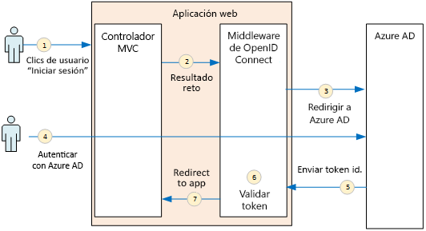
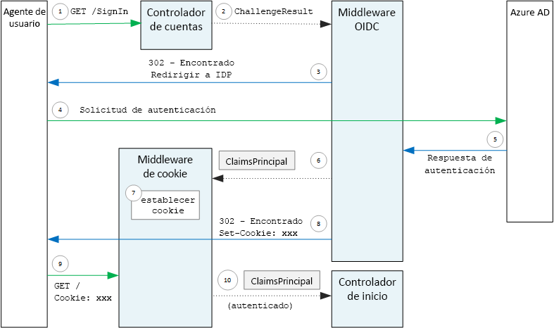

# <a name="authenticate-using-azure-ad-and-openid-connect"></a>Autenticación con Azure AD y OpenID Connect

[ Código de ejemplo][sample application]

La aplicación Surveys utiliza el protocolo OpenID Connect (OIDC) para autenticar a los usuarios con Azure Active Directory (Azure AD). La aplicación Surveys utiliza ASP.NET Core, que tiene integrado un middleware para OIDC. En el diagrama siguiente, se muestra lo que ocurre cuando el usuario inicia sesión, a un alto nivel.



1. El usuario hace clic en el botón de inicio de sesión en la aplicación. Esta acción se controla mediante un controlador MVC.
2. El controlador MVC devuelve una acción **ChallengeResult** .
3. El software intermedio intercepta la acción **ChallengeResult** y crea una respuesta 302, que redirige al usuario a la página de inicio de sesión de Azure AD.
4. El usuario se autentica con Azure AD.
5. Azure AD envía un token de identificador a la aplicación.
6. El software intermedio valida el token de identificador. En este punto, el usuario está ya autenticado dentro de la aplicación.
7. El software intermedio redirige al usuario a la aplicación.

## <a name="register-the-app-with-azure-ad"></a>Registro de la aplicación con Azure AD
Para habilitar OpenID Connect, el proveedor de SaaS registra la aplicación dentro de su propio inquilino de Azure AD.

Para registrar la aplicación, siga los pasos de [Integración de aplicaciones con Azure Active Directory](/azure/active-directory/active-directory-integrating-applications/), en la sección [Agregar una aplicación](/azure/active-directory/active-directory-integrating-applications/#adding-an-application).

Consulte [Run the Surveys application](./run-the-app.md) (Ejecutar la aplicación Surveys) para conocer los pasos específicos de la aplicación Surveys. Tenga en cuenta lo siguiente:

- En el caso de una aplicación de varios inquilinos, debe configurar explícitamente la opción de varios inquilinos. Esto permite que otras organizaciones tengan acceso a la aplicación.

- La dirección URL de respuesta es la dirección URL a la que Azure AD enviará las respuestas de OAuth 2.0. Cuando se usa ASP.NET Core, es necesario que coincida con la ruta de acceso que configure en el middleware de autenticación (consulte la sección siguiente). 

## <a name="configure-the-auth-middleware"></a>Configuración del middleware de autenticación
En esta sección se describe cómo configurar el middleware de autenticación en ASP.NET Core 1.0 para la autenticación multiinquilino con OpenID Connect.

En la [clase de inicio](/aspnet/core/fundamentals/startup), agregue el middleware OpenID Connect:

```csharp
app.UseOpenIdConnectAuthentication(new OpenIdConnectOptions {
    ClientId = configOptions.AzureAd.ClientId,
    ClientSecret = configOptions.AzureAd.ClientSecret, // for code flow
    Authority = Constants.AuthEndpointPrefix,
    ResponseType = OpenIdConnectResponseType.CodeIdToken,
    PostLogoutRedirectUri = configOptions.AzureAd.PostLogoutRedirectUri,
    SignInScheme = CookieAuthenticationDefaults.AuthenticationScheme,
    TokenValidationParameters = new TokenValidationParameters { ValidateIssuer = false },
    Events = new SurveyAuthenticationEvents(configOptions.AzureAd, loggerFactory),
});
```

Tenga en cuenta que algunos de los valores se toman de opciones de configuración en tiempo de ejecución. Esto es lo que significan las opciones de middleware:

* **ClientId**. El identificador de cliente de la aplicación, que obtuvo al registrar la aplicación en Azure AD.
* **Authority**. Para una aplicación multiinquilino, establezca esta propiedad en `https://login.microsoftonline.com/common/`. Se trata de la dirección URL para el punto de conexión común de Azure AD, que permite a los usuarios de cualquier inquilino de Azure AD iniciar sesión. Para más información sobre el punto de conexión común, consulte [esta entrada de blog](https://www.cloudidentity.com/blog/2014/08/26/the-common-endpoint-walks-like-a-tenant-talks-like-a-tenant-but-is-not-a-tenant/).
* En **TokenValidationParameters**, establezca **ValidateIssuer** en false. Esto significa que la aplicación se encargará de validar el valor del emisor en el token de identificador. (El middleware sigue validando el token por sí mismo). Para obtener más información acerca de la validación del emisor, consulte [Issuer validation](claims.md#issuer-validation) (Validación de emisor).
* **PostLogoutRedirectUri**. Especifique una dirección URL a la que redirigir a los usuarios tras el cierre de sesión. Debe tratarse de una página que permita las solicitudes anónimas, normalmente la página principal.
* **SignInScheme**. Establezca esta opción en `CookieAuthenticationDefaults.AuthenticationScheme`. Esta configuración significa que, después de autenticarse el usuario, las notificaciones de usuario se almacenan localmente en una cookie. Esta cookie es la forma en que la sesión del usuario permanece iniciada durante la sesión del explorador.
* **Eventos.** Devoluciones de llamada de evento; consulte [Eventos de autenticación](#authentication-events).

Además, agregue el software intermedio de autenticación de cookies a la canalización. Este software intermedio se encarga de escribir las notificaciones del usuario en una cookie y después de leerla durante las cargas de página posteriores.

```csharp
app.UseCookieAuthentication(new CookieAuthenticationOptions {
    AutomaticAuthenticate = true,
    AutomaticChallenge = true,
    AccessDeniedPath = "/Home/Forbidden",
    CookieSecure = CookieSecurePolicy.Always,

    // The default setting for cookie expiration is 14 days. SlidingExpiration is set to true by default
    ExpireTimeSpan = TimeSpan.FromHours(1),
    SlidingExpiration = true
});
```

## <a name="initiate-the-authentication-flow"></a>Inicio del flujo de autenticación
Para iniciar el flujo de autenticación en el MVC de ASP.NET, devuelva una acción **ChallengeResult** desde el controlador:

```csharp
[AllowAnonymous]
public IActionResult SignIn()
{
    return new ChallengeResult(
        OpenIdConnectDefaults.AuthenticationScheme,
        new AuthenticationProperties
        {
            IsPersistent = true,
            RedirectUri = Url.Action("SignInCallback", "Account")
        });
}
```

Esto hace que el software intermedio devuelva una respuesta 302 (encontrado) que redirige al punto de conexión de autenticación.

## <a name="user-login-sessions"></a>Sesiones de inicio de sesión de usuario
Como se ha mencionado, cuando el usuario inicia sesión por primera vez, el software intermedio de autenticación de cookies escribe las notificaciones del usuario en una cookie. Después, se autentican las solicitudes HTTP al leer la cookie.

De forma predeterminada, el middleware de cookies escribe una [cookie de sesión][session-cookie], que se elimina una vez que el usuario cierra el explorador. La próxima vez que el usuario visita el sitio, tendrá que iniciar sesión de nuevo. Sin embargo, si establece **IsPersistent** en true en **ChallengeResult**, el middleware escribe una cookie persistente, por lo que la sesión del usuario permanece abierta después de cerrar el explorador. Puede configurar la expiración de las cookies; consulte [Controlar opciones de cookie][cookie-options]. Las cookies persistentes son más cómodas para el usuario, pero pueden ser inadecuadas para algunas aplicaciones (por ejemplo, una aplicación de banca) en las que el usuario desea iniciar sesión cada vez.

## <a name="about-the-openid-connect-middleware"></a>Acerca del software intermedio OpenID Connect
El software intermedio OpenID Connect en ASP.NET oculta la mayoría de los detalles del protocolo. Esta sección contiene algunas notas sobre la implementación que pueden ser útiles para comprender el flujo del protocolo.

En primer lugar, vamos a examinar el flujo de autenticación en términos de ASP.NET (omitiendo los detalles del flujo de protocolo OIDC entre la aplicación y Azure AD). En el siguiente diagrama se muestra el proceso.



En este diagrama, hay dos controladores MVC. El controlador de cuentas controla las solicitudes de inicio de sesión y el controlador principal sirve la página principal.

Este es el proceso de autenticación:

1. El usuario hace clic en el botón de inicio de sesión y el explorador envía una solicitud GET. Por ejemplo: `GET /Account/SignIn/`.
2. El controlador de cuentas devuelve una acción `ChallengeResult`.
3. El software intermedio OIDC devuelve una respuesta HTTP 302 y redirige al usuario a Azure AD.
4. El explorador envía la solicitud de autenticación a Azure AD.
5. El usuario inicia sesión en Azure AD, desde donde se devuelve una respuesta de autenticación.
6. El software intermedio OIDC crea una entidad de seguridad de notificaciones y la pasa al software intermedio de autenticación de cookies.
7. El software intermedio de cookies serializa la entidad de seguridad de notificaciones y establece una cookie.
8. El software intermedio OIDC redirige a la dirección URL de devolución de llamada de la aplicación.
9. El explorador sigue a la redirección y envía la cookie en la solicitud.
10. El software intermedio de cookies deserializa la cookie en una entidad de seguridad de notificaciones y establece `HttpContext.User` en dicha entidad. La solicitud se enruta a un controlador MVC.

### <a name="authentication-ticket"></a>Vale de autenticación
Si la autenticación se realiza correctamente, el software intermedio OIDC crea un vale de autenticación, que contiene una entidad de seguridad de notificaciones con las notificaciones del usuario. Puede tener acceso al vale en **AuthenticationValidated** o el evento **TicketReceived**.

> [!NOTE]
> Hasta que se complete el flujo de autenticación en su totalidad, `HttpContext.User` sigue albergando una entidad de seguridad anónima, **no** el usuario autenticado. La entidad de seguridad anónima tiene una colección vacía de notificaciones. Una vez que la autenticación se completa y la aplicación realiza la redirección, el software intermedio de cookies deserializa la cookie de autenticación y establece `HttpContext.User` en una entidad de seguridad de notificaciones que representa al usuario autenticado.
> 
> 

### <a name="authentication-events"></a>Eventos de autenticación
Durante el proceso de autenticación, el software intermedio OpenID Connect genera una serie de eventos:

* **RedirectToIdentityProvider**. Se llama justo antes de que el software intermedio redirija al punto de conexión de autenticación. Puede usar este evento para modificar la dirección URL de redireccionamiento; por ejemplo, para agregar parámetros de solicitud. Consulte [Incorporación de la petición de consentimiento del administrador](signup.md#adding-the-admin-consent-prompt) para ver un ejemplo.
* **AuthorizationCodeReceived**. Se llama con el código de autorización.
* **TokenResponseReceived**. Se llama después de que el software intermedio obtiene un token de acceso desde el IDP, pero antes de que se valide. Se aplica solo al flujo de código de autorización.
* **TokenValidated**. Se llama después de que el software intermedio valide el token de identificador. En este punto, la aplicación tiene un conjunto de notificaciones validadas sobre el usuario. Puede usar este evento para realizar una validación adicional de las notificaciones o para transformarlas. Consulte [Working with claims-based identities](claims.md) (Trabajo con identidades basadas en notificaciones).
* **UserInformationReceived**. Se llama si el software intermedio obtiene el perfil de usuario desde el punto de conexión de información de usuario. Solo se aplica al flujo de código de autorización y solamente con `GetClaimsFromUserInfoEndpoint = true` en las opciones del software intermedio.
* **TicketReceived**. Se llama cuando se completa la autenticación. Se trata del último evento, siempre que la autenticación se realice correctamente. Una vez que se controla este evento, el usuario inicia sesión en la aplicación.
* **AuthenticationFailed**. Se llama si se produce un error de autenticación. Use este evento para controlar los errores de autenticación; por ejemplo, redirigiendo a una página de error.

Para proporcionar devoluciones de llamada para estos eventos, establezca la opción **Events** en el software intermedio. Hay dos maneras diferentes de declarar los controladores de eventos: insertados con expresiones lambda o en una clase que deriva de **OpenIdConnectEvents**. Se recomienda el segundo enfoque si sus devoluciones de llamada de evento tienen lógica sustancial, para que no sobrecarguen la clase de inicio. Nuestra implementación de referencia usa este enfoque.

### <a name="openid-connect-endpoints"></a>Puntos de conexión de OpenID Connect
Azure AD admite [OpenID Connect Discovery](https://openid.net/specs/openid-connect-discovery-1_0.html), donde un proveedor de identidades devuelve un documento de metadatos de JSON desde un [punto de conexión conocido](https://openid.net/specs/openid-connect-discovery-1_0.html#ProviderConfig). El documento de metadatos contiene información como:

* La dirección URL del punto de conexión de autorización. Aquí es a donde redirige la aplicación para autenticar al usuario.
* La dirección URL del punto de conexión de fin de sesión, a donde la aplicación va para cerrar la sesión del usuario.
* La dirección URL para obtener las claves de firma, que el cliente usa para validar los tokens de OIDC que obtiene del IDP.

De forma predeterminada, el software intermedio OIDC sabe cómo capturar estos metadatos. Establezca la opción **Authority** en el software intermedio, el cual construye la dirección URL para los metadatos. (La dirección URL de metadatos se puede invalidar estableciendo la opción **MetadataAddress** ).

### <a name="openid-connect-flows"></a>Flujos de OpenID Connect
De forma predeterminada, el software intermedio OIDC usa un flujo híbrido con el modo de respuesta de envío de formulario.

* *Flujo híbrido* significa que el cliente puede obtener un token de identificador y un código de autorización en el mismo recorrido de ida y vuelta al servidor de autorización.
* *Modo de respuesta de envío de formulario* significa que el servidor de autorización usa una solicitud POST HTTP para enviar el token de identificador y el código autorización a la aplicación. Los valores tienen el formato form-urlencoded (content type = "application/x-www-form-urlencoded").

Cuando el software intermedio OIDC redirige al punto de conexión de autorización, la dirección URL de redireccionamiento incluye todos los parámetros de cadena de consulta necesarios para OIDC. Para el flujo híbrido:

* client_id. Este valor se establece en la opción **ClientId** .
* scope = "openid profile", lo que significa que es una solicitud de OIDC y que se busca el perfil del usuario.
* response_type  = "code id_token". Esto especifica el flujo híbrido.
* response_mode = "form_post". Esto especifica la respuesta de envío de formulario.

Para especificar un flujo diferente, establezca la propiedad **ResponseType** en las opciones. Por ejemplo: 

```csharp
app.UseOpenIdConnectAuthentication(options =>
{
    options.ResponseType = "code"; // Authorization code flow

    // Other options
}
```

[**Siguiente**][claims]

[claims]: claims.md
[cookie-options]: /aspnet/core/security/authentication/cookie#controlling-cookie-options
[session-cookie]: https://en.wikipedia.org/wiki/HTTP_cookie#Session_cookie
[sample application]: https://github.com/mspnp/multitenant-saas-guidance
