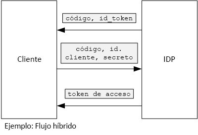

# <a name="use-client-assertion-to-get-access-tokens-from-azure-ad"></a>Uso de aserción de cliente para obtener tokens de acceso de Azure AD

[ Código de ejemplo][sample application]

## <a name="background"></a>Fondo
Al usar el flujo de código de autorización o flujo híbrido en OpenID Connect, el cliente intercambia un código de autorización para un token de acceso. Durante este paso, el cliente tiene que autenticarse en el servidor.



Una manera de autenticar el cliente es mediante un secreto de cliente. Así es cómo la aplicación [Surveys de Tailspin][Surveys] está configurada de forma predeterminada.

Esta es una solicitud de ejemplo desde el cliente al IDP, que solicita un token de acceso. Tenga en cuenta el parámetro `client_secret` .

```
POST https://login.microsoftonline.com/b9bd2162xxx/oauth2/token HTTP/1.1
Content-Type: application/x-www-form-urlencoded

resource=https://tailspin.onmicrosoft.com/surveys.webapi
  &client_id=87df91dc-63de-4765-8701-b59cc8bd9e11
  &client_secret=i3Bf12Dn...
  &grant_type=authorization_code
  &code=PG8wJG6Y...
```

El secreto es una cadena, por lo que debe asegurarse de no perder el valor. La práctica recomendada es mantener el secreto de cliente fuera del control de código fuente. Cuando se implemente en Azure, almacene el secreto en un [valor de configuración de la aplicación][configure-web-app].

Sin embargo, cualquier persona con acceso a la suscripción de Azure puede ver la configuración de la aplicación. Además, siempre existe la tentación de proteger los secretos en el control de código fuente (por ejemplo, en los scripts de implementación), compartirlos por correo electrónico, etc.

Para obtener seguridad adicional, puede usar [aserción de cliente] en lugar de un secreto de cliente. Con aserción de cliente, el cliente utiliza un certificado X.509 para demostrar que la solicitud de token procedía del cliente. El certificado de cliente se instala en el servidor web. Por lo general, será más fácil restringir el acceso al certificado que garantizar que nadie revela inadvertidamente un secreto de cliente. Para más información sobre cómo configurar certificados en una aplicación web, consulte [Using Certificates in Azure Websites Applications][using-certs-in-websites] (Uso de certificados en aplicaciones de Azure Websites).

A continuación figura una solicitud de token utilizando aserción de cliente:

```
POST https://login.microsoftonline.com/b9bd2162xxx/oauth2/token HTTP/1.1
Content-Type: application/x-www-form-urlencoded

resource=https://tailspin.onmicrosoft.com/surveys.webapi
  &client_id=87df91dc-63de-4765-8701-b59cc8bd9e11
  &client_assertion_type=urn:ietf:params:oauth:client-assertion-type:jwt-bearer
  &client_assertion=eyJhbGci...
  &grant_type=authorization_code
  &code= PG8wJG6Y...
```

Observe que el parámetro `client_secret` ya no se usa. En su lugar, el parámetro `client_assertion` contiene un token de JWT que se firmó con el certificado de cliente. El parámetro `client_assertion_type` especifica el tipo de aserción &mdash; en este caso, token de JWT. El servidor valida el token de JWT. Si el token de JWT no es válido, la solicitud de token devuelve un error.

> [!NOTE]
> Los certificados X.509 no son la única forma de aserción de cliente; nos centraremos en ella aquí porque es compatible con Azure AD.
> 
> 

En tiempo de ejecución, la aplicación web lee el certificado del almacén de certificados. El certificado debe estar instalado en la misma máquina que la aplicación web.

La aplicación Surveys incluye una clase auxiliar que crea un elemento [ClientAssertionCertificate](/dotnet/api/microsoft.identitymodel.clients.activedirectory.clientassertioncertificate) que puede pasar al método [AuthenticationContext.AcquireTokenSilentAsync](/dotnet/api/microsoft.identitymodel.clients.activedirectory.authenticationcontext.acquiretokensilentasync) para adquirir un token de Azure AD.

```csharp
public class CertificateCredentialService : ICredentialService
{
    private Lazy<Task<AdalCredential>> _credential;

    public CertificateCredentialService(IOptions<ConfigurationOptions> options)
    {
        var aadOptions = options.Value?.AzureAd;
        _credential = new Lazy<Task<AdalCredential>>(() =>
        {
            X509Certificate2 cert = CertificateUtility.FindCertificateByThumbprint(
                aadOptions.Asymmetric.StoreName,
                aadOptions.Asymmetric.StoreLocation,
                aadOptions.Asymmetric.CertificateThumbprint,
                aadOptions.Asymmetric.ValidationRequired);
            string password = null;
            var certBytes = CertificateUtility.ExportCertificateWithPrivateKey(cert, out password);
            return Task.FromResult(new AdalCredential(new ClientAssertionCertificate(aadOptions.ClientId, new X509Certificate2(certBytes, password))));
        });
    }

    public async Task<AdalCredential> GetCredentialsAsync()
    {
        return await _credential.Value;
    }
}
```

Para información sobre cómo configurar la aserción de cliente en la aplicación Surveys, consulte [Use Azure Key Vault to protect application secrets ][key vault] (Uso de Azure Key Vault para proteger los secretos de aplicación).

[**Siguiente**][key vault]

<!-- Links -->
[configure-web-app]: /azure/app-service-web/web-sites-configure/
[azure-management-portal]: https://portal.azure.com
[aserción de cliente]: https://tools.ietf.org/html/rfc7521
[key vault]: key-vault.md
[Setup-KeyVault]: https://github.com/mspnp/multitenant-saas-guidance/blob/master/scripts/Setup-KeyVault.ps1
[Surveys]: tailspin.md
[using-certs-in-websites]: https://azure.microsoft.com/blog/using-certificates-in-azure-websites-applications/

[sample application]: https://github.com/mspnp/multitenant-saas-guidance
