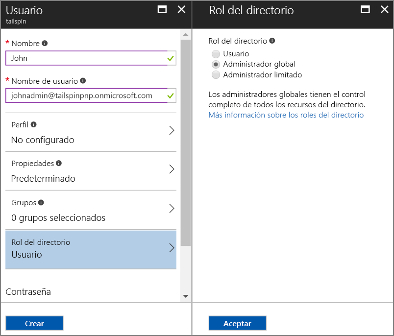
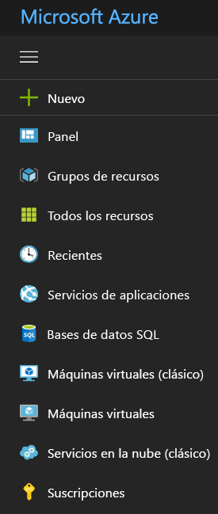

# <a name="use-azure-key-vault-to-protect-application-secrets"></a><span data-ttu-id="ea195-103">Uso de Azure Key Vault para proteger los secretos de la aplicación</span><span class="sxs-lookup"><span data-stu-id="ea195-103">Use Azure Key Vault to protect application secrets</span></span>

<span data-ttu-id="ea195-104">[ Código de ejemplo][sample application]</span><span class="sxs-lookup"><span data-stu-id="ea195-104">[ Sample code][sample application]</span></span>

<span data-ttu-id="ea195-105">Es habitual tener opciones de configuración de la aplicación que son confidenciales y deben protegerse, por ejemplo:</span><span class="sxs-lookup"><span data-stu-id="ea195-105">It's common to have application settings that are sensitive and must be protected, such as:</span></span>

* <span data-ttu-id="ea195-106">Cadenas de conexión de base de datos</span><span class="sxs-lookup"><span data-stu-id="ea195-106">Database connection strings</span></span>
* <span data-ttu-id="ea195-107">Contraseñas</span><span class="sxs-lookup"><span data-stu-id="ea195-107">Passwords</span></span>
* <span data-ttu-id="ea195-108">Claves de cifrado</span><span class="sxs-lookup"><span data-stu-id="ea195-108">Cryptographic keys</span></span>

<span data-ttu-id="ea195-109">Como procedimiento recomendado de seguridad, no debe almacenar nunca estos secretos en el control de código fuente.</span><span class="sxs-lookup"><span data-stu-id="ea195-109">As a security best practice, you should never store these secrets in source control.</span></span> <span data-ttu-id="ea195-110">Es muy fácil que se filtren, incluso si el repositorio de código fuente es privado.</span><span class="sxs-lookup"><span data-stu-id="ea195-110">It's too easy for them to leak &mdash; even if your source code repository is private.</span></span> <span data-ttu-id="ea195-111">Y no se trata solo de proteger los secretos frente al público general.</span><span class="sxs-lookup"><span data-stu-id="ea195-111">And it's not just about keeping secrets from the general public.</span></span> <span data-ttu-id="ea195-112">En proyectos de mayor tamaño, es posible que desee restringir qué desarrolladores y operadores pueden tener acceso a los secretos de producción.</span><span class="sxs-lookup"><span data-stu-id="ea195-112">On larger projects, you might want to restrict which developers and operators can access the production secrets.</span></span> <span data-ttu-id="ea195-113">(La configuración de los entornos de prueba o desarrollo son diferentes).</span><span class="sxs-lookup"><span data-stu-id="ea195-113">(Settings for test or development environments are different.)</span></span>

<span data-ttu-id="ea195-114">Una opción más segura consiste en almacenar estos secretos en [Azure Key Vault][KeyVault].</span><span class="sxs-lookup"><span data-stu-id="ea195-114">A more secure option is to store these secrets in [Azure Key Vault][KeyVault].</span></span> <span data-ttu-id="ea195-115">Key Vault es un servicio hospedado en la nube para administrar claves criptográficas y otros secretos.</span><span class="sxs-lookup"><span data-stu-id="ea195-115">Key Vault is a cloud-hosted service for managing cryptographic keys and other secrets.</span></span> <span data-ttu-id="ea195-116">Este artículo muestra cómo usar Key Vault para almacenar las opciones de configuración de la aplicación.</span><span class="sxs-lookup"><span data-stu-id="ea195-116">This article shows how to use Key Vault to store configuration settings for your app.</span></span>

<span data-ttu-id="ea195-117">En la aplicación [Tailspin Surveys][Surveys], los siguientes parámetros de configuración son secretos:</span><span class="sxs-lookup"><span data-stu-id="ea195-117">In the [Tailspin Surveys][Surveys] application, the following settings are secret:</span></span>

* <span data-ttu-id="ea195-118">La cadena de conexión de base de datos.</span><span class="sxs-lookup"><span data-stu-id="ea195-118">The database connection string.</span></span>
* <span data-ttu-id="ea195-119">La cadena de conexión de Redis.</span><span class="sxs-lookup"><span data-stu-id="ea195-119">The Redis connection string.</span></span>
* <span data-ttu-id="ea195-120">El secreto de cliente de la aplicación web.</span><span class="sxs-lookup"><span data-stu-id="ea195-120">The client secret for the web application.</span></span>

<span data-ttu-id="ea195-121">La aplicación Surveys carga las opciones de configuración desde las siguientes ubicaciones:</span><span class="sxs-lookup"><span data-stu-id="ea195-121">The Surveys application loads configuration settings from the following places:</span></span>

* <span data-ttu-id="ea195-122">El archivo appsettings.json</span><span class="sxs-lookup"><span data-stu-id="ea195-122">The appsettings.json file</span></span>
* <span data-ttu-id="ea195-123">El [almacén de secretos del usuario][user-secrets] (solo entorno de desarrollo; para pruebas)</span><span class="sxs-lookup"><span data-stu-id="ea195-123">The [user secrets store][user-secrets] (development environment only; for testing)</span></span>
* <span data-ttu-id="ea195-124">El entorno de hospedaje (configuración de la aplicación en aplicaciones web de Azure)</span><span class="sxs-lookup"><span data-stu-id="ea195-124">The hosting environment (app settings in Azure web apps)</span></span>
* <span data-ttu-id="ea195-125">Key Vault (cuando está habilitado)</span><span class="sxs-lookup"><span data-stu-id="ea195-125">Key Vault (when enabled)</span></span>

<span data-ttu-id="ea195-126">Cada uno de estos invalida al anterior, por lo que la configuración almacenada en Key Vault tiene prioridad.</span><span class="sxs-lookup"><span data-stu-id="ea195-126">Each of these overrides the previous one, so any settings stored in Key Vault take precedence.</span></span>

> [!NOTE]
> <span data-ttu-id="ea195-127">De forma predeterminada, el proveedor de configuración de Key Vault está deshabilitado.</span><span class="sxs-lookup"><span data-stu-id="ea195-127">By default, the Key Vault configuration provider is disabled.</span></span> <span data-ttu-id="ea195-128">No es necesario para ejecutar la aplicación localmente.</span><span class="sxs-lookup"><span data-stu-id="ea195-128">It's not needed for running the application locally.</span></span> <span data-ttu-id="ea195-129">Lo habilitará en una implementación de producción.</span><span class="sxs-lookup"><span data-stu-id="ea195-129">You would enable it in a production deployment.</span></span>

<span data-ttu-id="ea195-130">En el inicio, la aplicación lee la configuración de cada proveedor de configuración registrado y los usa para rellenar un objeto de opciones fuertemente tipado.</span><span class="sxs-lookup"><span data-stu-id="ea195-130">At startup, the application reads settings from every registered configuration provider, and uses them to populate a strongly typed options object.</span></span> <span data-ttu-id="ea195-131">Para obtener más información, consulte [Using Options and configuration objects][options] (Uso de opciones y objetos de configuración).</span><span class="sxs-lookup"><span data-stu-id="ea195-131">For more information, see [Using Options and configuration objects][options].</span></span>

## <a name="setting-up-key-vault-in-the-surveys-app"></a><span data-ttu-id="ea195-132">Configuración de Key Vault en la aplicación Surveys</span><span class="sxs-lookup"><span data-stu-id="ea195-132">Setting up Key Vault in the Surveys app</span></span>
<span data-ttu-id="ea195-133">Requisitos previos:</span><span class="sxs-lookup"><span data-stu-id="ea195-133">Prerequisites:</span></span>

* <span data-ttu-id="ea195-134">Instale los [cmdlets de Azure Resource Manager][azure-rm-cmdlets].</span><span class="sxs-lookup"><span data-stu-id="ea195-134">Install the [Azure Resource Manager Cmdlets][azure-rm-cmdlets].</span></span>
* <span data-ttu-id="ea195-135">Configure la aplicación Surveys, tal y como se describe en [Run the Surveys application][readme] (Ejecución de la aplicación Surveys).</span><span class="sxs-lookup"><span data-stu-id="ea195-135">Configure the Surveys application as described in [Run the Surveys application][readme].</span></span>

<span data-ttu-id="ea195-136">Pasos generales:</span><span class="sxs-lookup"><span data-stu-id="ea195-136">High-level steps:</span></span>

1. <span data-ttu-id="ea195-137">Configurar un usuario administrador en el inquilino.</span><span class="sxs-lookup"><span data-stu-id="ea195-137">Set up an admin user in the tenant.</span></span>
2. <span data-ttu-id="ea195-138">Configurar un certificado de cliente.</span><span class="sxs-lookup"><span data-stu-id="ea195-138">Set up a client certificate.</span></span>
3. <span data-ttu-id="ea195-139">Cree un almacén de claves.</span><span class="sxs-lookup"><span data-stu-id="ea195-139">Create a key vault.</span></span>
4. <span data-ttu-id="ea195-140">Agregar las opciones de configuración al almacén de claves.</span><span class="sxs-lookup"><span data-stu-id="ea195-140">Add configuration settings to your key vault.</span></span>
5. <span data-ttu-id="ea195-141">Quitar las marcas de comentarios del código que habilita el almacén de claves.</span><span class="sxs-lookup"><span data-stu-id="ea195-141">Uncomment the code that enables key vault.</span></span>
6. <span data-ttu-id="ea195-142">Actualizar los secretos de usuario de la aplicación.</span><span class="sxs-lookup"><span data-stu-id="ea195-142">Update the application's user secrets.</span></span>

### <a name="set-up-an-admin-user"></a><span data-ttu-id="ea195-143">Configuración de un usuario administrador</span><span class="sxs-lookup"><span data-stu-id="ea195-143">Set up an admin user</span></span>
> [!NOTE]
> <span data-ttu-id="ea195-144">Para crear un almacén de claves, debe usar una cuenta que pueda administrar su suscripción de Azure.</span><span class="sxs-lookup"><span data-stu-id="ea195-144">To create a key vault, you must use an account which can manage your Azure subscription.</span></span> <span data-ttu-id="ea195-145">Además, cualquier aplicación que autorice a leer desde el almacén de claves debe registrarse en el mismo inquilino que esa cuenta.</span><span class="sxs-lookup"><span data-stu-id="ea195-145">Also, any application that you authorize to read from the key vault must be registered in the same tenant as that account.</span></span>
> 
> 

<span data-ttu-id="ea195-146">Con esto, se asegura de que pueda crear un almacén de claves mientras tiene una sesión iniciada como un usuario del inquilino donde está registrada la aplicación Surveys.</span><span class="sxs-lookup"><span data-stu-id="ea195-146">In this step, you will make sure that you can create a key vault while signed in as a user from the tenant where the Surveys app is registered.</span></span>

<span data-ttu-id="ea195-147">Cree un usuario administrador en el inquilino de Azure AD donde está registrada la aplicación Surveys.</span><span class="sxs-lookup"><span data-stu-id="ea195-147">Create an administrator user within the Azure AD tenant where the Surveys application is registered.</span></span>

1. <span data-ttu-id="ea195-148">Inicie sesión en [Azure Portal][azure-portal].</span><span class="sxs-lookup"><span data-stu-id="ea195-148">Log into the [Azure portal][azure-portal].</span></span>
2. <span data-ttu-id="ea195-149">Seleccione el inquilino de Azure AD donde está registrada la aplicación.</span><span class="sxs-lookup"><span data-stu-id="ea195-149">Select the Azure AD tenant where your application is registered.</span></span>
3. <span data-ttu-id="ea195-150">Haga clic en **Más servicios** > **SEGURIDAD E IDENTIDAD** > **Azure Active Directory** > **Grupos y usuario** > **Todos los usuarios**.</span><span class="sxs-lookup"><span data-stu-id="ea195-150">Click **More service** > **SECURITY + IDENTITY** > **Azure Active Directory** > **User and groups** > **All users**.</span></span>
4. <span data-ttu-id="ea195-151">En la parte superior del portal, haga clic en **Nuevo usuario**.</span><span class="sxs-lookup"><span data-stu-id="ea195-151">At the top of the portal, click **New user**.</span></span>
5. <span data-ttu-id="ea195-152">Rellene los campos y asigne al usuario el rol de directorio **Administrador global**.</span><span class="sxs-lookup"><span data-stu-id="ea195-152">Fill in the fields and assign the user to the **Global administrator** directory role.</span></span>
6. <span data-ttu-id="ea195-153">Haga clic en **Create**(Crear).</span><span class="sxs-lookup"><span data-stu-id="ea195-153">Click **Create**.</span></span>



<span data-ttu-id="ea195-155">Ahora asigne este usuario como propietario de la suscripción.</span><span class="sxs-lookup"><span data-stu-id="ea195-155">Now assign this user as the subscription owner.</span></span>

1. <span data-ttu-id="ea195-156">En el menú de concentrador, seleccione **Suscripción**.</span><span class="sxs-lookup"><span data-stu-id="ea195-156">On the Hub menu, select **Subscriptions**.</span></span>

    

2. <span data-ttu-id="ea195-157">Seleccione la suscripción a la que desea que acceda el administrador.</span><span class="sxs-lookup"><span data-stu-id="ea195-157">Select the subscription that you want the administrator to access.</span></span>
3. <span data-ttu-id="ea195-158">En la hoja de suscripción, seleccione **Control de acceso (IAM)**.</span><span class="sxs-lookup"><span data-stu-id="ea195-158">In the subscription blade, select **Access control (IAM)**.</span></span>
4. <span data-ttu-id="ea195-159">Haga clic en **Agregar**.</span><span class="sxs-lookup"><span data-stu-id="ea195-159">Click **Add**.</span></span>
4. <span data-ttu-id="ea195-160">En **Rol**, seleccione **Propietario**.</span><span class="sxs-lookup"><span data-stu-id="ea195-160">Under **Role**, select **Owner**.</span></span>
5. <span data-ttu-id="ea195-161">Escriba la dirección de correo electrónico del usuario al que desea agregar como propietario.</span><span class="sxs-lookup"><span data-stu-id="ea195-161">Type the email address of the user you want to add as owner.</span></span>
6. <span data-ttu-id="ea195-162">Seleccione al usuario y haga clic en **Guardar**.</span><span class="sxs-lookup"><span data-stu-id="ea195-162">Select the user and click **Save**.</span></span>

### <a name="set-up-a-client-certificate"></a><span data-ttu-id="ea195-163">Configuración de un certificado de cliente</span><span class="sxs-lookup"><span data-stu-id="ea195-163">Set up a client certificate</span></span>
1. <span data-ttu-id="ea195-164">Ejecute el script de PowerShell [/Scripts/Setup-KeyVault.ps1][Setup-KeyVault] del modo siguiente:</span><span class="sxs-lookup"><span data-stu-id="ea195-164">Run the PowerShell script [/Scripts/Setup-KeyVault.ps1][Setup-KeyVault] as follows:</span></span>
   
    ```
    .\Setup-KeyVault.ps1 -Subject <<subject>>
    ```
    <span data-ttu-id="ea195-165">Para el parámetro `Subject` , escriba cualquier nombre, como "surveysapp".</span><span class="sxs-lookup"><span data-stu-id="ea195-165">For the `Subject` parameter, enter any name, such as "surveysapp".</span></span> <span data-ttu-id="ea195-166">El script genera un certificado autofirmado y lo almacena en el almacén de certificados "usuario actual/Personal".</span><span class="sxs-lookup"><span data-stu-id="ea195-166">The script generates a self-signed certificate and stores it in the "Current User/Personal" certificate store.</span></span> <span data-ttu-id="ea195-167">La salida del script es un fragmento de código JSON.</span><span class="sxs-lookup"><span data-stu-id="ea195-167">The output from the script is a JSON fragment.</span></span> <span data-ttu-id="ea195-168">Copie este valor.</span><span class="sxs-lookup"><span data-stu-id="ea195-168">Copy this value.</span></span>

2. <span data-ttu-id="ea195-169">En [Azure Portal][azure-portal], cambie al directorio donde se registra la aplicación Surveys, seleccionando la cuenta en la esquina superior derecha del portal.</span><span class="sxs-lookup"><span data-stu-id="ea195-169">In the [Azure portal][azure-portal], switch to the directory where the Surveys application is registered, by selecting your account in the top right corner of the portal.</span></span>

3. <span data-ttu-id="ea195-170">Seleccione **Azure Active Directory** > **Registros de aplicaciones** > Surveys.</span><span class="sxs-lookup"><span data-stu-id="ea195-170">Select **Azure Active Directory** > **App Registrations** > Surveys</span></span>

4.  <span data-ttu-id="ea195-171">Haga clic en **Manifiesto** y, a continuación, en **Editar**.</span><span class="sxs-lookup"><span data-stu-id="ea195-171">Click **Manifest** and then **Edit**.</span></span>

5.  <span data-ttu-id="ea195-172">Pegue la salida del script en la propiedad `keyCredentials` .</span><span class="sxs-lookup"><span data-stu-id="ea195-172">Paste the output from the script into the `keyCredentials` property.</span></span> <span data-ttu-id="ea195-173">El archivo debe tener un aspecto similar al siguiente:</span><span class="sxs-lookup"><span data-stu-id="ea195-173">It should look similar to the following:</span></span>
        
    ```json
    "keyCredentials": [
        {
        "type": "AsymmetricX509Cert",
        "usage": "Verify",
        "keyId": "29d4f7db-0539-455e-b708-....",
        "customKeyIdentifier": "ZEPpP/+KJe2fVDBNaPNOTDoJMac=",
        "value": "MIIDAjCCAeqgAwIBAgIQFxeRiU59eL.....
        }
    ],
    ```          

6. <span data-ttu-id="ea195-174">Haga clic en **Save**(Guardar).</span><span class="sxs-lookup"><span data-stu-id="ea195-174">Click **Save**.</span></span>  

7. <span data-ttu-id="ea195-175">Repita los pasos de 3 a 6 para agregar el mismo fragmento de código JSON al manifiesto de la aplicación de API web (Surveys.WebAPI).</span><span class="sxs-lookup"><span data-stu-id="ea195-175">Repeat steps 3-6 to add the same JSON fragment to the application manifest of the web API (Surveys.WebAPI).</span></span>

8. <span data-ttu-id="ea195-176">En la ventana de PowerShell, ejecute el siguiente comando para obtener la huella digital del certificado.</span><span class="sxs-lookup"><span data-stu-id="ea195-176">From the PowerShell window, run the following command to get the thumbprint of the certificate.</span></span>
   
    ```
    certutil -store -user my [subject]
    ```
    
    <span data-ttu-id="ea195-177">Para `[subject]`, use el valor que especificó para Subject en el script de PowerShell.</span><span class="sxs-lookup"><span data-stu-id="ea195-177">For `[subject]`, use the value that you specified for Subject in the PowerShell script.</span></span> <span data-ttu-id="ea195-178">La huella digital se muestra en "Cert hash (SHA1)".</span><span class="sxs-lookup"><span data-stu-id="ea195-178">The thumbprint is listed under "Cert Hash(sha1)".</span></span> <span data-ttu-id="ea195-179">Copie este valor.</span><span class="sxs-lookup"><span data-stu-id="ea195-179">Copy this value.</span></span> <span data-ttu-id="ea195-180">Más adelante usará la huella digital.</span><span class="sxs-lookup"><span data-stu-id="ea195-180">You will use the thumbprint later.</span></span>

### <a name="create-a-key-vault"></a><span data-ttu-id="ea195-181">Creación de un Almacén de claves</span><span class="sxs-lookup"><span data-stu-id="ea195-181">Create a key vault</span></span>
1. <span data-ttu-id="ea195-182">Ejecute el script de PowerShell [/Scripts/Setup-KeyVault.ps1][Setup-KeyVault] del modo siguiente:</span><span class="sxs-lookup"><span data-stu-id="ea195-182">Run the PowerShell script [/Scripts/Setup-KeyVault.ps1][Setup-KeyVault] as follows:</span></span>
   
    ```
    .\Setup-KeyVault.ps1 -KeyVaultName <<key vault name>> -ResourceGroupName <<resource group name>> -Location <<location>>
    ```
   
    <span data-ttu-id="ea195-183">Cuando se le pidan las credenciales, inicie sesión como el usuario de Azure AD que creó anteriormente.</span><span class="sxs-lookup"><span data-stu-id="ea195-183">When prompted for credentials, sign in as the Azure AD user that you created earlier.</span></span> <span data-ttu-id="ea195-184">El script crea un nuevo grupo de recursos y un nuevo almacén de claves dentro de ese grupo de recursos.</span><span class="sxs-lookup"><span data-stu-id="ea195-184">The script creates a new resource group, and a new key vault within that resource group.</span></span> 
   
2. <span data-ttu-id="ea195-185">Ejecute SetupKeyVault.ps de nuevo como sigue:</span><span class="sxs-lookup"><span data-stu-id="ea195-185">Run SetupKeyVault.ps again as follows:</span></span>
   
    ```
    .\Setup-KeyVault.ps1 -KeyVaultName <<key vault name>> -ApplicationIds @("<<Surveys app id>>", "<<Surveys.WebAPI app ID>>")
    ```
   
    <span data-ttu-id="ea195-186">Establezca los siguientes valores de parámetro:</span><span class="sxs-lookup"><span data-stu-id="ea195-186">Set the following parameter values:</span></span>
   
       * <span data-ttu-id="ea195-187">nombre de almacén de claves = el nombre que asignó al almacén de claves en el paso anterior.</span><span class="sxs-lookup"><span data-stu-id="ea195-187">key vault name = The name that you gave the key vault in the previous step.</span></span>
       * <span data-ttu-id="ea195-188">Surveys app ID = el identificador de aplicación para la aplicación web Surveys.</span><span class="sxs-lookup"><span data-stu-id="ea195-188">Surveys app ID = The application ID for the Surveys web application.</span></span>
       * <span data-ttu-id="ea195-189">Surveys.WebApi app ID = el identificador de aplicación para la aplicación Surveys.WebAPI.</span><span class="sxs-lookup"><span data-stu-id="ea195-189">Surveys.WebApi app ID = The application ID for the Surveys.WebAPI application.</span></span>
         
    <span data-ttu-id="ea195-190">Ejemplo:</span><span class="sxs-lookup"><span data-stu-id="ea195-190">Example:</span></span>
     
    ```
     .\Setup-KeyVault.ps1 -KeyVaultName tailspinkv -ApplicationIds @("f84df9d1-91cc-4603-b662-302db51f1031", "8871a4c2-2a23-4650-8b46-0625ff3928a6")
    ```
    
    <span data-ttu-id="ea195-191">Este script autoriza a la aplicación web y a la API web a recuperar los secretos de su almacén de claves.</span><span class="sxs-lookup"><span data-stu-id="ea195-191">This script authorizes the web app and web API to retrieve secrets from your key vault.</span></span> <span data-ttu-id="ea195-192">Para obtener más información, consulte [Introducción a Azure Key Vault](/azure/key-vault/key-vault-get-started/).</span><span class="sxs-lookup"><span data-stu-id="ea195-192">See [Get started with Azure Key Vault](/azure/key-vault/key-vault-get-started/) for more information.</span></span>

### <a name="add-configuration-settings-to-your-key-vault"></a><span data-ttu-id="ea195-193">Adición de opciones de configuración al almacén de claves.</span><span class="sxs-lookup"><span data-stu-id="ea195-193">Add configuration settings to your key vault</span></span>
1. <span data-ttu-id="ea195-194">Ejecute SetupKeyVault.ps como sigue:</span><span class="sxs-lookup"><span data-stu-id="ea195-194">Run SetupKeyVault.ps as follows::</span></span>
   
    ```
    .\Setup-KeyVault.ps1 -KeyVaultName <<key vault name> -KeyName Redis--Configuration -KeyValue "<<Redis DNS name>>.redis.cache.windows.net,password=<<Redis access key>>,ssl=true" 
    ```
    <span data-ttu-id="ea195-195">donde</span><span class="sxs-lookup"><span data-stu-id="ea195-195">where</span></span>
   
   * <span data-ttu-id="ea195-196">nombre de almacén de claves = el nombre que asignó al almacén de claves en el paso anterior.</span><span class="sxs-lookup"><span data-stu-id="ea195-196">key vault name = The name that you gave the key vault in the previous step.</span></span>
   * <span data-ttu-id="ea195-197">Nombre DNS de Redis = nombre de DNS de la instancia de caché Redis.</span><span class="sxs-lookup"><span data-stu-id="ea195-197">Redis DNS name = The DNS name of your Redis cache instance.</span></span>
   * <span data-ttu-id="ea195-198">Clave de acceso de Redis = clave de acceso para la instancia de caché Redis.</span><span class="sxs-lookup"><span data-stu-id="ea195-198">Redis access key = The access key for your Redis cache instance.</span></span>
     
2. <span data-ttu-id="ea195-199">En este punto, es una buena idea comprobar si se guardaron correctamente los secretos en el almacén de claves.</span><span class="sxs-lookup"><span data-stu-id="ea195-199">At this point, it's a good idea to test whether you successfully stored the secrets to key vault.</span></span> <span data-ttu-id="ea195-200">Ejecute el siguiente comando de PowerShell:</span><span class="sxs-lookup"><span data-stu-id="ea195-200">Run the following PowerShell command:</span></span>
   
    ```
    Get-AzureKeyVaultSecret <<key vault name>> Redis--Configuration | Select-Object *
    ```

3. <span data-ttu-id="ea195-201">Ejecute SetupKeyVault.ps de nuevo para agregar la cadena de conexión de base de datos:</span><span class="sxs-lookup"><span data-stu-id="ea195-201">Run SetupKeyVault.ps again to add the database connection string:</span></span>
   
    ```
    .\Setup-KeyVault.ps1 -KeyVaultName <<key vault name> -KeyName Data--SurveysConnectionString -KeyValue <<DB connection string>> -ConfigName "Data:SurveysConnectionString"
    ```
   
    <span data-ttu-id="ea195-202">donde `<<DB connection string>>` es el valor de la cadena de conexión de base de datos.</span><span class="sxs-lookup"><span data-stu-id="ea195-202">where `<<DB connection string>>` is the value of the database connection string.</span></span>
   
    <span data-ttu-id="ea195-203">Para las pruebas con la base de datos local, copie la cadena de conexión del archivo Tailspin.Surveys.Web/appsettings.json.</span><span class="sxs-lookup"><span data-stu-id="ea195-203">For testing with the local database, copy the connection string from the Tailspin.Surveys.Web/appsettings.json file.</span></span> <span data-ttu-id="ea195-204">Si lo hace, no olvide cambiar la doble barra diagonal inversa ("\\\\") por una única barra diagonal inversa.</span><span class="sxs-lookup"><span data-stu-id="ea195-204">If you do that, make sure to change the double backslash ('\\\\') into a single backslash.</span></span> <span data-ttu-id="ea195-205">La doble barra diagonal inversa es un carácter de escape en el archivo JSON.</span><span class="sxs-lookup"><span data-stu-id="ea195-205">The double backslash is an escape character in the JSON file.</span></span>
   
    <span data-ttu-id="ea195-206">Ejemplo:</span><span class="sxs-lookup"><span data-stu-id="ea195-206">Example:</span></span>
   
    ```
    .\Setup-KeyVault.ps1 -KeyVaultName mykeyvault -KeyName Data--SurveysConnectionString -KeyValue "Server=(localdb)\MSSQLLocalDB;Database=Tailspin.SurveysDB;Trusted_Connection=True;MultipleActiveResultSets=true" 
    ```

### <a name="uncomment-the-code-that-enables-key-vault"></a><span data-ttu-id="ea195-207">Quitar las marcas de comentarios del código que habilita el almacén de claves</span><span class="sxs-lookup"><span data-stu-id="ea195-207">Uncomment the code that enables Key Vault</span></span>
1. <span data-ttu-id="ea195-208">Abra la solución Tailspin.Surveys.</span><span class="sxs-lookup"><span data-stu-id="ea195-208">Open the Tailspin.Surveys solution.</span></span>
2. <span data-ttu-id="ea195-209">En Tailspin.Surveys.Web/Startup.cs, busque el siguiente bloque de código y quite los comentarios.</span><span class="sxs-lookup"><span data-stu-id="ea195-209">In Tailspin.Surveys.Web/Startup.cs, locate the following code block and uncomment it.</span></span>
   
    ```csharp
    //var config = builder.Build();
    //builder.AddAzureKeyVault(
    //    $"https://{config["KeyVault:Name"]}.vault.azure.net/",
    //    config["AzureAd:ClientId"],
    //    config["AzureAd:ClientSecret"]);
    ```
3. <span data-ttu-id="ea195-210">En Tailspin.Surveys.Web/Startup.cs, busque el código que registra `ICredentialService`.</span><span class="sxs-lookup"><span data-stu-id="ea195-210">In Tailspin.Surveys.Web/Startup.cs, locate the code that registers the `ICredentialService`.</span></span> <span data-ttu-id="ea195-211">Quite los comentarios de la línea que usa `CertificateCredentialService`, y convierta en comentario la línea que usa `ClientCredentialService`:</span><span class="sxs-lookup"><span data-stu-id="ea195-211">Uncomment the line that uses `CertificateCredentialService`, and comment out the line that uses `ClientCredentialService`:</span></span>
   
    ```csharp
    // Uncomment this:
    services.AddSingleton<ICredentialService, CertificateCredentialService>();
    // Comment out this:
    //services.AddSingleton<ICredentialService, ClientCredentialService>();
    ```
   
    <span data-ttu-id="ea195-212">Este cambio permite que la aplicación web use la [aserción de cliente][client-assertion] para obtener tokens de acceso de OAuth.</span><span class="sxs-lookup"><span data-stu-id="ea195-212">This change enables the web app to use [Client assertion][client-assertion] to get OAuth access tokens.</span></span> <span data-ttu-id="ea195-213">Con las aserciones de cliente, no es necesario un secreto de cliente de OAuth.</span><span class="sxs-lookup"><span data-stu-id="ea195-213">With client assertion, you don't need an OAuth client secret.</span></span> <span data-ttu-id="ea195-214">También puede almacenar el secreto del cliente en el almacén de claves.</span><span class="sxs-lookup"><span data-stu-id="ea195-214">Alternatively, you could store the client secret in key vault.</span></span> <span data-ttu-id="ea195-215">Sin embargo, ambos usan un certificado de cliente por lo que, si habilita el almacén de claves, es recomendable habilitar también la aserción de cliente.</span><span class="sxs-lookup"><span data-stu-id="ea195-215">However, key vault and client assertion both use a client certificate, so if you enable key vault, it's a good practice to enable client assertion as well.</span></span>

### <a name="update-the-user-secrets"></a><span data-ttu-id="ea195-216">Actualización de los secretos del usuario</span><span class="sxs-lookup"><span data-stu-id="ea195-216">Update the user secrets</span></span>
<span data-ttu-id="ea195-217">En el Explorador de soluciones, haga clic con el botón derecho en el proyecto Tailspin.Surveys.Web y seleccione **Administrar secretos de usuario**.</span><span class="sxs-lookup"><span data-stu-id="ea195-217">In Solution Explorer, right-click the Tailspin.Surveys.Web project and select **Manage User Secrets**.</span></span> <span data-ttu-id="ea195-218">En el archivo secrets.json, elimine el código JSON existente y pegue lo siguiente:</span><span class="sxs-lookup"><span data-stu-id="ea195-218">In the secrets.json file, delete the existing JSON and paste in the following:</span></span>

```json
{
  "AzureAd": {
    "ClientId": "[Surveys web app client ID]",
    "ClientSecret": "[Surveys web app client secret]",
    "PostLogoutRedirectUri": "https://localhost:44300/",
    "WebApiResourceId": "[App ID URI of your Surveys.WebAPI application]",
    "Asymmetric": {
      "CertificateThumbprint": "[certificate thumbprint. Example: 105b2ff3bc842c53582661716db1b7cdc6b43ec9]",
      "StoreName": "My",
      "StoreLocation": "CurrentUser",
      "ValidationRequired": "false"
    }
  },
  "KeyVault": {
    "Name": "[key vault name]"
  }
}
```

<span data-ttu-id="ea195-219">Reemplace las entradas entre [corchetes] por los valores correctos.</span><span class="sxs-lookup"><span data-stu-id="ea195-219">Replace the entries in [square brackets] with the correct values.</span></span>

* <span data-ttu-id="ea195-220">`AzureAd:ClientId`: identificador de cliente de la aplicación Surveys.</span><span class="sxs-lookup"><span data-stu-id="ea195-220">`AzureAd:ClientId`: The client ID of the Surveys app.</span></span>
* <span data-ttu-id="ea195-221">`AzureAd:ClientSecret`: la clave que generó al registrar la aplicación Surveys en Azure AD.</span><span class="sxs-lookup"><span data-stu-id="ea195-221">`AzureAd:ClientSecret`: The key that you generated when you registered the Surveys application in Azure AD.</span></span>
* <span data-ttu-id="ea195-222">`AzureAd:WebApiResourceId`: URI del identificador de aplicación que especificó cuando creó la aplicación Surveys.WebAPI en Azure AD.</span><span class="sxs-lookup"><span data-stu-id="ea195-222">`AzureAd:WebApiResourceId`: The App ID URI that you specified when you created the Surveys.WebAPI application in Azure AD.</span></span>
* <span data-ttu-id="ea195-223">`Asymmetric:CertificateThumbprint`: huella digital del certificado que obtuvo anteriormente, cuando creó el certificado de cliente.</span><span class="sxs-lookup"><span data-stu-id="ea195-223">`Asymmetric:CertificateThumbprint`: The certificate thumbprint that you got previously, when you created the client certificate.</span></span>
* <span data-ttu-id="ea195-224">`KeyVault:Name`: nombre de su almacén de claves.</span><span class="sxs-lookup"><span data-stu-id="ea195-224">`KeyVault:Name`: The name of your key vault.</span></span>

> [!NOTE]
> <span data-ttu-id="ea195-225">`Asymmetric:ValidationRequired` es false porque el certificado que creó anteriormente no estaba firmado por una entidad de certificación raíz.</span><span class="sxs-lookup"><span data-stu-id="ea195-225">`Asymmetric:ValidationRequired` is false because the certificate that you created previously was not signed by a root certificate authority (CA).</span></span> <span data-ttu-id="ea195-226">En producción, use un certificado firmado por una entidad de certificación raíz y establezca `ValidationRequired` en true.</span><span class="sxs-lookup"><span data-stu-id="ea195-226">In production, use a certificate that is signed by a root CA and set `ValidationRequired` to true.</span></span>
> 
> 

<span data-ttu-id="ea195-227">Guarde el archivo actualizado secrets.json.</span><span class="sxs-lookup"><span data-stu-id="ea195-227">Save the updated secrets.json file.</span></span>

<span data-ttu-id="ea195-228">Después, en el Explorador de soluciones, haga clic con el botón derecho en el proyecto Tailspin.Surveys.WebApi y seleccione **Administrar secretos de usuario**.</span><span class="sxs-lookup"><span data-stu-id="ea195-228">Next, in Solution Explorer, right-click the Tailspin.Surveys.WebApi project and select **Manage User Secrets**.</span></span> <span data-ttu-id="ea195-229">Elimine el código JSON existente y pegue lo siguiente:</span><span class="sxs-lookup"><span data-stu-id="ea195-229">Delete the existing JSON and paste in the following:</span></span>

```json
{
  "AzureAd": {
    "ClientId": "[Surveys.WebAPI client ID]",
    "WebApiResourceId": "https://tailspin5.onmicrosoft.com/surveys.webapi",
    "Asymmetric": {
      "CertificateThumbprint": "[certificate thumbprint]",
      "StoreName": "My",
      "StoreLocation": "CurrentUser",
      "ValidationRequired": "false"
    }
  },
  "KeyVault": {
    "Name": "[key vault name]"
  }
}
```

<span data-ttu-id="ea195-230">Reemplace las entradas entre [corchetes] y guarde el archivo secrets.json.</span><span class="sxs-lookup"><span data-stu-id="ea195-230">Replace the entries in [square brackets] and save the secrets.json file.</span></span>

> [!NOTE]
> <span data-ttu-id="ea195-231">Para la API web, asegúrese de usar el identificador de cliente para la aplicación Surveys.WebAPI, no la aplicación Surveys.</span><span class="sxs-lookup"><span data-stu-id="ea195-231">For the web API, make sure to use the client ID for the Surveys.WebAPI application, not the Surveys application.</span></span>
> 
> 

<span data-ttu-id="ea195-232">[**Siguiente**][adfs]</span><span class="sxs-lookup"><span data-stu-id="ea195-232">[**Next**][adfs]</span></span>

<!-- Links -->
[adfs]: ./adfs.md
[authorize-app]: /azure/key-vault/key-vault-get-started//#authorize
[azure-portal]: https://portal.azure.com
[azure-rm-cmdlets]: https://msdn.microsoft.com/library/mt125356.aspx
[client-assertion]: client-assertion.md
[configuration]: /aspnet/core/fundamentals/configuration
[KeyVault]: https://azure.microsoft.com/services/key-vault/
[key-tags]: https://msdn.microsoft.com/library/azure/dn903623.aspx#BKMK_Keytags
[Microsoft.Azure.KeyVault]: https://www.nuget.org/packages/Microsoft.Azure.KeyVault/
[options]: /aspnet/core/fundamentals/configuration#using-options-and-configuration-objects
[readme]: ./run-the-app.md
[Setup-KeyVault]: https://github.com/mspnp/multitenant-saas-guidance/blob/master/scripts/Setup-KeyVault.ps1
[Surveys]: tailspin.md
[user-secrets]: /aspnet/core/security/app-secrets
[sample application]: https://github.com/mspnp/multitenant-saas-guidance
