# <a name="run-the-surveys-application"></a>Ejecución de la aplicación Surveys

En este artículo se describe cómo ejecutar localmente la aplicación [Tailspin Surveys](./tailspin.md) desde Visual Studio. En estos pasos, no va a implementar la aplicación en Azure. Sin embargo, tendrá que crear algunos recursos de Azure: un directorio de Azure Active Directory (Azure AD) y una instancia de Redis Cache.

Este es un resumen de los pasos:

1. Cree un directorio de Azure AD (inquilino) para la empresa ficticia Tailspin.
2. Registre la aplicación Surveys y la API web de back-end con Azure AD.
3. Cree una instancia de Azure Redis Cache.
4. Configure la aplicación y cree una base de datos local.
5. Ejecute la aplicación y registre un nuevo inquilino.
6. Agregue roles de aplicación a los usuarios.

## <a name="prerequisites"></a>Requisitos previos
-   [Visual Studio 2017][VS2017]
-   Cuenta de [Microsoft Azure](https://azure.microsoft.com)

## <a name="create-the-tailspin-tenant"></a>Creación del inquilino de Tailspin

Tailspin es la empresa ficticia que hospeda la aplicación Surveys. Tailspin usa Azure AD para permitir que otros inquilinos se registren con la aplicación. Luego, dichos clientes pueden usar sus credenciales de Azure AD para iniciar sesión en la aplicación.

En este paso, creará un directorio de Azure AD para Tailspin.

1. Inicie sesión en [Azure Portal][portal].

2. Haga clic en **Nuevo** > **Seguridad e identidad** > **Azure Active Directory**.

3. Escriba `Tailspin` como nombre de la organización y especifique un nombre de dominio. El nombre de dominio tendrá el formato `xxxx.onmicrosoft.com` y debe ser único globalmente. 

    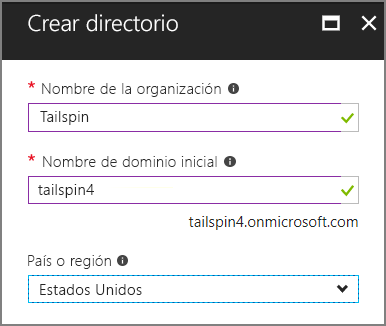

4. Haga clic en **Crear**. El nuevo directorio puede tardar unos minutos en crearse.

Para completar el escenario de un extremo a otro, necesitará un segundo directorio de Azure AD para representar a un cliente que se registra en la aplicación. Puede usar su directorio de Azure AD predeterminado (no Tailspin), o bien crear uno nuevo para este propósito. En los ejemplos, se usa Contoso como cliente ficticio.

## <a name="register-the-surveys-web-api"></a>Registro de la API web de Surveys 

1. En [Azure Portal][portal], cambie al nuevo directorio de Tailspin, para lo que debe seleccionar su cuenta en la esquina superior derecha del portal.

2. En el panel de navegación izquierdo, elija **Azure Active Directory**. 

3. Haga clic en **Registros de aplicaciones** > **Nuevo registro de aplicaciones**.

4. En la hoja **Crear**, escriba la siguiente información:

   - **Nombre**: `Surveys.WebAPI`

   - **Tipo de aplicación**: `Web app / API`

   - **URL de inicio de sesión**: `https://localhost:44301/`
   
   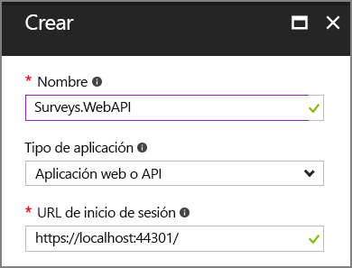 

5. Haga clic en **Crear**.

6. En la hoja **Registros de aplicaciones**, seleccione la nueva aplicación **Surveys.WebAPI**.
 
7. Haga clic en **Propiedades**.

8. En el cuadro de edición **URI de id. de aplicación**, escriba `https://<domain>/surveys.webapi`, donde `<domain>` es el nombre de dominio del directorio. Por ejemplo: `https://tailspin.onmicrosoft.com/surveys.webapi`

    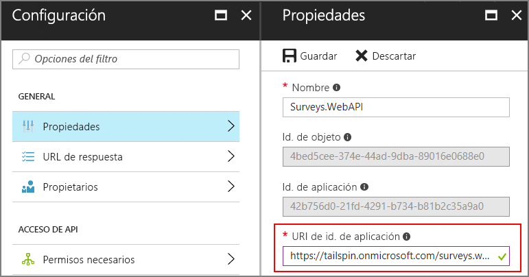

9. Establezca **Multiinquilino** en **SÍ**.

10. Haga clic en **Guardar**.

## <a name="register-the-surveys-web-app"></a>Registro de la aplicación web Surveys 

1. Vuelva a la hoja **Registros de aplicaciones** y haga clic en **Nuevo registro de aplicaciones**.

2. En la hoja **Crear**, escriba la siguiente información:

   - **Nombre**: `Surveys`
   - **Tipo de aplicación**: `Web app / API`
   - **URL de inicio de sesión**: `https://localhost:44300/`
   
   Tenga en cuenta que la dirección URL de inicio de sesión tiene un número de puerto diferente que la aplicación `Surveys.WebAPI` del paso anterior.

3. Haga clic en **Crear**.
 
4. En la hoja **Registros de aplicaciones**, seleccione la nueva aplicación **Surveys**.
 
5. Copie el identificador de la aplicación. Lo necesitará más adelante.

    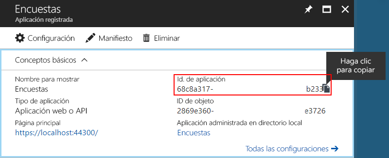

6. Haga clic en **Propiedades**.

7. En el cuadro de edición **URI de id. de aplicación**, escriba `https://<domain>/surveys`, donde `<domain>` es el nombre de dominio del directorio. 

    

8. Establezca **Multiinquilino** en **SÍ**.

9. Haga clic en **Guardar**.

10. En la hoja **Configuración**, haga clic en **URL de respuesta**.
 
11. Agregue la siguiente dirección URL de respuesta: `https://localhost:44300/signin-oidc`.

12. Haga clic en **Guardar**.

13. En **ACCESO DE API**, elija **Claves**.

14. Escriba una descripción, como `client secret`.

15. En la lista desplegable **Seleccionar duración**, seleccione **1 año**. 

16. Haga clic en **Guardar**. La clave se generará al guardar.

17. Antes de salir de esta hoja, copie el valor de la clave.

    > [!NOTE] 
    > La clave no volverá a estar visible después de salir de la hoja. 

18. En **ACCESO DE API**, haga clic en **Permisos necesarios**.

19. Haga clic en **Agregar** > **Seleccionar una API**.

20. En el cuadro de búsqueda, escriba `Surveys.WebAPI`.

    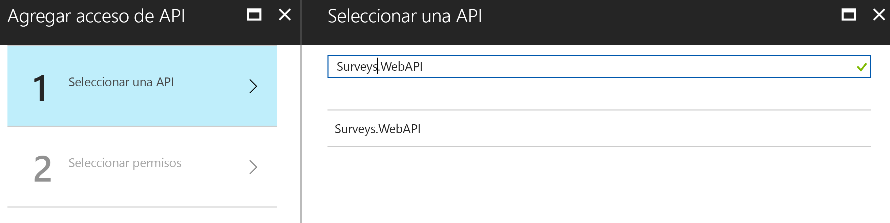

21. Seleccione `Surveys.WebAPI` y haga clic en **Seleccionar**.

22. En **Permisos delegados**, seleccione **Acceso a Surveys.WebAPI**.

    

23. Haga clic en **Seleccionar** > **Listo**.


## <a name="update-the-application-manifests"></a>Actualización de los manifiestos de aplicación

1. Vuelva a la hoja **Configuración** de la aplicación `Surveys.WebAPI`.

2. Haga clic en **Manifiesto** > **Editar**.

    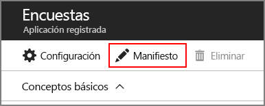
 
3. Agregue el siguiente JSON al elemento `appRoles`. Genere nuevos GUID para las propiedades `id`.

   ```json
   {
     "allowedMemberTypes": ["User"],
     "description": "Creators can create surveys",
     "displayName": "SurveyCreator",
     "id": "<Generate a new GUID. Example: 1b4f816e-5eaf-48b9-8613-7923830595ad>",
     "isEnabled": true,
     "value": "SurveyCreator"
   },
   {
     "allowedMemberTypes": ["User"],
     "description": "Administrators can manage the surveys in their tenant",
     "displayName": "SurveyAdmin",
     "id": "<Generate a new GUID>",  
     "isEnabled": true,
     "value": "SurveyAdmin"
   }
   ```

4. En la propiedad `knownClientApplications`, agregue el identificador de aplicación de la aplicación web Surveys, que obtuvo al registrar la aplicación anteriormente. Por ejemplo:

   ```json
   "knownClientApplications": ["be2cea23-aa0e-4e98-8b21-2963d494912e"],
   ```

   Esta opción agrega la aplicación Surveys a la lista de clientes autorizados para llamar a la API web.

5. Haga clic en **Guardar**.

Ahora repita los mismos pasos para la aplicación Surveys, pero no agregue una entrada para `knownClientApplications`. Use las mismas definiciones de rol, pero genere nuevos GUID para los identificadores.

## <a name="create-a-new-redis-cache-instance"></a>Creación de una instancia nueva de Redis Cache

La aplicación Surveys utiliza Redis para almacenar en caché tokens de acceso de OAuth 2. Para crear la caché:

1.  Vaya a [Azure Portal](https://portal.azure.com) y haga clic en **Nuevo** > **Databases** > **Redis Cache**.

2.  Rellene la información necesaria, incluidos el nombre DNS, el grupo de recursos, la ubicación y el plan de tarifa. Puede crear un grupo de recursos nuevo o seleccionar uno existente.

3. Haga clic en **Crear**.

4. Después de crear la instancia de Redis Cache, vaya al recurso en el portal.

5. Haga clic en **Claves de acceso** y copie la clave principal.

Para más información acerca de cómo crear una instancia de Redis Cache, consulte [Uso de Azure Redis Cache](/azure/redis-cache/cache-dotnet-how-to-use-azure-redis-cache).

## <a name="set-application-secrets"></a>Establecimiento de secretos de la aplicación

1.  Abra la solución Tailspin.Surveys en Visual Studio.

2.  En el Explorador de soluciones, haga clic con el botón derecho en el proyecto Tailspin.Surveys.Web y seleccione **Administrar secretos de usuario**.

3.  En el archivo secrets.json, pegue lo siguiente:
    
    ```json
    {
      "AzureAd": {
        "ClientId": "<Surveys application ID>",
        "ClientSecret": "<Surveys app client secret>",
        "PostLogoutRedirectUri": "https://localhost:44300/",
        "WebApiResourceId": "<Surveys.WebAPI app ID URI>"
      },
      "Redis": {
        "Configuration": "<Redis DNS name>.redis.cache.windows.net,password=<Redis primary key>,ssl=true"
      }
    }
    ```
   
    Reemplace los elementos que aparecen entre corchetes angulares como se indica a continuación:

    - `AzureAd:ClientId`: el identificador de la aplicación Surveys.
    - `AzureAd:ClientSecret`: la clave que generó al registrar la aplicación Surveys en Azure AD.
    - `AzureAd:WebApiResourceId`: URI del identificador de aplicación que especificó cuando creó la aplicación Surveys.WebAPI en Azure AD. Debe tener el formato `https://<directory>.onmicrosoft.com/surveys.webapi`
    - `Redis:Configuration`: cree esta cadena a partir del nombre DNS de la instancia de Redis Cache y la clave de acceso principal. Por ejemplo, "tailspin.redis.cache.windows.net,password=2h5tBxxx,ssl=true".

4.  Guarde el archivo actualizado secrets.json.

5.  Repita estos pasos para el proyecto Tailspin.Surveys.WebAPI y pegue lo siguiente en secrets.json. Reemplace los elementos entre corchetes angulares como se ha indicado.

    ```json
    {
      "AzureAd": {
        "WebApiResourceId": "<Surveys.WebAPI app ID URI>"
      },
      "Redis": {
        "Configuration": "<Redis DNS name>.redis.cache.windows.net,password=<Redis primary key>,ssl=true"
      }
    }
    ```

## <a name="initialize-the-database"></a>Inicialización de la base de datos

En este paso, usará Entity Framework 7 para crear una base de datos SQL local, con LocalDB.

1.  Abra una ventana de comando

2.  Navegue hasta el proyecto Tailspin.Surveys.Data.

3.  Ejecute el siguiente comando:

    ```
    dotnet ef database update --startup-project ..\Tailspin.Surveys.Web
    ```
    
## <a name="run-the-application"></a>Ejecución de la aplicación

Para ejecutar la aplicación, inicie los proyectos Tailspin.Surveys.Web y Tailspin.Surveys.WebAPI.

Puede establecer que Visual Studio se ejecute en ambos proyectos automáticamente en F5, como se indica a continuación:

1.  En el Explorador de soluciones, haga clic con el botón derecho en la solución y después en **Establecer proyectos de inicio**.
2.  Seleccione **Proyectos de inicio múltiples**.
3.  Establezca **Acción** = **Iniciar** para los proyectos Tailspin.Surveys.Web y Tailspin.Surveys.WebAPI.

## <a name="sign-up-a-new-tenant"></a>Registro de un nuevo inquilino

Cuando la aplicación se inicia, no ha iniciado sesión, por lo que verá la página de bienvenida:

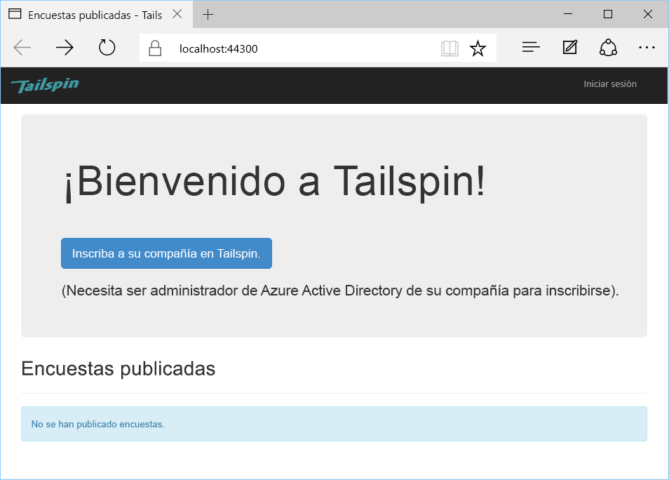

Para registrar una organización:

1. Haga clic en **Enroll your company in Tailspin** (Inscribir su compañía en Tailspin).
2. Inicie sesión en el directorio de Azure AD que representa la organización mediante la aplicación Surveys. Debe iniciar sesión como un usuario administrador.
3. Acepte la petición de consentimiento.

La aplicación registra al inquilino y, después, cierra la sesión. La aplicación cierra la sesión porque antes de usarla hay que configurar los roles de aplicación en Azure AD.

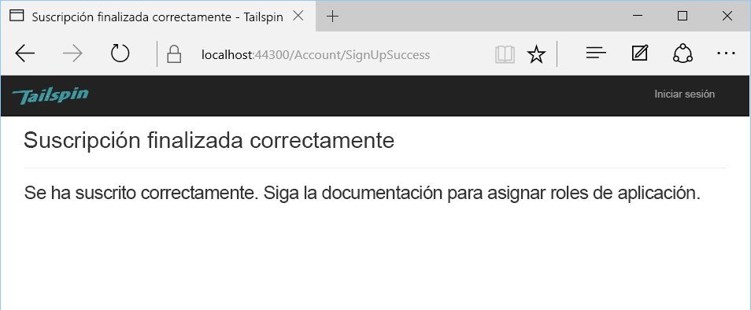

## <a name="assign-application-roles"></a>Asignación de los roles de aplicación

Cuando un inquilino se registra, un administrador de directorio AD del inquilino debe asignar los roles de aplicación a los usuarios.


1. En el [Azure Portal][portal], cambie al directorio de Azure AD que usó para registrarse en la aplicación Surveys. 

2. En el panel de navegación izquierdo, elija **Azure Active Directory**. 

3. Haga clic en **Aplicaciones empresariales** > **Todas las aplicaciones**. El portal enumerará `Survey` y `Survey.WebAPI`. Si no lo hace, asegúrese de que ha completado el proceso de registro.

4.  Haga clic en la aplicación Surveys.

5.  Haga clic en **Usuarios y grupos**.

4.  Haga clic en **Agregar usuario**.

5.  Si dispone de Azure AD Premium, haga clic en **Usuarios y grupos**. De lo contrario, haga clic en **Usuarios**. (la asignación de un rol a un grupo requiere Azure AD Premium).

6. Seleccione uno o varios usuarios y haga clic en **Seleccionar**.

    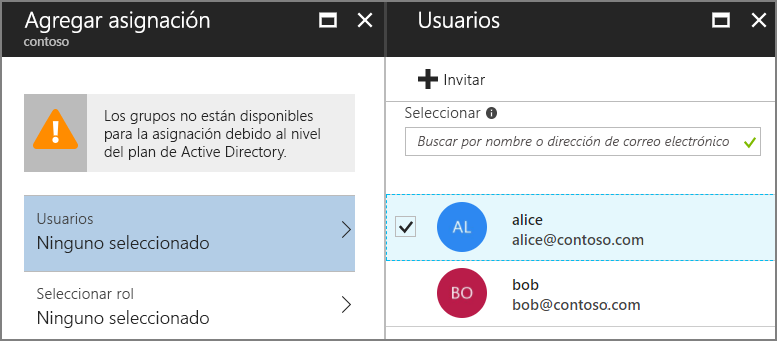

6.  Seleccione el rol y haga clic en **Seleccionar**.

    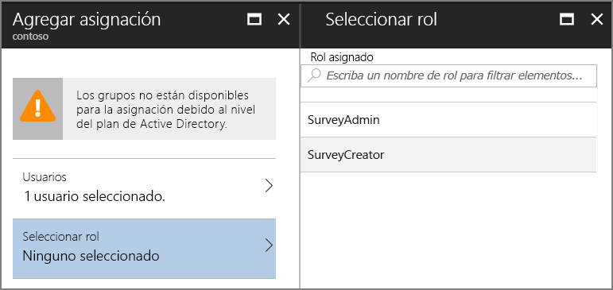

7.  Haga clic en **Asignar**.

Repita los mismos pasos para asignar los roles de la aplicación Survey.WebAPI.

> Importante: Un usuario siempre debe tener los mismos roles en Survey y en Survey.WebAPI. De lo contrario, los permisos del usuario no serán coherentes, lo que puede provocar errores de 403 (Prohibido) de la API Web.

Vuelva a la aplicación e inicie sesión de otra vez. Haga clic en **My Surveys** (Mis encuestas). Si al usuario se le asigna el rol SurveyAdmin o SurveyCreator, verá un botón **Create Survey** (Crear encuesta), que indica que el usuario tiene permisos para crear una nueva encuesta.

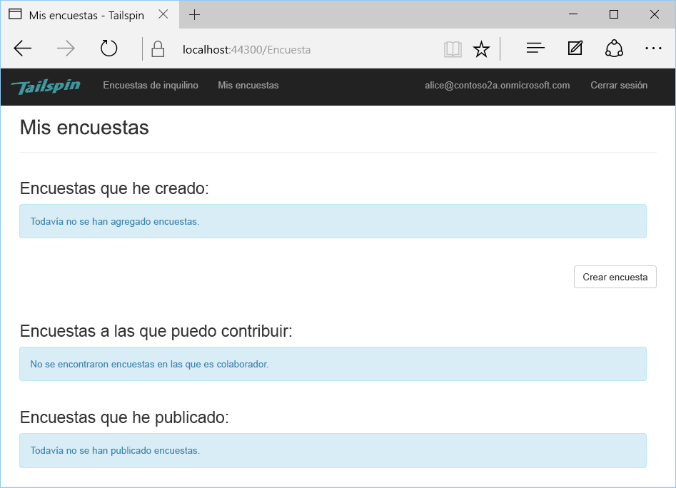


<!-- links -->

[portal]: https://portal.azure.com
[VS2017]: https://www.visualstudio.com/vs/
