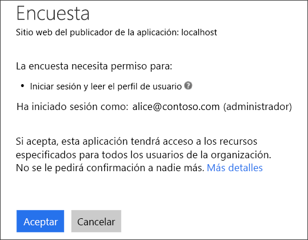
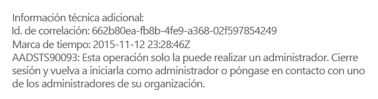
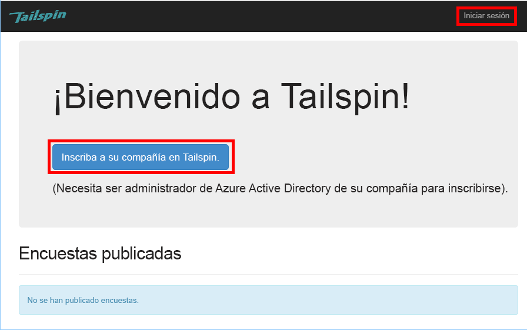
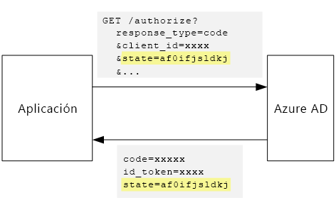

# <a name="tenant-sign-up-and-onboarding"></a><span data-ttu-id="0f88c-103">Registro e incorporación de inquilinos</span><span class="sxs-lookup"><span data-stu-id="0f88c-103">Tenant sign-up and onboarding</span></span>

<span data-ttu-id="0f88c-104">[ Código de ejemplo][sample application]</span><span class="sxs-lookup"><span data-stu-id="0f88c-104">[ Sample code][sample application]</span></span>

<span data-ttu-id="0f88c-105">En este artículo se describe cómo implementar un proceso de *registro* en una aplicación multiinquilino, lo que permite a un cliente registrar su propia organización en la aplicación.</span><span class="sxs-lookup"><span data-stu-id="0f88c-105">This article describes how to implement a *sign-up* process in a multi-tenant application, which allows a customer to sign up their organization for your application.</span></span>
<span data-ttu-id="0f88c-106">Hay varias razones que justifican la implementación de un proceso de registro:</span><span class="sxs-lookup"><span data-stu-id="0f88c-106">There are several reasons to implement a sign-up process:</span></span>

* <span data-ttu-id="0f88c-107">Permitir que un administrador de AD dé su consentimiento para que la toda la organización del cliente utilice la aplicación.</span><span class="sxs-lookup"><span data-stu-id="0f88c-107">Allow an AD admin to consent for the customer's entire organization to use the application.</span></span>
* <span data-ttu-id="0f88c-108">Recopilar del cliente información de pago con tarjeta de crédito o de otra índole.</span><span class="sxs-lookup"><span data-stu-id="0f88c-108">Collect credit card payment or other customer information.</span></span>
* <span data-ttu-id="0f88c-109">Realizar las instalaciones únicas por inquilino necesarias para la aplicación.</span><span class="sxs-lookup"><span data-stu-id="0f88c-109">Perform any one-time per-tenant setup needed by your application.</span></span>

## <a name="admin-consent-and-azure-ad-permissions"></a><span data-ttu-id="0f88c-110">Consentimiento de administrador y permisos de Azure AD</span><span class="sxs-lookup"><span data-stu-id="0f88c-110">Admin consent and Azure AD permissions</span></span>
<span data-ttu-id="0f88c-111">Para realizar la autenticación con Azure AD, la aplicación necesita acceso al directorio del usuario.</span><span class="sxs-lookup"><span data-stu-id="0f88c-111">In order to authenticate with Azure AD, an application needs access to the user's directory.</span></span> <span data-ttu-id="0f88c-112">Como mínimo, la aplicación necesita permiso para leer el perfil del usuario.</span><span class="sxs-lookup"><span data-stu-id="0f88c-112">At a minimum, the application needs permission to read the user's profile.</span></span> <span data-ttu-id="0f88c-113">La primera vez que un usuario inicie sesión, Azure AD mostrará una página de consentimiento en la que figuran los permisos que se solicitan.</span><span class="sxs-lookup"><span data-stu-id="0f88c-113">The first time that a user signs in, Azure AD shows a consent page that lists the permissions being requested.</span></span> <span data-ttu-id="0f88c-114">Al hacer clic en **Aceptar**, el usuario concede el permiso a la aplicación.</span><span class="sxs-lookup"><span data-stu-id="0f88c-114">By clicking **Accept**, the user grants permission to the application.</span></span>

<span data-ttu-id="0f88c-115">De forma predeterminada, se concede consentimiento para cada usuario de manera individualizada.</span><span class="sxs-lookup"><span data-stu-id="0f88c-115">By default, consent is granted on a per-user basis.</span></span> <span data-ttu-id="0f88c-116">Todo usuario que inicie sesión verá la página de consentimiento.</span><span class="sxs-lookup"><span data-stu-id="0f88c-116">Every user who signs in sees the consent page.</span></span> <span data-ttu-id="0f88c-117">Sin embargo, Azure AD admite también el *consentimiento del administrador*, que permite a un administrador de AD dar su consentimiento para toda la organización.</span><span class="sxs-lookup"><span data-stu-id="0f88c-117">However, Azure AD also supports  *admin consent*, which allows an AD administrator to consent for an entire organization.</span></span>

<span data-ttu-id="0f88c-118">Cuando se usa el flujo de consentimiento del administrador, la página de consentimiento indica que el administrador de AD concede permiso en nombre de todo el inquilino:</span><span class="sxs-lookup"><span data-stu-id="0f88c-118">When the admin consent flow is used, the consent page states that the AD admin is granting permission on behalf of the entire tenant:</span></span>



<span data-ttu-id="0f88c-120">Una vez que el administrador haga clic en **Aceptar**, otros usuarios dentro del mismo inquilino podrán iniciar sesión y Azure AD omitirá la pantalla de consentimiento.</span><span class="sxs-lookup"><span data-stu-id="0f88c-120">After the admin clicks **Accept**, other users within the same tenant can sign in, and Azure AD will skip the consent screen.</span></span>

<span data-ttu-id="0f88c-121">Únicamente un administrador de AD puede dar consentimiento de administrador, puesto que concede permiso en nombre de toda la organización.</span><span class="sxs-lookup"><span data-stu-id="0f88c-121">Only an AD administrator can give admin consent, because it grants permission on behalf of the entire organization.</span></span> <span data-ttu-id="0f88c-122">Si un usuario no administrador intenta autenticarse con el flujo del consentimiento de administrador, Azure AD mostrará un error:</span><span class="sxs-lookup"><span data-stu-id="0f88c-122">If a non-administrator tries to authenticate with the admin consent flow, Azure AD displays an error:</span></span>



<span data-ttu-id="0f88c-124">Si la aplicación requiere permisos adicionales en un momento posterior, el cliente deberá registrarse de nuevo y dar su consentimiento a los permisos actualizados.</span><span class="sxs-lookup"><span data-stu-id="0f88c-124">If the application requires additional permissions at a later point, the customer will need to sign up again and consent to the updated permissions.</span></span>  

## <a name="implementing-tenant-sign-up"></a><span data-ttu-id="0f88c-125">Implementación del registro de inquilino</span><span class="sxs-lookup"><span data-stu-id="0f88c-125">Implementing tenant sign-up</span></span>
<span data-ttu-id="0f88c-126">En la aplicación [Surveys de Tailspin][Tailspin],  se han definido varios requisitos para el proceso de suscripción:</span><span class="sxs-lookup"><span data-stu-id="0f88c-126">For the [Tailspin Surveys][Tailspin] application,  we defined several requirements for the sign-up process:</span></span>

* <span data-ttu-id="0f88c-127">Un inquilino debe registrarse antes de que los usuarios puedan iniciar sesión.</span><span class="sxs-lookup"><span data-stu-id="0f88c-127">A tenant must sign up before users can sign in.</span></span>
* <span data-ttu-id="0f88c-128">El registro emplea el flujo del consentimiento de administrador.</span><span class="sxs-lookup"><span data-stu-id="0f88c-128">Sign-up uses the admin consent flow.</span></span>
* <span data-ttu-id="0f88c-129">El registro agrega al inquilino del usuario a la base de datos de la aplicación.</span><span class="sxs-lookup"><span data-stu-id="0f88c-129">Sign-up adds the user's tenant to the application database.</span></span>
* <span data-ttu-id="0f88c-130">Una vez que se registre un inquilino, la página mostrará una página de incorporación.</span><span class="sxs-lookup"><span data-stu-id="0f88c-130">After a tenant signs up, the application shows an onboarding page.</span></span>

<span data-ttu-id="0f88c-131">En esta sección, le guiaremos a través de la implementación del proceso de registro.</span><span class="sxs-lookup"><span data-stu-id="0f88c-131">In this section, we'll walk through our implementation of the sign-up process.</span></span>
<span data-ttu-id="0f88c-132">Es importante comprender que "registrarse" e "iniciar sesión" son conceptos de la aplicación.</span><span class="sxs-lookup"><span data-stu-id="0f88c-132">It's important to understand that "sign up" versus "sign in" is an application concept.</span></span> <span data-ttu-id="0f88c-133">Durante el flujo de autenticación, Azure AD no puede saber si el usuario está en un proceso de registro.</span><span class="sxs-lookup"><span data-stu-id="0f88c-133">During the authentication flow, Azure AD does not inherently know whether the user is in process of signing up.</span></span> <span data-ttu-id="0f88c-134">Corresponde a la aplicación controlar el contexto.</span><span class="sxs-lookup"><span data-stu-id="0f88c-134">It's up to the application to keep track of the context.</span></span>

<span data-ttu-id="0f88c-135">Cuando un usuario anónimo visita la aplicación Surveys, se le presentan dos botones: uno para iniciar sesión y otro para inscribir a su empresa (registrarla).</span><span class="sxs-lookup"><span data-stu-id="0f88c-135">When an anonymous user visits the Surveys application, the user is shown two buttons, one to sign in, and one to "enroll your company" (sign up).</span></span>



<span data-ttu-id="0f88c-137">Estos botones invocan a acciones de la clase `AccountController`.</span><span class="sxs-lookup"><span data-stu-id="0f88c-137">These buttons invoke actions in the `AccountController` class.</span></span>

<span data-ttu-id="0f88c-138">La acción `SignIn` devuelve un valor **ChallegeResult**que hace que el software intermedio OpenID Connect redirija al punto de conexión de autenticación.</span><span class="sxs-lookup"><span data-stu-id="0f88c-138">The `SignIn` action returns a **ChallegeResult**, which causes the OpenID Connect middleware to redirect to the authentication endpoint.</span></span> <span data-ttu-id="0f88c-139">Esta es la manera predeterminada de desencadenar la autenticación en ASP.NET Core.</span><span class="sxs-lookup"><span data-stu-id="0f88c-139">This is the default way to trigger authentication in ASP.NET Core.</span></span>  

```csharp
[AllowAnonymous]
public IActionResult SignIn()
{
    return new ChallengeResult(
        OpenIdConnectDefaults.AuthenticationScheme,
        new AuthenticationProperties
        {
            IsPersistent = true,
            RedirectUri = Url.Action("SignInCallback", "Account")
        });
}
```

<span data-ttu-id="0f88c-140">Ahora compare la acción `SignUp` :</span><span class="sxs-lookup"><span data-stu-id="0f88c-140">Now compare the `SignUp` action:</span></span>

```csharp
[AllowAnonymous]
public IActionResult SignUp()
{
    var state = new Dictionary<string, string> { { "signup", "true" }};
    return new ChallengeResult(
        OpenIdConnectDefaults.AuthenticationScheme,
        new AuthenticationProperties(state)
        {
            RedirectUri = Url.Action(nameof(SignUpCallback), "Account")
        });
}
```

<span data-ttu-id="0f88c-141">Al igual que `SignIn`, la acción `SignUp` también devuelve `ChallengeResult`.</span><span class="sxs-lookup"><span data-stu-id="0f88c-141">Like `SignIn`, the `SignUp` action also returns a `ChallengeResult`.</span></span> <span data-ttu-id="0f88c-142">Pero esta vez, agregamos una parte de la información de estado para `AuthenticationProperties` en `ChallengeResult`:</span><span class="sxs-lookup"><span data-stu-id="0f88c-142">But this time, we add a piece of state information to the `AuthenticationProperties` in the `ChallengeResult`:</span></span>

* <span data-ttu-id="0f88c-143">signup: una marca booleana que indica que el usuario ha iniciado el proceso de registro.</span><span class="sxs-lookup"><span data-stu-id="0f88c-143">signup: A Boolean flag, indicating that the user has started the sign-up process.</span></span>

<span data-ttu-id="0f88c-144">La información de estado de `AuthenticationProperties` se agregará al parámetro [state] de OpenID Connect, que va y viene durante el flujo de autenticación.</span><span class="sxs-lookup"><span data-stu-id="0f88c-144">The state information in `AuthenticationProperties` gets added to the OpenID Connect [state] parameter, which round trips during the authentication flow.</span></span>



<span data-ttu-id="0f88c-146">Cuando el usuario se autentica en Azure AD y se le redirige de nuevo a la aplicación, el vale de autenticación contiene el estado.</span><span class="sxs-lookup"><span data-stu-id="0f88c-146">After the user authenticates in Azure AD and gets redirected back to the application, the authentication ticket contains the state.</span></span> <span data-ttu-id="0f88c-147">Estamos usando este hecho para asegurarnos de que el valor "signup" se conserva en todo el flujo de autenticación.</span><span class="sxs-lookup"><span data-stu-id="0f88c-147">We are using this fact to make sure the "signup" value persists across the entire authentication flow.</span></span>

## <a name="adding-the-admin-consent-prompt"></a><span data-ttu-id="0f88c-148">Incorporación de la petición de consentimiento del administrador</span><span class="sxs-lookup"><span data-stu-id="0f88c-148">Adding the admin consent prompt</span></span>
<span data-ttu-id="0f88c-149">En Azure AD, el flujo del consentimiento de administración se activa mediante la adición de un parámetro "prompt" a la cadena de consulta de la solicitud de autenticación:</span><span class="sxs-lookup"><span data-stu-id="0f88c-149">In Azure AD, the admin consent flow is triggered by adding a "prompt" parameter to the query string in the authentication request:</span></span>

```
/authorize?prompt=admin_consent&...
```

<span data-ttu-id="0f88c-150">La aplicación Surveys agrega la solicitud durante el evento `RedirectToAuthenticationEndpoint` .</span><span class="sxs-lookup"><span data-stu-id="0f88c-150">The Surveys application adds the prompt during the `RedirectToAuthenticationEndpoint` event.</span></span> <span data-ttu-id="0f88c-151">A este evento se le llama justo antes de que el software intermedio redirija al punto de conexión de autenticación.</span><span class="sxs-lookup"><span data-stu-id="0f88c-151">This event is called right before the middleware redirects to the authentication endpoint.</span></span>

```csharp
public override Task RedirectToAuthenticationEndpoint(RedirectContext context)
{
    if (context.IsSigningUp())
    {
        context.ProtocolMessage.Prompt = "admin_consent";
    }

    _logger.RedirectToIdentityProvider();
    return Task.FromResult(0);
}
```

<span data-ttu-id="0f88c-152">Al establecer` ProtocolMessage.Prompt` , se indica al software intermedio que agregue el parámetro "prompt" a la solicitud de autenticación.</span><span class="sxs-lookup"><span data-stu-id="0f88c-152">Setting` ProtocolMessage.Prompt` tells the middleware to add the "prompt" parameter to the authentication request.</span></span>

<span data-ttu-id="0f88c-153">Tenga en cuenta que este valor de solicitud solo es necesario durante el registro.</span><span class="sxs-lookup"><span data-stu-id="0f88c-153">Note that the prompt is only needed during sign-up.</span></span> <span data-ttu-id="0f88c-154">El inicio de sesión normal no debe incluirlo.</span><span class="sxs-lookup"><span data-stu-id="0f88c-154">Regular sign-in should not include it.</span></span> <span data-ttu-id="0f88c-155">Para distinguir entre ellos, se comprueba el valor `signup` en el estado de autenticación.</span><span class="sxs-lookup"><span data-stu-id="0f88c-155">To distinguish between them, we check for the `signup` value in the authentication state.</span></span> <span data-ttu-id="0f88c-156">El siguiente método de extensión comprueba esta condición:</span><span class="sxs-lookup"><span data-stu-id="0f88c-156">The following extension method checks for this condition:</span></span>

```csharp
internal static bool IsSigningUp(this BaseControlContext context)
{
    Guard.ArgumentNotNull(context, nameof(context));

    string signupValue;
    // Check the HTTP context and convert to string
    if ((context.Ticket == null) ||
        (!context.Ticket.Properties.Items.TryGetValue("signup", out signupValue)))
    {
        return false;
    }

    // We have found the value, so see if it's valid
    bool isSigningUp;
    if (!bool.TryParse(signupValue, out isSigningUp))
    {
        // The value for signup is not a valid boolean, throw                
        throw new InvalidOperationException($"'{signupValue}' is an invalid boolean value");
    }

    return isSigningUp;
}
```

## <a name="registering-a-tenant"></a><span data-ttu-id="0f88c-157">Registro de un inquilino</span><span class="sxs-lookup"><span data-stu-id="0f88c-157">Registering a Tenant</span></span>
<span data-ttu-id="0f88c-158">La aplicación Surveys almacena parte de la información sobre cada inquilino y usuario en la base de datos de la aplicación.</span><span class="sxs-lookup"><span data-stu-id="0f88c-158">The Surveys application stores some information about each tenant and user in the application database.</span></span>


<span data-ttu-id="0f88c-160">En la tabla Tenant, IssuerValue es el valor de la notificación del emisor del inquilino.</span><span class="sxs-lookup"><span data-stu-id="0f88c-160">In the Tenant table, IssuerValue is the value of the issuer claim for the tenant.</span></span> <span data-ttu-id="0f88c-161">En el caso de Azure AD, se trata de `https://sts.windows.net/<tentantID>` y proporciona un valor único por inquilino.</span><span class="sxs-lookup"><span data-stu-id="0f88c-161">For Azure AD, this is `https://sts.windows.net/<tentantID>` and gives a unique value per tenant.</span></span>

<span data-ttu-id="0f88c-162">Cuando se suscribe un nuevo inquilino, la aplicación Surveys escribe un registro del inquilino en la base de datos.</span><span class="sxs-lookup"><span data-stu-id="0f88c-162">When a new tenant signs up, the Surveys application writes a tenant record to the database.</span></span> <span data-ttu-id="0f88c-163">Esto sucede dentro del evento `AuthenticationValidated`.</span><span class="sxs-lookup"><span data-stu-id="0f88c-163">This happens inside the `AuthenticationValidated` event.</span></span> <span data-ttu-id="0f88c-164">(no lo haga antes de este evento, porque el token del identificador aún no estará validado, por lo que no podrá confiar en los valores de notificación.</span><span class="sxs-lookup"><span data-stu-id="0f88c-164">(Don't do it before this event, because the ID token won't be validated yet, so you can't trust the claim values.</span></span> <span data-ttu-id="0f88c-165">Consulte [Autenticación].</span><span class="sxs-lookup"><span data-stu-id="0f88c-165">See [Authentication].</span></span>

<span data-ttu-id="0f88c-166">Este es el código relevante de la aplicación Surveys:</span><span class="sxs-lookup"><span data-stu-id="0f88c-166">Here is the relevant code from the Surveys application:</span></span>

```csharp
public override async Task TokenValidated(TokenValidatedContext context)
{
    var principal = context.AuthenticationTicket.Principal;
    var userId = principal.GetObjectIdentifierValue();
    var tenantManager = context.HttpContext.RequestServices.GetService<TenantManager>();
    var userManager = context.HttpContext.RequestServices.GetService<UserManager>();
    var issuerValue = principal.GetIssuerValue();
    _logger.AuthenticationValidated(userId, issuerValue);

    // Normalize the claims first.
    NormalizeClaims(principal);
    var tenant = await tenantManager.FindByIssuerValueAsync(issuerValue)
        .ConfigureAwait(false);

    if (context.IsSigningUp())
    {
        if (tenant == null)
        {
            tenant = await SignUpTenantAsync(context, tenantManager)
                .ConfigureAwait(false);
        }

        // In this case, we need to go ahead and set up the user signing us up.
        await CreateOrUpdateUserAsync(context.Ticket, userManager, tenant)
            .ConfigureAwait(false);
    }
    else
    {
        if (tenant == null)
        {
            _logger.UnregisteredUserSignInAttempted(userId, issuerValue);
            throw new SecurityTokenValidationException($"Tenant {issuerValue} is not registered");
        }

        await CreateOrUpdateUserAsync(context.Ticket, userManager, tenant)
            .ConfigureAwait(false);
    }
}
```

<span data-ttu-id="0f88c-167">Este código hace lo siguiente:</span><span class="sxs-lookup"><span data-stu-id="0f88c-167">This code does the following:</span></span>

1. <span data-ttu-id="0f88c-168">Compruebe si el valor de emisor del inquilino ya está en la base de datos.</span><span class="sxs-lookup"><span data-stu-id="0f88c-168">Check if the tenant's issuer value is already in the database.</span></span> <span data-ttu-id="0f88c-169">Si no se ha registrado el inquilino, `FindByIssuerValueAsync` se devuelve null.</span><span class="sxs-lookup"><span data-stu-id="0f88c-169">If the tenant has not signed up, `FindByIssuerValueAsync` returns null.</span></span>
2. <span data-ttu-id="0f88c-170">Si el usuario se está registrando:</span><span class="sxs-lookup"><span data-stu-id="0f88c-170">If the user is signing up:</span></span>
   1. <span data-ttu-id="0f88c-171">Agregue el inquilino a la base de datos (`SignUpTenantAsync`).</span><span class="sxs-lookup"><span data-stu-id="0f88c-171">Add the tenant to the database (`SignUpTenantAsync`).</span></span>
   2. <span data-ttu-id="0f88c-172">Agregue el usuario autenticado a la base de datos (`CreateOrUpdateUserAsync`).</span><span class="sxs-lookup"><span data-stu-id="0f88c-172">Add the authenticated user to the database (`CreateOrUpdateUserAsync`).</span></span>
3. <span data-ttu-id="0f88c-173">En caso contrario, complete el flujo normal de inicio de sesión:</span><span class="sxs-lookup"><span data-stu-id="0f88c-173">Otherwise complete the normal sign-in flow:</span></span>
   1. <span data-ttu-id="0f88c-174">Si no se encontró el emisor del inquilino en la base de datos, el inquilino no está registrado y el cliente debe registrarse.</span><span class="sxs-lookup"><span data-stu-id="0f88c-174">If the tenant's issuer was not found in the database, it means the tenant is not registered, and the customer needs to sign up.</span></span> <span data-ttu-id="0f88c-175">En ese caso, se produce una excepción para provocar un error en la autenticación.</span><span class="sxs-lookup"><span data-stu-id="0f88c-175">In that case, throw an exception to cause the authentication to fail.</span></span>
   2. <span data-ttu-id="0f88c-176">De no ser así, cree un registro de base de datos para este usuario, si no hay todavía ninguno (`CreateOrUpdateUserAsync`).</span><span class="sxs-lookup"><span data-stu-id="0f88c-176">Otherwise, create a database record for this user, if there isn't one already (`CreateOrUpdateUserAsync`).</span></span>

<span data-ttu-id="0f88c-177">Este es el método `SignUpTenantAsync` que agrega el inquilino a la base de datos.</span><span class="sxs-lookup"><span data-stu-id="0f88c-177">Here is the `SignUpTenantAsync` method that adds the tenant to the database.</span></span>

```csharp
private async Task<Tenant> SignUpTenantAsync(BaseControlContext context, TenantManager tenantManager)
{
    Guard.ArgumentNotNull(context, nameof(context));
    Guard.ArgumentNotNull(tenantManager, nameof(tenantManager));

    var principal = context.Ticket.Principal;
    var issuerValue = principal.GetIssuerValue();
    var tenant = new Tenant
    {
        IssuerValue = issuerValue,
        Created = DateTimeOffset.UtcNow
    };

    try
    {
        await tenantManager.CreateAsync(tenant)
            .ConfigureAwait(false);
    }
    catch(Exception ex)
    {
        _logger.SignUpTenantFailed(principal.GetObjectIdentifierValue(), issuerValue, ex);
        throw;
    }

    return tenant;
}
```

<span data-ttu-id="0f88c-178">Este es un resumen del flujo de registro completo en la aplicación Surveys:</span><span class="sxs-lookup"><span data-stu-id="0f88c-178">Here is a summary of the entire sign-up flow in the Surveys application:</span></span>

1. <span data-ttu-id="0f88c-179">El usuario hace clic en el **Sign Up** (Registrarse).</span><span class="sxs-lookup"><span data-stu-id="0f88c-179">The user clicks the **Sign Up** button.</span></span>
2. <span data-ttu-id="0f88c-180">La acción `AccountController.SignUp` devuelve un resultado de desafío.</span><span class="sxs-lookup"><span data-stu-id="0f88c-180">The `AccountController.SignUp` action returns a challege result.</span></span>  <span data-ttu-id="0f88c-181">El estado de autenticación incluye el valor "signup".</span><span class="sxs-lookup"><span data-stu-id="0f88c-181">The authentication state includes "signup" value.</span></span>
3. <span data-ttu-id="0f88c-182">En el evento `RedirectToAuthenticationEndpoint`, agregue el mensaje `admin_consent`.</span><span class="sxs-lookup"><span data-stu-id="0f88c-182">In the `RedirectToAuthenticationEndpoint` event, add the `admin_consent` prompt.</span></span>
4. <span data-ttu-id="0f88c-183">El software intermedio OpenID Connect se redirige a Azure AD y el usuario se autentica.</span><span class="sxs-lookup"><span data-stu-id="0f88c-183">The OpenID Connect middleware redirects to Azure AD and the user authenticates.</span></span>
5. <span data-ttu-id="0f88c-184">En el evento `AuthenticationValidated` , busque el estado de "signup".</span><span class="sxs-lookup"><span data-stu-id="0f88c-184">In the `AuthenticationValidated` event, look for the "signup" state.</span></span>
6. <span data-ttu-id="0f88c-185">Agregue el inquilino a la base de datos.</span><span class="sxs-lookup"><span data-stu-id="0f88c-185">Add the tenant to the database.</span></span>

<span data-ttu-id="0f88c-186">[**Siguiente**][app roles]</span><span class="sxs-lookup"><span data-stu-id="0f88c-186">[**Next**][app roles]</span></span>

<!-- Links -->
[app roles]: app-roles.md
[Tailspin]: tailspin.md

[state]: http://openid.net/specs/openid-connect-core-1_0.html#AuthRequest
[Autenticación]: authenticate.md
[sample application]: https://github.com/mspnp/multitenant-saas-guidance
