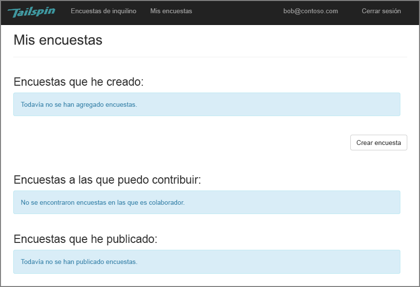
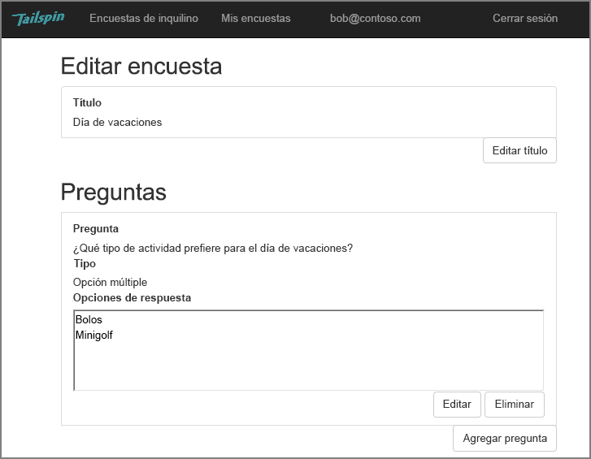
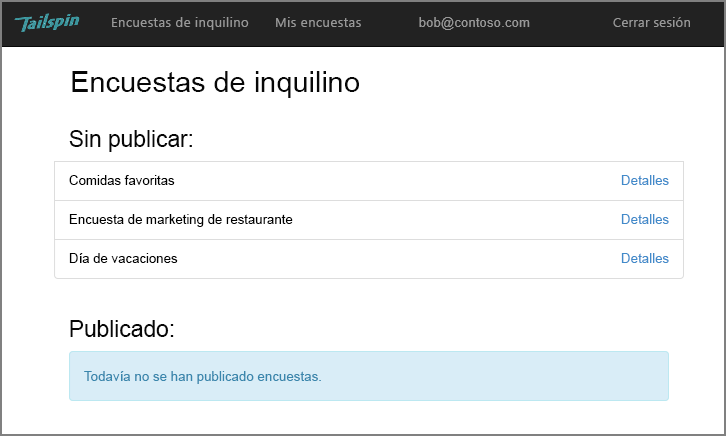
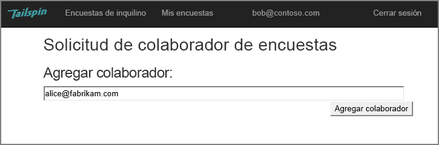
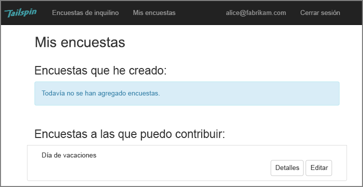
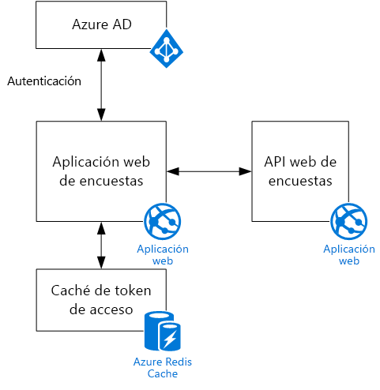

# El escenario de TailspinThe Tailspin scenario

[ Código de ejemplo][sample application][ Sample code][sample application]

Tailspin es una compañía ficticia que está desarrollando una aplicación SaaS llamada Surveys.Tailspin is a fictitious company that is developing a SaaS application named Surveys. Esta aplicación permite a las organizaciones crear y publicar encuestas en línea.This application enables organizations to create and publish online surveys.

* Una organización puede suscribirse a la aplicación.An organization can sign up for the application.
* Después de que la organización se ha suscrito, los usuarios pueden iniciar sesión en la aplicación con las credenciales de la organización.After the organization is signed up, users can sign into the application with their organizational credentials.
* Los usuarios pueden crear, editar y publicar encuestas.Users can create, edit, and publish surveys.

> [!NOTE]
> Para empezar a trabajar con la aplicación, consulte [Running the Surveys application ] (Ejecución de la aplicación Surveys).To get started with the application, see [Run the Surveys application].
> 
> 

## Los usuarios pueden crear, editar y visualizar encuestas.Users can create, edit, and view surveys
Un usuario no autenticado puede ver todas las encuestas que ha creado, o sobre las que tiene derechos de colaborador, y crear nuevas encuestas.An authenticated user can view all the surveys that he or she has created or has contributor rights to, and create new surveys. Observe que el usuario ha iniciado sesión con su identidad organizativa, `bob@contoso.com`.Notice that the user is signed in with his organizational identity, `bob@contoso.com`.

Esta captura de pantalla muestra la página Edit Survey (Editar encuesta):This screenshot shows the Edit Survey page:

Los usuarios también pueden ver todas las encuestas creadas por otros usuarios del mismo inquilino.Users can also view any surveys created by other users within the same tenant.

## Los propietarios de encuestas pueden invitar a colaboradoresSurvey owners can invite contributors
Cuando un usuario crea una encuesta, puede invitar a otras personas a ser colaboradores en la misma.When a user creates a survey, he or she can invite other people to be contributors on the survey. Los colaboradores pueden modificar la encuesta, pero no pueden eliminarla ni publicarla.Contributors can edit the survey, but cannot delete or publish it.  

Un usuario puede agregar colaboradores de otros inquilinos, lo que permite compartir recursos entre inquilinos.A user can add contributors from other tenants, which enables cross-tenant sharing of resources. En esta captura de pantalla, Bob (`bob@contoso.com`) está agregando a Alice (`alice@fabrikam.com`) como colaboradora a una encuesta que Bob ha creado.In this screenshot, Bob (`bob@contoso.com`) is adding Alice (`alice@fabrikam.com`) as a contributor to a survey that Bob created.

Cuando Alice inicia sesión, ve la encuesta que aparece en la lista de "Surveys I can contribute to" (Encuestas en las que puedo colaborar).When Alice logs in, she sees the survey listed under "Surveys I can contribute to".

Tenga en cuenta que Alice inicia sesión en su propio inquilino, no como un invitado del inquilino Contoso.Note that Alice signs into her own tenant, not as a guest of the Contoso tenant. Alice dispone de permisos de colaborador solo para esa encuesta pero no puede ver otras encuestas desde el inquilino Contoso.Alice has contributor permissions only for that survey &mdash; she cannot view other surveys from the Contoso tenant.

## ArquitecturaArchitecture
La aplicación Surveys consta de un front-end web y un back-end de API web.The Surveys application consists of a web front end and a web API backend. Ambos se implementan mediante [ASP.NET Core].Both are implemented using [ASP.NET Core].

La aplicación web utiliza Azure Active Directory (Azure AD) para autenticar a los usuarios.The web application uses Azure Active Directory (Azure AD) to authenticate users. La aplicación web también llama a Azure AD para obtener tokens de acceso de OAuth 2 para la API Web.The web application also calls Azure AD to get OAuth 2 access tokens for the Web API. Los tokens de acceso se almacenan en Azure Redis Cache.Access tokens are cached in Azure Redis Cache. La memoria caché habilita a varias instancias para compartir la misma caché de token (por ejemplo, en una granja de servidores).The cache enables multiple instances to share the same token cache (e.g., in a server farm).

[**Siguiente**][authentication][**Next**][authentication]

<!-- Links -->

[authentication]: authenticate.md

[Running the Surveys application ]: ./run-the-app.md
[Run the Surveys application]: ./run-the-app.md
[ASP.NET Core]: /aspnet/core
[sample application]: https://github.com/mspnp/multitenant-saas-guidance
