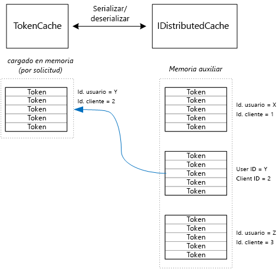

# <a name="cache-access-tokens"></a>Almacenamiento en caché de los tokens de acceso

[ Código de ejemplo][sample application]

Es relativamente costoso obtener un token acceso de OAuth, porque requiere una solicitud HTTP al punto de conexión del token. Por lo tanto, es bueno almacenar tokens en caché siempre que sea posible. La [biblioteca de autenticación de Azure AD][ADAL] almacena automáticamente en caché los tokens obtenidos de Azure AD, incluidos los tokens de actualización.

ADAL proporciona una implementación de caché de tokens predeterminada. Sin embargo, esta caché de tokens está diseñada para aplicaciones cliente nativas y **no** es adecuada para aplicaciones web:

* Es una instancia estática y no es segura para subprocesos.
* No se escala a un gran número de usuarios, ya que los tokens de todos los usuarios van en el mismo diccionario.
* No se puede compartir entre servidores web en una granja.

En su lugar, debe implementar una caché de tokens personalizada que se derive de la clase `TokenCache` de ADAL pero que sea adecuada para un entorno de servidor y proporcione el nivel de aislamiento deseable entre los tokens de los diferentes usuarios.

La clase `TokenCache` almacena un diccionario de tokens, indexado por emisor, recurso, identificador de cliente y usuario. Una caché de tokens personalizada debe escribir este diccionario en una memoria auxiliar, como una caché en Redis.

En la aplicación Tailspin Survey, la clase `DistributedTokenCache` implementa la caché del token. Esta implementación usa la abstracción [IDistributedCache][distributed-cache] de ASP.NET Core. De este modo, cualquier implementación `IDistributedCache` se puede usar como memoria auxiliar.

* De forma predeterminada, la aplicación Surveys utiliza una caché en Redis.
* Para un servidor web de instancia única, podría utilizar ASP.NET Core [en la caché en memoria][in-memory-cache]. (Esto también es una buena opción para ejecutar la aplicación de forma local durante el desarrollo).

`DistributedTokenCache` almacena los datos de la memoria caché como pares de clave/valor en la memoria auxiliar. La clave es el identificador de usuario más el identificador de cliente, por lo que la memoria auxiliar contiene datos de caché independientes para cada combinación única de usuario/cliente.



Las particiones de la memoria auxiliar las realiza el usuario. Para cada solicitud HTTP, los tokens de ese usuario se leen desde la memoria auxiliar y se cargan en el diccionario `TokenCache` . Si Redis se utiliza como memoria auxiliar, cada una de las instancias de servidor de una granja de servidores lee/escribe en la misma caché, y este enfoque se escala a muchos usuarios.

## <a name="encrypting-cached-tokens"></a>Cifrado de tokens almacenados en caché
Los tokens son datos confidenciales, ya que conceden acceso a los recursos de un usuario. (Además, a diferencia de la contraseña del usuario, no puede almacenar simplemente un hash del token). Por lo tanto, es fundamental proteger los tokens para que no se vean comprometidos. La memoria caché con respaldo de Redis está protegida por una contraseña, pero si un usuario la obtiene, podría conseguir todos los tokens de acceso almacenados en caché. Por esta razón, `DistributedTokenCache` cifra todo lo que escribe en la memoria auxiliar. El cifrado se realiza mediante las API de [protección de datos][data-protection] de ASP.NET Core.

> [!NOTE]
> Si implementa en sitios web de Azure, se hace una copia de seguridad de las claves de cifrado en el almacenamiento de red y se sincronizan en todos los equipos (vea [Duración y administración de claves][key-management]). De forma predeterminada, las claves no se cifran cuando se ejecutan en sitios web de Azure, pero puede [habilitar el cifrado mediante un certificado X.509][x509-cert-encryption].
> 
> 

## <a name="distributedtokencache-implementation"></a>Implementación de DistributedTokenCache
La clase `DistributedTokenCache` se deriva de la clase [TokenCache][tokencache-class] de la biblioteca de autenticación de Azure AD.

En el constructor, la clase `DistributedTokenCache` crea una clave para el usuario actual y la carga la memoria caché desde la memoria auxiliar:

```csharp
public DistributedTokenCache(
    ClaimsPrincipal claimsPrincipal,
    IDistributedCache distributedCache,
    ILoggerFactory loggerFactory,
    IDataProtectionProvider dataProtectionProvider)
    : base()
{
    _claimsPrincipal = claimsPrincipal;
    _cacheKey = BuildCacheKey(_claimsPrincipal);
    _distributedCache = distributedCache;
    _logger = loggerFactory.CreateLogger<DistributedTokenCache>();
    _protector = dataProtectionProvider.CreateProtector(typeof(DistributedTokenCache).FullName);
    AfterAccess = AfterAccessNotification;
    LoadFromCache();
}
```

La clave se crea concatenando el identificador de usuario y el identificador de cliente. Ambos se toman de las notificaciones encontradas en `ClaimsPrincipal`del usuario:

```csharp
private static string BuildCacheKey(ClaimsPrincipal claimsPrincipal)
{
    string clientId = claimsPrincipal.FindFirstValue("aud", true);
    return string.Format(
        "UserId:{0}::ClientId:{1}",
        claimsPrincipal.GetObjectIdentifierValue(),
        clientId);
}
```

Para cargar los datos de la memoria caché, lea el blob serializado desde la memoria auxiliar y llame a `TokenCache.Deserialize` para convertir el blob en datos de memoria caché.

```csharp
private void LoadFromCache()
{
    byte[] cacheData = _distributedCache.Get(_cacheKey);
    if (cacheData != null)
    {
        this.Deserialize(_protector.Unprotect(cacheData));
    }
}
```

Cada vez que ADAL acceda a la memoria caché, se activará un evento `AfterAccess` . Si han cambiado los datos de la memoria caché, la propiedad `HasStateChanged` es true. En ese caso, actualice la memoria auxiliar para reflejar el cambio y, a continuación, establezca `HasStateChanged` en false.

```csharp
public void AfterAccessNotification(TokenCacheNotificationArgs args)
{
    if (this.HasStateChanged)
    {
        try
        {
            if (this.Count > 0)
            {
                _distributedCache.Set(_cacheKey, _protector.Protect(this.Serialize()));
            }
            else
            {
                // There are no tokens for this user/client, so remove the item from the cache.
                _distributedCache.Remove(_cacheKey);
            }
            this.HasStateChanged = false;
        }
        catch (Exception exp)
        {
            _logger.WriteToCacheFailed(exp);
            throw;
        }
    }
}
```

TokenCache envía otros dos eventos:

* `BeforeWrite`. Se le llama inmediatamente antes de que ADAL escriba en la memoria caché. Puede utilizar esto para implementar una estrategia de simultaneidad
* `BeforeAccess`. Se le llama inmediatamente antes de que ADAL lea desde la memoria caché. Aquí puede volver a cargar la memoria caché para obtener la versión más reciente.

En nuestro caso, decidimos no administrar estos dos eventos.

* Para la simultaneidad, la última escritura tiene prioridad. Eso está bien, porque los tokens se almacenan por separado para cada usuario + cliente, por lo que solo podría ocurrir un conflicto si el mismo usuario tuviera dos inicios de sesión abiertos simultáneamente.
* En el caso de la lectura, cargamos la memoria caché en cada solicitud. Las solicitudes tienen poca vigencia. Si se modifica la memoria caché en ese tiempo, la siguiente solicitud recogerá el nuevo valor.

[**Siguiente**][client-assertion]

<!-- links -->
[ADAL]: https://msdn.microsoft.com/library/azure/jj573266.aspx
[client-assertion]: ./client-assertion.md
[data-protection]: /aspnet/core/security/data-protection/
[distributed-cache]: /aspnet/core/performance/caching/distributed
[key-management]: /aspnet/core/security/data-protection/configuration/default-settings
[in-memory-cache]: /aspnet/core/performance/caching/memory
[tokencache-class]: https://msdn.microsoft.com/library/azure/microsoft.identitymodel.clients.activedirectory.tokencache.aspx
[x509-cert-encryption]: /aspnet/core/security/data-protection/implementation/key-encryption-at-rest#x509-certificate
[sample application]: https://github.com/mspnp/multitenant-saas-guidance
