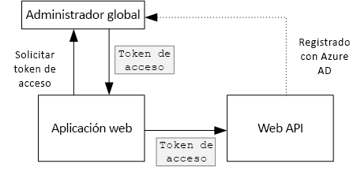
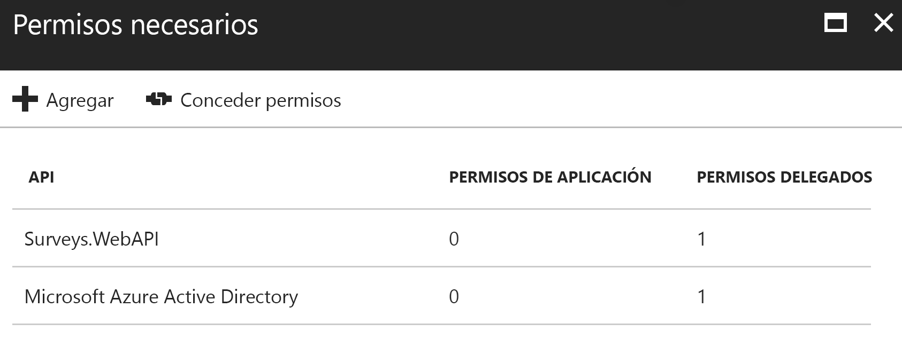

# <a name="secure-a-backend-web-api"></a><span data-ttu-id="bfac2-103">Protección de una API web de back-end</span><span class="sxs-lookup"><span data-stu-id="bfac2-103">Secure a backend web API</span></span>

<span data-ttu-id="bfac2-104">[ Código de ejemplo][sample application]</span><span class="sxs-lookup"><span data-stu-id="bfac2-104">[ Sample code][sample application]</span></span>

<span data-ttu-id="bfac2-105">La aplicación [Tailspin Surveys] utiliza una API web de back-end web para administrar las operaciones CRUD en las encuestas.</span><span class="sxs-lookup"><span data-stu-id="bfac2-105">The [Tailspin Surveys] application uses a backend web API to manage CRUD operations on surveys.</span></span> <span data-ttu-id="bfac2-106">Por ejemplo, cuando un usuario hace clic en "My Surveys" (Mis encuestas), la aplicación web envía una solicitud HTTP a la API web:</span><span class="sxs-lookup"><span data-stu-id="bfac2-106">For example, when a user clicks "My Surveys", the web application sends an HTTP request to the web API:</span></span>

```
GET /users/{userId}/surveys
```

<span data-ttu-id="bfac2-107">La API web devuelve un objeto JSON:</span><span class="sxs-lookup"><span data-stu-id="bfac2-107">The web API returns a JSON object:</span></span>

```
{
  "Published":[],
  "Own":[
    {"Id":1,"Title":"Survey 1"},
    {"Id":3,"Title":"Survey 3"},
    ],
  "Contribute": [{"Id":8,"Title":"My survey"}]
}
```

<span data-ttu-id="bfac2-108">La API web no permite solicitudes anónimas, por lo que la aplicación web debe autenticarse utilizando tokens de portador de OAuth 2.</span><span class="sxs-lookup"><span data-stu-id="bfac2-108">The web API does not allow anonymous requests, so the web app must authenticate itself using OAuth 2 bearer tokens.</span></span>

> [!NOTE]
> <span data-ttu-id="bfac2-109">Este es un escenario de servidor a servidor.</span><span class="sxs-lookup"><span data-stu-id="bfac2-109">This is a server-to-server scenario.</span></span> <span data-ttu-id="bfac2-110">La aplicación no realiza llamadas de AJAX a la API desde el explorador del cliente.</span><span class="sxs-lookup"><span data-stu-id="bfac2-110">The application does not make any AJAX calls to the API from the browser client.</span></span>
> 
> 

<span data-ttu-id="bfac2-111">Puede basarse fundamentalmente en dos métodos:</span><span class="sxs-lookup"><span data-stu-id="bfac2-111">There are two main approaches you can take:</span></span>

* <span data-ttu-id="bfac2-112">Identidad de usuario delegado.</span><span class="sxs-lookup"><span data-stu-id="bfac2-112">Delegated user identity.</span></span> <span data-ttu-id="bfac2-113">La aplicación web se autentica con la identidad del usuario.</span><span class="sxs-lookup"><span data-stu-id="bfac2-113">The web application authenticates with the user's identity.</span></span>
* <span data-ttu-id="bfac2-114">Identidad de aplicación.</span><span class="sxs-lookup"><span data-stu-id="bfac2-114">Application identity.</span></span> <span data-ttu-id="bfac2-115">La aplicación web se autentica con su identificador de cliente, mediante el flujo de credenciales del cliente de OAuth2.</span><span class="sxs-lookup"><span data-stu-id="bfac2-115">The web application authenticates with its client ID, using OAuth2 client credential flow.</span></span>

<span data-ttu-id="bfac2-116">La aplicación Tailspin implementa la identidad de usuario delegado.</span><span class="sxs-lookup"><span data-stu-id="bfac2-116">The Tailspin application implements delegated user identity.</span></span> <span data-ttu-id="bfac2-117">Estas son la diferencias principales:</span><span class="sxs-lookup"><span data-stu-id="bfac2-117">Here are the main differences:</span></span>

<span data-ttu-id="bfac2-118">**Identidad de usuario delegado**</span><span class="sxs-lookup"><span data-stu-id="bfac2-118">**Delegated user identity**</span></span>

* <span data-ttu-id="bfac2-119">El token de portador enviado a la API web contiene la identidad del usuario.</span><span class="sxs-lookup"><span data-stu-id="bfac2-119">The bearer token sent to the web API contains the user identity.</span></span>
* <span data-ttu-id="bfac2-120">La API web toma decisiones de autorización basadas en la identidad del usuario.</span><span class="sxs-lookup"><span data-stu-id="bfac2-120">The web API makes authorization decisions based on the user identity.</span></span>
* <span data-ttu-id="bfac2-121">La aplicación web necesita administrar errores 403 (Forbidden) desde la API web en caso de que el usuario no esté autorizado para realizar una acción.</span><span class="sxs-lookup"><span data-stu-id="bfac2-121">The web application needs to handle 403 (Forbidden) errors from the web API, if the user is not authorized to perform an action.</span></span>
* <span data-ttu-id="bfac2-122">Normalmente, la aplicación web sigue tomando algunas decisiones de autorización que afectan a la IU, como el hecho de mostrar u ocultar los elementos de la IU.</span><span class="sxs-lookup"><span data-stu-id="bfac2-122">Typically, the web application still makes some authorization decisions that affect UI, such as showing or hiding UI elements).</span></span>
* <span data-ttu-id="bfac2-123">La API web la pueden usar por clientes que no sean de confianza, como una aplicación JavaScript o una aplicación cliente nativa.</span><span class="sxs-lookup"><span data-stu-id="bfac2-123">The web API can potentially be used by untrusted clients, such as a JavaScript application or a native client application.</span></span>

<span data-ttu-id="bfac2-124">**Identidad de la aplicación**</span><span class="sxs-lookup"><span data-stu-id="bfac2-124">**Application identity**</span></span>

* <span data-ttu-id="bfac2-125">La API web no obtiene información sobre el usuario.</span><span class="sxs-lookup"><span data-stu-id="bfac2-125">The web API does not get information about the user.</span></span>
* <span data-ttu-id="bfac2-126">La API web no emite ninguna autorización basándose en la identidad del usuario.</span><span class="sxs-lookup"><span data-stu-id="bfac2-126">The web API cannot perform any authorization based on the user identity.</span></span> <span data-ttu-id="bfac2-127">Todas las decisiones de autorización son adoptadas por la aplicación web.</span><span class="sxs-lookup"><span data-stu-id="bfac2-127">All authorization decisions are made by the web application.</span></span>  
* <span data-ttu-id="bfac2-128">La API web no puede utilizarse por un cliente que no sea de confianza (aplicación JavaScript o aplicación cliente nativa).</span><span class="sxs-lookup"><span data-stu-id="bfac2-128">The web API cannot be used by an untrusted client (JavaScript or native client application).</span></span>
* <span data-ttu-id="bfac2-129">Este planteamiento puede ser un poco más fácil de implementar, porque no hay ninguna lógica de autorización en la API web.</span><span class="sxs-lookup"><span data-stu-id="bfac2-129">This approach may be somewhat simpler to implement, because there is no authorization logic in the Web API.</span></span>

<span data-ttu-id="bfac2-130">En cualquier planteamiento, la aplicación web debe obtener un token de acceso, que es la credencial necesaria para llamar a la API web.</span><span class="sxs-lookup"><span data-stu-id="bfac2-130">In either approach, the web application must get an access token, which is the credential needed to call the web API.</span></span>

* <span data-ttu-id="bfac2-131">En el caso de la identidad de usuario delegado, el token tiene que provenir del proveedor de identidades, que puede emitir un token en nombre del usuario.</span><span class="sxs-lookup"><span data-stu-id="bfac2-131">For delegated user identity, the token has to come from the IDP, which can issue a token on behalf of the user.</span></span>
* <span data-ttu-id="bfac2-132">En el caso de las credenciales de cliente, una aplicación puede obtener el token del IDP u hospedar su propio servidor de tokens</span><span class="sxs-lookup"><span data-stu-id="bfac2-132">For client credentials, an application might get the token from the IDP or host its own token server.</span></span> <span data-ttu-id="bfac2-133">(pero no escriba un servidor de tokens desde cero; utilice un marco probado como [IdentityServer3]). Si la autenticación se realiza con Azure AD, se recomienda encarecidamente obtener el token de acceso de Azure AD, incluso con el flujo de credenciales de cliente.</span><span class="sxs-lookup"><span data-stu-id="bfac2-133">(But don't write a token server from scratch; use a well-tested framework like [IdentityServer3].) If you authenticate with Azure AD, it's strongly recommended to get the access token from Azure AD, even with client credential flow.</span></span>

<span data-ttu-id="bfac2-134">En el resto de este artículo se supone que la aplicación se autentica con Azure AD.</span><span class="sxs-lookup"><span data-stu-id="bfac2-134">The rest of this article assumes the application is authenticating with Azure AD.</span></span>



## <a name="register-the-web-api-in-azure-ad"></a><span data-ttu-id="bfac2-136">Registro de la API web en Azure AD</span><span class="sxs-lookup"><span data-stu-id="bfac2-136">Register the web API in Azure AD</span></span>
<span data-ttu-id="bfac2-137">Para que Azure AD emita un token de portador para la API web, necesita hacer algunos ajustes en Azure AD.</span><span class="sxs-lookup"><span data-stu-id="bfac2-137">In order for Azure AD to issue a bearer token for the web API, you need to configure some things in Azure AD.</span></span>

1. <span data-ttu-id="bfac2-138">Registre la API web en Azure AD.</span><span class="sxs-lookup"><span data-stu-id="bfac2-138">Register the web API in Azure AD.</span></span>

2. <span data-ttu-id="bfac2-139">Agregue el identificador de cliente de la aplicación web al manifiesto de la aplicación de API web, en la propiedad `knownClientApplications` .</span><span class="sxs-lookup"><span data-stu-id="bfac2-139">Add the client ID of the web app to the web API application manifest, in the `knownClientApplications` property.</span></span> <span data-ttu-id="bfac2-140">Consulte [Update the application manifests](Actualización de los manifiestos de la aplicación).</span><span class="sxs-lookup"><span data-stu-id="bfac2-140">See [Update the application manifests].</span></span>

3. <span data-ttu-id="bfac2-141">Conceda a la aplicación web permiso para llamar a la API web.</span><span class="sxs-lookup"><span data-stu-id="bfac2-141">Give the web application permission to call the web API.</span></span> <span data-ttu-id="bfac2-142">En el Portal de administración de Azure, puede establecer dos tipos de permisos: "Permisos de aplicación" para la identidad de aplicación (flujo de credencial de cliente) o "Permisos delegados" para la identidad de usuario delegado.</span><span class="sxs-lookup"><span data-stu-id="bfac2-142">In the Azure Management Portal, you can set two types of permissions: "Application Permissions" for application identity (client credential flow), or "Delegated Permissions" for delegated user identity.</span></span>
   
   

## <a name="getting-an-access-token"></a><span data-ttu-id="bfac2-144">Obtención de un token de acceso</span><span class="sxs-lookup"><span data-stu-id="bfac2-144">Getting an access token</span></span>
<span data-ttu-id="bfac2-145">Antes de llamar a la API web, la aplicación web obtiene un token de acceso de Azure AD.</span><span class="sxs-lookup"><span data-stu-id="bfac2-145">Before calling the web API, the web application gets an access token from Azure AD.</span></span> <span data-ttu-id="bfac2-146">En una aplicación. NET, use la [biblioteca de autenticación de Azure AD (ADAL) para .NET][ADAL].</span><span class="sxs-lookup"><span data-stu-id="bfac2-146">In a .NET application, use the [Azure AD Authentication Library (ADAL) for .NET][ADAL].</span></span>

<span data-ttu-id="bfac2-147">En el flujo de código de autorización de OAuth 2, la aplicación intercambia un código de autorización para un token de acceso.</span><span class="sxs-lookup"><span data-stu-id="bfac2-147">In the OAuth 2 authorization code flow, the application exchanges an authorization code for an access token.</span></span> <span data-ttu-id="bfac2-148">El código siguiente usa ADAL para obtener el token de acceso.</span><span class="sxs-lookup"><span data-stu-id="bfac2-148">The following code uses ADAL to get the access token.</span></span> <span data-ttu-id="bfac2-149">A este código se le llama durante los eventos `AuthorizationCodeReceived` .</span><span class="sxs-lookup"><span data-stu-id="bfac2-149">This code is called during the `AuthorizationCodeReceived` event.</span></span>

```csharp
// The OpenID Connect middleware sends this event when it gets the authorization code.   
public override async Task AuthorizationCodeReceived(AuthorizationCodeReceivedContext context)
{
    string authorizationCode = context.ProtocolMessage.Code;
    string authority = "https://login.microsoftonline.com/" + tenantID
    string resourceID = "https://tailspin.onmicrosoft.com/surveys.webapi" // App ID URI
    ClientCredential credential = new ClientCredential(clientId, clientSecret);

    AuthenticationContext authContext = new AuthenticationContext(authority, tokenCache);
    AuthenticationResult authResult = await authContext.AcquireTokenByAuthorizationCodeAsync(
        authorizationCode, new Uri(redirectUri), credential, resourceID);

    // If successful, the token is in authResult.AccessToken
}
```

<span data-ttu-id="bfac2-150">Estos son los distintos parámetros que son necesarios:</span><span class="sxs-lookup"><span data-stu-id="bfac2-150">Here are the various parameters that are needed:</span></span>

* <span data-ttu-id="bfac2-151">`authority`.</span><span class="sxs-lookup"><span data-stu-id="bfac2-151">`authority`.</span></span> <span data-ttu-id="bfac2-152">Se deriva del identificador del inquilino del usuario que ha iniciado sesión</span><span class="sxs-lookup"><span data-stu-id="bfac2-152">Derived from the tenant ID of the signed in user.</span></span> <span data-ttu-id="bfac2-153">(no el identificador del inquilino del proveedor de SaaS.)</span><span class="sxs-lookup"><span data-stu-id="bfac2-153">(Not the tenant ID of the SaaS provider)</span></span>  
* <span data-ttu-id="bfac2-154">`authorizationCode`.</span><span class="sxs-lookup"><span data-stu-id="bfac2-154">`authorizationCode`.</span></span> <span data-ttu-id="bfac2-155">El código de autenticación que obtuvo del proveedor de identidades.</span><span class="sxs-lookup"><span data-stu-id="bfac2-155">the auth code that you got back from the IDP.</span></span>
* <span data-ttu-id="bfac2-156">`clientId`.</span><span class="sxs-lookup"><span data-stu-id="bfac2-156">`clientId`.</span></span> <span data-ttu-id="bfac2-157">El identificador de cliente de la aplicación web.</span><span class="sxs-lookup"><span data-stu-id="bfac2-157">The web application's client ID.</span></span>
* <span data-ttu-id="bfac2-158">`clientSecret`.</span><span class="sxs-lookup"><span data-stu-id="bfac2-158">`clientSecret`.</span></span> <span data-ttu-id="bfac2-159">El secreto de cliente de la aplicación web.</span><span class="sxs-lookup"><span data-stu-id="bfac2-159">The web application's client secret.</span></span>
* <span data-ttu-id="bfac2-160">`redirectUri`.</span><span class="sxs-lookup"><span data-stu-id="bfac2-160">`redirectUri`.</span></span> <span data-ttu-id="bfac2-161">El URI de redirección establecido para OpenID Connect.</span><span class="sxs-lookup"><span data-stu-id="bfac2-161">The redirect URI that you set for OpenID connect.</span></span> <span data-ttu-id="bfac2-162">Es aquí donde se llama de nuevo al proveedor de identidades con el token.</span><span class="sxs-lookup"><span data-stu-id="bfac2-162">This is where the IDP calls back with the token.</span></span>
* <span data-ttu-id="bfac2-163">`resourceID`.</span><span class="sxs-lookup"><span data-stu-id="bfac2-163">`resourceID`.</span></span> <span data-ttu-id="bfac2-164">El URI del identificador de aplicación de la API web que creó cuando registró la API web en Azure AD.</span><span class="sxs-lookup"><span data-stu-id="bfac2-164">The App ID URI of the web API, which you created when you registered the web API in Azure AD</span></span>
* <span data-ttu-id="bfac2-165">`tokenCache`.</span><span class="sxs-lookup"><span data-stu-id="bfac2-165">`tokenCache`.</span></span> <span data-ttu-id="bfac2-166">Un objeto que almacena en caché los tokens de acceso.</span><span class="sxs-lookup"><span data-stu-id="bfac2-166">An object that caches the access tokens.</span></span> <span data-ttu-id="bfac2-167">Consulte [Token caching](Almacenamiento en caché de tokens).</span><span class="sxs-lookup"><span data-stu-id="bfac2-167">See [Token caching].</span></span>

<span data-ttu-id="bfac2-168">Si `AcquireTokenByAuthorizationCodeAsync` se completa correctamente, ADAL almacena en caché el token.</span><span class="sxs-lookup"><span data-stu-id="bfac2-168">If `AcquireTokenByAuthorizationCodeAsync` succeeds, ADAL caches the token.</span></span> <span data-ttu-id="bfac2-169">Más adelante, puede obtener el token de la memoria caché mediante una llamada a AcquireTokenSilentAsync:</span><span class="sxs-lookup"><span data-stu-id="bfac2-169">Later, you can get the token from the cache by calling AcquireTokenSilentAsync:</span></span>

```csharp
AuthenticationContext authContext = new AuthenticationContext(authority, tokenCache);
var result = await authContext.AcquireTokenSilentAsync(resourceID, credential, new UserIdentifier(userId, UserIdentifierType.UniqueId));
```

<span data-ttu-id="bfac2-170">donde `userId` es el identificador de objeto del usuario, que se encuentra en la notificación `http://schemas.microsoft.com/identity/claims/objectidentifier`.</span><span class="sxs-lookup"><span data-stu-id="bfac2-170">where `userId` is the user's object ID, which is found in the `http://schemas.microsoft.com/identity/claims/objectidentifier` claim.</span></span>

## <a name="using-the-access-token-to-call-the-web-api"></a><span data-ttu-id="bfac2-171">Uso del token de acceso para llamar a la API web</span><span class="sxs-lookup"><span data-stu-id="bfac2-171">Using the access token to call the web API</span></span>
<span data-ttu-id="bfac2-172">Una vez que tenga el token, envíelo en el encabezado de autorización de las solicitudes HTTP a la API web.</span><span class="sxs-lookup"><span data-stu-id="bfac2-172">Once you have the token, send it in the Authorization header of the HTTP requests to the web API.</span></span>

```
Authorization: Bearer xxxxxxxxxx
```

<span data-ttu-id="bfac2-173">El siguiente método de extensión de la aplicación Surveys establece el encabezado de autorización en un HTTP de solicitud, utilizando para ello la clase **HttpClient** .</span><span class="sxs-lookup"><span data-stu-id="bfac2-173">The following extension method from the Surveys application sets the Authorization header on an HTTP request, using the **HttpClient** class.</span></span>

```csharp
public static async Task<HttpResponseMessage> SendRequestWithBearerTokenAsync(this HttpClient httpClient, HttpMethod method, string path, object requestBody, string accessToken, CancellationToken ct)
{
    var request = new HttpRequestMessage(method, path);
    if (requestBody != null)
    {
        var json = JsonConvert.SerializeObject(requestBody, Formatting.None);
        var content = new StringContent(json, Encoding.UTF8, "application/json");
        request.Content = content;
    }

    request.Headers.Authorization = new AuthenticationHeaderValue("Bearer", accessToken);
    request.Headers.Accept.Add(new MediaTypeWithQualityHeaderValue("application/json"));

    var response = await httpClient.SendAsync(request, ct);
    return response;
}
```

## <a name="authenticating-in-the-web-api"></a><span data-ttu-id="bfac2-174">Autenticación en la API web</span><span class="sxs-lookup"><span data-stu-id="bfac2-174">Authenticating in the web API</span></span>
<span data-ttu-id="bfac2-175">La API web tiene que autenticar el token de portador.</span><span class="sxs-lookup"><span data-stu-id="bfac2-175">The web API has to authenticate the bearer token.</span></span> <span data-ttu-id="bfac2-176">En ASP.NET Core, se puede usar el paquete [Microsoft.AspNet.Authentication.JwtBearer] [ JwtBearer].</span><span class="sxs-lookup"><span data-stu-id="bfac2-176">In ASP.NET Core, you can use the [Microsoft.AspNet.Authentication.JwtBearer][JwtBearer] package.</span></span> <span data-ttu-id="bfac2-177">Este paquete proporciona software intermedio que permite a la aplicación recibir los tokens de portador de OpenID Connect.</span><span class="sxs-lookup"><span data-stu-id="bfac2-177">This package provides middleware that enables the application to receive OpenID Connect bearer tokens.</span></span>

<span data-ttu-id="bfac2-178">Registre el software intermedio en la clase `Startup` de la API web.</span><span class="sxs-lookup"><span data-stu-id="bfac2-178">Register the middleware in your web API `Startup` class.</span></span>

```csharp
public void Configure(IApplicationBuilder app, IHostingEnvironment env, ApplicationDbContext dbContext, ILoggerFactory loggerFactory)
{
    // ...

    app.UseJwtBearerAuthentication(new JwtBearerOptions {
        Audience = configOptions.AzureAd.WebApiResourceId,
        Authority = Constants.AuthEndpointPrefix,
        TokenValidationParameters = new TokenValidationParameters {
            ValidateIssuer = false
        },
        Events= new SurveysJwtBearerEvents(loggerFactory.CreateLogger<SurveysJwtBearerEvents>())
    });
    
    // ...
}
```

* <span data-ttu-id="bfac2-179">**Audience**.</span><span class="sxs-lookup"><span data-stu-id="bfac2-179">**Audience**.</span></span> <span data-ttu-id="bfac2-180">Establezca este valor en la dirección URL del identificador de la aplicación para la API web, que creó al registrar la API web en Azure AD.</span><span class="sxs-lookup"><span data-stu-id="bfac2-180">Set this to the App ID URL for the web API, which you created when you registered the web API with Azure AD.</span></span>
* <span data-ttu-id="bfac2-181">**Authority**.</span><span class="sxs-lookup"><span data-stu-id="bfac2-181">**Authority**.</span></span> <span data-ttu-id="bfac2-182">Para una aplicación multiinquilino, establezca esta propiedad en `https://login.microsoftonline.com/common/`.</span><span class="sxs-lookup"><span data-stu-id="bfac2-182">For a multitenant application, set this to `https://login.microsoftonline.com/common/`.</span></span>
* <span data-ttu-id="bfac2-183">**TokenValidationParameters**.</span><span class="sxs-lookup"><span data-stu-id="bfac2-183">**TokenValidationParameters**.</span></span> <span data-ttu-id="bfac2-184">Para una aplicación multiinquilino, establezca **ValidateIssuer** en false.</span><span class="sxs-lookup"><span data-stu-id="bfac2-184">For a multitenant application, set **ValidateIssuer** to false.</span></span> <span data-ttu-id="bfac2-185">Esto significa que la aplicación validará al emisor.</span><span class="sxs-lookup"><span data-stu-id="bfac2-185">That means the application will validate the issuer.</span></span>
* <span data-ttu-id="bfac2-186">**Events** es una clase que deriva de **JwtBearerEvents**.</span><span class="sxs-lookup"><span data-stu-id="bfac2-186">**Events** is a class that derives from **JwtBearerEvents**.</span></span>

### <a name="issuer-validation"></a><span data-ttu-id="bfac2-187">Validación del emisor</span><span class="sxs-lookup"><span data-stu-id="bfac2-187">Issuer validation</span></span>
<span data-ttu-id="bfac2-188">Valide el emisor del token en el evento **JwtBearerEvents.TokenValidated**.</span><span class="sxs-lookup"><span data-stu-id="bfac2-188">Validate the token issuer in the **JwtBearerEvents.TokenValidated** event.</span></span> <span data-ttu-id="bfac2-189">El emisor se envía en la notificación "iss".</span><span class="sxs-lookup"><span data-stu-id="bfac2-189">The issuer is sent in the "iss" claim.</span></span>

<span data-ttu-id="bfac2-190">En la aplicación Surveys, la API web no controla el [registro de inquilinos].</span><span class="sxs-lookup"><span data-stu-id="bfac2-190">In the Surveys application, the web API doesn't handle [tenant sign-up].</span></span> <span data-ttu-id="bfac2-191">Por lo tanto, solo comprueba si el emisor ya está en la base de datos de la aplicación.</span><span class="sxs-lookup"><span data-stu-id="bfac2-191">Therefore, it just checks if the issuer is already in the application database.</span></span> <span data-ttu-id="bfac2-192">Si no es así, se produce una excepción, lo que provoca un error de autenticación.</span><span class="sxs-lookup"><span data-stu-id="bfac2-192">If not, it throws an exception, which causes authentication to fail.</span></span>

```csharp
public override async Task TokenValidated(TokenValidatedContext context)
{
    var principal = context.Ticket.Principal;
    var tenantManager = context.HttpContext.RequestServices.GetService<TenantManager>();
    var userManager = context.HttpContext.RequestServices.GetService<UserManager>();
    var issuerValue = principal.GetIssuerValue();
    var tenant = await tenantManager.FindByIssuerValueAsync(issuerValue);

    if (tenant == null)
    {
        // The caller was not from a trusted issuer. Throw to block the authentication flow.
        throw new SecurityTokenValidationException();
    }

    var identity = principal.Identities.First();

    // Add new claim for survey_userid
    var registeredUser = await userManager.FindByObjectIdentifier(principal.GetObjectIdentifierValue());
    identity.AddClaim(new Claim(SurveyClaimTypes.SurveyUserIdClaimType, registeredUser.Id.ToString()));
    identity.AddClaim(new Claim(SurveyClaimTypes.SurveyTenantIdClaimType, registeredUser.TenantId.ToString()));

    // Add new claim for Email
    var email = principal.FindFirst(ClaimTypes.Upn)?.Value;
    if (!string.IsNullOrWhiteSpace(email))
    {
        identity.AddClaim(new Claim(ClaimTypes.Email, email));
    }
}
```

<span data-ttu-id="bfac2-193">Como se muestra en este ejemplo, también se puede usar el evento **TokenValidated** para modificar las notificaciones.</span><span class="sxs-lookup"><span data-stu-id="bfac2-193">As this example shows, you can also use the **TokenValidated** event to modify the claims.</span></span> <span data-ttu-id="bfac2-194">Recuerde que las notificaciones proceden directamente de Azure AD.</span><span class="sxs-lookup"><span data-stu-id="bfac2-194">Remember that the claims come directly from Azure AD.</span></span> <span data-ttu-id="bfac2-195">Si la aplicación web modifica las notificaciones que obtiene, dichos cambios no se mostrarán en el token de portador que recibe la API web.</span><span class="sxs-lookup"><span data-stu-id="bfac2-195">If the web application modifies the claims that it gets, those changes won't show up in the bearer token that the web API receives.</span></span> <span data-ttu-id="bfac2-196">Para más información, consulte [Claims transformations][claims-transformation] (Transformaciones de las notificaciones).</span><span class="sxs-lookup"><span data-stu-id="bfac2-196">For more information, see [Claims transformations][claims-transformation].</span></span>

## <a name="authorization"></a><span data-ttu-id="bfac2-197">Autorización</span><span class="sxs-lookup"><span data-stu-id="bfac2-197">Authorization</span></span>
<span data-ttu-id="bfac2-198">Para un análisis general sobre la autorización, consulte [Role-based and resource-based authorization][Authorization] (Autorización basada en roles y basada en recursos).</span><span class="sxs-lookup"><span data-stu-id="bfac2-198">For a general discussion of authorization, see [Role-based and resource-based authorization][Authorization].</span></span> 

<span data-ttu-id="bfac2-199">El middleware JwtBearer controla las respuestas de la autorización.</span><span class="sxs-lookup"><span data-stu-id="bfac2-199">The JwtBearer middleware handles the authorization responses.</span></span> <span data-ttu-id="bfac2-200">Por ejemplo, para restringir una acción del controlador a los usuarios autenticados, utilice el atributo **[Authorize]** y especifique **JwtBearerDefaults.AuthenticationScheme** como esquema de autenticación:</span><span class="sxs-lookup"><span data-stu-id="bfac2-200">For example, to restrict a controller action to authenticated users, use the **[Authorize]** atrribute and specify **JwtBearerDefaults.AuthenticationScheme** as the authentication scheme:</span></span>

```csharp
[Authorize(ActiveAuthenticationSchemes = JwtBearerDefaults.AuthenticationScheme)]
```

<span data-ttu-id="bfac2-201">Esto devuelve un código de estado 401 si el usuario no está autenticado.</span><span class="sxs-lookup"><span data-stu-id="bfac2-201">This returns a 401 status code if the user is not authenticated.</span></span>

<span data-ttu-id="bfac2-202">Para restringir una acción del controlador por directiva de autorización, especifique el nombre de la directiva en el atributo **[Authorize]**:</span><span class="sxs-lookup"><span data-stu-id="bfac2-202">To restrict a controller action by authorizaton policy, specify the policy name in the **[Authorize]** attribute:</span></span>

```csharp
[Authorize(Policy = PolicyNames.RequireSurveyCreator)]
```

<span data-ttu-id="bfac2-203">Esto devuelve un código de estado 401 si el usuario no está autenticado, y 403 si el usuario está autenticado pero no autorizado.</span><span class="sxs-lookup"><span data-stu-id="bfac2-203">This returns a 401 status code if the user is not authenticated, and 403 if the user is authenticated but not authorized.</span></span> <span data-ttu-id="bfac2-204">Registre la directiva en el inicio:</span><span class="sxs-lookup"><span data-stu-id="bfac2-204">Register the policy on startup:</span></span>

```csharp
public void ConfigureServices(IServiceCollection services)
{
    services.AddAuthorization(options =>
    {
        options.AddPolicy(PolicyNames.RequireSurveyCreator,
            policy =>
            {
                policy.AddRequirements(new SurveyCreatorRequirement());
                policy.RequireAuthenticatedUser(); // Adds DenyAnonymousAuthorizationRequirement 
                policy.AddAuthenticationSchemes(JwtBearerDefaults.AuthenticationScheme);
            });
        options.AddPolicy(PolicyNames.RequireSurveyAdmin,
            policy =>
            {
                policy.AddRequirements(new SurveyAdminRequirement());
                policy.RequireAuthenticatedUser(); // Adds DenyAnonymousAuthorizationRequirement 
                policy.AddAuthenticationSchemes(JwtBearerDefaults.AuthenticationScheme);
            });
    });
    
    // ...
}
```

<span data-ttu-id="bfac2-205">[**Siguiente**][token cache]</span><span class="sxs-lookup"><span data-stu-id="bfac2-205">[**Next**][token cache]</span></span>

<!-- links -->
[ADAL]: https://msdn.microsoft.com/library/azure/jj573266.aspx
[JwtBearer]: https://www.nuget.org/packages/Microsoft.AspNet.Authentication.JwtBearer

[Tailspin Surveys]: tailspin.md
[IdentityServer3]: https://github.com/IdentityServer/IdentityServer3
[Update the application manifests]: ./run-the-app.md#update-the-application-manifests
[Token caching]: token-cache.md
[registro de inquilinos]: signup.md
[claims-transformation]: claims.md#claims-transformations
[Authorization]: authorize.md
[sample application]: https://github.com/mspnp/multitenant-saas-guidance
[token cache]: token-cache.md
