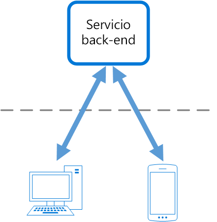

# Patrón Backends for FrontendsBackends for Frontends pattern

Crea servicios independientes de back-end que determinadas aplicaciones de front-end o interfaces puedan usar.Create separate backend services to be consumed by specific frontend applications or interfaces. Este patrón es útil cuando desea evitar personalizar un único back-end para varias interfaces.This pattern is useful when you want to avoid customizing a single backend for multiple interfaces. Sam Newman describió por primera vez este patrón.This pattern was first described by Sam Newman.

## Contexto y problemaContext and problem

Inicialmente se puede destinar una aplicación a una interfaz de usuario web de escritorio.An application may initially be targeted at a desktop web UI. Normalmente, un servicio back-end se desarrolla en paralelo y proporciona las características necesarias para esa interfaz de usuario.Typically, a backend service is developed in parallel that provides the features needed for that UI. A medida que crece la base de usuarios de la aplicación, se desarrolla una aplicación móvil que debe interactuar con el mismo back-end.As the application's user base grows, a mobile application is developed that must interact with the same backend. El servicio back-end se convierte en un back-end de uso general que atiende los requisitos de la interfaz tanto de escritorio como móvil.The backend service becomes a general-purpose backend, serving the requirements of both the desktop and mobile interfaces.

Pero las funcionalidades de un dispositivo móvil difieren significativamente de las de un explorador de escritorio, en términos de tamaño de pantalla, rendimiento y limitaciones de pantalla.But the capabilities of a mobile device differ significantly from a desktop browser, in terms screen size, performance, and display limitations. En consecuencia, los requisitos para un back-end de aplicación móvil difieren de los de la interfaz de usuario web de escritorio.As a result, the requirements for a mobile application backend differ from the desktop web UI. 

Estas diferencias dan lugar a requisitos contrapuestos para el back-end.These differences result in competing requirements for the backend. El back-end requiere cambios significativos y regulares para atender tanto la interfaz de usuario web de escritorio como la aplicación móvil.The backend requires regular and significant changes to serve both the desktop web UI and the mobile application. A menudo, hay equipos independientes de la interfaz que funcionan en cada front-end y hacen que el back-end se convierta un cuello de botella en el proceso de desarrollo.Often, separate interface teams work on each frontend, causing the backend to become a bottleneck in the development process. Los requisitos de actualización conflictivos y la necesidad de mantener el servicio en funcionamiento para ambos front-ends pueden suponer dedicar un gran esfuerzo a un único recurso que se puede implementar.Conflicting update requirements, and the need to keep the service working for both frontends, can result in spending a lot of effort on a single deployable resource.

 

Como la actividad de desarrollo se centra en el servicio back-end, se puede crear un equipo independiente para administrar y mantener el back-end.As the development activity focuses on the backend service, a separate team may be created to manage and maintain the backend. En última instancia, esto produce una desconexión entre los equipos de desarrollo de la interfaz y del back-end, lo que supone una carga para el equipo del back-end a la hora de equilibrar los requisitos contrapuestos de los diferentes equipos de la interfaz de usuario.Ultimately, this results in a disconnect between the interface and backend development teams, placing a burden on the backend team to balance the competing requirements of the different UI teams. Cuando un equipo de la interfaz requiere cambios en el back-end, esos cambios se deben validar con otros equipos de la interfaz antes de que se pueden integrar en el back-end.When one interface team requires changes to the backend, those changes must be validated with other interface teams before they can be integrated into the backend. 

## SoluciónSolution

Cree un back-end por interfaz de usuario.Create one backend per user interface. Ajuste el comportamiento y el rendimiento de cada back-end para que se adapte mejor a las necesidades del entorno de front-end, sin preocuparse de que pueda afectar a otras experiencias de front-end.Fine tune the behavior and performance of each backend to best match the needs of the frontend environment, without worrying about affecting other frontend experiences.

 

Como cada back-end es específico de una interfaz, se puede optimizar para esa interfaz.Because each backend is specific to one interface, it can be optimized for that interface. En consecuencia, será más pequeño, menos complejo y es probable que más rápido que un back-end genérico que intenta satisfacer los requisitos de todas las interfaces.As a result, it will be smaller, less complex, and likely faster than a generic backend that tries to satisfy the requirements for all interfaces. Cada equipo de la interfaz tiene autonomía para controlar su propio back-end y no se apoya en un equipo de desarrollo de back-end centralizado.Each interface team has autonomy to control their own backend and doesn't rely on a centralized backend development team. Esto proporciona flexibilidad al equipo de la interfaz en la selección del lenguaje, el ritmo de lanzamiento, la priorización de la carga de trabajo y la integración de características en el back-end.This gives the interface team flexibility in language selection, release cadence, prioritization of workload, and feature integration in their backend.

Para más información, consulte [Pattern: Backends For Frontends](http://samnewman.io/patterns/architectural/bff/) (Patrón: servidores back-end para servidores front-end).For more information, see [Pattern: Backends For Frontends](http://samnewman.io/patterns/architectural/bff/).

## Problemas y consideracionesIssues and considerations

- Tenga en cuenta cuántos servidores back-end va a implementar.Consider how many backends to deploy.
- Si distintas interfaces (por ejemplo, clientes móviles) van a hacer las mismas solicitudes, calcule si es necesario implementar un back-end para cada interfaz o si será suficiente con un back-end único.If different interfaces (such as mobile clients) will make the same requests, consider whether it is necessary to implement a backend for each interface, or if a single backend will suffice.
- Es muy probable que se produzca una duplicación de código en los servicios al implementar este patrón.Code duplication across services is highly likely when implementing this pattern.
- Los servicios back-end centrados en front-end solo deben contener una lógica y un comportamientos específicos del cliente.Frontend-focused backend services should only contain client-specific logic and behavior. La lógica de negocios general y otras características globales deben administrarse en otra parte de la aplicación.General business logic and other global features should be managed elsewhere in your application.
- Piense en cómo puede reflejarse este patrón en las responsabilidades de un equipo de desarrollo.Think about how this pattern might be reflected in the responsibilities of a development team.
- Tenga en cuenta el tiempo que se tardará en implementar este patrón.Consider how long it will take to implement this pattern. ¿Incurrirá el esfuerzo de creación de los nuevos backend en una deuda técnica, mientras continúa apoyando el back-end genérico existente?Will the effort of building the new backends incur technical debt, while you continue to support the existing generic backend?

## Cuándo usar este patrónWhen to use this pattern

Use este patrón en los siguientes supuestos:Use this pattern when:

- Un servicio back-end de uso general o compartido debe mantenerse con una sobrecarga de desarrollo importante.A shared or general purpose backend service must be maintained with significant development overhead.
- Desea optimizar el back-end para los requisitos de interfaces de cliente específicas.You want to optimize the backend for the requirements of specific client interfaces.
- Las personalizaciones se realizan en un back-end de uso general para dar cabida a varias interfaces.Customizations are made to a general-purpose backend to accommodate multiple interfaces.
- Un lenguaje de programación alternativo es más adecuado para el back-end de una interfaz de usuario diferente.An alternative language is better suited for the backend of a different user interface.

Este patrón puede no ser adecuado:This pattern may not be suitable:

- Cuando las interfaces realizan las mismas solicitudes o similares al back-end.When interfaces make the same or similar requests to the backend.
- Cuando se usa solo una interfaz para interactuar con el back-end.When only one interface is used to interact with the backend.

## Instrucciones relacionadasRelated guidance

- [Patrón Gateway AggregationGateway Aggregation pattern](./gateway-aggregation.md)
- [Patrón Gateway OffloadingGateway Offloading pattern](./gateway-offloading.md)
- [Patrón Gateway RoutingGateway Routing pattern](./gateway-routing.md)

