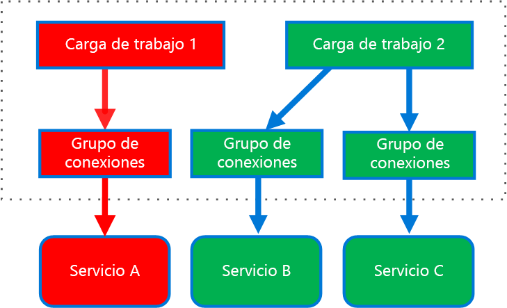
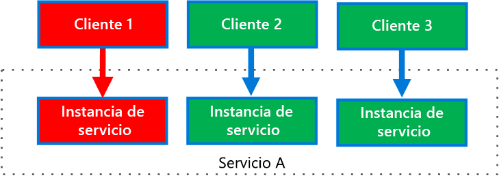

# <a name="bulkhead-pattern"></a><span data-ttu-id="b7c28-103">Patrón Bulkhead</span><span class="sxs-lookup"><span data-stu-id="b7c28-103">Bulkhead pattern</span></span>

<span data-ttu-id="b7c28-104">Aísle los elementos de una aplicación en grupos para que, si se produce un error en uno, los demás sigan funcionando.</span><span class="sxs-lookup"><span data-stu-id="b7c28-104">Isolate elements of an application into pools so that if one fails, the others will continue to function.</span></span>

<span data-ttu-id="b7c28-105">Este patrón se denomina *Bulkhead* porque se parece a las particiones seccionadas del casco de un barco.</span><span class="sxs-lookup"><span data-stu-id="b7c28-105">This pattern is named *Bulkhead* because it resembles the sectioned partitions of a ship's hull.</span></span> <span data-ttu-id="b7c28-106">Si el casco de un barco corre peligro, solo se llenará de agua la sección dañada, lo que evita que el barco se hunda.</span><span class="sxs-lookup"><span data-stu-id="b7c28-106">If the hull of a ship is compromised, only the damaged section fills with water, which prevents the ship from sinking.</span></span> 

## <a name="context-and-problem"></a><span data-ttu-id="b7c28-107">Contexto y problema</span><span class="sxs-lookup"><span data-stu-id="b7c28-107">Context and problem</span></span>

<span data-ttu-id="b7c28-108">Una aplicación basada en la nube puede incluir varios servicios, y cada servicio tiene uno o varios consumidores.</span><span class="sxs-lookup"><span data-stu-id="b7c28-108">A cloud-based application may include multiple services, with each service having one or more consumers.</span></span> <span data-ttu-id="b7c28-109">Una carga excesiva o un error en un servicio afectarán a todos los consumidores del servicio.</span><span class="sxs-lookup"><span data-stu-id="b7c28-109">Excessive load or failure in a service will impact all consumers of the service.</span></span>

<span data-ttu-id="b7c28-110">Además, un consumidor puede enviar solicitudes a varios servicios al mismo tiempo y usar recursos para cada solicitud.</span><span class="sxs-lookup"><span data-stu-id="b7c28-110">Moreover, a consumer may send requests to multiple services simultaneously, using resources for each request.</span></span> <span data-ttu-id="b7c28-111">Cuando el consumidor envía una solicitud a un servicio que no está configurada correctamente o que no responde, es posible que los recursos utilizados por la solicitud del cliente no se liberen en el momento oportuno.</span><span class="sxs-lookup"><span data-stu-id="b7c28-111">When the consumer sends a request to a service that is misconfigured or not responding, the resources used by the client's request may not be freed in a timely manner.</span></span> <span data-ttu-id="b7c28-112">Como las solicitudes al servicio no se detienen, pueden agotarse.</span><span class="sxs-lookup"><span data-stu-id="b7c28-112">As requests to the service continue, those resources may be exhausted.</span></span> <span data-ttu-id="b7c28-113">Por ejemplo, se puede agotar el grupo de conexiones del cliente.</span><span class="sxs-lookup"><span data-stu-id="b7c28-113">For example, the client's connection pool may be exhausted.</span></span> <span data-ttu-id="b7c28-114">En ese momento, las solicitudes que el consumidor realiza a otros servicios resultan afectadas.</span><span class="sxs-lookup"><span data-stu-id="b7c28-114">At that point, requests by the consumer to other services are impacted.</span></span> <span data-ttu-id="b7c28-115">En último término, el consumidor no puede volver a enviar solicitudes a otros servicios, no solo al servicio original que no responde.</span><span class="sxs-lookup"><span data-stu-id="b7c28-115">Eventually the consumer can no longer send requests to other services, not just the original unresponsive service.</span></span>

<span data-ttu-id="b7c28-116">El mismo problema de agotamiento de recursos afecta a los servicios con varios consumidores.</span><span class="sxs-lookup"><span data-stu-id="b7c28-116">The same issue of resource exhaustion affects services with multiple consumers.</span></span> <span data-ttu-id="b7c28-117">Un gran número de solicitudes cuyo origen es un cliente puede agotar los recursos disponibles en el servicio.</span><span class="sxs-lookup"><span data-stu-id="b7c28-117">A large number of requests originating from one client may exhaust available resources in the service.</span></span> <span data-ttu-id="b7c28-118">Otros consumidores no pueden consumir el servicio, lo que provoca un efecto de error en cascada.</span><span class="sxs-lookup"><span data-stu-id="b7c28-118">Other consumers are no longer able to consume the service, causing a cascading failure effect.</span></span>

## <a name="solution"></a><span data-ttu-id="b7c28-119">Solución</span><span class="sxs-lookup"><span data-stu-id="b7c28-119">Solution</span></span>

<span data-ttu-id="b7c28-120">Dividir las instancias del servicio en distintos grupos, en función de disponibilidad y carga de los consumidores.</span><span class="sxs-lookup"><span data-stu-id="b7c28-120">Partition service instances into different groups, based on consumer load and availability requirements.</span></span> <span data-ttu-id="b7c28-121">Este diseño ayuda a aislar los errores y le permite mantener la funcionalidad del servicio para algunos consumidores, incluso durante un error.</span><span class="sxs-lookup"><span data-stu-id="b7c28-121">This design helps to isolate failures, and allows you to sustain service functionality for some consumers, even during a failure.</span></span>

<span data-ttu-id="b7c28-122">Los consumidores también pueden dividir los recursos, con el fin de asegurarse de que los recursos usados para llamar a un servicio no afectan a los usados para llamar a otro servicio.</span><span class="sxs-lookup"><span data-stu-id="b7c28-122">A consumer can also partition resources, to ensure that resources used to call one service don't affect the resources used to call another service.</span></span> <span data-ttu-id="b7c28-123">Por ejemplo, a un consumidor que llama a varios servicios se le puede asignar un grupo de conexiones por cada servicio.</span><span class="sxs-lookup"><span data-stu-id="b7c28-123">For example, a consumer that calls multiple services may be assigned a connection pool for each service.</span></span> <span data-ttu-id="b7c28-124">Si un servicio empieza a fallar, solo afecta al grupo de conexiones a dicho servicio, lo que permite al consumidor seguir usando los restantes.</span><span class="sxs-lookup"><span data-stu-id="b7c28-124">If a service begins to fail, it only affects the connection pool assigned for that service, allowing the consumer to continue using the other services.</span></span>

<span data-ttu-id="b7c28-125">Las ventajas de este patrón son:</span><span class="sxs-lookup"><span data-stu-id="b7c28-125">The benefits of this pattern include:</span></span>

- <span data-ttu-id="b7c28-126">Aísla los consumidores y servicios de errores en cascada.</span><span class="sxs-lookup"><span data-stu-id="b7c28-126">Isolates consumers and services from cascading failures.</span></span> <span data-ttu-id="b7c28-127">Un problema que afecta a un servicio o a un consumidor se puede aislar en su propio mamparo, lo que evita que el error afecte a toda la solución.</span><span class="sxs-lookup"><span data-stu-id="b7c28-127">An issue affecting a consumer or service can be isolated within its own bulkhead, preventing the entire solution from failing.</span></span>
- <span data-ttu-id="b7c28-128">Le permite conservar cierta funcionalidad si se produce un error del servicio.</span><span class="sxs-lookup"><span data-stu-id="b7c28-128">Allows you to preserve some functionality in the event of a service failure.</span></span> <span data-ttu-id="b7c28-129">Otros servicios y características de la aplicación continuarán funcionando.</span><span class="sxs-lookup"><span data-stu-id="b7c28-129">Other services and features of the application will continue to work.</span></span>
- <span data-ttu-id="b7c28-130">Permite implementar servicios que ofrecen una calidad de servicio diferente a las aplicaciones consumidoras.</span><span class="sxs-lookup"><span data-stu-id="b7c28-130">Allows you to deploy services that offer a different quality of service for consuming applications.</span></span> <span data-ttu-id="b7c28-131">Se puede configurar que un grupo de consumidores de alta prioridad use los servicios de alta prioridad.</span><span class="sxs-lookup"><span data-stu-id="b7c28-131">A high-priority consumer pool can be configured to use high-priority services.</span></span> 

<span data-ttu-id="b7c28-132">El siguiente diagrama muestra mamparos estructurados en torno a grupos de conexiones que llaman a los servicios individuales.</span><span class="sxs-lookup"><span data-stu-id="b7c28-132">The following diagram shows bulkheads structured around connection pools that call individual services.</span></span> <span data-ttu-id="b7c28-133">Si en Service A se produce algún error o provoca algún otro problema, se aísla el grupo de conexiones, con lo que solo resultan afectadas las cargas de trabajo que usan el grupo de subprocesos asignado a Service A.</span><span class="sxs-lookup"><span data-stu-id="b7c28-133">If Service A fails or causes some other issue, the connection pool is isolated, so only workloads using the thread pool assigned to Service A are affected.</span></span> <span data-ttu-id="b7c28-134">Las cargas de trabajo que usan Service B y C no resultan afectadas y pueden seguir funcionando sin interrupción.</span><span class="sxs-lookup"><span data-stu-id="b7c28-134">Workloads that use Service B and C are not affected and can continue working without interruption.</span></span>

 

<span data-ttu-id="b7c28-135">El diagrama siguiente muestra a varios clientes que llaman a un único servicio.</span><span class="sxs-lookup"><span data-stu-id="b7c28-135">The next diagram shows multiple clients calling a single service.</span></span> <span data-ttu-id="b7c28-136">A cada cliente se le asigna una instancia de servicio independiente.</span><span class="sxs-lookup"><span data-stu-id="b7c28-136">Each client is assigned a separate service instance.</span></span> <span data-ttu-id="b7c28-137">Client 1 ha realizado demasiadas solicitudes y desborda su instancia.</span><span class="sxs-lookup"><span data-stu-id="b7c28-137">Client 1 has made too many requests and overwhelmed its instance.</span></span> <span data-ttu-id="b7c28-138">Dado que cada instancia de servicio está aislada de las demás, los restantes clientes pueden seguir haciendo llamadas.</span><span class="sxs-lookup"><span data-stu-id="b7c28-138">Because each service instance is isolated from the others, the other clients can continue making calls.</span></span>


     
## <a name="issues-and-considerations"></a><span data-ttu-id="b7c28-139">Problemas y consideraciones</span><span class="sxs-lookup"><span data-stu-id="b7c28-139">Issues and considerations</span></span>

- <span data-ttu-id="b7c28-140">Defina particiones en torno a los requisitos técnicos y empresariales de la aplicación.</span><span class="sxs-lookup"><span data-stu-id="b7c28-140">Define partitions around the business and technical requirements of the application.</span></span>
- <span data-ttu-id="b7c28-141">Al dividir los servicios o los consumidores en mamparos, tenga en cuenta el nivel de aislamiento que ofrece la tecnología, así como la sobrecarga en términos de costo, rendimiento y capacidad de administración.</span><span class="sxs-lookup"><span data-stu-id="b7c28-141">When partitioning services or consumers into bulkheads, consider the level of isolation offered by the technology as well as the overhead in terms of cost, performance and manageability.</span></span>
- <span data-ttu-id="b7c28-142">Considere la posibilidad de combinar mamparos con los patrones Retry, Circuit Breaker y Throttling para proporcionar un control de errores más sofisticado.</span><span class="sxs-lookup"><span data-stu-id="b7c28-142">Consider combining bulkheads with retry, circuit breaker, and throttling patterns to provide more sophisticated fault handling.</span></span>
- <span data-ttu-id="b7c28-143">Al dividir los consumidores en mamparos, considere la posibilidad de usar procesos, grupos de subprocesos y semáforos.</span><span class="sxs-lookup"><span data-stu-id="b7c28-143">When partitioning consumers into bulkheads, consider using processes, thread pools, and semaphores.</span></span> <span data-ttu-id="b7c28-144">Algunos proyectos como [Netflix Hystrix][hystrix] y [Polly][polly] ofrecen un marco para crear mamparos de consumidor.</span><span class="sxs-lookup"><span data-stu-id="b7c28-144">Projects like [Netflix Hystrix][hystrix] and [Polly][polly] offer a framework for creating consumer bulkheads.</span></span>
- <span data-ttu-id="b7c28-145">Al dividir los servicios en mamparos, considere la posibilidad de implementarlos en máquinas virtuales, contenedores o procesos independientes.</span><span class="sxs-lookup"><span data-stu-id="b7c28-145">When partitioning services into bulkheads, consider deploying them into separate virtual machines, containers, or processes.</span></span> <span data-ttu-id="b7c28-146">Los contenedores ofrecen un buen equilibrio de aislamiento de recursos con poca sobrecarga.</span><span class="sxs-lookup"><span data-stu-id="b7c28-146">Containers offer a good balance of resource isolation with fairly low overhead.</span></span>
- <span data-ttu-id="b7c28-147">Los servicios que se comunican mediante mensajes asincrónicos se pueden aislar a través de distintos conjuntos de colas.</span><span class="sxs-lookup"><span data-stu-id="b7c28-147">Services that communicate using asynchronous messages can be isolated through different sets of queues.</span></span> <span data-ttu-id="b7c28-148">Cada cola puede tener un conjunto dedicado de mensajes de procesamiento de instancias en la cola o un único grupo de instancias que usa un algoritmo para quitar de la cola y enviar el procesamiento.</span><span class="sxs-lookup"><span data-stu-id="b7c28-148">Each queue can have a dedicated set of instances processing messages on the queue, or a single group of instances using an algorithm to dequeue and dispatch processing.</span></span>
- <span data-ttu-id="b7c28-149">Determine el nivel de granularidad de los mamparos.</span><span class="sxs-lookup"><span data-stu-id="b7c28-149">Determine the level of granularity for the bulkheads.</span></span> <span data-ttu-id="b7c28-150">Por ejemplo, si desea distribuir los inquilinos en particiones, puede colocar cada uno de ellos en una partición independiente o colocar varios inquilinos en una única partición.</span><span class="sxs-lookup"><span data-stu-id="b7c28-150">For example, if you want to distribute tenants across partitions, you could place each tenant into a separate partition, or put several tenants into one partition.</span></span>
- <span data-ttu-id="b7c28-151">Supervise el rendimiento y el Acuerdo de Nivel de Servicio de cada partición.</span><span class="sxs-lookup"><span data-stu-id="b7c28-151">Monitor each partition’s performance and SLA.</span></span>

## <a name="when-to-use-this-pattern"></a><span data-ttu-id="b7c28-152">Cuándo usar este patrón</span><span class="sxs-lookup"><span data-stu-id="b7c28-152">When to use this pattern</span></span>

<span data-ttu-id="b7c28-153">Este patrón se usa para:</span><span class="sxs-lookup"><span data-stu-id="b7c28-153">Use this pattern to:</span></span>

- <span data-ttu-id="b7c28-154">Aislar los recursos que se usan para consumir un conjunto de servicios back-end, sobre todo si la aplicación puede proporcionar cierto nivel de funcionalidad, aunque no responda uno de los servicios.</span><span class="sxs-lookup"><span data-stu-id="b7c28-154">Isolate resources used to consume a set of backend services, especially if the application can provide some level of functionality even when one of the services is not responding.</span></span>
- <span data-ttu-id="b7c28-155">Aislar los consumidores críticos de los consumidores estándares.</span><span class="sxs-lookup"><span data-stu-id="b7c28-155">Isolate critical consumers from standard consumers.</span></span>
- <span data-ttu-id="b7c28-156">Proteger la aplicación de errores en cascada.</span><span class="sxs-lookup"><span data-stu-id="b7c28-156">Protect the application from cascading failures.</span></span>

<span data-ttu-id="b7c28-157">Este patrón puede no ser adecuado cuando:</span><span class="sxs-lookup"><span data-stu-id="b7c28-157">This pattern may not be suitable when:</span></span>

- <span data-ttu-id="b7c28-158">Puede que no se acepte un uso menos eficaz de los recursos en el proyecto.</span><span class="sxs-lookup"><span data-stu-id="b7c28-158">Less efficient use of resources may not be acceptable in the project.</span></span>
- <span data-ttu-id="b7c28-159">La complejidad agregada no es necesaria</span><span class="sxs-lookup"><span data-stu-id="b7c28-159">The added complexity is not necessary</span></span>

## <a name="example"></a><span data-ttu-id="b7c28-160">Ejemplo</span><span class="sxs-lookup"><span data-stu-id="b7c28-160">Example</span></span>

<span data-ttu-id="b7c28-161">El siguiente archivo de configuración de Kubernetes crea un contenedor aislado que ejecuta un servicio individual, con sus propios recursos y límites de CPU y memoria.</span><span class="sxs-lookup"><span data-stu-id="b7c28-161">The following Kubernetes configuration file creates an isolated container to run a single service, with its own CPU and memory resources and limits.</span></span>

```yml
apiVersion: v1
kind: Pod
metadata:
  name: drone-management
spec:
  containers:
  - name: drone-management-container
    image: drone-service
    resources:
      requests:
        memory: "64Mi"
        cpu: "250m"
      limits:
        memory: "128Mi"
        cpu: "1"
```

## <a name="related-guidance"></a><span data-ttu-id="b7c28-162">Instrucciones relacionadas</span><span class="sxs-lookup"><span data-stu-id="b7c28-162">Related guidance</span></span>

- <span data-ttu-id="b7c28-163">[Circuit Breaker pattern](./circuit-breaker.md) (Patrón Circuit Breaker)</span><span class="sxs-lookup"><span data-stu-id="b7c28-163">[Circuit Breaker pattern](./circuit-breaker.md)</span></span>
- [<span data-ttu-id="b7c28-164">Diseño de aplicaciones resistentes de Azure</span><span class="sxs-lookup"><span data-stu-id="b7c28-164">Designing resilient applications for Azure</span></span>](../resiliency/index.md)
- <span data-ttu-id="b7c28-165">[Retry pattern](./retry.md) (Patrón Retry)</span><span class="sxs-lookup"><span data-stu-id="b7c28-165">[Retry pattern](./retry.md)</span></span>
- <span data-ttu-id="b7c28-166">[Throttling pattern](./throttling.md) (Patrón Throttling)</span><span class="sxs-lookup"><span data-stu-id="b7c28-166">[Throttling pattern](./throttling.md)</span></span>


<!-- links -->

[hystrix]: https://github.com/Netflix/Hystrix
[polly]: https://github.com/App-vNext/Polly