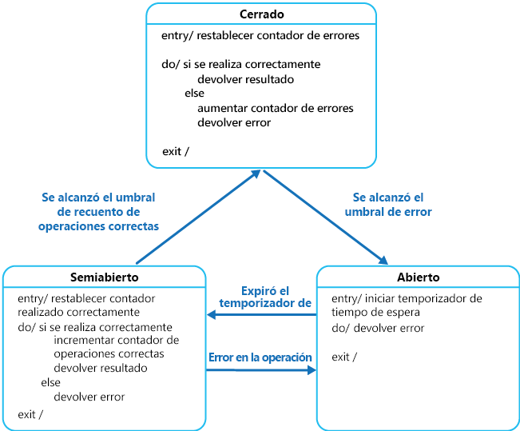

# <a name="circuit-breaker-pattern"></a>Patrón de disyuntor

Controla los errores cuya recuperación puede tardar una cantidad variable de tiempo durante la conexión a un recurso o servicio remoto. Puede mejorar la estabilidad y la resistencia de una aplicación.

## <a name="context-and-problem"></a>Contexto y problema

En un entorno distribuido, las llamadas a los servicios y los recursos remotos pueden producir un error debido a errores transitorios, como son las conexiones de red lentas, el agotamiento de los tiempos de espera o los recursos que se sobrecargan o no están disponibles temporalmente. Estos errores suelen corregirse por sí mismos tras un breve período de tiempo y una aplicación en la nube sólida debe estar preparada para controlarlos mediante una estrategia como la del [patrón Retry][retry-pattern] (reintento).

Sin embargo, también puede haber situaciones en las que los errores se deban a eventos no anticipados y cuya corrección puede tardar mucho más tiempo. La gravedad de estos errores puede abarcar desde una pérdida parcial de la conectividad hasta la total detención de un servicio. En estas situaciones, es posible que no tenga sentido para una aplicación volver a intentar continuamente una operación que no es probable que pueda funcionar de modo correcto y, en su lugar, deba admitir este hecho con rapidez y tratar este error en consecuencia.

Además, si un servicio está muy ocupado, el error en una parte del sistema podría provocar errores en cascada. Por ejemplo, una operación que invoca un servicio puede configurarse para implementar un tiempo de espera y responder con un mensaje de error si el servicio no responde dentro de este período. Sin embargo, esta estrategia puede desencadenar muchas solicitudes simultáneas a la misma operación para que se bloquee hasta que expire el período de tiempo de espera. Estas solicitudes bloqueadas pueden contener recursos críticos del sistema, tales como memoria, subprocesos o conexiones de base de datos, entre otros. Por lo tanto, estos recursos podrían agotarse y provocar errores de otras partes posiblemente no relacionadas del sistema que tenga que usar los mismos recursos. En estas situaciones, podría ser preferible para la operación dejar de funcionar de inmediato y solo intentar invocar el servicio si es probable que pueda ejecutarse correctamente. Tenga en cuenta que establecer un tiempo de espera menor podría ayudar a resolver este problema, pero no debería ser tan corto como para que la operación dé error en la mayoría de los casos, incluso aunque la solicitud al servicio finalmente pudiera realizarse correctamente.

## <a name="solution"></a>Solución

El patrón Circuit Breaker, popularizado por Michael Nygard en su libro [Release It!](https://pragprog.com/book/mnee/release-it), puede impedir que una aplicación intente repetidamente ejecutar una operación que tenga probabilidad de dar error. Ello le permite continuar sin esperar a corregir el error ni desperdiciar ciclos de CPU mientras se determina si el error continuará durante mucho tiempo. El patrón Circuit Breaker también permite a una aplicación detectar si el error se ha resuelto. Si el problema parece haberse corregido, la aplicación puede intentar invocar la operación.

> El propósito del patrón Circuit Breaker difiere de la finalidad del patrón Retry. El patrón Retry permite a una aplicación volver a intentar una operación esperando que se podrá ejecutar correctamente. El patrón Circuit Breaker impide que una aplicación realice una operación que probablemente produzca errores. Una aplicación puede combinar estos dos patrones usando Retry para invocar una operación a través de un disyuntor. Sin embargo, la lógica de reintento debe tener en cuenta las excepciones devueltas por el disyuntor y dejar de reintentar la operación si este indica que un error no es transitorio.

Un disyuntor actúa como un proxy para las operaciones que podrían producir errores. El proxy debe supervisar el número de errores recientes que se han producido y utilizar esta información para decidir si permitir que continúe la operación, o simplemente devolver de inmediato una excepción.

El proxy se puede implementar como una máquina de estados con los siguientes estados que imitan la funcionalidad de un disyuntor eléctrico:

- **Cerrado**: la solicitud de la aplicación se enruta a la operación. El proxy mantiene un recuento del número de errores recientes y, si la llamada a la operación se realiza correctamente, el proxy incrementa este recuento. Si el número de errores recientes supera un umbral especificado en un período de tiempo determinado, el proxy se coloca en el estado **Open** (abierto). En este momento, el proxy inicia un temporizador de tiempo de espera y, cuando este temporizador expira, se coloca en el estado **Half-open** (semiabierto).

    > El propósito del temporizador de tiempo de espera es conceder al sistema tiempo para corregir el problema que provocó el error, antes de permitir que la aplicación intente realizar la operación de nuevo.

- **Open** (abierto): la solicitud de la aplicación produce un error inmediatamente y se devuelve una excepción a la aplicación.

- **Half-Open** (semiabierto): puede pasar un número limitado de solicitudes de la aplicación e invocar la operación. Si estas solicitudes se realizan correctamente, se supone que la causa del error se ha corregido y el disyuntor cambia al estado **Closed** (cerrado) y el número de errores se restablece. Si alguna solicitud da error, el disyuntor supone que el anterior error no se solucionó y vuelve al estado **Open** (abierto) y reinicia el temporizador de tiempo de espera para dar al sistema más tiempo para recuperarse.

    > El estado **Half-open** (semiabierto) es útil para impedir que un servicio de recuperación se inunde de repente con solicitudes. A medida que un servicio se recupera, podría ser capaz de admitir un volumen limitado de solicitudes hasta que la recuperación se completa, pero, mientras está en curso, una saturación de trabajo puede hacer que el servicio agote el tiempo de espera o dé error de nuevo.



En la ilustración, el contador de errores que usa el estado **Closed** (cerrado) depende del tiempo. Se restablece automáticamente a intervalos periódicos. Esto ayuda a impedir que el disyuntor entre en el estado **Open** (abierto) si experimenta errores ocasionales. El umbral de error que se encuentra con el disyuntor en el estado **Open** (abierto) solo se alcanza cuando se produce un número especificado de errores durante un intervalo especificado. El contador utilizado por el estado **Half-Open** (semiabierto) registra el número de intentos correctos para invocar la operación. El disyuntor vuelve al estado **Closed** (cerrado) después de un número especificado de llamadas consecutivas a la operación que hayan tenido éxito. Si se produce un error en alguna invocación, el disyuntor entra en el estado **Open** (abierto) inmediatamente y el contador de éxitos se restablecerá la próxima vez que entre en el estado **Half-Open** (semiabierto).

> Externamente, es posible que las recuperaciones del sistema se traten restaurando o reiniciando un componente erróneo o reparando una conexión de red.

El patrón Circuit Breaker proporciona estabilidad mientras el sistema se recupera de un error y minimiza el impacto en el rendimiento. Puede ayudar a mantener el tiempo de respuesta del sistema al rechazar rápidamente una solicitud para una operación que es probable que dé error, en lugar de esperar a que agote el tiempo de espera o no termine nunca. Si el disyuntor genera un evento cada vez que cambia el estado, esta información puede utilizarse para supervisar el estado de la parte del sistema protegida por el disyuntor o para alertar a un administrador cuando un disyuntor se active en el estado **Open** (abierto).

El patrón es personalizable y puede adaptarse según el tipo de errores posibles. Por ejemplo, puede aplicar a un disyuntor un temporizador de tiempo de espera que vaya aumentando. Puede colocar el disyuntor en el estado **Open** (abierto) inicialmente durante unos segundos y, a continuación, incrementar el tiempo de espera unos minutos, si el error no se ha resuelto, y así sucesivamente. En algunos casos, en lugar de que el estado **Open** (abierto) devuelva un error y genere una excepción, puede ser útil devolver un valor predeterminado que sea significativo para la aplicación.

## <a name="issues-and-considerations"></a>Problemas y consideraciones

A la hora de decidir cómo implementar este patrón, debe considerar los siguientes puntos:

**Control de excepciones**. Una aplicación que invoca una operación a través de un disyuntor debe estar preparada para controlar las excepciones que se produzcan si la operación no está disponible. La forma en que se controlan las excepciones será específica de la aplicación. Por ejemplo, una aplicación podría degradar temporalmente su funcionalidad, invocar una operación alternativa para intentar realizar la misma tarea u obtener los mismos datos, o notificar la excepción al usuario y pedirle que la vuelva a intentar más tarde.

**Tipos de excepciones**. Una solicitud podría producir un error por diversos motivos, algunos de los cuales podrían indicar un tipo de error más grave que otras. Por ejemplo, una solicitud podría dar error porque un servicio remoto haya dejado de funcionar y tardará varios minutos en recuperarse, o por un tiempo de espera agotado debido a que el servicio está sobrecargado temporalmente. Un disyuntor puede examinar los tipos de excepciones que se producen y ajustar su estrategia en función de la naturaleza de estas excepciones. Por ejemplo, podría ser necesario un mayor número de excepciones de tiempo de espera para activar el disyuntor en el estado **Open** (abierto) en comparación con el número de errores debidos a que el servicio no esté completamente disponible.

**Registro**. Un disyuntor debe registrar todas las solicitudes con error (y, posiblemente, las correctas) para permitir que un administrador supervise el estado de la operación.

**Capacidad de recuperación**. Debe configurar el disyuntor para que coincida con el modelo de recuperación más probable de la operación que se protege. Por ejemplo, si el disyuntor permanece en el estado **Open** (abierto) durante un largo período, podría producir excepciones aunque el motivo del error se hubiese resuelto. De igual forma, podría fluctuar y reducir los tiempos de respuesta de las aplicaciones si pasa del estado **Open** a **Half-Open** demasiado rápidamente.

**Prueba de las operaciones con error**. En el estado **Open**, en lugar de usar un temporizador para determinar cuándo cambiar al estado **Half-Open**, un disyuntor puede en cambio hacer ping periódicamente al servicio remoto o al recurso para determinar si tiene que estar disponible de nuevo. Este ping podría adoptar la forma de intento de invocar una operación que hubiera generado el error previamente o podría usar una operación especial proporcionada por el servicio remoto de forma específica para probar el estado del servicio, como se describe en el [patrón Health Endpoint Monitoring](health-endpoint-monitoring.md) (supervisión del punto de conexión de estado).

**Invalidación manual**. En un sistema en el que el tiempo de recuperación de una operación que da error es muy variable, es conveniente proporcionar una opción de restablecimiento manual que permita a un administrador cerrar un disyuntor (y restablecer el contador de errores). De forma similar, un administrador podría forzar que un disyuntor pase al estado **Open** y reiniciar así el temporizador de tiempo de espera, si la operación protegida por el disyuntor no está disponible temporalmente.

**Simultaneidad**. El mismo disyuntor podría tener acceso a un gran número de instancias simultáneas de una aplicación. La implementación no debe bloquear las solicitudes simultáneas ni agregar una sobrecarga excesiva a cada llamada a una operación.

**Diferenciación de los recursos**. Tenga cuidado al usar un único disyuntor para un tipo de recurso si puede haber varios proveedores independientes subyacentes. Por ejemplo, en un almacén de datos que contenga varias particiones, una podría ser totalmente accesible mientras otra experimenta un problema temporal. Si se combinan las respuestas de error en estos casos, una aplicación podría intentar acceder a algunas particiones incluso cuando fuese muy probable que se produjera un error, mientras que el acceso a las otras podría bloquearse, aunque hubiera mucha probabilidad de que no sufrieran problemas.

**Disyuntor acelerado**. A veces, una respuesta de error puede contener suficiente información para que el disyuntor se active inmediatamente y permanezca así una cantidad mínima de tiempo. Por ejemplo, la respuesta de error de un recurso compartido que está sobrecargado podría indicar que no se recomienda un reintento inmediato y que la aplicación, en cambio, debe intentarse de nuevo al cabo de unos minutos.

> [!NOTE]
> Un servicio puede devolver HTTP 429 (demasiadas solicitudes), si está limitando al cliente, o HTTP 503 (servicio no disponible), si el servicio no está disponible actualmente. La respuesta puede incluir información adicional, como la duración prevista del retraso.

**Respuesta de las solicitudes con error**. En el estado **Open**, en lugar de generar un error rápidamente, un disyuntor también puede registrar los detalles de cada solicitud en un diario y hacer que estas solicitudes se reproduzcan cuando el servicio o el recurso remoto estén disponibles.

**Tiempos de espera inadecuados en servicios externos**. Un disyuntor podría no ser capaz de proteger completamente las aplicaciones de las operaciones que generan errores en los servicios externos configurados con un período prolongado de tiempo de espera. Si el tiempo de espera es demasiado largo, un subproceso que ejecuta un disyuntor podría bloquearse durante un largo período antes de que este indique que la operación ha fracasado. En este momento, muchas otras instancias de aplicaciones también podrían intentar invocar el servicio a través del disyuntor y ocupar un número significativo de subprocesos antes de que todos den error.

## <a name="when-to-use-this-pattern"></a>Cuándo usar este patrón

Use este patrón:

- Para evitar que una aplicación intente invocar un servicio remoto o acceda a un recurso compartido, si es muy probable que esta operación produzca un error.

No se recomienda este patrón:

- Para el control del acceso a los recursos locales privados en una aplicación, como la estructura de datos en memoria. En este entorno, el uso de un disyuntor agregaría sobrecarga al sistema.
- Como sustituto para controlar las excepciones en la lógica empresarial de las aplicaciones.

## <a name="example"></a>Ejemplo

En una aplicación web, algunas de las páginas se rellenan con los datos recuperados de un servicio externo. Si el sistema implementa el almacenamiento en caché mínimo, más visitas a estas páginas provocarán un recorrido de ida y vuelta al servicio. Las conexiones desde la aplicación web al servicio podrían configurarse con un período de tiempo de espera (normalmente, 60 segundos) y, si el servicio no responde en este tiempo, la lógica de cada página web asumirá que el servicio no está disponible y generará una excepción.

Sin embargo, si se produce un error en el servicio y el sistema está muy ocupado, los usuarios se verán obligados a esperar hasta 60 segundos antes de que se produzca una excepción. Al final, los recursos como la memoria, las conexiones y los subprocesos podrían agotarse, lo que impediría que otros usuarios se conectaran al sistema, incluso si no estuvieran accediendo a páginas que recuperen datos del servicio.

El escalado del sistema agregando más servidores web e implementando el equilibrio de carga podría demorarse al agotarse los recursos, pero no resolverá el problema porque las solicitudes de los usuarios seguirán sin responder y todos los servidores web podrían quedarse finalmente sin recursos.

Ajustar la lógica que se conecta al servicio y recupera los datos en un disyuntor puede contribuir a solucionar este problema y controlar los errores del servicio de un modo más elegante. Las solicitudes de los usuarios seguirán sin ser satisfechas, pero el error se reconocerá más rápidamente y los recursos no se bloquearán.

La clase `CircuitBreaker` mantiene la información de estado sobre un disyuntor en un objeto que implementa la interfaz `ICircuitBreakerStateStore` que se muestra en el código siguiente.

```csharp
interface ICircuitBreakerStateStore
{
  CircuitBreakerStateEnum State { get; }

  Exception LastException { get; }

  DateTime LastStateChangedDateUtc { get; }

  void Trip(Exception ex);

  void Reset();

  void HalfOpen();

  bool IsClosed { get; }
}
```

La propiedad `State` indica el estado actual del disyuntor y será **Open** (abierto), **HalfOpen** (semiabierto) o **Closed** (cerrado) según se defina en la enumeración `CircuitBreakerStateEnum`. La propiedad `IsClosed` debe ser true si el disyuntor está cerrado, y false si está abierto o semiabierto. El método `Trip` cambia el estado del disyuntor a Open y registra la excepción que produjo el cambio de estado, junto con la fecha y la hora. Las propiedades `LastException` y `LastStateChangedDateUtc` devuelven esta información. El método `Reset` cierra el disyuntor y el método `HalfOpen` establece el disyuntor en semiabierto.

La clase `InMemoryCircuitBreakerStateStore` del ejemplo contiene una implementación de la interfaz `ICircuitBreakerStateStore`. La clase `CircuitBreaker` crea una instancia de esta clase para contener el estado del disyuntor.

El método `ExecuteAction` de la clase `CircuitBreaker` encapsula una operación, especificada como un delegado `Action`. Si se cierra el disyuntor, `ExecuteAction` invoca el delegado `Action`. Si se produce un error en la operación, un controlador de excepciones llama a `TrackException`, que establece el estado del disyuntor en Open. En el siguiente ejemplo de código se resalta este flujo.

```csharp
public class CircuitBreaker
{
  private readonly ICircuitBreakerStateStore stateStore =
    CircuitBreakerStateStoreFactory.GetCircuitBreakerStateStore();

  private readonly object halfOpenSyncObject = new object ();
  ...
  public bool IsClosed { get { return stateStore.IsClosed; } }

  public bool IsOpen { get { return !IsClosed; } }

  public void ExecuteAction(Action action)
  {
    ...
    if (IsOpen)
    {
      // The circuit breaker is Open.
      ... (see code sample below for details)
    }

    // The circuit breaker is Closed, execute the action.
    try
    {
      action();
    }
    catch (Exception ex)
    {
      // If an exception still occurs here, simply
      // retrip the breaker immediately.
      this.TrackException(ex);

      // Throw the exception so that the caller can tell
      // the type of exception that was thrown.
      throw;
    }
  }

  private void TrackException(Exception ex)
  {
    // For simplicity in this example, open the circuit breaker on the first exception.
    // In reality this would be more complex. A certain type of exception, such as one
    // that indicates a service is offline, might trip the circuit breaker immediately.
    // Alternatively it might count exceptions locally or across multiple instances and
    // use this value over time, or the exception/success ratio based on the exception
    // types, to open the circuit breaker.
    this.stateStore.Trip(ex);
  }
}
```

En el ejemplo siguiente se muestra el código (omitido en el ejemplo anterior) que se ejecuta si no se cierra el disyuntor. En primer lugar, comprueba si el disyuntor ha permanecido abierto durante un período mayor que el tiempo especificado por el campo local `OpenToHalfOpenWaitTime` de la clase `CircuitBreaker`. Si este es el caso, el método `ExecuteAction` establece el disyuntor en semiabierto; a continuación, intenta realizar la operación especificada por el delegado `Action`.

Si la operación se realiza correctamente, el disyuntor se restablece al estado cerrado. Si se produce un error, se activa de nuevo el estado abierto y la hora en que se produjo la excepción se actualiza para que el disyuntor espere durante un período mayor, antes de intentar realizar la operación de nuevo.

Si el disyuntor solo se ha abierto durante un breve período, menor que el valor `OpenToHalfOpenWaitTime`, el método `ExecuteAction` simplemente genera una excepción `CircuitBreakerOpenException` y devuelve el error que provocó que el disyuntor pasara al estado abierto.

Además, utiliza un bloqueo para evitar que el disyuntor trate de realizar llamadas simultáneas a la operación mientras esté semiabierto. Si simultáneamente se intenta invocar la operación, se tratará como si el disyuntor estuviera abierto y se seguirá generando una excepción, tal y como se describe más adelante.

```csharp
    ...
    if (IsOpen)
    {
      // The circuit breaker is Open. Check if the Open timeout has expired.
      // If it has, set the state to HalfOpen. Another approach might be to
      // check for the HalfOpen state that had be set by some other operation.
      if (stateStore.LastStateChangedDateUtc + OpenToHalfOpenWaitTime < DateTime.UtcNow)
      {
        // The Open timeout has expired. Allow one operation to execute. Note that, in
        // this example, the circuit breaker is set to HalfOpen after being
        // in the Open state for some period of time. An alternative would be to set
        // this using some other approach such as a timer, test method, manually, and
        // so on, and check the state here to determine how to handle execution
        // of the action.
        // Limit the number of threads to be executed when the breaker is HalfOpen.
        // An alternative would be to use a more complex approach to determine which
        // threads or how many are allowed to execute, or to execute a simple test
        // method instead.
        bool lockTaken = false;
        try
        {
          Monitor.TryEnter(halfOpenSyncObject, ref lockTaken);
          if (lockTaken)
          {
            // Set the circuit breaker state to HalfOpen.
            stateStore.HalfOpen();

            // Attempt the operation.
            action();

            // If this action succeeds, reset the state and allow other operations.
            // In reality, instead of immediately returning to the Closed state, a counter
            // here would record the number of successful operations and return the
            // circuit breaker to the Closed state only after a specified number succeed.
            this.stateStore.Reset();
            return;
          }
        }
        catch (Exception ex)
        {
          // If there's still an exception, trip the breaker again immediately.
          this.stateStore.Trip(ex);

          // Throw the exception so that the caller knows which exception occurred.
          throw;
        }
        finally
        {
          if (lockTaken)
          {
            Monitor.Exit(halfOpenSyncObject);
          }
        }
      }
      // The Open timeout hasn't yet expired. Throw a CircuitBreakerOpen exception to
      // inform the caller that the call was not actually attempted,
      // and return the most recent exception received.
      throw new CircuitBreakerOpenException(stateStore.LastException);
    }
    ...
```

Para usar un objeto `CircuitBreaker` para proteger una operación, una aplicación crea una instancia de la clase `CircuitBreaker` e invoca el método `ExecuteAction`, lo que especifica que la operación debe realizarse como el parámetro. La aplicación debe estar preparada para detectar la excepción `CircuitBreakerOpenException`, si se produce un error en la operación porque el disyuntor está abierto. El código siguiente muestra un ejemplo:

```csharp
var breaker = new CircuitBreaker();

try
{
  breaker.ExecuteAction(() =>
  {
    // Operation protected by the circuit breaker.
    ...
  });
}
catch (CircuitBreakerOpenException ex)
{
  // Perform some different action when the breaker is open.
  // Last exception details are in the inner exception.
  ...
}
catch (Exception ex)
{
  ...
}
```

## <a name="related-patterns-and-guidance"></a>Orientación y patrones relacionados

Los patrones siguientes también pueden ser útiles a la hora de implementar este modelo:

- [Patrón Retry] [retry-pattern] (reintento). Describe el modo en que una aplicación puede tratar los errores temporales anticipados cuando intenta conectarse a un servicio o un recurso de red, al reintentar de forma transparente una operación que anteriormente fracasó.

- [Patrón Health Endpoint Monitoring](health-endpoint-monitoring.md) (supervisión de puntos de conexión de estado). Un disyuntor puede probar el estado de un servicio enviando una solicitud a un punto de conexión expuesto por el servicio. El servicio debería devolver información que indique su estado.


[retry-pattern]: ./retry.md
