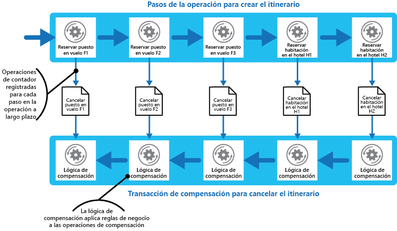

# Patrón Compensating Transaction (Transacción de compensación)

[!INCLUDE [header](../_includes/header.md)]

Deshace el trabajo realizado mediante una serie de pasos, que conjuntamente definen una operación definitivamente coherente, si uno o varios de los pasos termina en error. Las operaciones que siguen el modelo de coherencia definitiva se suelen encontrar en aplicaciones hospedadas en la nube que implementan flujos de trabajo y procesos empresariales complejos.

## Contexto y problema

Las aplicaciones que se ejecutan en la nube con frecuencia modifican datos. Estos datos pueden estar repartidos entre varios orígenes de datos mantenidos en diferentes ubicaciones geográficas. Para evitar la contención y mejorar el rendimiento en un entorno distribuido, una aplicación no debe intentar proporcionar una fuerte coherencia transaccional. Por el contrario, la aplicación debe implementar coherencia definitiva. En este modelo, una operación empresarial habitual consta de una serie de distintos pasos. Mientras se realizan estos pasos, la vista general del estado del sistema puede ser incoherente, pero cuando se completa la operación y se han ejecutado todos los pasos, el sistema debe volverse de nuevo coherente.

> En [Data Consistency Primer](https://msdn.microsoft.com/library/dn589800.aspx) (Manual básico de coherencia de datos) se proporciona información sobre por qué las transacciones distribuidas no se escalan bien, y se incluyen los principios del modelo de coherencia definitiva.

Una de las dificultades del modelo de coherencia definitiva es cómo tratar con un paso que ha dado error. En este caso, podría ser necesario deshacer todo el trabajo realizado en los pasos anteriores de la operación. Sin embargo, no basta simplemente con revertir los datos, ya que es posible que otras instancias simultáneas de la aplicación hayan cambiado. Incluso en casos donde una instancia simultánea no ha modificado los datos, deshacer un paso puede no ser solo cuestión de restaurar el estado original. Podría ser necesario aplicar varias reglas específicas el negocio (consulte el sitio web de viajes descrito en la sección de ejemplos).

Si una operación que implementa coherencia definitiva abarca varios almacenes de datos heterogéneos, para deshacer los pasos de la operación será necesario visitar cada almacén de datos por turnos. El trabajo realizado en cada almacén de datos se debe deshacer de manera confiable para impedir que el sistema permanezca incoherente.

No todos los datos afectados por una operación que implementa la coherencia definitiva se pueden mantener en una base de datos. En un entorno de arquitectura orientada a servicios (SOA), una operación podría invocar una acción en un servicio y provocar un cambio en el estado que mantiene ese servicio. Para deshacer la operación, este cambio de estado también se debe deshacer. Esto puede suponer invoca nuevamente el servicio y realizar otra acción que invierta los efectos de la primera.

## Solución

La solución pasa por implementar una transacción de compensación. Los pasos de una transacción de compensación deben deshacer los efectos de los pasos de la operación original. Una transacción de compensación no puede reemplazar simplemente el estado actual por el estado en que se encontraba el sistema al principio de la operación porque este enfoque podría sobrescribir los cambios realizados por otras instancias simultáneas de una aplicación. En lugar de ello, debe ser un proceso inteligente que tenga en cuenta el trabajo realizado por instancias simultáneas. Normalmente, este proceso será específico de la aplicación y dependerá de la naturaleza del trabajo realizado por la operación original.

Un enfoque común es usar un flujo de trabajo para implementar una operación de coherencia definitiva que requiere compensación. Mientras se realiza la operación original, el sistema registra información acerca de cada paso y cómo se puede deshacer el trabajo realizado por ese paso. Si se produce un error en la operación en cualquier momento, el flujo de trabajo retrocede a los pasos completados y realiza el trabajo que invierte cada paso. Tenga en cuenta que es posible que una transacción de compensación no tenga que deshacer el trabajo en el orden inverso exacto de la operación original, algunos de los pasos para deshacer podrían realizarse en paralelo.

> Este enfoque es similar a la estrategia de Sagas que se describe en el [blog de Clemens Vasters](http://vasters.com/clemensv/2012/09/01/Sagas.aspx).

Una transacción de compensación es asimismo una operación de coherencia definitiva y también podría dar error. El sistema debería poder reanudar la transacción de compensación en el punto de error y continuar. Como podría ser necesario repetir un paso que no se pudo realizar, los pasos de una transacción de compensación deben definirse como comandos idempotentes. Para más información, consulte los [patrones de idempotencia](http://blog.jonathanoliver.com/2010/04/idempotency-patterns/) en el blog de Jonathan Oliver.

En algunos casos, puede que no sea posible recuperarse de un paso que ha dado error si no es mediante intervención manual. En estas situaciones el sistema debe generar una alerta y proporcionar tanta información como sea posible sobre el motivo del error.

## Problemas y consideraciones

Tenga en cuenta los puntos siguientes al decidir cómo implementar este patrón:

Puede que no sea fácil determinar el momento en el que ha dado error un paso de una operación que implementa coherencia definitiva. Es posible que un paso no genere error inmediatamente, pero podría dar lugar a un bloqueo. Podría ser necesario implementar algún tipo de mecanismo de tiempo de espera.

-La lógica de compensación no se generaliza fácilmente. Una transacción de compensación es específica de la aplicación. Se basa en la aplicación que tiene información suficiente para poder deshacer los efectos de cada paso en una operación con errores.

Los pasos de una transacción de compensación se deben definir como comandos idempotentes. De esta forma, se puede repetir los pasos si la transacción, de compensación propiamente dicha produce error.

La infraestructura que administra los pasos de la operación original debe ser resistente, y lo mismo la transacción de compensación. En este sentido, no debe perder la información necesaria para compensar un paso de error y debe ser capaz de supervisar de forma confiable el progreso de la lógica de compensación.

Una transacción de compensación no devuelve necesariamente los datos del sistema al estado que tenía al inicio de la operación original. Lo que hace es compensar el trabajo realizado mediante los pasos que se realizaron correctamente antes de que la operación produjera un error.

El orden de los pasos de la transacción de compensación no tiene que ser necesariamente el opuesto exacto de los pasos de la operación original. Por ejemplo, un almacén de datos podría ser más sensible a las incoherencias que otro y, por tanto, los pasos de la transacción de compensación que deshacen los cambios realizados en este almacén deberían realizarse en primer lugar.

Una manera de aumentar la probabilidad de que la actividad general tenga éxito, consiste en colocar un bloqueo a corto plazo basado en el tiempo de espera sobre cada recurso que es necesario para realizar una operación y obtener esos recursos con antelación. El trabajo debe realizarse solo después de que todos los recursos se han adquirido. Todas las acciones se deben finalizar antes de que expiren los bloqueos.

Considere la posibilidad de usar una lógica de reintentos que sea más flexible de lo habitual para reducir los errores que desencadenan una transacción de compensación. Si se produce un error en una operación que implementa coherencia definitiva, intente abordar el error como una excepción transitoria y repita el paso. Únicamente detenga la operación e inicie una transacción de compensación si un paso da error de forma repetida o irrecuperable.

> Muchas de las dificultades de implementar una transacción de compensación son las mismas que las que se experimentan al implementar coherencia definitiva. Consulte la sección sobre las consideraciones para implementar coherencia definitiva en el [Data Consistency Primer](https://msdn.microsoft.com/library/dn589800.aspx) (Manual básico de coherencia de datos) para más información.

## Cuándo usar este patrón

Use este patrón únicamente en operaciones que se deben deshacer si se produce un error. Si es posible, diseñe soluciones que eviten la complejidad de exigir transacciones de compensación.

## Ejemplo

Un sitio web de viajes permite que los clientes reserven itinerarios. Un único itinerario podría constar de vuelos y hoteles. Un cliente que viaja de Seattle a Londres y, luego, a París podría realizar los siguientes pasos al crear un itinerario:

1. Reservar una plaza en el vuelo F1 de Seattle a Londres.
2. Reservar una plaza en el vuelo F2 de Londres a París.
3. Reservar una plaza en el vuelo F3 de París a Seattle.
4. Reservar una habitación en el hotel H1 en Londres.
5. Reservar una habitación en el hotel H2 en París.

Estos pasos constituyen una operación de coherencia definitiva, aunque cada paso es una acción independiente. Por lo tanto, mientras se realizan estos pasos, el sistema deben registrar también las operaciones de contador necesarias para deshacer cada paso en caso de que el cliente decida cancelar el itinerario. Los pasos necesarios para realizar las operaciones de contador se pueden ejecutar entonces como una transacción de compensación.

Tenga en cuenta que los pasos de la transacción de compensación podrían no ser el opuesto exacto de los pasos originales, y que la lógica de cada paso de la transacción de compensación debe tener en cuenta las reglas específicas del negocio. Por ejemplo, cancelar la reserva de una plaza en un vuelo podría no dar derecho al cliente a una devolución completa del dinero abonado. En la figura se ilustra la generación de una transacción de compensación para deshacer una transacción de ejecución prolongada con el fin de reservar un itinerario de viaje.

> Es posible que los pasos de la transacción de compensación se realicen en paralelo, en función de cómo haya diseñado la lógica de compensación de cada paso.

En muchas soluciones empresariales, que un único paso produzca error no significa que haya que restaurar todo el sistema mediante una transacción de compensación. Por ejemplo, si&mdash;después de haber reservado los vuelos F1 y F2, F3 en el escenario del sitio web de viajes&mdash;el cliente no puede reservar una habitación en el hotel H1, es preferible ofrecer al cliente una habitación en un hotel diferente de la misma ciudad en lugar de cancelar los vuelos. El cliente todavía puede decidir cancelarlos (en cuyo caso la transacción de compensación se ejecuta y se deshacen las reservas realizadas en los vuelos F1, F2 y F3), pero esta decisión debe tomarla el cliente y no el sistema.

## Orientación y patrones relacionados

Los patrones y las directrices siguientes también pueden ser importantes a la hora de implementar este modelo:

- [Data Consistency Primer](https://msdn.microsoft.com/library/dn589800.aspx) (Manual básico de coherencia de datos) El patrón Compensating Transaction se usa a menudo para deshacer operaciones que implementan el modelo de coherencia definitiva. En este manual se proporciona información sobre las ventajas e inconvenientes de la coherencia definitiva.

- [Patrón Scheduler-Agent-Supervisor](scheduler-agent-supervisor.md). Describe cómo implementar sistemas resistentes que realicen operaciones empresariales en las que se usen recursos y servicios distribuidos. En ocasiones, podría ser necesario deshacer el trabajo realizado por una operación mediante el uso de una transacción de compensación.

- [Patrón Retry](./retry.md). Las transacciones de compensación pueden resultar costosas de realizar, y una forma de reducir su uso podría ser implementar una directiva efectiva de reintento de las operaciones con error siguiendo el patrón Retry.
