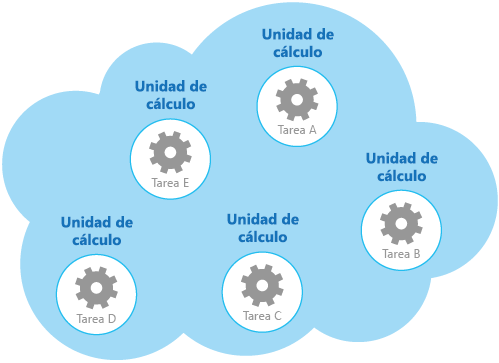
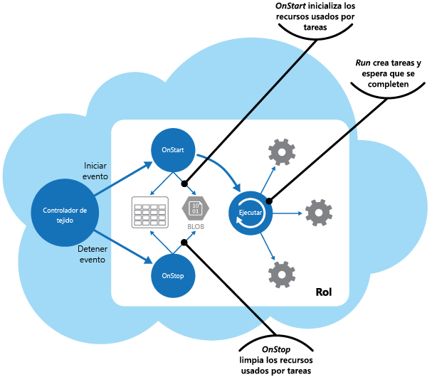

# <a name="compute-resource-consolidation-pattern"></a>Patrón Compute Resource Consolidation

[!INCLUDE [header](../_includes/header.md)]

Consolida varias tareas u operaciones en una sola unidad de cálculo. Esta consolidación puede aumentar el uso de recursos de proceso y reducir los costes y la sobrecarga de administración asociados a la realización del procesamiento de procesos en aplicaciones hospedadas en la nube.

## <a name="context-and-problem"></a>Contexto y problema

Con frecuencia una aplicación en la nube implementa diversas operaciones. En algunas soluciones, resulta conveniente seguir el principio de diseño de separación inicial de problemas y dividir estas operaciones en unidades de cálculo independientes que se hospedan e implementan de manera individual (por ejemplo, como aplicaciones web de App Service independientes, instancias independientes de Virtual Machines o roles de servicios en la nube independientes). Sin embargo, aunque esta estrategia puede ayudar a simplificar el diseño lógico de la solución, la implementación de un gran número de unidades de cálculo como parte de la misma aplicación puede aumentar los costes de hospedaje en tiempo de ejecución y dificultar la administración del sistema.

Por ejemplo, en la ilustración se muestra la estructura simplificada de una solución hospedada en la nube que se implementa mediante más de una unidad de cálculo. Cada unidad de cálculo se ejecuta en su propio entorno virtual. Cada función se ha implementado como una tarea independiente (etiquetadas de la tarea A-a la tarea E) que se ejecuta en su propia unidad de cálculo.



Cada unidad de cálculo consume recursos facturables, incluso cuando está inactiva o se usa poco. Por lo tanto, esta solución no es siempre la más rentable.

En Azure, este problema se aplica a los roles de una instancia de Cloud Services, App Services y Virtual Machines. Estos elementos se ejecutan en su propio entorno virtual. La ejecución de una colección de roles, sitios web o máquinas virtuales independientes que están diseñados para realizar un conjunto de operaciones bien definidas, pero que necesitan comunicarse y colaborar como parte de una única solución, puede suponer un uso ineficiente de los recursos.

## <a name="solution"></a>Solución

Para ayudar a reducir los costes, aumentar la utilización, mejorar la velocidad de comunicación y reducir la administración, es posible consolidar varias tareas u operaciones en una sola unidad de cálculo.

Las tareas se pueden agrupar según criterios basados en las características que proporciona el entorno y los costes asociados con estas características. Un enfoque común consiste en buscar las tareas que tienen un perfil similar en lo relativo a sus requisitos de escalabilidad, duración y procesamiento. Cuando se agrupan juntas se pueden escalar como una unidad. La elasticidad que proporcionan muchos entornos de nube permite que se inicien y detengan instancias adicionales de una unidad de cálculo según la carga de trabajo. Por ejemplo, Azure ofrece escalado automático que se puede aplicar a los roles de una instancia de Cloud Services, App Services o Virtual Machines. Para más información, consulte [Guía de escalado automático](https://msdn.microsoft.com/library/dn589774.aspx).

Como ejemplo de contador para mostrar cómo se puede usar la escalabilidad para determinar qué operaciones no deben agruparse, tenga en cuenta las dos tareas siguientes:

- La tarea 1 sondea los mensajes poco frecuentes e independientes del tiempo enviados a una cola.
- La tarea 2 controla las ráfagas de gran volumen del tráfico de red.

La segunda tarea requiere elasticidad que puede implicar iniciar y detener un gran número de instancias de la unidad de cálculo. Aplicar la misma escala a la primera tarea simplemente supondría que más tareas escuchan mensajes poco frecuentes en la misma cola, lo que es una pérdida de recursos.

En muchos entornos de nube, es posible especificar los recursos disponibles para una unidad de cálculo en términos del número de núcleos de CPU, la memoria, el espacio en disco, etc. Por lo general, cuantos más recursos se especifican, mayor es el coste. Para ahorrar dinero, es importante maximizar el trabajo que realiza una unidad de cálculo y no permitir que se vuelva inactiva durante un período de tiempo prolongado.

Si hay tareas que requieren gran cantidad de potencia de CPU en ráfagas cortas, considere la posibilidad de consolidar estos elementos en una sola unidad de cálculo que proporcione la potencia necesaria. Sin embargo, es importante equilibrar esta necesidad de mantener ocupados los recursos costosos con la contención que podría producirse si se someten a una sobrecarga. Las tareas de proceso intensivo de larga duración no deben compartir la misma unidad de cálculo, por ejemplo.

## <a name="issues-and-considerations"></a>Problemas y consideraciones

Tenga en cuenta los puntos siguientes al implementar este patrón:

**Escalabilidad y elasticidad**. Muchas soluciones de nube implementan escalabilidad y elasticidad en el nivel de la unidad de cálculo mediante el inicio y la detención de instancias de unidades. Evite agrupar tareas que tengan requisitos de escalabilidad en conflicto en la misma unidad de cálculo.

**Vigencia**. La infraestructura de nube recicla periódicamente el entorno virtual que hospeda una unidad de cálculo. Cuando hay muchas tareas de larga ejecución dentro de una unidad de cálculo, podría ser necesario configurar la unidad para evitar que se recicle hasta que estas tareas hayan terminado. Otra alternativa es diseñar las tareas mediante un enfoque de punto de comprobación que les permite detenerse correctamente y continuar en el punto en que se interrumpieron cuando la unidad de cálculo se reinicie.

**Ritmo de lanzamientos**. Si la implementación o la configuración de una tarea cambian con frecuencia, podría ser necesario detener la unidad de cálculo que hospeda el código actualizado, volver a configurarla e implementarla y, luego, reiniciarla. Este proceso también exigirá que todas las demás tareas dentro de la misma unidad de cálculo se detengan, se vuelvan a implementar y se reinicien.

**Seguridad**. Las tareas de la misma unidad de cálculo podrían compartir el mismo contexto de seguridad y acceder a los mismos recursos. Debe haber un alto grado de confianza entre las tareas, y la seguridad de que una tarea no va a dañar o afectar a otra de manera negativa. Además, al aumentar el número de tareas que se ejecutan en una unidad de cálculo, aumenta la superficie expuesta a ataques de la unidad. Cada tarea solo es tan segura como lo sea la que presenta la mayoría de las vulnerabilidades.

**Tolerancia a errores**. Si se produce un error en una tarea de una unidad de cálculo o la tarea se comporta de forma anómala, puede afectar a las demás tareas que se ejecutan en la misma unidad. Por ejemplo, una tarea que no se inicia correctamente puede provocar que la lógica completa de inicio de la unidad de cálculo produzca un error e impida que se ejecuten otras tareas de la misma unidad.

**Contención**. Evite la introducción de contención entre tareas que compiten por los recursos de la misma unidad de cálculo. Lo ideal es que las tareas que comparten la misma unidad de cálculo presenten características diferentes en el uso de los recursos. Por ejemplo, dos tareas de proceso intensivo no deberían residir probablemente en la misma unidad de cálculo, y tampoco dos tareas que consuman grandes cantidades de memoria. Sin embargo, mezclar una tarea de proceso intensivo y una tarea que requiere una gran cantidad de memoria es una combinación factible.

> [!NOTE]
> Considere la posibilidad de consolidar los recursos de proceso solo en sistemas que han estado en producción durante un período de tiempo, de forma que los operadores y los desarrolladores puedan supervisar los sistemas y crear un _mapa térmico_ que identifique el modo en que cada tarea usa recursos diferentes. Este mapa se puede utilizar para determinar qué tareas son buenas candidatas a compartir recursos de proceso.

**Complejidad**. Combinar varias tareas en una sola unidad de cálculo agrega complejidad al código de la unidad, de modo que posiblemente sea más difícil de probar, depurar y mantener.

**Arquitectura lógica estable**. Diseñe e implemente el código de cada tarea de forma que no sea necesario cambiarlo, incluso si lo hace el entorno físico en el que se ejecuta la tarea.

**Otras estrategias**. La consolidación de recursos de proceso es solo una manera de ayudar a reducir los costes asociados a la ejecución simultánea de varias tareas. Requiere un planeamiento y una supervisión rigurosos a fin de asegurarse de que siga siendo un enfoque efectivo. Otras estrategias podrían ser más adecuadas, según la naturaleza del trabajo y dónde se encuentren los usuarios que ejecutan estas tareas. Por ejemplo, la descomposición funcional de la carga de trabajo (como se describe en el documento [Compute Partitioning Guidance](https://msdn.microsoft.com/library/dn589773.aspx)) (Guía de creación de particiones de proceso) podría ser una mejor opción.

## <a name="when-to-use-this-pattern"></a>Cuándo usar este patrón

Use este patrón con tareas que no sean rentables si se ejecutan en sus propias unidades de cálculo. Si una tarea gasta mucho de su tiempo de inactividad, ejecutar esta tarea en una unidad dedicada puede resultar costoso.

Este patrón podría no ser adecuado con tareas que realizan operaciones críticas de tolerancia a errores, o tareas que procesan datos de alto secreto o privados y requieren su propio contexto de seguridad. Estas tareas se deben ejecutar en su propio entorno aislado, en una unidad de cálculo independiente.

## <a name="example"></a>Ejemplo

Al crear un servicio en la nube en Azure, es posible consolidar el procesamiento que realizan varias tareas en un único rol. Normalmente, es el rol de trabajo el encargado de realizar las tareas de procesamiento en segundo plano o asincrónicas.

> En algunos casos, es posible incluir dichas tareas en el rol web. Esta técnica ayuda reducir los costes y a simplificar la implementación, pero puede afectar a la escalabilidad y la capacidad de respuesta de la interfaz de acceso público proporcionada por el rol web.

El rol es responsable de iniciar y detener las tareas. Cuando el controlador de tejido de Azure carga un rol, se genera el evento `Start` para el rol. Puede invalidar el método `OnStart` de `WebRole` o la clase `WorkerRole` para tratar este evento, quizás para inicializar los datos y otros recursos de los que dependen las tareas de este método.

Cuando se completa el método `OnStart`, el rol puede comenzar a responder a las solicitudes. Puede encontrar más información e instrucciones sobre el uso de los métodos `OnStart` y `Run` en un rol en la sección [Application Startup Processes](https://msdn.microsoft.com/library/ff803371.aspx#sec16) (Procesos de inicio de aplicaciones) de la guía de patrones y prácticas [Moving Applications to the Cloud](https://msdn.microsoft.com/library/ff728592.aspx) (Movimiento de aplicaciones a la nube).

> Mantenga el código del método `OnStart` lo más conciso posible. Azure no impone ningún límite sobre el tiempo que tarda este método en completarse, pero el rol no podrá comenzar a responder a las solicitudes que recibe hasta que lo haga.

Cuando el método `OnStart` ha finalizado, el rol ejecuta el método `Run`. En este momento, el controlador de tejido puede empezar a enviar solicitudes al rol.

Coloque el código que realmente crea las tareas en el método `Run`. Tenga en cuenta que el método `Run` define la duración de la instancia de rol. Cuando este método finalice, el controlador de tejido se encargará de que el rol se apague.

Cuando un rol se apaga o se recicla, el controlador de tejido impide que se reciban más solicitudes entrantes desde el equilibrador de carga y genera el evento `Stop`. Este evento se puede capturar si se invalida el método `OnStop` del rol y se realizan los arreglos necesarios antes de que termine el rol.

> Las acciones llevadas a cabo en el método `OnStop` se deben completar al cabo de cinco minutos (o 30 segundos si va a usar el emulador de Azure en un equipo local). En caso contrario, el controlador de tejido de Azure da por supuesto que el rol está parado y lo obliga a detenerse.

Las tareas se inician mediante el método `Run` que espera a que finalicen las tareas. Las tareas implementan la lógica de negocios del servicio en la nube, y pueden responder a los mensajes publicados en el rol a través del equilibrador de carga de Azure. En la ilustración se muestra el ciclo de vida de las tareas y los recursos de un rol en un servicio en la nube de Azure.



El archivo _WorkerRole.cs_ del proyecto _ComputeResourceConsolidation.Worker_ muestra un ejemplo de cómo podría implementar este patrón en un servicio en la nube de Azure.

> El proyecto _ComputeResourceConsolidation.Worker_ forma parte de la solución _ComputeResourceConsolidation_ disponible en [GitHub](https://github.com/mspnp/cloud-design-patterns/tree/master/compute-resource-consolidation).

Los métodos `MyWorkerTask1` y `MyWorkerTask2` muestran cómo realizar diferentes tareas en el mismo rol de trabajo. El código siguiente muestra `MyWorkerTask1`. Se trata de una tarea sencilla que se suspende durante 30 segundos y, a continuación, genera un mensaje de seguimiento. Este proceso se repite hasta que se cancela la tarea. El código de `MyWorkerTask2` es similar.

```csharp
// A sample worker role task.
private static async Task MyWorkerTask1(CancellationToken ct)
{
  // Fixed interval to wake up and check for work and/or do work.
  var interval = TimeSpan.FromSeconds(30);

  try
  {
    while (!ct.IsCancellationRequested)
    {
      // Wake up and do some background processing if not canceled.
      // TASK PROCESSING CODE HERE
      Trace.TraceInformation("Doing Worker Task 1 Work");

      // Go back to sleep for a period of time unless asked to cancel.
      // Task.Delay will throw an OperationCanceledException when canceled.
      await Task.Delay(interval, ct);
    }
  }
  catch (OperationCanceledException)
  {
    // Expect this exception to be thrown in normal circumstances or check
    // the cancellation token. If the role instances are shutting down, a
    // cancellation request will be signaled.
    Trace.TraceInformation("Stopping service, cancellation requested");

    // Rethrow the exception.
    throw;
  }
}
```

> El código de ejemplo muestra una implementación común de un proceso en segundo plano. En una aplicación real, puede seguir esta misma estructura, salvo que debe colocar su propia lógica de procesamiento en el cuerpo del bucle que espera la solicitud de cancelación.

Después de que el rol de trabajo ha inicializado los recursos que usa, el método `Run` inicia las dos tareas de manera simultánea, como se muestra aquí.

```csharp
/// <summary>
/// The cancellation token source use to cooperatively cancel running tasks
/// </summary>
private readonly CancellationTokenSource cts = new CancellationTokenSource();

/// <summary>
/// List of running tasks on the role instance
/// </summary>
private readonly List<Task> tasks = new List<Task>();

// RoleEntry Run() is called after OnStart().
// Returning from Run() will cause a role instance to recycle.
public override void Run()
{
  // Start worker tasks and add to the task list
  tasks.Add(MyWorkerTask1(cts.Token));
  tasks.Add(MyWorkerTask2(cts.Token));

  foreach (var worker in this.workerTasks)
  {
      this.tasks.Add(worker);
  }

  Trace.TraceInformation("Worker host tasks started");
  // The assumption is that all tasks should remain running and not return,
  // similar to role entry Run() behavior.
  try
  {
    Task.WaitAll(tasks.ToArray());
  }
  catch (AggregateException ex)
  {
    Trace.TraceError(ex.Message);

    // If any of the inner exceptions in the aggregate exception
    // are not cancellation exceptions then re-throw the exception.
    ex.Handle(innerEx => (innerEx is OperationCanceledException));
  }

  // If there wasn't a cancellation request, stop all tasks and return from Run()
  // An alternative to canceling and returning when a task exits would be to
  // restart the task.
  if (!cts.IsCancellationRequested)
  {
    Trace.TraceInformation("Task returned without cancellation request");
    Stop(TimeSpan.FromMinutes(5));
  }
}
...
```

En este ejemplo, el método `Run` espera a que se completen las tareas. Si se cancela una tarea, el método `Run` da por supuesto que el rol se está cerrando y espera a que se cancele el resto de tareas antes de finalizar (espera un máximo de cinco minutos antes de terminar). Si se produce un error en una tarea debido a una excepción esperada, el método `Run` cancela la tarea.

> Podría implementar estrategias de supervisión y tratamiento de excepciones más completas en el método `Run`, como reiniciar tareas que han producido error o incluir código que permite que el rol detenga e inicie tareas individuales.

El método `Stop` que se muestra en el código siguiente se llama cuando el controlador de tejido cierra la instancia de rol (se invoca desde el método `OnStop`). El código detiene cada tarea de forma correcta mediante su cancelación. Si cualquier tarea tarda más de cinco minutos en completarse, el procesamiento de la cancelación en el método `Stop` deja de esperar y el rol se termina.

```csharp
// Stop running tasks and wait for tasks to complete before returning
// unless the timeout expires.
private void Stop(TimeSpan timeout)
{
  Trace.TraceInformation("Stop called. Canceling tasks.");
  // Cancel running tasks.
  cts.Cancel();

  Trace.TraceInformation("Waiting for canceled tasks to finish and return");

  // Wait for all the tasks to complete before returning. Note that the
  // emulator currently allows 30 seconds and Azure allows five
  // minutes for processing to complete.
  try
  {
    Task.WaitAll(tasks.ToArray(), timeout);
  }
  catch (AggregateException ex)
  {
    Trace.TraceError(ex.Message);

    // If any of the inner exceptions in the aggregate exception
    // are not cancellation exceptions then rethrow the exception.
    ex.Handle(innerEx => (innerEx is OperationCanceledException));
  }
}
```

## <a name="related-patterns-and-guidance"></a>Orientación y patrones relacionados

Los patrones y las directrices siguientes también pueden ser importantes a la hora de implementar este modelo:

- [Guía de escalado automático](https://msdn.microsoft.com/library/dn589774.aspx). El escalado automático puede utilizarse para iniciar y detener instancias de servicio que hospedan recursos de cálculo, según la demanda prevista de procesamiento.

- [Compute Partitioning Guidance](https://msdn.microsoft.com/library/dn589773.aspx) (Orientación sobre la creación de particiones de proceso). Se describe cómo asignar los servicios y componentes de un servicio en la nube de tal forma que ayude a reducir los costes de ejecución mientras se mantiene la escalabilidad, el rendimiento, la disponibilidad y la seguridad del servicio.

- Este patrón incluye una [aplicación de ejemplo](https://github.com/mspnp/cloud-design-patterns/tree/master/compute-resource-consolidation) descargable.
