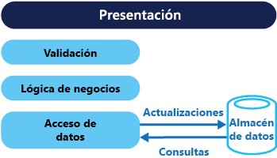

# <a name="command-and-query-responsibility-segregation-cqrs-pattern"></a>Patrón Command and Query Responsibility Segregation (CQRS).

[!INCLUDE [header](../_includes/header.md)]

Segrega las operaciones de lectura de datos de las de actualización de datos mediante interfaces independientes. Esto puede maximizar el rendimiento, la escalabilidad y la seguridad. Admite la evolución del sistema con el tiempo gracias a una mayor flexibilidad e impide que los comandos de actualización provoquen conflictos de combinación en el nivel de dominio.

## <a name="context-and-problem"></a>Contexto y problema

En los sistemas de administración de datos tradicionales, los comandos (actualizaciones de datos) y las consultas (solicitudes de datos) se ejecutan en el mismo conjunto de entidades en un único repositorio de datos. Estas entidades pueden ser un subconjunto de filas de una o varias tablas de una base de datos relacional como SQL Server.

Por lo general, en estos sistemas, todas las operaciones de creación, lectura, actualización y eliminación (CRUD) se aplican a la misma representación de la entidad. Por ejemplo, un objeto de transferencia de datos (DTO) que representa a un cliente se recupera del almacén de datos mediante el nivel de acceso a los datos (DAL) y se muestra en la pantalla. Un usuario actualiza algunos campos del DTO (quizás mediante enlace de datos) y, a continuación, el DTO se guarda en el almacén de datos mediante el DAL. El mismo DTO se utiliza para las operaciones de lectura y de escritura. La ilustración muestra una arquitectura CRUD tradicional.



Los diseños CRUD tradicionales funcionan bien si solo se aplica una lógica empresarial limitada a las operaciones de datos. Los mecanismos de scaffolding proporcionados por las herramientas de desarrollo pueden crear código de acceso a los datos de forma muy rápida y, posteriormente, este código se puede personalizar según sea necesario.

No obstante, el enfoque CRUD tradicional tiene algunas desventajas:

- A menudo, eso significa que hay una incoherencia entre las representaciones de lectura y escritura de los datos, como columnas o propiedades adicionales que se deben actualizar correctamente incluso aunque no sean necesarias como parte de una operación.

- Pone en riesgo la contención de datos cuando los registros están bloqueados en el almacén de datos de un dominio colaborativo, en los que varios actores trabajan en paralelo en el mismo conjunto de datos. O actualiza los conflictos causados por las actualizaciones simultáneas cuando se utiliza el bloqueo optimista. Estos riesgos aumentan a medida que crece la complejidad y el rendimiento del sistema. Además, el enfoque tradicional puede tener un impacto negativo en el rendimiento debido a la carga en el almacén de datos y al nivel de acceso a los datos, y la complejidad de las consultas necesarias para recuperar la información.

- Esto puede hacer que la administración de la seguridad y los permisos sea más compleja ya que cada entidad está sujeta a operaciones de lectura y de escritura, lo cual podría exponer los datos en el contexto equivocado.

## <a name="solution"></a>Solución

Command and Query Responsibility Segregation (CQRS) es un patrón que segrega las operaciones que leen datos (consultas) de las operaciones que actualizan los datos (comandos) mediante interfaces independientes. Esto significa que los modelos de datos utilizados para realizar las consultas y las actualizaciones son diferentes. Posteriormente, se pueden aislar los modelos, como se indica en la siguiente ilustración, aunque eso no es un requisito imprescindible.


En comparación con el modelo de datos único que se usa en los sistemas basados en CRUD, el uso de modelos de consulta y actualización independientes para los datos de los sistemas basados en CQRS simplifica el diseño y la implementación. Sin embargo, una desventaja es que, a diferencia de los diseños CRUD, el código CQRS no se genera automáticamente mediante los mecanismos de scaffolding.

El modelo de consulta para leer datos y el de actualización para escribirlos pueden acceder el mismo almacén físico, quizás mediante vistas SQL o mediante la generación de proyecciones sobre la marcha. Sin embargo, es habitual separar los datos en almacenes físicos diferentes para maximizar el rendimiento, la escalabilidad y la seguridad, tal como se muestra en la ilustración siguiente.


El almacén de lectura puede ser una réplica de solo lectura del almacén de escritura o los almacenes de lectura y escritura pueden tener una estructura diferente por completo. El uso de réplicas de solo lectura del almacén de lectura puede aumentar mucho el rendimiento de las consultas y la capacidad de respuesta de la interfaz de usuario de la aplicación, especialmente en escenarios distribuidos en los que las réplicas de solo lectura se sitúan cerca de las instancias de la aplicación. Algunos sistemas de bases de datos (SQL Server) proporcionan características adicionales como la conmutación por error de réplicas para maximizar la disponibilidad.

La separación de los almacenes de lectura y escritura permite también que cada uno de ellos pueda escalarse adecuadamente para adaptarse a la carga. Por ejemplo, los almacenes de lectura normalmente se encuentran con una carga mayor que los de escritura.

Cuando el modelo de la consulta/lectura contiene datos desnormalizados (consulte [Patrón Materialized View](materialized-view.md)), se maximiza el rendimiento al leer los datos para cada una de las vistas de una aplicación o cuando se consultan los datos en el sistema.

## <a name="issues-and-considerations"></a>Problemas y consideraciones

Tenga en cuenta los puntos siguientes al decidir cómo implementar este patrón:

- Si divide el almacén de datos en almacenes físicos independientes para las operaciones de lectura y escritura puede aumentar el rendimiento y seguridad de un sistema, pero también puede agregar complejidad en términos de resistencia y coherencia final. El almacén de modelos de lectura debe actualizarse para reflejar los cambios del almacén de modelos de escritura, y puede ser difícil detectar cuándo un usuario ha emitido una solicitud basada en datos de lectura obsoletos, lo que significa que no se puede completar la operación.

    > Para obtener una descripción de la coherencia final, consulte [Data Consistency Primer](https://msdn.microsoft.com/library/dn589800.aspx) (Manual básico de coherencia de datos).

- Considere la posibilidad de aplicar CQRS a secciones limitadas del sistema donde será más valioso.

- Un enfoque habitual para la implementación de consistencia final consiste en usar Event Sourcing en combinación con CQRS para que el modelo de escritura sea un flujo de solo anexión de eventos controlados por la ejecución de comandos. Estos eventos se usan para actualizar las vistas materializadas que actúan como modelo de lectura. Para más información, consulte [Event Sourcing y CQRS](/azure/architecture/patterns/cqrs#event-sourcing-and-cqrs).

## <a name="when-to-use-this-pattern"></a>Cuándo usar este patrón

Use este patrón en las situaciones siguientes:

- Dominios colaborativos en los que se realizan varias operaciones en paralelo en los mismos datos. CQRS le permite definir comandos con la suficiente granularidad para minimizar los conflictos de combinación en el nivel de dominio (cualquier conflicto que surja se podrá combinar mediante el comando), incluso cuando se actualiza lo que parece ser el mismo tipo de datos.

- Interfaces de usuario basadas en tareas en las que se guía al usuario a través de un complejo proceso como una serie de pasos o con modelos de dominio complejos. Esto también resulta útil para los equipos ya familiarizados con las técnicas de diseño controladas por dominios (DDD). El modelo de escritura tiene una pila de procesamiento de comandos completa con lógica de negocios, validación de entradas y validación empresarial para garantizar que todo es siempre coherente para cada uno de los agregados (cada clúster de objetos asociados que se trata como una unidad para los cambios de datos) del modelo de escritura. El modelo de lectura no tiene ninguna lógica de negocios ni pila de validación y solo devuelve un DTO para su uso en un modelo de vista. El modelo de lectura tiene coherencia final con el modelo de escritura.

- Los escenarios en los que el rendimiento de las lecturas de datos se debe ajustar de manera independiente a la del rendimiento de las escrituras de datos, especialmente cuando la relación de lectura/escritura es muy alta y se requiere un escalado horizontal. Por ejemplo, en muchos sistemas el número de operaciones de lectura es muchas veces mayor que el número de operaciones de escritura. Para dar cabida a esto, considere la posibilidad de escalar horizontalmente el modelo de lectura, pero ejecutando el modelo de escritura en solo una o algunas instancias. Un número reducido de instancias de modelo de escritura también ayuda a minimizar la aparición de conflictos de combinación.

- Escenarios en los que un equipo de desarrolladores pueda centrarse en el modelo de dominio complejo que forma parte del modelo de escritura, y otro equipo pueda centrarse en el modelo de lectura y en las interfaces de usuario.

- Escenarios en los que se espera que el sistema evolucione con el tiempo y que podrían contener varias versiones del modelo, o en los que las reglas de negocio cambian con regularidad.

- Integración con otros sistemas, especialmente en combinación con Event Sourcing, en los que el error temporal de un subsistema no debería afectar a la disponibilidad de los demás.

Este patrón no es recomendable en las situaciones siguientes:

- Allí donde el dominio o las reglas de negocio son simples.

- Allí donde una interfaz de usuario simple, de estilo CRUD, y las operaciones relacionadas de acceso a datos son suficientes.

- Para la implementación en todo el sistema. Hay componentes específicos de un escenario de administración de datos general donde CQRS puede ser útil, pero puede agregar una complejidad considerable e innecesaria sin ser necesario.

## <a name="event-sourcing-and-cqrs"></a>Event Sourcing y CQRS

El patrón CQRS se utiliza a menudo junto con el patrón Event Sourcing. Los sistemas basados en CQRS usan modelos de lectura y escritura de datos independientes, cada uno de ellos adaptado a las tareas correspondientes y, a menudo, ubicados en almacenes físicos independientes. Cuando se usa con el patrón [Event Sourcing](event-sourcing.md), el almacén de eventos es el modelo de escritura y es el origen oficial de información. El modelo de lectura de un sistema basado en CQRS proporciona vistas materializadas de los datos, normalmente como vistas altamente desnormalizadas. Estas vistas se adaptan a las interfaces y muestran los requisitos de la aplicación, lo cual ayuda a maximizar la apariencia y el rendimiento de las consultas.

Mediante el uso del flujo de eventos como almacén de escritura, en lugar de los datos reales en un momento dado, evita conflictos de actualización en un único agregado y maximiza el rendimiento y la escalabilidad. Los eventos se pueden utilizar para generar vistas materializadas de forma asincrónica de los datos que se usan para rellenar el almacén de lectura.

Dado que el almacén de eventos es el origen oficial de información, es posible eliminar las vistas materializadas y reproducir todos los eventos pasados para crear una nueva representación del estado actual cuando evolucione el sistema, o cuando deba cambiar el modelo de lectura. Las vistas materializadas constituyen, en efecto, una memoria caché duradera de solo lectura de los datos.

Cuando utilice CQRS en combinación con el patrón Event Sourcing, tenga en cuenta lo siguiente:

- Al igual que con cualquier sistema en el que los almacenes de escritura y lectura son independientes, los sistemas basados en este patrón solo tienen coherencia final. Habrá un cierto retraso entre la generación del evento y la actualización del almacén de datos.

- El patrón agrega complejidad porque se debe crear código para iniciar y controlar los eventos, y ensamblar o actualizar las vistas adecuadas o los objetos que necesitan las consultas o un modelo de lectura. La complejidad del patrón CQRS cuando se usa con el patrón Event Sourcing puede dificultar una implementación correcta y requiere un enfoque diferente para el diseño de sistemas. No obstante, Event Sourcing puede facilitar el modelado del dominio, y puede facilitar la recompilación de vistas o la creación de otras nuevas ya que se preserva la intención de los cambios de los datos.

- La generación de vistas materializadas para su uso en el modelo de lectura o las proyecciones de los datos mediante la reproducción y control de eventos para entidades específicas o colecciones de estas, puede conllevar un tiempo de procesamiento y un uso de los recursos significativo. Esto es especialmente cierto si requiere la suma o el análisis de los valores durante períodos largos, ya que puede que se tengan que examinar todos los eventos asociados. Puede resolver este problema mediante la implementación de instantáneas de los datos a intervalos programados, por ejemplo, un recuento total del número de veces que se ha producido una acción concreta o el estado actual de una entidad.

## <a name="example"></a>Ejemplo

El código siguiente muestra algunos extractos de un ejemplo de una implementación CQRS que usa definiciones diferentes para los modelos de lectura y de escritura. Las interfaces de los modelos no dictan ninguna característica de los almacenes de datos subyacentes, y pueden evolucionar y adaptarse de forma independiente ya que estas interfaces están separadas.

El código siguiente muestra la definición del modelo de lectura.

```csharp
// Query interface
namespace ReadModel
{
  public interface ProductsDao
  {
    ProductDisplay FindById(int productId);
    ICollection<ProductDisplay> FindByName(string name);
    ICollection<ProductInventory> FindOutOfStockProducts();
    ICollection<ProductDisplay> FindRelatedProducts(int productId);
  }

  public class ProductDisplay
  {
    public int Id { get; set; }
    public string Name { get; set; }
    public string Description { get; set; }
    public decimal UnitPrice { get; set; }
    public bool IsOutOfStock { get; set; }
    public double UserRating { get; set; }
  }

  public class ProductInventory
  {
    public int Id { get; set; }
    public string Name { get; set; }
    public int CurrentStock { get; set; }
  }
}
```

El sistema permite a los usuarios valorar los productos. El código de la aplicación hace esto mediante el comando `RateProduct` que aparece en el código siguiente.

```csharp
public interface ICommand
{
  Guid Id { get; }
}

public class RateProduct : ICommand
{
  public RateProduct()
  {
    this.Id = Guid.NewGuid();
  }
  public Guid Id { get; set; }
  public int ProductId { get; set; }
  public int Rating { get; set; }
  public int UserId {get; set; }
}
```

El sistema usa la clase `ProductsCommandHandler` para controlar los comandos enviados por la aplicación. Normalmente, los clientes envían comandos al dominio a través de un sistema de mensajería como, por ejemplo, una cola. El controlador de comandos acepta estos comandos e invoca los métodos de la interfaz de dominio. La granularidad de cada comando está diseñada para reducir la posibilidad de que haya solicitudes en conflicto. El código siguiente muestra un esquema de la clase `ProductsCommandHandler`.

```csharp
public class ProductsCommandHandler :
    ICommandHandler<AddNewProduct>,
    ICommandHandler<RateProduct>,
    ICommandHandler<AddToInventory>,
    ICommandHandler<ConfirmItemShipped>,
    ICommandHandler<UpdateStockFromInventoryRecount>
{
  private readonly IRepository<Product> repository;

  public ProductsCommandHandler (IRepository<Product> repository)
  {
    this.repository = repository;
  }

  void Handle (AddNewProduct command)
  {
    ...
  }

  void Handle (RateProduct command)
  {
    var product = repository.Find(command.ProductId);
    if (product != null)
    {
      product.RateProduct(command.UserId, command.Rating);
      repository.Save(product);
    }
  }

  void Handle (AddToInventory command)
  {
    ...
  }

  void Handle (ConfirmItemsShipped command)
  {
    ...
  }

  void Handle (UpdateStockFromInventoryRecount command)
  {
    ...
  }
}
```

El código siguiente muestra la interfaz `IProductsDomain` del modelo de escritura.

```csharp
public interface IProductsDomain
{
  void AddNewProduct(int id, string name, string description, decimal price);
  void RateProduct(int userId, int rating);
  void AddToInventory(int productId, int quantity);
  void ConfirmItemsShipped(int productId, int quantity);
  void UpdateStockFromInventoryRecount(int productId, int updatedQuantity);
}
```

Observe también cómo la interfaz `IProductsDomain` contiene métodos que tienen un significado en el dominio. Por lo general, en un entorno CRUD estos métodos tendrían nombres genéricos como `Save` o `Update`, y un DTO como único argumento. El enfoque CQRS se puede diseñar para satisfacer las necesidades de negocio y de sistemas de administración de inventario de esta organización.

## <a name="related-patterns-and-guidance"></a>Orientación y patrones relacionados

Los patrones y las directrices siguientes son útiles a la hora de implementar este patrón:

- Para obtener una comparación de CQRS con otros estilos de arquitectura, consulte [Estilos de arquitectura](/azure/architecture/guide/architecture-styles/) y [Estilo de arquitectura CQRS](/azure/architecture/guide/architecture-styles/cqrs).

- [Data Consistency Primer](https://msdn.microsoft.com/library/dn589800.aspx) (Manual básico de coherencia de datos). Explica los problemas que normalmente se producen debido a la coherencia final entre los almacenes de datos de lectura y de escritura cuando se usa el patrón CQRS y cómo se pueden resolver estos problemas.

- [Guía de creación de particiones de datos](https://msdn.microsoft.com/library/dn589795.aspx). Describe cómo se pueden dividir en particiones los almacenes de datos de lectura y escritura utilizados en el patrón CQRS, particiones que se pueden administrar y a las que se puede acceder por separado para mejorar la escalabilidad, reducir la contención y optimizar el rendimiento.

- [Patrón Event Sourcing](event-sourcing.md). Describe con más detalle como se puede usar Event Sourcing con el patrón CQRS para simplificar las tareas de dominios complejos al tiempo que se mejora el rendimiento, la escalabilidad y la capacidad de respuesta. También muestra cómo proporcionar coherencia a los datos transaccionales al tiempo que se mantienen registros de auditorías e historiales completos que pueden permitir acciones de compensación.

- [Patrón Materialized View](materialized-view.md). El modelo de lectura de una implementación de CQRS puede contener vistas materializadas de los datos del modelo de escritura o el modelo de lectura se puede utilizar para generar vistas materializadas.

- La guía de patrones y prácticas [CQRS Journey](https://aka.ms/cqrs) (Introducción a CQRS). En concreto, [Introducing the Command Query Responsibility Segregation Pattern](https://msdn.microsoft.com/library/jj591573.aspx) (Introducción al patrón de segregación de responsabilidades de la consulta de comandos) explora el patrón y cuándo es útil, y [Epilogue: Lessons Learned](https://msdn.microsoft.com/library/jj591568.aspx) (Epílogo: lecciones aprendidas) le ayudarán a conocer algunos de los problemas que surgen al utilizar este patrón.

- La entrada de blog sobre [CQRS de Martin Fowler](https://martinfowler.com/bliki/CQRS.html), que explica los aspectos básicos del patrón y contiene vínculos a otros recursos útiles.
