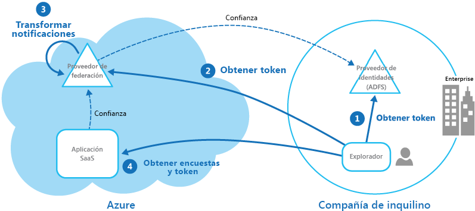

# Patrón Federated IdentityFederated Identity pattern

[!INCLUDE [header](../_includes/header.md)]

La autenticación se delega a un proveedor de identidad externo.Delegate authentication to an external identity provider. Esto puede simplificar el desarrollo, minimizar los requisitos de administración de usuarios y mejorar la experiencia del usuario de la aplicación.This can simplify development, minimize the requirement for user administration, and improve the user experience of the application.

## Contexto y problemaContext and problem

Normalmente, los usuarios deben trabajar con varias aplicaciones que proporcionan y hospedan diversas organizaciones con las que mantienen una relación de negocios.Users typically need to work with multiple applications provided and hosted by different organizations they have a business relationship with. A estos usuarios se les puede exigir que usen cada uno de ellos credenciales específicas (y diferentes).These users might be required to use specific (and different) credentials for each one. Esta situación puede dar lugar a:This can:

- **Una experiencia de usuario desestructurada**.**Cause a disjointed user experience**. Con frecuencia, los usuarios olvidan las credenciales de inicio de sesión cuando si tienen muchas diferentes.Users often forget sign-in credentials when they have many different ones.

- **Exposición de las vulnerabilidades de seguridad**.**Expose security vulnerabilities**. Cuando un usuario abandona la empresa, la cuenta se debe desaprovisionar inmediatamente.When a user leaves the company the account must immediately be deprovisioned. En organizaciones de gran tamaño, es fácil pasarlo por alto.It's easy to overlook this in large organizations.

- **Administración de usuarios complicada**.**Complicate user management**. Los administradores deben administrar las credenciales de todos los usuarios y realizar tareas adicionales, como proporcionar recordatorios de contraseña.Administrators must manage credentials for all of the users, and perform additional tasks such as providing password reminders.

Los usuarios prefieren normalmente usar las mismas credenciales en todas estas aplicaciones.Users typically prefer to use the same credentials for all these applications.

## SoluciónSolution

Implemente un mecanismo de autenticación que pueda usar la identidad federada.Implement an authentication mechanism that can use federated identity. Separe la autenticación de usuarios del código de aplicación, y delegue la autentificación a un proveedor de identidades de confianza.Separate user authentication from the application code, and delegate authentication to a trusted identity provider. Esto puede simplificar el desarrollo y permitir que los usuarios se autentiquen mediante una variedad más amplia de proveedores de identidades (IdP) al tiempo que se reduce la sobrecarga administrativa.This can simplify development and allow users to authenticate using a wider range of identity providers (IdP) while minimizing the administrative overhead. También permite separar claramente la autenticación de la autorización.It also allows you to clearly decouple authentication from authorization.

Entre los proveedores de identidades de confianza se incluyen directorios corporativos, servicios de federación locales, otros servicios de token de seguridad (STS) que proporcionan los asociados comerciales o proveedores de identidades sociales que pueden autenticar a los usuarios que tienen, por ejemplo, una cuenta de Microsoft, Google, Yahoo! o Facebook.The trusted identity providers include corporate directories, on-premises federation services, other security token services (STS) provided by business partners, or social identity providers that can authenticate users who have, for example, a Microsoft, Google, Yahoo!, or Facebook account.

En la siguiente figura se ilustra el patrón Federated Identity (Identidad federada) cuando una aplicación cliente necesita acceder a un servicio que requiere autentificación.The figure illustrates the Federated Identity pattern when a client application needs to access a service that requires authentication. La autenticación se realiza mediante un IdP que trabaja en combinación con un STS.The authentication is performed by an IdP that works in concert with an STS. El IdP emite tokens de seguridad que proporcionan información sobre el usuario autenticado.The IdP issues security tokens that provide information about the authenticated user. Esta información, conocida como notificaciones, incluye la identidad del usuario y podría incluir también otra información como la pertenencia a roles y derechos de acceso más específicos.This information, referred to as claims, includes the user’s identity, and might also include other information such as role membership and more granular access rights.

Este modelo se conoce a menudo como control de acceso basado en notificaciones.This model is often called claims-based access control. Las aplicaciones y los servicios autorizarán el acceso a las características y funcionalidades en función de las notificaciones contenidas en el token.Applications and services authorize access to features and functionality based on the claims contained in the token. El servicio que requiere autenticación debe confiar en el IdP.The service that requires authentication must trust the IdP. La aplicación cliente se pone en contacto el IdP que realiza la autenticación.The client application contacts the IdP that performs the authentication. Si la autenticación es correcta, el IdP devuelve un token que contiene las notificaciones que identifican al usuario en el STS (tenga en cuenta que el IdP y el STS pueden ser el mismo servicio).If the authentication is successful, the IdP returns a token containing the claims that identify the user to the STS (note that the IdP and STS can be the same service). El STS puede transformar y aumentar las notificaciones en el token según reglas predefinidas, antes de devolverlo al cliente.The STS can transform and augment the claims in the token based on predefined rules, before returning it to the client. La aplicación cliente puede luego pasar este token al servicio como prueba de su identidad.The client application can then pass this token to the service as proof of its identity.

> Podría haber STS adicionales en la cadena de confianza.There might be additional STSs in the chain of trust. Por ejemplo, en el escenario descrito más adelante, un STS local confía en otro STS que es responsable de acceder a un proveedor de identidades para autenticar al usuario.For example, in the scenario described later, an on-premises STS trusts another STS that is responsible for accessing an identity provider to authenticate the user. Este enfoque es común en escenarios empresariales donde hay un STS y un directorio locales.This approach is common in enterprise scenarios where there's an on-premises STS and directory.

La autenticación federada proporciona una solución basada en estándares al problema de confiar en identidades de dominios diferentes y puede admitir el inicio de sesión único.Federated authentication provides a standards-based solution to the issue of trusting identities across diverse domains, and can support single sign-on. Cada vez es más común en todos los tipos de aplicaciones, especialmente en las aplicaciones hospedadas en la nube, ya que admite el inicio de sesión único sin necesidad de una conexión de red directa a los proveedores de identidades.It's becoming more common across all types of applications, especially cloud-hosted applications, because it supports single sign-on without requiring a direct network connection to identity providers. El usuario no tiene que especificar credenciales en cada aplicación.The user doesn't have to enter credentials for every application. La seguridad aumenta porque impide la creación de las credenciales necesarias para acceder a muchas aplicaciones diferentes, y también oculta las credenciales del usuario de todos excepto del proveedor de identidades original.This increases security because it prevents the creation of credentials required to access many different applications, and it also hides the user’s credentials from all but the original identity provider. Las aplicaciones ven solo la información de la identidad autenticada contenida en el token.Applications see just the authenticated identity information contained within the token.

La identidad federada tiene la ventaja principal de que la administración de identidades y credenciales es responsabilidad del proveedor de identidades.Federated identity also has the major advantage that management of the identity and credentials is the responsibility of the identity provider. La aplicación o el servicio no necesitan proporcionar características de administración de identidades.The application or service doesn't need to provide identity management features. Además, en escenarios corporativos, el directorio corporativo no necesita saber nada del usuario si confía en el proveedor de identidades.In addition, in corporate scenarios, the corporate directory doesn't need to know about the user if it trusts the identity provider. Como consecuencia, se elimina la sobrecarga administrativa de la administración de la identidad del usuario dentro del directorio.This removes all the administrative overhead of managing the user identity within the directory.

## Problemas y consideracionesIssues and considerations

Al diseñar aplicaciones que implementan la autenticación federada, considere los siguientes puntos:Consider the following when designing applications that implement federated authentication:

- La autenticación puede ser un único punto de error.Authentication can be a single point of failure. Si implementa la aplicación en varios centros de datos, considere la posibilidad de implementar el mecanismo de administración de identidades en los mismos centros de datos para mantener la disponibilidad y confiabilidad de la aplicación.If you deploy your application to multiple datacenters, consider deploying your identity management mechanism to the same datacenters to maintain application reliability and availability.

- Las herramientas de autenticación le permite configurar el control de acceso en función de las notificaciones de rol contenidas en el token de autenticación.Authentication tools make it possible to configure access control based on role claims contained in the authentication token. Con frecuencia a esto se le conoce como control de acceso basado en roles (RBAC) y puede permitir un nivel de control más específico sobre el acceso a las características y recursos.This is often referred to as role-based access control (RBAC), and it can allow a more granular level of control over access to features and resources.

- A diferencia de los directorios corporativos, autenticación basada en notificaciones mediante proveedores de identidades sociales normalmente no proporciona información sobre el usuario autenticado, a excepción de una dirección de correo electrónico y quizás un nombre.Unlike a corporate directory, claims-based authentication using social identity providers doesn't usually provide information about the authenticated user other than an email address, and perhaps a name. Algunos proveedores de identidades sociales, como una cuenta de Microsoft, proporcionan solo un identificador único.Some social identity providers, such as a Microsoft account, provide only a unique identifier. Normalmente, la aplicación debe mantener cierta información de los usuarios registrados y poder relacionar esta información con el identificador contenido en las notificaciones del token.The application usually needs to maintain some information on registered users, and be able to match this information to the identifier contained in the claims in the token. Por lo general, esto se consigue mediante el registro cuando el usuario accede a la aplicación por primera vez, y la información se introduce en el token como notificaciones adicionales después de cada autenticación.Typically this is done through registration when the user first accesses the application, and information is then injected into the token as additional claims after each authentication.

- Si hay más de un proveedor de identidades configurado para el STS, este debe detectar el proveedor de identidades al que se debe redirigir al usuario para la autenticación.If there's more than one identity provider configured for the STS, it must detect which identity provider the user should be redirected to for authentication. Este proceso se denomina detección de dominios de inicio.This process is called home realm discovery. El STS podría realizar este proceso automáticamente en función de una dirección de correo electrónico o un nombre de usuario que proporcione el usuario, un subdominio de la aplicación a la que accede el usuario, el ámbito de la dirección IP del usuario o el contenido de una cookie almacenada en el explorador del usuario.The STS might be able to do this automatically based on an email address or user name that the user provides, a subdomain of the application that the user is accessing, the user’s IP address scope, or on the contents of a cookie stored in the user’s browser. Por ejemplo, si el usuario escribió una dirección de correo electrónico en el dominio de Microsoft, como user@live.com, el STS redirigirá al usuario a la página de inicio de sesión de cuenta de Microsoft.For example, if the user entered an email address in the Microsoft domain, such as user@live.com, the STS will redirect the user to the Microsoft account sign-in page. En visitas posteriores, el STS podría usar una cookie para indicar que el último inicio de sesión fue con una cuenta de Microsoft.On later visits, the STS could use a cookie to indicate that the last sign in was with a Microsoft account. Si la detección automática no puede determinar el dominio de inicio, el STS mostrará una página de detección de dominios de inicio con los proveedores de identidades de confianza, entre los cuales el usuario debe seleccionar el que quiera usar.If automatic discovery can't determine the home realm, the STS will display a home realm discovery page that lists the trusted identity providers, and the user must select the one they want to use.

## Cuándo usar este patrónWhen to use this pattern

Este patrón es útil en escenarios como:This pattern is useful for scenarios such as:

- **Inicio de sesión único en la empresa**.**Single sign-on in the enterprise**. En este escenario debe autenticar a los empleados en las aplicaciones corporativas que se hospedan en la nube fuera del límite de seguridad corporativo, sin exigirles que inicien sesión cada vez que visitan una aplicación.In this scenario you need to authenticate employees for corporate applications that are hosted in the cloud outside the corporate security boundary, without requiring them to sign in every time they visit an application. La experiencia de los usuarios es la misma que cuando usan aplicaciones locales donde se autentican al iniciar sesión en una red corporativa y desde ese momento tienen acceso a todas las aplicaciones pertinentes sin necesidad de iniciar de nuevo la sesión.The user experience is the same as when using on-premises applications where they're authenticated when signing in to a corporate network, and from then on have access to all relevant applications without needing to sign in again.

- **Identidad federada con varios asociados**.**Federated identity with multiple partners**. En este escenario, debe autenticar a los usuarios corporativos y a los asociados comerciales que no tienen cuentas en el directorio corporativo.In this scenario you need to authenticate both corporate employees and business partners who don't have accounts in the corporate directory. Esta situación es común en aplicaciones de negocio a negocio, aplicaciones que se integran con servicios de terceros y en aquellos casos en que las empresas con diferentes sistemas de TI han combinado o compartido los recursos.This is common in business-to-business applications, applications that integrate with third-party services, and where companies with different IT systems have merged or shared resources.

- **Identidad federada en aplicaciones SaaS**.**Federated identity in SaaS applications**. En este escenario, fabricantes independientes de software proporcionan un servicio listo para usar para varios clientes o inquilinos.In this scenario independent software vendors provide a ready-to-use service for multiple clients or tenants. Cada inquilino se autentica mediante un proveedor de identidades adecuado.Each tenant authenticates using a suitable identity provider. Por ejemplo, los usuarios empresariales usarán sus credenciales corporativas, mientras que los consumidores y clientes del inquilino utilizarán sus credenciales de identidades sociales.For example, business users will use their corporate credentials, while consumers and clients of the tenant will use their social identity credentials.

Este patrón podría no ser útil en las siguientes situaciones:This pattern might not be useful in the following situations:

- Todos los usuarios de la aplicación se pueden autenticar mediante un proveedor de identidades, y no hay ningún requisito para autenticarlos con cualquier otro proveedor de identidades.All users of the application can be authenticated by one identity provider, and there's no requirement to authenticate using any other identity provider. Esto es habitual en aplicaciones empresariales que utilizan un directorio corporativo (accesible dentro de la aplicación) para la autenticación, mediante una VPN o (en un escenario hospedado en la nube) a través de una conexión de red virtual entre el directorio local y la aplicación.This is typical in business applications that use a corporate directory (accessible within the application) for authentication, by using a VPN, or (in a cloud-hosted scenario) through a virtual network connection between the on-premises directory and the application.

- La aplicación se creó originalmente mediante un mecanismo de autenticación diferente, quizás con almacenes de usuario personalizados, o no tiene la funcionalidad para gestionar los estándares de negociación utilizados por tecnologías basadas en notificaciones.The application was originally built using a different authentication mechanism, perhaps with custom user stores, or doesn't have the capability to handle the negotiation standards used by claims-based technologies. Retroadaptar la autenticación basada en notificaciones y el control de acceso en las aplicaciones existentes puede ser complejo y, probablemente, poco rentable.Retrofitting claims-based authentication and access control into existing applications can be complex, and probably not cost effective.

## EjemploExample

Una organización hospeda una aplicación de software como servicio (SaaS) multiinquilinos en Microsoft Azure.An organization hosts a multi-tenant software as a service (SaaS) application in Microsoft Azure. La aplicación incluye un sitio web que los inquilinos pueden usar para administrar la aplicación para sus propios usuarios.The application includes a website that tenants can use to manage the application for their own users. La aplicación permite a los inquilinos acceder al sitio web mediante una identidad federada que genera Active Directory Federation Services (ADFS) cuando un usuario se autentica con la instancia de Active Directory propiedad de esa organización.The application allows tenants to access the website by using a federated identity that is generated by Active Directory Federation Services (ADFS) when a user is authenticated by that organization’s own Active Directory.

En la ilustración se muestra cómo los inquilinos se autentican con su propio proveedor de identidades (paso 1), en este caso ADFS.The figure shows how tenants authenticate with their own identity provider (step 1), in this case ADFS. Después de autenticar correctamente un inquilino, ADFS emite un token.After successfully authenticating a tenant, ADFS issues a token. El explorador cliente reenvía este token al proveedor de federación de la aplicación de SaaS, que confía en los tokens emitidos por el ADFS del inquilino, con el fin de devolver un token que sea válido para el proveedor de federación de SaaS (paso 2).The client browser forwards this token to the SaaS application’s federation provider, which trusts tokens issued by the tenant’s ADFS, in order to get back a token that is valid for the SaaS federation provider (step 2). Si es necesario, el proveedor de federación de SaaS realiza una transformación de las notificaciones del token en notificaciones que la aplicación reconoce (paso 3) antes de devolver el nuevo token al explorador cliente.If necessary, the SaaS federation provider performs a transformation on the claims in the token into claims that the application recognizes (step 3) before returning the new token to the client browser. La aplicación confía en los tokens emitidos por el proveedor de federación de SaaS y usa las notificaciones del token para aplicar las reglas de autorización (paso 4).The application trusts tokens issued by the SaaS federation provider and uses the claims in the token to apply authorization rules (step 4).

Los inquilinos no tienen que recordar distintas credenciales para acceder a la aplicación, y un administrador de la empresa del inquilino puede configurar en su propio ADFS la lista de usuarios que pueden acceder a la aplicación.Tenants won't need to remember separate credentials to access the application, and an administrator at the tenant’s company can configure in its own ADFS the list of users that can access the application.

## Instrucciones relacionadasRelated guidance

- [Microsoft Azure Active DirectoryMicrosoft Azure Active Directory](https://azure.microsoft.com/services/active-directory/)
- [Active Directory Domain ServicesActive Directory Domain Services](https://msdn.microsoft.com/library/bb897402.aspx)
- [Servicios de federación de Active DirectoryActive Directory Federation Services](https://msdn.microsoft.com/library/bb897402.aspx)
- [Administración de identidades para aplicaciones multiinquilino en Microsoft AzureIdentity management for multitenant applications in Microsoft Azure](https://azure.microsoft.com/documentation/articles/guidance-multitenant-identity/)
- [Aplicaciones multiempresa en AzureMultitenant Applications in Azure](https://azure.microsoft.com/documentation/articles/dotnet-develop-multitenant-applications/)
