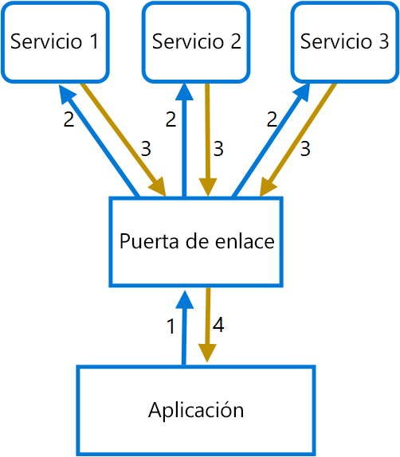

# <a name="gateway-aggregation-pattern"></a><span data-ttu-id="27187-103">Patrón Gateway Aggregation</span><span class="sxs-lookup"><span data-stu-id="27187-103">Gateway Aggregation pattern</span></span>

<span data-ttu-id="27187-104">Usa una puerta de enlace para agregar varias solicitudes individuales en una sola solicitud.</span><span class="sxs-lookup"><span data-stu-id="27187-104">Use a gateway to aggregate multiple individual requests into a single request.</span></span> <span data-ttu-id="27187-105">Este patrón es útil cuando un cliente debe hacer múltiples llamadas a diferentes sistemas back-end para realizar una operación.</span><span class="sxs-lookup"><span data-stu-id="27187-105">This pattern is useful when a client must make multiple calls to different backend systems to perform an operation.</span></span>

## <a name="context-and-problem"></a><span data-ttu-id="27187-106">Contexto y problema</span><span class="sxs-lookup"><span data-stu-id="27187-106">Context and problem</span></span>

<span data-ttu-id="27187-107">Para llevar a cabo una sola tarea, el cliente puede tener que realizar varias llamadas a diversos servicios back-end.</span><span class="sxs-lookup"><span data-stu-id="27187-107">To perform a single task, a client may have to make multiple calls to various backend services.</span></span> <span data-ttu-id="27187-108">Una aplicación que depende de muchos servicios para realizar una tarea debe gastar recursos en cada solicitud.</span><span class="sxs-lookup"><span data-stu-id="27187-108">An application that relies on many services to perform a task must expend resources on each request.</span></span> <span data-ttu-id="27187-109">Cuando se agrega cualquier característica o servicio nuevo a la aplicación, se necesitan solicitudes adicionales, lo que aumenta aún más los requisitos de recursos y las llamadas de red.</span><span class="sxs-lookup"><span data-stu-id="27187-109">When any new feature or service is added to the application, additional requests are needed, further increasing resource requirements and network calls.</span></span> <span data-ttu-id="27187-110">Este intercambio de mensajes entre un cliente y un back-end puede afectar negativamente al rendimiento y la escalabilidad de la aplicación.</span><span class="sxs-lookup"><span data-stu-id="27187-110">This chattiness between a client and a backend can adversely impact the performance and scale of the application.</span></span>  <span data-ttu-id="27187-111">Las arquitecturas de microservicios han hecho que este problema sea más común, ya que las aplicaciones creadas en torno a muchos servicios más pequeños tienen naturalmente una mayor cantidad de llamadas de servicios cruzados.</span><span class="sxs-lookup"><span data-stu-id="27187-111">Microservice architectures have made this problem more common, as applications built around many smaller services naturally have a higher amount of cross-service calls.</span></span> 

<span data-ttu-id="27187-112">En el siguiente diagrama, el cliente envía solicitudes a cada servicio (1,2,3).</span><span class="sxs-lookup"><span data-stu-id="27187-112">In the following diagram, the client sends requests to each service (1,2,3).</span></span> <span data-ttu-id="27187-113">Cada servicio procesa la solicitud y envía una respuesta de nuevo a la aplicación (4,5,6).</span><span class="sxs-lookup"><span data-stu-id="27187-113">Each service processes the request and sends the response back to the application (4,5,6).</span></span> <span data-ttu-id="27187-114">A través de una red móvil con una latencia típicamente elevada, el uso de solicitudes individuales de esta manera es ineficiente y podría resultar en una conectividad rota o en solicitudes incompletas.</span><span class="sxs-lookup"><span data-stu-id="27187-114">Over a cellular network with typically high latency, using individual requests in this manner is inefficient and could result in broken connectivity or incomplete requests.</span></span> <span data-ttu-id="27187-115">Si bien cada solicitud puede realizarse en paralelo, la aplicación debe enviar, esperar y procesar los datos de cada solicitud, todo ello en conexiones independientes, lo que aumenta las posibilidades de error.</span><span class="sxs-lookup"><span data-stu-id="27187-115">While each request may be done in parallel, the application must send, wait, and process data for each request, all on separate connections, increasing the chance of failure.</span></span>

 

## <a name="solution"></a><span data-ttu-id="27187-116">Solución</span><span class="sxs-lookup"><span data-stu-id="27187-116">Solution</span></span>

<span data-ttu-id="27187-117">Utilice una puerta de enlace para reducir el intercambio de mensajes entre el cliente y los servicios.</span><span class="sxs-lookup"><span data-stu-id="27187-117">Use a gateway to reduce chattiness between the client and the services.</span></span> <span data-ttu-id="27187-118">La puerta de enlace recibe las solicitudes de los clientes, envía estas solicitudes a los distintos sistemas back-end y, después, agrega los resultados y los devuelve al cliente solicitante.</span><span class="sxs-lookup"><span data-stu-id="27187-118">The gateway receives client requests, dispatches requests to the various backend systems, and then aggregates the results and sends them back to the requesting client.</span></span>

<span data-ttu-id="27187-119">Este patrón puede reducir el número de solicitudes que la aplicación realiza a los servicios back-end y mejorar el rendimiento de la aplicación en redes de alta latencia.</span><span class="sxs-lookup"><span data-stu-id="27187-119">This pattern can reduce the number of requests that the application makes to backend services, and improve application performance over high-latency networks.</span></span>

<span data-ttu-id="27187-120">En el diagrama siguiente, la aplicación envía una solicitud a la puerta de enlace (1).</span><span class="sxs-lookup"><span data-stu-id="27187-120">In the following diagram, the application sends a request to the gateway (1).</span></span> <span data-ttu-id="27187-121">La solicitud contiene un paquete de solicitudes adicionales.</span><span class="sxs-lookup"><span data-stu-id="27187-121">The request contains a package of additional requests.</span></span> <span data-ttu-id="27187-122">La puerta de enlace descompone y procesa cada solicitud al enviarla al servicio correspondiente (2).</span><span class="sxs-lookup"><span data-stu-id="27187-122">The gateway decomposes these and processes each request by sending it to the relevant service (2).</span></span> <span data-ttu-id="27187-123">Cada servicio devuelve una respuesta a la puerta de enlace (3).</span><span class="sxs-lookup"><span data-stu-id="27187-123">Each service returns a response to the gateway (3).</span></span> <span data-ttu-id="27187-124">La puerta de enlace combina las respuestas de cada servicio y envía la respuesta a la aplicación (4).</span><span class="sxs-lookup"><span data-stu-id="27187-124">The gateway combines the responses from each service and sends the response to the application (4).</span></span> <span data-ttu-id="27187-125">La aplicación realiza una única solicitud y recibe una sola respuesta de la puerta de enlace.</span><span class="sxs-lookup"><span data-stu-id="27187-125">The application makes a single request and receives only a single response from the gateway.</span></span>



## <a name="issues-and-considerations"></a><span data-ttu-id="27187-126">Problemas y consideraciones</span><span class="sxs-lookup"><span data-stu-id="27187-126">Issues and considerations</span></span>

- <span data-ttu-id="27187-127">La puerta de enlace no debe introducir el acoplamiento de servicio a través de los servicios back-end.</span><span class="sxs-lookup"><span data-stu-id="27187-127">The gateway should not introduce service coupling across the backend services.</span></span>
- <span data-ttu-id="27187-128">La puerta de enlace debe estar cerca de los servicios back-end para reducir la latencia lo más posible.</span><span class="sxs-lookup"><span data-stu-id="27187-128">The gateway should be located near the backend services to reduce latency as much as possible.</span></span>
- <span data-ttu-id="27187-129">El servicio de puerta de enlace puede introducir un único punto de error.</span><span class="sxs-lookup"><span data-stu-id="27187-129">The gateway service may introduce a single point of failure.</span></span> <span data-ttu-id="27187-130">Asegúrese de que la puerta de enlace está diseñada correctamente para satisfacer los requisitos de disponibilidad de la aplicación.</span><span class="sxs-lookup"><span data-stu-id="27187-130">Ensure the gateway is properly designed to meet your application's availability requirements.</span></span>
- <span data-ttu-id="27187-131">La puerta de enlace puede introducir un cuello de botella.</span><span class="sxs-lookup"><span data-stu-id="27187-131">The gateway may introduce a bottleneck.</span></span> <span data-ttu-id="27187-132">Asegúrese de la puerta de enlace tiene un rendimiento adecuado para manejar la carga y de que se puede escalar para cumplir con su crecimiento previsto.</span><span class="sxs-lookup"><span data-stu-id="27187-132">Ensure the gateway has adequate performance to handle load and can be scaled to meet your anticipated growth.</span></span>
- <span data-ttu-id="27187-133">Realice pruebas de carga en la puerta de enlace para asegurarse de que no introduce errores en cascada en los servicios.</span><span class="sxs-lookup"><span data-stu-id="27187-133">Perform load testing against the gateway to ensure you don't introduce cascading failures for services.</span></span>
- <span data-ttu-id="27187-134">Implemente un diseño resistente, mediante técnicas como los patrones [Bulkhead][bulkhead], [Circuit breaking][circuit-breaker], [Retry][retry] y tiempos de espera.</span><span class="sxs-lookup"><span data-stu-id="27187-134">Implement a resilient design, using techniques such as [bulkheads][bulkhead], [circuit breaking][circuit-breaker], [retry][retry], and timeouts.</span></span>
- <span data-ttu-id="27187-135">Si una o más llamadas de servicio tardan demasiado, puede ser aceptable agotar el tiempo de espera y devolver un conjunto parcial de datos.</span><span class="sxs-lookup"><span data-stu-id="27187-135">If one or more service calls takes too long, it may be acceptable to timeout and return a partial set of data.</span></span> <span data-ttu-id="27187-136">Considere cómo la aplicación va a manejar este escenario.</span><span class="sxs-lookup"><span data-stu-id="27187-136">Consider how your application will handle this scenario.</span></span>
- <span data-ttu-id="27187-137">Use la entrada/salida asincrónica para asegurarse de que un retraso en el back-end no causa problemas de rendimiento en la aplicación.</span><span class="sxs-lookup"><span data-stu-id="27187-137">Use asynchronous I/O to ensure that a delay at the backend doesn't cause performance issues in the application.</span></span>
- <span data-ttu-id="27187-138">Implemente el seguimiento distribuido mediante los identificadores de correlación para realizar el seguimiento de cada llamada individual.</span><span class="sxs-lookup"><span data-stu-id="27187-138">Implement distributed tracing using correlation IDs to track each individual call.</span></span>
- <span data-ttu-id="27187-139">Supervise las métricas de solicitud y los tamaños de respuesta.</span><span class="sxs-lookup"><span data-stu-id="27187-139">Monitor request metrics and response sizes.</span></span>
- <span data-ttu-id="27187-140">Considere la posibilidad de devolver los datos almacenados en caché como una estrategia de conmutación por error para tratar los errores.</span><span class="sxs-lookup"><span data-stu-id="27187-140">Consider returning cached data as a failover strategy to handle failures.</span></span>
- <span data-ttu-id="27187-141">En lugar de generar agregación en la puerta de enlace, considere colocar un servicio de agregación detrás de la puerta de enlace.</span><span class="sxs-lookup"><span data-stu-id="27187-141">Instead of building aggregation into the gateway, consider placing an aggregation service behind the gateway.</span></span> <span data-ttu-id="27187-142">Es probable que la agregación de solicitudes tenga necesidades de recursos diferentes a las de otros servicios en la puerta de enlace y puede afectar a la funcionalidad de enrutamiento y a la descarga de la puerta de enlace.</span><span class="sxs-lookup"><span data-stu-id="27187-142">Request aggregation will likely have different resource requirements than other services in the gateway and may impact the gateway's routing and offloading functionality.</span></span>

## <a name="when-to-use-this-pattern"></a><span data-ttu-id="27187-143">Cuándo usar este patrón</span><span class="sxs-lookup"><span data-stu-id="27187-143">When to use this pattern</span></span>

<span data-ttu-id="27187-144">Use este patrón cuando:</span><span class="sxs-lookup"><span data-stu-id="27187-144">Use this pattern when:</span></span>

- <span data-ttu-id="27187-145">Un cliente necesite comunicarse con varios servicios de back-end para realizar una operación.</span><span class="sxs-lookup"><span data-stu-id="27187-145">A client needs to communicate with multiple backend services to perform an operation.</span></span>
- <span data-ttu-id="27187-146">El cliente puede usar redes con latencia elevada, por ejemplo, redes móviles.</span><span class="sxs-lookup"><span data-stu-id="27187-146">The client may use networks with significant latency, such as cellular networks.</span></span>

<span data-ttu-id="27187-147">Este patrón puede no ser adecuado cuando:</span><span class="sxs-lookup"><span data-stu-id="27187-147">This pattern may not be suitable when:</span></span>

- <span data-ttu-id="27187-148">Desea reducir el número de llamadas entre un cliente y un único servicio en varias operaciones.</span><span class="sxs-lookup"><span data-stu-id="27187-148">You want to reduce the number of calls between a client and a single service across multiple operations.</span></span> <span data-ttu-id="27187-149">En ese caso, puede que sea mejor agregar una operación por lotes al servicio.</span><span class="sxs-lookup"><span data-stu-id="27187-149">In that scenario, it may be better to add a batch operation to the service.</span></span>
- <span data-ttu-id="27187-150">El cliente o aplicación se encuentra cerca de los servicios back-end y la latencia no es un factor importante.</span><span class="sxs-lookup"><span data-stu-id="27187-150">The client or application is located near the backend services and latency is not a significant factor.</span></span>

## <a name="example"></a><span data-ttu-id="27187-151">Ejemplo</span><span class="sxs-lookup"><span data-stu-id="27187-151">Example</span></span>

<span data-ttu-id="27187-152">En el ejemplo siguiente se muestra cómo crear un simple servicio NGINX de agregación de puerta de enlace mediante el uso de Lua.</span><span class="sxs-lookup"><span data-stu-id="27187-152">The following example illustrates how to create a simple a gateway aggregation NGINX service using Lua.</span></span>

```lua
worker_processes  4;

events {
  worker_connections 1024;
}

http {
  server {
    listen 80;

    location = /batch {
      content_by_lua '
        ngx.req.read_body()

        -- read json body content
        local cjson = require "cjson"
        local batch = cjson.decode(ngx.req.get_body_data())["batch"]

        -- create capture_multi table
        local requests = {}
        for i, item in ipairs(batch) do
          table.insert(requests, {item.relative_url, { method = ngx.HTTP_GET}})
        end

        -- execute batch requests in parallel
        local results = {}
        local resps = { ngx.location.capture_multi(requests) }
        for i, res in ipairs(resps) do
          table.insert(results, {status = res.status, body = cjson.decode(res.body), header = res.header})
        end

        ngx.say(cjson.encode({results = results}))
      ';
    }

    location = /service1 {
      default_type application/json;
      echo '{"attr1":"val1"}';
    }

    location = /service2 {
      default_type application/json;
      echo '{"attr2":"val2"}';
    }
  }
}
```

## <a name="related-guidance"></a><span data-ttu-id="27187-153">Instrucciones relacionadas</span><span class="sxs-lookup"><span data-stu-id="27187-153">Related guidance</span></span>

- [<span data-ttu-id="27187-154">Patrón Backends for Frontends</span><span class="sxs-lookup"><span data-stu-id="27187-154">Backends for Frontends pattern</span></span>](./backends-for-frontends.md)
- [<span data-ttu-id="27187-155">Patrón Gateway Offloading</span><span class="sxs-lookup"><span data-stu-id="27187-155">Gateway Offloading pattern</span></span>](./gateway-offloading.md)
- [<span data-ttu-id="27187-156">Patrón Gateway Routing</span><span class="sxs-lookup"><span data-stu-id="27187-156">Gateway Routing pattern</span></span>](./gateway-routing.md)

[bulkhead]: ./bulkhead.md
[circuit-breaker]: ./circuit-breaker.md
[retry]: ./retry.md