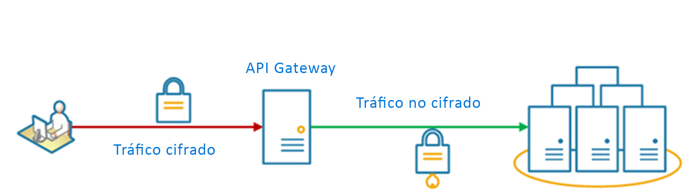

# <a name="gateway-offloading-pattern"></a><span data-ttu-id="cf7bb-103">Patrón Gateway Offloading</span><span class="sxs-lookup"><span data-stu-id="cf7bb-103">Gateway Offloading pattern</span></span>

<span data-ttu-id="cf7bb-104">Descarga una funcionalidad de servicio compartida o especializada en un proxy de puerta de enlace.</span><span class="sxs-lookup"><span data-stu-id="cf7bb-104">Offload shared or specialized service functionality to a gateway proxy.</span></span> <span data-ttu-id="cf7bb-105">Este patrón puede simplificar la implementación de la aplicación al mover la funcionalidad del servicio compartido, como el uso de certificados SSL, de otras partes de la aplicación a la puerta de enlace.</span><span class="sxs-lookup"><span data-stu-id="cf7bb-105">This pattern can simplify application development by moving shared service functionality, such as the use of SSL certificates, from other parts of the application into the gateway.</span></span>

## <a name="context-and-problem"></a><span data-ttu-id="cf7bb-106">Contexto y problema</span><span class="sxs-lookup"><span data-stu-id="cf7bb-106">Context and problem</span></span>

<span data-ttu-id="cf7bb-107">Algunas de las características que se usan habitualmente en varios servicios requieren configuración, administración y mantenimiento.</span><span class="sxs-lookup"><span data-stu-id="cf7bb-107">Some features are commonly used across multiple services, and these features require configuration, management, and maintenance.</span></span> <span data-ttu-id="cf7bb-108">Un servicio compartido o especializado que se distribuye con cada implementación de aplicación aumenta la sobrecarga administrativa y la probabilidad de errores de implementación.</span><span class="sxs-lookup"><span data-stu-id="cf7bb-108">A shared or specialized service that is distributed with every application deployment increases the administrative overhead and increases the likelihood of deployment error.</span></span> <span data-ttu-id="cf7bb-109">Las actualizaciones de las características compartidas deben implementarse en todos los servicios que la comparten.</span><span class="sxs-lookup"><span data-stu-id="cf7bb-109">Any updates to a shared feature must be deployed across all services that share that feature.</span></span>

<span data-ttu-id="cf7bb-110">La correcta administración de los problemas de seguridad (validación de tokens, cifrado, administración de certificados SSL) y otras tareas complejas puede requerir conocimientos muy especializados de los miembros del equipo.</span><span class="sxs-lookup"><span data-stu-id="cf7bb-110">Properly handling security issues (token validation, encryption, SSL certificate management) and other complex tasks can require team members to have highly specialized skills.</span></span> <span data-ttu-id="cf7bb-111">Por ejemplo, un certificado que una aplicación necesita debe configurarse e implementarse en todas las instancias de la aplicación.</span><span class="sxs-lookup"><span data-stu-id="cf7bb-111">For example, a certificate needed by an application must be configured and deployed on all application instances.</span></span> <span data-ttu-id="cf7bb-112">Con cada nueva implementación, el certificado debe administrarse para garantizar que no va a expirar.</span><span class="sxs-lookup"><span data-stu-id="cf7bb-112">With each new deployment, the certificate must be managed to ensure that it does not expire.</span></span> <span data-ttu-id="cf7bb-113">Cualquier certificado común a punto de caducar debe actualizarse, probarse y comprobarse en cada implementación de la aplicación.</span><span class="sxs-lookup"><span data-stu-id="cf7bb-113">Any common certificate that is due to expire must be updated, tested, and verified on every application deployment.</span></span>

<span data-ttu-id="cf7bb-114">Otros servicios comunes, como la autenticación, la autorización, el registro, la supervisión, o l [limitación](./throttling.md) pueden resultar difíciles de implementar y administrar en un gran número de implementaciones.</span><span class="sxs-lookup"><span data-stu-id="cf7bb-114">Other common services such as authentication, authorization, logging, monitoring, or [throttling](./throttling.md) can be difficult to implement and manage across a large number of deployments.</span></span> <span data-ttu-id="cf7bb-115">Es posible que convenga combinar este tipo de funcionalidad con el fin de reducir la sobrecarga y la posibilidad de errores.</span><span class="sxs-lookup"><span data-stu-id="cf7bb-115">It may be better to consolidate this type of functionality, in order to reduce overhead and the chance of errors.</span></span>

## <a name="solution"></a><span data-ttu-id="cf7bb-116">Solución</span><span class="sxs-lookup"><span data-stu-id="cf7bb-116">Solution</span></span>

<span data-ttu-id="cf7bb-117">Descargue algunas características en una puerta de enlace de API, especialmente cuestiones transversales, como la administración de certificados, la autenticación, la terminación SSL, la supervisión, la traducción de protocolos o la limitación.</span><span class="sxs-lookup"><span data-stu-id="cf7bb-117">Offload some features into an API gateway, particularly cross-cutting concerns such as certificate management, authentication, SSL termination, monitoring, protocol translation, or throttling.</span></span> 

<span data-ttu-id="cf7bb-118">En el siguiente diagrama se muestra una puerta de enlace de API que termina las conexiones entrantes de SSL.</span><span class="sxs-lookup"><span data-stu-id="cf7bb-118">The following diagram shows an API gateway that terminates inbound SSL connections.</span></span> <span data-ttu-id="cf7bb-119">Solicita datos en nombre del solicitante original desde cualquier servidor HTTP en dirección ascendente de la puerta de enlace de API.</span><span class="sxs-lookup"><span data-stu-id="cf7bb-119">It requests data on behalf of the original requestor from any HTTP server upstream of the API gateway.</span></span>

 
 
<span data-ttu-id="cf7bb-120">Estos son algunos ejemplos de las ventajas de este patrón:</span><span class="sxs-lookup"><span data-stu-id="cf7bb-120">Benefits of this pattern include:</span></span>

- <span data-ttu-id="cf7bb-121">Simplifica el desarrollo de servicios mediante la eliminación de la necesidad de distribuir y mantener los recursos de compatibilidad, como los certificados de servidor web y la configuración de sitios web seguros.</span><span class="sxs-lookup"><span data-stu-id="cf7bb-121">Simplify the development of services by removing the need to distribute and maintain supporting resources, such as web server certificates and configuration for secure websites.</span></span> <span data-ttu-id="cf7bb-122">Una configuración más simple facilita la administración y la escalabilidad, y simplifica las actualizaciones del servicio.</span><span class="sxs-lookup"><span data-stu-id="cf7bb-122">Simpler configuration results in easier management and scalability and makes service upgrades simpler.</span></span>

- <span data-ttu-id="cf7bb-123">Permite a los equipos expertos implementar características que requieren conocimientos especializados, como la seguridad.</span><span class="sxs-lookup"><span data-stu-id="cf7bb-123">Allow dedicated teams to implement features that require specialized expertise, such as security.</span></span> <span data-ttu-id="cf7bb-124">Esto permite que el equipo principal se centre en la funcionalidad de la aplicación, dejando estos aspectos especializadas pero transversales en manos de los expertos correspondientes.</span><span class="sxs-lookup"><span data-stu-id="cf7bb-124">This allows your core team to focus on the application functionality, leaving these specialized but cross-cutting concerns to the relevant experts.</span></span>

- <span data-ttu-id="cf7bb-125">Proporciona coherencia en el registro y la supervisión de las solicitudes y las respuestas.</span><span class="sxs-lookup"><span data-stu-id="cf7bb-125">Provide some consistency for request and response logging and monitoring.</span></span> <span data-ttu-id="cf7bb-126">Aunque un servicio no se haya instrumentado correctamente, la puerta de enlace se puede configurar para garantizar un registro y una supervisión mínimos.</span><span class="sxs-lookup"><span data-stu-id="cf7bb-126">Even if a service is not correctly instrumented, the gateway can be configured to ensure a minimum level of monitoring and logging.</span></span>

## <a name="issues-and-considerations"></a><span data-ttu-id="cf7bb-127">Problemas y consideraciones</span><span class="sxs-lookup"><span data-stu-id="cf7bb-127">Issues and considerations</span></span>

- <span data-ttu-id="cf7bb-128">Asegúrese de que la puerta de enlace de API es resistente a errores y de alta disponibilidad.</span><span class="sxs-lookup"><span data-stu-id="cf7bb-128">Ensure the API gateway is highly available and resilient to failure.</span></span> <span data-ttu-id="cf7bb-129">Ejecute varias instancias de la puerta de enlace de API para evitar los puntos únicos de error.</span><span class="sxs-lookup"><span data-stu-id="cf7bb-129">Avoid single points of failure by running multiple instances of your API gateway.</span></span> 
- <span data-ttu-id="cf7bb-130">Asegúrese de que la puerta de enlace está diseñada para los requisitos de capacidad y escalado de la aplicación y los puntos de conexión.</span><span class="sxs-lookup"><span data-stu-id="cf7bb-130">Ensure the gateway is designed for the capacity and scaling requirements of your application and endpoints.</span></span> <span data-ttu-id="cf7bb-131">Asegúrese de que la puerta de enlace no se convierte en cuello de botella para la aplicación y de que es lo suficientemente escalable.</span><span class="sxs-lookup"><span data-stu-id="cf7bb-131">Make sure the gateway does not become a bottleneck for the application and is sufficiently scalable.</span></span>
- <span data-ttu-id="cf7bb-132">Descargue solo las características que use toda la aplicación, como la seguridad o la transferencia de datos.</span><span class="sxs-lookup"><span data-stu-id="cf7bb-132">Only offload features that are used by the entire application, such as security or data transfer.</span></span>
- <span data-ttu-id="cf7bb-133">La lógica de negocios no debe descargarse a la puerta de enlace de API.</span><span class="sxs-lookup"><span data-stu-id="cf7bb-133">Business logic should never be offloaded to the API gateway.</span></span> 
- <span data-ttu-id="cf7bb-134">Si necesita realizar un seguimiento de las transacciones, considere la posibilidad de generar identificadores de correlación para fines de registro.</span><span class="sxs-lookup"><span data-stu-id="cf7bb-134">If you need to track transactions, consider generating correlation IDs for logging purposes.</span></span>

## <a name="when-to-use-this-pattern"></a><span data-ttu-id="cf7bb-135">Cuándo usar este patrón</span><span class="sxs-lookup"><span data-stu-id="cf7bb-135">When to use this pattern</span></span>

<span data-ttu-id="cf7bb-136">Use este patrón cuando:</span><span class="sxs-lookup"><span data-stu-id="cf7bb-136">Use this pattern when:</span></span>

- <span data-ttu-id="cf7bb-137">Una implementación de una aplicación tenga un problema compartido, como de los certificados SSL o el cifrado.</span><span class="sxs-lookup"><span data-stu-id="cf7bb-137">An application deployment has a shared concern such as SSL certificates or encryption.</span></span>
- <span data-ttu-id="cf7bb-138">Una característica común a las implementaciones de la aplicación pueda tener requisitos de recursos diferentes, como los recursos de memoria, la capacidad de almacenamiento o las conexiones de red.</span><span class="sxs-lookup"><span data-stu-id="cf7bb-138">A feature that is common across application deployments that may have different resource requirements, such as memory resources, storage capacity or network connections.</span></span>
- <span data-ttu-id="cf7bb-139">Quiera que la responsabilidad de problemas como la seguridad de red, la limitación u otros problemas de límite de red recaiga en un equipo más especializado.</span><span class="sxs-lookup"><span data-stu-id="cf7bb-139">You wish to move the responsibility for issues such as network security, throttling, or other network boundary concerns to a more specialized team.</span></span>

<span data-ttu-id="cf7bb-140">Este patrón puede no ser adecuado si introduce acoplamiento entre servicios.</span><span class="sxs-lookup"><span data-stu-id="cf7bb-140">This pattern may not be suitable if it introduces coupling across services.</span></span>

## <a name="example"></a><span data-ttu-id="cf7bb-141">Ejemplo</span><span class="sxs-lookup"><span data-stu-id="cf7bb-141">Example</span></span>

<span data-ttu-id="cf7bb-142">Al usar Nginx como dispositivo para descargar SSL, la siguiente configuración finaliza una conexión entrante de SSL y distribuye la conexión a uno de los tres servidores HTTP ascendentes.</span><span class="sxs-lookup"><span data-stu-id="cf7bb-142">Using Nginx as the SSL offload appliance, the following configuration terminates an inbound SSL connection and distributes the connection to one of three upstream HTTP servers.</span></span>

```
upstream iis {
        server  10.3.0.10    max_fails=3    fail_timeout=15s;
        server  10.3.0.20    max_fails=3    fail_timeout=15s;
        server  10.3.0.30    max_fails=3    fail_timeout=15s;
}

server {
        listen 443;
        ssl on;
        ssl_certificate /etc/nginx/ssl/domain.cer;
        ssl_certificate_key /etc/nginx/ssl/domain.key;

        location / {
                set $targ iis;
                proxy_pass http://$targ;
                proxy_set_header X-Forwarded-For $proxy_add_x_forwarded_for;
                proxy_set_header X-Forwarded-Proto https;
proxy_set_header X-Real-IP $remote_addr;
                proxy_set_header Host $host;
        }
}
```

## <a name="related-guidance"></a><span data-ttu-id="cf7bb-143">Instrucciones relacionadas</span><span class="sxs-lookup"><span data-stu-id="cf7bb-143">Related guidance</span></span>

- [<span data-ttu-id="cf7bb-144">Patrón Backends for Frontends</span><span class="sxs-lookup"><span data-stu-id="cf7bb-144">Backends for Frontends pattern</span></span>](./backends-for-frontends.md)
- [<span data-ttu-id="cf7bb-145">Patrón Gateway Aggregation</span><span class="sxs-lookup"><span data-stu-id="cf7bb-145">Gateway Aggregation pattern</span></span>](./gateway-aggregation.md)
- [<span data-ttu-id="cf7bb-146">Patrón Gateway Routing</span><span class="sxs-lookup"><span data-stu-id="cf7bb-146">Gateway Routing pattern</span></span>](./gateway-routing.md)

