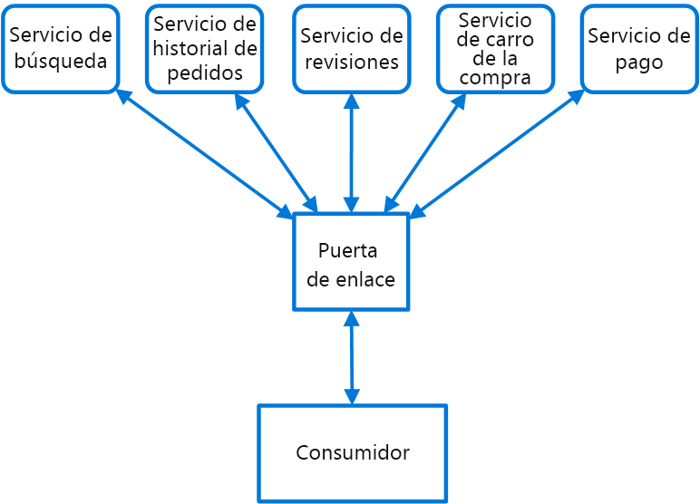

# <a name="gateway-routing-pattern"></a>Patrón Gateway Routing

Enruta las solicitudes a varios servicios mediante un solo punto de conexión. Este patrón es útil cuando desea exponer varios servicios en un único punto de conexión y enrutarlos al servicio adecuado en función de la solicitud.

## <a name="context-and-problem"></a>Contexto y problema

Cuando un cliente debe consumir varios servicios, puede resultar difícil configurar un punto de conexión diferente para cada servicio y hacer que el cliente administre cada punto de conexión. Por ejemplo, una aplicación de comercio electrónico podría proporcionar servicios como búsqueda, revisiones, carro, finalización de la compra e historial de pedidos. Cada servicio tiene una API diferente con la que el cliente debe interactuar, y el cliente debe conocer cada punto de conexión para conectarse a los servicios. Si cambia una API, también se debe actualizar el cliente. Si refactoriza un servicio en dos o más servicios independientes, el código debe cambiar en el servicio y en el cliente.

## <a name="solution"></a>Solución

Coloque una puerta de enlace delante de un conjunto de aplicaciones, servicios o implementaciones. Use el enrutamiento del nivel de aplicación 7 para enrutar la solicitud a las instancias adecuadas.

Con este patrón, la aplicación cliente solo necesita conocer y comunicarse con un único punto de conexión. Si un servicio se consolida o descompone, no se tiene que actualizar el cliente necesariamente. Puede seguir realizando solicitudes a la puerta de enlace y solo cambia el enrutamiento.

Una puerta de enlace también ofrece la posibilidad de abstraer los servicios back-end de los clientes. De esta forma, las llamadas de clientes pueden simplificarse y se permiten cambios en estos servicios detrás de la puerta de enlace. Las llamadas de clientes se pueden enrutar a cualquier servicio necesario para administrar el comportamiento esperado de los clientes, lo que le permite agregar, dividir y reorganizar los servicios detrás de la puerta de enlace sin cambiar el cliente.


 
Este patrón también puede ayudar con la implementación, ya que le permite administrar cómo se implementan las actualizaciones en los usuarios. Cuando se implemente una nueva versión de su servicio, se puede hacer en paralelo con la versión existente. El enrutamiento le permite controlar qué versión del servicio se presenta a los clientes, lo que permite usar diversas estrategias de lanzamiento: lanzamientos de actualizaciones incrementales, paralelas o completas. Cualquier problema detectado una vez que se implementa el nuevo servicio se puede revertir rápidamente mediante un cambio en la configuración en la puerta de enlace, sin afectar a los clientes.

## <a name="issues-and-considerations"></a>Problemas y consideraciones

- El servicio de puerta de enlace puede introducir un único punto de error. Asegúrese de que esté diseñado correctamente para satisfacer sus necesidades de disponibilidad. A la hora de la implementación, tenga en cuenta las funcionalidades de resistencia y tolerancia a errores.
- El servicio de puerta de enlace puede introducir un cuello de botella. Asegúrese de que la puerta de enlace tenga un rendimiento adecuado para administrar la carga y que pueda escalarse fácilmente en línea con sus expectativas de crecimiento.
- Realice pruebas de carga en la puerta de enlace para asegurarse de que no introduce errores en cascada en los servicios.
- El enrutamiento de puerta de enlace es de nivel 7. Se puede basar en la dirección IP, el puerto, el encabezado o la dirección URL.

## <a name="when-to-use-this-pattern"></a>Cuándo usar este patrón

Use este patrón en los siguientes supuestos:

- Un cliente deba usar varios servicios a los que se pueda acceder detrás de una puerta de enlace.
- Quiera simplificar las aplicaciones cliente usando un único punto de conexión.
- Necesite enrutar las solicitudes desde puntos de conexión externamente direccionables hasta puntos de conexión virtuales internos, por ejemplo, exponer los puertos de una máquina virtual a las direcciones IP virtuales del clúster.

Este patrón puede no ser adecuado si tiene una aplicación sencilla que solo usa uno o dos servicios.

## <a name="example"></a>Ejemplo

A continuación se muestra un ejemplo sencillo de archivo de configuración de un servidor que enruta solicitudes de aplicaciones que residen en distintos directorios virtuales a diferentes máquinas en el back end mediante el enrutador Ngnix.

```
server {
    listen 80;
    server_name domain.com;

    location /app1 {
        proxy_pass http://10.0.3.10:80;
    }

    location /app2 {
        proxy_pass http://10.0.3.20:80;
    }

    location /app3 {
        proxy_pass http://10.0.3.30:80;
    }
}
```

## <a name="related-guidance"></a>Instrucciones relacionadas

- [Patrón Backends for Frontends](./backends-for-frontends.md)
- [Patrón Gateway Aggregation](./gateway-aggregation.md)
- [Patrón Gateway Offloading](./gateway-offloading.md)


