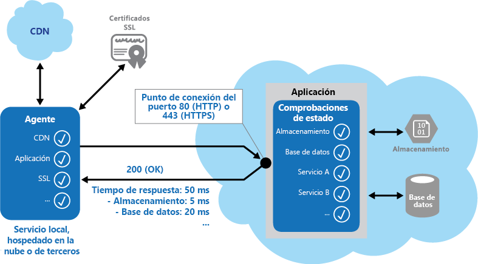

# <a name="health-endpoint-monitoring-pattern"></a>Patrón Health Endpoint Monitoring (supervisión de puntos de conexión de estado)

[!INCLUDE [header](../_includes/header.md)]

Implementa comprobaciones funcionales en una aplicación a la que pueden acceder herramientas externas a través de los puntos de conexión expuestos en intervalos regulares. Este patrón puede ayudar a comprobar que las aplicaciones y los servicios funcionan correctamente.

## <a name="context-and-problem"></a>Contexto y problema

Es un procedimiento recomendado y, a menudo, un requisito empresarial, supervisar las aplicaciones web y los servicios de back-end, para asegurarse de que están disponibles y de que funcionan correctamente. Sin embargo, es más difícil supervisar los servicios que se ejecutan en la nube que supervisar los servicios locales. Por ejemplo, no tiene control total sobre el entorno de hospedaje, y los servicios normalmente dependen de otros servicios proporcionados por proveedores de plataforma y por otros.

Hay muchos factores que afectan a las aplicaciones hospedadas en la nube como la latencia de red, el rendimiento y la disponibilidad de los sistemas subyacentes de proceso y almacenamiento, y el ancho de banda de red entre ellos. Se puede producir un error total o parcial en el servicio a causa de cualquiera de estos factores. Por lo tanto, debe comprobar periódicamente que el servicio se está ejecutando correctamente para garantizar el nivel requerido de disponibilidad, el cual puede que forme parte de su Acuerdo de Nivel de Servicio (SLA).

## <a name="solution"></a>Solución

Implemente el seguimiento de estado mediante el envío de solicitudes a un punto de conexión de la aplicación. La aplicación debe realizar las comprobaciones necesarias y devolver una indicación del estado.

Una comprobación de seguimiento del estado normalmente combina dos factores:

- Las comprobaciones (si existen) realizadas por la aplicación o servicio en respuesta a la solicitud del punto de conexión de la comprobación de mantenimiento.
- El análisis de los resultados por la herramienta o marco que realiza la comprobación de estado.

El código de respuesta indica el estado de la aplicación y, opcionalmente, el de los componentes o servicios que utiliza. La herramienta o marco de supervisión es la que realiza la comprobación de latencia o de tiempo de respuesta. Esta ilustración proporciona información general sobre el patrón.



Otras comprobaciones que el código de seguimiento del estado puede llevar a cabo incluyen:
- La comprobación del almacenamiento en la nube o de una base de datos para ver su disponibilidad y el tiempo de respuesta.
- La comprobación de otros servicios o recursos ubicados en la aplicación, o situados en otro lugar pero que la aplicación utiliza.

Existen servicios y herramientas disponibles que supervisan aplicaciones web mediante el envío de una solicitud a un conjunto configurable de puntos de conexión, y la evaluación de los resultados en comparación con un conjunto de reglas configurable. Es relativamente fácil crear un punto de conexión de servicio cuyo único propósito consista en realizar algunas pruebas funcionales en el sistema.

Entre las comprobaciones típicas que se pueden realizar mediante las herramientas de supervisión se incluyen:

- Validación del código de respuesta. Por ejemplo, una respuesta HTTP 200 (OK) indica que la aplicación respondió sin errores. El sistema de supervisión puede también comprobar otros códigos de respuesta para dar unos resultados más completos.
- Comprobación del contenido de la respuesta para detectar errores, incluso cuando se devuelve un código de estado 200 (OK). Esta permite detectar los errores que afectan a solo una sección de la página web o respuesta del servicio devueltas. Por ejemplo, la comprobación del título de una página o la búsqueda de una expresión específica que indique que se devolvió la página correcta.
- La medición del tiempo de respuesta, el cual indica una combinación de la latencia de red y el tiempo que la aplicación tardó en ejecutar la solicitud. Un valor que aumenta puede indicar un problema emergente con la aplicación o la red.
- Comprobación de recursos o servicios que se encuentran fuera de la aplicación, como una red de entrega de contenido que usa la aplicación para entregar contenido a partir de memorias caché globales.
- Comprobación de la expiración de certificados SSL.
- Medición del tiempo de respuesta de una búsqueda de DNS de la dirección URL de la aplicación para medir la latencia y los errores de DNS.
- Validación de la dirección URL devuelta por la búsqueda de DNS para asegurarse de que las entradas son correctas. Esto puede ayudar a evitar la redirección de solicitudes malintencionadas como resultado de un ataque al servidor DNS.

También resulta útil, siempre que sea posible, ejecutar estas comprobaciones desde ubicaciones diferentes locales u hospedadas para medir y comparar los tiempos de respuesta. Lo ideal sería supervisar las aplicaciones desde ubicaciones que estén cerca de los clientes para obtener una vista precisa del rendimiento de cada ubicación. Además de proporcionar un mecanismo de comprobación más potente, los resultados pueden ayudarle a decidir la ubicación de la implementación de la aplicación y si debe implementarla en más de un centro de datos.

Las pruebas se deben ejecutar en todas las instancias de servicio que los clientes usen para garantizar que la aplicación funciona correctamente para todos los clientes. Por ejemplo, si el almacenamiento de un cliente se distribuye en más de una cuenta de almacenamiento, el proceso de supervisión debería comprobarlas todas.

## <a name="issues-and-considerations"></a>Problemas y consideraciones

Tenga en cuenta los puntos siguientes al decidir cómo implementar este patrón:

Validación de la respuesta. Por ejemplo, ¿basta con solo un único código de estado 200 (OK) para comprobar que la aplicación funciona correctamente? Aunque este proporciona la medida más básica de disponibilidad de las aplicaciones y es la implementación mínima de este patrón, proporciona poca información sobre las operaciones, tendencias y posibles problemas futuros de la aplicación.

   >  Asegúrese de que la aplicación devuelve correctamente un 200 (OK) solo si se encuentra y procesa el recurso de destino. En algunos escenarios, como cuando se usa una página maestra para hospedar la página web de destino, el servidor devuelve un código de estado 200 (OK) en lugar de un código 404 (no encontrado), incluso aunque no se encuentre la página de contenido de destino.

El número de puntos de conexión a exponer para una aplicación. Un enfoque consiste en exponer al menos un punto de conexión para los servicios básicos que utiliza la aplicación y otro para los servicios de prioridad inferior, lo que permite que haya diferentes niveles de importancia que se asignarán a cada resultado de la supervisión. Considere también la posibilidad de exponer más puntos de conexión como, por ejemplo, uno para cada servicio básico, para conseguir granularidad adicional en la supervisión. Por ejemplo, una comprobación de estado puede comprobar la base de datos, el almacenamiento y un servicio de geocodificación externo que use una aplicación, cada uno de ellos con un nivel diferente de tiempo de actividad y de tiempo de respuesta. El estado de la aplicación puede seguir siendo correcto incluso aunque el servicio de geocodificación, o alguna otra tarea en segundo plano, no esté disponible durante algunos minutos.

Si debe utilizar el mismo punto de conexión para la supervisión que el que se usa para el acceso general, pero para una ruta de acceso específica diseñada para comprobaciones de estado, por ejemplo, /HealthCheck/{GUID}/ en el punto de conexión de acceso general. Esto permite que las herramientas de supervisión ejecuten algunas pruebas funcionales en la aplicación, como agregar un nuevo registro de usuario, iniciar sesión y realizar una orden de prueba, al tiempo que también se comprueba que el punto de conexión de acceso general está disponible.

El tipo de información que se debe recopilar del servicio en respuesta a las solicitudes de supervisión, y la devolución de esta información. La mayoría de las herramientas y marcos existentes mira solo el código de estado HTTP que devuelve el punto de conexión. Para devolver y validar información adicional, es posible que deba crear un servicio o una utilidad de supervisión personalizados.

La cantidad de información que desea recopilar. La realización de un procesamiento excesivo durante la comprobación puede sobrecargar la aplicación y afectar a otros usuarios. El tiempo que tarda puede superar el tiempo de espera del sistema de supervisión, por lo que se marcaría la aplicación como no disponible. La mayoría de las aplicaciones incluye instrumentaciones como controladores de error y contadores de rendimiento que registran el rendimiento y una detallada información del error, lo cual puede que sea suficiente en lugar de tener que devolver información adicional de una comprobación de estado.

Almacenamiento en caché del estado del punto de conexión. Puede que sea costoso ejecutar la comprobación de estado con demasiada frecuencia. Si el estado de mantenimiento se notifica mediante un panel, por ejemplo, seguramente no deseará que todas las solicitudes del panel desencadenen una comprobación de estado. En vez de eso, realice comprobaciones periódicas del estado del sistema y el estado de la caché. Exponga un punto de conexión que devuelva el estado almacenado en caché.

Configuración de la seguridad de los puntos de conexión de supervisión para protegerlos del acceso público, que podría exponer a la aplicación a ataques malintencionados, al riesgo de exponer información confidencial o al de atraer ataques por denegación de servicio (DoS). Normalmente esto debe realizarse en la configuración de la aplicación para que se pueda actualizar fácilmente sin necesidad de reiniciar la aplicación. Considere el uso de una o varias de las técnicas siguientes:

- Protección del punto de conexión mediante autenticación. Puede hacerlo mediante una clave de seguridad de autenticación en el encabezado de la solicitud o mediante la transferencia de credenciales con la solicitud, siempre que el servicio o la herramienta de supervisión admita la autenticación.

  - Use un punto de conexión oscuro u oculto. Por ejemplo, exponga el punto de conexión en una dirección IP distinta a la usada por la URL de la aplicación predeterminada, configure el punto de conexión en un puerto HTTP no estándar y use una ruta compleja para probar la página. Normalmente, puede especificar direcciones y puertos de puntos de conexión en la configuración de la aplicación, y agregar entradas para estos puntos de conexión en el servidor DNS si es necesario para evitar tener que especificar la dirección IP directamente.

  - Exponga un método en un punto de conexión que acepte un parámetro como valor de clave o valor de modo de operación. Dependiendo del valor proporcionado para este parámetro, cuando se recibe una solicitud el código puede realizar una prueba concreta o un conjunto de pruebas o devolver un error 404 (no encontrado) si no se reconoce el valor del parámetro. Los valores de parámetro que se pueden reconocer se establecen en la configuración de la aplicación.

     >  Es probable que los ataques por denegación de servicio tengan menos impacto en un punto de conexión independiente que realiza pruebas funcionales básicas que no afectan a las operaciones de la aplicación. En la medida de lo posible, evite el uso de una prueba que pueda exponer información confidencial. Si debe devolver información que pueda resultar útil a un atacante, tenga en cuenta la protección del punto de conexión y de los datos ante accesos no autorizados. En este caso, confiar simplemente en la oscuridad de un punto de conexión no es suficiente. También debe considerar el uso de una conexión HTTPS y el cifrado de todos los datos confidenciales, aunque esto aumentará la carga en el servidor.

- Acceso a un punto de conexión protegido mediante autenticación. No todas las herramientas y marcos pueden configurarse para incluir las credenciales con la solicitud de comprobación de estado. Por ejemplo, las características de comprobación de estado integradas en Microsoft Azure no pueden proporcionar credenciales de autenticación. Algunas alternativas de terceros son [Pingdom](https://www.pingdom.com/), [Panopta](http://www.panopta.com/), [NewRelic](https://newrelic.com/) y [Statuscake](https://www.statuscake.com/).

- Cómo asegurarse de que el agente de supervisión funciona correctamente. Un enfoque consiste en exponer un punto de conexión que solo devuelve un valor de la configuración de la aplicación o un valor aleatorio que se puede utilizar para probar el agente.

   >  Asegúrese también de que el sistema de supervisión realiza comprobaciones en él mismo como pruebas automáticas o pruebas integradas, para evitar que emita falsos resultados positivos.

## <a name="when-to-use-this-pattern"></a>Cuándo usar este patrón

Este patrón es útil para:
- Supervisar sitios web y aplicaciones web para comprobar la disponibilidad.
- Supervisar sitios web y aplicaciones web para comprobar para que funcionan correctamente.
- Supervisar servicios de nivel intermedio o compartidos para detectar y aislar un error que pueda afectar a otras aplicaciones.
- Complementar la instrumentación que ya existe en la aplicación como los contadores de rendimiento y los controladores de errores. La comprobación de estado no reemplaza la necesidad de registros y auditorías en la aplicación. La instrumentación puede proporcionar información valiosa para un marco existente que supervisa los contadores y registros de errores para detectar errores u otros problemas. Sin embargo, no puede proporcionar información si la aplicación no está disponible.

## <a name="example"></a>Ejemplo

Los siguientes ejemplos de código, tomados de la clase `HealthCheckController` (hay un ejemplo que muestra este patrón disponible en [GitHub](https://github.com/mspnp/cloud-design-patterns/tree/master/health-endpoint-monitoring)), muestran cómo exponer un punto de conexión para llevar a cabo un intervalo de comprobaciones de estado.

El método `CoreServices`, que se muestra a continuación en C#, realiza una serie de comprobaciones en los servicios usados en la aplicación. Si todas las pruebas se ejecutan sin errores, el método devuelve un código de estado 200 (OK). Si alguna de las pruebas produce una excepción, el método devuelve un código de estado 500 (Error interno). El método puede opcionalmente devolver información adicional en caso de error, si la herramienta o marco de supervisión es capaz de hacer uso de esta.

```csharp
public ActionResult CoreServices()
{
  try
  {
    // Run a simple check to ensure the database is available.
    DataStore.Instance.CoreHealthCheck();

    // Run a simple check on our external service.
    MyExternalService.Instance.CoreHealthCheck();
  }
  catch (Exception ex)
  {
    Trace.TraceError("Exception in basic health check: {0}", ex.Message);

    // This can optionally return different status codes based on the exception.
    // Optionally it could return more details about the exception.
    // The additional information could be used by administrators who access the
    // endpoint with a browser, or using a ping utility that can display the
    // additional information.
    return new HttpStatusCodeResult((int)HttpStatusCode.InternalServerError);
  }
  return new HttpStatusCodeResult((int)HttpStatusCode.OK);
}
```
El método `ObscurePath` muestra cómo puede leer una ruta desde la configuración de la aplicación y utilizarla como punto de conexión para las pruebas. Este ejemplo, en C#, también muestra cómo puede aceptar un identificador como parámetro y usarlo para comprobar las solicitudes válidas.

```csharp
public ActionResult ObscurePath(string id)
{
  // The id could be used as a simple way to obscure or hide the endpoint.
  // The id to match could be retrieved from configuration and, if matched,
  // perform a specific set of tests and return the result. If not matched it
  // could return a 404 (Not Found) status.

  // The obscure path can be set through configuration to hide the endpoint.
  var hiddenPathKey = CloudConfigurationManager.GetSetting("Test.ObscurePath");

  // If the value passed does not match that in configuration, return 404 (Not Found).
  if (!string.Equals(id, hiddenPathKey))
  {
    return new HttpStatusCodeResult((int)HttpStatusCode.NotFound);
  }

  // Else continue and run the tests...
  // Return results from the core services test.
  return this.CoreServices();
}
```

El método `TestResponseFromConfig` muestra cómo puede exponer un punto de conexión que realiza una comprobación para un valor de configuración especificado.

```csharp
public ActionResult TestResponseFromConfig()
{
  // Health check that returns a response code set in configuration for testing.
  var returnStatusCodeSetting = CloudConfigurationManager.GetSetting(
                                                          "Test.ReturnStatusCode");

  int returnStatusCode;

  if (!int.TryParse(returnStatusCodeSetting, out returnStatusCode))
  {
    returnStatusCode = (int)HttpStatusCode.OK;
  }

  return new HttpStatusCodeResult(returnStatusCode);
}
```
## <a name="monitoring-endpoints-in-azure-hosted-applications"></a>Supervisión de puntos de conexión en aplicaciones hospedadas en Azure

Algunas opciones para la supervisión de puntos de conexión en las aplicaciones de Azure son:

- Usar las características integradas de supervisión de Azure.

- Usar un servicio de otro fabricante o un marco como Microsoft System Center Operations Manager.

- Crear una utilidad personalizada o un servicio que se ejecuta en su propio servidor o en uno hospedado.

   >  Aunque Azure proporciona un conjunto de opciones de supervisión razonablemente completo, puede usar herramientas y servicios adicionales para proporcionar aún más información. Los servicios de administración de Azure proporcionan un mecanismo integrado de supervisión para las reglas de alerta. La sección de alertas de la página de los servicios de administración de Azure Portal le permite configurar hasta diez reglas de alerta por suscripción para los servicios. Estas reglas permiten especificar una condición y un valor de umbral para un servicio como el de carga de la CPU o el número de solicitudes o errores por segundo, y el servicio puede enviar automáticamente notificaciones por correo electrónico a las direcciones que se definan en cada regla.

Las condiciones que se pueden supervisar varían según el mecanismo de hospedaje que elija para su aplicación (por ejemplo, Web Sites, Cloud Services, Virtual Machines, o Mobile Services), pero todos estos incluyen la capacidad de crear una regla de alerta que utiliza un punto de conexión web que especifica en la configuración del servicio. Este punto de conexión debe responder de forma puntual para que el sistema de alerta pueda detectar que la aplicación está funcionando correctamente.

>  Lea más información acerca de la [creación de notificaciones de alerta][portal-alerts].

Si hospeda la aplicación en la web o en los roles de trabajo de Azure Cloud Services, o en Virtual Machines, puede aprovechar uno de los servicios integrados en Azure que se llama Traffic Manager. Traffic Manager es un servicio de enrutamiento y equilibrio de carga que puede distribuir las solicitudes a instancias específicas de la aplicación hospedada en Cloud Services según un intervalo de reglas y opciones.

Además de enrutar las solicitudes, Traffic Manager hace ping de forma regular en la dirección URL, el puerto y la ruta de acceso relativa que especifique para determinar qué instancias de la aplicación definida en sus reglas están activas y responden a las solicitudes. Si detecta un código de estado 200 (OK), marca la aplicación como disponible. Cualquier otro código de estado hace que Traffic Manager marque la aplicación como sin conexión. Puede ver el estado en la consola de Traffic Manager y configurar la regla para volver a enrutar las solicitudes a otras instancias de la aplicación que están respondiendo.

Sin embargo, Traffic Manager solo esperará diez segundos a recibir una respuesta desde la dirección URL de supervisión. Por lo tanto, debe asegurarse de que el código de comprobación de estado se ejecute en ese tiempo, lo que permite la latencia de red para el recorrido de ida desde Traffic Manager a la aplicación y a la inversa.

>  Lea más información sobre el uso de [Traffic Manager para supervisar las aplicaciones](https://azure.microsoft.com/documentation/services/traffic-manager/). Traffic Manager también se analiza en [Multiple Datacenter Deployment Guidance](https://msdn.microsoft.com/library/dn589779.aspx) (Guía para la implementación de varios centros de datos).

## <a name="related-guidance"></a>Instrucciones relacionadas

Las directrices siguientes pueden ser útiles a la hora de implementar este patrón:
- [Orientación sobre instrumentación y telemetría](https://msdn.microsoft.com/library/dn589775.aspx). La comprobación del estado de los servicios y componentes se suele realizar mediante sondeo, pero también es útil tener información de contexto para supervisar el rendimiento de la aplicación y detectar los eventos que se producen en el tiempo de ejecución. Estos datos se pueden transmitir a herramientas de supervisión como información adicional para la supervisión de estado. La orientación sobre instrumentación y telemetría explora la recopilación de información remota de diagnósticos que la instrumentación recopila en las aplicaciones.
- [Recepción de notificaciones de alerta][portal-alerts].
- Este patrón incluye una [aplicación de ejemplo](https://github.com/mspnp/cloud-design-patterns/tree/master/health-endpoint-monitoring) descargable.

[portal-alerts]: https://azure.microsoft.com/documentation/articles/insights-receive-alert-notifications/
