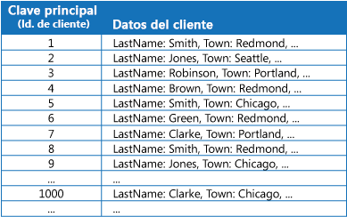
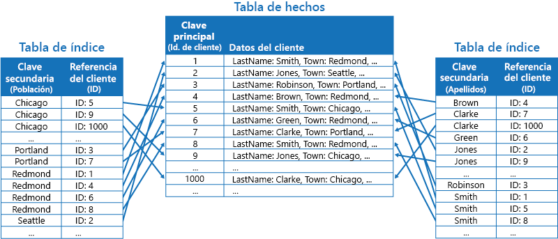
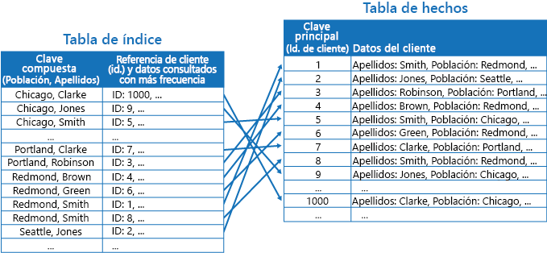
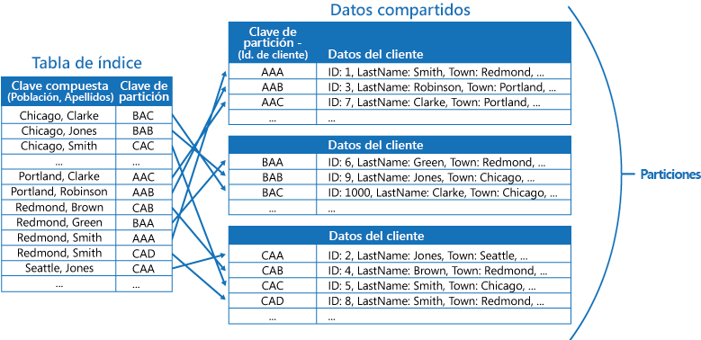

# Patrón Index TableIndex Table pattern

[!INCLUDE [header](../_includes/header.md)]

Crea índices en los campos de los almacenes de datos a los que suelen hacer referencia las consultas.Create indexes over the fields in data stores that are frequently referenced by queries. Este patrón puede mejorar el rendimiento de las consultas permitiendo a las aplicaciones localizar más rápidamente los datos a recuperar desde un almacén de datos.This pattern can improve query performance by allowing applications to more quickly locate the data to retrieve from a data store.

## Contexto y problemaContext and problem

Muchos almacenes de datos organizan los datos de una colección de entidades mediante la clave principal.Many data stores organize the data for a collection of entities using the primary key. Una aplicación puede usar esta clave para buscar y recuperar datos.An application can use this key to locate and retrieve data. La ilustración muestra un ejemplo de un almacén de datos que contiene información del cliente.The figure shows an example of a data store holding customer information. La clave principal es el identificador del cliente.The primary key is the Customer ID. La ilustración muestra la información del cliente organizada por la clave principal (identificador del cliente).The figure shows customer information organized by the primary key (Customer ID).

Aunque la clave principal es útil para consultas que capturan datos basados en el valor de esta clave, es posible que una aplicación no pueda usarla si necesita recuperar datos basados en algún otro campo.While the primary key is valuable for queries that fetch data based on the value of this key, an application might not be able to use the primary key if it needs to retrieve data based on some other field. En el ejemplo de los clientes, una aplicación no puede usar la clave principal de identificador del cliente para recuperar clientes si consulta los datos haciendo referencia únicamente al valor de algún otro atributo, como la ciudad en la que está ubicado el cliente.In the customers example, an application can't use the Customer ID primary key to retrieve customers if it queries data solely by referencing the value of some other attribute, such as the town in which the customer is located. Para realizar una consulta como esta, puede que la aplicación tenga que capturar y examinar todos los registros de los clientes, lo cual podría ser un proceso lento.To perform a query such as this, the application might have to fetch and examine every customer record, which could be a slow process.

Muchos sistemas de administración de bases de datos relacionales admiten índices secundarios.Many relational database management systems support secondary indexes. Un índice secundario es una estructura de datos independiente que se organiza por uno o varios campos clave no principales (secundarios), y que indica dónde se almacenan los datos de cada valor indexado.A secondary index is a separate data structure that's organized by one or more nonprimary (secondary) key fields, and it indicates where the data for each indexed value is stored. Normalmente, los elementos de un índice secundario se ordenan por el valor de las claves secundarias lo cual permite unas búsquedas rápidas de datos.The items in a secondary index are typically sorted by the value of the secondary keys to enable fast lookup of data. Normalmente, el sistema de administración de bases de datos es el encargado de mantener automáticamente estos índices.These indexes are usually maintained automatically by the database management system.

Puede crear tantos índices secundarios como sea necesario para admitir las distintas consultas que realiza la aplicación.You can create as many secondary indexes as you need to support the different queries that your application performs. Por ejemplo, en una tabla de clientes de una base de datos relacional en la que el identificador de cliente es la clave principal, es útil agregar un índice secundario con el campo de ciudad si la aplicación busca con frecuencia clientes por la ciudad en la que residen.For example, in a Customers table in a relational database where the Customer ID is the primary key, it's beneficial to add a secondary index over the town field if the application frequently looks up customers by the town where they reside.

Sin embargo, aunque los índices secundarios son habituales en los sistemas relacionales, la mayoría de los almacenes de datos NoSQL utilizados por aplicaciones en la nube no proporcionan ninguna característica equivalente.However, although secondary indexes are common in relational systems, most NoSQL data stores used by cloud applications don't provide an equivalent feature.

## SoluciónSolution

Si el almacén de datos no admite índices secundarios, puede emularlos manualmente mediante la creación de sus propias tablas de índice.If the data store doesn't support secondary indexes, you can emulate them manually by creating your own index tables. Una tabla de índice organiza los datos mediante una clave especificada.An index table organizes the data by a specified key. Normalmente se usan tres estrategias para estructurar una tabla de índice, dependiendo del número de índices secundarios que sean necesarios y la naturaleza de las consultas que realiza una aplicación.Three strategies are commonly used for structuring an index table, depending on the number of secondary indexes that are required and the nature of the queries that an application performs.

La primera estrategia consiste en duplicar los datos de cada tabla de índice pero organizándola por claves diferentes (desnormalización completa).The first strategy is to duplicate the data in each index table but organize it by different keys (complete denormalization). En la ilustración siguiente se muestran las tablas de índice que organizan la misma información del cliente por ciudad y apellido.The next figure shows index tables that organize the same customer information by Town and LastName.

Esta estrategia es adecuada si los datos son relativamente estáticos en comparación con el número de veces que se consulta mediante cada clave.This strategy is appropriate if the data is relatively static compared to the number of times it's queried using each key. Si los datos son más dinámicos, la sobrecarga de procesamiento que supone mantener cada tabla de índice resulta demasiado grande para que este enfoque sea útil.If the data is more dynamic, the processing overhead of maintaining each index table becomes too large for this approach to be useful. Además, si el volumen de datos es muy grande, la cantidad de espacio necesario para almacenar los datos duplicados es significativa.Also, if the volume of data is very large, the amount of space required to store the duplicate data is significant.

La segunda estrategia consiste en crear tablas de índice normalizadas organizadas por diferentes claves y hacer referencia a los datos originales mediante la clave principal en lugar de duplicarla, como se indica en la siguiente ilustración.The second strategy is to create normalized index tables organized by different keys and reference the original data by using the primary key rather than duplicating it, as shown in the following figure. Los datos originales se denominan tabla de hechos.The original data is called a fact table.

Esta técnica ahorra espacio y reduce la sobrecarga que supone mantener los datos duplicados.This technique saves space and reduces the overhead of maintaining duplicate data. La desventaja es que una aplicación tiene que realizar dos operaciones de búsqueda para buscar datos mediante una clave secundaria.The disadvantage is that an application has to perform two lookup operations to find data using a secondary key. Debe buscar la clave principal de los datos de la tabla de índice y, después, usar la clave principal para buscar los datos en la tabla de hechos.It has to find the primary key for the data in the index table, and then use the primary key to look up the data in the fact table.

La tercera estrategia consiste en crear tablas de índices parcialmente normalizadas y organizadas por claves diferentes que duplican los campos que se recuperan con frecuencia.The third strategy is to create partially normalized index tables organized by different keys that duplicate frequently retrieved fields. Haga referencia a la tabla de hechos para acceder a los campos a los que se accede con menos frecuencia.Reference the fact table to access less frequently accessed fields. La siguiente ilustración muestra cómo se duplican los datos a los que se accede habitualmente en cada tabla de índice.The next figure shows how commonly accessed data is duplicated in each index table.

Con esta estrategia, puede lograr un equilibrio entre los dos primeros enfoques.With this strategy, you can strike a balance between the first two approaches. Los datos de las consultas habituales se pueden recuperar rápidamente mediante una sola búsqueda, mientras que la sobrecarga de espacio y de mantenimiento no es tan significativa como la que se produce al duplicar todo el conjunto de datos.The data for common queries can be retrieved quickly by using a single lookup, while the space and maintenance overhead isn't as significant as duplicating the entire data set.

Si una aplicación realiza consultas frecuentes de datos mediante la especificación de una combinación de valores (por ejemplo, "Buscar todos los clientes que viven en Redmond y que tienen el apellido Smith"), puede implementar las claves para los elementos de la tabla de índice como una concatenación del atributo Town y del atributo LastName.If an application frequently queries data by specifying a combination of values (for example, “Find all customers that live in Redmond and that have a last name of Smith”), you could implement the keys to the items in the index table as a concatenation of the Town attribute and the LastName attribute. La ilustración siguiente muestra una tabla de índice basada en claves compuestas.The next figure shows an index table based on composite keys. Las claves se ordenan por ciudad, y luego por apellidos en el caso de aquellos registros que tienen el mismo valor para la ciudad.The keys are sorted by Town, and then by LastName for records that have the same value for Town.

Las tablas de índice pueden acelerar las operaciones de consulta en datos con particiones y son especialmente útiles en los casos en los que a la clave de partición se le aplica un algoritmo hash.Index tables can speed up query operations over sharded data, and are especially useful where the shard key is hashed. En la ilustración siguiente se muestra un ejemplo en el que la clave de partición es un hash del identificador de cliente.The next figure shows an example where the shard key is a hash of the Customer ID. La tabla de índice puede organizar los datos por el valor al que no se ha aplicado el algoritmo hash (Town y LastName) y proporcionar la clave de partición con hash como los datos de búsqueda.The index table can organize data by the nonhashed value (Town and LastName), and provide the hashed shard key as the lookup data. Esto puede ahorrar a la aplicación el tener que calcular repetidamente las claves hash (una operación costosa) si necesita recuperar los datos que se encuentran dentro de un intervalo, o si necesita capturar datos para la clave sin algoritmo hash.This can save the application from repeatedly calculating hash keys (an expensive operation) if it needs to retrieve data that falls within a range, or it needs to fetch data in order of the nonhashed key. Por ejemplo, una consulta como "Buscar todos los clientes que viven en Redmond" se puede resolver rápidamente localizando los elementos coincidentes en la tabla de índice, en la que están todos almacenados en un bloque contiguo.For example, a query such as “Find all customers that live in Redmond” can be quickly resolved by locating the matching items in the index table, where they're all stored in a contiguous block. Después, siga las referencias a los datos del cliente mediante las claves de partición almacenadas en la tabla de índice.Then, follow the references to the customer data using the shard keys stored in the index table.

## Problemas y consideracionesIssues and considerations

Tenga en cuenta los puntos siguientes al decidir cómo implementar este patrón:Consider the following points when deciding how to implement this pattern:

- La sobrecarga que supone el mantenimiento de índices secundarios puede ser importante.The overhead of maintaining secondary indexes can be significant. Debe analizar y comprender las consultas que usa la aplicación.You must analyze and understand the queries that your application uses. Solo puede crear tablas de índice cuando es probable que se utilicen con frecuencia.Only create index tables when they're likely to be used regularly. No cree tablas de índice especulativas que admitan consultas que una aplicación no realiza, o que realiza solo de forma ocasional.Don't create speculative index tables to support queries that an application doesn't perform, or performs only occasionally.
- Duplicar datos en una tabla de índice puede agregar una sobrecarga significativa en los costos de almacenamiento y en el esfuerzo necesario para mantener varias copias de datos.Duplicating data in an index table can add significant overhead in storage costs and the effort required to maintain multiple copies of data.
- La implementación de una tabla de índice como una estructura normalizada que hace referencia a los datos originales necesita una aplicación para realizar dos operaciones de búsqueda para encontrar los datos.Implementing an index table as a normalized structure that references the original data requires an application to perform two lookup operations to find data. La primera operación busca la tabla de índice para recuperar la clave principal, y la segunda usa la clave principal para capturar los datos.The first operation searches the index table to retrieve the primary key, and the second uses the primary key to fetch the data.
- Si un sistema incorpora varias tablas de índice de conjuntos de datos muy grandes, puede que sea difícil mantener la coherencia entre las tablas de índice y los datos originales.If a system incorporates a number of index tables over very large data sets, it can be difficult to maintain consistency between index tables and the original data. Es posible diseñar la aplicación basándose en el modelo de coherencia final.It might be possible to design the application around the eventual consistency model. Por ejemplo, para insertar, actualizar o eliminar datos, una aplicación podría enviar un mensaje a una cola y permitir que una tarea independiente realice la operación y mantenga las tablas de índice que hacen referencia a estos datos de forma asincrónica.For example, to insert, update, or delete data, an application could post a message to a queue and let a separate task perform the operation and maintain the index tables that reference this data asynchronously. Para más información acerca de la implementación de la coherencia final, consulte [Data consistency primer](https://msdn.microsoft.com/library/dn589800.aspx)(Manual básico de coherencia de datos).For more information about implementing eventual consistency, see the [Data Consistency Primer](https://msdn.microsoft.com/library/dn589800.aspx).

   >  Las tablas de almacenamiento de Microsoft Azure admiten actualizaciones transaccionales de los cambios realizados en los datos contenidos en la misma partición (denominadas transacciones de grupos de entidades).Microsoft Azure storage tables support transactional updates for changes made to data held in the same partition (referred to as entity group transactions). Si puede almacenar los datos de una tabla de hechos y una o varias tablas de índice en la misma partición, puede utilizar esta característica para ayudar a garantizar la coherencia.If you can store the data for a fact table and one or more index tables in the same partition, you can use this feature to help ensure consistency.

- Las tablas de índice se pueden particionar por sí mismas.Index tables might themselves be partitioned or sharded.

## Cuándo usar este patrónWhen to use this pattern

Use este patrón para mejorar el rendimiento de las consultas si una aplicación necesita con frecuencia recuperar datos mediante una clave distinta de la clave (o partición) principal.Use this pattern to improve query performance when an application frequently needs to retrieve data by using a key other than the primary (or shard) key.

Este modelo podría no ser útil en las situaciones siguientes:This pattern might not be useful when:

- Los datos son volátiles.Data is volatile. Una tabla de índice puede quedar desactualizada muy rápidamente, lo cual hace que resulte ineficaz o que la sobrecarga que supone mantener la tabla de índice sea mayor que cualquier ahorro que se pueda conseguir mediante su uso.An index table can become out of date very quickly, making it ineffective or making the overhead of maintaining the index table greater than any savings made by using it.
- Un campo seleccionado como clave secundaria para una tabla de índice no discrimina y solo puede tener un pequeño conjunto de valores (por ejemplo, el género).A field selected as the secondary key for an index table is nondiscriminating and can only have a small set of values (for example, gender).
- El equilibrio de los valores de datos de un campo seleccionado como clave secundaria para una tabla de índice no está muy sesgado.The balance of the data values for a field selected as the secondary key for an index table are highly skewed. Por ejemplo, si el 90 % de los registros contienen el mismo valor en un campo, crear y mantener una tabla de índice para buscar datos basados en este campo puede que cree más sobrecarga que un examen de los datos de forma secuencial.For example, if 90% of the records contain the same value in a field, then creating and maintaining an index table to look up data based on this field might create more overhead than scanning sequentially through the data. Sin embargo, si las consultas se realizan con mucha frecuencia sobre valores que se encuentran en el 10 % restante, este índice podría resultar útil.However, if queries very frequently target values that lie in the remaining 10%, this index can be useful. Debe comprender las consultas que realiza la aplicación y con qué frecuencia las hace.You should understand the queries that your application is performing, and how frequently they're performed.

## EjemploExample

Las tablas de Azure Storage proporcionan un almacén de datos clave/valor, altamente escalable, para las aplicaciones que se ejecutan en la nube.Azure storage tables provide a highly scalable key/value data store for applications running in the cloud. Las aplicaciones almacenan y recuperan valores de datos especificando una clave.Applications store and retrieve data values by specifying a key. Los valores de datos pueden contener varios campos, pero la estructura de un elemento de datos es opaca para el almacenamiento de tablas, que simplemente controla un elemento de datos como una matriz de bytes.The data values can contain multiple fields, but the structure of a data item is opaque to table storage, which simply handles a data item as an array of bytes.

Las tablas de Azure Storage también admiten particionamiento.Azure storage tables also support sharding. La clave de particionamiento incluye dos elementos, una clave de partición y una clave de fila.The sharding key includes two elements, a partition key and a row key. Los elementos que tienen la misma clave de partición se almacenan en la misma partición y los elementos se almacenan por orden según la clave de fila dentro de una partición.Items that have the same partition key are stored in the same partition (shard), and the items are stored in row key order within a shard. El almacenamiento de tablas está optimizado para realizar consultas que capturan datos incluidos en un intervalo contiguo de valores de clave de fila que se encuentran dentro de una partición.Table storage is optimized for performing queries that fetch data falling within a contiguous range of row key values within a partition. Si va a compilar aplicaciones en la nube que almacenan información en tablas de Azure, debe estructurar los datos con esta característica en mente.If you're building cloud applications that store information in Azure tables, you should structure your data with this feature in mind.

Por ejemplo, piense en una aplicación que almacena información acerca de películas.For example, consider an application that stores information about movies. La aplicación realiza consultas frecuentes sobre películas por género (acción, documental, histórica, comedia, serie, etc).The application frequently queries movies by genre (action, documentary, historical, comedy, drama, and so on). Puede crear una tabla de Azure con particiones para cada género usando este como clave de partición y especificando el nombre de la película como la clave de fila, tal y como se indica en la siguiente ilustración.You could create an Azure table with partitions for each genre by using the genre as the partition key, and specifying the movie name as the row key, as shown in the next figure.

Este enfoque es menos efectivo si la aplicación también necesita consultar películas por el actor principal.This approach is less effective if the application also needs to query movies by starring actor. En este caso, puede crear una tabla independiente de Azure que actúa como una tabla de índice.In this case, you can create a separate Azure table that acts as an index table. La clave de partición es el actor y la clave de fila es el nombre de la película.The partition key is the actor and the row key is the movie name. Los datos de cada actor se almacenan en particiones independientes.The data for each actor will be stored in separate partitions. Si una película tiene más de un protagonista, la misma película aparecerá en varias particiones.If a movie stars more than one actor, the same movie will occur in multiple partitions.

Puede duplicar los datos de la película en los valores mantenidos en cada partición mediante el primer enfoque descrito en la sección anterior de soluciones.You can duplicate the movie data in the values held by each partition by adopting the first approach described in the Solution section above. Sin embargo, es probable que cada película se replique varias veces (una vez por cada actor), por lo que podría resultar más eficaz desnormalizar parcialmente los datos para admitir las consultas más habituales (por ejemplo, los nombres de los otros actores) y habilitar una aplicación para recuperar los restantes detalles mediante la inclusión de la clave de partición necesaria para buscar la información completa en las particiones por género.However, it's likely that each movie will be replicated several times (once for each actor), so it might be more efficient to partially denormalize the data to support the most common queries (such as the names of the other actors) and enable an application to retrieve any remaining details by including the partition key necessary to find the complete information in the genre partitions. Este enfoque se describe en la tercera opción de la sección de soluciones.This approach is described by the third option in the Solution section. La ilustración siguiente muestra este enfoque.The next figure shows this approach.

## Orientación y patrones relacionadosRelated patterns and guidance

Los patrones y las directrices siguientes también pueden ser importantes a la hora de implementar este modelo:The following patterns and guidance might also be relevant when implementing this pattern:

- [Data Consistency Primer](https://msdn.microsoft.com/library/dn589800.aspx) (Manual básico de coherencia de datos).[Data Consistency Primer](https://msdn.microsoft.com/library/dn589800.aspx). Una tabla de índice se debe mantener a medida que cambian los datos que indexa.An index table must be maintained as the data that it indexes changes. En la nube, puede que no sea posible ni adecuado realizar operaciones que actualicen un índice como parte de la misma transacción que modifica los datos.In the cloud, it might not be possible or appropriate to perform operations that update an index as part of the same transaction that modifies the data. En ese caso, un enfoque con coherencia final es más adecuado.In that case, an eventually consistent approach is more suitable. Proporciona información sobre los problemas que pueden surgir con la coherencia final.Provides information on the issues surrounding eventual consistency.
- [Sharding pattern](https://msdn.microsoft.com/library/dn589797.aspx) (Patrón de particionamiento).[Sharding pattern](https://msdn.microsoft.com/library/dn589797.aspx). El patrón de tabla de índice se utiliza con frecuencia junto con datos con particiones mediante el uso de particiones.The Index Table pattern is frequently used in conjunction with data partitioned by using shards. El patrón Sharding proporciona más información acerca de cómo dividir un almacén de datos en un conjunto de particiones.The Sharding pattern provides more information on how to divide a data store into a set of shards.
- [Patrón Materialized View](materialized-view.md).[Materialized View pattern](materialized-view.md). En lugar de indexar los datos para admitir consultas que resuman los datos, puede ser más adecuado crear una vista materializada de estos.Instead of indexing data to support queries that summarize data, it might be more appropriate to create a materialized view of the data. Describe cómo admitir consultas de resumen eficaces mediante la generación de vistas rellenadas previamente con datos.Describes how to support efficient summary queries by generating prepopulated views over data.
