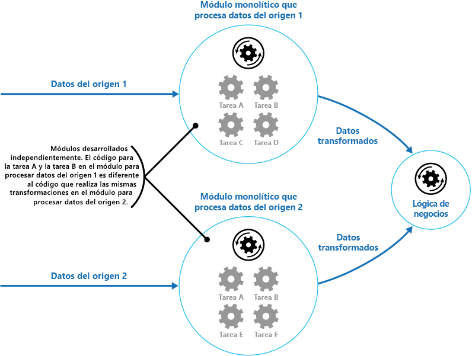

# <a name="pipes-and-filters-pattern"></a><span data-ttu-id="c0a2c-104">Patrón Pipes and Filters</span><span class="sxs-lookup"><span data-stu-id="c0a2c-104">Pipes and Filters pattern</span></span>

[!INCLUDE [header](../_includes/header.md)]

<span data-ttu-id="c0a2c-105">Descompone una tarea que realiza un procesamiento complejo en una serie de elementos independientes que se pueden volver a utilizar.</span><span class="sxs-lookup"><span data-stu-id="c0a2c-105">Decompose a task that performs complex processing into a series of separate elements that can be reused.</span></span> <span data-ttu-id="c0a2c-106">Este patrón puede mejorar el rendimiento, la escalabilidad y la capacidad de reutilización al permitir que los elementos de tarea que realizan el procesamiento se implementen y escalen por separado.</span><span class="sxs-lookup"><span data-stu-id="c0a2c-106">This can improve performance, scalability, and reusability by allowing task elements that perform the processing to be deployed and scaled independently.</span></span>

## <a name="context-and-problem"></a><span data-ttu-id="c0a2c-107">Contexto y problema</span><span class="sxs-lookup"><span data-stu-id="c0a2c-107">Context and problem</span></span>

<span data-ttu-id="c0a2c-108">Una aplicación debe realizar diversas tareas de complejidad variable sobre la información que procesa.</span><span class="sxs-lookup"><span data-stu-id="c0a2c-108">An application is required to perform a variety of tasks of varying complexity on the information that it processes.</span></span> <span data-ttu-id="c0a2c-109">Un método sencillo pero inflexible de implementar una aplicación es realizar este procesamiento como un módulo monolítico.</span><span class="sxs-lookup"><span data-stu-id="c0a2c-109">A straightforward but inflexible approach to implementing an application is to perform this processing as a monolithic module.</span></span> <span data-ttu-id="c0a2c-110">Sin embargo, este método probablemente reducirá las posibilidades de refactorización del código, su optimización o su reutilización si partes del mismo procesamiento se necesitan en otro lugar dentro de la aplicación.</span><span class="sxs-lookup"><span data-stu-id="c0a2c-110">However, this approach is likely to reduce the opportunities for refactoring the code, optimizing it, or reusing it if parts of the same processing are required elsewhere within the application.</span></span>

<span data-ttu-id="c0a2c-111">En la ilustración se muestran los problemas con el procesamiento de datos mediante el enfoque monolítico.</span><span class="sxs-lookup"><span data-stu-id="c0a2c-111">The figure illustrates the issues with processing data using the monolithic approach.</span></span> <span data-ttu-id="c0a2c-112">Una aplicación recibe y procesa datos de dos orígenes.</span><span class="sxs-lookup"><span data-stu-id="c0a2c-112">An application receives and processes data from two sources.</span></span> <span data-ttu-id="c0a2c-113">Los datos de cada origen se procesan mediante un módulo independiente que lleva a cabo una serie de tareas para transformar estos datos, antes de pasar el resultado a la lógica de negocios de la aplicación.</span><span class="sxs-lookup"><span data-stu-id="c0a2c-113">The data from each source is processed by a separate module that performs a series of tasks to transform this data, before passing the result to the business logic of the application.</span></span>



<span data-ttu-id="c0a2c-115">Algunas de las tareas que realizan los módulos monolíticos son funcionalmente muy similares, pero los módulos se han diseñado por separado.</span><span class="sxs-lookup"><span data-stu-id="c0a2c-115">Some of the tasks that the monolithic modules perform are functionally very similar, but the modules have been designed separately.</span></span> <span data-ttu-id="c0a2c-116">El código que implementa las tareas se acopla estrechamente en un módulo y se ha desarrollado sin apenas considerar su reutilización o escalabilidad.</span><span class="sxs-lookup"><span data-stu-id="c0a2c-116">The code that implements the tasks is closely coupled in a module, and has been developed with little or no thought given to reuse or scalability.</span></span>

<span data-ttu-id="c0a2c-117">Sin embargo, las tareas de procesamiento realizadas por cada módulo, o los requisitos de implementación de cada tarea, podrían cambiar a medida que se actualizan los requisitos empresariales.</span><span class="sxs-lookup"><span data-stu-id="c0a2c-117">However, the processing tasks performed by each module, or the deployment requirements for each task, could change as business requirements are updated.</span></span> <span data-ttu-id="c0a2c-118">Es posible que algunas tareas sean de proceso intensivo y puedan beneficiarse de su ejecución en hardware de gran potencia, mientras que otras no necesiten recursos tan caros.</span><span class="sxs-lookup"><span data-stu-id="c0a2c-118">Some tasks might be compute intensive and could benefit from running on powerful hardware, while others might not require such expensive resources.</span></span> <span data-ttu-id="c0a2c-119">Además, puede que en el futuro se necesite procesamiento adicional o que cambie el orden en el que el procesamiento realiza las tareas.</span><span class="sxs-lookup"><span data-stu-id="c0a2c-119">Also, additional processing might be required in the future, or the order in which the tasks performed by the processing could change.</span></span> <span data-ttu-id="c0a2c-120">Se necesita una solución que aborde estos problemas y aumente las posibilidades de reutilización del código.</span><span class="sxs-lookup"><span data-stu-id="c0a2c-120">A solution is required that addresses these issues, and increases the possibilities for code reuse.</span></span>

## <a name="solution"></a><span data-ttu-id="c0a2c-121">Solución</span><span class="sxs-lookup"><span data-stu-id="c0a2c-121">Solution</span></span>

<span data-ttu-id="c0a2c-122">Desglose el procesamiento que requiere cada flujo en un conjunto de componentes (o filtros) independientes, que realice cada uno una única tarea.</span><span class="sxs-lookup"><span data-stu-id="c0a2c-122">Break down the processing required for each stream into a set of separate components (or filters), each performing a single task.</span></span> <span data-ttu-id="c0a2c-123">Al estandarizar el formato de los datos que recibe y envía cada componente, estos filtros se pueden combinar en una canalización.</span><span class="sxs-lookup"><span data-stu-id="c0a2c-123">By standardizing the format of the data that each component receives and sends, these filters can be combined together into a pipeline.</span></span> <span data-ttu-id="c0a2c-124">Esto contribuye a evitar la duplicación de código y facilita la eliminación, la sustitución o la integración de componentes adicionales en caso de que cambien los requisitos de procesamiento.</span><span class="sxs-lookup"><span data-stu-id="c0a2c-124">This helps to avoid duplicating code, and makes it easy to remove, replace, or integrate additional components if the processing requirements change.</span></span> <span data-ttu-id="c0a2c-125">En la ilustración siguiente se muestra una solución implementada mediante canalizaciones y filtros.</span><span class="sxs-lookup"><span data-stu-id="c0a2c-125">The next figure shows a solution implemented using pipes and filters.</span></span>


<span data-ttu-id="c0a2c-127">El tiempo que tarda en procesarse una única solicitud depende de la velocidad del filtro más lento de la canalización.</span><span class="sxs-lookup"><span data-stu-id="c0a2c-127">The time it takes to process a single request depends on the speed of the slowest filter in the pipeline.</span></span> <span data-ttu-id="c0a2c-128">Uno o más filtros podrían formar un cuello de botella, en especial si un gran número de solicitudes aparece en un flujo de un origen de datos en particular.</span><span class="sxs-lookup"><span data-stu-id="c0a2c-128">One or more filters could be a bottleneck, especially if a large number of requests appear in a stream from a particular data source.</span></span> <span data-ttu-id="c0a2c-129">Una de las principales ventajas de la estructura de canalizaciones es que ofrece oportunidades para ejecutar instancias en paralelo de filtros lentos, que permite que el sistema reparta la carga y mejore el rendimiento.</span><span class="sxs-lookup"><span data-stu-id="c0a2c-129">A key advantage of the pipeline structure is that it provides opportunities for running parallel instances of slow filters, enabling the system to spread the load and improve throughput.</span></span>

<span data-ttu-id="c0a2c-130">Los filtros que forman una canalización se pueden ejecutar en equipos diferentes, de forma que se pueden escalar de manera independiente y aprovechar la elasticidad que proporcionan muchos entornos de nube.</span><span class="sxs-lookup"><span data-stu-id="c0a2c-130">The filters that make up a pipeline can run on different machines, enabling them to be scaled independently and take advantage of the elasticity that many cloud environments provide.</span></span> <span data-ttu-id="c0a2c-131">Un filtro que consuma muchos recursos informáticos se puede ejecutar en hardware de alto rendimiento, mientras que otros filtros menos exigentes se pueden hospedar en hardware básico menos costoso.</span><span class="sxs-lookup"><span data-stu-id="c0a2c-131">A filter that is computationally intensive can run on high performance hardware, while other less demanding filters can be hosted on less expensive commodity hardware.</span></span> <span data-ttu-id="c0a2c-132">Los filtros no tienen que estar siquiera en el mismo centro de datos o la misma ubicación geográfica, lo que permite que cada elemento de una canalización se ejecute en un entorno próximo a los recursos que necesita.</span><span class="sxs-lookup"><span data-stu-id="c0a2c-132">The filters don't even have to be in the same data center or geographical location, which allows each element in a pipeline to run in an environment that is close to the resources it requires.</span></span>  <span data-ttu-id="c0a2c-133">En la ilustración siguiente se muestra un ejemplo aplicado a la canalización de los datos desde el origen 1.</span><span class="sxs-lookup"><span data-stu-id="c0a2c-133">The next figure shows an example applied to the pipeline for the data from Source 1.</span></span>


<span data-ttu-id="c0a2c-135">Si la entrada y la salida de un filtro se estructuran como un flujo, se puede realizar el procesamiento de cada filtro en paralelo.</span><span class="sxs-lookup"><span data-stu-id="c0a2c-135">If the input and output of a filter are structured as a stream, it's possible to perform the processing for each filter in parallel.</span></span> <span data-ttu-id="c0a2c-136">El primer filtro de la canalización puede iniciar su trabajo y generar sus resultados, que se pasan directamente al filtro siguiente de la secuencia antes de que el primer filtro haya completado su trabajo.</span><span class="sxs-lookup"><span data-stu-id="c0a2c-136">The first filter in the pipeline can start its work and output its results, which are passed directly on to the next filter in the sequence before the first filter has completed its work.</span></span>

<span data-ttu-id="c0a2c-137">Otra ventaja es la resistencia que puede proporcionar este modelo.</span><span class="sxs-lookup"><span data-stu-id="c0a2c-137">Another benefit is the resiliency that this model can provide.</span></span> <span data-ttu-id="c0a2c-138">Si se produce un error en un filtro o la máquina en la que se ejecuta ya no está disponible, la canalización puede volver a programar el trabajo que estaba realizando el filtro y dirigir este trabajo a otra instancia del componente.</span><span class="sxs-lookup"><span data-stu-id="c0a2c-138">If a filter fails or the machine it's running on is no longer available, the pipeline can reschedule the work that the filter was performing and direct this work to another instance of the component.</span></span> <span data-ttu-id="c0a2c-139">El error de un único filtro no da lugar necesariamente a un error de la canalización entera.</span><span class="sxs-lookup"><span data-stu-id="c0a2c-139">Failure of a single filter doesn't necessarily result in failure of the entire pipeline.</span></span>

<span data-ttu-id="c0a2c-140">El uso del patrón Pipes and Filters en combinación con el [patrón Compensating Transaction](compensating-transaction.md) es un enfoque alternativo a la implementación de transacciones distribuidas.</span><span class="sxs-lookup"><span data-stu-id="c0a2c-140">Using the Pipes and Filters pattern in conjunction with the [Compensating Transaction pattern](compensating-transaction.md) is an alternative approach to implementing distributed transactions.</span></span> <span data-ttu-id="c0a2c-141">Una transacción distribuida se puede dividir en tareas independientes compensables, cada una de los cuales se puede implementar mediante un filtro que también implementa el patrón Compensating Transaction.</span><span class="sxs-lookup"><span data-stu-id="c0a2c-141">A distributed transaction can be broken down into separate, compensable tasks, each of which can be implemented by using a filter that also implements the Compensating Transaction pattern.</span></span> <span data-ttu-id="c0a2c-142">Los filtros de una canalización se pueden implementar como tareas hospedadas diferentes que se ejecutan cerca de los datos que mantienen.</span><span class="sxs-lookup"><span data-stu-id="c0a2c-142">The filters in a pipeline can be implemented as separate hosted tasks running close to the data that they maintain.</span></span>

## <a name="issues-and-considerations"></a><span data-ttu-id="c0a2c-143">Problemas y consideraciones</span><span class="sxs-lookup"><span data-stu-id="c0a2c-143">Issues and considerations</span></span>

<span data-ttu-id="c0a2c-144">A la hora de decidir cómo implementar este patrón, debe considerar los siguientes puntos:</span><span class="sxs-lookup"><span data-stu-id="c0a2c-144">You should consider the following points when deciding how to implement this pattern:</span></span>
- <span data-ttu-id="c0a2c-145">**Complejidad**.</span><span class="sxs-lookup"><span data-stu-id="c0a2c-145">**Complexity**.</span></span> <span data-ttu-id="c0a2c-146">La mayor flexibilidad que proporciona este patrón también puede presentar complejidad, especialmente si los filtros de una canalización se distribuyen entre diferentes servidores.</span><span class="sxs-lookup"><span data-stu-id="c0a2c-146">The increased flexibility that this pattern provides can also introduce complexity, especially if the filters in a pipeline are distributed across different servers.</span></span>

- <span data-ttu-id="c0a2c-147">**Confiabilidad**.</span><span class="sxs-lookup"><span data-stu-id="c0a2c-147">**Reliability**.</span></span> <span data-ttu-id="c0a2c-148">Use una infraestructura que garantice que el flujo de datos entre los filtros de una canalización no se pierda.</span><span class="sxs-lookup"><span data-stu-id="c0a2c-148">Use an infrastructure that ensures that data flowing between filters in a pipeline won't be lost.</span></span>

- <span data-ttu-id="c0a2c-149">**Idempotencia**.</span><span class="sxs-lookup"><span data-stu-id="c0a2c-149">**Idempotency**.</span></span> <span data-ttu-id="c0a2c-150">Si se produce un error en un filtro de una canalización después de recibir un mensaje y el trabajo se vuelve a programar para otra instancia del filtro, puede que parte del trabajo ya se haya completado.</span><span class="sxs-lookup"><span data-stu-id="c0a2c-150">If a filter in a pipeline fails after receiving a message and the work is rescheduled to another instance of the filter, part of the work might have already been completed.</span></span> <span data-ttu-id="c0a2c-151">Si este trabajo actualiza algún aspecto del estado global (por ejemplo, la información almacenada en una base de datos), se podría repetir la misma actualización.</span><span class="sxs-lookup"><span data-stu-id="c0a2c-151">If this work updates some aspect of the global state (such as information stored in a database), the same update could be repeated.</span></span> <span data-ttu-id="c0a2c-152">Un problema similar puede surgir si se produce un error en un filtro después de publicar sus resultados en el filtro siguiente de la canalización, pero antes de que indique que ha completado su trabajo correctamente.</span><span class="sxs-lookup"><span data-stu-id="c0a2c-152">A similar issue might occur if a filter fails after posting its results to the next filter in the pipeline, but before indicating that it's completed its work successfully.</span></span> <span data-ttu-id="c0a2c-153">En estos casos, otra instancia del filtro podría repetir el mismo trabajo, lo que provoca que los mismos resultados se publiquen dos veces.</span><span class="sxs-lookup"><span data-stu-id="c0a2c-153">In these cases, the same work could be repeated by another instance of the filter, causing the same results to be posted twice.</span></span> <span data-ttu-id="c0a2c-154">Esto podría dar lugar a que los sucesivos filtros de la canalización procesaran los mismos datos dos veces.</span><span class="sxs-lookup"><span data-stu-id="c0a2c-154">This could result in subsequent filters in the pipeline processing the same data twice.</span></span> <span data-ttu-id="c0a2c-155">Por lo tanto, los filtros de una canalización se deben diseñar para que sean idempotentes.</span><span class="sxs-lookup"><span data-stu-id="c0a2c-155">Therefore filters in a pipeline should be designed to be idempotent.</span></span> <span data-ttu-id="c0a2c-156">Para más información, consulte los [patrones de idempotencia](https://blog.jonathanoliver.com/idempotency-patterns/) en el blog de Jonathan Oliver.</span><span class="sxs-lookup"><span data-stu-id="c0a2c-156">For more information see [Idempotency Patterns](https://blog.jonathanoliver.com/idempotency-patterns/) on Jonathan Oliver’s blog.</span></span>

- <span data-ttu-id="c0a2c-157">**Mensajes repetidos**.</span><span class="sxs-lookup"><span data-stu-id="c0a2c-157">**Repeated messages**.</span></span> <span data-ttu-id="c0a2c-158">Si se produce un error en un filtro de una canalización después de publicarse un mensaje en la siguiente fase de esta, podría ejecutarse otra instancia del filtro y publicarse una copia del mismo mensaje en la canalización.</span><span class="sxs-lookup"><span data-stu-id="c0a2c-158">If a filter in a pipeline fails after posting a message to the next stage of the pipeline, another instance of the filter might be run, and it'll post a copy of the same message to the pipeline.</span></span> <span data-ttu-id="c0a2c-159">Como consecuencia, dos instancias del mismo mensaje pasarían al siguiente filtro.</span><span class="sxs-lookup"><span data-stu-id="c0a2c-159">This could cause two instances of the same message to be passed to the next filter.</span></span> <span data-ttu-id="c0a2c-160">Para evitar esto, la canalización debe detectar y eliminar los mensajes duplicados.</span><span class="sxs-lookup"><span data-stu-id="c0a2c-160">To avoid this, the pipeline should detect and eliminate duplicate messages.</span></span>

    >  <span data-ttu-id="c0a2c-161">Si va a implementar la canalización mediante colas de mensajes (como colas de Microsoft Azure Service Bus), la infraestructura de puesta en cola de mensajes podría proporcionar la detección y eliminación automáticas de los mensajes duplicados.</span><span class="sxs-lookup"><span data-stu-id="c0a2c-161">If you're implementing the pipeline by using message queues (such as Microsoft Azure Service Bus queues), the message queuing infrastructure might provide automatic duplicate message detection and removal.</span></span>

- <span data-ttu-id="c0a2c-162">**Contexto y estado**.</span><span class="sxs-lookup"><span data-stu-id="c0a2c-162">**Context and state**.</span></span> <span data-ttu-id="c0a2c-163">En una canalización, cada filtro se ejecuta básicamente de forma aislada y no se debe hacer ninguna suposición sobre cómo se invocó.</span><span class="sxs-lookup"><span data-stu-id="c0a2c-163">In a pipeline, each filter essentially runs in isolation and shouldn't make any assumptions about how it was invoked.</span></span> <span data-ttu-id="c0a2c-164">Esto significa que cada filtro debe proporcionarse con suficiente contexto para realizar su trabajo.</span><span class="sxs-lookup"><span data-stu-id="c0a2c-164">This means that each filter should be provided with sufficient context to perform its work.</span></span> <span data-ttu-id="c0a2c-165">Este contexto puede incluir una gran cantidad de información de estado.</span><span class="sxs-lookup"><span data-stu-id="c0a2c-165">This context could include a large amount of state information.</span></span>

## <a name="when-to-use-this-pattern"></a><span data-ttu-id="c0a2c-166">Cuándo usar este patrón</span><span class="sxs-lookup"><span data-stu-id="c0a2c-166">When to use this pattern</span></span>

<span data-ttu-id="c0a2c-167">Use este patrón en los siguientes supuestos:</span><span class="sxs-lookup"><span data-stu-id="c0a2c-167">Use this pattern when:</span></span>
- <span data-ttu-id="c0a2c-168">El procesamiento que requiera una aplicación se pueda desglosar fácilmente en un conjunto de pasos independientes.</span><span class="sxs-lookup"><span data-stu-id="c0a2c-168">The processing required by an application can easily be broken down into a set of independent steps.</span></span>

- <span data-ttu-id="c0a2c-169">Los pasos de procesamiento que realiza una aplicación tengan requisitos de escalabilidad diferentes.</span><span class="sxs-lookup"><span data-stu-id="c0a2c-169">The processing steps performed by an application have different scalability requirements.</span></span>

    >  <span data-ttu-id="c0a2c-170">Los filtros que se van a escalar juntos se pueden agrupar en el mismo proceso.</span><span class="sxs-lookup"><span data-stu-id="c0a2c-170">It's possible to group filters that should scale together in the same process.</span></span> <span data-ttu-id="c0a2c-171">Para más información, consulte [Compute Resource Consolidation pattern](compute-resource-consolidation.md) (Patrón Compute Resource Consolidation).</span><span class="sxs-lookup"><span data-stu-id="c0a2c-171">For more information, see the [Compute Resource Consolidation pattern](compute-resource-consolidation.md).</span></span>

- <span data-ttu-id="c0a2c-172">Se requiere flexibilidad para permitir la reordenación de los pasos de procesamiento que realiza una aplicación o la funcionalidad para agregar y quitar pasos.</span><span class="sxs-lookup"><span data-stu-id="c0a2c-172">Flexibility is required to allow reordering of the processing steps performed by an application, or the capability to add and remove steps.</span></span>

- <span data-ttu-id="c0a2c-173">El sistema puede beneficiarse de la distribución de los pasos de procesamiento entre diferentes servidores.</span><span class="sxs-lookup"><span data-stu-id="c0a2c-173">The system can benefit from distributing the processing for steps across different servers.</span></span>

- <span data-ttu-id="c0a2c-174">Se requiere una solución confiable que minimice los efectos de los errores en un paso durante el procesamiento de los datos.</span><span class="sxs-lookup"><span data-stu-id="c0a2c-174">A reliable solution is required that minimizes the effects of failure in a step while data is being processed.</span></span>

<span data-ttu-id="c0a2c-175">Este modelo podría no ser útil en las situaciones siguientes:</span><span class="sxs-lookup"><span data-stu-id="c0a2c-175">This pattern might not be useful when:</span></span>
- <span data-ttu-id="c0a2c-176">Los pasos de procesamiento que realiza una aplicación no son independientes, o se deben realizar juntos como parte de la misma transacción.</span><span class="sxs-lookup"><span data-stu-id="c0a2c-176">The processing steps performed by an application aren't independent, or they have to be performed together as part of the same transaction.</span></span>

- <span data-ttu-id="c0a2c-177">La cantidad de información de contexto o estado que requiera un paso convierte a este enfoque en ineficaz.</span><span class="sxs-lookup"><span data-stu-id="c0a2c-177">The amount of context or state information required by a step makes this approach inefficient.</span></span> <span data-ttu-id="c0a2c-178">Podría ser posible conservar la información de estado en una base de datos, pero no use esta estrategia si la carga adicional en la base de datos provoca una contención excesiva.</span><span class="sxs-lookup"><span data-stu-id="c0a2c-178">It might be possible to persist state information to a database instead, but don't use this strategy if the additional load on the database causes excessive contention.</span></span>

## <a name="example"></a><span data-ttu-id="c0a2c-179">Ejemplo</span><span class="sxs-lookup"><span data-stu-id="c0a2c-179">Example</span></span>

<span data-ttu-id="c0a2c-180">Puede usar una secuencia de colas de mensajes para proporcionar la infraestructura necesaria para implementar una canalización.</span><span class="sxs-lookup"><span data-stu-id="c0a2c-180">You can use a sequence of message queues to provide the infrastructure required to implement a pipeline.</span></span> <span data-ttu-id="c0a2c-181">Una cola de mensajes inicial recibe mensajes no procesados.</span><span class="sxs-lookup"><span data-stu-id="c0a2c-181">An initial message queue receives unprocessed messages.</span></span> <span data-ttu-id="c0a2c-182">Un componente que se implementa como una tarea de filtro escucha un mensaje en esta cola, realiza su trabajo y, a continuación, publica el mensaje transformado en la cola siguiente de la secuencia.</span><span class="sxs-lookup"><span data-stu-id="c0a2c-182">A component implemented as a filter task listens for a message on this queue, performs its work, and then posts the transformed message to the next queue in the sequence.</span></span> <span data-ttu-id="c0a2c-183">Otra tarea de filtro puede escuchar mensajes en esta cola, procesarlos, publicar los resultados en otra cola, y así sucesivamente hasta que los datos completamente transformados aparezcan en el mensaje final de la cola.</span><span class="sxs-lookup"><span data-stu-id="c0a2c-183">Another filter task can listen for messages on this queue, process them, post the results to another queue, and so on until the fully transformed data appears in the final message in the queue.</span></span> <span data-ttu-id="c0a2c-184">En la ilustración siguiente se muestra cómo implementar una canalización mediante colas de mensajes.</span><span class="sxs-lookup"><span data-stu-id="c0a2c-184">The next figure illustrates implementing a pipeline using message queues.</span></span>


<span data-ttu-id="c0a2c-186">Si va a compilar una solución en Azure, puede usar colas de Service Bus para proporcionar un mecanismo de puesta en cola confiable y escalable.</span><span class="sxs-lookup"><span data-stu-id="c0a2c-186">If you're building a solution on Azure you can use Service Bus queues to provide a reliable and scalable queuing mechanism.</span></span> <span data-ttu-id="c0a2c-187">La clase `ServiceBusPipeFilter` que se muestra a continuación en C# ilustra cómo puede implementar un filtro que recibe mensajes de entrada de una cola, procesa estos mensajes y publica los resultados en otra cola.</span><span class="sxs-lookup"><span data-stu-id="c0a2c-187">The `ServiceBusPipeFilter` class shown below in C# demonstrates how you can implement a filter that receives input messages from a queue, processes these messages, and posts the results to another queue.</span></span>

>  <span data-ttu-id="c0a2c-188">La clase `ServiceBusPipeFilter` se define en el proyecto PipesAndFilters.Shared disponible en [GitHub](https://github.com/mspnp/cloud-design-patterns/tree/master/pipes-and-filters).</span><span class="sxs-lookup"><span data-stu-id="c0a2c-188">The `ServiceBusPipeFilter` class is defined in the PipesAndFilters.Shared project available from [GitHub](https://github.com/mspnp/cloud-design-patterns/tree/master/pipes-and-filters).</span></span>

```csharp
public class ServiceBusPipeFilter
{
  ...
  private readonly string inQueuePath;
  private readonly string outQueuePath;
  ...
  private QueueClient inQueue;
  private QueueClient outQueue;
  ...

  public ServiceBusPipeFilter(..., string inQueuePath, string outQueuePath = null)
  {
     ...
     this.inQueuePath = inQueuePath;
     this.outQueuePath = outQueuePath;
  }

  public void Start()
  {
    ...
    // Create the outbound filter queue if it doesn't exist.
    ...
    this.outQueue = QueueClient.CreateFromConnectionString(...);

    ...
    // Create the inbound and outbound queue clients.
    this.inQueue = QueueClient.CreateFromConnectionString(...);
  }

  public void OnPipeFilterMessageAsync(
    Func<BrokeredMessage, Task<BrokeredMessage>> asyncFilterTask, ...)
  {
    ...

    this.inQueue.OnMessageAsync(
      async (msg) =>
    {
      ...
      // Process the filter and send the output to the
      // next queue in the pipeline.
      var outMessage = await asyncFilterTask(msg);

      // Send the message from the filter processor
      // to the next queue in the pipeline.
      if (outQueue != null)
      {
        await outQueue.SendAsync(outMessage);
      }

      // Note: There's a chance that the same message could be sent twice
      // or that a message gets processed by an upstream or downstream
      // filter at the same time.
      // This would happen in a situation where processing of a message was
      // completed, it was sent to the next pipe/queue, and then failed
      // to complete when using the PeekLock method.
      // Idempotent message processing and concurrency should be considered
      // in a real-world implementation.
    },
    options);
  }

  public async Task Close(TimeSpan timespan)
  {
    // Pause the processing threads.
    this.pauseProcessingEvent.Reset();

    // There's no clean approach for waiting for the threads to complete
    // the processing. This example simply stops any new processing, waits
    // for the existing thread to complete, then closes the message pump
    // and finally returns.
    Thread.Sleep(timespan);

    this.inQueue.Close();
    ...
  }

  ...
}
```

<span data-ttu-id="c0a2c-189">El método `Start` de la clase `ServiceBusPipeFilter` conecta a un par de colas de entrada y salida y el método `Close` desconecta de la cola de entrada.</span><span class="sxs-lookup"><span data-stu-id="c0a2c-189">The `Start` method in the `ServiceBusPipeFilter` class connects to a pair of input and output queues, and the `Close` method disconnects from the input queue.</span></span> <span data-ttu-id="c0a2c-190">El método `OnPipeFilterMessageAsync` realiza el procesamiento real de mensajes y el parámetro `asyncFilterTask` para este método especifica el procesamiento que se va a realizar.</span><span class="sxs-lookup"><span data-stu-id="c0a2c-190">The `OnPipeFilterMessageAsync` method performs the actual processing of messages, the `asyncFilterTask` parameter to this method specifies the processing to be performed.</span></span> <span data-ttu-id="c0a2c-191">El método `OnPipeFilterMessageAsync` espera los mensajes entrantes en la cola de entrada, ejecuta el código especificado por el parámetro `asyncFilterTask` sobre cada mensaje que llega y publica los resultados en la cola de salida.</span><span class="sxs-lookup"><span data-stu-id="c0a2c-191">The `OnPipeFilterMessageAsync` method waits for incoming messages on the input queue, runs the code specified by the `asyncFilterTask` parameter over each message as it arrives, and posts the results to the output queue.</span></span> <span data-ttu-id="c0a2c-192">Las colas propiamente dichas se especifican mediante el constructor.</span><span class="sxs-lookup"><span data-stu-id="c0a2c-192">The queues themselves are specified by the constructor.</span></span>

<span data-ttu-id="c0a2c-193">La solución de ejemplo implementa filtros en un conjunto de roles de trabajo.</span><span class="sxs-lookup"><span data-stu-id="c0a2c-193">The sample solution implements filters in a set of worker roles.</span></span> <span data-ttu-id="c0a2c-194">Cada rol de trabajo se puede escalar de forma independiente, según la complejidad del procesamiento de negocio que realiza o los recursos necesarios para su procesamiento.</span><span class="sxs-lookup"><span data-stu-id="c0a2c-194">Each worker role can be scaled independently, depending on the complexity of the business processing that it performs or the resources required for processing.</span></span> <span data-ttu-id="c0a2c-195">Además, se pueden ejecutar varias instancias de cada rol de trabajo en paralelo para mejorar el rendimiento.</span><span class="sxs-lookup"><span data-stu-id="c0a2c-195">Additionally, multiple instances of each worker role can be run in parallel to improve throughput.</span></span>

<span data-ttu-id="c0a2c-196">El código siguiente muestra un rol de trabajo de Azure denominado `PipeFilterARoleEntry`, definido en el proyecto PipeFilterA de la solución de ejemplo.</span><span class="sxs-lookup"><span data-stu-id="c0a2c-196">The following code shows an Azure worker role named `PipeFilterARoleEntry`, defined in the PipeFilterA project in the sample solution.</span></span>

```csharp
public class PipeFilterARoleEntry : RoleEntryPoint
{
  ...
  private ServiceBusPipeFilter pipeFilterA;

  public override bool OnStart()
  {
    ...
    this.pipeFilterA = new ServiceBusPipeFilter(
      ...,
      Constants.QueueAPath,
      Constants.QueueBPath);

    this.pipeFilterA.Start();
    ...
  }

  public override void Run()
  {
    this.pipeFilterA.OnPipeFilterMessageAsync(async (msg) =>
    {
      // Clone the message and update it.
      // Properties set by the broker (Deliver count, enqueue time, ...)
      // aren't cloned and must be copied over if required.
      var newMsg = msg.Clone();

      await Task.Delay(500); // DOING WORK

      Trace.TraceInformation("Filter A processed message:{0} at {1}",
        msg.MessageId, DateTime.UtcNow);

      newMsg.Properties.Add(Constants.FilterAMessageKey, "Complete");

      return newMsg;
    });

    ...
  }

  ...
}
```

<span data-ttu-id="c0a2c-197">Este rol contiene un objeto `ServiceBusPipeFilter`.</span><span class="sxs-lookup"><span data-stu-id="c0a2c-197">This role contains a `ServiceBusPipeFilter` object.</span></span> <span data-ttu-id="c0a2c-198">El método `OnStart` del rol conecta a las colas para recibir mensajes de entrada y publicar mensajes de salida (los nombres de las colas se definen en la clase `Constants`).</span><span class="sxs-lookup"><span data-stu-id="c0a2c-198">The `OnStart` method in the role connects to the queues for receiving input messages and posting output messages (the names of the queues are defined in the `Constants` class).</span></span> <span data-ttu-id="c0a2c-199">El método `Run` invoca el método `OnPipeFilterMessagesAsync` para realizar algún procesamiento en cada mensaje recibido (en este ejemplo, el procesamiento se simula esperando un breve espacio de tiempo).</span><span class="sxs-lookup"><span data-stu-id="c0a2c-199">The `Run` method invokes the `OnPipeFilterMessagesAsync` method to perform some processing on each message that's received (in this example, the processing is simulated by waiting for a short period of time).</span></span> <span data-ttu-id="c0a2c-200">Una vez completado el procesamiento, se construye un nuevo mensaje que contiene los resultados (en este caso, al mensaje de entrada se le ha agregado una propiedad personalizada), y este mensaje se publica en la cola de salida.</span><span class="sxs-lookup"><span data-stu-id="c0a2c-200">When processing is complete, a new message is constructed containing the results (in this case, the input message has a custom property added), and this message is posted to the output queue.</span></span>

<span data-ttu-id="c0a2c-201">El código de ejemplo contiene otro rol de trabajo denominado `PipeFilterBRoleEntry` en el proyecto PipeFilterB.</span><span class="sxs-lookup"><span data-stu-id="c0a2c-201">The sample code contains another worker role named `PipeFilterBRoleEntry` in the PipeFilterB project.</span></span> <span data-ttu-id="c0a2c-202">Este rol es similar a `PipeFilterARoleEntry`, excepto por el hecho de que realiza un procesamiento diferente en el método `Run`.</span><span class="sxs-lookup"><span data-stu-id="c0a2c-202">This role is similar to `PipeFilterARoleEntry` except that it performs different processing in the `Run` method.</span></span> <span data-ttu-id="c0a2c-203">En la solución de ejemplo, estos dos roles se combinan para construir una canalización; la cola de salida del rol `PipeFilterARoleEntry` es la cola de entrada del rol `PipeFilterBRoleEntry`.</span><span class="sxs-lookup"><span data-stu-id="c0a2c-203">In the example solution, these two roles are combined to construct a pipeline, the output queue for the `PipeFilterARoleEntry` role is the input queue for the `PipeFilterBRoleEntry` role.</span></span>

<span data-ttu-id="c0a2c-204">La solución de ejemplo también proporciona dos roles adicionales llamados `InitialSenderRoleEntry` (en el proyecto InitialSender) y `FinalReceiverRoleEntry` (en el proyecto FinalReceiver).</span><span class="sxs-lookup"><span data-stu-id="c0a2c-204">The sample solution also provides two additional roles named `InitialSenderRoleEntry` (in the InitialSender project) and `FinalReceiverRoleEntry` (in the FinalReceiver project).</span></span> <span data-ttu-id="c0a2c-205">El rol `InitialSenderRoleEntry` proporciona el mensaje inicial de la canalización.</span><span class="sxs-lookup"><span data-stu-id="c0a2c-205">The `InitialSenderRoleEntry` role provides the initial message in the pipeline.</span></span> <span data-ttu-id="c0a2c-206">El método `OnStart` conecta a una única cola y el método `Run` publica un método en esta cola.</span><span class="sxs-lookup"><span data-stu-id="c0a2c-206">The `OnStart` method connects to a single queue and the `Run` method posts a method to this queue.</span></span> <span data-ttu-id="c0a2c-207">Esta cola es la cola de entrada que usa el rol `PipeFilterARoleEntry`, así que al publicarse un mensaje, será este `PipeFilterARoleEntry` rol el que lo reciba y procese.</span><span class="sxs-lookup"><span data-stu-id="c0a2c-207">This queue is the input queue used by the `PipeFilterARoleEntry` role, so posting a message to it causes the message to be received and processed by the `PipeFilterARoleEntry` role.</span></span> <span data-ttu-id="c0a2c-208">El mensaje procesado pasa entones por el rol `PipeFilterBRoleEntry`.</span><span class="sxs-lookup"><span data-stu-id="c0a2c-208">The processed message then passes through the `PipeFilterBRoleEntry` role.</span></span>

<span data-ttu-id="c0a2c-209">La cola de entrada del rol `FinalReceiveRoleEntry` es la cola de salida del rol `PipeFilterBRoleEntry`.</span><span class="sxs-lookup"><span data-stu-id="c0a2c-209">The input queue for the `FinalReceiveRoleEntry` role is the output queue for the `PipeFilterBRoleEntry` role.</span></span> <span data-ttu-id="c0a2c-210">El método `Run` del rol `FinalReceiveRoleEntry`, que se muestra a continuación, recibe el mensaje y realiza algún procesamiento final.</span><span class="sxs-lookup"><span data-stu-id="c0a2c-210">The `Run` method in the `FinalReceiveRoleEntry` role, shown below, receives the message and performs some final processing.</span></span> <span data-ttu-id="c0a2c-211">Luego escribe los valores de las propiedades personalizadas que agregan los filtros de la canalización en la salida de seguimiento.</span><span class="sxs-lookup"><span data-stu-id="c0a2c-211">Then it writes the values of the custom properties added by the filters in the pipeline to the trace output.</span></span>

```csharp
public class FinalReceiverRoleEntry : RoleEntryPoint
{
  ...
  // Final queue/pipe in the pipeline to process data from.
  private ServiceBusPipeFilter queueFinal;

  public override bool OnStart()
  {
    ...
    // Set up the queue.
    this.queueFinal = new ServiceBusPipeFilter(...,Constants.QueueFinalPath);
    this.queueFinal.Start();
    ...
  }

  public override void Run()
  {
    this.queueFinal.OnPipeFilterMessageAsync(
      async (msg) =>
      {
        await Task.Delay(500); // DOING WORK

        // The pipeline message was received.
        Trace.TraceInformation(
          "Pipeline Message Complete - FilterA:{0} FilterB:{1}",
          msg.Properties[Constants.FilterAMessageKey],
          msg.Properties[Constants.FilterBMessageKey]);

        return null;
      });
    ...
  }

  ...
}
```

## <a name="related-patterns-and-guidance"></a><span data-ttu-id="c0a2c-212">Orientación y patrones relacionados</span><span class="sxs-lookup"><span data-stu-id="c0a2c-212">Related patterns and guidance</span></span>

<span data-ttu-id="c0a2c-213">Los patrones y las directrices siguientes también pueden ser importantes a la hora de implementar este modelo:</span><span class="sxs-lookup"><span data-stu-id="c0a2c-213">The following patterns and guidance might also be relevant when implementing this pattern:</span></span>
- <span data-ttu-id="c0a2c-214">Se encuentra disponible un ejemplo que demuestra este patrón en [GitHub](https://github.com/mspnp/cloud-design-patterns/tree/master/pipes-and-filters).</span><span class="sxs-lookup"><span data-stu-id="c0a2c-214">A sample that demonstrates this pattern is available on [GitHub](https://github.com/mspnp/cloud-design-patterns/tree/master/pipes-and-filters).</span></span>
- <span data-ttu-id="c0a2c-215">[Patrón de consumidores de la competencia](competing-consumers.md).</span><span class="sxs-lookup"><span data-stu-id="c0a2c-215">[Competing Consumers pattern](competing-consumers.md).</span></span> <span data-ttu-id="c0a2c-216">Una canalización puede contener varias instancias de uno o varios filtros.</span><span class="sxs-lookup"><span data-stu-id="c0a2c-216">A pipeline can contain multiple instances of one or more filters.</span></span> <span data-ttu-id="c0a2c-217">Este enfoque es útil para la ejecución en paralelo de instancias de filtros lentos, que permiten que el sistema reparta la carga y mejore el rendimiento.</span><span class="sxs-lookup"><span data-stu-id="c0a2c-217">This approach is useful for running parallel instances of slow filters, enabling the system to spread the load and improve throughput.</span></span> <span data-ttu-id="c0a2c-218">Cada instancia de un filtro competirá por la entrada con las demás instancias; dos instancias de un filtro nunca deberían poder procesar los mismos datos.</span><span class="sxs-lookup"><span data-stu-id="c0a2c-218">Each instance of a filter will compete for input with the other instances, two instances of a filter shouldn't be able to process the same data.</span></span> <span data-ttu-id="c0a2c-219">Proporciona una explicación de este enfoque.</span><span class="sxs-lookup"><span data-stu-id="c0a2c-219">Provides an explanation of this approach.</span></span>
- <span data-ttu-id="c0a2c-220">[Patrón Compute Resource Consolidation](compute-resource-consolidation.md).</span><span class="sxs-lookup"><span data-stu-id="c0a2c-220">[Compute Resource Consolidation pattern](compute-resource-consolidation.md).</span></span> <span data-ttu-id="c0a2c-221">Los filtros que podrían escalarse juntos, se pueden agrupar en el mismo proceso.</span><span class="sxs-lookup"><span data-stu-id="c0a2c-221">It might be possible to group filters that should scale together into the same process.</span></span> <span data-ttu-id="c0a2c-222">Proporciona más información sobre las ventajas e inconvenientes de esta estrategia.</span><span class="sxs-lookup"><span data-stu-id="c0a2c-222">Provides more information about the benefits and tradeoffs of this strategy.</span></span>
- <span data-ttu-id="c0a2c-223">[Patrón Compensating Transaction](compensating-transaction.md).</span><span class="sxs-lookup"><span data-stu-id="c0a2c-223">[Compensating Transaction pattern](compensating-transaction.md).</span></span> <span data-ttu-id="c0a2c-224">Un filtro puede implementarse como una operación que se puede invertir o que tiene una operación de compensación que restaura el estado a una versión anterior en caso de error.</span><span class="sxs-lookup"><span data-stu-id="c0a2c-224">A filter can be implemented as an operation that can be reversed, or that has a compensating operation that restores the state to a previous version in the event of a failure.</span></span> <span data-ttu-id="c0a2c-225">Explica cómo se puede implementar para mantener o lograr coherencia definitiva.</span><span class="sxs-lookup"><span data-stu-id="c0a2c-225">Explains how this can be implemented to maintain or achieve eventual consistency.</span></span>
- <span data-ttu-id="c0a2c-226">[Patrones de idempotencia](https://blog.jonathanoliver.com/idempotency-patterns/) en el blog de Jonathan Oliver.</span><span class="sxs-lookup"><span data-stu-id="c0a2c-226">[Idempotency Patterns](https://blog.jonathanoliver.com/idempotency-patterns/) on Jonathan Oliver’s blog.</span></span>
