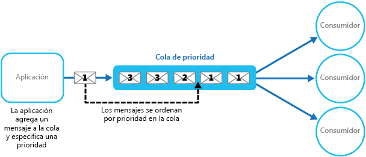
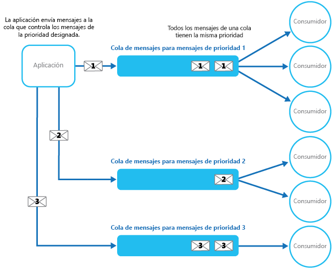
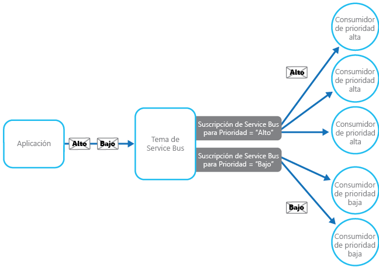

# <a name="priority-queue-pattern"></a>Patrón de cola de prioridad

[!INCLUDE [header](../_includes/header.md)]

Clasifica por orden de prioridad las solicitudes enviadas a los servicios para que aquellas con una prioridad más alta se reciban y procesen más rápidamente que las que tienen una prioridad más baja. Este patrón es útil en aplicaciones que ofrecen garantías de nivel de servicio diferentes a los clientes individuales.

## <a name="context-and-problem"></a>Contexto y problema

Las aplicaciones pueden delegar tareas específicas a otros servicios, por ejemplo, para realizar el procesamiento en segundo plano o para integrarse con otras aplicaciones o servicios. En la nube, una cola de mensajes se utiliza normalmente para delegar tareas al procesamiento en segundo plano. En muchos casos, el orden en que se reciben las solicitudes en un servicio no es importante. Sin embargo, en algunos casos, es necesario dar prioridad a solicitudes específicas. Estas solicitudes deben procesarse antes que las solicitudes de menor prioridad enviadas anteriormente por la aplicación.

## <a name="solution"></a>Solución

Una cola suele tener una estructura basada en el criterio primero en entrar, primero en salir, y los consumidores normalmente reciben mensajes en el mismo orden en que se publicaron en la cola. Sin embargo, algunas colas de mensajes admiten mensajería de prioridad. La aplicación que envía un mensaje puede asignar una prioridad y los mensajes de la cola se reordenan automáticamente para que los que tienen una prioridad más alta se reciban antes que aquellos con una prioridad más baja. En la figura se ilustra una cola con mensajes prioritarios.



> La mayoría de las implementaciones de cola de mensajes admiten varios consumidores (siguiendo el [patrón de consumidores en competencia](https://msdn.microsoft.com/library/dn568101.aspx)), y el número de procesos de consumidor se puede escalar o reducir verticalmente en función de la demanda.

En los sistemas que no admiten colas de mensajes basadas en prioridad, una solución alternativa consiste en mantener una cola independiente para cada prioridad. La aplicación es responsable de enviar mensajes a la cola adecuada. Cada cola puede tener un grupo independiente de consumidores. Las colas de más prioridad pueden tener un grupo más grande de consumidores en ejecución en hardware más rápido que las colas de menor prioridad. En la ilustración siguiente se muestra cómo utilizar las colas de mensajes independientes para cada prioridad.




Una variación de esta estrategia es disponer de un único grupo de consumidores que primero comprueba los mensajes en las colas de alta prioridad, y solo después inicia la captura de los mensajes de colas de prioridad más baja. Hay algunas diferencias semánticas entre una solución que utiliza un único grupo de procesos de consumidor (ya sea con una sola cola que admite mensajes con prioridades diferentes o con varias colas donde cada una controla los mensajes de una única prioridad) y una solución que usa varias colas con un grupo independiente para cada cola.

En el enfoque de grupo único, los mensajes con prioridad más alta siempre se reciben y procesan antes que los mensajes de prioridad más baja. En teoría, los mensajes que tienen una prioridad muy baja pueden reemplazarse continuamente y puede que nunca se procesen. En el enfoque de varios grupos, los mensajes de prioridad más baja siempre se procesarán, pero no tan rápido como los de más prioridad (en función del tamaño relativo de los grupos y los recursos que tienen disponibles).

El uso de un mecanismo de puesta en cola según prioridad puede ofrecer las ventajas siguientes:

- Permite a las aplicaciones satisfacer los requisitos empresariales que requieren la asignación de prioridades de disponibilidad o rendimiento, por ejemplo, ofrecer distintos niveles de servicio a grupos concretos de clientes.

- Puede ayudar a minimizar los costos operativos. En el enfoque de cola única, se puede reducir el número de consumidores si es necesario. Los mensajes con prioridad alta se seguirán procesando en primer lugar (aunque posiblemente más lentos), y los mensajes de menor prioridad podrían tardar más. Si ha implementado el enfoque de varias colas de mensajes con grupos independientes de consumidores para cada cola, puede reducir el grupo de consumidores para las colas de menor prioridad, o incluso suspender el procesamiento de algunas colas de prioridad muy baja al detener a todos los consumidores que escuchan mensajes en dichas colas.

- El enfoque de varias colas de mensajes puede ayudar a maximizar el rendimiento y la escalabilidad de la aplicación mediante la partición de mensajes en función de los requisitos de procesamiento. Por ejemplo, se puede dar prioridad a tareas vitales para que las controlen los receptores que se ejecutan inmediatamente, mientras que las tareas en segundo plano menos importantes pueden controlarlas los receptores programados para ejecutarse en períodos menos saturados.

## <a name="issues-and-considerations"></a>Problemas y consideraciones

Tenga en cuenta los puntos siguientes al decidir cómo implementar este patrón:

Defina las prioridades en el contexto de la solución. Por ejemplo, una prioridad alta puede significar que se deben procesar los mensajes en diez segundos. Identifique los requisitos para administrar elementos de prioridad alta y los otros recursos que se deben asignar a fin de cumplir estos criterios.

Decida si se deben procesar todos los elementos de prioridad alta antes que los elementos de menor prioridad. Si los mensajes los procesa un único grupo de consumidores, tendrá que proporcionar un mecanismo que pueda dar prioridad y suspender una tarea que administra un mensaje de prioridad baja si hay disponible un mensaje de mayor prioridad.

En el enfoque de varias colas, al usar un único grupo de procesos de consumidores que escuchan en todas las colas en lugar de un grupo de consumidores dedicado para cada cola, el consumidor debe aplicar un algoritmo que asegure que siempre pueda administrar los mensajes de colas de prioridad más alta antes que los de las colas de prioridad más baja.

Supervise la velocidad de procesamiento en colas de alta y baja prioridad para garantizar que los mensajes de estas colas se procesan a la velocidad esperada.

Si necesita garantizar que se procesarán los mensajes con prioridad baja, es necesario implementar el enfoque de varias colas de mensajes con varios grupos de consumidores. Como alternativa, en una cola que admite la concesión de prioridad a los mensajes, es posible aumentar de forma dinámica la prioridad de un mensaje en cola, conforme avanza el tiempo. Sin embargo, este enfoque depende de la cola de mensajes que ofrece esta característica.

Usar una cola independiente para cada prioridad de mensajes funciona mejor para los sistemas que tener un número pequeño de prioridades bien definidas.

El sistema puede determinar de manera lógica las prioridades de los mensajes. Por ejemplo, en lugar de tener mensajes explícitos con prioridad alta y baja, se podrían designar como "cliente que paga las cuotas" o "cliente que no paga las cuotas". Dependiendo del modelo de negocio, el sistema puede asignar más recursos para procesar los mensajes de los clientes que pagan las cuotas que para los clientes que no las pagan.

Puede haber un costo financiero y de procesamiento asociado con la comprobación de un mensaje en una cola (algunos sistemas de mensajería comerciales cargan una tarifa reducida cada vez que se envía o recupera un mensaje y cada vez que se consultan mensajes en una cola). Este costo aumenta si se comprueban varias colas.

Es posible ajustar dinámicamente el tamaño de un grupo de consumidores en función de la longitud de la cola que atiende al grupo. Para más información, vea la [Guía de escalado automático](https://msdn.microsoft.com/library/dn589774.aspx).

## <a name="when-to-use-this-pattern"></a>Cuándo usar este patrón

Este patrón es útil en escenarios donde:

- El sistema debe controlar varias tareas que tengan diferentes prioridades.

- Los distintos usuarios o inquilinos deben atender las solicitudes con otra prioridad.

## <a name="example"></a>Ejemplo

Microsoft Azure no proporciona un mecanismo de puesta en cola que admita de forma nativa la asignación de prioridad a los mensajes a través de la ordenación. Sin embargo, proporciona temas y suscripciones de Azure Service Bus que admiten un mecanismo de puesta en cola que ofrece filtrado de mensajes, además de un amplio conjunto de funcionalidades flexibles que lo hacen ideal para usarlo en las implementaciones de colas con la máxima prioridad.

Una solución de Azure puede implementar un tema de Service Bus en el que una aplicación puede publicar mensajes, de la misma manera que una cola. Los mensajes pueden contener metadatos en forma de propiedades personalizadas definidas por la aplicación. Las suscripciones de Service Bus se pueden asociar con el tema, y estas suscripciones pueden filtrar los mensajes en función de sus propiedades. Cuando una aplicación envía un mensaje a un tema, el mensaje se dirige a la suscripción correspondiente donde lo puede leer un consumidor. Los procesos del consumidor pueden recuperar mensajes de una suscripción utilizando la misma semántica que una cola de mensajes (una suscripción es una cola lógica). En la ilustración siguiente se muestra cómo implementar una cola de prioridad con temas y suscripciones de Azure Service Bus.




En la figura anterior, la aplicación crea varios mensajes y asigna una propiedad personalizada denominada `Priority` en cada mensaje con un valor, `High` o `Low`. La aplicación envía estos mensajes a un tema. El tema tiene dos suscripciones asociadas que filtran los mensajes examinando la propiedad `Priority`. Una suscripción acepta mensajes donde la propiedad `Priority` está establecida en `High`, y la otra acepta mensajes donde la propiedad `Priority` está establecida en `Low`. Un grupo de consumidores lee los mensajes de cada suscripción. La suscripción de alta prioridad tiene un grupo más grande, y estos consumidores podrían estar ejecutándose en equipos más eficaces con más recursos disponibles que los consumidores del grupo de prioridad baja.

Tenga en cuenta que no hay nada especial acerca de la designación de mensajes con prioridad alta y baja en este ejemplo. Son simplemente etiquetas especificadas como propiedades en cada mensaje, que se utilizan para dirigir mensajes a una suscripción específica. Si se requieren prioridades adicionales, es relativamente fácil crear más suscripciones y grupos de procesos de consumidor para controlar estas prioridades.

La solución PriorityQueue disponible en [GitHub](https://github.com/mspnp/cloud-design-patterns/tree/master/priority-queue) contiene una implementación de este enfoque. Esta solución contiene dos proyectos de rol de trabajo denominados `PriorityQueue.High` y `PriorityQueue.Low`. Estos roles de trabajo se heredan de la clase `PriorityWorkerRole` que contiene la funcionalidad para conectarse a una suscripción especificada en el método `OnStart`.

Los roles de trabajo `PriorityQueue.High` y `PriorityQueue.Low` se conectan a distintas suscripciones, definidas por sus valores de configuración. Un administrador puede configurar un número diferente de cada rol para ejecutarlo. Normalmente, habrá más instancias del rol de trabajo `PriorityQueue.High` que del rol de trabajo `PriorityQueue.Low`.

El método `Run` de la clase `PriorityWorkerRole` se encarga de que el método virtual `ProcessMessage` (también definido en la clase `PriorityWorkerRole`) se ejecute para cada mensaje recibido en la cola. El siguiente código muestra los métodos `Run` y `ProcessMessage`. La clase `QueueManager`, definida en el proyecto PriorityQueue.Shared, proporciona métodos auxiliares para usar colas de Azure Service Bus.

```csharp
public class PriorityWorkerRole : RoleEntryPoint
{
  private QueueManager queueManager;
  ...

  public override void Run()
  {
    // Start listening for messages on the subscription.
    var subscriptionName = CloudConfigurationManager.GetSetting("SubscriptionName");
    this.queueManager.ReceiveMessages(subscriptionName, this.ProcessMessage);
    ...;
  }
  ...

  protected virtual async Task ProcessMessage(BrokeredMessage message)
  {
    // Simulating processing.
    await Task.Delay(TimeSpan.FromSeconds(2));
  }
}
```
Los roles de trabajo `PriorityQueue.High` y `PriorityQueue.Low` invalidan la funcionalidad predeterminada del método `ProcessMessage`. El código siguiente muestra el método `ProcessMessage` para el rol de trabajo `PriorityQueue.High`.

```csharp
protected override async Task ProcessMessage(BrokeredMessage message)
{
  // Simulate message processing for High priority messages.
  await base.ProcessMessage(message);
  Trace.TraceInformation("High priority message processed by " +
    RoleEnvironment.CurrentRoleInstance.Id + " MessageId: " + message.MessageId);
}
```

Cuando una aplicación envía mensajes al tema asociado con las suscripciones utilizadas por los roles de trabajo `PriorityQueue.High` y `PriorityQueue.Low`, especifica la prioridad con el uso de la propiedad personalizada `Priority`, como se muestra en el siguiente ejemplo de código. Este código (implementado en la clase `WorkerRole` en el proyecto PriorityQueue.Sender), utiliza el método auxiliar `SendBatchAsync` de la clase `QueueManager` para enviar mensajes a un tema en lotes.

```csharp
// Send a low priority batch.
var lowMessages = new List<BrokeredMessage>();

for (int i = 0; i < 10; i++)
{
  var message = new BrokeredMessage() { MessageId = Guid.NewGuid().ToString() };
  message.Properties["Priority"] = Priority.Low;
  lowMessages.Add(message);
}

this.queueManager.SendBatchAsync(lowMessages).Wait();
...

// Send a high priority batch.
var highMessages = new List<BrokeredMessage>();

for (int i = 0; i < 10; i++)
{
  var message = new BrokeredMessage() { MessageId = Guid.NewGuid().ToString() };
  message.Properties["Priority"] = Priority.High;
  highMessages.Add(message);
}

this.queueManager.SendBatchAsync(highMessages).Wait();
```

## <a name="related-patterns-and-guidance"></a>Orientación y patrones relacionados

Los patrones y las directrices siguientes también pueden ser importantes a la hora de implementar este modelo:

- Se encuentra disponible un ejemplo que demuestra este patrón en [GitHub](https://github.com/mspnp/cloud-design-patterns/tree/master/priority-queue).

- [Manual de mensajería asincrónica](https://msdn.microsoft.com/library/dn589781.aspx). Un servicio de consumidor que procesa una solicitud puede necesitar enviar una respuesta a la instancia de la aplicación que publicó la solicitud. Proporciona información sobre las estrategias que puede usar para implementar la mensajería de solicitud/respuesta.

- [Patrón de consumidores de la competencia](competing-consumers.md). Para mejorar el rendimiento de las colas, es posible tener varios consumidores que escuchen en la misma cola y procesen las tareas en paralelo. Estos consumidores competirán por los mensajes, pero solo uno debe ser capaz de procesar cada mensaje. Proporciona más información sobre las ventajas y los inconvenientes de la implementación de este enfoque.

- [Patrón de limitación](throttling.md). Puede implementar la limitación mediante el uso de colas. La mensajería de prioridad puede usarse para asegurarse de que se concede prioridad a las solicitudes que proceden de aplicaciones críticas o de aplicaciones ejecutadas por clientes de alto valor con respecto a las solicitudes de aplicaciones menos importantes.

- [Guía de escalado automático](https://msdn.microsoft.com/library/dn589774.aspx). Es posible escalar el tamaño del grupo de procesos de consumidor que controlan una cola en función de la longitud de la cola. Esta estrategia puede ayudar a mejorar el rendimiento, especialmente para los grupos que controlan los mensajes con prioridad alta.

- [Patrones de Integración empresarial con Service Bus](http://abhishekrlal.com/2013/01/11/enterprise-integration-patterns-with-service-bus-part-2/) en el blog de Abhishek Lal.

