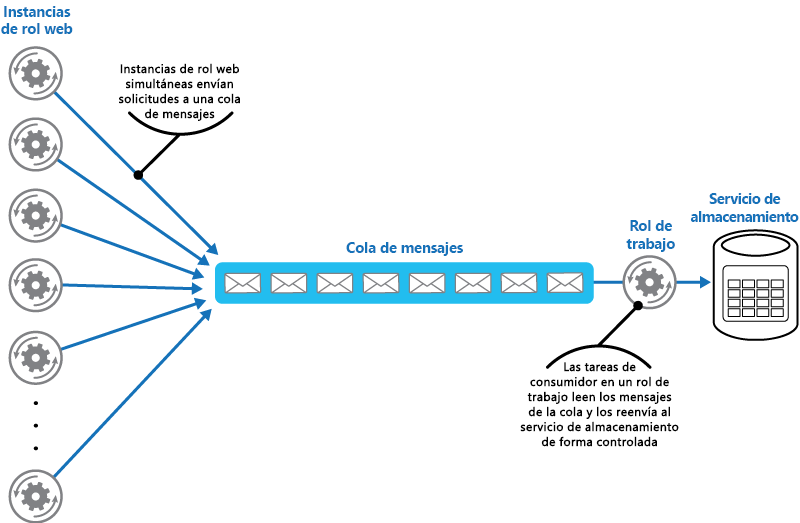

# Patrón Queue-Based Load Leveling

[!INCLUDE [header](../_includes/header.md)]

Use una cola que actúa como búfer entre una tarea y un servicio que invoca para equilibrar cargas pesadas intermitentes que pueden provocar errores en el servicio o la interrupción de la tarea. Esto puede ayudarle a minimizar el impacto de picos de demanda sobre la disponibilidad y capacidad de respuesta de la tarea y el servicio.

## Contexto y problema

Muchas soluciones en la nube implican la ejecución de tareas que invocan servicios. En este entorno, si un servicio está vinculado a cargas pesadas intermitentes, puede provocar problemas de confiabilidad o rendimiento.

Un servicio puede formar parte de la misma solución que las tareas que lo usan, o puede ser un servicio de terceros que proporciona acceso a los recursos que se usan frecuentemente como una memoria caché o un servicio de almacenamiento. Si el mismo servicio se usa por varias tareas que se ejecutan al mismo tiempo, puede ser difícil predecir el volumen de solicitudes en el servicio en cualquier momento.

Un servicio puede experimentar picos de demanda que provoquen que se sobrecargue y que no pueda responder a las solicitudes de una manera oportuna. El desbordamiento de un servicio con muchas solicitudes simultáneas también puede provocar errores en el servicio si no puede controlar la contención que provocan estas solicitudes.

## Solución

Refactorizar la solución e introducir una cola entre la tarea y el servicio. La tarea y el servicio se ejecutan de manera asincrónica. La tarea publica un mensaje que contiene los datos que necesita el servicio para una cola. La cola actúa como un búfer, almacenando el mensaje hasta que se recupera mediante el servicio. El servicio recupera los mensajes de la cola y los procesa. Las solicitudes de varias tareas, que pueden generarse a una frecuencia muy variable, pueden pasarse al servicio mediante la misma cola de mensajes. En esta figura se muestra el uso de una cola para nivelar la carga de un servicio.

La cola desvincula las tareas del servicio, y el servicio puede controlar los mensajes a su propio ritmo independientemente del volumen de solicitudes de las tareas simultáneas. Además, no existe ningún retraso en una tarea si el servicio no está disponible en el momento en que publica un mensaje en la cola.

Este modelo proporciona las siguientes ventajas:

- Puede ayudar a maximizar la disponibilidad porque los retrasos que surgen de los servicios no tendrán un impacto directo e inmediato sobre la aplicación, que puede seguir publicando mensajes a la cola incluso cuando el servicio no está disponible o no está procesando mensajes en esos momentos.
- Puede ayudar a maximizar la escalabilidad porque el número de colas y el número de servicios puede variar para satisfacer la demanda.
- Puede ayudar a controlar los costos porque el número de instancias de servicio que se ha implementado solo tiene que ser adecuado para cumplir la carga media en lugar de la carga máxima.

    >  Algunos servicios implementan limitaciones cuando la demanda alcanza un umbral en el que el sistema puede producir errores. La limitación puede reducir la funcionalidad disponible. Puede implementar una redistribución de la carga con estos servicios para garantizar que este umbral no se alcance.

## Problemas y consideraciones

Tenga en cuenta los puntos siguientes al decidir cómo implementar este patrón:

- Es necesario implementar una lógica de aplicación que controle la frecuencia a la que los servicios controlan mensajes para evitar una sobrecarga del recurso de destino. Evitar el paso de las puntas de actividad bajo demanda en la siguiente fase del sistema. Probar el sistema bajo carga para garantizar que proporciona el equilibro necesario, y ajustar el número de colas y el número de instancias de servicio que controlan mensajes para conseguirlo.
- Las colas de mensajes son un mecanismo de comunicación unidireccional. Si una tarea espera una respuesta de un servicio, puede que sea necesario implementar un mecanismo que el servicio pueda usar para enviar una respuesta. Para obtener más información, consulte el [Asynchronous Messaging Primer (Manual de mensajería asincrónica)](https://msdn.microsoft.com/library/dn589781.aspx).
- Tenga cuidado si aplica el escalado automático en servicios que están escuchando solicitudes en la cola. Esto puede provocar una contención aumentada de cualquier recurso que comparta estos servicios y puede disminuir la eficacia del uso de la cola para equilibrar la carga.

## Cuándo usar este patrón

Este modelo es útil en cualquier aplicación que use servicios que estén sujetos a la sobrecarga.

Este modelo no es útil si la aplicación espera una respuesta del servicio con una latencia mínima.

## Ejemplo

Un rol web de Microsoft Azure almacena datos con un servicio de almacenamiento independiente. Si un gran número de instancias del rol web se ejecutan simultáneamente, es posible que el servicio de almacenamiento no pueda responder a las solicitudes lo suficientemente rápido para evitar que estas solicitudes produzcan errores o interrupciones. En esta figura se resalta un servicio que está experimentando una sobrecarga por un gran número de solicitudes simultáneas de instancias de un rol web.

Para resolver esto, puede usar una cola para equilibrar la carga entre las instancias de rol web y el servicio de almacenamiento. En cambio, el servicio de almacenamiento está diseñado para aceptar solicitudes sincrónicas y no puede modificarse fácilmente para leer mensajes y administrar el rendimiento. Puede introducir un rol de trabajo para actuar como un servicio de proxy que recibe solicitudes de la cola y las reenvía al servicio de almacenamiento. La lógica de aplicación del rol de trabajo puede controlar la frecuencia a la que pasa solicitudes al servicio de almacenamiento para evitar que este se sobrecargue. En esta ilustración, se muestra el uso de una cola y un rol de trabajo para equilibrar la carga entre instancias del rol web y el servicio.

## Orientación y patrones relacionados

Los patrones y las directrices siguientes también pueden ser importantes a la hora de implementar este modelo:

- [Manual de mensajería asincrónica](https://msdn.microsoft.com/library/dn589781.aspx). Las colas de mensajes son esencialmente asincrónicas. Puede que sea necesario volver a diseñar la lógica de aplicación en una tarea si es una adaptación de la comunicación directa con un servicio para usar una cola de mensajes. De manera similar, puede que sea necesario refactorizar un servicio para que acepte solicitudes de una cola de mensajes. De manera alternativa, puede que sea posible implementar un servicio de proxy, como se describe en el ejemplo.
- [Patrón de consumidores de la competencia](competing-consumers.md). Puede que sea posible ejecutar varias instancias de un servicio, cada una de ellas actuando como un consumidor de mensajes de la cola de equilibrio de carga. Puede usar este enfoque para ajustar la frecuencia a la que se reciben los mensajes y se pasan a un servicio.
- [Patrón de limitación](throttling.md). Una manera sencilla de implementar la limitación con un servicio es usar el equilibrio de carga basado en colas y enrutar todas las solicitudes a un servicio mediante una cola de mensajes. El servicio puede procesar solicitudes a una frecuencia que garantice que los recursos necesarios para el servicio no se agotan, y para reducir la cantidad de contención que pueda producirse.
- [Conceptos del servicio de cola](https://msdn.microsoft.com/library/azure/dd179353.aspx). Información sobre la elección de un mecanismo de cola y mensajería en las aplicaciones de Azure.
