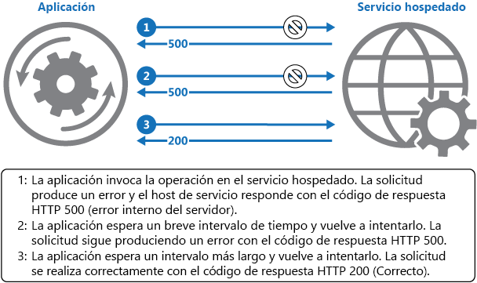

# <a name="retry-pattern"></a><span data-ttu-id="af157-104">Patrón Retry</span><span class="sxs-lookup"><span data-stu-id="af157-104">Retry pattern</span></span>

[!INCLUDE [header](../_includes/header.md)]

<span data-ttu-id="af157-105">Permite que una aplicación trate los errores transitorios cuando intenta conectarse a un servicio o un recurso de red, mediante el reintento de forma transparente de una operación con error.</span><span class="sxs-lookup"><span data-stu-id="af157-105">Enable an application to handle transient failures when it tries to connect to a service or network resource, by transparently retrying a failed operation.</span></span> <span data-ttu-id="af157-106">Esto puede mejorar la estabilidad de la aplicación.</span><span class="sxs-lookup"><span data-stu-id="af157-106">This can improve the stability of the application.</span></span>

## <a name="context-and-problem"></a><span data-ttu-id="af157-107">Contexto y problema</span><span class="sxs-lookup"><span data-stu-id="af157-107">Context and problem</span></span>

<span data-ttu-id="af157-108">Una aplicación que se comunica con elementos que se ejecutan en la nube tiene que ser vulnerable a los errores transitorios que puedan producirse en este entorno.</span><span class="sxs-lookup"><span data-stu-id="af157-108">An application that communicates with elements running in the cloud has to be sensitive to the transient faults that can occur in this environment.</span></span> <span data-ttu-id="af157-109">Entre los errores transitorios cabe mencionar la pérdida momentánea de conectividad de red en componentes y servicios, la falta de disponibilidad temporal de un servicio o los tiempos de espera que surgen cuando un servicio está ocupado.</span><span class="sxs-lookup"><span data-stu-id="af157-109">Faults include the momentary loss of network connectivity to components and services, the temporary unavailability of a service, or timeouts that occur when a service is busy.</span></span>

<span data-ttu-id="af157-110">Estos errores normalmente se corrigen automáticamente, y si se repite la acción que desencadena un error tras un retraso adecuado, es probable que tenga éxito.</span><span class="sxs-lookup"><span data-stu-id="af157-110">These faults are typically self-correcting, and if the action that triggered a fault is repeated after a suitable delay it's likely to be successful.</span></span> <span data-ttu-id="af157-111">Por ejemplo, un servicio de base de datos que procesa un número elevado de solicitudes simultáneas puede implementar una estrategia de limitación que temporalmente rechace las sucesivas solicitudes hasta que su carga de trabajo haya disminuido.</span><span class="sxs-lookup"><span data-stu-id="af157-111">For example, a database service that's processing a large number of concurrent requests can implement a throttling strategy that temporarily rejects any further requests until its workload has eased.</span></span> <span data-ttu-id="af157-112">Una aplicación que intenta acceder a la base de datos podría no conectarse, pero si lo intenta de nuevo después de un retraso podría tener éxito.</span><span class="sxs-lookup"><span data-stu-id="af157-112">An application trying to access the database might fail to connect, but if it tries again after a delay it might succeed.</span></span>

## <a name="solution"></a><span data-ttu-id="af157-113">Solución</span><span class="sxs-lookup"><span data-stu-id="af157-113">Solution</span></span>

<span data-ttu-id="af157-114">En la nube, los errores transitorios son algo habitual y una aplicación debería diseñarse para tratarlos con elegancia y transparencia.</span><span class="sxs-lookup"><span data-stu-id="af157-114">In the cloud, transient faults aren't uncommon and an application should be designed to handle them elegantly and transparently.</span></span> <span data-ttu-id="af157-115">De esta forma, se reducen los efectos que pueden tener los errores sobre las tareas empresariales que realiza la aplicación.</span><span class="sxs-lookup"><span data-stu-id="af157-115">This minimizes the effects faults can have on the business tasks the application is performing.</span></span>

<span data-ttu-id="af157-116">Si una aplicación detecta un error al intentar enviar una solicitud a un servicio remoto, puede tratar el error mediante las estrategias siguientes:</span><span class="sxs-lookup"><span data-stu-id="af157-116">If an application detects a failure when it tries to send a request to a remote service, it can handle the failure using the following strategies:</span></span>

- <span data-ttu-id="af157-117">**Cancelar**.</span><span class="sxs-lookup"><span data-stu-id="af157-117">**Cancel**.</span></span> <span data-ttu-id="af157-118">Si el error indica que el error no es transitorio o que no es probable que tenga éxito si se repite, la aplicación debe cancelar la operación y notificar una excepción.</span><span class="sxs-lookup"><span data-stu-id="af157-118">If the fault indicates that the failure isn't transient or is unlikely to be successful if repeated, the application should cancel the operation and report an exception.</span></span> <span data-ttu-id="af157-119">Por ejemplo, un error de autenticación ocasionado al proporcionarse credenciales no válidas no es probable que tenga éxito sin importar cuántas veces se intente.</span><span class="sxs-lookup"><span data-stu-id="af157-119">For example, an authentication failure caused by providing invalid credentials is not likely to succeed no matter how many times it's attempted.</span></span>

- <span data-ttu-id="af157-120">**Reintentar**.</span><span class="sxs-lookup"><span data-stu-id="af157-120">**Retry**.</span></span> <span data-ttu-id="af157-121">Si el error específico notificado es inusual o poco frecuente, se podría deber a circunstancias poco habituales, como un paquete de red que se daña mientras se está transmitiendo.</span><span class="sxs-lookup"><span data-stu-id="af157-121">If the specific fault reported is unusual or rare, it might have been caused by unusual circumstances such as a network packet becoming corrupted while it was being transmitted.</span></span> <span data-ttu-id="af157-122">En este caso, la aplicación podría reintentar la solicitud con error inmediatamente porque es improbable que se repita el mismo error y lo más probable es que la solicitud tenga éxito.</span><span class="sxs-lookup"><span data-stu-id="af157-122">In this case, the application could retry the failing request again immediately because the same failure is unlikely to be repeated and the request will probably be successful.</span></span>

- <span data-ttu-id="af157-123">**Reintentar después de un retraso.**</span><span class="sxs-lookup"><span data-stu-id="af157-123">**Retry after delay.**</span></span> <span data-ttu-id="af157-124">Si el error es debido a uno de los muchos errores habituales de conectividad o disponibilidad, puede que la red o el servicio necesiten un corto período de tiempo mientras se corrigen los problemas de conectividad o se borra el trabajo pendiente.</span><span class="sxs-lookup"><span data-stu-id="af157-124">If the fault is caused by one of the more commonplace connectivity or busy failures, the network or service might need a short period while the connectivity issues are corrected or the backlog of work is cleared.</span></span> <span data-ttu-id="af157-125">La aplicación debe esperar el momento adecuado antes de reintentar la solicitud.</span><span class="sxs-lookup"><span data-stu-id="af157-125">The application should wait for a suitable time before retrying the request.</span></span>

<span data-ttu-id="af157-126">Para los errores transitorios más comunes, se debe elegir el período entre reintentos a fin distribuir las solicitudes de varias instancias de la aplicación lo más uniformemente posible.</span><span class="sxs-lookup"><span data-stu-id="af157-126">For the more common transient failures, the period between retries should be chosen to spread requests from multiple instances of the application as evenly as possible.</span></span> <span data-ttu-id="af157-127">De esta forma se reduce la posibilidad de que un servicio ocupado siga sobrecargado.</span><span class="sxs-lookup"><span data-stu-id="af157-127">This reduces the chance of a busy service continuing to be overloaded.</span></span> <span data-ttu-id="af157-128">Si muchas instancias de una aplicación sobrecargan continuamente un servicio con solicitudes de reintento, el servicio tardará más en recuperarse.</span><span class="sxs-lookup"><span data-stu-id="af157-128">If many instances of an application are continually overwhelming a service with retry requests, it'll take the service longer to recover.</span></span>

<span data-ttu-id="af157-129">Si la solicitud sigue sin funcionar, la aplicación puede esperar y realizar otro intento.</span><span class="sxs-lookup"><span data-stu-id="af157-129">If the request still fails, the application can wait and make another attempt.</span></span> <span data-ttu-id="af157-130">Si es necesario, este proceso puede repetirse aumentando los retrasos entre reintentos, hasta que se haya intentado un número máximo de solicitudes.</span><span class="sxs-lookup"><span data-stu-id="af157-130">If necessary, this process can be repeated with increasing delays between retry attempts, until some maximum number of requests have been attempted.</span></span> <span data-ttu-id="af157-131">El retraso se puede aumentar de manera exponencial o incremental, según el tipo de error y la probabilidad de que se corrija durante este tiempo.</span><span class="sxs-lookup"><span data-stu-id="af157-131">The delay can be increased incrementally or exponentially, depending on the type of failure and the probability that it'll be corrected during this time.</span></span>

<span data-ttu-id="af157-132">En el siguiente diagrama se ilustra la invocación de una operación en un servicio hospedado mediante este patrón.</span><span class="sxs-lookup"><span data-stu-id="af157-132">The following diagram illustrates invoking an operation in a hosted service using this pattern.</span></span> <span data-ttu-id="af157-133">Si la solicitud no tiene éxito después de un número predefinido de intentos, la aplicación debe tratar el error como una excepción y tratarlo como corresponda.</span><span class="sxs-lookup"><span data-stu-id="af157-133">If the request is unsuccessful after a predefined number of attempts, the application should treat the fault as an exception and handle it accordingly.</span></span>



<span data-ttu-id="af157-135">La aplicación debe encapsular todos los intentos de acceso a un servicio remoto en un código que implemente una directiva de reintento que coincida con una de las estrategias enumeradas anteriormente.</span><span class="sxs-lookup"><span data-stu-id="af157-135">The application should wrap all attempts to access a remote service in code that implements a retry policy matching one of the strategies listed above.</span></span> <span data-ttu-id="af157-136">Las solicitudes enviadas a distintos servicios pueden estar sujetas a diferentes directivas.</span><span class="sxs-lookup"><span data-stu-id="af157-136">Requests sent to different services can be subject to different policies.</span></span> <span data-ttu-id="af157-137">Algunos proveedores proporcionan bibliotecas que implementan directivas de reintento, donde la aplicación puede especificar el número máximo de reintentos, el tiempo entre reintentos y otros parámetros.</span><span class="sxs-lookup"><span data-stu-id="af157-137">Some vendors provide libraries that implement retry policies, where the application can specify the maximum number of retries, the time between retry attempts, and other parameters.</span></span>

<span data-ttu-id="af157-138">Una aplicación debe registrar los detalles de los errores y las operaciones con errores.</span><span class="sxs-lookup"><span data-stu-id="af157-138">An application should log the details of faults and failing operations.</span></span> <span data-ttu-id="af157-139">Esta información es útil para los operadores.</span><span class="sxs-lookup"><span data-stu-id="af157-139">This information is useful to operators.</span></span> <span data-ttu-id="af157-140">Si un servicio está con frecuencia no disponible o ocupado, suele ser porque el servicio ha agotado sus recursos.</span><span class="sxs-lookup"><span data-stu-id="af157-140">If a service is frequently unavailable or busy, it's often because the service has exhausted its resources.</span></span> <span data-ttu-id="af157-141">Se puede reducir la frecuencia de estos errores mediante el escalado horizontal del servicio.</span><span class="sxs-lookup"><span data-stu-id="af157-141">You can reduce the frequency of these faults by scaling out the service.</span></span> <span data-ttu-id="af157-142">Por ejemplo, si un servicio de base de datos está continuamente sobrecargado, podría ser beneficioso particionar la base de datos y repartir la carga entre varios servidores.</span><span class="sxs-lookup"><span data-stu-id="af157-142">For example, if a database service is continually overloaded, it might be beneficial to partition the database and spread the load across multiple servers.</span></span>

> <span data-ttu-id="af157-143">[Microsoft Entity Framework](https://docs.microsoft.com/ef/) proporciona los medios para volver a intentar las operaciones de base de datos.</span><span class="sxs-lookup"><span data-stu-id="af157-143">[Microsoft Entity Framework](https://docs.microsoft.com/ef/) provides facilities for retrying database operations.</span></span> <span data-ttu-id="af157-144">Además, la mayoría de los SDK de cliente y de servicios de Azure incluye un mecanismo de reintento.</span><span class="sxs-lookup"><span data-stu-id="af157-144">Also, most Azure services and client SDKs include a retry mechanism.</span></span> <span data-ttu-id="af157-145">Para más información, consulte [Retry guidance for specific services](https://docs.microsoft.com/en-us/azure/architecture/best-practices/retry-service-specific) (Guía de reintentos para servicios específicos).</span><span class="sxs-lookup"><span data-stu-id="af157-145">For more information, see [Retry guidance for specific services](https://docs.microsoft.com/en-us/azure/architecture/best-practices/retry-service-specific).</span></span>

## <a name="issues-and-considerations"></a><span data-ttu-id="af157-146">Problemas y consideraciones</span><span class="sxs-lookup"><span data-stu-id="af157-146">Issues and considerations</span></span>

<span data-ttu-id="af157-147">A la hora de decidir cómo implementar este patrón, debe considerar los siguientes puntos:</span><span class="sxs-lookup"><span data-stu-id="af157-147">You should consider the following points when deciding how to implement this pattern.</span></span>

<span data-ttu-id="af157-148">La directiva de reintentos se debe optimizar para que coincida con los requisitos empresariales de la aplicación y la naturaleza del error.</span><span class="sxs-lookup"><span data-stu-id="af157-148">The retry policy should be tuned to match the business requirements of the application and the nature of the failure.</span></span> <span data-ttu-id="af157-149">Si las operaciones no son críticas, es mejor que el error se produzca rápidamente en lugar de reintentarlas varias veces y afectar al rendimiento de la aplicación.</span><span class="sxs-lookup"><span data-stu-id="af157-149">For some noncritical operations, it's better to fail fast rather than retry several times and impact the throughput of the application.</span></span> <span data-ttu-id="af157-150">Por ejemplo, en una aplicación web interactiva que accede a un servicio remoto, es mejor que el error se produzca rápido tras un pequeño número de reintentos con solo un corto retraso entre ellos y mostrar un mensaje adecuado al usuario (por ejemplo, "inténtelo de nuevo más tarde").</span><span class="sxs-lookup"><span data-stu-id="af157-150">For example, in an interactive web application accessing a remote service, it's better to fail after a smaller number of retries with only a short delay between retry attempts, and display a suitable message to the user (for example, “please try again later”).</span></span> <span data-ttu-id="af157-151">En una aplicación por lotes, puede ser más adecuado aumentar el número de reintentos con un retraso que aumente exponencialmente entre intentos.</span><span class="sxs-lookup"><span data-stu-id="af157-151">For a batch application, it might be more appropriate to increase the number of retry attempts with an exponentially increasing delay between attempts.</span></span>

<span data-ttu-id="af157-152">Una directiva de reintentos agresiva con un retraso mínimo entre intentos, y un gran número de reintentos, podría degradar aún más un servicio ocupado que se ejecuta en su capacidad o próximo a esta.</span><span class="sxs-lookup"><span data-stu-id="af157-152">An aggressive retry policy with minimal delay between attempts, and a large number of retries, could further degrade a busy service that's running close to or at capacity.</span></span> <span data-ttu-id="af157-153">Esta directiva de reintentos también podría afectar a la capacidad de respuesta de la aplicación si continuamente intenta realizar una operación con error.</span><span class="sxs-lookup"><span data-stu-id="af157-153">This retry policy could also affect the responsiveness of the application if it's continually trying to perform a failing operation.</span></span>

<span data-ttu-id="af157-154">Si una solicitud sigue sin funcionar después de un número considerable de reintentos, lo mejor para la aplicación es impedir que las solicitudes adicionales vayan al mismo recurso y simplemente notificar un error inmediatamente.</span><span class="sxs-lookup"><span data-stu-id="af157-154">If a request still fails after a significant number of retries, it's better for the application to prevent further requests going to the same resource and simply report a failure immediately.</span></span> <span data-ttu-id="af157-155">Cuando expira el período, la aplicación puede permitir que pasen una o varias solicitudes de manera provisional para ver si se procesan correctamente.</span><span class="sxs-lookup"><span data-stu-id="af157-155">When the period expires, the application can tentatively allow one or more requests through to see whether they're successful.</span></span> <span data-ttu-id="af157-156">Para más información sobre esta estrategia, consulte [Circuit Breaker pattern](circuit-breaker.md) (Patrón Circuit Breaker).</span><span class="sxs-lookup"><span data-stu-id="af157-156">For more details of this strategy, see the [Circuit Breaker pattern](circuit-breaker.md).</span></span>

<span data-ttu-id="af157-157">Considere si la operación es idempotente.</span><span class="sxs-lookup"><span data-stu-id="af157-157">Consider whether the operation is idempotent.</span></span> <span data-ttu-id="af157-158">Si es así, es intrínsecamente seguro volver a intentarla.</span><span class="sxs-lookup"><span data-stu-id="af157-158">If so, it's inherently safe to retry.</span></span> <span data-ttu-id="af157-159">En caso contrario, los reintentos podrían provocar que la operación se ejecutara más de una vez, con efectos secundarios imprevistos.</span><span class="sxs-lookup"><span data-stu-id="af157-159">Otherwise, retries could cause the operation to be executed more than once, with unintended side effects.</span></span> <span data-ttu-id="af157-160">Por ejemplo, un servicio podría recibir la solicitud, procesarla correctamente, pero no poder enviar una respuesta.</span><span class="sxs-lookup"><span data-stu-id="af157-160">For example, a service might receive the request, process the request successfully, but fail to send a response.</span></span> <span data-ttu-id="af157-161">En ese momento, la lógica de reintento podría volver a enviar la solicitud, suponiendo que no se reciba la primera solicitud.</span><span class="sxs-lookup"><span data-stu-id="af157-161">At that point, the retry logic might re-send the request, assuming that the first request wasn't received.</span></span>

<span data-ttu-id="af157-162">Una solicitud a un servicio puede dar error por diversos motivos y generar diferentes excepciones según la naturaleza del error.</span><span class="sxs-lookup"><span data-stu-id="af157-162">A request to a service can fail for a variety of reasons raising different exceptions depending on the nature of the failure.</span></span> <span data-ttu-id="af157-163">Algunas excepciones indican un error que puede resolverse rápidamente, mientras que otras indican que el error está durando mucho.</span><span class="sxs-lookup"><span data-stu-id="af157-163">Some exceptions indicate a failure that can be resolved quickly, while others indicate that the failure is longer lasting.</span></span> <span data-ttu-id="af157-164">Para la directiva de reintentos resulta útil ajustar el tiempo entre reintentos en función del tipo de la excepción.</span><span class="sxs-lookup"><span data-stu-id="af157-164">It's useful for the retry policy to adjust the time between retry attempts based on the type of the exception.</span></span>

<span data-ttu-id="af157-165">Considere de qué modo reintentar una operación que forma parte de una transacción afectará a la coherencia de la transacción en general.</span><span class="sxs-lookup"><span data-stu-id="af157-165">Consider how retrying an operation that's part of a transaction will affect the overall transaction consistency.</span></span> <span data-ttu-id="af157-166">Ajuste la directiva de reintentos en las operaciones transaccionales para maximizar la probabilidad de éxito y reducir la necesidad de deshacer todos los pasos de transacción.</span><span class="sxs-lookup"><span data-stu-id="af157-166">Fine tune the retry policy for transactional operations to maximize the chance of success and reduce the need to undo all the transaction steps.</span></span>

<span data-ttu-id="af157-167">Asegúrese de que todo el código de reintento esté sobradamente probado en diversas condiciones de error.</span><span class="sxs-lookup"><span data-stu-id="af157-167">Ensure that all retry code is fully tested against a variety of failure conditions.</span></span> <span data-ttu-id="af157-168">Compruebe que no afecte gravemente al rendimiento o la confiabilidad de la aplicación, que no provoque una carga excesiva en los servicios y recursos ni que genere condiciones de carrera o cuellos de botella.</span><span class="sxs-lookup"><span data-stu-id="af157-168">Check that it doesn't severely impact the performance or reliability of the application, cause excessive load on services and resources, or generate race conditions or bottlenecks.</span></span>

<span data-ttu-id="af157-169">Implemente la lógica de reintento solo donde se entienda el contexto completo de una operación con error.</span><span class="sxs-lookup"><span data-stu-id="af157-169">Implement retry logic only where the full context of a failing operation is understood.</span></span> <span data-ttu-id="af157-170">Por ejemplo, si una tarea que contiene una directiva de reintentos invoca otra tarea que también contiene una directiva de reintentos, este nivel adicional de reintentos puede agregar retrasos prolongados al procesamiento.</span><span class="sxs-lookup"><span data-stu-id="af157-170">For example, if a task that contains a retry policy invokes another task that also contains a retry policy, this extra layer of retries can add long delays to the processing.</span></span> <span data-ttu-id="af157-171">Lo mejor podría ser configurar la tarea de nivel inferior para que produzca un error rápidamente y notifique el motivo del error a la tarea que lo ha invocado.</span><span class="sxs-lookup"><span data-stu-id="af157-171">It might be better to configure the lower-level task to fail fast and report the reason for the failure back to the task that invoked it.</span></span> <span data-ttu-id="af157-172">Esta tarea de nivel superior puede luego tratar el error según su propia directiva.</span><span class="sxs-lookup"><span data-stu-id="af157-172">This higher-level task can then handle the failure based on its own policy.</span></span>

<span data-ttu-id="af157-173">Es importante registrar todos los errores de conectividad que provocan un reintento de modo que se puedan identificar los problemas subyacentes con la aplicación, los servicios o los recursos.</span><span class="sxs-lookup"><span data-stu-id="af157-173">It's important to log all connectivity failures that cause a retry so that underlying problems with the application, services, or resources can be identified.</span></span>

<span data-ttu-id="af157-174">Investigue los errores que es más probables que se produzcan con un servicio o un recurso a fin de detectar si es probable que sean de larga duración o terminales.</span><span class="sxs-lookup"><span data-stu-id="af157-174">Investigate the faults that are most likely to occur for a service or a resource to discover if they're likely to be long lasting or terminal.</span></span> <span data-ttu-id="af157-175">Si lo son, es mejor tratar el error como una excepción.</span><span class="sxs-lookup"><span data-stu-id="af157-175">If they are, it's better to handle the fault as an exception.</span></span> <span data-ttu-id="af157-176">La aplicación puede notificar o registrar la excepción y, a continuación, intentar continuar bien mediante la invocando de un servicio alternativo (si está disponible) o la oferta de una funcionalidad degradada.</span><span class="sxs-lookup"><span data-stu-id="af157-176">The application can report or log the exception, and then try to continue either by invoking an alternative service (if one is available), or by offering degraded functionality.</span></span> <span data-ttu-id="af157-177">Para más información sobre cómo detectar y tratar los errores de larga duración, consulte [Circuit Breaker pattern](circuit-breaker.md) (Patrón Circuit Breaker).</span><span class="sxs-lookup"><span data-stu-id="af157-177">For more information on how to detect and handle long-lasting faults, see the [Circuit Breaker pattern](circuit-breaker.md).</span></span>

## <a name="when-to-use-this-pattern"></a><span data-ttu-id="af157-178">Cuándo usar este patrón</span><span class="sxs-lookup"><span data-stu-id="af157-178">When to use this pattern</span></span>

<span data-ttu-id="af157-179">Use este patrón cuando una aplicación pueda experimentar errores transitorios mientras interactúa con un servicio remoto o accede a un recurso remoto.</span><span class="sxs-lookup"><span data-stu-id="af157-179">Use this pattern when an application could experience transient faults as it interacts with a remote service or accesses a remote resource.</span></span> <span data-ttu-id="af157-180">Cabe esperar que estos errores sean de corta duración, y repetir una solicitud que anteriormente ha dado error podría tener éxito en un intento posterior.</span><span class="sxs-lookup"><span data-stu-id="af157-180">These faults are expected to be short lived, and repeating a request that has previously failed could succeed on a subsequent attempt.</span></span>

<span data-ttu-id="af157-181">Este patrón podría no ser útil:</span><span class="sxs-lookup"><span data-stu-id="af157-181">This pattern might not be useful:</span></span>

- <span data-ttu-id="af157-182">Cuando es probable que un error sea de larga duración, ya que esto puede afectar a la capacidad de respuesta de una aplicación.</span><span class="sxs-lookup"><span data-stu-id="af157-182">When a fault is likely to be long lasting, because this can affect the responsiveness of an application.</span></span> <span data-ttu-id="af157-183">La aplicación podría estar desperdiciando tiempo y recursos intentando repetir la solicitud que es probable que produzca error.</span><span class="sxs-lookup"><span data-stu-id="af157-183">The application might be wasting time and resources trying to repeat a request that's likely to fail.</span></span>
- <span data-ttu-id="af157-184">Para tratar errores que no son debidos a errores transitorios, como excepciones internas debidas a errores de la lógica de negocios de una aplicación.</span><span class="sxs-lookup"><span data-stu-id="af157-184">For handling failures that aren't due to transient faults, such as internal exceptions caused by errors in the business logic of an application.</span></span>
- <span data-ttu-id="af157-185">Como alternativa para resolver problemas de escalabilidad en un sistema.</span><span class="sxs-lookup"><span data-stu-id="af157-185">As an alternative to addressing scalability issues in a system.</span></span> <span data-ttu-id="af157-186">Si una aplicación experimenta errores frecuentes de disponibilidad, suele ser un indicio de que el servicio o recurso al que se accede se debe escalar verticalmente.</span><span class="sxs-lookup"><span data-stu-id="af157-186">If an application experiences frequent busy faults, it's often a sign that the service or resource being accessed should be scaled up.</span></span>

## <a name="example"></a><span data-ttu-id="af157-187">Ejemplo</span><span class="sxs-lookup"><span data-stu-id="af157-187">Example</span></span>

<span data-ttu-id="af157-188">Este ejemplo en C# muestra una implementación del patrón Retry.</span><span class="sxs-lookup"><span data-stu-id="af157-188">This example in C# illustrates an implementation of the Retry pattern.</span></span> <span data-ttu-id="af157-189">El método `OperationWithBasicRetryAsync`, que se muestra a continuación, invoca un servicio externo de manera asincrónica mediante el método `TransientOperationAsync`.</span><span class="sxs-lookup"><span data-stu-id="af157-189">The `OperationWithBasicRetryAsync` method, shown below, invokes an external service asynchronously through the `TransientOperationAsync` method.</span></span> <span data-ttu-id="af157-190">Los detalles del método `TransientOperationAsync` serán específicos del servicio y se omitirán del código de ejemplo.</span><span class="sxs-lookup"><span data-stu-id="af157-190">The details of the `TransientOperationAsync` method will be specific to the service and are omitted from the sample code.</span></span>

```csharp
private int retryCount = 3;
private readonly TimeSpan delay = TimeSpan.FromSeconds(5);

public async Task OperationWithBasicRetryAsync()
{
  int currentRetry = 0;

  for (;;)
  {
    try
    {
      // Call external service.
      await TransientOperationAsync();

      // Return or break.
      break;
    }
    catch (Exception ex)
    {
      Trace.TraceError("Operation Exception");

      currentRetry++;

      // Check if the exception thrown was a transient exception
      // based on the logic in the error detection strategy.
      // Determine whether to retry the operation, as well as how
      // long to wait, based on the retry strategy.
      if (currentRetry > this.retryCount || !IsTransient(ex))
      {
        // If this isn't a transient error or we shouldn't retry, 
        // rethrow the exception.
        throw;
      }
    }

    // Wait to retry the operation.
    // Consider calculating an exponential delay here and
    // using a strategy best suited for the operation and fault.
    await Task.Delay(delay);
  }
}

// Async method that wraps a call to a remote service (details not shown).
private async Task TransientOperationAsync()
{
  ...
}
```

<span data-ttu-id="af157-191">La instrucción que invoca este método está contenida en un bloque try/catch encapsulado en un bucle for.</span><span class="sxs-lookup"><span data-stu-id="af157-191">The statement that invokes this method is contained in a try/catch block wrapped in a for loop.</span></span> <span data-ttu-id="af157-192">El bucle for se cierra si la llamada al método `TransientOperationAsync` tiene éxito sin producir una excepción.</span><span class="sxs-lookup"><span data-stu-id="af157-192">The for loop exits if the call to the `TransientOperationAsync` method succeeds without throwing an exception.</span></span> <span data-ttu-id="af157-193">Si el método `TransientOperationAsync` produce un error, el bloque catch examina el motivo del error.</span><span class="sxs-lookup"><span data-stu-id="af157-193">If the `TransientOperationAsync` method fails, the catch block examines the reason for the failure.</span></span> <span data-ttu-id="af157-194">Si se considera un error transitorio, el código espera un breve retraso antes de volver a intentar la operación.</span><span class="sxs-lookup"><span data-stu-id="af157-194">If it's believed to be a transient error the code waits for a short delay before retrying the operation.</span></span>

<span data-ttu-id="af157-195">El bucle for también hace un seguimiento del número de veces que se ha intentado la operación y, si el código produce error tres veces, se supone que es de larga duración.</span><span class="sxs-lookup"><span data-stu-id="af157-195">The for loop also tracks the number of times that the operation has been attempted, and if the code fails three times the exception is assumed to be more long lasting.</span></span> <span data-ttu-id="af157-196">Si la excepción no es transitoria o es de larga duración, el controlador catch produce una excepción.</span><span class="sxs-lookup"><span data-stu-id="af157-196">If the exception isn't transient or it's long lasting, the catch handler throws an exception.</span></span> <span data-ttu-id="af157-197">Esta excepción cierra el bucle for y debe capturarla el código que invoca el método `OperationWithBasicRetryAsync`.</span><span class="sxs-lookup"><span data-stu-id="af157-197">This exception exits the for loop and should be caught by the code that invokes the `OperationWithBasicRetryAsync` method.</span></span>

<span data-ttu-id="af157-198">El método `IsTransient`, que se muestra a continuación, busca un conjunto específico de excepciones que son pertinentes para el entorno en el que se ejecuta el código.</span><span class="sxs-lookup"><span data-stu-id="af157-198">The `IsTransient` method, shown below, checks for a specific set of exceptions that are relevant to the environment the code is run in.</span></span> <span data-ttu-id="af157-199">La definición de una excepción transitoria varía de acuerdo con los recursos a los que se accede y el entorno en el que se realiza la operación.</span><span class="sxs-lookup"><span data-stu-id="af157-199">The definition of a transient exception will vary according to the resources being accessed and the environment the operation is being performed in.</span></span>

```csharp
private bool IsTransient(Exception ex)
{
  // Determine if the exception is transient.
  // In some cases this is as simple as checking the exception type, in other
  // cases it might be necessary to inspect other properties of the exception.
  if (ex is OperationTransientException)
    return true;

  var webException = ex as WebException;
  if (webException != null)
  {
    // If the web exception contains one of the following status values
    // it might be transient.
    return new[] {WebExceptionStatus.ConnectionClosed,
                  WebExceptionStatus.Timeout,
                  WebExceptionStatus.RequestCanceled }.
            Contains(webException.Status);
  }

  // Additional exception checking logic goes here.
  return false;
}
```

## <a name="related-patterns-and-guidance"></a><span data-ttu-id="af157-200">Orientación y patrones relacionados</span><span class="sxs-lookup"><span data-stu-id="af157-200">Related patterns and guidance</span></span>

- <span data-ttu-id="af157-201">[Patrón Circuit Breaker](circuit-breaker.md)</span><span class="sxs-lookup"><span data-stu-id="af157-201">[Circuit Breaker pattern](circuit-breaker.md).</span></span> <span data-ttu-id="af157-202">El patrón Retry es útil para tratar los errores transitorios.</span><span class="sxs-lookup"><span data-stu-id="af157-202">The Retry pattern is useful for handling transient faults.</span></span> <span data-ttu-id="af157-203">Si se espera que un error sea de larga duración, puede que sea más adecuado implementar el patrón Circuit Breaker.</span><span class="sxs-lookup"><span data-stu-id="af157-203">If a failure is expected to be more long lasting, it might be more appropriate to implement the Circuit Breaker pattern.</span></span> <span data-ttu-id="af157-204">El patrón Retry también puede utilizarse junto con un interruptor para proporcionar un enfoque integral para el tratamiento de errores.</span><span class="sxs-lookup"><span data-stu-id="af157-204">The Retry pattern can also be used in conjunction with a circuit breaker to provide a comprehensive approach to handling faults.</span></span>
- <span data-ttu-id="af157-205">[Retry guidance for specific services](https://docs.microsoft.com/en-us/azure/architecture/best-practices/retry-service-specific) (Guía de reintentos para servicios específicos)</span><span class="sxs-lookup"><span data-stu-id="af157-205">[Retry guidance for specific services](https://docs.microsoft.com/en-us/azure/architecture/best-practices/retry-service-specific)</span></span>
- <span data-ttu-id="af157-206">[Connection Resiliency](https://docs.microsoft.com/en-us/ef/core/miscellaneous/connection-resiliency) (Resistencia de la conexión)</span><span class="sxs-lookup"><span data-stu-id="af157-206">[Connection Resiliency](https://docs.microsoft.com/en-us/ef/core/miscellaneous/connection-resiliency)</span></span>
