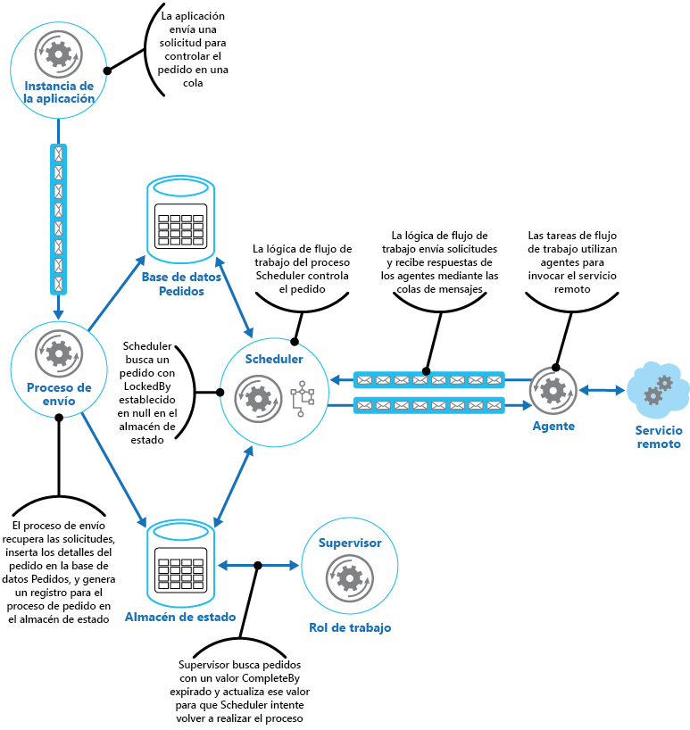

# Patrón Scheduler Agent SupervisorScheduler Agent Supervisor pattern

[!INCLUDE [header](../_includes/header.md)]

Coordine un conjunto de acciones distribuidas como una única operación.Coordinate a set of distributed actions as a single operation. Si se produce un error en cualquiera de las acciones, intente controlar de forma transparente los errores o deshaga el trabajo realizado para que la operación se realice o produzca un error de mantera integral.If any of the actions fail, try to handle the failures transparently, or else undo the work that was performed, so the entire operation succeeds or fails as a whole. De este modo se agrega resistencia al sistema distribuido y se permite que se recupere y que repita las acciones que produjeron errores duraderos, de proceso o a causa de excepciones transitorias.This can add resiliency to a distributed system, by enabling it to recover and retry actions that fail due to transient exceptions, long-lasting faults, and process failures.

## Contexto y problemaContext and problem

Una aplicación realiza tareas con una serie de pasos, algunos de los cuales podrían invocar servicios remotos o acceder a recursos remotos.An application performs tasks that include a number of steps, some of which might invoke remote services or access remote resources. Los pasos individuales podrían ser independientes entre sí, pero están organizados por la lógica de la aplicación que implementa la tarea.The individual steps might be independent of each other, but they are orchestrated by the application logic that implements the task.

Siempre que sea posible, la aplicación debe asegurarse de que la tarea se ejecuta por completo y resuelve los errores que puedan producirse al acceder a servicios o recursos remotos.Whenever possible, the application should ensure that the task runs to completion and resolve any failures that might occur when accessing remote services or resources. Pueden producirse errores por diversos motivos.Failures can occur for many reasons. Por ejemplo, la red podría estar inactiva o las comunicaciones, interrumpidas; un servicio remoto podría no responder o encontrarse en estado inestable; o un recurso remoto podría estar inaccesible temporalmente, quizás por restricciones.For example, the network might be down, communications could be interrupted, a remote service might be unresponsive or in an unstable state, or a remote resource might be temporarily inaccessible, perhaps due to resource constraints. En muchos casos, los errores serán transitorios y se podrán controlar mediante el [patrón Retry][retry-pattern].In many cases the failures will be transient and can be handled by using the [Retry pattern][retry-pattern].

Si la aplicación detecta un error más permanente o que no se puede recuperar fácilmente, debe ser capaz de restaurar el sistema a un estado coherente y garantizar la integridad de toda la operación.If the application detects a more permanent fault it can't easily recover from, it must be able to restore the system to a consistent state and ensure integrity of the entire operation.

## SoluciónSolution

El patrón Scheduler Agent Supervisor define los actores siguientes.The Scheduler Agent Supervisor pattern defines the following actors. Estos actores orquestan los pasos necesarios que se deben incluir como parte de la tarea global.These actors orchestrate the steps to be performed as part of the overall task.

- El componente **Scheduler** organiza la ejecución de los pasos que forman la tarea y orquesta su funcionamiento.The **Scheduler** arranges for the steps that make up the task to be executed and orchestrates their operation. Estos pasos se pueden combinar en una canalización o un flujo de trabajo.These steps can be combined into a pipeline or workflow. El componente Scheduler es responsable de garantizar que se realicen los pasos de este flujo de trabajo en el orden correcto.The Scheduler is responsible for ensuring that the steps in this workflow are performed in the right order. A medida que se realiza cada paso, el componente Scheduler registra el estado del flujo de trabajo, como "paso aún no iniciado", "paso en ejecución" o "paso completado".As each step is performed, the Scheduler records the state of the workflow, such as "step not yet started," "step running," or "step completed." La información de estado también debe incluir un límite superior de tiempo permitido para que finalice el paso, se denomina "tiempo de vigencia".The state information should also include an upper limit of the time allowed for the step to finish, called the complete-by time. Si un paso requiere acceso a un recurso o servicio remoto, el componente Scheduler invoca al componente Agent adecuado y le pasa los detalles del trabajo que se debe realizar.If a step requires access to a remote service or resource, the Scheduler invokes the appropriate Agent, passing it the details of the work to be performed. Normalmente, el componente Scheduler se comunica con un componente Agent a través de la mensajería de solicitud/respuesta asincrónica.The Scheduler typically communicates with an Agent using asynchronous request/response messaging. Esto se puede implementar mediante colas, aunque también se pueden usar otras tecnologías de mensajería distribuidas.This can be implemented using queues, although other distributed messaging technologies could be used instead.

    > El componente Scheduler realiza una función similar a la de Process Manager del [patrón Process Manager](http://www.enterpriseintegrationpatterns.com/patterns/messaging/ProcessManager.html).The Scheduler performs a similar function to the Process Manager in the [Process Manager pattern](http://www.enterpriseintegrationpatterns.com/patterns/messaging/ProcessManager.html). El flujo de trabajo real normalmente lo define e implementa un motor de flujo de trabajo que el componente Scheduler controla.The actual workflow is typically defined and implemented by a workflow engine that's controlled by the Scheduler. Este enfoque separa la lógica de negocios del flujo de trabajo del componente Scheduler.This approach decouples the business logic in the workflow from the Scheduler.

- El componente **Agent** contienen lógica que encapsula una llamada a un servicio remoto o acceso a un recurso remoto a los cuales hace referencia un paso de una tarea.The **Agent** contains logic that encapsulates a call to a remote service, or access to a remote resource referenced by a step in a task. Normalmente, cada componente Agent encapsula las llamadas a un único servicio o recurso, al implementar el control de errores y la lógica de reintento adecuados (de acuerdo con una restricción de tiempo de espera, que se describe más adelante).Each Agent typically wraps calls to a single service or resource, implementing the appropriate error handling and retry logic (subject to a timeout constraint, described later). Si los pasos del flujo de trabajo que ejecuta el componente Scheduler utilizan varios servicios y recursos en pasos diferentes, cada paso puede hacer referencia a una instancia de Agent diferente (es un detalle de implementación del patrón).If the steps in the workflow being run by the Scheduler use several services and resources across different steps, each step might reference a different Agent (this is an implementation detail of the pattern).

- **Supervisor** supervisa el estado de los pasos de la tarea que realiza el componente Scheduler.The **Supervisor** monitors the status of the steps in the task being performed by the Scheduler. Se ejecuta periódicamente (la frecuencia será específica del sistema) y examina el estado de pasos que mantiene el componente Scheduler.It runs periodically (the frequency will be system specific), and examines the status of steps maintained by the Scheduler. Si detecta alguno con tiempo de espera agotado o error, organiza la instancia de Agent adecuada para recuperar el paso o ejecutar la acción correctiva correspondiente (esto puede implicar modificar el estado de un paso).If it detects any that have timed out or failed, it arranges for the appropriate Agent to recover the step or execute the appropriate remedial action (this might involve modifying the status of a step). Tenga en cuenta que la recuperación o las acciones correctivas las implementan el componente Scheduler y el componente Agent.Note that the recovery or remedial actions are implemented by the Scheduler and Agents. El componente Supervisor solo tiene que solicitar que estas acciones se realicen.The Supervisor should simply request that these actions be performed.

Scheduler, Agent y Supervisor son componentes lógicos y su implementación física depende de la tecnología utilizada.The Scheduler, Agent, and Supervisor are logical components and their physical implementation depends on the technology being used. Por ejemplo, se pueden implementar varios agentes lógicos como parte de un servicio web.For example, several logical agents might be implemented as part of a single web service.

El componente Scheduler conserva la información sobre el progreso de la tarea y el estado de cada paso en un almacén de datos durable que se conoce como el almacén de estado.The Scheduler maintains information about the progress of the task and the state of each step in a durable data store, called the state store. El componente Supervisor puede utilizar esta información para ayudar a determinar si se produjo un error en un paso.The Supervisor can use this information to help determine whether a step has failed. En la ilustración se muestra la relación entre el componente Scheduler, los componentes Agent, el componente Supervisor y el almacén de estado.The figure illustrates the relationship between the Scheduler, the Agents, the Supervisor, and the state store.

> En este diagrama se muestra una versión simplificada del patrón.This diagram shows a simplified version of the pattern. En una implementación real, puede haber varias instancias del componente Scheduler que ejecuten un subconjunto de tareas distinto cada una al mismo tiempo.In a real implementation, there might be many instances of the Scheduler running concurrently, each a subset of tasks. De igual forma, el sistema puede ejecutar varias instancias de cada instancia del componente Agent, o incluso varias instancias del componente Supervisor.Similarly, the system could run multiple instances of each Agent, or even multiple Supervisors. En este caso, las instancias de Supervisor deben coordinar su trabajo entre ellos con atención para garantizar que no compiten por recuperar las mismas tareas y pasos con error.In this case, Supervisors must coordinate their work with each other carefully to ensure that they don’t compete to recover the same failed steps and tasks. El [patrón Leader Election](leader-election.md) proporciona una posible solución a este problema.The [Leader Election pattern](leader-election.md) provides one possible solution to this problem.

Cuando la aplicación está preparada ejecutar una tarea, envía una solicitud al componente Scheduler.When the application is ready to run a task, it submits a request to the Scheduler. El componente Scheduler registra la información de estado de la tarea y sus pasos (por ejemplo, paso aún no iniciado) en el almacén de estado e inicia las operaciones que se definieron en el flujo de trabajo.The Scheduler records initial state information about the task and its steps (for example, step not yet started) in the state store and then starts performing the operations defined by the workflow. Al iniciar cada paso, el componente Scheduler actualiza la información de estado del paso en el almacén de estado (por ejemplo, paso en ejecución).As the Scheduler starts each step, it updates the information about the state of that step in the state store (for example, step running).

Si un paso hace referencia a un servicio o recurso remoto, el componente Scheduler envía un mensaje al componente Agent adecuado.If a step references a remote service or resource, the Scheduler sends a message to the appropriate Agent. El mensaje contiene la información que el componente Agent necesita para pasarla al servicio o acceder al recurso, además del tiempo de vigencia de la operación.The message contains the information that the Agent needs to pass to the service or access the resource, in addition to the complete-by time for the operation. Si el componente Agent completa la operación correctamente, devuelve una respuesta al componente Scheduler.If the Agent completes its operation successfully, it returns a response to the Scheduler. Entonces, el componente Scheduler actualiza la información de estado en el almacén de estado (por ejemplo, paso completado) y realiza el paso siguiente.The Scheduler can then update the state information in the state store (for example, step completed) and perform the next step. Este proceso continúa hasta que la tarea se haya completado.This process continues until the entire task is complete.

El componente Agent puede implementar cualquier lógica de reintento necesaria para realizar su trabajo.An Agent can implement any retry logic that's necessary to perform its work. Sin embargo, si el componente Agent no completa su trabajo antes de que expire el tiempo de vigencia, el componente Scheduler presupone que se ha producido un error en la operación.However, if the Agent doesn't complete its work before the complete-by period expires, the Scheduler will assume that the operation has failed. En este caso, el componente Agent debe detener su trabajo y no intentar devolver nada a Scheduler (ni siquiera un mensaje de error), ni tampoco intentar cualquier forma de recuperación.In this case, the Agent should stop its work and not try to return anything to the Scheduler (not even an error message), or try any form of recovery. La razón de esta restricción es que, cuando se agota el tiempo de espera de un paso o este último produce un error, otra instancia de Agent puede programarse para ejecutar el paso con error (este proceso se describe después).The reason for this restriction is that, after a step has timed out or failed, another instance of the Agent might be scheduled to run the failing step (this process is described later).

Si se produce un error en la instancia del componente Agent, el componente Scheduler no recibirá respuesta.If the Agent fails, the Scheduler won't receive a response. El patrón no distingue entre un paso cuyo tiempo de espera se haya agotado y otro que haya producido un error real.The pattern doesn't make a distinction between a step that has timed out and one that has genuinely failed.

Si se agota el tiempo de espera de un paso o este produce un error, el almacén de estado contendrá un registro que indique que el paso está en ejecución, pero que su tiempo de vigencia ha expirado.If a step times out or fails, the state store will contain a record that indicates that the step is running, but the complete-by time will have passed. Supervisor busca este tipo de pasos y los intenta recuperar.The Supervisor looks for steps like this and tries to recover them. Una posible estrategia es que el componente Supervisor actualice el valor de vigencia para aumentar el tiempo disponible para completar el paso y que envíe un mensaje al componente Scheduler con la identificación del paso cuyo tiempo de espera se ha agotado. Entonces, el componente Scheduler intentará repetir el paso.One possible strategy is for the Supervisor to update the complete-by value to extend the time available to complete the step, and then send a message to the Scheduler identifying the step that has timed out. The Scheduler can then try to repeat this step. Sin embargo, este diseño requiere que las tareas sean idempotentes.However, this design requires the tasks to be idempotent.

Puede que el componente Supervisor necesite impedir que se intente realizar el mismo paso, en caso de que produzca errores o su tiempo de espera se agote continuamente. Para ello, el componente Supervisor puede conservar un recuento de reintentos de los pasos junto con la información de estado en el almacén de estado.The Supervisor might need to prevent the same step from being retried if it continually fails or times out. To do this, the Supervisor could maintain a retry count for each step, along with the state information, in the state store. Si este número supera un umbral predefinido, el componente Supervisor adopta una estrategia de espera durante un tiempo prolongado antes de notificar al componente Scheduler que debe reintentar el paso, con la expectativa de que el error se resuelva durante este tiempo.If this count exceeds a predefined threshold the Supervisor can adopt a strategy of waiting for an extended period before notifying the Scheduler that it should retry the step, in the expectation that the fault will be resolved during this period. Como alternativa, el componente Supervisor puede enviar un mensaje al componente Scheduler para solicitar que se deshaga toda la tarea mediante la implementación de un [patrón Compensating Transaction](compensating-transaction.md).Alternatively, the Supervisor can send a message to the Scheduler to request the entire task be undone by implementing a [Compensating Transaction pattern](compensating-transaction.md). Este enfoque dependerá de que el componente Scheduler y las instancias del componente Agent proporcionen la información necesaria para implementar las operaciones de compensación para cada paso que se completara correctamente.This approach will depend on the Scheduler and Agents providing the information necessary to implement the compensating operations for each step that completed successfully.

> El componente Supervisor no está diseñado para supervisar el componente Scheduler y las instancias del componente Agent y reiniciarlos si se produce un error.It isn't the purpose of the Supervisor to monitor the Scheduler and Agents, and restart them if they fail. Este aspecto del sistema debe controlarse desde la infraestructura donde se ejecutan estos componentes.This aspect of the system should be handled by the infrastructure these components are running in. De forma similar, el componente Supervisor no debería conocer las operaciones empresariales reales que ejecutan las tareas del componente Scheduler (incluida la compensación en caso de error en estas tareas).Similarly, the Supervisor shouldn't have knowledge of the actual business operations that the tasks being performed by the Scheduler are running (including how to compensate should these tasks fail). De esto se ocupa la lógica del flujo de trabajo que implementó el componente Scheduler.This is the purpose of the workflow logic implemented by the Scheduler. La única responsabilidad del componente Supervisor consiste en determinar si se ha producido un error en un paso y organizarlo para que se repita o para que la tarea que contenga el paso con error se deshaga.The sole responsibility of the Supervisor is to determine whether a step has failed and arrange either for it to be repeated or for the entire task containing the failed step to be undone.

Si el componente Scheduler se reinicia tras un error o si su flujo de trabajo en ejecución finaliza inesperadamente, el componente Scheduler debe ser capaz de determinar el estado de las tareas en proceso que estaba controlando cuando se produjo el error y estar preparado para reanudarlas desde ese punto.If the Scheduler is restarted after a failure, or the workflow being performed by the Scheduler terminates unexpectedly, the Scheduler should be able to determine the status of any inflight task that it was handling when it failed, and be prepared to resume this task from that point. Los detalles de la implementación de este proceso suelen ser específicas del sistema.The implementation details of this process are likely to be system specific. Si no se puede recuperar la tarea, podría ser necesario deshacer el trabajo que la tarea ya haya realizado.If the task can't be recovered, it might be necessary to undo the work already performed by the task. También podría ser necesario implementar un patrón [Compensating Transaction](compensating-transaction.md).This might also require implementing a [compensating transaction](compensating-transaction.md).

La principal ventaja de este patrón es que el sistema es resistente a errores temporales inesperados o irrecuperables.The key advantage of this pattern is that the system is resilient in the event of unexpected temporary or unrecoverable failures. El sistema se puede construir para que se repare automáticamente.The system can be constructed to be self healing. Por ejemplo, si se produce un error en una instancia de Agent o Scheduler, se puede iniciar otra y Supervisor puede organizar la reanudación de una tarea.For example, if an Agent or the Scheduler fails, a new one can be started and the Supervisor can arrange for a task to be resumed. Si se produce un error en la instancia de Supervisor, otra puede iniciarse y retomarlo desde ese punto.If the Supervisor fails, another instance can be started and can take over from where the failure occurred. Si la instancia de Supervisor está programada para ejecutarse periódicamente, se puede iniciar automáticamente una nueva después de un intervalo predefinido.If the Supervisor is scheduled to run periodically, a new instance can be automatically started after a predefined interval. El almacén de estado se puede replicar hasta alcanzar un mayor grado de resistencia.The state store can be replicated to reach an even greater degree of resiliency.

## Problemas y consideracionesIssues and considerations

A la hora de decidir cómo implementar este patrón, debe considerar los siguientes puntos:You should consider the following points when deciding how to implement this pattern:

- Este patrón puede ser difícil de implementar y requiere una comprobación exhaustiva de los posibles modos de error del sistema.This pattern can be difficult to implement and requires thorough testing of each possible failure mode of the system.

- La lógica de recuperación/reintento implementada por Scheduler es compleja y depende de la información de estado que se conserva en el almacén de estado.The recovery/retry logic implemented by the Scheduler is complex and dependent on state information held in the state store. También podría ser necesario registrar la información de implementación de una transacción de compensación en un almacén de datos durables.It might also be necessary to record the information required to implement a compensating transaction in a durable data store.

- La frecuencia de ejecución de Supervisor es importante.How often the Supervisor runs will be important. Debe ejecutarse con la frecuencia suficiente como para evitar que los pasos con error bloqueen una aplicación durante mucho tiempo, pero no demasiada como para sobrecargar.It should run often enough to prevent any failed steps from blocking an application for an extended period, but it shouldn't run so often that it becomes an overhead.

- Los pasos que realiza una instancia de Agent pueden ejecutarse más de una vez.The steps performed by an Agent could be run more than once. La lógica que implementa estos pasos debe ser idempotente.The logic that implements these steps should be idempotent.

## Cuándo usar este patrónWhen to use this pattern

Utilice este patrón cuando un proceso que se ejecuta en un entorno distribuido, como la nube, debe ser resistente a los errores de comunicación u operativos.Use this pattern when a process that runs in a distributed environment, such as the cloud, must be resilient to communications failure and/or operational failure.

Este patrón puede no ser adecuado para las tareas que no invocan servicios remotos o acceden a recursos remotos.This pattern might not be suitable for tasks that don't invoke remote services or access remote resources.

## EjemploExample

Una aplicación web que implementa un sistema de comercio electrónico se ha implementado en Microsoft Azure.A web application that implements an ecommerce system has been deployed on Microsoft Azure. Los usuarios pueden ejecutar esta aplicación para examinar los productos disponibles y realizar pedidos.Users can run this application to browse the available products and to place orders. La interfaz de usuario se ejecuta como un rol web y los elementos de procesamiento de pedidos de la aplicación se implementan como conjunto de roles de trabajo.The user interface runs as a web role, and the order processing elements of the application are implemented as a set of worker roles. Parte de la lógica de procesamiento de pedidos implica el acceso a un servicio remoto y este aspecto del sistema podría ser propenso a errores transitorios o más duraderos.Part of the order processing logic involves accessing a remote service, and this aspect of the system could be prone to transient or more long-lasting faults. Por este motivo, los diseñadores utilizaron el patrón Scheduler Agent Supervisor para implementar los elementos de procesamiento de pedidos del sistema.For this reason, the designers used the Scheduler Agent Supervisor pattern to implement the order processing elements of the system.

Cuando un cliente realiza un pedido, la aplicación construye un mensaje que lo describe y envía este mensaje a una cola.When a customer places an order, the application constructs a message that describes the order and posts this message to a queue. Un proceso de envío independiente, que se ejecuta en un rol de trabajo, recupera el mensaje, inserta los detalles del pedido en la base de datos de pedidos y crea un registro para el proceso de pedido en el almacén de estado.A separate submission process, running in a worker role, retrieves the message, inserts the order details into the orders database, and creates a record for the order process in the state store. Tenga en cuenta que las inserciones en la base de datos de pedidos y el almacén de estado se realizan como parte de la misma operación.Note that the inserts into the orders database and the state store are performed as part of the same operation. El proceso de envío está diseñado para garantizar que ambas inserciones se realizan juntas.The submission process is designed to ensure that both inserts complete together.

La información de estado que crea el proceso de envío para el pedido incluye:The state information that the submission process creates for the order includes:

- **OrderID**.**OrderID**. Identificador del pedido en la base de datos de pedidos.The ID of the order in the orders database.

- **LockedBy**.**LockedBy**. Identificador de la instancia del rol de trabajo que controla el pedido.The instance ID of the worker role handling the order. Puede haber varias instancias actuales del rol de trabajo que ejecuten la instancia de Scheduler, pero solo una controla el pedido.There might be multiple current instances of the worker role running the Scheduler, but each order should only be handled by a single instance.

- **CompleteBy**.**CompleteBy**. Tiempo en el que se debe procesar el pedido.The time the order should be processed by.

- **ProcessState**.**ProcessState**. Estado actual de la tarea de control del pedido.The current state of the task handling the order. Los estados posibles son:The possible states are:

    - **Pending**.**Pending**. El pedido se ha creado, pero aún no se ha iniciado el procesamiento.The order has been created but processing hasn't yet been started.
    - **Processing**.**Processing**. El pedido se está procesando en este momento.The order is currently being processed.
    - **Processed**.**Processed**. El pedido se ha procesado correctamente.The order has been processed successfully.
    - **Error**.**Error**. Se ha producido un error en el procesamiento del pedido.The order processing has failed.

- **FailureCount**.**FailureCount**. Número de veces que se ha intentado procesar el pedido.The number of times that processing has been tried for the order.

En esta información de estado, el campo `OrderID` se copia desde el identificador de pedido del pedido nuevo.In this state information, the `OrderID` field is copied from the order ID of the new order. Los campos `LockedBy` y `CompleteBy` están establecidos en `null`, el campo `ProcessState`, en `Pending` y el campo `FailureCount`, en 0.The `LockedBy` and `CompleteBy` fields are set to `null`, the `ProcessState` field is set to `Pending`, and the `FailureCount` field is set to 0.

> En este ejemplo, la lógica de control de pedidos es relativamente sencilla y solo tiene un único paso que invoca un servicio remoto.In this example, the order handling logic is relatively simple and only has a single step that invokes a remote service. En un escenario de varios pasos más complejo, el proceso de envío puede implicar varios pasos, por lo que se crearán varios registros en el almacén de estado, que describirán cada uno el estado de un paso.In a more complex multistep scenario, the submission process would likely involve several steps, and so several records would be created in the state store—each one describing the state of an individual step.

Scheduler también se ejecuta como parte de un rol de trabajo e implementa la lógica de negocios que controla el pedido.The Scheduler also runs as part of a worker role and implements the business logic that handles the order. Una instancia de Scheduler que sondea nuevos pedidos examina el almacén de estado en busca de los registros donde el valor del campo `LockedBy` sea Null, mientras que el del campo `ProcessState` sea Pending.An instance of the Scheduler polling for new orders examines the state store for records where the `LockedBy` field is null and the `ProcessState` field is pending. Cuando Scheduler encuentra un nuevo pedido, inmediatamente rellena el campo `LockedBy` con su propio identificador de instancia, establece el campo `CompleteBy` en la hora adecuada y el campo `ProcessState` en Processing.When the Scheduler finds a new order, it immediately populates the `LockedBy` field with its own instance ID, sets the `CompleteBy` field to an appropriate time, and sets the `ProcessState` field to processing. El código está diseñado como exclusivo y atómico para garantizar que dos instancias simultáneas de Scheduler no pueden controlar el mismo pedido a la vez.The code is designed to be exclusive and atomic to ensure that two concurrent instances of the Scheduler can't try to handle the same order simultaneously.

A continuación, Scheduler ejecuta el flujo de trabajo empresarial para procesar el pedido de forma asincrónica, al pasar el valor del campo `OrderID` del almacén de estado.The Scheduler then runs the business workflow to process the order asynchronously, passing it the value in the `OrderID` field from the state store. El flujo de trabajo que controla el pedido recupera los detalles de este de la base de datos de pedidos y realiza su trabajo.The workflow handling the order retrieves the details of the order from the orders database and performs its work. Cuando un paso del flujo de trabajo de procesamiento del pedido necesita invocar el servicio remoto, utiliza una instancia de Agent.When a step in the order processing workflow needs to invoke the remote service, it uses an Agent. El paso del flujo de trabajo se comunica con Agent mediante un par de colas de mensajes de Azure Service Bus que actúan como canal de solicitud/respuesta.The workflow step communicates with the Agent using a pair of Azure Service Bus message queues acting as a request/response channel. En la ilustración se muestra una vista de alto nivel de la solución.The figure shows a high level view of the solution.

El mensaje enviado a la instancia de Agent desde un paso del flujo de trabajo describe el pedido e incluye el tiempo de vigencia.The message sent to the Agent from a workflow step describes the order and includes the complete-by time. Si Agent recibe respuesta desde el servicio remoto antes de que expire el tiempo de vigencia, envía un mensaje de respuesta a la cola de Service Bus donde escucha el flujo de trabajo.If the Agent receives a response from the remote service before the complete-by time expires, it posts a reply message on the Service Bus queue on which the workflow is listening. Cuando el paso del flujo de trabajo recibe el mensaje de respuesta válido, completa el procesamiento y Scheduler establece el campo "ProcessState" del estado de pedido en Processed.When the workflow step receives the valid reply message, it completes its processing and the Scheduler sets the \`ProcessState field of the order state to processed. En este momento, el procesamiento del pedido se ha completado correctamente.At this point, the order processing has completed successfully.

Si el tiempo de vigencia expira antes de que Agent reciba respuesta del servicio remoto, la instancia simplemente detiene el procesamiento y deja de controlar el pedido.If the complete-by time expires before the Agent receives a response from the remote service, the Agent simply halts its processing and terminates handling the order. De forma similar, si el flujo de trabajo que controla el pedido supera el tiempo de vigencia, también termina.Similarly, if the workflow handling the order exceeds the complete-by time, it also terminates. En ambos casos, el estado del pedido en el almacén de estado sigue como Processing, pero el tiempo de vigencia indica que ha transcurrido el tiempo de procesamiento del pedido y se considera que se ha producido un error.In both cases, the state of the order in the state store remains set to processing, but the complete-by time indicates that the time for processing the order has passed and the process is deemed to have failed. Tenga en cuenta que si la instancia de Agent que accede al servicio remoto o el flujo de trabajo que controla el pedido finalizan inesperadamente, la información del almacén de estado permanecerá como Processing y finalmente tendrá un valor de tiempo de vigencia expirado.Note that if the Agent that's accessing the remote service, or the workflow that's handling the order (or both) terminate unexpectedly, the information in the state store will again remain set to processing and eventually will have an expired complete-by value.

Si Agent detecta un error irrecuperable y permanente al intentar ponerse en contacto con el servicio remoto, puede enviar una respuesta de error al flujo de trabajo.If the Agent detects an unrecoverable, nontransient fault while it's trying to contact the remote service, it can send an error response back to the workflow. Scheduler puede establecer el estado del pedido en Error y generar un evento que avise a un operador.The Scheduler can set the status of the order to error and raise an event that alerts an operator. Entonces, el operador puede intentar resolver manualmente la causa del error y volver a enviar el paso de procesamiento con error.The operator can then try to resolve the reason for the failure manually and resubmit the failed processing step.

Supervisor examina periódicamente el almacén de estado en busca de pedidos con valor de tiempo de vigencia expirado.The Supervisor periodically examines the state store looking for orders with an expired complete-by value. Si encuentra un registro, incrementa el campo `FailureCount`.If the Supervisor finds a record, it increments the `FailureCount` field. Si el valor de FailureCount está por debajo de un umbral determinado, Supervisor restablece el campo `LockedBy` en Null, actualiza el campo `CompleteBy` con un nuevo tiempo de vigencia y establece el campo `ProcessState` en Pending.If the failure count value is below a specified threshold value, the Supervisor resets the `LockedBy` field to null, updates the `CompleteBy` field with a new expiration time, and sets the `ProcessState` field to pending. Una instancia de Scheduler puede recoger este pedido y procesarlo como antes.An instance of the Scheduler can pick up this order and perform its processing as before. Si el valor de FailureCount supera un umbral determinado, se presupone que el error no es transitorio.If the failure count value exceeds a specified threshold, the reason for the failure is assumed to be nontransient. Supervisor establece el estado del pedido en Error y genera un evento que avisa a un operador.The Supervisor sets the status of the order to error and raises an event that alerts an operator.

> En este ejemplo, la instancia de Supervisor se implementa en un rol de trabajo independiente.In this example, the Supervisor is implemented in a separate worker role. Puede usar una variedad de estrategias para organizar la ejecución de la tarea de Supervisor, como el servicio Azure Scheduler (que no debe confundirse con el componente Scheduler de este patrón).You can use a variety of strategies to arrange for the Supervisor task to be run, including using the Azure Scheduler service (not to be confused with the Scheduler component in this pattern). Para obtener más información sobre el servicio Azure Scheduler, visite la página de [Scheduler](https://azure.microsoft.com/services/scheduler/).For more information about the Azure Scheduler service, visit the [Scheduler](https://azure.microsoft.com/services/scheduler/) page.

Aunque no se muestra en este ejemplo, Scheduler puede necesitar mantener informada a la aplicación que envió el pedido sobre el progreso y el estado de este.Although it isn't shown in this example, the Scheduler might need to keep the application that submitted the order informed about the progress and status of the order. La aplicación y Scheduler están aislados entre ellos para que no dependan el uno del otro.The application and the Scheduler are isolated from each other to eliminate any dependencies between them. La aplicación no sabe qué instancia de Scheduler controla el pedido y Scheduler desconoce la instancia de aplicación que lo envió.The application has no knowledge of which instance of the Scheduler is handling the order, and the Scheduler is unaware of which specific application instance posted the order.

Para permitir informar del estado del pedido, la aplicación puede usar su propia cola de respuestas privada.To allow the order status to be reported, the application could use its own private response queue. Los detalles de esta cola de respuestas se incluiría como parte de la solicitud al proceso de envío, que incluiría esta información en el almacén de estado.The details of this response queue would be included as part of the request sent to the submission process, which would include this information in the state store. Scheduler publicaría mensajes en esta cola que indicaran el estado del pedido (solicitud recibida, pedido completado, error en el pedido, etc.).The Scheduler would then post messages to this queue indicating the status of the order (request received, order completed, order failed, and so on). En estos mensajes debe incluirse el identificador de pedido para que la aplicación los pueda correlacionar con la solicitud original.It should include the order ID in these messages so they can be correlated with the original request by the application.

## Orientación y patrones relacionadosRelated patterns and guidance

Los patrones y las directrices siguientes también pueden ser importantes a la hora de implementar este modelo:The following patterns and guidance might also be relevant when implementing this pattern:
- [Patrón Retry][retry-pattern].[Retry pattern][retry-pattern]. Las instancias de Agent pueden usar este patrón para reintentar una operación con acceso a un servicio o recurso remoto que haya producido un error previamente de forma transparente.An Agent can use this pattern to transparently retry an operation that accesses a remote service or resource that has previously failed. Se utiliza cuando se cree que la causa del error es transitoria y se puede corregir.Use when the expectation is that the cause of the failure is transient and can be corrected.
- [Patrón Circuit Breaker](circuit-breaker.md).[Circuit Breaker pattern](circuit-breaker.md). Una instancia de Agent puede utilizar este patrón para controlar errores que tardan un tiempo variable en solucionarse durante la conexión a un recurso o servicio remoto.An Agent can use this pattern to handle faults that take a variable amount of time to correct when connecting to a remote service or resource.
- [Patrón Compensating Transaction](compensating-transaction.md).[Compensating Transaction pattern](compensating-transaction.md). Si el flujo de trabajo que realiza una instancia de Scheduler no se puede completar correctamente, podría ser necesario deshacer el trabajo anterior.If the workflow being performed by a Scheduler can't be completed successfully, it might be necessary to undo any work it's previously performed. El patrón Compensating Transaction describe la manera de lograrlo para las operaciones que siguen el modelo de coherencia final.The Compensating Transaction pattern describes how this can be achieved for operations that follow the eventual consistency model. Estos tipos de operaciones las implementa normalmente una instancia de Scheduler que realiza flujos de trabajo y procesos empresariales complejos.These types of operations are commonly implemented by a Scheduler that performs complex business processes and workflows.
- [Manual de mensajería asincrónica](https://msdn.microsoft.com/library/dn589781.aspx).[Asynchronous Messaging Primer](https://msdn.microsoft.com/library/dn589781.aspx). En general, los componentes del patrón Scheduler Agent Supervisor se ejecutan desacoplados entre ellos y se comunican de forma asincrónica.The components in the Scheduler Agent Supervisor pattern typically run decoupled from each other and communicate asynchronously. Describe algunos de los posibles enfoques para implementar la comunicación asincrónica basada en colas de mensajes.Describes some of the approaches that can be used to implement asynchronous communication based on message queues.
- [Patrón Leader Election](leader-election.md).[Leader Election pattern](leader-election.md). Podría ser necesario coordinar las acciones de varias instancias de Supervisor para impedir que intenten recuperar el mismo proceso con error.It might be necessary to coordinate the actions of multiple instances of a Supervisor to prevent them from attempting to recover the same failed process. El patrón Leader Election describe cómo hacerlo.The Leader Election pattern describes how to do this.
- [Cloud Architecture: The Scheduler-Agent-Supervisor Pattern](https://blogs.msdn.microsoft.com/clemensv/2010/09/27/cloud-architecture-the-scheduler-agent-supervisor-pattern/) (Arquitectura en la nube: patrón Scheduler-Agent-Supervisor) en el blog de Clemens Vasters[Cloud Architecture: The Scheduler-Agent-Supervisor Pattern](https://blogs.msdn.microsoft.com/clemensv/2010/09/27/cloud-architecture-the-scheduler-agent-supervisor-pattern/) on Clemens Vasters' blog
- [Patrón Process ManagerProcess Manager pattern](http://www.enterpriseintegrationpatterns.com/patterns/messaging/ProcessManager.html)
- [Reference 6: A Saga on Sagas](https://msdn.microsoft.com/library/jj591569.aspx) (Referencia 6: una saga sobre sagas).[Reference 6: A Saga on Sagas](https://msdn.microsoft.com/library/jj591569.aspx). Ejemplo que muestra el uso de un administrador de procesos por el patrón CQRS (parte de la guía de viaje de CQRS).An example showing how the CQRS pattern uses a process manager (part of the CQRS Journey guidance).
- [Microsoft Azure SchedulerMicrosoft Azure Scheduler](https://azure.microsoft.com/services/scheduler/)

[retry-pattern]: ./retry.md
