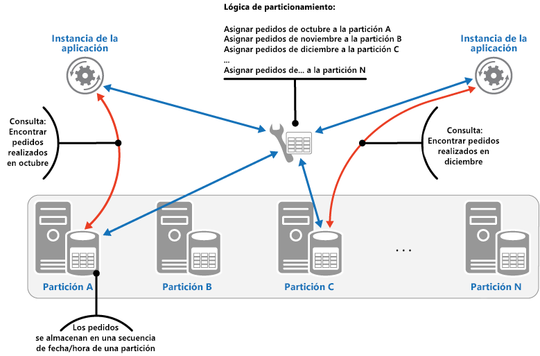
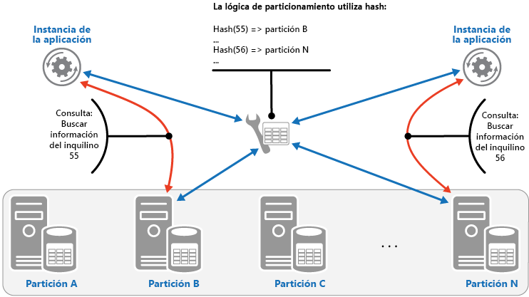

# <a name="sharding-pattern"></a>Patrón de particionamiento

[!INCLUDE [header](../_includes/header.md)]

Divida un almacén de datos en un conjunto de particiones horizontales o particiones de base de datos. Esta acción puede mejorar la escalabilidad durante el almacenamiento de grandes volúmenes de datos y el acceso a estos.

## <a name="context-and-problem"></a>Contexto y problema

Un almacén de datos hospedado por un único servidor puede estar sujeto a las siguientes limitaciones:

- **Espacio de almacenamiento**. Se espera que un almacén de datos para una aplicación a gran escala en la nube contenga un gran volumen de datos que puede aumentar considerablemente con el tiempo. Normalmente, un servidor proporciona una cantidad finita de almacenamiento en disco, pero puede reemplazar los discos existentes por otros más grandes, o agregar más discos a una máquina a medida que los volúmenes de datos crezcan. Sin embargo, es posible que el sistema alcance un límite a partir del cual no sea posible aumentar fácilmente la capacidad de almacenamiento en un determinado servidor.

- **Recursos de computación**. Una aplicación en la nube es necesaria para dar soporte a un gran número de usuarios simultáneos, cada uno de los cuales ejecuta consultas que recuperan información del almacén de datos. Un solo servidor que hospede el almacén de datos podría no ser capaz de proporcionar la capacidad de computación necesaria para admitir esta carga, lo que generaría tiempos de respuesta prolongados para usuarios y errores frecuentes, como que se agote el tiempo de espera de aplicaciones que intentan almacenar y recuperar datos. Es posible agregar memoria o actualizar los procesadores, pero el sistema alcanzará un límite que no permitirá aumentar más los recursos de procesos.

- **Ancho de banda de red**. En última instancia, el rendimiento de un almacén de datos que se ejecuta en un solo servidor se rige por la velocidad a la que el servidor puede recibir solicitudes y enviar respuestas. Es posible que el volumen del tráfico de red supere la capacidad de la red que se usa para establecer conexión con el servidor y dé lugar a solicitudes incorrectas.

- **Geografía**. Puede que sea necesario almacenar los datos generados por determinados usuarios en la misma región que esos usuarios por motivos legales, de rendimiento o de cumplimiento, o bien para reducir la latencia del acceso a los datos. Si los usuarios están dispersos en diferentes países o regiones, puede que no sea posible almacenar todos los datos de la aplicación en un único almacén de datos.

El escalado vertical mediante la adición de más capacidad de disco, capacidad de procesamiento, memoria y conexiones de red puede posponer los efectos de algunas de estas limitaciones, pero es probable que solo sea una solución temporal. Una aplicación en la nube comercial que sea capaz de admitir un gran número de usuarios y grandes volúmenes de datos debería poder escalarse casi indefinidamente, por lo que el escalado vertical no es necesariamente la mejor solución.

## <a name="solution"></a>Solución

Dividir el almacén de datos en particiones horizontales o particiones de base de datos. Cada partición tiene el mismo esquema, pero contiene su propio subconjunto distinto de datos. Una partición es un almacén de datos en sí misma (puede incluir datos de varias entidades de tipos diferentes), que se ejecuta en un servidor que actúa como nodo de almacenamiento.

Este modelo proporciona las siguientes ventajas:

- Puede escalar el sistema horizontalmente mediante la adición de más particiones que se ejecuten en nodos de almacenamiento adicionales.

- Un sistema puede utilizar hardware estándar en lugar de equipos especializados y costosos para cada nodo de almacenamiento.

- Puede reducir la contención y mejorar el rendimiento si equilibra la carga de trabajo entre las particiones.

- En la nube, las particiones pueden encontrarse físicamente cerca de los usuarios que accederán a los datos.

Al dividir un almacén de datos en particiones, deberá decidir qué datos se colocarán en cada partición. Normalmente, una partición contiene elementos que se encuentran dentro de un determinado rango, determinado por uno o más atributos de los datos. Estos atributos constituyen la clave de partición, que debe ser estática y no debe basarse en datos que puedan cambiar.

El particionamiento organiza físicamente los datos. Cuando una aplicación almacena y recupera los datos, la lógica de particionamiento dirige la aplicación a la partición apropiada. Esta lógica de particionamiento se puede implementar como parte del código de acceso a datos de la aplicación, o podría implementarla el sistema de almacenamiento de datos si admite el particionamiento de forma transparente.

La abstracción de la ubicación física de los datos en la lógica de particionamiento proporciona un alto nivel de control sobre qué particiones contienen determinados datos. También permite que los datos se migren entre las particiones sin tener que rediseñar la lógica de negocios de una aplicación si los datos de las particiones se deben redistribuir más adelante (por ejemplo, si las particiones se desequilibran). La contrapartida es la sobrecarga adicional de acceso a los datos que se necesita para determinar la ubicación de cada elemento de datos a medida que se recupera.

Para asegurar una escalabilidad y un rendimiento óptimos, es importante dividir los datos de una forma adecuada para los tipos de consultas que realiza la aplicación. En muchos casos, es improbable que el esquema de particionamiento coincida exactamente con los requisitos de cada consulta. Por ejemplo, en un sistema multiinquilino, una aplicación podría necesitar recuperar datos del inquilino mediante su identificador, pero también puede que se necesiten buscar estos datos en función de algún otro atributo, como el nombre o la ubicación del inquilino. Para tratar estas situaciones, implemente una estrategia de particionamiento con una clave de partición que admita las consultas que se realizan más frecuentemente.

Si las consultas recuperan datos regularmente mediante una combinación de valores de atributo, es probable que pueda definir una clave de partición compuesta mediante la vinculación de atributos. Como alternativa, use un patrón como el [Patrón Index Table](./index-table.md) para proporcionar una búsqueda rápida de datos basada en los atributos que no cubre la clave de partición.

## <a name="sharding-strategies"></a>Estrategias de particionamiento

Se suelen usar tres estrategias a la hora de seleccionar la clave de partición y decidir cómo distribuir los datos entre particiones. Tenga en cuenta que no tiene que haber una correspondencia exacta entre las particiones y los servidores que las alojan (un único servidor puede alojar varias particiones). Las estrategias son:

**Estrategia de búsqueda**. En esta estrategia, la lógica de particionamiento implementa un mapa que enruta una solicitud de datos a la partición que contiene los datos mediante la clave de partición. En una aplicación multiinquilino, todos los datos de un inquilino podrían almacenarse de forma conjunta en una partición con el identificador de inquilino como clave de partición. Varios inquilinos pueden compartir la misma partición, pero los datos de un único inquilino no se distribuirán entre varias particiones. En la ilustración se muestran los datos de inquilinos de particionamiento según los identificadores de inquilino.

   

La asignación entre la clave de partición y el almacenamiento físico puede basarse en particiones físicas donde cada clave de partición se asigna a una partición física. O bien, una técnica más flexible para reequilibrar particiones es el particionamiento virtual, donde las claves de partición se asignan al mismo número de particiones virtuales, que a su vez se asignan a menos particiones físicas. En este enfoque, una aplicación busca datos con una clave de partición que hace referencia a una partición virtual, y el sistema asigna de forma transparente particiones virtuales a particiones físicas. La asignación entre una partición virtual y una partición física puede cambiar sin necesidad de modificar el código de la aplicación para usar un conjunto diferente de claves de partición.

**Estrategia de rango**. Esta estrategia agrupa los elementos relacionados en la misma partición y los ordena por clave de partición (las claves de partición son secuenciales). Esto es útil para aplicaciones que suelen recuperar conjuntos de elementos mediante consultas por rango (consultas que devuelven un conjunto de elementos de datos de una clave de partición que se encuentra dentro de un rango determinado). Por ejemplo, si una aplicación suele necesitar buscar todos los pedidos realizados en un determinado mes, estos datos puede recuperarse más rápidamente si todos los pedidos de un mes se almacenan por orden de fecha y hora en la misma partición. Si cada uno de los pedido se almacena en una partición diferente, tendrán que recuperarse individualmente mediante la realización de un gran número de consultas de punto (consultas que devuelven un único elemento de datos). En la siguiente ilustración se muestra cómo se almacenan conjuntos secuenciales (rangos) de datos en particiones.

   

En este ejemplo, la clave de partición es una clave compuesta que contiene el mes del pedido como el elemento más significativo, seguido por el día y la hora del pedido. Naturalmente, los datos de los pedidos se ordenan cuando se crean nuevos pedidos y se agregan a una partición. Algunos almacenes de datos admiten claves de partición con dos partes: un elemento de clave de partición que identifica la partición y una clave de fila que identifica de forma única un elemento de la partición. Los datos suelen ordenarse por la clave de fila en la partición. Los elementos que están sujetos a las consultas por rango y necesitan agruparse pueden usar una clave de partición con el mismo valor para la clave de partición, pero un valor único para la clave de fila.

**Estrategia de hash**. El propósito de esta estrategia es reducir la posibilidad de zonas activas (particiones que reciben una cantidad desproporcionada de carga). Distribuye los datos entre las particiones de forma que se consigue un equilibrio entre el tamaño de cada partición y la carga media que tendrá cada partición. La lógica de particionamiento calcula la partición para almacenar un elemento en función de un hash de uno o más atributos de los datos. La función de hash elegida debe distribuir los datos uniformemente entre las particiones, posiblemente mediante la introducción de algún elemento aleatorio en el cálculo. En la ilustración siguiente se muestran los datos del inquilino de particionamiento basados en un hash de identificadores de inquilino.

   

Para entender la ventaja de la estrategia de hash con respecto a otras estrategias de particionamiento, considere cómo una aplicación multiinquilino que inscribe nuevos inquilinos secuencialmente podría asignar los inquilinos a las particiones en el almacén de datos. A la hora de usar la estrategia de rango, los datos de los inquilinos de 1 a n se almacenarán en la partición A, los datos de los inquilinos de n+1 a m se almacenarán en la partición B, y así sucesivamente. Si los inquilinos registrados más recientemente también son los más activos, la mayoría de la actividad de los datos se producirá en un pequeño número de particiones, lo que podría provocar zonas activas. En cambio, la estrategia de hash asigna los inquilinos a particiones basándose en un hash de su identificador de inquilino. Esto significa que es más probable que los inquilinos secuenciales se asignen a particiones diferentes, lo que permitirá distribuir la carga entre ellos. En la ilustración anterior se muestra cómo hacerlo para los inquilinos 55 y 56.

Las tres estrategias de particionamiento tienen las siguientes ventajas y consideraciones:

- **Búsqueda**. Ofrece un mayor control sobre la manera en la que se configuran y se utilizan las particiones. El uso de particiones virtuales reduce el impacto a la hora de reequilibrar los datos porque se pueden agregar nuevas particiones físicas para igualar la carga de trabajo. La asignación entre una partición virtual y las particiones físicas que implementan la partición puede modificarse sin alterar el código de la aplicación que utiliza una clave de partición para almacenar y recuperar datos. La búsqueda de ubicaciones de particiones puede imponer una sobrecarga adicional.

- **Rango**. Esto es fácil de implementar y funciona bien con las consultas por rango porque a menudo permiten capturar varios elementos de datos de una sola partición en una sola operación. Esta estrategia ofrece una administración de datos más sencilla. Por ejemplo, si los usuarios de la misma región se encuentran en la misma partición, se pueden programar las actualizaciones en cada zona horaria basándose en el patrón de demanda y carga local. Sin embargo, esta estrategia no proporciona un equilibrio óptimo entre las particiones. Reequilibrar las particiones es difícil y puede no resolver el problema de las cargas irregulares si la actividad es mayormente para las claves de partición adyacentes.

- **Hash**. Esta estrategia ofrece más posibilidades para realizar distribuciones de cargas y datos más uniformes. El enrutamiento de solicitudes puede realizarse directamente mediante la función hash. No es necesario mantener ningún mapa. Tenga en cuenta que el cálculo de hash puede imponer una sobrecarga adicional. Además, es difícil reequilibrar las particiones.

Los sistemas de particionamiento más comunes implementan uno de los métodos descritos anteriormente, pero también debería considerar los requisitos empresariales de las aplicaciones y sus patrones de uso de datos. Por ejemplo, en una aplicación multiinquilino:

- Puede particionar datos en función de la carga de trabajo. Puede separar los datos para inquilinos muy volátiles en particiones independientes. Como resultado, es posible que mejore la velocidad de acceso a datos para otros inquilinos.

- Puede particionar los datos según la ubicación de los inquilinos. Puede mover los datos de inquilinos de una región geográfica específica a una ubicación sin conexión para realizar copias de seguridad y tareas de mantenimiento durante horas de poca actividad en dicha región, mientras que los datos de inquilinos en otras regiones permanecen en línea y accesibles durante su horario comercial.

- A los inquilinos de gran valor se les podrían asignar sus propias particiones privadas de alto rendimiento y poca carga, mientras que puede esperarse que los inquilinos de valor inferior compartan particiones más ocupadas y densamente empaquetadas.

- Los datos de los inquilinos que necesitan un alto grado de aislamiento de datos y privacidad pueden almacenarse en un servidor completamente independiente.

## <a name="scaling-and-data-movement-operations"></a>Operaciones de movimiento de datos y escalado

Cada una de las estrategias de particionamiento implica distintas capacidades y niveles de complejidad para administrar la reducción horizontal, la escala horizontal, el movimiento de datos y el estado de mantenimiento.

La estrategia de búsqueda permite realizar operaciones de movimiento de datos y escalado a nivel de usuario, ya sea en línea o sin conexión. La técnica consiste en suspender parte o toda la actividad del usuario (quizás durante los períodos de poca actividad), mover los datos a la nueva partición virtual o a la partición física, cambiar las asignaciones, invalidar o actualizar todas las cachés que contienen estos datos y, después, permitir que la actividad del usuario se reanude. A menudo este tipo de operación puede administrarse de forma centralizada. La estrategia de búsqueda requiere que el estado sea altamente almacenable en caché y fácil de replicar.

La estrategia de rango impone algunas limitaciones en las operaciones de movimiento de datos y escalado, que normalmente se llevarán a cabo cuando una parte o la totalidad del almacén de datos esté sin conexión porque los datos deben dividirse y combinarse entre las particiones. Mover los datos para reequilibrar particiones puede que no resuelva el problema de carga irregular si la mayor parte de la actividad es para claves de partición adyacentes o identificadores de datos que están dentro del mismo rango. La estrategia de rango también podría requerir el mantenimiento de algún estado para asignar los rangos a las particiones físicas.

La estrategia de hash hace que las operaciones de movimiento de datos y escalado sean más complejas porque las claves de partición son hash de los identificadores de datos o claves de partición. La nueva ubicación de cada partición se debe determinar a partir de la función de hash o la función modificada para proporcionar las asignaciones correctas. Sin embargo, la estrategia de hash no requiere mantenimiento del estado.

## <a name="issues-and-considerations"></a>Problemas y consideraciones

Tenga en cuenta los puntos siguientes al decidir cómo implementar este patrón:

- El particionamiento es adicional a otras formas de crear particiones, como el particionamiento vertical y el particionamiento funcional. Por ejemplo, una sola partición puede contener entidades que han sido particionadas verticalmente, y se puede implementar una partición funcional como varias particiones. Para obtener más información acerca de las particiones, vea [Guía de creación de particiones de datos](https://msdn.microsoft.com/library/dn589795.aspx).

- Se recomienda mantener las particiones equilibradas para que todas controlen un volumen similar de E/S. Dado que los datos se insertan y eliminan, es necesario volver a equilibrar periódicamente las particiones para garantizar una distribución uniforme y reducir la posibilidad de zonas activas. La operaciones de reequilibrio pueden ser costosas. Para reducir la necesidad de reequilibrio, planee el crecimiento y asegúrese de que cada partición contiene suficiente espacio libre como para controlar el volumen esperado de cambios. También se deben desarrollar estrategias y scripts que puedan usarse para volver a equilibrar rápidamente las particiones si es necesario.

- Use datos estables para la clave de partición. Si la clave de partición cambia, será necesario mover el elemento de datos correspondiente entre las particiones, lo que aumenta el trabajo que realizan las operaciones de actualización. Por esta razón, evite basar la clave de partición en información potencialmente volátil. En su lugar, busque atributos invariables o que formen una clave de manera natural.

- Asegúrese de que las claves de partición sean únicas. Por ejemplo, evite usar campos de incremento automático como la clave de partición. En algunos sistemas, los campos de incremento automático no pueden coordinarse entre las particiones, lo cual puede provocar que elementos de diferentes particiones tengan la misma clave de partición.

    >  Los valores de incremento automático de otros campos que no son claves de partición también pueden causar problemas. Por ejemplo, si usa campos de incremento automático para generar identificadores únicos, es posible que dos elementos diferentes que se encuentran en diferentes particiones se asignen al mismo identificador.

- Puede que no sea posible diseñar una clave de partición que coincida con los requisitos de cada consulta posible en relación con los datos. Particione los datos para que admitan las consultas que más se realizan y, si es necesario, cree tablas de índice secundarias para admitir las consultas que recuperan datos mediante criterios basados en atributos que no forman parte de la clave de partición. Para obtener más información, consulte [Patrón Index Table](./index-table.md).

- Las consultas que solo tienen acceso a una partición son más eficaces que las que recuperan datos de varias particiones, así que evite la implementación de un sistema de particionamiento que dé como resultado aplicaciones que realicen un gran número de consultas para combinar datos contenidos en diferentes particiones. Recuerde que una sola partición puede contener datos de varios tipos de entidades. Considere la posibilidad de desnormalizar sus datos para mantener las entidades relacionadas que suelen consultarse juntas (por ejemplo, los detalles de los clientes y los pedidos que han realizado) en la misma partición, a fin de reducir el número de lecturas independientes que realiza una aplicación.

    >  Si una entidad en una partición hace referencia a una entidad almacenada en otra partición, incluya la clave de partición de la segunda entidad como parte del esquema de la primera entidad. Esto puede ayudar a mejorar el rendimiento de las consultas que hacen referencia a datos relacionados entre particiones.

- Si una aplicación debe llevar a cabo consultas que recuperan datos de varias particiones, es posible recuperar estos datos mediante tareas paralelas. Algunos ejemplos son consultas de distribución ramificada, donde los datos de varias particiones se recuperan paralelamente y, después, se agregan en un único resultado. Sin embargo, este enfoque agrega inevitablemente cierta complejidad a la lógica de acceso a datos de una solución.

- Para muchas aplicaciones, la creación de un mayor número de particiones pequeñas puede ser más eficaz que tener un número reducido de particiones grandes, ya que esto puede ofrecer mayores oportunidades para equilibrar la carga. Esto también puede ser útil si prevé la necesidad de migrar particiones de una ubicación física a otra. Mover una partición pequeña es más rápido que mover una grande.

- Asegúrese de que los recursos disponibles para cada nodo de almacenamiento de partición sean suficientes para controlar los requisitos de escalabilidad en términos de rendimiento y tamaño de datos. Para obtener más información, vea la sección "Diseño de particiones para obtener escalabilidad" de [Guía de creación de particiones de datos](https://msdn.microsoft.com/library/dn589795.aspx).

- Considere la posibilidad de replicar los datos de referencia en todas las particiones. Si una operación que recupera datos de una partición también hace referencia a datos estáticos o de movimiento lento como parte de la misma consulta, agregue estos datos a la partición. Esto permitirá que la aplicación capture fácilmente todos los datos de la consulta, sin tener que realizar un viaje de ida y vuelta a un almacén de datos independiente.

    >  Si los datos de referencia que se conservan en varias particiones cambian, el sistema debe sincronizar estos cambios entre todas las particiones. El sistema puede experimentar un grado de incoherencia mientras se realiza la sincronización. Si lo hace, debe diseñar sus aplicaciones para que puedan gestionarlo.

- Puede ser difícil mantener la integridad referencial y la coherencia entre las particiones, por lo que debería minimizar las operaciones que afectan a datos de varias particiones. Si una aplicación debe modificar datos de diferentes particiones, evalúe si es necesaria una coherencia completa de los datos. En su lugar, un enfoque común en la nube es implementar la coherencia eventual. Los datos de cada partición se actualizan por separado, y la lógica de aplicación debe asumir la responsabilidad de garantizar que todas las actualizaciones concluyan correctamente y de gestionar las incoherencias que pueden resultar de la consulta de datos mientras se ejecuta una operación de coherencia. Para obtener más información acerca de la implementación de la coherencia eventual, consulte [Data Consistency Primer](https://msdn.microsoft.com/library/dn589800.aspx) (Manual básico de coherencia de datos).

- Configurar y administrar un gran número de particiones puede ser un desafío. Tareas como la supervisión, la creación de copias de seguridad, la comprobación de coherencia y el registro o la auditoría deben realizarse en varios servidores y particiones, que es posible que se encuentren en diferentes ubicaciones. Estas tareas suelen implementarse usando scripts u otras soluciones de automatización, pero esto podría no eliminar por completo los requisitos administrativos adicionales.

- Las particiones pueden geolocalizarse para que los datos que contienen estén cerca de las instancias de una aplicación que los usa. Este enfoque puede mejorar considerablemente el rendimiento, pero requiere una consideración adicional para las tareas que deben tener acceso a varias particiones en diferentes ubicaciones.

## <a name="when-to-use-this-pattern"></a>Cuándo usar este patrón

Utilice este patrón cuando sea probable que un almacén de datos necesite escalar más allá de los recursos disponibles para un único nodo de almacenamiento o para mejorar el rendimiento mediante la reducción de la contención en un almacén de datos.

> [!NOTE]
El objetivo principal del particionamiento es mejorar el rendimiento y la escalabilidad de un sistema, pero, en consecuencia, puede mejorar la disponibilidad debido a la forma en la que los datos se dividen en particiones independientes. Un error en una partición no impide necesariamente que una aplicación acceda a los datos contenidos en otras particiones y un operador puede realizar las tareas de mantenimiento o recuperación de una o más particiones sin hacer que todos los datos de una aplicación sean inaccesibles. Para obtener más información, consulte [Guía de creación de particiones de datos](https://msdn.microsoft.com/library/dn589795.aspx).

## <a name="example"></a>Ejemplo

En el siguiente ejemplo de C# se usa un conjunto de bases de datos de SQL Server que actúan como particiones. Cada base de datos contiene un subconjunto de los datos que usa una aplicación. La aplicación recupera los datos que se distribuyen entre las particiones mediante su propia lógica de particionamiento (este es un ejemplo de una consulta de distribución ramificada). Los detalles de los datos que se encuentran en cada partición se devuelven mediante un método denominado `GetShards`. Este método devuelve una lista enumerable de objetos `ShardInformation`, donde el tipo `ShardInformation` contiene un identificador para cada partición y la cadena de conexión de SQL Server que una aplicación debe utilizar para conectarse a la partición (las cadenas de conexión no se muestran en el código de ejemplo).

```csharp
private IEnumerable<ShardInformation> GetShards()
{
  // This retrieves the connection information from a shard store
  // (commonly a root database).
  return new[]
  {
    new ShardInformation
    {
      Id = 1,
      ConnectionString = ...
    },
    new ShardInformation
    {
      Id = 2,
      ConnectionString = ...
    }
  };
}
```

El código siguiente muestra cómo la aplicación usa la lista de objetos `ShardInformation` para realizar una consulta que captura los datos de cada partición en paralelo. No se muestran los detalles de la consulta, pero en este ejemplo los datos que se recuperan contienen una cadena que podría contener información como el nombre de un cliente si las particiones contienen los detalles de los clientes. Los resultados se agregan a una colección `ConcurrentBag` para que los procese la aplicación.

```csharp
// Retrieve the shards as a ShardInformation[] instance.
var shards = GetShards();

var results = new ConcurrentBag<string>();

// Execute the query against each shard in the shard list.
// This list would typically be retrieved from configuration
// or from a root/master shard store.
Parallel.ForEach(shards, shard =>
{
  // NOTE: Transient fault handling isn't included,
  // but should be incorporated when used in a real world application.
  using (var con = new SqlConnection(shard.ConnectionString))
  {
    con.Open();
    var cmd = new SqlCommand("SELECT ... FROM ...", con);

    Trace.TraceInformation("Executing command against shard: {0}", shard.Id);

    var reader = cmd.ExecuteReader();
    // Read the results in to a thread-safe data structure.
    while (reader.Read())
    {
      results.Add(reader.GetString(0));
    }
  }
});

Trace.TraceInformation("Fanout query complete - Record Count: {0}",
                        results.Count);
```

## <a name="related-patterns-and-guidance"></a>Orientación y patrones relacionados

Los patrones y las directrices siguientes también pueden ser importantes a la hora de implementar este modelo:

- [Data Consistency Primer](https://msdn.microsoft.com/library/dn589800.aspx) (Manual básico de coherencia de datos). Podría ser necesario mantener la coherencia de los datos distribuidos en diferentes particiones. Resume los problemas relacionados al mismo tiempo que mantiene la coherencia sobre los datos distribuidos y describe las ventajas e inconvenientes de los diferentes modelos de coherencia.
- [Guía de creación de particiones de datos](https://msdn.microsoft.com/library/dn589795.aspx). El particionamiento de un almacén de datos puede introducir diferentes problemas adicionales. Describe estos problemas en relación con el particionamiento de los almacenes de datos en la nube para mejorar la escalabilidad, reducir la contención y optimizar el rendimiento.
- [Patrón Index Table](./index-table.md). A veces no es posible dar soporte completo a las consultas solo con el diseño de la clave de partición. Permite que una aplicación recupere rápidamente los datos de un almacén de datos de gran tamaño mediante la especificación de una clave distinta de la clave de partición.
- [Patrón Materialized View](./materialized-view.md). Para mantener el rendimiento de algunas operaciones de consulta, es útil crear vistas materializadas que agreguen y resuman los datos, especialmente si estos datos de resumen se basan en información que se distribuye entre las particiones. Describe cómo generar y rellenar estas vistas.
