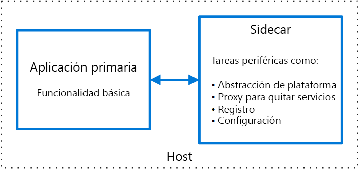

# Patrón SidecarSidecar pattern

Implemente componentes de una aplicación en un proceso o contenedor independientes para proporcionar aislamiento y encapsulación.Deploy components of an application into a separate process or container to provide isolation and encapsulation. Este patrón también puede habilitar las aplicaciones compuestas de tecnologías y componentes heterogéneos.This pattern can also enable applications to be composed of heterogeneous components and technologies.

Este patrón se denomina *Sidecar* porque parece un sidecar acoplado a una motocicleta.This pattern is named *Sidecar* because it resembles a sidecar attached to a motorcycle. En el patrón, el sidecar está acoplado a una aplicación primaria y proporciona funciones auxiliares para la aplicación.In the pattern, the sidecar is attached to a parent application and provides supporting features for the application. El sidecar también comparte el mismo ciclo de vida que la aplicación primaria, se crea y se retira junto con el elemento primario.The sidecar also shares the same lifecycle as the parent application, being created and retired alongside the parent. El patrón Sidecar a veces se denomina patrón Sidekick y es un patrón jerárquico.The sidecar pattern is sometimes referred to as the sidekick pattern and is a decomposition pattern.

## Contexto y problemaContext and Problem

A menudo las aplicaciones y lo servicios requieren una funcionalidad relacionada, como la supervisión, el registro, la configuración y los servicios de red.Applications and services often require related functionality, such as monitoring, logging, configuration, and networking services. Estas tareas periféricas se pueden implementar como componentes o servicios independientes.These peripheral tasks can be implemented as separate components or services. 

Si están estrechamente integradas en la aplicación, se pueden ejecutar en el mismo proceso que la aplicación, que realiza un uso eficaz de los recursos compartidos.If they are tightly integrated into the application, they can run in the same process as the application, making efficient use of shared resources. Sin embargo, esto también significa que no están bien aisladas y una interrupción en uno de estos componentes puede afectar a otros componentes o a toda la aplicación.However, this also means they are not well isolated, and an outage in one of these components can affect other components or the entire application. Además, normalmente deben implementarse con el mismo idioma que la aplicación primaria.Also, they usually need to be implemented using the same language as the parent application. Como consecuencia, el componente y la aplicación tienen una gran dependencia entre ellos.As a result, the component and the application have close interdependence on each other.

Si la aplicación se descompone en servicios, cada uno de ellos se puede crear con distintos idiomas y tecnologías.If the application is decomposed into services, then each service can be built using different languages and technologies. Aunque esto proporciona más flexibilidad, significa que cada componente tiene sus propias dependencias y requiere bibliotecas específicas del lenguaje para acceder tanto a la plataforma subyacente como a los recursos compartidos con la aplicación primaria.While this gives more flexibility, it means that each component has its own dependencies and requires language-specific libraries to access the underlying platform and any resources shared with the parent application. Además, la implementación de estas características como servicios independientes puede agregar latencia a la aplicación.In addition, deploying these features as separate services can add latency to the application. La administración del código y las dependencias de estas interfaces específicas del lenguaje también puede agregar una considerable complejidad, especialmente en lo referente al hospedaje, la implementación y la administración.Managing the code and dependencies for these language-specific interfaces can also add considerable complexity, especially for hosting, deployment, and management.

## SoluciónSolution

Coloque un conjunto de tareas cohesionadas con la aplicación principal, pero colóquelas en su propio proceso o contenedor, lo que proporciona una interfaz homogénea para los servicios de plataformas de varios lenguajes.Co-locate a cohesive set of tasks with the primary application, but place them inside their own process or container, providing a homogeneous interface for platform services across languages. 

Un servicio sidecar no necesariamente forma parte de la aplicación, pero está conectado a ella.A sidecar service is not necessarily part of the application, but is connected to it. Va allá donde vaya la aplicación primaria.It goes wherever the parent application goes. Estos son tipos de procesos o servicios auxiliares que se implementan con la aplicación principal.Sidecars are supporting processes or services that are deployed with the primary application. En el caso de las motocicletas, el sidecar está acoplado a una motocicleta y cada motocicleta puede tener su propio sidecar.On a motorcycle, the sidecar is attached to one motorcycle, and each motorcycle can have its own sidecar. De la misma forma, un servicio sidecar comparte el destino de su aplicación primaria.In the same way, a sidecar service shares the fate of its parent application. Para cada instancia de la aplicación, se implementa una instancia del patrón Sidecar, y se hospeda junto a ella.For each instance of the application, an instance of the sidecar is deployed and hosted alongside it. 

Entre las ventajas de usar un patrón Sidecar se incluyen:Advantages of using a sidecar pattern include:

- Un patrón Sidecar es independiente de su aplicación principal en cuanto al entorno del runtime y al lenguaje de programación, por lo que no es preciso desarrollar un sidecar por lenguaje.A sidecar is independent from its primary application in terms of runtime environment and programming language, so you don't need to develop one sidecar per language. 

- El sidecar puede acceder a los mismos recursos que la aplicación principal.The sidecar can access the same resources as the primary application. Por ejemplo, un sidecar puede supervisar los recursos del sistema que usan tanto el sidecar como la aplicación principal.For example, a sidecar can monitor system resources used by both the sidecar and the primary application. 

- Dada su proximidad a la aplicación principal, la latencia de la comunicación entre ellos no es significativa.Because of its proximity to the primary application, there’s no significant latency when communicating between them.

- Hasta en las aplicaciones que no proporcionan un mecanismo de extensibilidad se puede usar un sidecar para ampliar la funcionalidad, para lo que se adjunta como proceso propio proceso en el mismo host o subcontenedor que la aplicación principal.Even for applications that don’t provide an extensibility mechanism, you can use a sidecar to extend functionality by attaching it as own process in the same host or sub-container as the primary application.

A menudo, el patrón Sidecar se usa con contenedores y se conoce como contenedor sidecar o contenedor sidekick.The sidecar pattern is often used with containers and referred to as a sidecar container or sidekick container. 

## Problemas y consideracionesIssues and Considerations

- Tenga en cuenta el formato de implementación y empaquetado que va a usar para implementar servicios, procesos o contenedores.Consider the deployment and packaging format you will use to deploy services, processes, or containers. Los contenedores se ajustan especialmente bien al patrón Sidecar.Containers are particularly well suited to the sidecar pattern.
- Al diseñar un servicio sidecar, decida con cuidado el mecanismo de comunicación entre procesos.When designing a sidecar service, carefully decide on the interprocess communication mechanism. Pruebe a utilizar tecnologías independiente del lenguaje o del marco, a menos que los requisitos de rendimiento hagan que no sea práctico.Try to use language- or framework-agnostic technologies unless performance requirements make that impractical.
- Antes de colocar la funcionalidad en un servicio sidecar, plantéese si funcionaría mejor como un servicio independiente o un demonio más tradicional.Before putting functionality into a sidecar, consider whether it would work better as a separate service or a more traditional daemon.
- Tenga también en cuenta si la funcionalidad se puede implementar como una biblioteca o mediante un mecanismo de extensión tradicional.Also consider whether the functionality could be implemented as a library or using a traditional extension mechanism. Las bibliotecas específicas del lenguaje pueden tener un mayor nivel de integración y menor sobrecarga de red.Language-specific libraries may have a deeper level of integration and less network overhead.

## Cuándo se usa este patrónWhen to Use this Pattern

Use este patrón en los siguientes supuestos:Use this pattern when:

- La aplicación principal utiliza un conjunto heterogéneo de lenguajes y marcos.Your primary application uses a heterogenous set of languages and frameworks. Un componente que se encuentra en un servicio sidecar lo pueden usar aplicaciones escritas en otros lenguajes y que usen marcos diferentes.A component located in a sidecar service can be consumed by applications written in different languages using different frameworks.
- Un componente pertenece a un equipo remoto o a otra organización.A component is owned by a remote team or a different organization.
- Un componente o una característica deben encontrarse en el mismo host que la aplicaciónA component or feature must be co-located on the same host as the application
- Necesita un servicio que comparta el ciclo de vida general de la aplicación principal, pero que se pueda actualizar de forma independiente.You need a service that shares the overall lifecycle of your main application, but can be independently updated.
- Necesita un control específico sobre los límites de recursos de un componente o recurso concreto.You need fine-grained control over resource limits for a particular resource or component. Por ejemplo, puede restringir la cantidad de memoria que usa un componente específico.For example, you may want to restrict the amount of memory a specific component uses. Puede implementar el componente como sidecar y administrar el uso de la memoria independientemente de la aplicación principal.You can deploy the component as a sidecar and manage memory usage independently of the main application.

Este patrón puede no ser adecuado:This pattern may not be suitable:

- Cuando debe optimizarse la comunicación entre procesos.When interprocess communication needs to be optimized. La comunicación entre una aplicación primaria y los servicios sidecar tiene cierta sobrecarga, en particular latencia en las llamadas.Communication between a parent application and sidecar services includes some overhead, notably latency in the calls. Es posible que esta contrapartida no sea aceptable para interfaces que emiten información.This may not be an acceptable trade-off for chatty interfaces.
- En el caso de aplicaciones pequeñas, en las que el costo, en términos de recursos, de implementar un servicio de sidecar por cada instancia no merece la pena, en comparación la ventaja del aislamiento.For small applications where the resource cost of deploying a sidecar service for each instance is not worth the advantage of isolation.
- Cuando el servicio necesita escalar de forma diferente a las aplicaciones principales, o independientemente de ellas.When the service needs to scale differently than or independently from the main applications. Si es así, es posible que sea mejor implementar la característica como un servicio independiente.If so, it may be better to deploy the feature as a separate service.

## EjemploExample

Este patrón sidecar se puede aplicar a muchos escenarios.The sidecar pattern is applicable to many scenarios. Algunos ejemplos comunes:Some common examples:

- API de infraestructura.Infrastructure API. El equipo de desarrollo de la infraestructura crea un servicio que se implementa junto con cada aplicación, en lugar de una biblioteca de cliente específica del lenguaje para acceder a la infraestructura.The infrastructure development team creates a service that's deployed alongside each application, instead of a language-specific client library to access the infrastructure. El servicio se carga como un sidecar y proporciona una capa común para los servicios de infraestructura, incluidos el registro, los datos del entorno, el almacén de configuración, la detección, las comprobaciones de mantenimiento y los servicios de vigilancia.The service is loaded as a sidecar and provides a common layer for infrastructure services, including logging, environment data, configuration store, discovery, health checks, and watchdog services. El sidecar también supervisa el entorno de host y el proceso (o contenedor) de la aplicación principal, y registra la información en un servicio centralizado.The sidecar also monitors the parent application's host environment and process (or container) and logs the information to a centralized service.
- Administración de NGINX/HAProxy.Manage NGINX/HAProxy. Implemente NGINX con un servicio sidecar que supervise el estado del entorno y, después, actualice el archivo de configuración de NGINX y recicle el proceso cuando se necesite un cambio de estado.Deploy NGINX with a sidecar service that monitors environment state, then updates the NGINX configuration file and recycles the process when a change in state is needed.
- Sidecar Ambassador.Ambassador sidecar. Implemente un servicio [Ambassador][ambassador] como un sidecar.Deploy an [ambassador][ambassador] service as a sidecar. La aplicación llama a través del servicio Ambassador, que controla el registro de solicitudes, enrutamiento, la interrupción de circuitos y otras características relacionadas con la conectividad.The application calls through the ambassador, which handles request logging, routing, circuit breaking, and other connectivity related features.
- Descarga de proxy.Offload proxy. Coloque un proxy NGINX delante de una instancia de servicio de node.js para controlar que se sirve el contenido del archivo estático para el servicio.Place an NGINX proxy in front of a node.js service instance, to handle serving static file content for the service.

## Instrucciones relacionadasRelated guidance

- [Patrón Ambassador][ambassador][Ambassador pattern][ambassador]

[ambassador]: ./ambassador.md

