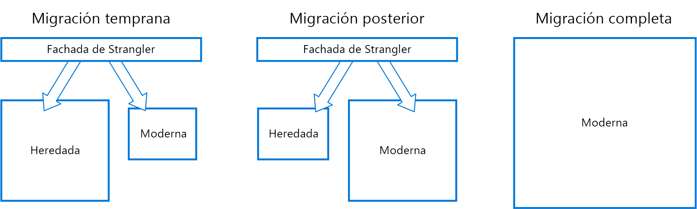

# Patrón Strangler

Migra de forma incremental un sistema heredado reemplazando gradualmente funciones específicas por los servicios y aplicaciones nuevas. A medida que se reemplaza el sistema heredado, el nuevo sistema sustituye eventualmente todas las características del sistema anterior, suprimiéndolo y permitiéndole su desmantelamiento. 

## Contexto y problema

Los sistemas envejecen y, simultáneamente, las herramientas de desarrollo, la tecnología de hospedaje e incluso las arquitecturas de sistema donde estaban construidos pueden quedarse también poco a poco obsoletas. A medida que se agregan características y funcionalidades, la complejidad de estas aplicaciones aumenta considerablemente,dificultando su mantenimiento o la incorporación de nuevas características.

La sustitución completa de un sistema puede ser una tarea enorme. A menudo, requerirá la migración gradual a un nuevo sistema mientras conserva el sistema antiguo para controlar las características que aún no se hayan migrado. Sin embargo, la ejecución de dos versiones distintas de una aplicación implica que los clientes deben conocer dónde se encuentra una característica determinada. Cada vez que se migra una característica o un servicio, los clientes deben actualizarse para apuntar a la nueva ubicación.

## Solución

Reemplace de forma incremental elementos específicos de funcionalidad por las aplicaciones y los servicios nuevos. Cree una fachada que intercepte las solicitudes que van al sistema heredado de back-end. La fachada enruta estas solicitudes a la aplicación heredada o a los nuevos servicios. Las características existentes se pueden migrar al nuevo sistema gradualmente, y los consumidores pueden seguir usando la misma interfaz sin ser conscientes de que se ha producido una migración.

  

Este patrón ayuda a minimizar el riesgo de la migración y distribuir el esfuerzo de desarrollo a lo largo del tiempo. Dado que la fachada enruta de manera segura a los usuarios a la aplicación correcta, puede agregar funcionalidad al nuevo sistema al ritmo que desee, asegurándose al mismo tiempo de que la aplicación heredada sigue funcionando. Con el tiempo, a medida que las características se migren al nuevo sistema, el sistema heredado acabará siendo "suprimido" y dejará de ser necesario. Una vez completado este proceso, el sistema se puede retirar sin riesgo alguno.

## Problemas y consideraciones

- Piense en cómo administrar los servicios y los almacenes de datos que potencialmente pueden utilizar tanto los sistemas nuevos como los heredados. Asegúrese de que ambos pueden tener acceso a estos recursos en paralelo.
- Estructure las nuevas aplicaciones y servicios de forma que se puedan interceptar y reemplazar fácilmente en el futuro por migraciones de Strangler.
- En algún momento, una vez completada la migración, la fachada de Strangler desaparecerá o evolucionará hacia un adaptador para clientes heredados.
- Asegúrese de que la fachada se mantiene al día con la migración.
- Asegúrese de que la fachada no se convierte en un único punto de error o un cuello de botella para el rendimiento.

## Cuándo usar este patrón

Utilice este patrón cuando migre gradualmente una aplicación de back-end a una nueva arquitectura.

Este patrón puede no ser adecuado:

- Cuando no se pueden interceptar las solicitudes dirigidas al sistema de back-end.
- En sistemas más pequeños donde la complejidad de reemplazar todo el conjunto es limitada.

## Instrucciones relacionadas

- [Anti-Corruption Layer pattern](./anti-corruption-layer.md) (Patrón Anti-Corruption Layer)
- [Gateway Routing pattern](./gateway-routing.md) (Patrón Gateway Routing)

 

