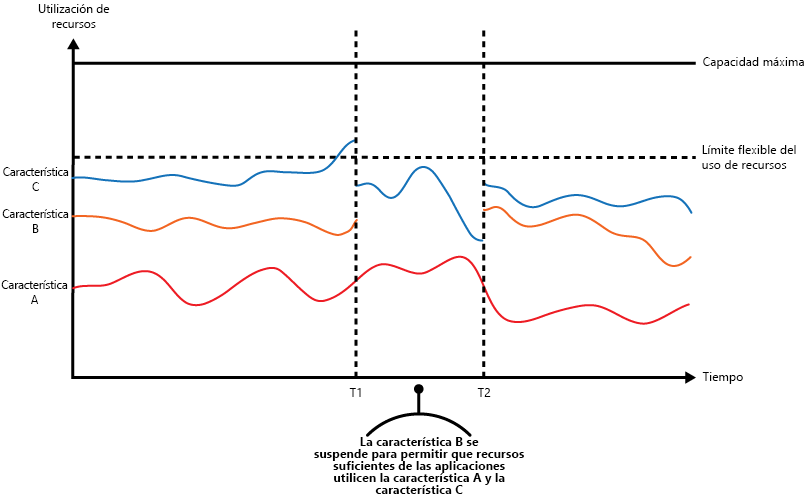
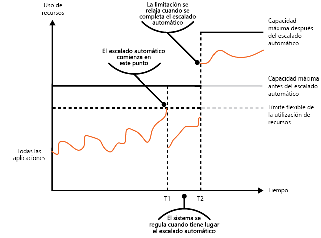
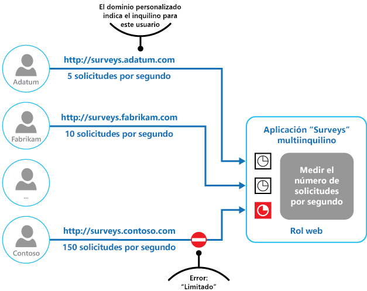

# Patrón Throttling

[!INCLUDE [header](../_includes/header.md)]

Controlan el consumo de recursos que usa una instancia de una aplicación, un inquilino individual o un servicio completo. Esto puede permitir que el sistema siga funcionando y cumpla los acuerdos de nivel de servicio, incluso cuando el aumento de la demanda impone una carga extrema sobre los recursos.

## Contexto y problema

La carga de una aplicación en la nube suele variar con el tiempo en función del número de usuarios activos o de los tipos de actividades que realizan. Por ejemplo, es probable que haya más usuarios activos durante las horas de trabajo, o que el sistema tenga que realizar análisis analíticos de cálculo intensivo al final de cada mes. También puede haber ráfagas repentinas e imprevistas en la actividad. Si los requisitos de procesamiento del sistema exceden la capacidad de los recursos disponibles, el sistema podrá experimentar un rendimiento deficiente e incluso puede producir un error. Si el sistema tiene que cumplir un nivel de servicio acordado, este error podría ser aceptable.

Existen muchas estrategias disponibles para manejar cargas variables en la nube, dependiendo de los objetivos de negocio de la aplicación. Una estrategia consiste en utilizar el escalado automático para adaptar los recursos aprovisionados a las necesidades del usuario en cualquier momento. Esto tiene el potencial de satisfacer la demanda de los usuarios de forma coherente, al tiempo que se optimizan los costos de funcionamiento. Sin embargo, aunque el escalado automático puede desencadenar el aprovisionamiento de recursos adicionales, este aprovisionamiento no es inmediato. Si la demanda aumenta rápidamente, puede haber una ventana de tiempo donde hay un déficit de recursos.

## Solución

Una estrategia alternativa al escalado automático es permitir que las aplicaciones utilicen los recursos solo hasta un límite y, después, regularlos cuando se alcance dicho límite. El sistema debería supervisar cómo utiliza los recursos para que, cuando el uso supere el umbral, pueda limitar las solicitudes de uno o más usuarios. Esto permitirá que el sistema siga funcionando y cumpla los Acuerdos de Nivel de Servicio establecidos. Para más información sobre cómo supervisar el uso de recursos, consulte [Orientación sobre instrumentación y telemetría](https://msdn.microsoft.com/library/dn589775.aspx).

El sistema podría implementar varias estrategias de limitación, entre ellas:

- Rechazar las solicitudes de un usuario individual que ya ha accedido a las API del sistema más de n veces por segundo durante un período determinado. Esto requiere que el sistema mida el uso de recursos para cada inquilino o usuario que ejecuta una aplicación. Para obtener más información, consulte [Service Metering Guidance](https://msdn.microsoft.com/library/dn589796.aspx) (Guía de medición de servicio).

- Deshabilitar o degradar la funcionalidad de determinados servicios no esenciales para que los servicios esenciales puedan funcionar sin impedimentos con recursos suficientes. Por ejemplo, si la aplicación está transmitiendo vídeo, podría cambiar a una resolución inferior.

- Con la nivelación de carga para unificar el volumen de actividad (este enfoque se trata con más detalle en el [patrón Queue-Based Load Leveling](queue-based-load-leveling.md)). En un entorno de varios inquilinos, este enfoque reducirá el rendimiento de cada inquilino. Si el sistema debe admitir una combinación de inquilinos con distintos Acuerdos de Nivel de Servicio, el trabajo para inquilinos de alto valor podría realizarse inmediatamente. Las solicitudes para otros inquilinos se pueden retener y controlar cuando haya disminuido el trabajo pendiente. El [patrón Priority Queue][] podría usarse para ayudar a implementar este enfoque.

- Aplazar las operaciones que se realizan en nombre de las aplicaciones de prioridad inferior o de los inquilinos. Estas operaciones se pueden suspender o limitar, con una excepción generada para informar al inquilino de que el sistema está ocupado y que la operación debe retomarse más tarde.

La ilustración muestra un gráfico de área para el uso de recursos (una combinación de memoria, CPU, ancho de banda y otros factores) comparándolo con el tiempo para aplicaciones que están haciendo uso de tres características. Una característica es un área de funcionalidad, como un componente que realiza un conjunto específico de tareas, una pieza de código que realiza un cálculo complejo o un elemento que proporciona un servicio como una caché en memoria. Estas características están etiquetadas como A, B y C.

> El área inmediatamente debajo de la línea de una característica indica los recursos que utilizan las aplicaciones cuando invocan esta característica. Por ejemplo, el área situada debajo de la línea para la característica A muestra los recursos utilizados por las aplicaciones que están haciendo uso de la característica A, y el área que se encuentra entre las líneas para la característica A y la característica B indica los recursos utilizados por las aplicaciones que invocan la característica B. La agregación de las áreas para cada característica muestra el uso total de recursos del sistema.

En la ilustración anterior se muestran los efectos del aplazamiento de las operaciones. Justo antes del tiempo T1, los recursos totales asignados a todas las aplicaciones que utilizan estas características alcanzan un umbral (el límite del uso de recursos). En este punto, las aplicaciones corren el riesgo de agotar los recursos disponibles. En este sistema, la característica B es menos crítica que la A o la C, por lo que está temporalmente deshabilitada y los recursos que estaba utilizando se liberan. Entre los tiempos T1 y T2, las aplicaciones que usan la característica A y la C continúan funcionando normalmente. Finalmente, el uso de recursos de estas dos características disminuye hasta el punto en que, en el tiempo T2, hay suficiente capacidad para volver a habilitar la característica B.

Los enfoques de escalado automático y de limitación también pueden combinarse para ayudar a mantener la respuesta de las aplicaciones y dentro de los Acuerdos de Nivel de servicio. Si se espera que la demanda se mantenga alta, la limitación proporciona una solución temporal mientras que el sistema escala horizontalmente. En este punto, la funcionalidad completa del sistema se puede restaurar.

En la siguiente ilustración se muestra un gráfico de área del uso total de recursos por todas las aplicaciones que se ejecutan en un sistema comparado con el tiempo, e ilustra cómo se puede combinar la limitación con el escalado automático.

En el tiempo T1, se alcanza el umbral que especifica el límite suave del uso de los recursos. En este momento, el sistema puede comenzar a escalarse horizontalmente. Sin embargo, si los nuevos recursos no están disponibles lo suficientemente rápido, los recursos existentes podrían agotarse y podría producirse un error en el sistema. Para evitar que esto suceda, el sistema se limita temporalmente, tal como se ha descrito anteriormente. Cuando se ha completado el escalado automático y los recursos adicionales están disponibles, la limitación se puede relajar.

## Problemas y consideraciones

A la hora de decidir cómo implementar este patrón, debe considerar los siguientes puntos:

- La limitación de una aplicación, así como la estrategia que se va a utilizar, es una decisión de arquitectura que afecta a todo el diseño de un sistema. La limitación debe considerarse al principio del proceso de diseño de la aplicación porque no es fácil de agregar una vez implementado el sistema.

- La limitación debe realizarse rápidamente. El sistema debe ser capaz de detectar un aumento en la actividad y de actuar en consecuencia. El sistema también debe poder volver a su estado original rápidamente después de que la carga haya disminuido. Esto requiere que los datos de rendimiento apropiados se capturen y se supervisen continuamente.

- Si un servicio necesita denegar temporalmente una solicitud de usuario, debe devolver un código de error específico para que la aplicación cliente entienda que el motivo del rechazo a realizar una operación se debe a la limitación. La aplicación cliente puede esperar un tiempo antes de volver a intentar la solicitud.

- La limitación se puede utilizar como una medida temporal mientras que un sistema escala automáticamente. En algunos casos es mejor simplemente limitar, en lugar de escalar, si una ráfaga en la actividad es repentina y no se espera que dure mucho tiempo, porque el escalado puede aumentar considerablemente los costos de funcionamiento.

- Si se está utilizando la limitación como medida temporal mientras un sistema escala automáticamente y si la demanda de recursos crece muy rápidamente, el sistema podría no ser capaz de continuar funcionando, incluso cuando opera en modo limitado. Si esto no es aceptable, considere mantener reservas de mayor capacidad y configurar un escalado automático más agresivo.

## Cuándo usar este patrón

Use este patrón:

- Para asegurarse de que un sistema siga cumpliendo los acuerdos de nivel de servicio.

- Para impedir que un solo inquilino monopolice los recursos proporcionados por una aplicación.

- Para controlar las ráfagas de actividad.

- Para ayudar a optimizar el costo de un sistema mediante la limitación de los niveles máximos de recursos necesarios para que siga funcionando.

## Ejemplo

La ilustración final ilustra cómo se puede implementar la limitación en un sistema multiinquilino. Los usuarios de cada una de las organizaciones de inquilinos acceden a una aplicación hospedada en la nube donde rellenan y envían encuestas. La aplicación contiene instrumentación que supervisa la velocidad a la que estos usuarios envían las solicitudes a la aplicación.

Con el fin de evitar que los usuarios de un inquilino afecten a la capacidad de respuesta y disponibilidad de la aplicación para todos los demás usuarios, se aplica un límite al número de solicitudes por segundo que los usuarios de cualquier inquilino pueden enviar. La aplicación bloquea las solicitudes que superen este límite.

## Orientación y patrones relacionados

Los patrones y las directrices siguientes también pueden ser importantes a la hora de implementar este patrón:
- [Orientación sobre instrumentación y telemetría](https://msdn.microsoft.com/library/dn589775.aspx). La limitación depende de la recopilación de información sobre el grado de utilización del servicio. Describe cómo generar y capturar información de supervisión personalizada.
- [Guía de la medición del servicio](https://msdn.microsoft.com/library/dn589796.aspx). Describe cómo medir el uso de servicios para comprender cómo se utilizan. Esta información puede ser útil para determinar cómo limitar un servicio.
- [Guía de escalado automático](https://msdn.microsoft.com/library/dn589774.aspx). La limitación puede usarse como medida provisional mientras el sistema se escala automáticamente, o para eliminar la necesidad de que un sistema se escale automáticamente. Contiene información sobre estrategias de escalado automático.
- [Patrón Queue-Based Load Leveling](queue-based-load-leveling.md). Este patrón es un mecanismo utilizado normalmente para implementar la limitación. Una cola puede actuar como un búfer que ayuda a equilibrar la velocidad a la que se entregan a un servicio las solicitudes enviadas por una aplicación.
- [patrón Priority Queue][]. Un sistema puede utilizar las colas de prioridad como parte de su estrategia de limitación para mantener el rendimiento de aplicaciones críticas o de mayor valor, a la vez que reduce el rendimiento de las aplicaciones menos importantes.

[patrón Priority Queue]: priority-queue.md