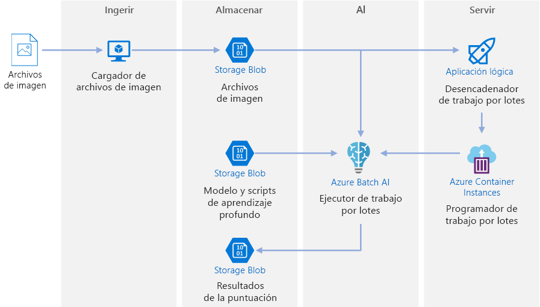
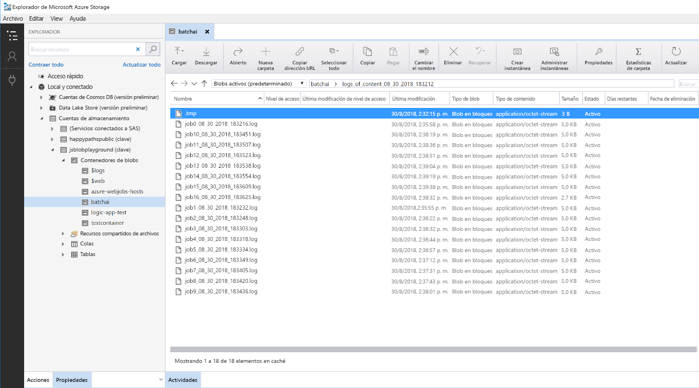

# Puntuación de Batch en Azure para modelos de aprendizaje profundo

Esta arquitectura de referencia muestra cómo aplicar una transferencia de estilo neuronal a un vídeo con Azure Batch AI. La *transferencia de estilo* es una técnica de aprendizaje profundo que se compone de una imagen existente con el estilo de otra imagen. Esta arquitectura se puede generalizar para cualquier escenario que usa la puntuación de Batch con el aprendizaje profundo. [**Implemente esta solución**](#deploy-the-solution).
 

**Escenario**: una empresa mediática tiene un vídeo cuyo estilo quiere cambiar para que se parezca a una pintura específica. La organización quiere poder aplicar este estilo a todos los fotogramas del vídeo de manera oportuna y automática. Para más información sobre los algoritmos de transferencia de estilo neuronal, vea [Image Style Transfer Using Convolutional Neural Networks][image-style-transfer] (Transferencia de estilo de imagen con redes neuronales convolucionales) (PDF).

| Imagen con estilo: | Vídeo de contenido/entrada: | Vídeo de salida: | 
|--------|--------|---------|
|  |  *Haga clic para ver el vídeo* |  *Haga clic para ver el vídeo* |

Esta arquitectura de referencia está diseñada para cargas de trabajo que se desencadenan por la presencia de nuevo contenido multimedia en Azure Storage. El procesamiento implica los siguientes pasos:

1. Cargue una imagen del estilo seleccionado (como una pintura de Van Gogh) y un script de transferencia de estilo para Blob Storage.
1. Cree un clúster de Batch AI de escalado automático que esté listo para comenzar a realizar el trabajo.
1. Divida el archivo de vídeo en fotogramas individuales y cárguelos en Blob Storage.
1. Una vez cargados todos los fotogramas, cargue un archivo de desencadenador en Blob Storage.
1. Este archivo desencadena una aplicación lógica que crea un contenedor que se ejecuta en Azure Container Instances.
1. El contenedor ejecuta un script que crea los trabajos de Batch AI. Cada trabajo aplica la transferencia de estilo neuronal en paralelo en todos los nodos del clúster de Batch AI.
1. Una vez generadas las imágenes, se vuelven a guardar en Blob Storage.
1. Descargue los fotogramas generados y una de nuevo las imágenes en un vídeo.

## Arquitectura
Esta arquitectura consta de los siguientes componentes.

### Compute

**[Azure Batch AI][batch-ai]** se usa para ejecutar el algoritmo de transferencia de estilo neuronal. Batch AI admite cargas de trabajo de aprendizaje profundo al ofrecer entornos en contenedores que están preconfigurados para marcos de aprendizaje profundo, en máquinas virtuales habilitadas para GPU. Batch AI también puede conectar el clúster de proceso con Blob Storage.

### Storage

**[Blob Storage][blob-storage]** se usa para almacenar todas las imágenes (imágenes de entrada, imágenes de estilo e imágenes de salida) y todos los registros generados por Batch AI. Blob Storage se integra con Batch AI mediante [blobfuse][blobfuse], un sistema de archivos virtual de código abierto respaldado por Blob Storage. Blob Storage también es muy rentable por el rendimiento que requiere esta carga de trabajo.

### Desencadenador/programación

**[Azure Logic Apps][logic-apps]** se usa para desencadenar el flujo de trabajo. Cuando la aplicación lógica detecta que se ha agregado un blob al contenedor, desencadena el proceso de Batch AI. Logic Apps es una buena elección para esta arquitectura de referencia porque es una manera fácil de detectar los cambios en Blob Storage y proporciona un proceso sencillo para cambiar el desencadenador.

**[Azure Container Instances][container-instances]** se usa para ejecutar los scripts de Python que crean los trabajos de Batch AI. Ejecutar estos scripts dentro de un contenedor de Docker es una manera cómoda de ejecutarlos a petición. Para esta arquitectura, usamos Container Instances porque hay un conector de la aplicación lógica precompilado para ello, que permite que la aplicación lógica desencadene el trabajo de Batch AI. Container Instances puede iniciar los procesos sin estado rápidamente.

**[DockerHub][dockerhub]** se usa para almacenar la imagen de Docker que Container Instances usa para ejecutar el proceso de creación del trabajo. DockerHub se eligió para esta arquitectura porque es fácil de usar y porque es el repositorio de imágenes predeterminado para los usuarios de Docker. [Azure Container Registry][container-registry] también se puede usar.

### Preparación de los datos

Esta arquitectura de referencia usa secuencias de vídeo de un orangután en un árbol. Puede descargar la secuencia [aquí][source-video] y procesarla para el flujo de trabajo siguiendo estos pasos:

1. Use [AzCopy][azcopy] para descargar el vídeo del blob público.
2. Use [FFmpeg][ffmpeg] para extraer el archivo de audio, para que poder unir el archivo de audio en el vídeo de salida más adelante.
3. Use FFmpeg para dividir el vídeo en fotogramas individuales. Los fotogramas se procesarán de forma independiente, en paralelo.
4. Use AzCopy para copiar los fotogramas individuales en el contenedor de blobs.

En esta fase, la secuencia de vídeo está en un formato que se puede usar para la transferencia de estilo neuronal. 

## Consideraciones sobre rendimiento

### GPU frente a CPU

Para cargas de trabajo de aprendizaje profundo, las GPU normalmente tendrán un rendimiento bastante más alto que las CPU, en la medida en que un clúster del tamaño de las CPU suele ser necesario para obtener un rendimiento comparable. Si bien existe la opción de usar solo CPU en esta arquitectura, las GPU ofrecerán un perfil bastante mejorado de costo/rendimiento. Se recomienda utilizar la última instancia de [NCv3 series]vm-sizes-gpu de máquinas virtuales optimizadas para GPU.

Las GPU no están habilitadas de forma predeterminada en todas las regiones. Asegúrese de seleccionar una región que tenga GPU habilitadas. Además, las suscripciones tienen una cuota predeterminada de cero núcleos para máquinas virtuales optimizadas para GPU. Puede aumentar esta cuota si abre una solicitud de soporte técnico. Asegúrese de que la suscripción tiene una cuota suficiente para ejecutar la carga de trabajo.

### Poner en paralelo las máquinas virtuales con los núcleos

Al ejecutar un proceso de transferencia de estilo como un trabajo por lotes, los trabajos que se ejecutan principalmente en GPU tendrán que ejecutarse en paralelo en todas las máquinas virtuales. Se admiten dos enfoques: puede crear un clúster más grande con máquinas virtuales que tienen una sola GPU o crear un clúster más pequeño mediante máquinas virtuales con muchas GPU. 

Para esta carga de trabajo, estas dos opciones presentan un rendimiento comparable. El uso de menos máquinas virtuales con más GPU por máquina virtual puede ayudar a reducir el movimiento de datos. Sin embargo, el volumen de datos por trabajo para esta carga de trabajo no es muy grande, por lo que no observará demasiadas limitaciones por Blob Storage.

### Tamaño del lote de imágenes por trabajo de Batch AI

Otro parámetro que se debe configurar es el número de imágenes que hay que procesar por cada trabajo de Batch AI. Por un lado, desea asegurarse de que el trabajo se extiende por todos los nodos y que, si el trabajo genera errores, no tenga que volver a realizar reintentos con demasiadas imágenes. Eso conlleva tener muchos trabajos de Batch AI y, en consecuencia, un número reducido de imágenes que procesar por trabajo. Por otro lado, si se procesan muy pocas imágenes por trabajo, el tiempo de configuración/inicio llega a ser desproporcionadamente largo. Puede establecer el número de trabajo con un valor igual al número máximo de nodos del clúster. Se tratará de la opción más rentable, suponiendo que no se produzca ningún error en los trabajos, ya que se minimizan los costos de configuración/inicio. Sin embargo, si se produce algún error en el trabajo, puede que sea necesario volver a procesar un número elevado de imágenes.

### Servidores de archivos

Al usar Batch AI, puede elegir varias opciones de almacenamiento según el rendimiento necesario para el escenario. Para cargas de trabajo con requisitos de rendimiento bajo, debe ser suficiente con Blob Storage (mediante blobfuse). De forma alternativa, Batch AI también admite un servidor de archivos de Batch AI, un NFS administrado de un solo nodo que se pueden montar automáticamente en nodos del clúster para proporcionar una ubicación de almacenamiento centralmente accesible para los trabajos. Para la mayoría de los casos, se necesita un solo servidor de archivos en un área de trabajo y se pueden separar los datos para los trabajos de aprendizaje en directorios distintos. Si un NFS de un solo nodo no es adecuado para las cargas de trabajo, Batch AI admite otras opciones de almacenamiento, como Azure Files, o soluciones personalizadas, como un sistema de archivos Gluster o Lustre.

## Consideraciones sobre la seguridad

### Restricción de acceso a Azure Blob Storage

En esta arquitectura de referencia, Azure Blob Storage es el componente de almacenamiento principal que debe protegerse. La implementación de línea base que se muestra en el repositorio de GitHub usa las claves de la cuenta de almacenamiento para acceder a Blob Storage. Para obtener más control y protección, en su lugar, considere la posibilidad de usar una firma de acceso compartido (SAS). Esto concede acceso limitado a los objetos de almacenamiento, sin necesidad de codificar de forma rígida las claves de cuenta ni de guardarlas como texto no cifrado. Este enfoque es especialmente útil porque las claves de cuenta están visibles como texto no cifrado dentro de la interfaz del diseñador de la aplicación lógica. Mediante una SAS también ayuda a asegurarse de que la cuenta de almacenamiento tiene un control corporativo adecuado y que se concede acceso solo a las personas que deben tenerlo.

Para escenarios con información más confidencial, asegúrese de que todas las claves de almacenamiento están protegidas, ya que estas claves conceden acceso total a todos los datos de entrada y salida de la carga de trabajo.

### Cifrado de datos y movimiento de datos

Esta arquitectura de referencia usa la transferencia de estilo como un ejemplo de un proceso de puntuación de Batch. Para escenarios de información más confidencial, los datos del almacenamiento deben cifrarse en reposo. Cada vez que los datos se muevan de una ubicación a la siguiente, use SSL para proteger la transferencia de datos. Para más información, vea la [Guía de seguridad de Azure Storage][storage-security]. 

### Protección de datos de una red virtual

Al implementar el clúster de Batch AI, puede configurar el clúster para que se aprovisione dentro de una subred de una red virtual. Esto permite que los nodos de proceso del clúster se comuniquen de forma segura con otras máquinas virtuales, o incluso con una red local. También puede usar [puntos de conexión de servicio][service-endpoints] con Blob Storage para conceder acceso desde una red virtual o usar un NFS de un solo nodo dentro de la red virtual con Batch AI para garantizar que los datos siempre estén protegidos.

### Protección contra la actividad malintencionada

En escenarios donde hay varios usuarios, asegúrese de que los datos confidenciales estén protegidos contra la actividad malintencionada. Si otros usuarios obtienen acceso a esta implementación para personalizar los datos de entrada, tenga en cuenta las siguientes precauciones y consideraciones:

- Utilice RBAC para limitar el acceso de los usuarios a solo los recursos que necesitan.
- Aprovisione dos cuentas de almacenamiento independientes. Almacene los datos de entrada y salida en la primera cuenta. Los usuarios externos pueden acceder a esta cuenta. Almacene los scripts ejecutables y los archivos de registro de salida en la otra cuenta. Los usuarios externos no deben tener acceso a esta cuenta. Esto garantizará que los usuarios externos no puedan modificar los archivos ejecutables (para insertar código malintencionado) ni acceder a los archivos de registro, que podrían contener información confidencial.
- Los usuarios malintencionados pueden realizar ataques de denegación de servicio distribuido en la cola de trabajos o insertar mensajes dudosos con formato incorrecto en dicha cola, provocando así el bloqueo del sistema o errores al quitar los mensajes de la cola. 

## Supervisión y registro

### Supervisión de trabajos de Batch AI

Mientras se ejecuta el trabajo, es importante supervisar el progreso y asegurarse de que todo funciona según lo previsto. Sin embargo, puede resultar complicado supervisar un clúster de nodos activos. 

Para obtener una idea del estado general del clúster, vaya a la hoja de Batch AI de Azure Portal para inspeccionar el estado de los nodos del clúster. Si un nodo está inactivo o un trabajo presenta algún error, los registros de errores se guardan en Blob Storage y también se puede acceder a ellos en la hoja Trabajos de Azure Portal. 

La supervisión puede enriquecerse aún más conectando los registros a Application Insights o ejecutando procesos independientes para sondear el estado del clúster de Batch AI y sus trabajos.

### Registros en Batch AI

Batch AI registrará automáticamente todos los procesos stdout y stderr en la cuenta de Blob Storage asociada. Mediante una herramienta de exploración de almacenamiento, como el Explorador de Storage, se ofrecerá una experiencia mucho más sencilla para explorar los archivos de registro. 

Los pasos de implementación para esta arquitectura de referencia también muestran cómo configurar un sistema de registro más sencillo, de tal forma que todos los registros de los distintos trabajos se guarden en el mismo directorio, en el contenedor de blobs, tal como se muestra a continuación.
Use estos registros para supervisar cuánto tarda cada trabajo y cada imagen en procesarse. Esto le permitirá hacerse una idea mejor de cómo optimizar más el proceso.

## Consideraciones sobre el costo

En comparación con los componentes de almacenamiento y programación, los recursos de proceso utilizados en esta arquitectura de referencia predominan sin duda en términos de costos. Uno de los principales desafíos es paralelizar eficazmente el trabajo en un clúster de máquinas habilitadas para GPU.

El tamaño del clúster de Batch AI puede escalarse y reducirse verticalmente de manera automática en función de los trabajos existentes en la cola. Puede habilitar el escalado automático con Batch AI de una de estas dos formas. Puede hacerlo mediante programación, que se puede configurar en el archivo `.env` que forma parte de los [pasos de implementación][deployment], o bien puede cambiar la fórmula de escalado directamente en el portal después de haber creado el clúster.

Para el trabajo que no requiere un procesamiento inmediato, configure la fórmula de escalado automático para que el estado predeterminado (mínimo) sea un clúster de cero nodos. Con esta configuración, el clúster empieza con cero nodos y solo se escala verticalmente si detecta trabajos en la cola. Si el proceso de puntuación de Batch solo se produce algunas veces al día o menos, esta configuración permite obtener importantes ahorros.

El escalado automático puede no resultar apropiado para trabajo por lotes que se producen demasiado próximos entre sí. El tiempo que tarda un clúster en agilizarse y ralentizarse también incurre en costos, por tanto, si una carga de trabajo por lotes empieza solo unos minutos después de que el trabajo anterior termine, puede resultar más rentable mantener el clúster en ejecución entre los trabajos.

## Implementación de la solución

Para implementar esta arquitectura de referencia, siga los pasos descritos en el [repositorio de GitHub][deployment].

[azcopy]: /azure/storage/common/storage-use-azcopy-linux
[batch-ai]: /azure/batch-ai/
[blobfuse]: https://github.com/Azure/azure-storage-fuse
[blob-storage]: /azure/storage/blobs/storage-blobs-introduction
[container-instances]: /azure/container-instances/
[container-registry]: /azure/container-registry/
[deployment]: https://github.com/Azure/batch-scoring-for-dl-models
[dockerhub]: https://hub.docker.com/
[ffmpeg]: https://www.ffmpeg.org/
[image-style-transfer]: https://www.cv-foundation.org/openaccess/content_cvpr_2016/papers/Gatys_Image_Style_Transfer_CVPR_2016_paper.pdf
[logic-apps]: /azure/logic-apps/
[service-endpoints]: /azure/storage/common/storage-network-security?toc=%2fazure%2fvirtual-network%2ftoc.json#grant-access-from-a-virtual-network
[source-video]: https://happypathspublic.blob.core.windows.net/videos/orangutan.mp4
[storage-security]: /azure/storage/common/storage-security-guide
[vm-sizes-gpu]: /azure/virtual-machines/windows/sizes-gpu