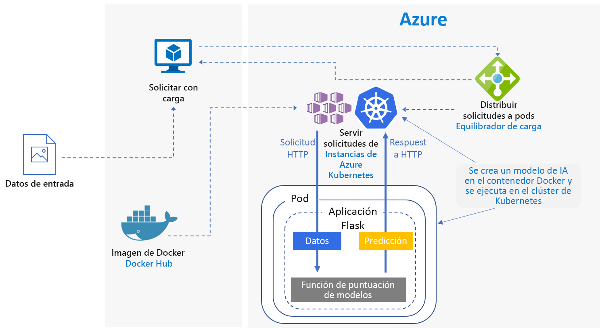
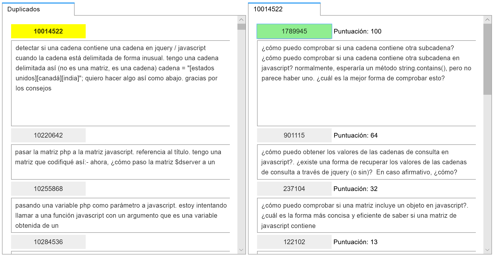
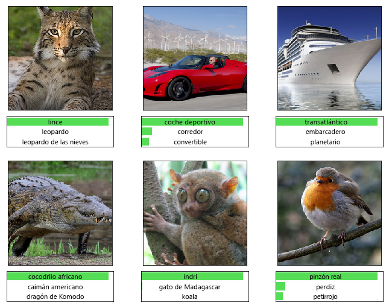

# Puntuación en tiempo real de Python Scikit-Learn y modelos de aprendizaje profundo en Azure

Esta arquitectura de referencia muestra cómo implementar modelos de Python como servicios web para realizar predicciones en tiempo real. Se tratan dos escenarios: la implementación de modelos de Python normales y los requisitos específicos de la implementación de modelos de aprendizaje profundo. Ambos escenarios utilizan la arquitectura que se muestra.

En GitHub hay disponibles dos implementaciones de referencia para esta arquitectura, una para los [modelos de Python normales][github-python] y otra para los [modelos de aprendizaje profundo][github-dl].

## Escenarios

Las implementaciones de referencia muestran dos escenarios que usan esta arquitectura.

**Escenario 1: coincidencia de preguntas más frecuentes**. En este escenario se muestra cómo implementar un modelo de coincidencia de preguntas frecuentes (P+F) coincidencia de modelo como un servicio web para proporcionar predicciones para las preguntas de los usuarios. En este escenario, en el diagrama de la arquitectura, "Input Data" hace referencia a las cadenas de texto que contienen las preguntas del usuario que coinciden con una lista de preguntas frecuentes. Este escenario está diseñado para la biblioteca de aprendizaje automático [scikit-learn][scikit] de Python, pero se puede generalizar a cualquier escenario que use modelos de Python para realizar predicciones en tiempo real.

Este escenario utiliza un subconjunto de datos de preguntas de Stack Overflow que incluye las preguntas originales etiquetadas como JavaScript, sus preguntas duplicadas y sus respuestas. Entrena a una canalización de scikit-learn para predecir la probabilidad de coincidencia de una pregunta duplicada con cada una de las respuestas originales. Dichas predicciones se realizan en tiempo real mediante un punto de conexión de API REST.

Este es el flujo de la aplicación para esta arquitectura:

1. El cliente envía una solicitud POST HTTP con los datos de la pregunta codificados.

2. La aplicación Flask extrae la pregunta de la solicitud.

3. La pregunta se envía al modelo de canalización de scikit-learn para obtener información acerca de sus características y puntuación.

4. Las preguntas más frecuentes coincidentes con sus puntuaciones se canalizan a un objeto JSON y se devuelven al cliente.

Esta es una captura de pantalla de la aplicación de ejemplo que consume los resultados:

**Escenario 2: clasificación de imágenes**. En este escenario se muestra cómo implementar un modelo de red neuronal convolucional (CNN) como un servicio web para proporcionar predicciones en imágenes. Para este escenario, en el diagrama de la arquitectura, "Input Data" hace referencia a los archivos de imagen. Los CNN son muy eficaces en Computer Vision para tareas como la clasificación de imágenes y la detección de objetos. Este escenario está diseñado para los marcos TensorFlow, Keras (con el back-end de TensorFlow) y PyTorch. Sin embargo, puede ser válido para cualquier escenario que use modelos de aprendizaje profundo para realizar predicciones en tiempo real.

Este escenario usa un modelo previamente entrenado ResNet-152 entrenado en el conjunto de datos ImageNet - 1K (1000 clases) para predecir a qué categoría (consulte la ilustración siguiente) pertenece una imagen. Dichas predicciones se realizan en tiempo real mediante un punto de conexión de API REST.

Este es el flujo de la aplicación para el modelo de aprendizaje profundo:

1. El cliente envía una solicitud POST HTTP con los datos de la imagen codificados.

2. La aplicación Flask extrae la imagen de la solicitud.

3. La imagen se preprocesa y se envía al modelo para su puntuación.

4. El resultado de dicha puntuación se canaliza a un objeto JSON y devuelve al cliente.

## Arquitectura

Esta arquitectura consta de los siguientes componentes.

**[Máquina virtual][vm]** (VM). La máquina virtual se muestra como ejemplo de dispositivo &mdash; local o en la nube &mdash; que puede enviar una solicitud HTTP.

**[Azure Kubernetes Service][aks]** (AKS) se usa para implementar la aplicación en un clúster de Kubernetes. AKS simplifica la implementación y las operaciones de Kubernetes. El clúster se puede configurar mediante máquinas virtuales de solo CPU para los modelos de Python normales o máquinas virtuales con GPU habilitado para modelos de aprendizaje profundo.

**[Equilibrador de carga][lb]**. Un equilibrador de carga, aprovisionado por AKS, se utiliza para exponer el servicio externamente. El tráfico del equilibrador de carga se dirige a los pods de back-end.

**[Docker Hub][docker]** se usa para almacenar la imagen de Docker que se implementa en un clúster de Kubernetes. Docker Hub se eligió para esta arquitectura porque es fácil de usar y porque es el repositorio de imágenes predeterminado para los usuarios de Docker. [Azure Container Registry][acr] también se puede usar para esta arquitectura.

## Consideraciones sobre rendimiento

Para las arquitecturas de puntuación en tiempo real, el rendimiento de la capacidad de proceso se convierte en una consideración dominante. En el caso de los modelos de Python normales, se suele aceptar que las CPU son suficientes para controlar la carga de trabajo.

Sin embargo, en el caso de las cargas de trabajo de aprendizaje profundo, cuando la velocidad es un cuello de botella, las GPU suelen proporcionar mayor [rendimiento][gpus-vs-cpus] que las CPU. Para igualar el rendimiento de la GPU mediante el uso de varias CPU, normalmente se necesita un clúster con un gran número de CPU.

Puede utilizar CPU para esta arquitectura en cualquier escenario, pero para los modelos de aprendizaje profundo, las GPU proporcionan valores de capacidad de proceso considerablemente superiores en comparación con un clúster de CPU cuyo costo sea parecido. AKS admite el uso de GPU, que es una ventaja de usar AKS para esta arquitectura. Además, las implementaciones de aprendizaje profundo suelen usar modelos con un gran número de parámetros. El uso de GPU evita la contención de recursos entre el modelo y el servicio web, lo que es un problema en las implementaciones de solo CPU.

## Consideraciones sobre escalabilidad

En el caso de los modelos de Python normales, donde el clúster de AKS se aprovisiona con máquinas virtuales que solo tienen CPU, tenga cuidado al [escalar horizontalmente el número de pods][manually-scale-pods]. El objetivo es usar completamente el clúster. El escalado depende de las solicitudes de CPU y de los límites definidos para los pods. Kubernetes también admite el [escalado automático][autoscale-pods] de los pods para ajustar el número de pods en una implementación en función del uso de la CPU o de otras métricas. El [escalador automático de clúster][autoscaler] (en versión preliminar) puede escalar nodos de agente en función de los pods que haya pendientes.

En los escenarios de aprendizaje profundo, mediante el uso de máquinas con GPU habilitadas, los límites de recursos en los pods son tales que se una GPU asigna a un pod. En función del tipo de máquina virtual utilizada, debe [escalar los nodos del clúster][scale-cluster] para satisfacer la demanda del servicio. Esto es algo que se puede hacer fácilmente mediante la CLI de Azure y kubectl.

## Consideraciones acerca de la supervisión y el registro

### Supervisión de AKS

Para ver el rendimiento de AKS, use la característica [Azure Monitor para contenedores][monitor-containers]. Dicha característica recopila métricas del procesador y de la memoria procedentes de los controladores, los nodos y los contenedores disponibles en Kubernetes mediante Metrics API.

Al implementar la aplicación, supervise el clúster de AKS para asegurarse de que funciona según lo previsto, todos los nodos están operativos y se ejecutan todos los pods. Aunque puede usar la herramienta de línea de comandos [kubectl][kubectl] para recuperar el estado de los pods, Kubernetes también incluye un panel web para la supervisión básica del estado y la administración del clúster.

Para ver el estado general del clúster y de los nodos, vaya a la sección **Nodes** (Nodos) del panel de Kubernetes. Si un nodo está inactivo o se ha producido un error, puede mostrar los registros de errores de esa página. De forma similar, vaya a las secciones **Pods** y **Deployments** (Implementaciones) para obtener información acerca del número de pods y del estado de la implementación.

### Registros de AKS

AKS registra automáticamente todos los stdout y stderr en los registros de los pods del clúster. Use kubectl para verlos, así como los eventos y registros a nivel de nodo. Para más información, consulte los pasos de implementación.

Use [Azure Monitor para contenedores][monitor-containers] para recopilar métricas y registros a través de una versión en contenedores del agente de Log Analytics para Linux, que se almacena en el área de trabajo de Log Analytics.

## Consideraciones sobre la seguridad

Use [Azure Security Center][security-center] para obtener una visión central del estado de la seguridad de sus recursos en Azure. Security Center supervisa los posibles problemas de seguridad y proporciona una imagen completa del estado de seguridad de su implementación, aunque no monitoriza los nodos de agente de AKS. El Centro de seguridad se configura por cada suscripción de Azure. Habilite la colección de datos de seguridad que se describe en [Guía de inicio rápido: incorporación de su suscripción de Azure al nivel Estándar de Security Center][get-started]. Una vez que habilite la recolección, el Centro de seguridad busca automáticamente las VM creadas en esa suscripción.

**Operaciones**. Para iniciar sesión en un clúster de AKS mediante el token de autenticación de Azure Active Directory (Azure AD), configurar AKS para usar Azure AD para la [autenticación del usuario][aad-auth]. Los administradores del clúster también pueden configurar el control de acceso basado en roles (RBAC) de Kubernetes en función de la identidad de los usuarios o su pertenencia a un grupo del directorio.

Utilice [RBAC][rbac] para controlar el acceso a los recursos de Azure que implemente. RBAC le permite asignar roles de autorización a los miembros de su equipo de DevOps. Un usuario se puede asignar a varios roles y es posible crear roles personalizados para una especificación aún más detallada de los [permisos].

**HTTPS**. Como procedimiento recomendado de seguridad, la aplicación debe exigir HTTPS y redirigir las solicitudes HTTP. Use un [controlador de entrada][ingress-controller] para implementar un proxy inverso que termina SSL y redirige las solicitudes HTTP. Para más información, consulte [Creación de un controlador de entrada HTTPS en Azure Kubernetes Service (AKS)][https-ingress].

**Autenticación**. Esta solución no restringe el acceso a los puntos de conexión. Para implementar la arquitectura en un entorno empresarial, proteja los puntos de conexión a través de claves de API y agregue algún tipo de autenticación de usuario a la aplicación cliente.

**Container registry**. Esta solución usa un registro público para almacenar la imagen de Docker. Tanto el código del que depende la aplicación como el modelo se encuentran en esta imagen. Las aplicaciones empresariales deben usar un registro privado como ayuda para protegerse de la ejecución de código malintencionado y para que la información del contenedor no corra peligro.

**DDoS Protection**. Considere la posibilidad de habilitar el [estándar de protección contra DDoS][ddos]. Aunque el servicio DDoS Protection básico se habilita como parte de la plataforma Azure, DDoS Protection Estándar proporciona funcionalidades de mitigación de riesgos ajustadas específicamente a los recursos de las redes virtuales de Azure.

**Registro**. Use los procedimientos recomendados antes de almacenar datos de registro, como limpiar las contraseñas de usuario y otra información que podría utilizarse para cometer fraudes de seguridad.

## Implementación

Para implementar esta arquitectura de referencia, siga los pasos descritos en el repositorio de GitHub:

- [Modelos de Python normales][github-python]
- [Modelos de aprendizaje profundo][github-dl]

<!-- links -->

[aad-auth]: /azure/aks/aad-integration
[acr]: /azure/container-registry/
[something]: https://kubernetes.io/docs/reference/access-authn-authz/authentication/
[aks]: /azure/aks/intro-kubernetes
[autoscaler]: /azure/aks/autoscaler
[autoscale-pods]: /azure/aks/tutorial-kubernetes-scale#autoscale-pods
[azcopy]: /azure/storage/common/storage-use-azcopy-linux
[ddos]: /azure/virtual-network/ddos-protection-overview
[docker]: https://hub.docker.com/
[get-started]: /azure/security-center/security-center-get-started
[github-python]: https://github.com/Azure/MLAKSDeployment
[github-dl]: https://github.com/Microsoft/AKSDeploymentTutorial
[gpus-vs-cpus]: https://azure.microsoft.com/en-us/blog/gpus-vs-cpus-for-deployment-of-deep-learning-models/
[https-ingress]: /azure/aks/ingress-tls
[ingress-controller]: https://kubernetes.io/docs/concepts/services-networking/ingress/
[kubectl]: https://kubernetes.io/docs/tasks/tools/install-kubectl/
[lb]: /azure/load-balancer/load-balancer-overview
[manually-scale-pods]: /azure/aks/tutorial-kubernetes-scale#manually-scale-pods
[monitor-containers]: /azure/monitoring/monitoring-container-insights-overview
[permisos]: /azure/aks/concepts-identity
[rbac]: /azure/active-directory/role-based-access-control-what-is
[scale-cluster]: /azure/aks/scale-cluster
[scikit]: https://pypi.org/project/scikit-learn/
[security-center]: /azure/security-center/security-center-intro
[vm]: /azure/virtual-machines/
