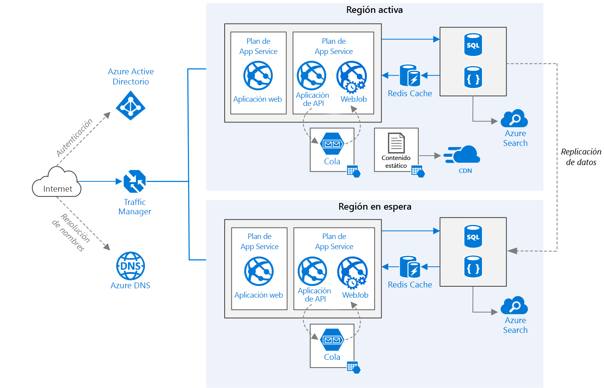

# <a name="run-a-web-application-in-multiple-regions"></a><span data-ttu-id="11d58-103">Ejecución de una aplicación web en varias regiones</span><span class="sxs-lookup"><span data-stu-id="11d58-103">Run a web application in multiple regions</span></span>
[!INCLUDE [header](../../_includes/header.md)]

<span data-ttu-id="11d58-104">Esta arquitectura de referencia muestra cómo ejecutar una aplicación de Azure App Service en varias regiones para lograr una alta disponibilidad.</span><span class="sxs-lookup"><span data-stu-id="11d58-104">This reference architecture shows how to run an Azure App Service application in multiple regions to achieve high availability.</span></span> 

 

<span data-ttu-id="11d58-106">*Descargue un [archivo Visio][visio-download] de esta arquitectura.*</span><span class="sxs-lookup"><span data-stu-id="11d58-106">*Download a [Visio file][visio-download] of this architecture.*</span></span>

## <a name="architecture"></a><span data-ttu-id="11d58-107">Arquitectura</span><span class="sxs-lookup"><span data-stu-id="11d58-107">Architecture</span></span> 

<span data-ttu-id="11d58-108">Esta arquitectura se basa en la que se muestra en [Improve scalability in a web application][guidance-web-apps-scalability] (Mejora de la escalabilidad en una aplicación web).</span><span class="sxs-lookup"><span data-stu-id="11d58-108">This architecture builds on the one shown in [Improve scalability in a web application][guidance-web-apps-scalability].</span></span> <span data-ttu-id="11d58-109">Las principales diferencias son:</span><span class="sxs-lookup"><span data-stu-id="11d58-109">The main differences are:</span></span>

* <span data-ttu-id="11d58-110">**Regiones primarias y secundarias**</span><span class="sxs-lookup"><span data-stu-id="11d58-110">**Primary and secondary regions**.</span></span> <span data-ttu-id="11d58-111">Esta arquitectura emplea dos regiones para lograr una mayor disponibilidad.</span><span class="sxs-lookup"><span data-stu-id="11d58-111">This architecture uses two regions to achieve higher availability.</span></span> <span data-ttu-id="11d58-112">La aplicación se implementa en cada región.</span><span class="sxs-lookup"><span data-stu-id="11d58-112">The application is deployed to each region.</span></span> <span data-ttu-id="11d58-113">Durante las operaciones normales, el tráfico de red se enruta a la región primaria.</span><span class="sxs-lookup"><span data-stu-id="11d58-113">During normal operations, network traffic is routed to the primary region.</span></span> <span data-ttu-id="11d58-114">Si la región primaria deja de estar disponible, el tráfico se enruta a la región secundaria.</span><span class="sxs-lookup"><span data-stu-id="11d58-114">If the primary region becomes unavailable, traffic is routed to the secondary region.</span></span> 
* <span data-ttu-id="11d58-115">**Azure DNS**.</span><span class="sxs-lookup"><span data-stu-id="11d58-115">**Azure DNS**.</span></span> <span data-ttu-id="11d58-116">[Azure DNS][azure-dns] es un servicio de hospedaje para dominios DNS que permite resolver nombres mediante la infraestructura de Microsoft Azure.</span><span class="sxs-lookup"><span data-stu-id="11d58-116">[Azure DNS][azure-dns] is a hosting service for DNS domains, providing name resolution using Microsoft Azure infrastructure.</span></span> <span data-ttu-id="11d58-117">Al hospedar dominios en Azure, puede administrar los registros DNS con las mismas credenciales, API, herramientas y facturación que con los demás servicios de Azure.</span><span class="sxs-lookup"><span data-stu-id="11d58-117">By hosting your domains in Azure, you can manage your DNS records using the same credentials, APIs, tools, and billing as your other Azure services.</span></span>
* <span data-ttu-id="11d58-118">**Azure Traffic Manager**.</span><span class="sxs-lookup"><span data-stu-id="11d58-118">**Azure Traffic Manager**.</span></span> <span data-ttu-id="11d58-119">[Traffic Manager][traffic-manager] enruta las solicitudes entrantes a la región primaria.</span><span class="sxs-lookup"><span data-stu-id="11d58-119">[Traffic Manager][traffic-manager] routes incoming requests to the primary region.</span></span> <span data-ttu-id="11d58-120">Si la aplicación que se ejecuta en dicha región no está disponible, Traffic Manager conmuta por error a la región secundaria.</span><span class="sxs-lookup"><span data-stu-id="11d58-120">If the application running that region becomes unavailable, Traffic Manager fails over to the secondary region.</span></span>
* <span data-ttu-id="11d58-121">**Replicación geográfica** de SQL Database y Cosmos DB.</span><span class="sxs-lookup"><span data-stu-id="11d58-121">**Geo-replication** of SQL Database and Cosmos DB.</span></span> 

<span data-ttu-id="11d58-122">Una arquitectura de varias regiones puede proporcionar una mayor disponibilidad que la implementación en una sola región.</span><span class="sxs-lookup"><span data-stu-id="11d58-122">A multi-region architecture can provide higher availability than deploying to a single region.</span></span> <span data-ttu-id="11d58-123">Si una interrupción regional afecta a la región primaria, puede usar [Traffic Manager][traffic-manager] para conmutar por error en la región secundaria.</span><span class="sxs-lookup"><span data-stu-id="11d58-123">If a regional outage affects the primary region, you can use [Traffic Manager][traffic-manager] to fail over to the secondary region.</span></span> <span data-ttu-id="11d58-124">Esta arquitectura también puede ayudar si un determinado subsistema de la aplicación produce un error.</span><span class="sxs-lookup"><span data-stu-id="11d58-124">This architecture can also help if an individual subsystem of the application fails.</span></span>

<span data-ttu-id="11d58-125">Existen varios enfoques generales para lograr una alta disponibilidad en regiones:</span><span class="sxs-lookup"><span data-stu-id="11d58-125">There are several general approaches to achieving high availability across regions:</span></span> 

* <span data-ttu-id="11d58-126">Activo/pasivo con espera activa.</span><span class="sxs-lookup"><span data-stu-id="11d58-126">Active/passive with hot standby.</span></span> <span data-ttu-id="11d58-127">Un tráfico se dirige a una región, mientras el otro se encuentra en espera activa.</span><span class="sxs-lookup"><span data-stu-id="11d58-127">Traffic goes to one region, while the other waits on hot standby.</span></span> <span data-ttu-id="11d58-128">Espera activa significa que las máquinas virtuales de la región secundaria están siempre asignadas y en funcionamiento.</span><span class="sxs-lookup"><span data-stu-id="11d58-128">Hot standby means the VMs in the secondary region are allocated and running at all times.</span></span>
* <span data-ttu-id="11d58-129">Activo/pasivo con espera pasiva.</span><span class="sxs-lookup"><span data-stu-id="11d58-129">Active/passive with cold standby.</span></span> <span data-ttu-id="11d58-130">El tráfico se dirige a una región, mientras el otro se encuentra en espera pasiva.</span><span class="sxs-lookup"><span data-stu-id="11d58-130">Traffic goes to one region, while the other waits on cold standby.</span></span> <span data-ttu-id="11d58-131">Espera pasiva significa que las máquinas virtuales de la región secundaria no se asignan hasta que son necesarias para una conmutación por error.</span><span class="sxs-lookup"><span data-stu-id="11d58-131">Cold standby means the VMs in the secondary region are not allocated until needed for failover.</span></span> <span data-ttu-id="11d58-132">Este enfoque tiene un coste menor de ejecución, pero generalmente tarda más en ponerse en línea durante un error.</span><span class="sxs-lookup"><span data-stu-id="11d58-132">This approach costs less to run, but will generally take longer to come online during a failure.</span></span>
* <span data-ttu-id="11d58-133">Activo/activo.</span><span class="sxs-lookup"><span data-stu-id="11d58-133">Active/active.</span></span> <span data-ttu-id="11d58-134">Ambas regiones están activas y se equilibra la carga de las solicitudes entre ellas.</span><span class="sxs-lookup"><span data-stu-id="11d58-134">Both regions are active, and requests are load balanced between them.</span></span> <span data-ttu-id="11d58-135">Si una región no está disponible, se saca de la rotación.</span><span class="sxs-lookup"><span data-stu-id="11d58-135">If one region becomes unavailable, it is taken out of rotation.</span></span> 

<span data-ttu-id="11d58-136">Esta arquitectura de referencia se centra en el enfoque activo/pasivo con espera activa y usa Traffic Manager para la conmutación por error.</span><span class="sxs-lookup"><span data-stu-id="11d58-136">This reference architecture focuses on active/passive with hot standby, using Traffic Manager for failover.</span></span> 


## <a name="recommendations"></a><span data-ttu-id="11d58-137">Recomendaciones</span><span class="sxs-lookup"><span data-stu-id="11d58-137">Recommendations</span></span>

<span data-ttu-id="11d58-138">Los requisitos pueden diferir de los de la arquitectura que se describe aquí.</span><span class="sxs-lookup"><span data-stu-id="11d58-138">Your requirements might differ from the architecture described here.</span></span> <span data-ttu-id="11d58-139">Use las recomendaciones de esta sección como punto de partida.</span><span class="sxs-lookup"><span data-stu-id="11d58-139">Use the recommendations in this section as a starting point.</span></span>

### <a name="regional-pairing"></a><span data-ttu-id="11d58-140">Emparejamiento regional</span><span class="sxs-lookup"><span data-stu-id="11d58-140">Regional pairing</span></span>
<span data-ttu-id="11d58-141">Cada región de Azure se empareja con otra región de la misma zona geográfica.</span><span class="sxs-lookup"><span data-stu-id="11d58-141">Each Azure region is paired with another region within the same geography.</span></span> <span data-ttu-id="11d58-142">En general, elija regiones del mismo par de regional (por ejemplo, Este de EE. UU. 2 y Centro de EE. UU.).</span><span class="sxs-lookup"><span data-stu-id="11d58-142">In general, choose regions from the same regional pair (for example, East US 2 and Central US).</span></span> <span data-ttu-id="11d58-143">Las ventajas de hacerlo son:</span><span class="sxs-lookup"><span data-stu-id="11d58-143">Benefits of doing so include:</span></span>

* <span data-ttu-id="11d58-144">Si se produce una interrupción prolongada, se establece como prioridad la recuperación de al menos una región de cada par.</span><span class="sxs-lookup"><span data-stu-id="11d58-144">If there is a broad outage, recovery of at least one region out of every pair is prioritized.</span></span>
* <span data-ttu-id="11d58-145">Las actualizaciones planeadas del sistema de Azure se implementan en las regiones emparejadas de manera secuencial para reducir el posible tiempo de inactividad.</span><span class="sxs-lookup"><span data-stu-id="11d58-145">Planned Azure system updates are rolled out to paired regions sequentially to minimize possible downtime.</span></span>
* <span data-ttu-id="11d58-146">En la mayoría de los casos, los pares regionales residen en la misma zona geográfica para cumplir los requisitos de residencia de datos.</span><span class="sxs-lookup"><span data-stu-id="11d58-146">In most cases, regional pairs reside within the same geography to meet data residency requirements.</span></span>

<span data-ttu-id="11d58-147">Sin embargo, asegúrese de que ambas regiones admitan todos los servicios de Azure necesarios para la aplicación.</span><span class="sxs-lookup"><span data-stu-id="11d58-147">However, make sure that both regions support all of the Azure services needed for your application.</span></span> <span data-ttu-id="11d58-148">Consulte [Servicios por región][services-by-region].</span><span class="sxs-lookup"><span data-stu-id="11d58-148">See [Services by region][services-by-region].</span></span> <span data-ttu-id="11d58-149">Para más información sobre los pares regionales, consulte [Continuidad empresarial y recuperación ante desastres (BCDR): regiones emparejadas de Azure][regional-pairs].</span><span class="sxs-lookup"><span data-stu-id="11d58-149">For more information about regional pairs, see [Business continuity and disaster recovery (BCDR): Azure Paired Regions][regional-pairs].</span></span>

### <a name="resource-groups"></a><span data-ttu-id="11d58-150">Grupos de recursos</span><span class="sxs-lookup"><span data-stu-id="11d58-150">Resource groups</span></span>
<span data-ttu-id="11d58-151">Considere la posibilidad de colocar la región primaria, la región secundaria y Traffic Manager en diferentes [grupos de recursos][resource groups].</span><span class="sxs-lookup"><span data-stu-id="11d58-151">Consider placing the primary region, secondary region, and Traffic Manager into separate [resource groups][resource groups].</span></span> <span data-ttu-id="11d58-152">De esta forma, podrá administrar los recursos implementados en cada región como una sola colección.</span><span class="sxs-lookup"><span data-stu-id="11d58-152">This lets you manage the resources deployed to each region as a single collection.</span></span>

### <a name="traffic-manager-configuration"></a><span data-ttu-id="11d58-153">Configuración de Traffic Manager</span><span class="sxs-lookup"><span data-stu-id="11d58-153">Traffic Manager configuration</span></span> 

<span data-ttu-id="11d58-154">**Enrutamiento**.</span><span class="sxs-lookup"><span data-stu-id="11d58-154">**Routing**.</span></span> <span data-ttu-id="11d58-155">Traffic Manager admite varios [algoritmos de enrutamiento][tm-routing].</span><span class="sxs-lookup"><span data-stu-id="11d58-155">Traffic Manager supports several [routing algorithms][tm-routing].</span></span> <span data-ttu-id="11d58-156">Para el escenario descrito en este artículo, use el enrutamiento de *prioridad* (anteriormente conocido como enrutamiento de *conmutación por error*).</span><span class="sxs-lookup"><span data-stu-id="11d58-156">For the scenario described in this article, use *priority* routing (formerly called *failover* routing).</span></span> <span data-ttu-id="11d58-157">Con esta configuración, Traffic Manager envía todas las solicitudes a la región primaria, a menos que el punto de conexión de esa región se vuelva inaccesible.</span><span class="sxs-lookup"><span data-stu-id="11d58-157">With this setting, Traffic Manager sends all requests to the primary region unless the endpoint for that region becomes unreachable.</span></span> <span data-ttu-id="11d58-158">En ese momento, conmuta por error automáticamente a la región secundaria.</span><span class="sxs-lookup"><span data-stu-id="11d58-158">At that point, it automatically fails over to the secondary region.</span></span> <span data-ttu-id="11d58-159">Consulte [Configuración del método de conmutación por error][tm-configure-failover].</span><span class="sxs-lookup"><span data-stu-id="11d58-159">See [Configure Failover routing method][tm-configure-failover].</span></span>

<span data-ttu-id="11d58-160">**Sondeo de mantenimiento**.</span><span class="sxs-lookup"><span data-stu-id="11d58-160">**Health probe**.</span></span> <span data-ttu-id="11d58-161">Traffic Manager usa un sondeo HTTP (o HTTPS) para supervisar la disponibilidad de cada punto de conexión.</span><span class="sxs-lookup"><span data-stu-id="11d58-161">Traffic Manager uses an HTTP (or HTTPS) probe to monitor the availability of each endpoint.</span></span> <span data-ttu-id="11d58-162">El sondeo proporciona a Traffic Manager una prueba de acierto/error para conmutar por error a la región secundaria.</span><span class="sxs-lookup"><span data-stu-id="11d58-162">The probe gives Traffic Manager a pass/fail test for failing over to the secondary region.</span></span> <span data-ttu-id="11d58-163">Funciona mediante el envío de una solicitud a la ruta de acceso de una dirección URL especificada.</span><span class="sxs-lookup"><span data-stu-id="11d58-163">It works by sending a request to a specified URL path.</span></span> <span data-ttu-id="11d58-164">Si recibe una respuesta distinta de 200 dentro de un período de tiempo de espera, el sondeo produce un error.</span><span class="sxs-lookup"><span data-stu-id="11d58-164">If it gets a non-200 response within a timeout period, the probe fails.</span></span> <span data-ttu-id="11d58-165">Después de cuatro solicitudes con error, Traffic Manager marca el punto de conexión como degradado y conmuta por error al otro punto de conexión.</span><span class="sxs-lookup"><span data-stu-id="11d58-165">After four failed requests, Traffic Manager marks the endpoint as degraded and fails over to the other endpoint.</span></span> <span data-ttu-id="11d58-166">Para más información, consulte [Supervisión de puntos de conexión y conmutación por error de Traffic Manager][tm-monitoring].</span><span class="sxs-lookup"><span data-stu-id="11d58-166">For details, see [Traffic Manager endpoint monitoring and failover][tm-monitoring].</span></span>

<span data-ttu-id="11d58-167">Como procedimiento recomendado, cree un punto de conexión de sondeo de estado que indique el estado general de la aplicación y úselo para el sondeo de estado.</span><span class="sxs-lookup"><span data-stu-id="11d58-167">As a best practice, create a health probe endpoint that reports the overall health of the application and use this endpoint for the health probe.</span></span> <span data-ttu-id="11d58-168">El punto de conexión debe comprobar dependencias críticas, como las aplicaciones de App Service, Storage Queue y SQL Database.</span><span class="sxs-lookup"><span data-stu-id="11d58-168">The endpoint should check critical dependencies such as the App Service apps, storage queue, and SQL Database.</span></span> <span data-ttu-id="11d58-169">En caso contrario, el sondeo podría informar de un punto de conexión correcto cuando realmente se producen errores en partes críticas de la aplicación.</span><span class="sxs-lookup"><span data-stu-id="11d58-169">Otherwise, the probe might report a healthy endpoint when critical parts of the application are actually failing.</span></span>

<span data-ttu-id="11d58-170">Por otro lado, no use el sondeo de estado para comprobar los servicios de prioridad inferior.</span><span class="sxs-lookup"><span data-stu-id="11d58-170">On the other hand, don't use the health probe to check lower priority services.</span></span> <span data-ttu-id="11d58-171">Por ejemplo, si un servicio de correo electrónico queda fuera de servicio, la aplicación puede cambiar a un segundo proveedor o simplemente enviar los mensajes de correo electrónico más tarde.</span><span class="sxs-lookup"><span data-stu-id="11d58-171">For example, if an email service goes down the application can switch to a second provider or just send emails later.</span></span> <span data-ttu-id="11d58-172">Esta no es una prioridad lo suficientemente alta como para provocar que la aplicación conmute por error.</span><span class="sxs-lookup"><span data-stu-id="11d58-172">This is not a high enough priority to cause the application to fail over.</span></span> <span data-ttu-id="11d58-173">Para más información, consulte [Health Endpoint Monitoring Pattern][health-endpoint-monitoring-pattern] (Patrón Health Endpoint Monitoring).</span><span class="sxs-lookup"><span data-stu-id="11d58-173">For more information, see [Health Endpoint Monitoring Pattern][health-endpoint-monitoring-pattern].</span></span>
 
### <a name="sql-database"></a><span data-ttu-id="11d58-174">SQL Database</span><span class="sxs-lookup"><span data-stu-id="11d58-174">SQL Database</span></span>
<span data-ttu-id="11d58-175">Use la [replicación geográfica activa][sql-replication] para crear una réplica secundaria legible en una región distinta.</span><span class="sxs-lookup"><span data-stu-id="11d58-175">Use [Active Geo-Replication][sql-replication] to create a readable secondary replica in a different region.</span></span> <span data-ttu-id="11d58-176">Puede tener hasta cuatro réplicas secundarias legibles.</span><span class="sxs-lookup"><span data-stu-id="11d58-176">You can have up to four readable secondary replicas.</span></span> <span data-ttu-id="11d58-177">Conmute por error a una base de datos secundaria si la base de datos principal da error o debe desconectarse.</span><span class="sxs-lookup"><span data-stu-id="11d58-177">Fail over to a secondary database if your primary database fails or needs to be taken offline.</span></span> <span data-ttu-id="11d58-178">La replicación geográfica activa puede configurarse para cualquier base de datos de cualquier grupo de bases de datos elásticas.</span><span class="sxs-lookup"><span data-stu-id="11d58-178">Active Geo-Replication can be configured for any database in any elastic database pool.</span></span>

### <a name="cosmos-db"></a><span data-ttu-id="11d58-179">Cosmos DB</span><span class="sxs-lookup"><span data-stu-id="11d58-179">Cosmos DB</span></span>
<span data-ttu-id="11d58-180">Cosmos DB admite la replicación geográfica entre regiones.</span><span class="sxs-lookup"><span data-stu-id="11d58-180">Cosmos DB supports geo-replication across regions.</span></span> <span data-ttu-id="11d58-181">Una región se designa como de escritura y los demás son réplicas de solo lectura.</span><span class="sxs-lookup"><span data-stu-id="11d58-181">One region is designated as writable and the others are read-only replicas.</span></span>

<span data-ttu-id="11d58-182">Si se produce una interrupción regional del sistema, puede conmutar por error y seleccionar otra región como la región de escritura.</span><span class="sxs-lookup"><span data-stu-id="11d58-182">If there is a regional outage, you can fail over by selecting another region to be the write region.</span></span> <span data-ttu-id="11d58-183">El SDK de cliente envía automáticamente las solicitudes de escritura a la región de escritura actual, por lo que no es necesario actualizar la configuración del cliente después de una conmutación por error.</span><span class="sxs-lookup"><span data-stu-id="11d58-183">The client SDK automatically sends write requests to the current write region, so you don't need to update the client configuration after a failover.</span></span> <span data-ttu-id="11d58-184">Para más información, consulte [Cómo se distribuyen datos globalmente con Azure Cosmos DB][cosmosdb-geo].</span><span class="sxs-lookup"><span data-stu-id="11d58-184">For more information, see [How to distribute data globally with Azure Cosmos DB][cosmosdb-geo].</span></span>

> [!NOTE]
> <span data-ttu-id="11d58-185">Todas las réplicas pertenecen al mismo grupo de recursos.</span><span class="sxs-lookup"><span data-stu-id="11d58-185">All of the replicas belong to the same resource group.</span></span>
>
>

### <a name="storage"></a><span data-ttu-id="11d58-186">Storage</span><span class="sxs-lookup"><span data-stu-id="11d58-186">Storage</span></span>
<span data-ttu-id="11d58-187">Para Azure Storage, use [almacenamiento con redundancia geográfica con acceso de lectura][ra-grs] (RA-GRS).</span><span class="sxs-lookup"><span data-stu-id="11d58-187">For Azure Storage, use [read-access geo-redundant storage][ra-grs] (RA-GRS).</span></span> <span data-ttu-id="11d58-188">Con el almacenamiento RA-GRS, los datos se replican en una región secundaria.</span><span class="sxs-lookup"><span data-stu-id="11d58-188">With RA-GRS storage, the data is replicated to a secondary region.</span></span> <span data-ttu-id="11d58-189">Tiene acceso de solo lectura a los datos de la región secundaria mediante un punto de conexión independiente.</span><span class="sxs-lookup"><span data-stu-id="11d58-189">You have read-only access to the data in the secondary region through a separate endpoint.</span></span> <span data-ttu-id="11d58-190">Si se produce una interrupción regional o una situación de desastre, el equipo de Azure Storage puede decidir realizar una conmutación por error geográfica a la región secundaria.</span><span class="sxs-lookup"><span data-stu-id="11d58-190">If there is a regional outage or disaster, the Azure Storage team might decide to perform a geo-failover to the secondary region.</span></span> <span data-ttu-id="11d58-191">En este caso, no es necesario que el cliente intervenga de ninguna forma.</span><span class="sxs-lookup"><span data-stu-id="11d58-191">There is no customer action required for this failover.</span></span>

<span data-ttu-id="11d58-192">Para Queue Storage, cree una cola de copia de seguridad en la región secundaria.</span><span class="sxs-lookup"><span data-stu-id="11d58-192">For Queue storage, create a backup queue in the secondary region.</span></span> <span data-ttu-id="11d58-193">Durante la conmutación por error, la aplicación puede usar la cola de copia de seguridad hasta que la región primaria vuelva a estar disponible.</span><span class="sxs-lookup"><span data-stu-id="11d58-193">During failover, the app can use the backup queue until the primary region becomes available again.</span></span> <span data-ttu-id="11d58-194">De este modo, la aplicación puede seguir procesando nuevas solicitudes.</span><span class="sxs-lookup"><span data-stu-id="11d58-194">That way, the application can still process new requests.</span></span>

## <a name="availability-considerations"></a><span data-ttu-id="11d58-195">Consideraciones sobre disponibilidad</span><span class="sxs-lookup"><span data-stu-id="11d58-195">Availability considerations</span></span>


### <a name="traffic-manager"></a><span data-ttu-id="11d58-196">Traffic Manager</span><span class="sxs-lookup"><span data-stu-id="11d58-196">Traffic Manager</span></span>

<span data-ttu-id="11d58-197">Traffic Manager conmuta por error automáticamente si la región primaria deja de estar disponible.</span><span class="sxs-lookup"><span data-stu-id="11d58-197">Traffic Manager automatically fails over if the primary region becomes unavailable.</span></span> <span data-ttu-id="11d58-198">Cuando Traffic Manager conmuta por error, hay un período de tiempo en que los clientes no pueden comunicarse con la aplicación.</span><span class="sxs-lookup"><span data-stu-id="11d58-198">When Traffic Manager fails over, there is a period of time when clients cannot reach the application.</span></span> <span data-ttu-id="11d58-199">La duración viene determinada por los siguientes factores:</span><span class="sxs-lookup"><span data-stu-id="11d58-199">The duration is affected by the following factors:</span></span>

* <span data-ttu-id="11d58-200">El sondeo de estado debe detectar que el centro de datos principal se ha vuelto inaccesible.</span><span class="sxs-lookup"><span data-stu-id="11d58-200">The health probe must detect that the primary data center has become unreachable.</span></span>
* <span data-ttu-id="11d58-201">Los servidores del servicio de nombres de dominio (DNS) deben actualizar los registros DNS almacenados en caché con la dirección IP, lo cual depende del período de vida (TTL) de DNS.</span><span class="sxs-lookup"><span data-stu-id="11d58-201">Domain name service (DNS) servers must update the cached DNS records for the IP address, which depends on the DNS time-to-live (TTL).</span></span> <span data-ttu-id="11d58-202">El TTL predeterminado es de 300 segundos (5 minutos), pero puede configurar este valor al crear el perfil de Traffic Manager.</span><span class="sxs-lookup"><span data-stu-id="11d58-202">The default TTL is 300 seconds (5 minutes), but you can configure this value when you create the Traffic Manager profile.</span></span>

<span data-ttu-id="11d58-203">Para más información, consulte [Acerca de la supervisión de Traffic Manager][tm-monitoring].</span><span class="sxs-lookup"><span data-stu-id="11d58-203">For details, see [About Traffic Manager Monitoring][tm-monitoring].</span></span>

<span data-ttu-id="11d58-204">Traffic Manager es un posible punto de error en el sistema.</span><span class="sxs-lookup"><span data-stu-id="11d58-204">Traffic Manager is a possible failure point in the system.</span></span> <span data-ttu-id="11d58-205">Si el servicio no funciona, los clientes no pueden acceder a la aplicación durante el tiempo de inactividad.</span><span class="sxs-lookup"><span data-stu-id="11d58-205">If the service fails, clients cannot access your application during the downtime.</span></span> <span data-ttu-id="11d58-206">Revise el [Acuerdo de Nivel de Servicio (SLA) de Traffic Manager] [tm-sla] y determine si el uso de Traffic Manager por sí solo cumple sus requisitos empresariales de alta disponibilidad.</span><span class="sxs-lookup"><span data-stu-id="11d58-206">Review the [Traffic Manager service level agreement (SLA)][tm-sla] and determine whether using Traffic Manager alone meets your business requirements for high availability.</span></span> <span data-ttu-id="11d58-207">Si no es así, considere la posibilidad de agregar otra solución de administración de tráfico como conmutación por recuperación.</span><span class="sxs-lookup"><span data-stu-id="11d58-207">If not, consider adding another traffic management solution as a failback.</span></span> <span data-ttu-id="11d58-208">Si el servicio Azure Traffic Manager no funciona, cambie los registros de nombre canónico (CNAME) en DNS para que apunten a otro servicio de administración del tráfico.</span><span class="sxs-lookup"><span data-stu-id="11d58-208">If the Azure Traffic Manager service fails, change your canonical name (CNAME) records in DNS to point to the other traffic management service.</span></span> <span data-ttu-id="11d58-209">Este paso debe realizarse manualmente, y la aplicación dejará de estar disponible hasta que se propaguen los cambios de DNS.</span><span class="sxs-lookup"><span data-stu-id="11d58-209">This step must be performed manually, and your application will be unavailable until the DNS changes are propagated.</span></span>

### <a name="sql-database"></a><span data-ttu-id="11d58-210">SQL Database</span><span class="sxs-lookup"><span data-stu-id="11d58-210">SQL Database</span></span>
<span data-ttu-id="11d58-211">El objetivo de punto de recuperación (RPO) y el tiempo de recuperación estimado (ERT) de SQL Database se documentan en [Introducción a la continuidad empresarial con Azure SQL Database][sql-rpo].</span><span class="sxs-lookup"><span data-stu-id="11d58-211">The recovery point objective (RPO) and estimated recovery time (ERT) for SQL Database are documented in [Overview of business continuity with Azure SQL Database][sql-rpo].</span></span> 

### <a name="storage"></a><span data-ttu-id="11d58-212">Storage</span><span class="sxs-lookup"><span data-stu-id="11d58-212">Storage</span></span>
<span data-ttu-id="11d58-213">RA-GRS proporciona almacenamiento duradero, pero es importante comprender lo que sucede durante una interrupción:</span><span class="sxs-lookup"><span data-stu-id="11d58-213">RA-GRS storage provides durable storage, but it's important to understand what can happen during an outage:</span></span>

* <span data-ttu-id="11d58-214">Si se produce una interrupción en el almacenamiento, habrá un período de tiempo en que no tenga acceso de escritura a los datos.</span><span class="sxs-lookup"><span data-stu-id="11d58-214">If a storage outage occurs, there will be a period of time when you don't have write-access to the data.</span></span> <span data-ttu-id="11d58-215">Aún así, puede leer desde el punto de conexión secundario durante la interrupción.</span><span class="sxs-lookup"><span data-stu-id="11d58-215">You can still read from the secondary endpoint during the outage.</span></span>
* <span data-ttu-id="11d58-216">Si una interrupción regional o una situación de desastre afecta a la ubicación principal y no se pueden recuperar los datos, el equipo de Azure Storage puede decidir realizar una conmutación por error geográfica a la región secundaria.</span><span class="sxs-lookup"><span data-stu-id="11d58-216">If a regional outage or disaster affects the primary location and the data there cannot be recovered, the Azure Storage team may decide to perform a geo-failover to the secondary region.</span></span>
* <span data-ttu-id="11d58-217">La replicación de datos en la región secundaria se realiza de forma asincrónica.</span><span class="sxs-lookup"><span data-stu-id="11d58-217">Data replication to the secondary region is performed asynchronously.</span></span> <span data-ttu-id="11d58-218">Por lo tanto, si se realiza una conmutación por error geográfica, podría haber alguna pérdida de datos si los datos no se pueden recuperar de la región primaria.</span><span class="sxs-lookup"><span data-stu-id="11d58-218">Therefore, if a geo-failover is performed, some data loss is possible if the data can't be recovered from the primary region.</span></span>
* <span data-ttu-id="11d58-219">Los errores transitorios, como una interrupción de la red, no desencadenarán una conmutación por error de almacenamiento.</span><span class="sxs-lookup"><span data-stu-id="11d58-219">Transient failures, such as a network outage, will not trigger a storage failover.</span></span> <span data-ttu-id="11d58-220">Diseñe la aplicación para que sea resistente a los errores transitorios.</span><span class="sxs-lookup"><span data-stu-id="11d58-220">Design your application to be resilient to transient failures.</span></span> <span data-ttu-id="11d58-221">Posibles remedios:</span><span class="sxs-lookup"><span data-stu-id="11d58-221">Possible mitigations:</span></span>
  
  * <span data-ttu-id="11d58-222">Realizar las operaciones de lectura desde la región secundaria.</span><span class="sxs-lookup"><span data-stu-id="11d58-222">Read from the secondary region.</span></span>
  * <span data-ttu-id="11d58-223">Cambiar temporalmente a otra cuenta de almacenamiento con nuevas operaciones de escritura (por ejemplo, poner en cola los mensajes).</span><span class="sxs-lookup"><span data-stu-id="11d58-223">Temporarily switch to another storage account for new write operations (for example, to queue messages).</span></span>
  * <span data-ttu-id="11d58-224">Copiar los datos de la región secundaria a otra cuenta de almacenamiento.</span><span class="sxs-lookup"><span data-stu-id="11d58-224">Copy data from the secondary region to another storage account.</span></span>
  * <span data-ttu-id="11d58-225">Proporcionan funcionalidad reducida hasta que el sistema con errores conmute por recuperación.</span><span class="sxs-lookup"><span data-stu-id="11d58-225">Provide reduced functionality until the system fails back.</span></span>

<span data-ttu-id="11d58-226">Para más información, consulte [Qué hacer si se produce una interrupción del servicio Azure Storage][storage-outage].</span><span class="sxs-lookup"><span data-stu-id="11d58-226">For more information, see [What to do if an Azure Storage outage occurs][storage-outage].</span></span>

## <a name="manageability-considerations"></a><span data-ttu-id="11d58-227">Consideraciones sobre manejabilidad</span><span class="sxs-lookup"><span data-stu-id="11d58-227">Manageability Considerations</span></span>

### <a name="traffic-manager"></a><span data-ttu-id="11d58-228">Traffic Manager</span><span class="sxs-lookup"><span data-stu-id="11d58-228">Traffic Manager</span></span>

<span data-ttu-id="11d58-229">Si Traffic Manager conmuta por error, se recomienda realizar una conmutación por recuperación manual en lugar de implementar una automática.</span><span class="sxs-lookup"><span data-stu-id="11d58-229">If Traffic Manager fails over, we recommend performing a manual failback rather than implementing an automatic failback.</span></span> <span data-ttu-id="11d58-230">En caso contrario, puede crear una situación donde la aplicación va y viene incesantemente entre regiones.</span><span class="sxs-lookup"><span data-stu-id="11d58-230">Otherwise, you can create a situation where the application flips back and forth between regions.</span></span> <span data-ttu-id="11d58-231">Compruebe que todos los subsistemas de aplicación tengan un estado correcto antes de la conmutación por recuperación.</span><span class="sxs-lookup"><span data-stu-id="11d58-231">Verify that all application subsystems are healthy before failing back.</span></span>

<span data-ttu-id="11d58-232">Tenga en cuenta que Traffic Manager conmuta por recuperación automáticamente de forma predeterminada.</span><span class="sxs-lookup"><span data-stu-id="11d58-232">Note that Traffic Manager automatically fails back by default.</span></span> <span data-ttu-id="11d58-233">Para evitar esto, reduzca manualmente la prioridad de la región primaria después de un evento de conmutación por error.</span><span class="sxs-lookup"><span data-stu-id="11d58-233">To prevent this, manually lower the priority of the primary region after a failover event.</span></span> <span data-ttu-id="11d58-234">Por ejemplo, suponga que la región primaria tiene la prioridad 1 y la secundaria la prioridad 2.</span><span class="sxs-lookup"><span data-stu-id="11d58-234">For example, suppose the primary region is priority 1 and the secondary is priority 2.</span></span> <span data-ttu-id="11d58-235">Después de una conmutación por error, establezca la región primaria en la prioridad 3 para evitar la conmutación por recuperación automática.</span><span class="sxs-lookup"><span data-stu-id="11d58-235">After a failover, set the primary region to priority 3, to prevent automatic failback.</span></span> <span data-ttu-id="11d58-236">Cuando esté listo para cambiar de nuevo, actualice la prioridad a 1.</span><span class="sxs-lookup"><span data-stu-id="11d58-236">When you are ready to switch back, update the priority to 1.</span></span>

<span data-ttu-id="11d58-237">Los siguientes comandos actualizan la prioridad.</span><span class="sxs-lookup"><span data-stu-id="11d58-237">The following commands update the priority.</span></span>

<span data-ttu-id="11d58-238">**PowerShell**</span><span class="sxs-lookup"><span data-stu-id="11d58-238">**PowerShell**</span></span>

```bat
$endpoint = Get-AzureRmTrafficManagerEndpoint -Name <endpoint> -ProfileName <profile> -ResourceGroupName <resource-group> -Type AzureEndpoints
$endpoint.Priority = 3
Set-AzureRmTrafficManagerEndpoint -TrafficManagerEndpoint $endpoint
```

<span data-ttu-id="11d58-239">Para más información, consulte [Cmdlets de Azure Traffic Manager][tm-ps].</span><span class="sxs-lookup"><span data-stu-id="11d58-239">For more information, see [Azure Traffic Manager Cmdlets][tm-ps].</span></span>

<span data-ttu-id="11d58-240">**Interfaz de la línea de comandos (CLI) de Azure**</span><span class="sxs-lookup"><span data-stu-id="11d58-240">**Azure command line interface (CLI)**</span></span>

```bat
azure network traffic-manager endpoint set --name <endpoint> --profile-name <profile> --resource-group <resource-group> --type AzureEndpoints --priority 3
```    

### <a name="sql-database"></a><span data-ttu-id="11d58-241">SQL Database</span><span class="sxs-lookup"><span data-stu-id="11d58-241">SQL Database</span></span>
<span data-ttu-id="11d58-242">Si se produce un error en la base de datos principal, realice una conmutación por error manual a la base de datos secundaria.</span><span class="sxs-lookup"><span data-stu-id="11d58-242">If the primary database fails, perform a manual failover to the secondary database.</span></span> <span data-ttu-id="11d58-243">Consulte [Restauración de una base de datos SQL de Azure o una conmutación por error en una secundaria][sql-failover].</span><span class="sxs-lookup"><span data-stu-id="11d58-243">See [Restore an Azure SQL Database or failover to a secondary][sql-failover].</span></span> <span data-ttu-id="11d58-244">La base de datos secundaria sigue siendo de solo lectura hasta que se realiza la conmutación por error.</span><span class="sxs-lookup"><span data-stu-id="11d58-244">The secondary database remains read-only until you fail over.</span></span>


<!-- links -->

[azure-sql-db]: https://azure.microsoft.com/documentation/services/sql-database/
[azure-dns]: /azure/dns/dns-overview
[cosmosdb-geo]: /azure/cosmos-db/distribute-data-globally
[guidance-web-apps-scalability]: ./scalable-web-app.md
[health-endpoint-monitoring-pattern]: https://msdn.microsoft.com/library/dn589789.aspx
[ra-grs]: /azure/storage/storage-redundancy#read-access-geo-redundant-storage
[regional-pairs]: /azure/best-practices-availability-paired-regions
[resource groups]: /azure/azure-resource-manager/resource-group-overview#resource-groups
[services-by-region]: https://azure.microsoft.com/regions/#services
[sql-failover]: /azure/sql-database/sql-database-disaster-recovery
[sql-replication]: /azure/sql-database/sql-database-geo-replication-overview
[sql-rpo]: /azure/sql-database/sql-database-business-continuity#sql-database-features-that-you-can-use-to-provide-business-continuity
[storage-outage]: /azure/storage/storage-disaster-recovery-guidance
[tm-configure-failover]: /azure/traffic-manager/traffic-manager-configure-failover-routing-method
[tm-monitoring]: /azure/traffic-manager/traffic-manager-monitoring
[tm-ps]: https://msdn.microsoft.com/library/mt125941.aspx
[tm-routing]: /azure/traffic-manager/traffic-manager-routing-methods
[tm-sla]: https://azure.microsoft.com/support/legal/sla/traffic-manager/v1_0/
[traffic-manager]: https://azure.microsoft.com/services/traffic-manager/
[visio-download]: https://archcenter.blob.core.windows.net/cdn/app-service-reference-architectures.vsdx
