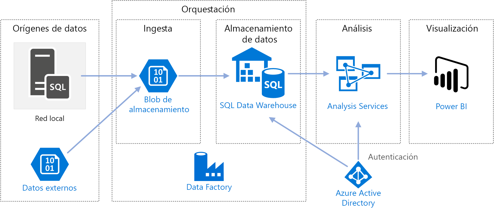
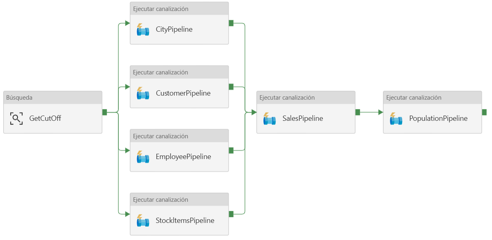
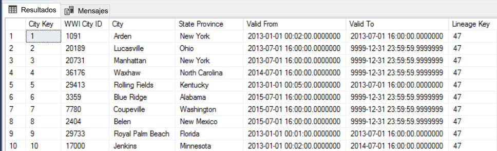
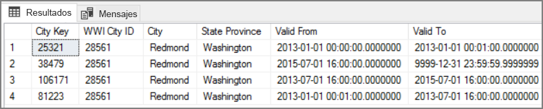

# <a name="automated-enterprise-bi-with-sql-data-warehouse-and-azure-data-factory"></a>Inteligencia empresarial automatizada con SQL Data Warehouse y Azure Data Factory

Esta arquitectura de referencia muestra cómo realizar una carga incremental en una canalización de [extracción, carga y transformación (ELT)](../../data-guide/relational-data/etl.md#extract-load-and-transform-elt). Usa Azure Data Factory para automatizar la canalización de ECT. La canalización mueve de forma incremental los datos más recientes de OLTP de una base de datos de SQL Server local a SQL Data Warehouse. Los datos transaccionales se transforman en un modelo tabular para su análisis.

> [!VIDEO https://www.microsoft.com/en-us/videoplayer/embed/RE2Gnz2]

Hay disponible una implementación de referencia de esta arquitectura en [GitHub][github].



Esta arquitectura se basa en la que se muestra en [Inteligencia empresarial con SQL Data Warehouse](./enterprise-bi-sqldw.md), pero agrega algunas características que son importantes para los escenarios de almacenamiento de datos empresariales.

- Automatización de la canalización mediante Data Factory.
- Carga incremental.
- Integración de varios orígenes de datos.
- Carga de datos binarios como datos geoespaciales e imágenes.

## <a name="architecture"></a>Arquitectura

La arquitectura consta de los siguientes componentes:

### <a name="data-sources"></a>Orígenes de datos

**SQL Server local**. Los datos de origen se encuentran en una base de datos de SQL Server de forma local. Para simular el entorno local, los scripts de implementación para esta arquitectura aprovisionan una máquina virtual en Azure con SQL Server instalado. La [base de datos OLTP de ejemplo de OLTP Wide World Importers][wwi] se usa como base de datos de origen.

**Datos externos**. Un escenario común para el almacenamiento de datos es integrar varios orígenes de datos. Esta arquitectura de referencia carga un conjunto de datos externo que contiene las poblaciones de las ciudades por año y lo integra con los datos de la base de datos de OLTP. Puede usar estos datos para obtener información como: "¿El crecimiento de las ventas en cada región iguala o supera el crecimiento de población?"

### <a name="ingestion-and-data-storage"></a>Ingesta y almacenamiento de datos

**Blob Storage**. Blob Storage se utiliza como área de ensayo del origen de datos antes de cargarlos en SQL Data Warehouse.

**Azure SQL Data Warehouse**. [SQL Data Warehouse](/azure/sql-data-warehouse/) es un sistema distribuido diseñado para realizar análisis con datos de gran tamaño. Admite el procesamiento paralelo masivo (MPP), lo que lo hace idóneo para ejecutar análisis de alto rendimiento.

**Azure Data Factory**. [Data Factory][adf] es un servicio administrado que organiza y automatiza el movimiento y la transformación de datos. En esta arquitectura, coordina las distintas fases del proceso de ELT.

### <a name="analysis-and-reporting"></a>Análisis e informes

**Azure Analysis Services**. [Analysis Services](/azure/analysis-services/) es un servicio completamente administrado que proporciona funcionalidades de modelado de datos. El modelo semántico se carga en Analysis Services.

**Power BI**. Power BI es un conjunto de herramientas de análisis de negocios que sirve para analizar datos con el fin de obtener perspectivas empresariales. En el caso de esta arquitectura consulta el modelo semántico almacenado en Analysis Services.

### <a name="authentication"></a>Autenticación

**Azure Active Directory** (Azure AD) autentica a los usuarios que se conectan al servidor de Analysis Services mediante Power BI.

Data Factory puede usar también Azure AD para autenticarse en SQL Data Warehouse mediante el uso de una entidad de servicio o de Managed Service Identity (MSI). Por simplicidad, la implementación de ejemplo utiliza la autenticación de SQL Server.

## <a name="data-pipeline"></a>Canalización de datos

En [Azure Data Factory][adf], una canalización es una agrupación lógica de actividades que se usa para coordinar una tarea (en este caso, la carga y transformación de los datos en SQL Data Warehouse).

Esta arquitectura de referencia define una canalización maestra que ejecuta una secuencia de canalizaciones de secundarias. Cada canalización secundaria carga datos en una o varias tablas de un almacén de datos.



## <a name="incremental-loading"></a>Carga incremental

Cuando se ejecuta un proceso automatizado de ETL o ELT, resulta más eficaz cargar solo los datos que han cambiado desde la última vez que se ejecutó. Esto se denomina una *carga incremental*, frente a una carga completa, en la que se cargan todos los datos. Para realizar una carga incremental, se necesita alguna forma de identificar qué datos han cambiado. El método más común es usar un valor *de marca de límite superior*, lo que significa que se hace un seguimiento del valor más reciente de alguna de las columnas de la tabla de origen, una columna de fecha y hora o una columna de entero único.

A partir de SQL Server 2016, se pueden usar las [tablas temporales](/sql/relational-databases/tables/temporal-tables), que son tablas con versiones de sistema que conservan el historial completo de los cambios de datos. El motor de base de datos registra automáticamente el historial de cada cambio en una tabla de historial independiente. Para consultar los datos históricos hay que agregar una cláusula FOR SYSTEM_TIME a una consulta. Internamente, el motor de base de datos consulta la tabla del historial, pero la aplicación no se percata de ello.

> [!NOTE]
> Para las versiones anteriores de SQL Server, puede usar [captura de datos modificados](/sql/relational-databases/track-changes/about-change-data-capture-sql-server) (CDC). Este método es menos práctico que las tablas temporales, ya que hay que consultar una tabla de cambios independiente y el seguimiento de los cambios se realiza por un número de secuencia de registro, en lugar de una marca de tiempo.
>

Las tablas temporales son útiles para los datos de dimensión, que pueden cambiar con el tiempo. Las tablas de hechos suele representar una transacción inmutable, como por ejemplo una venta; en ese caso no tiene sentido mantener el historial de versiones del sistema. En su lugar, las transacciones suelen tener una columna que representa la fecha de la transacción, que se puede usar como valor de marca de agua. Por ejemplo, en la base de datos OLTP Wide World Importers, las tablas Sales.Invoices y Sales.InvoiceLines tienen un campo `LastEditedWhen` cuyo valor predeterminado es `sysdatetime()`.

Este es el flujo general de la canalización de ELT:

1. En todas las tablas de la base de datos de origen, realice un seguimiento de la hora límite en que se ejecutó el último trabajo de ELT. Almacene esta información en la base de datos de almacenamiento de datos (en la instalación inicial, todas las horas se establecen en el "1-1-1900").

2. Durante el paso de exportación de datos, la hora límite se pasa como parámetro a un conjunto de procedimientos almacenados de la base de datos de origen. Dichos procedimientos consultan todos los registros que se cambiaron o crearon después de la hora límite. Para la tabla de hechos Sales, se usa la columna `LastEditedWhen`. Para los datos de dimensiones, se usan tablas temporales con la versión del sistema.

3. Una vez completada la migración de los datos, actualice la tabla que almacena las horas límite.

También es útil registrar un *linaje* para cada ejecución de ELT. En el caso de un registro concreto, el linaje asocia dicho registro con la ejecución de ELT que generó los datos. En cada ejecución de ETL, se crea un nuevo registro de linaje para todas las tablas, en el que se muestran la hora inicial y final de la carga. Las claves del linaje de los registros se almacenan en tablas de hechos y de dimensiones.



Después cargar un nuevo lote de datos en el almacén, actualice el modelo tabular de Analysis Services. Consulte [Actualización asincrónica con la API REST](/azure/analysis-services/analysis-services-async-refresh).

## <a name="data-cleansing"></a>Limpieza de datos

La limpieza de los datos debe formar parte del proceso de ELT. En esta arquitectura de referencia, un origen de datos incorrectos es la tabla de población de ciudades, donde algunas ciudades tienen una población cero, quizás porque no había datos disponibles. Durante el procesamiento, la canalización de ELT quita esas ciudades de la tabla de la población de ciudades. La limpieza de datos se debe realizar en las tablas de almacenamiento provisional, no en las tablas externas.

Este es el procedimiento almacenado que elimina las ciudades con población cero rellenado de la tabla City Population (el archivo de origen se puede encontrar [aquí](https://github.com/mspnp/reference-architectures/blob/master/data/enterprise_bi_sqldw_advanced/azure/sqldw_scripts/citypopulation/%5BIntegration%5D.%5BMigrateExternalCityPopulationData%5D.sql)).

```sql
DELETE FROM [Integration].[CityPopulation_Staging]
WHERE RowNumber in (SELECT DISTINCT RowNumber
FROM [Integration].[CityPopulation_Staging]
WHERE POPULATION = 0
GROUP BY RowNumber
HAVING COUNT(RowNumber) = 4)
```

## <a name="external-data-sources"></a>Orígenes de datos externos

Las bases de datos de almacenamiento de datos a menudo consolidan datos de varios orígenes. Esta arquitectura de referencia carga un origen de datos externo que contiene datos demográficos. Este conjunto de datos está disponible en Azure Blob Storage como parte del ejemplo [WorldWideImportersDW](https://github.com/Microsoft/sql-server-samples/tree/master/samples/databases/wide-world-importers/sample-scripts/polybase).

Azure Data Factory puede realizar la copia directamente desde Blob Storage, mediante el [conector de Blob Storage](/azure/data-factory/connector-azure-blob-storage). Sin embargo, el conector requiere una cadena de conexión o una firma de acceso compartido, por lo que no se puede usar para copiar un blob con acceso de lectura público. Como alternativa, puede usar PolyBase para crear una tabla externa a través de Blob Storage y, después, copiar las tablas externas en SQL Data Warehouse.

## <a name="handling-large-binary-data"></a>Control de datos binarios de gran tamaño

En la base de datos de origen, la tabla Cities tiene una columna Location que contiene un tipo de datos espaciales [geography](/sql/t-sql/spatial-geography/spatial-types-geography). De forma nativa SQL Data Warehouse no admite el tipo **geography**, por lo que este campo pasa a ser de tipo **varbinary** durante la carga (consulte [Soluciones alternativas para los tipos de datos no admitidos](/azure/sql-data-warehouse/sql-data-warehouse-tables-data-types#unsupported-data-types)).

Sin embargo, PolyBase admite un tamaño de columna máximo de `varbinary(8000)`, lo que significa que algunos datos podrían aparecer truncados. Una solución alternativa a este problema es dividir los datos en fragmentos durante la exportación y, después, ensamblar dichos fragmentos como se indica a continuación:

1. Cree una tabla de almacenamiento provisional para la columna Location.

2. En cada ciudad, divida los datos de ubicación en fragmentos de 8000 bytes, lo que da como resultado 1 &ndash; N filas por cada ciudad.

3. Para ensamblar los fragmentos, use el operador [PIVOT](/sql/t-sql/queries/from-using-pivot-and-unpivot) de T-SQL para convertir las filas en columnas y, después, concatene los valores de columna de cada ciudad.

El desafío es que cada ciudad se divida en un número diferente de filas, en función del tamaño de los datos geográficos. Para que el operador PIVOT funcione, todas las ciudades debe tener el mismo número de filas. Para que esto funcione, la consulta de T-SQL (que se puede ver [aquí][MergeLocation]) realiza algunos trucos para rellenar las filas con valores en blanco, con el fin de que todas las ciudades tengan el mismo número de columnas después de la dinamización. La consulta resultante resulta ser mucho más rápida que crear bucles en las filas de una en una.

Pata los datos de imagen se usa el mismo método.

## <a name="slowly-changing-dimensions"></a>Cambio lento de dimensiones

Los datos de dimensiones son relativamente estáticos, pero se pueden cambiar. Por ejemplo, un producto se puede reasignar a otra categoría. Hay varios métodos para el control del cambio lento de dimensiones. Una técnica común, llamada de [tipo 2](https://wikipedia.org/wiki/Slowly_changing_dimension#Type_2:_add_new_row), consiste en agregar un nuevo registro cada vez que cambia de una dimensión.

Para implementar este método, las tablas de dimensiones necesitan columnas adicionales que especifiquen el intervalo de fechas de vigencia de un registro determinado. Además, las claves principales de la base de datos de origen se duplicarán, por lo que la tabla de dimensiones debe tener una clave principal artificial.

La siguiente imagen muestra la tabla Dimension.City. La columna `WWI City ID` es la clave principal de la base de datos de origen. La columna `City Key` es una clave artificial generada durante la canalización de ETL. Observe también que la tabla tiene las columnas `Valid From` y `Valid To`, que definen el intervalo de validez de cada fila. El valor de `Valid To` de los valores actuales es "9999-12-31".


La ventaja de este método es que conserva los datos históricos, lo que puede resultar muy útil de cara al análisis. Sin embargo, también significa que habrá varias filas para la misma entidad. Por ejemplo, estos son los registros que coinciden con `WWI City ID` = 28561:



Para cada dato de Sales, desea asociar dicho hecho a una sola fila de la tabla de dimensiones City, correspondiente a la fecha de factura. Como parte del proceso de ETL, cree una columna. 

La siguiente consulta de T-SQL crea una tabla temporal que asocia cada factura a la clave de ciudad correcta de la tabla de dimensiones City.

```sql
CREATE TABLE CityHolder
WITH (HEAP , DISTRIBUTION = HASH([WWI Invoice ID]))
AS
SELECT DISTINCT s1.[WWI Invoice ID] AS [WWI Invoice ID],
                c.[City Key] AS [City Key]
    FROM [Integration].[Sale_Staging] s1
    CROSS APPLY (
                SELECT TOP 1 [City Key]
                    FROM [Dimension].[City]
                WHERE [WWI City ID] = s1.[WWI City ID]
                    AND s1.[Last Modified When] > [Valid From]
                    AND s1.[Last Modified When] <= [Valid To]
                ORDER BY [Valid From], [City Key] DESC
                ) c

```

Dicha tabla se utiliza para rellenar una columna de la tabla de hechos Sales:

```sql
UPDATE [Integration].[Sale_Staging]
SET [Integration].[Sale_Staging].[WWI Customer ID] =  CustomerHolder.[WWI Customer ID]
```

Esta columna permite que una consulta de Power BI encuentre el registro de City correcto de una factura de venta determinada.

## <a name="security-considerations"></a>Consideraciones sobre la seguridad

Para mayor seguridad, puede usar los [puntos de conexión de Virtual Network](/azure/virtual-network/virtual-network-service-endpoints-overview) para proteger los recursos del servicio de Azure a solo la red virtual. Esto elimina por completo el acceso público a Internet de esos recursos, solo permite el tráfico solo desde la red virtual.

Con este método se crea una red virtual en Azure y, después, se crean puntos de conexión de servicio privados para los servicios de Azure. Luego se aplica una restricción a dichos servicios, por lo que solo le llega el tráfico de la red virtual. También se puede acceder ellos desde la red local a través de una puerta de enlace.

Tenga en cuenta las siguientes limitaciones:

- En el momento de creación de esta arquitectura de referencia, los puntos de conexión de servicio de red virtual se admiten en Azure Storage y Azure SQL Data Warehouse, pero no en Azure Analysis Service. [Aquí](https://azure.microsoft.com/updates/?product=virtual-network) puede comprobar el estado más reciente.

- Si se habilitan los puntos de conexión de servicio para Azure Storage, PolyBase no puede copiar datos de Storage a SQL Data Warehouse. Pero este problema se puede mitigar. Para más información, consulte [Efectos del uso de puntos de conexión de servicio de la red virtual con Azure Storage](/azure/sql-database/sql-database-vnet-service-endpoint-rule-overview?toc=%2fazure%2fvirtual-network%2ftoc.json#impact-of-using-vnet-service-endpoints-with-azure-storage).

- Para mover datos desde el entorno local a Azure Storage, será preciso incorporar a la lista blanca las direcciones IP públicas desde su entorno local o desde ExpressRoute. Para más información, consulte [Protección de servicios de Azure para las redes virtuales](/azure/virtual-network/virtual-network-service-endpoints-overview#securing-azure-services-to-virtual-networks).

- Para permitir que Analysis Services lea datos de SQL Data Warehouse, implemente una máquina virtual Windows en la red virtual que contiene el punto de conexión de servicio de SQL Data Warehouse. Instale la [puerta de enlace de datos local de Azure](/azure/analysis-services/analysis-services-gateway) en esta máquina virtual. Luego, conecte el servicio Azure Analysis a dicha puerta de enlace.

## <a name="deploy-the-solution"></a>Implementación de la solución

Para la implementación y ejecución de la implementación de referencia, siga los pasos del [Léame de GitHub][github]. Implementa lo siguiente:

- Una máquina virtual Windows para simular un servidor de bases de datos local. Incluye SQL Server 2017 y herramientas relacionadas, junto con Power BI Desktop.
- Una cuenta de almacenamiento de Azure que proporciona almacenamiento de blobs para almacenar los datos exportados de la base de datos de SQL Server.
- Una instancia de Azure SQL Data Warehouse.
- Una instancia de Azure Analysis Services.
- Azure Data Factory y la canalización de Data Factory para el trabajo de ELT.

[adf]: /azure/data-factory
[github]: https://github.com/mspnp/reference-architectures/tree/master/data/enterprise_bi_sqldw_advanced
[MergeLocation]: https://github.com/mspnp/reference-architectures/blob/master/data/enterprise_bi_sqldw_advanced/azure/sqldw_scripts/city/%5BIntegration%5D.%5BMergeLocation%5D.sql
[wwi]: /sql/sample/world-wide-importers/wide-world-importers-oltp-database
