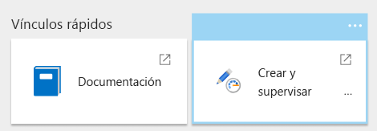
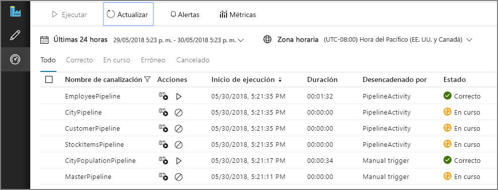
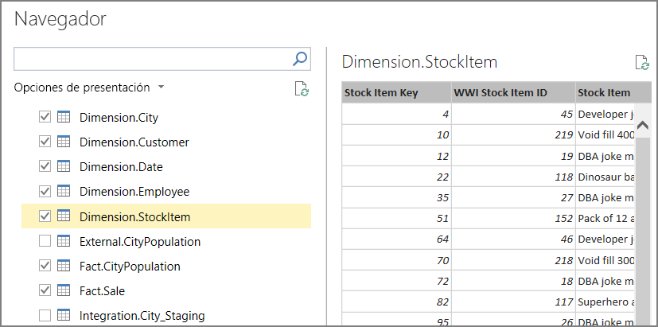
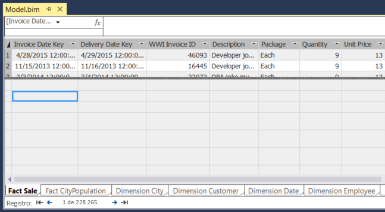
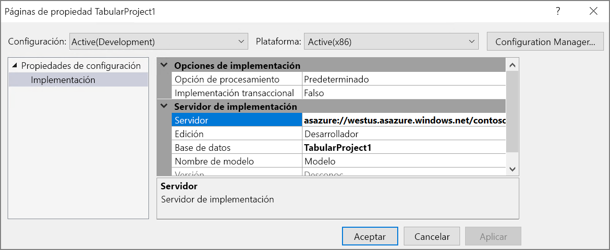
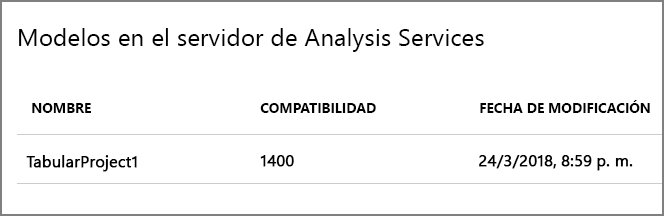
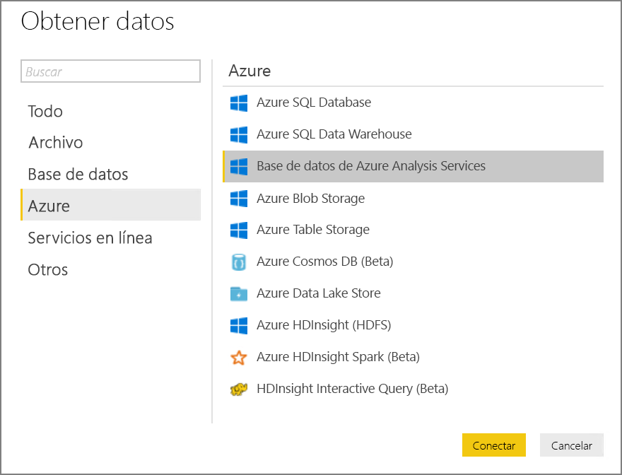
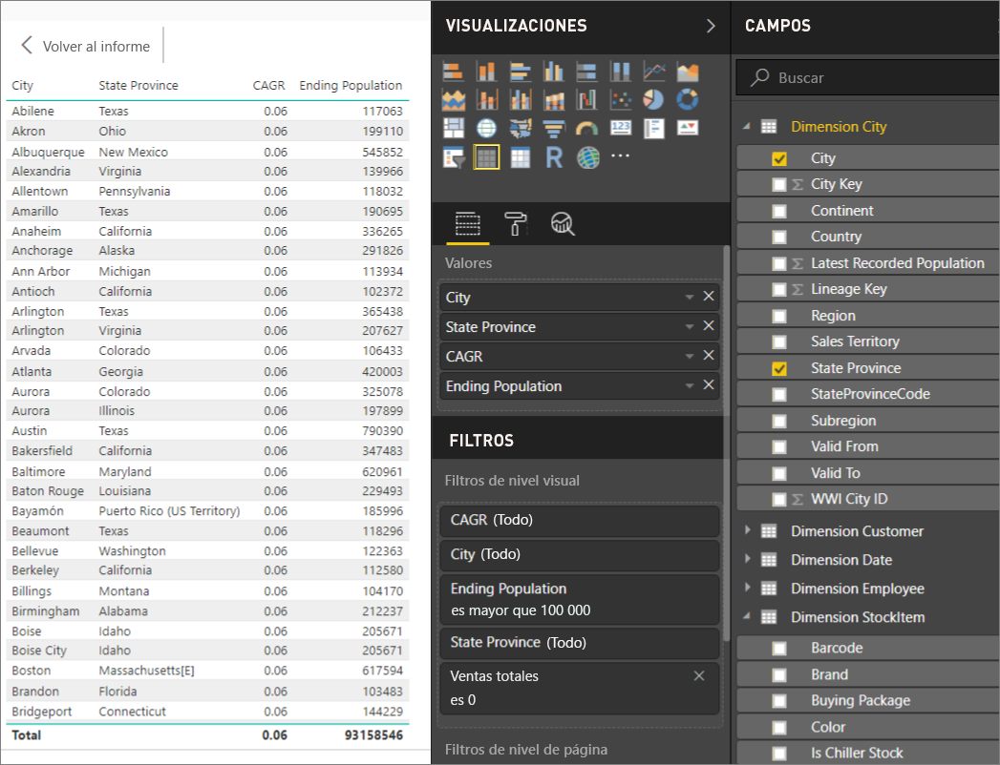

# <a name="automated-enterprise-bi-with-sql-data-warehouse-and-azure-data-factory"></a><span data-ttu-id="46093-103">Inteligencia empresarial automatizada con SQL Data Warehouse y Azure Data Factory</span><span class="sxs-lookup"><span data-stu-id="46093-103">Automated enterprise BI with SQL Data Warehouse and Azure Data Factory</span></span>

<span data-ttu-id="46093-104">Esta arquitectura de referencia muestra cómo realizar una carga incremental en una canalización de [ECT](../../data-guide/relational-data/etl.md#extract-load-and-transform-elt) (extracción, carga y transformación).</span><span class="sxs-lookup"><span data-stu-id="46093-104">This reference architecture shows how to perform incremental loading in an [ELT](../../data-guide/relational-data/etl.md#extract-load-and-transform-elt) (extract-load-transform) pipeline.</span></span> <span data-ttu-id="46093-105">Usa Azure Data Factory para automatizar la canalización de ECT.</span><span class="sxs-lookup"><span data-stu-id="46093-105">It uses Azure Data Factory to automate the ELT pipeline.</span></span> <span data-ttu-id="46093-106">La canalización mueve de forma incremental los datos más recientes de OLTP de una base de datos de SQL Server local a SQL Data Warehouse.</span><span class="sxs-lookup"><span data-stu-id="46093-106">The pipeline incrementally moves the latest OLTP data from an on-premises SQL Server database into SQL Data Warehouse.</span></span> <span data-ttu-id="46093-107">Los datos transaccionales se transforman en un modelo tabular para su análisis.</span><span class="sxs-lookup"><span data-stu-id="46093-107">Transactional data is transformed into a tabular model for analysis.</span></span> [<span data-ttu-id="46093-108">**Implemente esta solución**.</span><span class="sxs-lookup"><span data-stu-id="46093-108">**Deploy this solution**.</span></span>](#deploy-the-solution)


<span data-ttu-id="46093-109">Esta arquitectura se basa en la que se muestra en [Inteligencia empresarial con SQL Data Warehouse](./enterprise-bi-sqldw.md), pero agrega algunas características que son importantes para los escenarios de almacenamiento de datos empresariales.</span><span class="sxs-lookup"><span data-stu-id="46093-109">This architecture builds on the one shown in [Enterprise BI with SQL Data Warehouse](./enterprise-bi-sqldw.md), but adds some features that are important for enterprise data warehousing scenarios.</span></span>

-   <span data-ttu-id="46093-110">Automatización de la canalización mediante Data Factory.</span><span class="sxs-lookup"><span data-stu-id="46093-110">Automation of the pipeline using Data Factory.</span></span>
-   <span data-ttu-id="46093-111">Carga incremental.</span><span class="sxs-lookup"><span data-stu-id="46093-111">Incremental loading.</span></span>
-   <span data-ttu-id="46093-112">Integración de varios orígenes de datos.</span><span class="sxs-lookup"><span data-stu-id="46093-112">Integrating multiple data sources.</span></span>
-   <span data-ttu-id="46093-113">Carga de datos binarios como datos geoespaciales e imágenes.</span><span class="sxs-lookup"><span data-stu-id="46093-113">Loading binary data such as geospatial data and images.</span></span>

## <a name="architecture"></a><span data-ttu-id="46093-114">Arquitectura</span><span class="sxs-lookup"><span data-stu-id="46093-114">Architecture</span></span>

<span data-ttu-id="46093-115">La arquitectura consta de los siguientes componentes:</span><span class="sxs-lookup"><span data-stu-id="46093-115">The architecture consists of the following components.</span></span>

### <a name="data-sources"></a><span data-ttu-id="46093-116">Orígenes de datos</span><span class="sxs-lookup"><span data-stu-id="46093-116">Data sources</span></span>

<span data-ttu-id="46093-117">**SQL Server local**.</span><span class="sxs-lookup"><span data-stu-id="46093-117">**On-premises SQL Server**.</span></span> <span data-ttu-id="46093-118">Los datos de origen se encuentran en una base de datos de SQL Server de forma local.</span><span class="sxs-lookup"><span data-stu-id="46093-118">The source data is located in a SQL Server database on premises.</span></span> <span data-ttu-id="46093-119">Para simular el entorno local, los scripts de implementación para esta arquitectura aprovisionan una máquina virtual en Azure con SQL Server instalado.</span><span class="sxs-lookup"><span data-stu-id="46093-119">To simulate the on-premises environment, the deployment scripts for this architecture provision a virtual machine in Azure with SQL Server installed.</span></span> <span data-ttu-id="46093-120">La [base de datos OLTP de ejemplo de OLTP Wide World Importers] [wwi] se usa como base de datos de origen.</span><span class="sxs-lookup"><span data-stu-id="46093-120">The [Wide World Importers OLTP sample database][wwi] is used as the source database.</span></span>

<span data-ttu-id="46093-121">**Datos externos**.</span><span class="sxs-lookup"><span data-stu-id="46093-121">**External data**.</span></span> <span data-ttu-id="46093-122">Un escenario común para el almacenamiento de datos es integrar varios orígenes de datos.</span><span class="sxs-lookup"><span data-stu-id="46093-122">A common scenario for data warehouses is to integrate multiple data sources.</span></span> <span data-ttu-id="46093-123">Esta arquitectura de referencia carga un conjunto de datos externo que contiene las poblaciones de las ciudades por año y lo integra con los datos de la base de datos de OLTP.</span><span class="sxs-lookup"><span data-stu-id="46093-123">This reference architecture loads an external data set that contains city populations by year, and integrates it with the data from the OLTP database.</span></span> <span data-ttu-id="46093-124">Estos datos se pueden usar para conclusiones como: "¿Supera o iguala el crecimiento de las ventas en cada región el crecimiento poblacional?"</span><span class="sxs-lookup"><span data-stu-id="46093-124">You can use this data for insights such as: "Does sales growth in each region match or exceed population growth?"</span></span>

### <a name="ingestion-and-data-storage"></a><span data-ttu-id="46093-125">Ingesta y almacenamiento de datos</span><span class="sxs-lookup"><span data-stu-id="46093-125">Ingestion and data storage</span></span>

<span data-ttu-id="46093-126">**Blob Storage**.</span><span class="sxs-lookup"><span data-stu-id="46093-126">**Blob Storage**.</span></span> <span data-ttu-id="46093-127">Blob Storage se utiliza como área de ensayo del origen de datos antes de cargarlos en SQL Data Warehouse.</span><span class="sxs-lookup"><span data-stu-id="46093-127">Blob storage is used as a staging area for the source data before loading it into SQL Data Warehouse.</span></span>

<span data-ttu-id="46093-128">**Azure SQL Data Warehouse**.</span><span class="sxs-lookup"><span data-stu-id="46093-128">**Azure SQL Data Warehouse**.</span></span> <span data-ttu-id="46093-129">[SQL Data Warehouse](/azure/sql-data-warehouse/) es un sistema distribuido diseñado para realizar análisis con datos de gran tamaño.</span><span class="sxs-lookup"><span data-stu-id="46093-129">[SQL Data Warehouse](/azure/sql-data-warehouse/) is a distributed system designed to perform analytics on large data.</span></span> <span data-ttu-id="46093-130">Admite el procesamiento paralelo masivo (MPP), lo que lo hace idóneo para ejecutar análisis de alto rendimiento.</span><span class="sxs-lookup"><span data-stu-id="46093-130">It supports massive parallel processing (MPP), which makes it suitable for running high-performance analytics.</span></span> 

<span data-ttu-id="46093-131">**Azure Data Factory**.</span><span class="sxs-lookup"><span data-stu-id="46093-131">**Azure Data Factory**.</span></span> <span data-ttu-id="46093-132">[Data Factory] [adf] es un servicio administrado que organiza y automatiza el movimiento y la transformación de datos.</span><span class="sxs-lookup"><span data-stu-id="46093-132">[Data Factory][adf] is a managed service that orchestrates and automates data movement and data transformation.</span></span> <span data-ttu-id="46093-133">En esta arquitectura, coordina las distintas fases del proceso de ELT.</span><span class="sxs-lookup"><span data-stu-id="46093-133">In this architecture, it coordinates the various stages of the ELT process.</span></span>

### <a name="analysis-and-reporting"></a><span data-ttu-id="46093-134">Análisis e informes</span><span class="sxs-lookup"><span data-stu-id="46093-134">Analysis and reporting</span></span>

<span data-ttu-id="46093-135">**Azure Analysis Services**.</span><span class="sxs-lookup"><span data-stu-id="46093-135">**Azure Analysis Services**.</span></span> <span data-ttu-id="46093-136">[Analysis Services](/azure/analysis-services/) es un servicio completamente administrado que proporciona funcionalidades de modelado de datos.</span><span class="sxs-lookup"><span data-stu-id="46093-136">[Analysis Services](/azure/analysis-services/) is a fully managed service that provides data modeling capabilities.</span></span> <span data-ttu-id="46093-137">El modelo semántico se carga en Analysis Services.</span><span class="sxs-lookup"><span data-stu-id="46093-137">The semantic model is loaded into Analysis Services.</span></span>

<span data-ttu-id="46093-138">**Power BI**.</span><span class="sxs-lookup"><span data-stu-id="46093-138">**Power BI**.</span></span> <span data-ttu-id="46093-139">Power BI es un conjunto de herramientas de análisis de negocios que sirve para analizar datos con el fin de obtener perspectivas empresariales.</span><span class="sxs-lookup"><span data-stu-id="46093-139">Power BI is a suite of business analytics tools to analyze data for business insights.</span></span> <span data-ttu-id="46093-140">En el caso de esta arquitectura consulta el modelo semántico almacenado en Analysis Services.</span><span class="sxs-lookup"><span data-stu-id="46093-140">In this architecture, it queries the semantic model stored in Analysis Services.</span></span>

### <a name="authentication"></a><span data-ttu-id="46093-141">Autenticación</span><span class="sxs-lookup"><span data-stu-id="46093-141">Authentication</span></span>

<span data-ttu-id="46093-142">**Azure Active Directory** (Azure AD) autentica a los usuarios que se conectan al servidor de Analysis Services mediante Power BI.</span><span class="sxs-lookup"><span data-stu-id="46093-142">**Azure Active Directory** (Azure AD) authenticates users who connect to the Analysis Services server through Power BI.</span></span>

<span data-ttu-id="46093-143">Data Factory puede usar también Azure AD para autenticarse en SQL Data Warehouse mediante el uso de una entidad de servicio o de Managed Service Identity (MSI).</span><span class="sxs-lookup"><span data-stu-id="46093-143">Data Factory can use also use Azure AD to authenticate to SQL Data Warehouse, by using a service principal or Managed Service Identity (MSI).</span></span> <span data-ttu-id="46093-144">Por simplicidad, la implementación de ejemplo utiliza la autenticación de SQL Server.</span><span class="sxs-lookup"><span data-stu-id="46093-144">For simplicity, the example deployment uses SQL Server authentication.</span></span>

## <a name="data-pipeline"></a><span data-ttu-id="46093-145">Canalización de datos</span><span class="sxs-lookup"><span data-stu-id="46093-145">Data pipeline</span></span>

<span data-ttu-id="46093-146">En [Azure Data Factory] [adf], una canalización es una agrupación lógica de actividades que se usa para coordinar una tarea (en este caso, cargar y transformar los datos en SQL Data Warehouse).</span><span class="sxs-lookup"><span data-stu-id="46093-146">In [Azure Data Factory][adf], a pipeline is a logical grouping of activities used to coordinate a task &mdash; in this case, loading and transforming data into SQL Data Warehouse.</span></span> 

<span data-ttu-id="46093-147">Esta arquitectura de referencia define una canalización maestra que ejecuta una secuencia de canalizaciones de secundarias.</span><span class="sxs-lookup"><span data-stu-id="46093-147">This reference architecture defines a master pipeline that runs a sequence of child pipelines.</span></span> <span data-ttu-id="46093-148">Cada canalización secundaria carga datos en una o varias tablas de un almacén de datos.</span><span class="sxs-lookup"><span data-stu-id="46093-148">Each child pipeline loads data into one or more data warehouse tables.</span></span>


## <a name="incremental-loading"></a><span data-ttu-id="46093-149">Carga incremental</span><span class="sxs-lookup"><span data-stu-id="46093-149">Incremental loading</span></span>

<span data-ttu-id="46093-150">Cuando se ejecuta un proceso automatizado de ETL o ELT, resulta más eficaz cargar solo los datos que han cambiado desde la última vez que se ejecutó.</span><span class="sxs-lookup"><span data-stu-id="46093-150">When you run an automated ETL or ELT process, it's most efficient to load only the data that changed since the previous run.</span></span> <span data-ttu-id="46093-151">Esto se denomina una *carga incremental*, frente a una carga completa, en la que se cargan todos los datos.</span><span class="sxs-lookup"><span data-stu-id="46093-151">This is called an *incremental load*, as opposed to a full load that loads all of the data.</span></span> <span data-ttu-id="46093-152">Para realizar una carga incremental, se necesita alguna forma de identificar qué datos han cambiado.</span><span class="sxs-lookup"><span data-stu-id="46093-152">To perform an incremental load, you need a way to identify which data has changed.</span></span> <span data-ttu-id="46093-153">El método más común es usar un valor *de marca de límite superior*, lo que significa que se hace un seguimiento del valor más reciente de alguna de las columnas de la tabla de origen, una columna de fecha y hora o una columna de entero único.</span><span class="sxs-lookup"><span data-stu-id="46093-153">The most common approach is to use a *high water mark* value, which means tracking the latest value of some column in the source table, either a datetime column or a unique integer column.</span></span> 

<span data-ttu-id="46093-154">A partir de SQL Server 2016, se pueden usar las [tablas temporales](/sql/relational-databases/tables/temporal-tables),</span><span class="sxs-lookup"><span data-stu-id="46093-154">Starting with SQL Server 2016, you can use [temporal tables](/sql/relational-databases/tables/temporal-tables).</span></span> <span data-ttu-id="46093-155">que son tablas con versiones de sistema que conservan el historial completo de los cambios de datos.</span><span class="sxs-lookup"><span data-stu-id="46093-155">These are system-versioned tables that keep a full history of data changes.</span></span> <span data-ttu-id="46093-156">El motor de base de datos registra automáticamente el historial de cada cambio en una tabla de historial independiente.</span><span class="sxs-lookup"><span data-stu-id="46093-156">The database engine automatically records the history of every change in a separate history table.</span></span> <span data-ttu-id="46093-157">Para consultar los datos históricos hay que agregar una cláusula FOR SYSTEM_TIME a una consulta.</span><span class="sxs-lookup"><span data-stu-id="46093-157">You can query the historical data by adding a FOR SYSTEM_TIME clause to a query.</span></span> <span data-ttu-id="46093-158">Internamente, el motor de base de datos consulta la tabla del historial, pero la aplicación no se percata de ello.</span><span class="sxs-lookup"><span data-stu-id="46093-158">Internally, the database engine queries the history table, but this is transparent to the application.</span></span> 

> [!NOTE]
> <span data-ttu-id="46093-159">Para las versiones anteriores de SQL Server, puede usar [captura de datos modificados](/sql/relational-databases/track-changes/about-change-data-capture-sql-server) (CDC).</span><span class="sxs-lookup"><span data-stu-id="46093-159">For earlier versions of SQL Server, you can use [Change Data Capture](/sql/relational-databases/track-changes/about-change-data-capture-sql-server) (CDC).</span></span> <span data-ttu-id="46093-160">Este método es menos práctico que las tablas temporales, ya que hay que consultar una tabla de cambios independiente y el seguimiento de los cambios se realiza por un número de secuencia de registro, en lugar de una marca de tiempo.</span><span class="sxs-lookup"><span data-stu-id="46093-160">This approach is less convenient than temporal tables, because you have to query a separate change table, and changes are tracked by a log sequence number, rather than a timestamp.</span></span> 

<span data-ttu-id="46093-161">Las tablas temporales son útiles para los datos de dimensión, que pueden cambiar con el tiempo.</span><span class="sxs-lookup"><span data-stu-id="46093-161">Temporal tables are useful for dimension data, which can change over time.</span></span> <span data-ttu-id="46093-162">Las tablas de hechos suele representar una transacción inmutable, como por ejemplo una venta; en ese caso no tiene sentido mantener el historial de versiones del sistema.</span><span class="sxs-lookup"><span data-stu-id="46093-162">Fact tables usually represent an immutable transaction such as a sale, in which case keeping the system version history doesn't make sense.</span></span> <span data-ttu-id="46093-163">En su lugar, las transacciones suelen tener una columna que representa la fecha de la transacción, que se puede usar como valor de marca de agua.</span><span class="sxs-lookup"><span data-stu-id="46093-163">Instead, transactions usually have a column that represents the transaction date, which can be used as the watermark value.</span></span> <span data-ttu-id="46093-164">Por ejemplo, en la base de datos OLTP Wide World Importers, las tablas Sales.Invoices y Sales.InvoiceLines tienen un campo `LastEditedWhen` cuyo valor predeterminado es `sysdatetime()`.</span><span class="sxs-lookup"><span data-stu-id="46093-164">For example, in the Wide World Importers OLTP database, the Sales.Invoices and Sales.InvoiceLines tables have a `LastEditedWhen` field that defaults to `sysdatetime()`.</span></span> 

<span data-ttu-id="46093-165">Este es el flujo general de la canalización de ELT:</span><span class="sxs-lookup"><span data-stu-id="46093-165">Here is the general flow for the ELT pipeline:</span></span>

1. <span data-ttu-id="46093-166">En todas las tablas de la base de datos de origen, realice un seguimiento de la hora límite en que se ejecutó el último trabajo de ELT.</span><span class="sxs-lookup"><span data-stu-id="46093-166">For each table in the source database, track the cutoff time when the last ELT job ran.</span></span> <span data-ttu-id="46093-167">Almacene esta información en la base de datos de almacenamiento de datos</span><span class="sxs-lookup"><span data-stu-id="46093-167">Store this information in the data warehouse.</span></span> <span data-ttu-id="46093-168">(en la instalación inicial, todas las horas se establecen en el "1-1-1900").</span><span class="sxs-lookup"><span data-stu-id="46093-168">(On initial setup, all times are set to '1-1-1900'.)</span></span>

2. <span data-ttu-id="46093-169">Durante el paso de exportación de datos, la hora límite se pasa como parámetro a un conjunto de procedimientos almacenados de la base de datos de origen.</span><span class="sxs-lookup"><span data-stu-id="46093-169">During the data export step, the cutoff time is passed as a parameter to a set of stored procedures in the source database.</span></span> <span data-ttu-id="46093-170">Dichos procedimientos consultan todos los registros que se cambiaron o crearon después de la hora límite.</span><span class="sxs-lookup"><span data-stu-id="46093-170">These stored procedures query for any records that were changed or created after the cutoff time.</span></span> <span data-ttu-id="46093-171">Para la tabla de hechos Sales, se usa la columna `LastEditedWhen`.</span><span class="sxs-lookup"><span data-stu-id="46093-171">For the Sales fact table, the `LastEditedWhen` column is used.</span></span> <span data-ttu-id="46093-172">Para los datos de dimensiones, se usan tablas temporales con la versión del sistema.</span><span class="sxs-lookup"><span data-stu-id="46093-172">For the dimension data, system-versioned temporal tables are used.</span></span>

3. <span data-ttu-id="46093-173">Una vez completada la migración de los datos, actualice la tabla que almacena las horas límite.</span><span class="sxs-lookup"><span data-stu-id="46093-173">When the data migration is complete, update the table that stores the cutoff times.</span></span>

<span data-ttu-id="46093-174">También es útil registrar un *linaje* para cada ejecución de ELT.</span><span class="sxs-lookup"><span data-stu-id="46093-174">It's also useful to record a *lineage* for each ELT run.</span></span> <span data-ttu-id="46093-175">En el caso de un registro concreto, el linaje asocia dicho registro con la ejecución de ELT que generó los datos.</span><span class="sxs-lookup"><span data-stu-id="46093-175">For a given record, the lineage associates that record with the ELT run that produced the data.</span></span> <span data-ttu-id="46093-176">En cada ejecución de ETL, se crea un nuevo registro de linaje para todas las tablas, en el que se muestran la hora inicial y final de la carga.</span><span class="sxs-lookup"><span data-stu-id="46093-176">For each ETL run, a new lineage record is created for every table, showing the starting and ending load times.</span></span> <span data-ttu-id="46093-177">Las claves del linaje de los registros se almacenan en tablas de hechos y de dimensiones.</span><span class="sxs-lookup"><span data-stu-id="46093-177">The lineage keys for each record are stored in the dimension and fact tables.</span></span>


<span data-ttu-id="46093-178">Después cargar un nuevo lote de datos en el almacén, actualice el modelo tabular de Analysis Services.</span><span class="sxs-lookup"><span data-stu-id="46093-178">After a new batch of data is loaded into the warehouse, refresh the Analysis Services tabular model.</span></span> <span data-ttu-id="46093-179">Consulte [Actualización asincrónica con la API REST](/azure/analysis-services/analysis-services-async-refresh).</span><span class="sxs-lookup"><span data-stu-id="46093-179">See [Asynchronous refresh with the REST API](/azure/analysis-services/analysis-services-async-refresh).</span></span>

## <a name="data-cleansing"></a><span data-ttu-id="46093-180">Limpieza de datos</span><span class="sxs-lookup"><span data-stu-id="46093-180">Data cleansing</span></span>

<span data-ttu-id="46093-181">La limpieza de los datos debe formar parte del proceso de ELT.</span><span class="sxs-lookup"><span data-stu-id="46093-181">Data cleansing should be part of the ELT process.</span></span> <span data-ttu-id="46093-182">En esta arquitectura de referencia, un origen de datos incorrectos es la tabla de población de ciudades, donde algunas ciudades tienen una población cero, quizás porque no había datos disponibles.</span><span class="sxs-lookup"><span data-stu-id="46093-182">In this reference architecture, one source of bad data is the city population table, where some cities have zero population, perhaps because no data was available.</span></span> <span data-ttu-id="46093-183">Durante el procesamiento, la canalización de ELT quita esas ciudades de la tabla de la población de ciudades.</span><span class="sxs-lookup"><span data-stu-id="46093-183">During processing, the ELT pipeline removes those cities from the city population table.</span></span> <span data-ttu-id="46093-184">La limpieza de datos se debe realizar en las tablas de almacenamiento provisional, no en las tablas externas.</span><span class="sxs-lookup"><span data-stu-id="46093-184">Perform data cleansing on staging tables, rather than external tables.</span></span>

<span data-ttu-id="46093-185">Este es el procedimiento almacenado que elimina las ciudades con población cero rellenado de la tabla City Population</span><span class="sxs-lookup"><span data-stu-id="46093-185">Here is the stored procedure that removes the cities with zero population from the City Population table.</span></span> <span data-ttu-id="46093-186">(el archivo de origen se puede encontrar [aquí](https://github.com/mspnp/reference-architectures/blob/master/data/enterprise_bi_sqldw_advanced/azure/sqldw_scripts/citypopulation/%5BIntegration%5D.%5BMigrateExternalCityPopulationData%5D.sql)).</span><span class="sxs-lookup"><span data-stu-id="46093-186">(You can find the source file [here](https://github.com/mspnp/reference-architectures/blob/master/data/enterprise_bi_sqldw_advanced/azure/sqldw_scripts/citypopulation/%5BIntegration%5D.%5BMigrateExternalCityPopulationData%5D.sql).)</span></span> 

```sql
DELETE FROM [Integration].[CityPopulation_Staging]
WHERE RowNumber in (SELECT DISTINCT RowNumber
FROM [Integration].[CityPopulation_Staging]
WHERE POPULATION = 0
GROUP BY RowNumber
HAVING COUNT(RowNumber) = 4)
```

## <a name="external-data-sources"></a><span data-ttu-id="46093-187">Orígenes de datos externos</span><span class="sxs-lookup"><span data-stu-id="46093-187">External data sources</span></span>

<span data-ttu-id="46093-188">Las bases de datos de almacenamiento de datos a menudo consolidan datos de varios orígenes.</span><span class="sxs-lookup"><span data-stu-id="46093-188">Data warehouses often consolidate data from multiple sources.</span></span> <span data-ttu-id="46093-189">Esta arquitectura de referencia carga un origen de datos externo que contiene datos demográficos.</span><span class="sxs-lookup"><span data-stu-id="46093-189">This reference architecture loads an external data source that contains demographics data.</span></span> <span data-ttu-id="46093-190">Este conjunto de datos está disponible en Azure Blob Storage como parte del ejemplo [WorldWideImportersDW](https://github.com/Microsoft/sql-server-samples/tree/master/samples/databases/wide-world-importers/sample-scripts/polybase).</span><span class="sxs-lookup"><span data-stu-id="46093-190">This dataset is available in Azure blob storage as part of the [WorldWideImportersDW](https://github.com/Microsoft/sql-server-samples/tree/master/samples/databases/wide-world-importers/sample-scripts/polybase) sample.</span></span>

<span data-ttu-id="46093-191">Azure Data Factory puede realizar la copia directamente desde Blob Storage, mediante el [conector de Blob Storage](/azure/data-factory/connector-azure-blob-storage).</span><span class="sxs-lookup"><span data-stu-id="46093-191">Azure Data Factory can copy directly from blob storage, using the [blob storage connector](/azure/data-factory/connector-azure-blob-storage).</span></span> <span data-ttu-id="46093-192">Sin embargo, el conector requiere una cadena de conexión o una firma de acceso compartido, por lo que no se puede usar para copiar un blob con acceso de lectura público.</span><span class="sxs-lookup"><span data-stu-id="46093-192">However, the connector requires a connection string or a shared access signature, so it can't be used to copy a blob with public read access.</span></span> <span data-ttu-id="46093-193">Como alternativa, puede usar PolyBase para crear una tabla externa a través de Blob Storage y, después, copiar las tablas externas en SQL Data Warehouse.</span><span class="sxs-lookup"><span data-stu-id="46093-193">As a workaround, you can use PolyBase to create an external table over Blob storage and then copy the external tables into SQL Data Warehouse.</span></span> 

## <a name="handling-large-binary-data"></a><span data-ttu-id="46093-194">Control de datos binarios de gran tamaño</span><span class="sxs-lookup"><span data-stu-id="46093-194">Handling large binary data</span></span> 

<span data-ttu-id="46093-195">En la base de datos de origen, la tabla Cities tiene una columna Location que contiene un tipo de datos espaciales [geography](/sql/t-sql/spatial-geography/spatial-types-geography).</span><span class="sxs-lookup"><span data-stu-id="46093-195">In the source database, the Cities table has a Location column that holds a [geography](/sql/t-sql/spatial-geography/spatial-types-geography) spatial data type.</span></span> <span data-ttu-id="46093-196">De forma nativa SQL Data Warehouse no admite el tipo **geography**, por lo que este campo pasa a ser de tipo **varbinary** durante la carga</span><span class="sxs-lookup"><span data-stu-id="46093-196">SQL Data Warehouse doesn't support the **geography** type natively, so this field is converted to a **varbinary** type during loading.</span></span> <span data-ttu-id="46093-197">(consulte [Soluciones alternativas para los tipos de datos no admitidos](/azure/sql-data-warehouse/sql-data-warehouse-tables-data-types#unsupported-data-types)).</span><span class="sxs-lookup"><span data-stu-id="46093-197">(See [Workarounds for unsupported data types](/azure/sql-data-warehouse/sql-data-warehouse-tables-data-types#unsupported-data-types).)</span></span>

<span data-ttu-id="46093-198">Sin embargo, PolyBase admite un tamaño de columna máximo de `varbinary(8000)`, lo que significa que algunos datos podrían aparecer truncados.</span><span class="sxs-lookup"><span data-stu-id="46093-198">However, PolyBase supports a maximum column size of `varbinary(8000)`, which means some data could be truncated.</span></span> <span data-ttu-id="46093-199">Una solución alternativa a este problema es dividir los datos en fragmentos durante la exportación y, después, ensamblar dichos fragmentos como se indica a continuación:</span><span class="sxs-lookup"><span data-stu-id="46093-199">A workaround for this problem is to break the data up into chunks during export, and then reassemble the chunks, as follows:</span></span>

1. <span data-ttu-id="46093-200">Cree una tabla de almacenamiento provisional para la columna Location.</span><span class="sxs-lookup"><span data-stu-id="46093-200">Create a temporary staging table for the Location column.</span></span>

2. <span data-ttu-id="46093-201">En cada ciudad, divida los datos de ubicación en fragmentos de 8000 bytes, lo que da como resultado 1 &ndash; N filas por cada ciudad.</span><span class="sxs-lookup"><span data-stu-id="46093-201">For each city, split the location data into 8000-byte chunks, resulting in 1 &ndash; N rows for each city.</span></span>

3. <span data-ttu-id="46093-202">Para ensamblar los fragmentos, use el operador [PIVOT](/sql/t-sql/queries/from-using-pivot-and-unpivot) de T-SQL para convertir las filas en columnas y, después, concatene los valores de columna de cada ciudad.</span><span class="sxs-lookup"><span data-stu-id="46093-202">To reassemble the chunks, use the T-SQL [PIVOT](/sql/t-sql/queries/from-using-pivot-and-unpivot) operator to convert rows into columns and then concatenate the column values for each city.</span></span>

<span data-ttu-id="46093-203">El desafío es que cada ciudad se divida en un número diferente de filas, en función del tamaño de los datos geográficos.</span><span class="sxs-lookup"><span data-stu-id="46093-203">The challenge is that each city will be split into a different number of rows, depending on the size of geography data.</span></span> <span data-ttu-id="46093-204">Para que el operador PIVOT funcione, todas las ciudades debe tener el mismo número de filas.</span><span class="sxs-lookup"><span data-stu-id="46093-204">For the PIVOT operator to work, every city must have the same number of rows.</span></span> <span data-ttu-id="46093-205">Para que esto funcione, la consulta de T-SQL (que se puede ver [aquí][MergeLocation]) realiza algunos trucos para rellenar las filas con valores en blanco, con el fin de que todas las ciudades tengan el mismo número de columnas después de la dinamización.</span><span class="sxs-lookup"><span data-stu-id="46093-205">To make this work, the T-SQL query (which you can view [here][MergeLocation]) does some tricks to pad out the rows with blank values, so that every city has the same number of columns after the pivot.</span></span> <span data-ttu-id="46093-206">La consulta resultante resulta ser mucho más rápida que crear bucles en las filas de una en una.</span><span class="sxs-lookup"><span data-stu-id="46093-206">The resulting query turns out to be much faster than looping through the rows one at a time.</span></span>

<span data-ttu-id="46093-207">Pata los datos de imagen se usa el mismo método.</span><span class="sxs-lookup"><span data-stu-id="46093-207">The same approach is used for image data.</span></span>

## <a name="slowly-changing-dimensions"></a><span data-ttu-id="46093-208">Cambio lento de dimensiones</span><span class="sxs-lookup"><span data-stu-id="46093-208">Slowly changing dimensions</span></span>

<span data-ttu-id="46093-209">Los datos de dimensiones son relativamente estáticos, pero se pueden cambiar.</span><span class="sxs-lookup"><span data-stu-id="46093-209">Dimension data is relatively static, but it can change.</span></span> <span data-ttu-id="46093-210">Por ejemplo, un producto se puede reasignar a otra categoría.</span><span class="sxs-lookup"><span data-stu-id="46093-210">For example, a product might get reassigned to a different product category.</span></span> <span data-ttu-id="46093-211">Hay varios métodos para el control del cambio lento de dimensiones.</span><span class="sxs-lookup"><span data-stu-id="46093-211">There are several approaches to handling slowly changing dimensions.</span></span> <span data-ttu-id="46093-212">Una técnica común, llamada de [tipo 2](https://wikipedia.org/wiki/Slowly_changing_dimension#Type_2:_add_new_row), consiste en agregar un nuevo registro cada vez que cambia de una dimensión.</span><span class="sxs-lookup"><span data-stu-id="46093-212">A common technique, called [Type 2](https://wikipedia.org/wiki/Slowly_changing_dimension#Type_2:_add_new_row), is to add a new record whenever a dimension changes.</span></span> 

<span data-ttu-id="46093-213">Para implementar este método, las tablas de dimensiones necesitan columnas adicionales que especifiquen el intervalo de fechas de vigencia de un registro determinado.</span><span class="sxs-lookup"><span data-stu-id="46093-213">In order to implement the Type 2 approach, dimension tables need additional columns that specify the effective date range for a given record.</span></span> <span data-ttu-id="46093-214">Además, las claves principales de la base de datos de origen se duplicarán, por lo que la tabla de dimensiones debe tener una clave principal artificial.</span><span class="sxs-lookup"><span data-stu-id="46093-214">Also, primary keys from the source database will be duplicated, so the dimension table must have an artificial primary key.</span></span>

<span data-ttu-id="46093-215">La siguiente imagen muestra la tabla Dimension.City.</span><span class="sxs-lookup"><span data-stu-id="46093-215">The following image shows the Dimension.City table.</span></span> <span data-ttu-id="46093-216">La columna `WWI City ID` es la clave principal de la base de datos de origen.</span><span class="sxs-lookup"><span data-stu-id="46093-216">The `WWI City ID` column is the primary key from the source database.</span></span> <span data-ttu-id="46093-217">La columna `City Key` es una clave artificial generada durante la canalización de ETL.</span><span class="sxs-lookup"><span data-stu-id="46093-217">The `City Key` column is an artificial key generated during the ETL pipeline.</span></span> <span data-ttu-id="46093-218">Observe también que la tabla tiene las columnas `Valid From` y `Valid To`, que definen el intervalo de validez de cada fila.</span><span class="sxs-lookup"><span data-stu-id="46093-218">Also notice that the table has `Valid From` and `Valid To` columns, which define the range when each row was valid.</span></span> <span data-ttu-id="46093-219">El valor de `Valid To` de los valores actuales es "9999-12-31".</span><span class="sxs-lookup"><span data-stu-id="46093-219">Current values have a `Valid To` equal to '9999-12-31'.</span></span>


<span data-ttu-id="46093-220">La ventaja de este método es que conserva los datos históricos, lo que puede resultar muy útil de cara al análisis.</span><span class="sxs-lookup"><span data-stu-id="46093-220">The advantage of this approach is that it preserves historical data, which can be valuable for analysis.</span></span> <span data-ttu-id="46093-221">Sin embargo, también significa que habrá varias filas para la misma entidad.</span><span class="sxs-lookup"><span data-stu-id="46093-221">However, it also means there will be multiple rows for the same entity.</span></span> <span data-ttu-id="46093-222">Por ejemplo, estos son los registros que coinciden con `WWI City ID` = 28561:</span><span class="sxs-lookup"><span data-stu-id="46093-222">For example, here are the records that match `WWI City ID` = 28561:</span></span>


<span data-ttu-id="46093-223">Para cada dato de Sales, desea asociar dicho hecho a una sola fila de la tabla de dimensiones City, correspondiente a la fecha de factura.</span><span class="sxs-lookup"><span data-stu-id="46093-223">For each Sales fact, you want to associate that fact with a single row in City dimension table, corresponding to the invoice date.</span></span> <span data-ttu-id="46093-224">Como parte del proceso de ETL, cree una columna.</span><span class="sxs-lookup"><span data-stu-id="46093-224">As part of the ETL process, create an additional column that</span></span> 

<span data-ttu-id="46093-225">La siguiente consulta de T-SQL crea una tabla temporal que asocia cada factura a la clave de ciudad correcta de la tabla de dimensiones City.</span><span class="sxs-lookup"><span data-stu-id="46093-225">The following T-SQL query creates a temporary table that associates each invoice with the correct City Key from the City dimension table.</span></span>

```sql
CREATE TABLE CityHolder
WITH (HEAP , DISTRIBUTION = HASH([WWI Invoice ID]))
AS
SELECT DISTINCT s1.[WWI Invoice ID] AS [WWI Invoice ID],
                c.[City Key] AS [City Key]
    FROM [Integration].[Sale_Staging] s1
    CROSS APPLY (
                SELECT TOP 1 [City Key]
                    FROM [Dimension].[City]
                WHERE [WWI City ID] = s1.[WWI City ID]
                    AND s1.[Last Modified When] > [Valid From]
                    AND s1.[Last Modified When] <= [Valid To]
                ORDER BY [Valid From], [City Key] DESC
                ) c

```

<span data-ttu-id="46093-226">Dicha tabla se utiliza para rellenar una columna de la tabla de hechos Sales:</span><span class="sxs-lookup"><span data-stu-id="46093-226">This table is used to populate a column in the Sales fact table:</span></span>

```sql
UPDATE [Integration].[Sale_Staging]
SET [Integration].[Sale_Staging].[WWI Customer ID] =  CustomerHolder.[WWI Customer ID]
```

<span data-ttu-id="46093-227">Esta columna permite que una consulta de Power BI encuentre el registro de City correcto de una factura de venta determinada.</span><span class="sxs-lookup"><span data-stu-id="46093-227">This column enables a Power BI query to find the correct City record for a given sales invoice.</span></span>

## <a name="security-considerations"></a><span data-ttu-id="46093-228">Consideraciones sobre la seguridad</span><span class="sxs-lookup"><span data-stu-id="46093-228">Security considerations</span></span>

<span data-ttu-id="46093-229">Para mayor seguridad, puede usar los [puntos de conexión de Virtual Network](/azure/virtual-network/virtual-network-service-endpoints-overview) para proteger los recursos del servicio de Azure a solo la red virtual.</span><span class="sxs-lookup"><span data-stu-id="46093-229">For additional security, you can use [Virtual Network service endpoints](/azure/virtual-network/virtual-network-service-endpoints-overview) to secure Azure service resources to only your virtual network.</span></span> <span data-ttu-id="46093-230">Esto elimina por completo el acceso público a Internet de esos recursos, solo permite el tráfico solo desde la red virtual.</span><span class="sxs-lookup"><span data-stu-id="46093-230">This fully removes public Internet access to those resources, allowing traffic only from your virtual network.</span></span>

<span data-ttu-id="46093-231">Con este método se crea una red virtual en Azure y, después, se crean puntos de conexión de servicio privados para los servicios de Azure.</span><span class="sxs-lookup"><span data-stu-id="46093-231">With this approach, you create a VNet in Azure and then create private service endpoints for Azure services.</span></span> <span data-ttu-id="46093-232">Luego se aplica una restricción a dichos servicios, por lo que solo le llega el tráfico de la red virtual.</span><span class="sxs-lookup"><span data-stu-id="46093-232">Those services are then restricted to traffic from that virtual network.</span></span> <span data-ttu-id="46093-233">También se puede acceder ellos desde la red local a través de una puerta de enlace.</span><span class="sxs-lookup"><span data-stu-id="46093-233">You can also reach them from your on-premises network through a gateway.</span></span>

<span data-ttu-id="46093-234">Tenga en cuenta las siguientes limitaciones:</span><span class="sxs-lookup"><span data-stu-id="46093-234">Be aware of the following limitations:</span></span>

- <span data-ttu-id="46093-235">En el momento de creación de esta arquitectura de referencia, los puntos de conexión de servicio de red virtual se admiten en Azure Storage y Azure SQL Data Warehouse, pero no en Azure Analysis Service.</span><span class="sxs-lookup"><span data-stu-id="46093-235">At the time this reference architecture was created, VNet service endpoints are supported for Azure Storage and Azure SQL Data Warehouse, but not for Azure Analysis Service.</span></span> <span data-ttu-id="46093-236">[Aquí](https://azure.microsoft.com/updates/?product=virtual-network) puede comprobar el estado más reciente.</span><span class="sxs-lookup"><span data-stu-id="46093-236">Check the latest status [here](https://azure.microsoft.com/updates/?product=virtual-network).</span></span> 

- <span data-ttu-id="46093-237">Si se habilitan los puntos de conexión de servicio para Azure Storage, PolyBase no puede copiar datos de Storage a SQL Data Warehouse.</span><span class="sxs-lookup"><span data-stu-id="46093-237">If service endpoints are enabled for Azure Storage, PolyBase cannot copy data from Storage into SQL Data Warehouse.</span></span> <span data-ttu-id="46093-238">Pero este problema se puede mitigar.</span><span class="sxs-lookup"><span data-stu-id="46093-238">There is a mitigation for this issue.</span></span> <span data-ttu-id="46093-239">Para más información, consulte [Efectos del uso de puntos de conexión de servicio de la red virtual con Azure Storage](/azure/sql-database/sql-database-vnet-service-endpoint-rule-overview?toc=%2fazure%2fvirtual-network%2ftoc.json#impact-of-using-vnet-service-endpoints-with-azure-storage).</span><span class="sxs-lookup"><span data-stu-id="46093-239">For more information, see [Impact of using VNet Service Endpoints with Azure storage](/azure/sql-database/sql-database-vnet-service-endpoint-rule-overview?toc=%2fazure%2fvirtual-network%2ftoc.json#impact-of-using-vnet-service-endpoints-with-azure-storage).</span></span> 

- <span data-ttu-id="46093-240">Para mover datos desde el entorno local a Azure Storage, será preciso incorporar a la lista blanca las direcciones IP públicas desde su entorno local o desde ExpressRoute.</span><span class="sxs-lookup"><span data-stu-id="46093-240">To move data from on-premises into Azure Storage, you will need to whitelist public IP addresses from your on-premises or ExpressRoute.</span></span> <span data-ttu-id="46093-241">Para más información, consulte [Protección de servicios de Azure para las redes virtuales](/azure/virtual-network/virtual-network-service-endpoints-overview#securing-azure-services-to-virtual-networks).</span><span class="sxs-lookup"><span data-stu-id="46093-241">For details, see [Securing Azure services to virtual networks](/azure/virtual-network/virtual-network-service-endpoints-overview#securing-azure-services-to-virtual-networks).</span></span>

- <span data-ttu-id="46093-242">Para permitir que Analysis Services lea datos de SQL Data Warehouse, implemente una máquina virtual Windows en la red virtual que contiene el punto de conexión de servicio de SQL Data Warehouse.</span><span class="sxs-lookup"><span data-stu-id="46093-242">To enable Analysis Services to read data from SQL Data Warehouse, deploy a Windows VM to the virtual network that contains the SQL Data Warehouse service endpoint.</span></span> <span data-ttu-id="46093-243">Instale la [puerta de enlace de datos local de Azure](/azure/analysis-services/analysis-services-gateway) en esta máquina virtual.</span><span class="sxs-lookup"><span data-stu-id="46093-243">Install [Azure On-premises Data Gateway](/azure/analysis-services/analysis-services-gateway) on this VM.</span></span> <span data-ttu-id="46093-244">Luego, conecte el servicio Azure Analysis a dicha puerta de enlace.</span><span class="sxs-lookup"><span data-stu-id="46093-244">Then connect your Azure Analysis service to the data gateway.</span></span>

## <a name="deploy-the-solution"></a><span data-ttu-id="46093-245">Implementación de la solución</span><span class="sxs-lookup"><span data-stu-id="46093-245">Deploy the solution</span></span>

<span data-ttu-id="46093-246">Hay disponible una implementación para esta arquitectura de referencia en [GitHub][ref-arch-repo-folder].</span><span class="sxs-lookup"><span data-stu-id="46093-246">A deployment for this reference architecture is available on [GitHub][ref-arch-repo-folder].</span></span> <span data-ttu-id="46093-247">Implementa lo siguiente:</span><span class="sxs-lookup"><span data-stu-id="46093-247">It deploys the following:</span></span>

  * <span data-ttu-id="46093-248">Una máquina virtual Windows para simular un servidor de bases de datos local.</span><span class="sxs-lookup"><span data-stu-id="46093-248">A Windows VM to simulate an on-premises database server.</span></span> <span data-ttu-id="46093-249">Incluye SQL Server 2017 y herramientas relacionadas, junto con Power BI Desktop.</span><span class="sxs-lookup"><span data-stu-id="46093-249">It includes SQL Server 2017 and related tools, along with Power BI Desktop.</span></span>
  * <span data-ttu-id="46093-250">Una cuenta de almacenamiento de Azure que proporciona almacenamiento de blobs para almacenar los datos exportados de la base de datos de SQL Server.</span><span class="sxs-lookup"><span data-stu-id="46093-250">An Azure storage account that provides Blob storage to hold data exported from the SQL Server database.</span></span>
  * <span data-ttu-id="46093-251">Una instancia de Azure SQL Data Warehouse.</span><span class="sxs-lookup"><span data-stu-id="46093-251">An Azure SQL Data Warehouse instance.</span></span>
  * <span data-ttu-id="46093-252">Una instancia de Azure Analysis Services.</span><span class="sxs-lookup"><span data-stu-id="46093-252">An Azure Analysis Services instance.</span></span>
  * <span data-ttu-id="46093-253">Azure Data Factory y la canalización de Data Factory para el trabajo de ELT.</span><span class="sxs-lookup"><span data-stu-id="46093-253">Azure Data Factory and the Data Factory pipeline for the ELT job.</span></span>

### <a name="prerequisites"></a><span data-ttu-id="46093-254">Requisitos previos</span><span class="sxs-lookup"><span data-stu-id="46093-254">Prerequisites</span></span>

[!INCLUDE [ref-arch-prerequisites.md](../../../includes/ref-arch-prerequisites.md)]

### <a name="variables"></a><span data-ttu-id="46093-255">variables</span><span class="sxs-lookup"><span data-stu-id="46093-255">Variables</span></span>

<span data-ttu-id="46093-256">Los pasos siguientes incluyen algunas variables definidas por el usuario.</span><span class="sxs-lookup"><span data-stu-id="46093-256">The steps that follow include some user-defined variables.</span></span> <span data-ttu-id="46093-257">Deberá reemplazarlas por los valores que defina.</span><span class="sxs-lookup"><span data-stu-id="46093-257">You will need to replace these with values that you define.</span></span>

- <span data-ttu-id="46093-258">`<data_factory_name>`.</span><span class="sxs-lookup"><span data-stu-id="46093-258">`<data_factory_name>`.</span></span> <span data-ttu-id="46093-259">Nombre de Data Factory.</span><span class="sxs-lookup"><span data-stu-id="46093-259">Data Factory name.</span></span>
- <span data-ttu-id="46093-260">`<analysis_server_name>`.</span><span class="sxs-lookup"><span data-stu-id="46093-260">`<analysis_server_name>`.</span></span> <span data-ttu-id="46093-261">Nombre del servidor de Analysis Services.</span><span class="sxs-lookup"><span data-stu-id="46093-261">Analysis Services server name.</span></span>
- <span data-ttu-id="46093-262">`<active_directory_upn>`.</span><span class="sxs-lookup"><span data-stu-id="46093-262">`<active_directory_upn>`.</span></span> <span data-ttu-id="46093-263">Nombre principal de usuario (UPN) de Azure Active Directory.</span><span class="sxs-lookup"><span data-stu-id="46093-263">Your Azure Active Directory user principal name (UPN).</span></span> <span data-ttu-id="46093-264">Por ejemplo, `user@contoso.com`.</span><span class="sxs-lookup"><span data-stu-id="46093-264">For example, `user@contoso.com`.</span></span>
- <span data-ttu-id="46093-265">`<data_warehouse_server_name>`.</span><span class="sxs-lookup"><span data-stu-id="46093-265">`<data_warehouse_server_name>`.</span></span> <span data-ttu-id="46093-266">Nombre de servidor de SQL Data Warehouse.</span><span class="sxs-lookup"><span data-stu-id="46093-266">SQL Data Warehouse server name.</span></span>
- <span data-ttu-id="46093-267">`<data_warehouse_password>`.</span><span class="sxs-lookup"><span data-stu-id="46093-267">`<data_warehouse_password>`.</span></span> <span data-ttu-id="46093-268">Contraseña de administrador de SQL Data Warehouse.</span><span class="sxs-lookup"><span data-stu-id="46093-268">SQL Data Warehouse administrator password.</span></span>
- <span data-ttu-id="46093-269">`<resource_group_name>`.</span><span class="sxs-lookup"><span data-stu-id="46093-269">`<resource_group_name>`.</span></span> <span data-ttu-id="46093-270">Nombre del grupo de recursos.</span><span class="sxs-lookup"><span data-stu-id="46093-270">The name of the resource group.</span></span>
- <span data-ttu-id="46093-271">`<region>`.</span><span class="sxs-lookup"><span data-stu-id="46093-271">`<region>`.</span></span> <span data-ttu-id="46093-272">La región de Azure en la que se implementarán los recursos.</span><span class="sxs-lookup"><span data-stu-id="46093-272">The Azure region where the resources will be deployed.</span></span>
- <span data-ttu-id="46093-273">`<storage_account_name>`.</span><span class="sxs-lookup"><span data-stu-id="46093-273">`<storage_account_name>`.</span></span> <span data-ttu-id="46093-274">Nombre de la cuenta de almacenamiento.</span><span class="sxs-lookup"><span data-stu-id="46093-274">Storage account name.</span></span> <span data-ttu-id="46093-275">Debe seguir las [reglas de nomenclatura](../../best-practices/naming-conventions.md#naming-rules-and-restrictions) de las cuentas de almacenamiento.</span><span class="sxs-lookup"><span data-stu-id="46093-275">Must follow the [naming rules](../../best-practices/naming-conventions.md#naming-rules-and-restrictions) for Storage accounts.</span></span>
- <span data-ttu-id="46093-276">`<sql-db-password>`.</span><span class="sxs-lookup"><span data-stu-id="46093-276">`<sql-db-password>`.</span></span> <span data-ttu-id="46093-277">Contraseña de inicio de sesión de SQL Server.</span><span class="sxs-lookup"><span data-stu-id="46093-277">SQL Server login password.</span></span>

### <a name="deploy-azure-data-factory"></a><span data-ttu-id="46093-278">Implementación de Azure Data Factory</span><span class="sxs-lookup"><span data-stu-id="46093-278">Deploy Azure Data Factory</span></span>

1. <span data-ttu-id="46093-279">Navegue a la carpeta `data\enterprise_bi_sqldw_advanced\azure\templates` del [repositorio de GitHub][ref-arch-repo].</span><span class="sxs-lookup"><span data-stu-id="46093-279">Navigate to the `data\enterprise_bi_sqldw_advanced\azure\templates` folder of the [GitHub repository][ref-arch-repo].</span></span>

2. <span data-ttu-id="46093-280">Ejecute el siguiente comando de la CLI de Azure para crear un grupo de recursos.</span><span class="sxs-lookup"><span data-stu-id="46093-280">Run the following Azure CLI command to create a resource group.</span></span>  

    ```bash
    az group create --name <resource_group_name> --location <region>  
    ```

    <span data-ttu-id="46093-281">Especifique una región que admita SQL Data Warehouse, Azure Analysis Services y Data Factory v2.</span><span class="sxs-lookup"><span data-stu-id="46093-281">Specify a region that supports SQL Data Warehouse, Azure Analysis Services, and Data Factory v2.</span></span> <span data-ttu-id="46093-282">Consulte [Productos de Azure por región](https://azure.microsoft.com/global-infrastructure/services/)</span><span class="sxs-lookup"><span data-stu-id="46093-282">See [Azure Products by Region](https://azure.microsoft.com/global-infrastructure/services/)</span></span>

3. <span data-ttu-id="46093-283">Ejecute el siguiente comando.</span><span class="sxs-lookup"><span data-stu-id="46093-283">Run the following command</span></span>

    ```
    az group deployment create --resource-group <resource_group_name> \
        --template-file adf-create-deploy.json \
        --parameters factoryName=<data_factory_name> location=<location>
    ```

<span data-ttu-id="46093-284">A continuación, use Azure Portal para obtener la clave de autenticación del [entorno de ejecución de integración](/azure/data-factory/concepts-integration-runtime) de Azure Data Factory, como se indica a continuación:</span><span class="sxs-lookup"><span data-stu-id="46093-284">Next, use the Azure Portal to get the authentication key for the Azure Data Factory [integration runtime](/azure/data-factory/concepts-integration-runtime), as follows:</span></span>

1. <span data-ttu-id="46093-285">En [Azure Portal](https://portal.azure.com/), navegue hasta la instancia de Data Factory.</span><span class="sxs-lookup"><span data-stu-id="46093-285">In the [Azure Portal](https://portal.azure.com/), navigate to the Data Factory instance.</span></span>

2. <span data-ttu-id="46093-286">En la hoja Data Factory, haga clic en **Crear y supervisar**.</span><span class="sxs-lookup"><span data-stu-id="46093-286">In the Data Factory blade, click **Author & Monitor**.</span></span> <span data-ttu-id="46093-287">Se abre el portal de Azure Data Factory en otra ventana del explorador.</span><span class="sxs-lookup"><span data-stu-id="46093-287">This opens the Azure Data Factory portal in another browser window.</span></span>

    

3. <span data-ttu-id="46093-288">En dicho portal, seleccione el icono del lápiz ("Crear").</span><span class="sxs-lookup"><span data-stu-id="46093-288">In the Azure Data Factory portal, select the pencil icon ("Author").</span></span> 

4. <span data-ttu-id="46093-289">Haga clic en **Connections** (Conexiones) y seleccione **Integration Runtimes** (Entornos de ejecución de integración).</span><span class="sxs-lookup"><span data-stu-id="46093-289">Click **Connections**, and then select **Integration Runtimes**.</span></span>

5. <span data-ttu-id="46093-290">En **sourceIntegrationRuntime**, haga clic en el icono del lápiz ("Editar").</span><span class="sxs-lookup"><span data-stu-id="46093-290">Under **sourceIntegrationRuntime**, click the pencil icon ("Edit").</span></span>

    > [!NOTE]
    > <span data-ttu-id="46093-291">El portal mostrará el estado como "no disponible".</span><span class="sxs-lookup"><span data-stu-id="46093-291">The portal will show the status as "unavailable".</span></span> <span data-ttu-id="46093-292">Aparecerá hasta que se implemente el servidor local.</span><span class="sxs-lookup"><span data-stu-id="46093-292">This is expected until you deploy the on-premises server.</span></span>

6. <span data-ttu-id="46093-293">Busque **Key1** y copie el valor de la clave de autenticación,</span><span class="sxs-lookup"><span data-stu-id="46093-293">Find **Key1** and copy the value of the authentication key.</span></span>

<span data-ttu-id="46093-294">ya que lo necesitará para el paso siguiente.</span><span class="sxs-lookup"><span data-stu-id="46093-294">You will need the authentication key for the next step.</span></span>

### <a name="deploy-the-simulated-on-premises-server"></a><span data-ttu-id="46093-295">Implementación del servidor local simulado</span><span class="sxs-lookup"><span data-stu-id="46093-295">Deploy the simulated on-premises server</span></span>

<span data-ttu-id="46093-296">En este paso se implementa una máquina virtual como un servidor local simulado, que incluye SQL Server 2017 y las herramientas relacionadas.</span><span class="sxs-lookup"><span data-stu-id="46093-296">This step deploys a VM as a simulated on-premises server, which includes SQL Server 2017 and related tools.</span></span> <span data-ttu-id="46093-297">También se carga la [base de datos OLTP Wide World Importers][wwi] en SQL Server.</span><span class="sxs-lookup"><span data-stu-id="46093-297">It also loads the [Wide World Importers OLTP database][wwi] into SQL Server.</span></span>

1. <span data-ttu-id="46093-298">Vaya a la carpeta `data\enterprise_bi_sqldw_advanced\onprem\templates` del repositorio.</span><span class="sxs-lookup"><span data-stu-id="46093-298">Navigate to the `data\enterprise_bi_sqldw_advanced\onprem\templates` folder of the repository.</span></span>

2. <span data-ttu-id="46093-299">En el archivo `onprem.parameters.json`, busque `adminPassword`.</span><span class="sxs-lookup"><span data-stu-id="46093-299">In the `onprem.parameters.json` file, search for `adminPassword`.</span></span> <span data-ttu-id="46093-300">Esta es la contraseña para iniciar sesión en la máquina virtual de SQL Server.</span><span class="sxs-lookup"><span data-stu-id="46093-300">This is the password to log into the SQL Server VM.</span></span> <span data-ttu-id="46093-301">Reemplace el valor por otra contraseña.</span><span class="sxs-lookup"><span data-stu-id="46093-301">Replace the value with another password.</span></span>

3. <span data-ttu-id="46093-302">En el mismo archivo, busque `SqlUserCredentials`.</span><span class="sxs-lookup"><span data-stu-id="46093-302">In the same file, search for `SqlUserCredentials`.</span></span> <span data-ttu-id="46093-303">Esta propiedad especifica las credenciales de la cuenta de SQL Server.</span><span class="sxs-lookup"><span data-stu-id="46093-303">This property specifies the SQL Server account credentials.</span></span> <span data-ttu-id="46093-304">Reemplace la contraseña por otra.</span><span class="sxs-lookup"><span data-stu-id="46093-304">Replace the password with a different value.</span></span>

4. <span data-ttu-id="46093-305">En el mismo archivo, pegue la clave de autenticación de Integration Runtime en el parámetro `IntegrationRuntimeGatewayKey`, como se muestra a continuación:</span><span class="sxs-lookup"><span data-stu-id="46093-305">In the same file, paste the Integration Runtime authentication key into the `IntegrationRuntimeGatewayKey` parameter, as shown below:</span></span>

    ```json
    "protectedSettings": {
        "configurationArguments": {
            "SqlUserCredentials": {
                "userName": ".\\adminUser",
                "password": "<sql-db-password>"
            },
            "IntegrationRuntimeGatewayKey": "<authentication key>"
        }
    ```

5. <span data-ttu-id="46093-306">Ejecute el siguiente comando.</span><span class="sxs-lookup"><span data-stu-id="46093-306">Run the following command.</span></span>

    ```bash
    azbb -s <subscription_id> -g <resource_group_name> -l <region> -p onprem.parameters.json --deploy
    ```

<span data-ttu-id="46093-307">Este paso puede tardar entre 20 y 30 minutos en completarse.</span><span class="sxs-lookup"><span data-stu-id="46093-307">This step may take 20 to 30 minutes to complete.</span></span> <span data-ttu-id="46093-308">Incluye la ejecución de un script de [DSC](/powershell/dsc/overview) para instalar las herramientas y restaurar la base de datos.</span><span class="sxs-lookup"><span data-stu-id="46093-308">It includes running a [DSC](/powershell/dsc/overview) script to install the tools and restore the database.</span></span> 

### <a name="deploy-azure-resources"></a><span data-ttu-id="46093-309">Implementación de recursos de Azure</span><span class="sxs-lookup"><span data-stu-id="46093-309">Deploy Azure resources</span></span>

<span data-ttu-id="46093-310">En este paso se aprovisionan SQL Data Warehouse, Azure Analysis Services y Data Factory v2.</span><span class="sxs-lookup"><span data-stu-id="46093-310">This step provisions SQL Data Warehouse, Azure Analysis Services, and Data Factory.</span></span>

1. <span data-ttu-id="46093-311">Navegue a la carpeta `data\enterprise_bi_sqldw_advanced\azure\templates` del [repositorio de GitHub][ref-arch-repo].</span><span class="sxs-lookup"><span data-stu-id="46093-311">Navigate to the `data\enterprise_bi_sqldw_advanced\azure\templates` folder of the [GitHub repository][ref-arch-repo].</span></span>

2. <span data-ttu-id="46093-312">Ejecute el siguiente comando de la CLI de Azure.</span><span class="sxs-lookup"><span data-stu-id="46093-312">Run the following Azure CLI command.</span></span> <span data-ttu-id="46093-313">Reemplace los valores del parámetro que se muestran entre paréntesis angulares.</span><span class="sxs-lookup"><span data-stu-id="46093-313">Replace the parameter values shown in angle brackets.</span></span>

    ```bash
    az group deployment create --resource-group <resource_group_name> \
     --template-file azure-resources-deploy.json \
     --parameters "dwServerName"="<data_warehouse_server_name>" \
     "dwAdminLogin"="adminuser" "dwAdminPassword"="<data_warehouse_password>" \ 
     "storageAccountName"="<storage_account_name>" \
     "analysisServerName"="<analysis_server_name>" \
     "analysisServerAdmin"="<user@contoso.com>"
    ```

    - <span data-ttu-id="46093-314">El parámetro `storageAccountName` tiene que seguir las [reglas de nomenclatura](../../best-practices/naming-conventions.md#naming-rules-and-restrictions) para las cuentas de almacenamiento.</span><span class="sxs-lookup"><span data-stu-id="46093-314">The `storageAccountName` parameter must follow the [naming rules](../../best-practices/naming-conventions.md#naming-rules-and-restrictions) for Storage accounts.</span></span> 
    - <span data-ttu-id="46093-315">Para el parámetro `analysisServerAdmin`, use el nombre principal de usuario (UPN) de Azure Active Directory.</span><span class="sxs-lookup"><span data-stu-id="46093-315">For the `analysisServerAdmin` parameter, use your Azure Active Directory user principal name (UPN).</span></span>

3. <span data-ttu-id="46093-316">Ejecute el siguiente comando de la CLI de Azure para obtener la clave de acceso a la cuenta de almacenamiento.</span><span class="sxs-lookup"><span data-stu-id="46093-316">Run the following Azure CLI command to get the access key for the storage account.</span></span> <span data-ttu-id="46093-317">Dicha clave se usará en el paso siguiente.</span><span class="sxs-lookup"><span data-stu-id="46093-317">You will use this key in the next step.</span></span>

    ```bash
    az storage account keys list -n <storage_account_name> -g <resource_group_name> --query [0].value
    ```

4. <span data-ttu-id="46093-318">Ejecute el siguiente comando de la CLI de Azure.</span><span class="sxs-lookup"><span data-stu-id="46093-318">Run the following Azure CLI command.</span></span> <span data-ttu-id="46093-319">Reemplace los valores del parámetro que se muestran entre paréntesis angulares.</span><span class="sxs-lookup"><span data-stu-id="46093-319">Replace the parameter values shown in angle brackets.</span></span> 

    ```bash
    az group deployment create --resource-group <resource_group_name> \
    --template-file adf-pipeline-deploy.json \
    --parameters "factoryName"="<data_factory_name>" \
    "sinkDWConnectionString"="Server=tcp:<data_warehouse_server_name>.database.windows.net,1433;Initial Catalog=wwi;Persist Security Info=False;User ID=adminuser;Password=<data_warehouse_password>;MultipleActiveResultSets=False;Encrypt=True;TrustServerCertificate=False;Connection Timeout=30;" \
    "blobConnectionString"="DefaultEndpointsProtocol=https;AccountName=<storage_account_name>;AccountKey=<storage_account_key>;EndpointSuffix=core.windows.net" \
    "sourceDBConnectionString"="Server=sql1;Database=WideWorldImporters;User Id=adminuser;Password=<sql-db-password>;Trusted_Connection=True;"
    ```

    <span data-ttu-id="46093-320">Las cadenas de conexión tienen subcadenas, que se muestran entre paréntesis angulares, que debe reemplazarse.</span><span class="sxs-lookup"><span data-stu-id="46093-320">The connection strings have substrings shown in angle brackets that must be replaced.</span></span> <span data-ttu-id="46093-321">Para `<storage_account_key>`, use la clave que obtuvo en el paso anterior.</span><span class="sxs-lookup"><span data-stu-id="46093-321">For `<storage_account_key>`, use the key that you got in the previous step.</span></span> <span data-ttu-id="46093-322">Para `<sql-db-password>`, use la contraseña de la cuenta de SQL Server que especificó en el archivo `onprem.parameters.json` anteriormente.</span><span class="sxs-lookup"><span data-stu-id="46093-322">For `<sql-db-password>`, use the SQL Server account password that you specified in the `onprem.parameters.json` file previously.</span></span>

### <a name="run-the-data-warehouse-scripts"></a><span data-ttu-id="46093-323">Ejecución de los scripts de almacenamiento de datos</span><span class="sxs-lookup"><span data-stu-id="46093-323">Run the data warehouse scripts</span></span>

1. <span data-ttu-id="46093-324">En [Azure Portal](https://portal.azure.com/), busque la máquina virtual local, que se llama `sql-vm1`.</span><span class="sxs-lookup"><span data-stu-id="46093-324">In the [Azure Portal](https://portal.azure.com/), find the on-premises VM, which is named `sql-vm1`.</span></span> <span data-ttu-id="46093-325">El nombre de usuario y la contraseña de la máquina virtual se especifican en el archivo `onprem.parameters.json`.</span><span class="sxs-lookup"><span data-stu-id="46093-325">The user name and password for the VM are specified in the `onprem.parameters.json` file.</span></span>

2. <span data-ttu-id="46093-326">Haga clic en **Conectar** y use el escritorio remoto para conectarse a la máquina virtual.</span><span class="sxs-lookup"><span data-stu-id="46093-326">Click **Connect** and use Remote Desktop to connect to the VM.</span></span>

3. <span data-ttu-id="46093-327">En la sesión del escritorio remoto, abra un símbolo del sistema y vaya a la siguiente carpeta de la máquina virtual:</span><span class="sxs-lookup"><span data-stu-id="46093-327">From your Remote Desktop session, open a command prompt and navigate to the following folder on the VM:</span></span>

    ```
    cd C:\SampleDataFiles\reference-architectures\data\enterprise_bi_sqldw_advanced\azure\sqldw_scripts
    ```

4. <span data-ttu-id="46093-328">Ejecute el siguiente comando:</span><span class="sxs-lookup"><span data-stu-id="46093-328">Run the following command:</span></span>

    ```
    deploy_database.cmd -S <data_warehouse_server_name>.database.windows.net -d wwi -U adminuser -P <data_warehouse_password> -N -I
    ```

    <span data-ttu-id="46093-329">Para `<data_warehouse_server_name>` y `<data_warehouse_password>`, utilice el nombre y la contraseña anteriores del servidor de almacenamiento de datos.</span><span class="sxs-lookup"><span data-stu-id="46093-329">For `<data_warehouse_server_name>` and `<data_warehouse_password>`, use the data warehouse server name and password from earlier.</span></span>

<span data-ttu-id="46093-330">Para comprobar este paso, puede usar SQL Server Management Studio (SSMS) para conectarse a la base de datos de Azure SQL Data Warehouse.</span><span class="sxs-lookup"><span data-stu-id="46093-330">To verify this step, you can use SQL Server Management Studio (SSMS) to connect to the SQL Data Warehouse database.</span></span> <span data-ttu-id="46093-331">Debería ver los esquemas de la tabla de base de datos.</span><span class="sxs-lookup"><span data-stu-id="46093-331">You should see the database table schemas.</span></span>

### <a name="run-the-data-factory-pipeline"></a><span data-ttu-id="46093-332">Ejecución de la canalización de Data Factory</span><span class="sxs-lookup"><span data-stu-id="46093-332">Run the Data Factory pipeline</span></span>

1. <span data-ttu-id="46093-333">En la misma sesión de escritorio remoto, abra una ventana de PowerShell.</span><span class="sxs-lookup"><span data-stu-id="46093-333">From the same Remote Desktop session, open a PowerShell window.</span></span>

2. <span data-ttu-id="46093-334">Ejecute el siguiente comando de PowerShell.</span><span class="sxs-lookup"><span data-stu-id="46093-334">Run the following PowerShell command.</span></span> <span data-ttu-id="46093-335">Elija **Sí** cuando se le solicite.</span><span class="sxs-lookup"><span data-stu-id="46093-335">Choose **Yes** when prompted.</span></span>

    ```powershell
    Install-Module -Name AzureRM -AllowClobber
    ```

3. <span data-ttu-id="46093-336">Ejecute el siguiente comando de PowerShell.</span><span class="sxs-lookup"><span data-stu-id="46093-336">Run the following PowerShell command.</span></span> <span data-ttu-id="46093-337">Escriba sus credenciales de Azure cuando se le solicite.</span><span class="sxs-lookup"><span data-stu-id="46093-337">Enter your Azure credentials when prompted.</span></span>

    ```powershell
    Connect-AzureRmAccount 
    ```

4. <span data-ttu-id="46093-338">Ejecute los comandos de PowerShell siguientes.</span><span class="sxs-lookup"><span data-stu-id="46093-338">Run the following PowerShell commands.</span></span> <span data-ttu-id="46093-339">Reemplace los valores de los paréntesis angulares.</span><span class="sxs-lookup"><span data-stu-id="46093-339">Replace the values in angle brackets.</span></span>

    ```powershell
    Set-AzureRmContext -SubscriptionId <subscription id>

    Invoke-AzureRmDataFactoryV2Pipeline -DataFactory <data-factory-name> -PipelineName "MasterPipeline" -ResourceGroupName <resource_group_name>

5. In the Azure Portal, navigate to the Data Factory instance that was created earlier.

6. In the Data Factory blade, click **Author & Monitor**. This opens the Azure Data Factory portal in another browser window.

    

7. In the Azure Data Factory portal, click the **Monitor** icon. 

8. Verify that the pipeline completes successfully. It can take a few minutes.

    


## Build the Analysis Services model

In this step, you will create a tabular model that imports data from the data warehouse. Then you will deploy the model to Azure Analysis Services.

**Create a new tabular project**

1. From your Remote Desktop session, launch SQL Server Data Tools 2015.

2. Select **File** > **New** > **Project**.

3. In the **New Project** dialog, under **Templates**, select  **Business Intelligence** > **Analysis Services** > **Analysis Services Tabular Project**. 

4. Name the project and click **OK**.

5. In the **Tabular model designer** dialog, select **Integrated workspace**  and set **Compatibility level** to `SQL Server 2017 / Azure Analysis Services (1400)`. 

6. Click **OK**.


**Import data**

1. In the **Tabular Model Explorer** window, right-click the project and select **Import from Data Source**.

2. Select **Azure SQL Data Warehouse** and click **Connect**.

3. For **Server**, enter the fully qualified name of your Azure SQL Data Warehouse server. You can get this value from the Azure Portal. For **Database**, enter `wwi`. Click **OK**.

4. In the next dialog, choose **Database** authentication and enter your Azure SQL Data Warehouse user name and password, and click **OK**.

5. In the **Navigator** dialog, select the checkboxes for the **Fact.\*** and **Dimension.\*** tables.

    

6. Click **Load**. When processing is complete, click **Close**. You should now see a tabular view of the data.

**Create measures**

1. In the model designer, select the **Fact Sale** table.

2. Click a cell in the the measure grid. By default, the measure grid is displayed below the table. 

    

3. In the formula bar, enter the following and press ENTER:

    ```
    <span data-ttu-id="46093-340">Total Sales:=SUM('Fact Sale'[Total Including Tax])</span><span class="sxs-lookup"><span data-stu-id="46093-340">Total Sales:=SUM('Fact Sale'[Total Including Tax])</span></span>
    ```

4. Repeat these steps to create the following measures:

    ```
    <span data-ttu-id="46093-341">Number of Years:=(MAX('Fact CityPopulation'[YearNumber])-MIN('Fact CityPopulation'[YearNumber]))+1</span><span class="sxs-lookup"><span data-stu-id="46093-341">Number of Years:=(MAX('Fact CityPopulation'[YearNumber])-MIN('Fact CityPopulation'[YearNumber]))+1</span></span>
    
    <span data-ttu-id="46093-342">Beginning Population:=CALCULATE(SUM('Fact CityPopulation'[Population]),FILTER('Fact CityPopulation','Fact CityPopulation'[YearNumber]=MIN('Fact CityPopulation'[YearNumber])))</span><span class="sxs-lookup"><span data-stu-id="46093-342">Beginning Population:=CALCULATE(SUM('Fact CityPopulation'[Population]),FILTER('Fact CityPopulation','Fact CityPopulation'[YearNumber]=MIN('Fact CityPopulation'[YearNumber])))</span></span>
    
    <span data-ttu-id="46093-343">Ending Population:=CALCULATE(SUM('Fact CityPopulation'[Population]),FILTER('Fact CityPopulation','Fact CityPopulation'[YearNumber]=MAX('Fact CityPopulation'[YearNumber])))</span><span class="sxs-lookup"><span data-stu-id="46093-343">Ending Population:=CALCULATE(SUM('Fact CityPopulation'[Population]),FILTER('Fact CityPopulation','Fact CityPopulation'[YearNumber]=MAX('Fact CityPopulation'[YearNumber])))</span></span>
    
    <span data-ttu-id="46093-344">CAGR:=IFERROR((([Ending Population]/[Beginning Population])^(1/[Number of Years]))-1,0)</span><span class="sxs-lookup"><span data-stu-id="46093-344">CAGR:=IFERROR((([Ending Population]/[Beginning Population])^(1/[Number of Years]))-1,0)</span></span>
    ```

    

For more information about creating measures in SQL Server Data Tools, see [Measures](/sql/analysis-services/tabular-models/measures-ssas-tabular).

**Create relationships**

1. In the **Tabular Model Explorer** window, right-click the project and select **Model View** > **Diagram View**.

2. Drag the **[Fact Sale].[City Key]** field to the **[Dimension City].[City Key]** field to create a relationship.  

3. Drag the **[Face CityPopulation].[City Key]** field to the **[Dimension City].[City Key]** field.  

    

**Deploy the model**

1. From the **File** menu, choose **Save All**.

2. In **Solution Explorer**, right-click the project and select **Properties**. 

3. Under **Server**, enter the URL of your Azure Analysis Services instance. You can get this value from the Azure Portal. In the portal, select the Analysis Services resource, click the Overview pane, and look for the **Server Name** property. It will be similar to `asazure://westus.asazure.windows.net/contoso`. Click **OK**.

    

4. In **Solution Explorer**, right-click the project and select **Deploy**. Sign into Azure if prompted. When processing is complete, click **Close**.

5. In the Azure portal, view the details for your Azure Analysis Services instance. Verify that your model appears in the list of models.

    

## Analyze the data in Power BI Desktop

In this step, you will use Power BI to create a report from the data in Analysis Services.

1. From your Remote Desktop session, launch Power BI Desktop.

2. In the Welcome Scren, click **Get Data**.

3. Select **Azure** > **Azure Analysis Services database**. Click **Connect**

    

4. Enter the URL of your Analysis Services instance, then click **OK**. Sign into Azure if prompted.

5. In the **Navigator** dialog, expand the tabular project, select the model, and click **OK**.

2. In the **Visualizations** pane, select the **Table** icon. In the Report view, resize the visualization to make it larger.

6. In the **Fields** pane, expand **Dimension City**.

7. From **Dimension City**, drag **City** and **State Province** to the **Values** well.

9. In the **Fields** pane, expand **Fact Sale**.

10. From **Fact Sale**, drag **CAGR**, **Ending Population**,  and **Total Sales** to the **Value** well.

11. Under **Visual Level Filters**, select **Ending Population**. Set the filter to "is greater than 100000" and click **Apply filter**.

12. Under **Visual Level Filters**, select **Total Sales**. Set the filter to "is 0" and click **Apply filter**.



The table now shows cities with population greater than 100,000 and zero sales. CAGR  stands for Compounded Annual Growth Rate and measures the rate of population growth per city. You could use this value to find cities with high growth rates, for example. However, note that the values for CAGR in the model aren't accurate, because they are derived from sample data.

To learn more about Power BI Desktop, see [Getting started with Power BI Desktop](/power-bi/desktop-getting-started).


[adf]: //azure/data-factory
[azure-cli-2]: //azure/install-azure-cli
[azbb-repo]: https://github.com/mspnp/template-building-blocks
[azbb-wiki]: https://github.com/mspnp/template-building-blocks/wiki/Install-Azure-Building-Blocks
[MergeLocation]: https://github.com/mspnp/reference-architectures/blob/master/data/enterprise_bi_sqldw_advanced/azure/sqldw_scripts/city/%5BIntegration%5D.%5BMergeLocation%5D.sql
[ref-arch-repo]: https://github.com/mspnp/reference-architectures
[ref-arch-repo-folder]: https://github.com/mspnp/reference-architectures/tree/master/data/enterprise_bi_sqldw_advanced
[wwi]: //sql/sample/world-wide-importers/wide-world-importers-oltp-database
