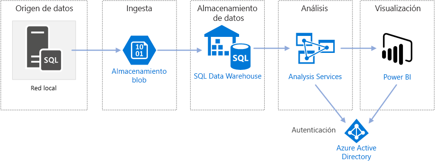
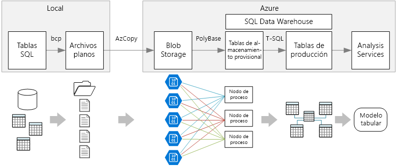

# Inteligencia empresarial en Azure con SQL Data Warehouse

Esta arquitectura de referencia implementa una canalización [ELT](../../data-guide/relational-data/etl.md#extract-load-and-transform-elt) (extracción, carga y transformación) que mueve los datos desde una base de datos de SQL Server local a SQL Data Warehouse y transforma los datos para el análisis. 

Hay disponible una implementación de referencia de esta arquitectura en [GitHub][github-folder]

**Escenario**: una organización tiene un gran conjunto de datos OLTP almacenado en una base de datos de SQL Server de forma local. La organización desea utilizar SQL Data Warehouse para realizar análisis con Power BI. 

Esta arquitectura de referencia está diseñada para trabajos únicos o a petición. Si tiene que mover los datos de forma continua (cada hora o diariamente), se recomienda utilizar Azure Data Factory de Azure para definir un flujo de trabajo automatizado. Para ver una arquitectura de referencia que use Data Factory, consulte [Inteligencia empresarial automatizada con SQL Data Warehouse y Azure Data Factory][adf-ra].

## Arquitectura

La arquitectura consta de los siguientes componentes:

### Origen de datos

**SQL Server**. Los datos de origen se encuentran en una base de datos de SQL Server de forma local. Para simular el entorno local, los scripts de implementación de esta arquitectura aprovisionan una máquina virtual en Azure con SQL Server instalado. La [base de datos OLTP de ejemplo de OLTP Wide World Importers][wwi] se usa como datos de origen.

### Ingesta y almacenamiento de datos

**Blob Storage**. Blob Storage se utiliza como un área de ensayo para copiar los datos antes de cargarlos en SQL Data Warehouse.

**Azure SQL Data Warehouse**. [SQL Data Warehouse](/azure/sql-data-warehouse/) es un sistema distribuido diseñado para realizar análisis con datos de gran tamaño. Admite el procesamiento paralelo masivo (MPP), lo que lo hace idóneo para ejecutar análisis de alto rendimiento. 

### Análisis e informes

**Azure Analysis Services**. [Analysis Services](/azure/analysis-services/) es un servicio completamente administrado que proporciona funcionalidades de modelado de datos. Use Analysis Services para crear un modelo semántico que los usuarios puedan consultar. Analysis Services es especialmente útil en un escenario de panel de BI. En esta arquitectura, Analysis Services lee los datos del almacenamiento de datos para procesar el modelo semántico, y atiende a las consultas del panel. También admite simultaneidad elástica mediante el escalado horizontal de réplicas para agilizar el procesamiento de consultas.

Actualmente, Azure Analysis Services admite los modelos tabulares pero no los multidimensionales. Los modelos tabulares utilizan construcciones de modelado relacional (tablas y columnas), mientras que los modelos multidimensionales usan construcciones de modelado OLAP (cubos, dimensiones y medidas). Si necesita modelos multidimensionales, utilice SQL Server Analysis Services (SSAS). Para más información, consulte [Comparar soluciones tabulares y multidimensionales](/sql/analysis-services/comparing-tabular-and-multidimensional-solutions-ssas).

**Power BI**. Power BI es un conjunto de herramientas de análisis de negocios que sirve para analizar datos con el fin de obtener perspectivas empresariales. En el caso de esta arquitectura consulta el modelo semántico almacenado en Analysis Services.

### Autenticación

**Azure Active Directory** (Azure AD) autentica a los usuarios que se conectan al servidor de Analysis Services mediante Power BI.

## Canalización de datos
 
Esta arquitectura de referencia usa la base de datos de ejemplo [WorldWideImporters](/sql/sample/world-wide-importers/wide-world-importers-oltp-database) como origen de datos. La canalización de datos tiene las siguientes fases:

1. Exportación de los datos de SQL Server a archivos planos (utilidad bcp).
2. Copia de los archivos planos en Azure Blob Storage (AzCopy).
3. Carga de los datos en SQL Data Warehouse (PolyBase).
4. Transformación de los datos en un esquema de estrella (T-SQL).
5. Carga de un modelo semántico en Analysis Services (SQL Server Data Tools).

 
> [!NOTE]
> Para los pasos del 1 al 3, considere la posibilidad de usar Data Platform Studio de Redgate. Data Platform Studio aplica las correcciones y optimizaciones de compatibilidad más adecuadas, por lo que es la forma más rápida de empezar a trabajar con SQL Data Warehouse. Para más información consulte [Carga de datos con Data Platform Studio de Redgate](/azure/sql-data-warehouse/sql-data-warehouse-load-with-redgate). 

En las secciones siguientes se describe en detalle cada una de estas etapas.

### Exportación de los datos de SQL Server

La utilidad [bcp](/sql/tools/bcp-utility) (programa de copia masiva) es una forma rápida de crear archivos planos de texto a partir de tablas SQL. En este paso, seleccione las columnas que desea exportar, pero no transforme los datos. Las transformaciones de datos deben realizarse en SQL Data Warehouse.

**Recomendaciones**

Si es posible, programe la extracción de datos durante las horas de poca actividad con el fin de minimizar la contención de recursos en el entorno de producción. 

Evite ejecutar bcp en el servidor de bases de datos. En su lugar, ejecútelo desde otra máquina. Escriba los archivos en una unidad local. Asegúrese de que tiene suficientes recursos de E/S para controlar las escrituras simultáneas. Para obtener un rendimiento óptimo, exporte los archivos a unidades de almacenamiento rápido dedicadas.

Puede acelerar la transferencia de red si guarda los datos exportados en un formato comprimido Gzip. De todas formas, la carga de archivos comprimidos en el almacenamiento es más lenta que la carga de archivos sin comprimir, por lo que la rapidez en la transferencia de red tiene como contrapartida una menor velocidad en la carga. Si decide utilizar compresión Gzip, no cree un único archivo Gzip. Divida los datos en varios archivos comprimidos.

### Copia de los archivos planos en Blob Storage

La utilidad [AzCopy](/azure/storage/common/storage-use-azcopy) está diseñada para la copia de alto rendimiento de datos en Azure Blob Storage.

**Recomendaciones**

Cree la cuenta de almacenamiento en una región cerca de la ubicación del origen de datos. Implemente la cuenta de almacenamiento y la instancia de SQL Data Warehouse en la misma región. 

No ejecute AzCopy en la misma máquina que ejecuta las cargas de trabajo de producción, ya que el consumo de CPU y E/S puede interferir con la carga de trabajo de producción. 

Pruebe la carga primero para ver cómo es la velocidad de carga. Puede utilizar la opción/NC en AzCopy para especificar el número de operaciones de copia simultáneas. Comience con el valor predeterminado, a continuación, experimente con este valor para optimizar el rendimiento. En un entorno con poco ancho de banda, demasiadas operaciones simultáneas pueden saturar la conexión de red e impedir que las operaciones se completen con éxito.  

AzCopy lleva los datos al almacenamiento a través de la red pública de Internet. Si esto no es lo suficientemente rápido, considere la posibilidad de configurar un circuito [ExpressRoute](/azure/expressroute/). ExpressRoute es un servicio que enruta los datos a Azure a través de una conexión privada dedicada. Otra opción, si la conexión de red es demasiado lenta, es enviar físicamente los datos en un disco a un centro de datos de Azure. Para más información consulte [Transferencia de datos a Azure y desde este](/azure/architecture/data-guide/scenarios/data-transfer).

Durante una operación de copia, AzCopy crea un archivo de diario temporal, lo que permite a AzCopy reiniciar la operación si esta se interrumpiese (por ejemplo, debido a un error de red). Asegúrese de que hay suficiente espacio en disco para almacenar los archivos de diario. Puede utilizar la opción /Z para especificar dónde se escriben los archivos de diario.

### Carga de los datos en SQL Data Warehouse

Use [PolyBase](/sql/relational-databases/polybase/polybase-guide) para cargar los archivos de Blob Storage al almacenamiento de datos. PolyBase está diseñado para aprovechar la arquitectura MPP (procesamiento masivo en paralelo) de SQL Data Warehouse, lo que lo convierte en la forma más rápida de cargar datos en SQL Data Warehouse. 

La carga de datos es un proceso de dos pasos:

1. Creación de un conjunto de tablas externas para los datos. Una tabla externa es una definición de tabla que apunta a los datos almacenados fuera del almacén &mdash; en este caso, a los archivos planos en Blob Storage. Este paso no mueve ningún dato al almacenamiento.
2. Creación de tablas de almacenamiento provisional y carga de los datos en las tablas de almacenamiento provisional. Este paso copia los datos en el almacenamiento.

**Recomendaciones**

Considere la posibilidad de usar SQL Data Warehouse cuando tenga grandes cantidades de datos (más de 1 TB) y esté ejecutando una carga de trabajo de análisis que aprovecharía el paralelismo. SQL Data Warehouse no es una buena opción para cargas de trabajo OLTP o conjuntos de datos más pequeños (< 250 GB). Para conjuntos de datos de un tamaño inferior a 250 GB, considere la posibilidad de usar Azure SQL Database o SQL Server. Para más información, consulte el artículo sobre [Almacenamiento de datos](../../data-guide/relational-data/data-warehousing.md).

Cree las tablas de almacenamiento provisional como tablas de montón, que no están indexadas. Las consultas que crean las tablas de producción darán como resultado un examen completo de la tabla, así que no hay ninguna razón para indexar las tablas de almacenamiento provisional.

PolyBase aprovecha automáticamente las ventajas del paralelismo en el almacenamiento. El rendimiento de carga se escala a medida que aumentan las unidades de almacenamiento de datos. Para obtener el mejor rendimiento, utilice una operación de carga única. Dividir los datos de entrada en fragmentos y ejecutar varias cargas simultáneas no beneficia al rendimiento.

PolyBase puede leer archivos comprimidos con Gzip. De todas formas, se usa un lector único por archivo comprimido, porque descomprimir el archivo es una operación de un solo subproceso. Por ello, evite cargar un único archivo comprimido grande. En su lugar, divida los datos en varios archivos comprimidos, para aprovechar las ventajas del paralelismo. 

Tenga en cuenta las siguientes limitaciones:

- PolyBase admite un tamaño máximo de columna de `varchar(8000)`, `nvarchar(4000)` o `varbinary(8000)`. Si tiene datos que superan estos límites, tiene la opción de dividir los datos en fragmentos al exportarlos y luego volver a ensamblar los fragmentos tras la importación. 

- PolyBase usa un terminador de fila fijo de \n o una línea nueva. Esto puede causar problemas si los caracteres de nueva línea aparecen en los datos de origen.

- El esquema de origen de datos podría contener tipos de datos que SQL Data Warehouse no admite.

Para evitar estas limitaciones, puede crear un procedimiento almacenado que realiza las conversiones necesarias. Haga referencia a este procedimiento almacenado cuando ejecute bcp. De forma alternativa, [Data Platform Studio de Redgate](/azure/sql-data-warehouse/sql-data-warehouse-load-with-redgate) convierte automáticamente los tipos de datos que SQL Data Warehouse no admite.

Para más información, consulte los siguientes artículos.

- [Procedimientos recomendados para la carga de datos en Azure SQL Data Warehouse](/azure/sql-data-warehouse/guidance-for-loading-data).
- [Migración de esquemas a SQL Data Warehouse](/azure/sql-data-warehouse/sql-data-warehouse-migrate-schema)
- [Guía para definir los tipos de datos para las tablas en SQL Data Warehouse](/azure/sql-data-warehouse/sql-data-warehouse-tables-data-types)

### Transformar los datos

Transforme los datos y muévalos a tablas de producción. En este paso, los datos se transforman en un esquema en estrella con tablas de dimensiones y tablas de hechos, adecuadas para el modelado semántico.

Cree las tablas de producción con índices de almacén de columnas en clúster que ofrecen el mejor rendimiento general para las consultas. Los índices de almacén de columnas están optimizados para consultas que examinan muchos registros. Sin embargo no funcionan tan bien para las búsquedas singleton (es decir aquellas en las que la búsqueda se reduce a una sola fila). Si tiene que realizar búsquedas singleton frecuentes, puede agregar un índice no agrupado en una tabla. Este tipo de búsquedas pueden ejecutarse de forma considerablemente más rápida usando un índice no agrupado. De todas formas, las búsquedas singleton son normalmente menos comunes en escenarios de almacenamiento de datos que las cargas de trabajo OLTP. Para más información, consulte [Indexación de tablas en SQL Data Warehouse](/azure/sql-data-warehouse/sql-data-warehouse-tables-index).

> [!NOTE]
> Las tablas de almacén de columnas agrupado no admiten tipos de datos `varchar(max)`, `nvarchar(max)` o `varbinary(max)`. En ese caso, considere la posibilidad de un índice agrupado o de montón. Puede colocar esas columnas en una tabla independiente.

Dado que la base de datos de ejemplo no es muy grande, hemos creado las tablas replicadas sin particiones. Para las cargas de trabajo de producción, el uso de tablas distribuidas probablemente mejore el rendimiento de las consultas. Consulte [Instrucciones para diseñar tablas distribuidas en Azure SQL Data Warehouse](/azure/sql-data-warehouse/sql-data-warehouse-tables-distribute). Los scripts de ejemplo ejecutan las consultas utilizando una [clase de recursos](/azure/sql-data-warehouse/resource-classes-for-workload-management) estática.

### Carga del modelo semántico

Cargue los datos en un modelo tabular en Azure Analysis Services. En este paso, creará un modelo de datos semánticos usando SQL Server Data Tools (SSDT). También puede crear un modelo mediante la importación desde un archivo de Power BI Desktop. Teniendo en cuenta que SQL Data Warehouse no admite las claves externas, tiene que agregar las relaciones al modelo semántico para que se puedan realizar uniones entre las tablas.

### Uso de Power BI para visualizar los datos

Power BI admite dos opciones para la conexión a Azure Analysis Services:

- Importación. Se importan los datos en el modelo BI.
- Conexión dinámica. Se extraen los datos directamente desde Analysis Services.

Se recomienda la conexión dinámica, ya que no requiere copiar los datos en el modelo de Power BI. Además, al usar DirectQuery se garantiza que los resultados siempre sean coherentes con los últimos datos de origen. Para más información, consulte [Conexión con Power BI](/azure/analysis-services/analysis-services-connect-pbi).

**Recomendaciones**

Evite ejecutar consultas de panel de BI directamente en el almacenamiento de datos. Los paneles BI requieren tiempos de respuesta muy bajos, es posible que las consultas directas realizadas en el almacenamiento no pueden satisfacer esta necesidad. Además, la actualización del panel se reflejará en el número de consultas simultáneas, lo que podría afectar al rendimiento. 

Azure Analysis Services está diseñado para controlar los requisitos de consulta de un panel de BI, por lo que es el método recomendado es consultar Analysis Services desde Power BI.

## Consideraciones sobre escalabilidad

### SQL Data Warehouse

Con SQL Data Warehouse, puede escalar horizontalmente los recursos de proceso a petición. El motor de consultas optimiza las consultas para el procesamiento paralelo en función del número de nodos de ejecución y mueve los datos entre los nodos según sea necesario. Para más información consulte [Administración de proceso en Azure SQL Data Warehouse](/azure/sql-data-warehouse/sql-data-warehouse-manage-compute-overview).

### Analysis Services

Para las cargas de trabajo de producción, se recomienda el nivel estándar para Azure Analysis Services, ya que admite la creación de particiones y DirectQuery. Dentro de un nivel, el tamaño de la instancia determina la memoria y potencia de procesamiento. La capacidad de procesamiento se mide en unidades de procesamiento de consultas (QPU). Supervise el uso de las QPU para seleccionar el tamaño adecuado. Para más información, consulte [Supervisión de las métricas del servidor](/azure/analysis-services/analysis-services-monitor).

Bajo una carga alta, el rendimiento de las consultas se puede ver degradado debido a la simultaneidad de las mismas. Puede escalar horizontalmente Analysis Services mediante la creación de un grupo de réplicas para procesar las consultas, para que se pueden realizar más consultas simultáneamente. El trabajo de procesar el modelo de datos siempre se produce en el servidor principal. De forma predeterminada, el servidor principal también controla las consultas. Si lo desea, puede designar al servidor principal para que ejecute el procesamiento de modo exclusivo, de modo que el grupo de consulta controle todas las consultas. Si los requisitos de procesamiento son altos, debe separar el procesamiento del grupo de consulta. Si tiene cargas de consulta elevadas, y un procesamiento relativamente ligero, puede incluir el servidor principal en el grupo de consulta. Para más información consulte [Escalabilidad horizontal de Azure Analysis Services](/azure/analysis-services/analysis-services-scale-out). 

Para reducir la cantidad de procesamiento innecesario, considere la posibilidad de utilizar particiones para dividir el modelo tabular en partes lógicas. Cada partición se puede procesar por separado. Para más información consulte [Particiones](/sql/analysis-services/tabular-models/partitions-ssas-tabular).

## Consideraciones sobre la seguridad

### Creación de listas de direcciones IP permitidas de clientes de Analysis Services

Considere el uso de la característica de firewall de Analysis Services para crear una lista de direcciones IP permitidas de clientes. Cuando está habilitada, la característica de firewall bloquea todas las conexiones de cliente a excepción de las especificadas en las reglas de firewall. El servicio Power BI se encuentra en la lista de permitidos de forma predeterminada, pero se puede deshabilitar esta regla si lo desea. Para más información, consulte [Hardening Azure Analysis Services with the new firewall capability](https://azure.microsoft.com/blog/hardening-azure-analysis-services-with-the-new-firewall-capability/) (Protección de Azure Analysis Services con la nueva funcionalidad de firewall).

### Autorización

Azure Analysis Services usa Azure Active Directory (Azure AD) para autenticar a los usuarios que se conectan a un servidor de Analysis Services. Puede restringir los datos que un usuario determinado puede ver mediante la creación de roles, y después asignar grupos o usuarios de Azure AD a esos roles. Para cada rol puede hacer lo siguiente: 

- Proteger las tablas o columnas individuales. 
- Proteger filas individuales en base a expresiones de filtro. 

Para más información, consulte [Administración de usuarios y roles de base de datos](/azure/analysis-services/analysis-services-database-users).

## Implementación de la solución

Para la implementación y ejecución de la implementación de referencia, siga los pasos del [Léame de GitHub][github-folder]. Implementa lo siguiente:

  * Una máquina virtual Windows para simular un servidor de bases de datos local. Incluye SQL Server 2017 y herramientas relacionadas, junto con Power BI Desktop.
  * Una cuenta de almacenamiento de Azure que proporciona almacenamiento de blobs para almacenar los datos exportados de la base de datos de SQL Server.
  * Una instancia de Azure SQL Data Warehouse.
  * Una instancia de Azure Analysis Services.

## Pasos siguientes

- Use Azure Data Factory para automatizar la canalización de ELT. Consulte [Inteligencia empresarial automatizada con SQL Data Warehouse y Azure Data Factory][adf-ra].

<!-- links -->

[adf-ra]: ./enterprise-bi-adf.md
[github-folder]: https://github.com/mspnp/reference-architectures/tree/master/data/enterprise_bi_sqldw
[wwi]: /sql/sample/world-wide-importers/wide-world-importers-oltp-database

