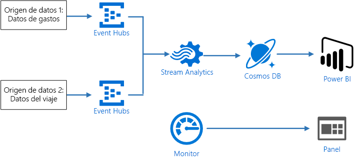
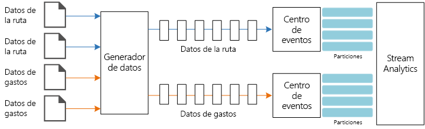
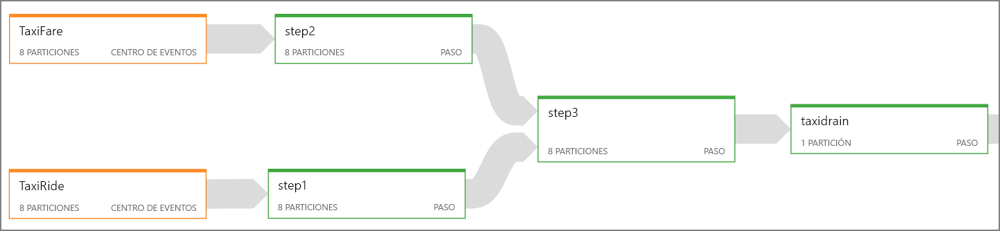
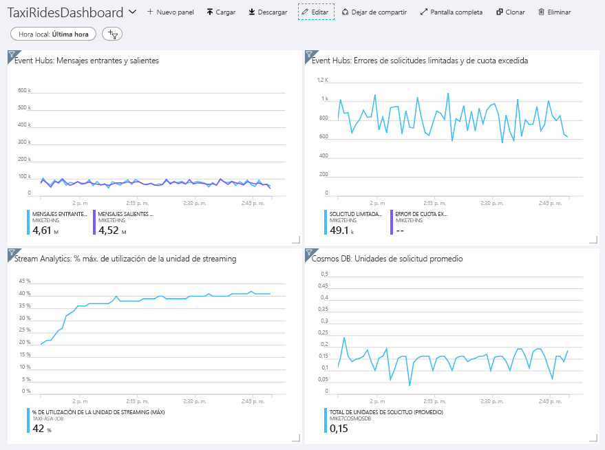
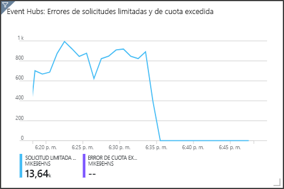

# <a name="stream-processing-with-azure-stream-analytics"></a><span data-ttu-id="c562a-103">Procesamiento de flujos de datos con Azure Stream Analytics</span><span class="sxs-lookup"><span data-stu-id="c562a-103">Stream processing with Azure Stream Analytics</span></span>

<span data-ttu-id="c562a-104">Esta arquitectura de referencia muestra una canalización de procesamiento de flujos de datos de un extremo a otro.</span><span class="sxs-lookup"><span data-stu-id="c562a-104">This reference architecture shows an end-to-end stream processing pipeline.</span></span> <span data-ttu-id="c562a-105">La canalización ingiere los datos de dos orígenes, correlaciona los registros de los dos flujos de datos y calcula una media acumulada en un intervalo de tiempo.</span><span class="sxs-lookup"><span data-stu-id="c562a-105">The pipeline ingests data from two sources, correlates records in the two streams, and calculates a rolling average across a time window.</span></span> <span data-ttu-id="c562a-106">Los resultados se almacenan para su posterior análisis.</span><span class="sxs-lookup"><span data-stu-id="c562a-106">The results are stored for further analysis.</span></span> 

<span data-ttu-id="c562a-107">Hay disponible una implementación de referencia de esta arquitectura en [GitHub][github].</span><span class="sxs-lookup"><span data-stu-id="c562a-107">A reference implementation for this architecture is available on [GitHub][github].</span></span> 



<span data-ttu-id="c562a-108">**Escenario**: una empresa de taxi recopila los datos acerca de cada carrera de taxi.</span><span class="sxs-lookup"><span data-stu-id="c562a-108">**Scenario**: A taxi company collects data about each taxi trip.</span></span> <span data-ttu-id="c562a-109">En este escenario, se supone que hay dos dispositivos independientes que envían datos.</span><span class="sxs-lookup"><span data-stu-id="c562a-109">For this scenario, we assume there are two separate devices sending data.</span></span> <span data-ttu-id="c562a-110">El taxi tienen un medidor que envía la información acerca de cada carrera: duración, distancia y ubicaciones de recogida y destino.</span><span class="sxs-lookup"><span data-stu-id="c562a-110">The taxi has a meter that sends information about each ride &mdash; the duration, distance, and pickup and dropoff locations.</span></span> <span data-ttu-id="c562a-111">Un dispositivo independiente acepta los pagos de clientes y envía los datos sobre las tarifas.</span><span class="sxs-lookup"><span data-stu-id="c562a-111">A separate device accepts payments from customers and sends data about fares.</span></span> <span data-ttu-id="c562a-112">La empresa de taxi desea calcular el promedio de propinas por milla conducida, en tiempo real, con el fin de identificar las tendencias.</span><span class="sxs-lookup"><span data-stu-id="c562a-112">The taxi company wants to calculate the average tip per mile driven, in real time, in order to spot trends.</span></span>

## <a name="architecture"></a><span data-ttu-id="c562a-113">Arquitectura</span><span class="sxs-lookup"><span data-stu-id="c562a-113">Architecture</span></span>

<span data-ttu-id="c562a-114">La arquitectura consta de los siguientes componentes:</span><span class="sxs-lookup"><span data-stu-id="c562a-114">The architecture consists of the following components.</span></span>

<span data-ttu-id="c562a-115">**Orígenes de datos**.</span><span class="sxs-lookup"><span data-stu-id="c562a-115">**Data sources**.</span></span> <span data-ttu-id="c562a-116">En esta arquitectura, hay dos orígenes de datos que generan flujos de datos en tiempo real.</span><span class="sxs-lookup"><span data-stu-id="c562a-116">In this architecture, there are two data sources that generate data streams in real time.</span></span> <span data-ttu-id="c562a-117">El primer flujo de datos contiene información sobre la carrera y, el segundo, contiene información sobre las tarifas.</span><span class="sxs-lookup"><span data-stu-id="c562a-117">The first stream contains ride information, and the second contains fare information.</span></span> <span data-ttu-id="c562a-118">La arquitectura de referencia incluye un generador de datos simulados que lee un conjunto de archivos estáticos e inserta los datos en Event Hubs.</span><span class="sxs-lookup"><span data-stu-id="c562a-118">The reference architecture includes a simulated data generator that reads from a set of static files and pushes the data to Event Hubs.</span></span> <span data-ttu-id="c562a-119">En una aplicación real, los orígenes de datos serían los dispositivos instalados en el taxi.</span><span class="sxs-lookup"><span data-stu-id="c562a-119">In a real application, the data sources would be devices installed in the taxi cabs.</span></span>

<span data-ttu-id="c562a-120">**Azure Event Hubs**.</span><span class="sxs-lookup"><span data-stu-id="c562a-120">**Azure Event Hubs**.</span></span> <span data-ttu-id="c562a-121">[Event Hubs](/azure/event-hubs/) es un servicio de ingesta de eventos.</span><span class="sxs-lookup"><span data-stu-id="c562a-121">[Event Hubs](/azure/event-hubs/) is an event ingestion service.</span></span> <span data-ttu-id="c562a-122">Esta arquitectura emplea dos instancias de centro de eventos, uno para cada origen de datos.</span><span class="sxs-lookup"><span data-stu-id="c562a-122">This architecture uses two event hub instances, one for each data source.</span></span> <span data-ttu-id="c562a-123">Cada origen de datos envía un flujo de datos al centro de eventos asociado.</span><span class="sxs-lookup"><span data-stu-id="c562a-123">Each data source sends a stream of data to the associated event hub.</span></span>

<span data-ttu-id="c562a-124">**Azure Stream Analytics**.</span><span class="sxs-lookup"><span data-stu-id="c562a-124">**Azure Stream Analytics**.</span></span> <span data-ttu-id="c562a-125">[Stream Analytics](/azure/stream-analytics/) es un motor de procesamiento de eventos.</span><span class="sxs-lookup"><span data-stu-id="c562a-125">[Stream Analytics](/azure/stream-analytics/) is an event-processing engine.</span></span> <span data-ttu-id="c562a-126">Un trabajo de Stream Analytics lee los flujos de datos desde los dos centros de eventos y realiza el procesamiento de los flujos.</span><span class="sxs-lookup"><span data-stu-id="c562a-126">A Stream Analytics job reads the data streams from the two event hubs and performs stream processing.</span></span>

<span data-ttu-id="c562a-127">**Cosmos DB**.</span><span class="sxs-lookup"><span data-stu-id="c562a-127">**Cosmos DB**.</span></span> <span data-ttu-id="c562a-128">La salida del trabajo de Stream Analytics es una serie de registros que se escriben como documentos JSON en una base de datos de documentos de Cosmos DB.</span><span class="sxs-lookup"><span data-stu-id="c562a-128">The output from the Stream Analytics job is a series of records, which are written as JSON documents to a Cosmos DB document database.</span></span>

<span data-ttu-id="c562a-129">**Microsoft Power BI**.</span><span class="sxs-lookup"><span data-stu-id="c562a-129">**Microsoft Power BI**.</span></span> <span data-ttu-id="c562a-130">Power BI es un conjunto de herramientas de análisis de negocios que sirve para analizar datos con el fin de obtener perspectivas empresariales.</span><span class="sxs-lookup"><span data-stu-id="c562a-130">Power BI is a suite of business analytics tools to analyze data for business insights.</span></span> <span data-ttu-id="c562a-131">En esta arquitectura, carga los datos desde Cosmos DB.</span><span class="sxs-lookup"><span data-stu-id="c562a-131">In this architecture, it loads the data from Cosmos DB.</span></span> <span data-ttu-id="c562a-132">Esto permite a los usuarios analizar el conjunto completo de los datos históricos que se han recopilado.</span><span class="sxs-lookup"><span data-stu-id="c562a-132">This allows users to analyze the complete set of historical data that's been collected.</span></span> <span data-ttu-id="c562a-133">También podría transmitir los resultados directamente desde Stream Analytics a Power BI para obtener una vista en tiempo real de los datos.</span><span class="sxs-lookup"><span data-stu-id="c562a-133">You could also stream the results directly from Stream Analytics to Power BI for a real-time view of the data.</span></span> <span data-ttu-id="c562a-134">Para más información, consulte [Streaming en tiempo real en Power BI](/power-bi/service-real-time-streaming).</span><span class="sxs-lookup"><span data-stu-id="c562a-134">For more information, see [Real-time streaming in Power BI](/power-bi/service-real-time-streaming).</span></span>

<span data-ttu-id="c562a-135">**Azure Monitor**.</span><span class="sxs-lookup"><span data-stu-id="c562a-135">**Azure Monitor**.</span></span> <span data-ttu-id="c562a-136">[Azure Monitor](/azure/monitoring-and-diagnostics/) recopila métricas de rendimiento sobre los servicios de Azure implementados en la solución.</span><span class="sxs-lookup"><span data-stu-id="c562a-136">[Azure Monitor](/azure/monitoring-and-diagnostics/) collects performance metrics about the Azure services deployed in the solution.</span></span> <span data-ttu-id="c562a-137">Puede visualizarlos en un panel para obtener información acerca del estado de la solución.</span><span class="sxs-lookup"><span data-stu-id="c562a-137">By visualizing these in a dashboard, you can get insights into the health of the solution.</span></span> 

## <a name="data-ingestion"></a><span data-ttu-id="c562a-138">Ingesta de datos</span><span class="sxs-lookup"><span data-stu-id="c562a-138">Data ingestion</span></span>

<span data-ttu-id="c562a-139">Para simular un origen de datos, esta arquitectura de referencia usa el conjunto de datos [New York City Taxi Data](https://uofi.app.box.com/v/NYCtaxidata/folder/2332218797)<sup>[[1]](#note1)</sup>.</span><span class="sxs-lookup"><span data-stu-id="c562a-139">To simulate a data source, this reference architecture uses the [New York City Taxi Data](https://uofi.app.box.com/v/NYCtaxidata/folder/2332218797) dataset<sup>[[1]](#note1)</sup>.</span></span> <span data-ttu-id="c562a-140">Este conjunto de datos contiene datos acerca de carreras de taxi en la ciudad de Nueva York durante un período de 4 años (de 2010 a 2013).</span><span class="sxs-lookup"><span data-stu-id="c562a-140">This dataset contains data about taxi trips in New York City over a 4-year period (2010 &ndash; 2013).</span></span> <span data-ttu-id="c562a-141">Contiene dos tipos de registros: datos de carreras y datos de tarifas.</span><span class="sxs-lookup"><span data-stu-id="c562a-141">It contains two types of record: Ride data and fare data.</span></span> <span data-ttu-id="c562a-142">Los datos de carreras incluyen la duración del viaje, la distancia de viaje y la ubicación de recogida y destino.</span><span class="sxs-lookup"><span data-stu-id="c562a-142">Ride data includes trip duration, trip distance, and pickup and dropoff location.</span></span> <span data-ttu-id="c562a-143">Los datos de tarifas incluyen las tarifas, los impuestos y las propinas.</span><span class="sxs-lookup"><span data-stu-id="c562a-143">Fare data includes fare, tax, and tip amounts.</span></span> <span data-ttu-id="c562a-144">Los campos comunes en ambos tipos de registro son la placa y el número de licencia, y el identificador del proveedor.</span><span class="sxs-lookup"><span data-stu-id="c562a-144">Common fields in both record types include medallion number, hack license, and vendor ID.</span></span> <span data-ttu-id="c562a-145">Juntos, estos tres campos identifican un taxi además del conductor.</span><span class="sxs-lookup"><span data-stu-id="c562a-145">Together these three fields uniquely identify a taxi plus a driver.</span></span> <span data-ttu-id="c562a-146">Los datos se almacenan en formato CSV.</span><span class="sxs-lookup"><span data-stu-id="c562a-146">The data is stored in CSV format.</span></span> 

<span data-ttu-id="c562a-147">[1] <span id="note1">Donovan, Brian; Work, Dan (2016): New York City Taxi Trip Data (2010-2013).</span><span class="sxs-lookup"><span data-stu-id="c562a-147">[1] <span id="note1">Donovan, Brian; Work, Dan (2016): New York City Taxi Trip Data (2010-2013).</span></span> <span data-ttu-id="c562a-148">Universidad de Illinois en Urbana-Champaign.</span><span class="sxs-lookup"><span data-stu-id="c562a-148">University of Illinois at Urbana-Champaign.</span></span> <span data-ttu-id="c562a-149">https://doi.org/10.13012/J8PN93H8</span><span class="sxs-lookup"><span data-stu-id="c562a-149">https://doi.org/10.13012/J8PN93H8</span></span>

<span data-ttu-id="c562a-150">El generador de datos es una aplicación de .NET Core que lee los registros y los envía a Azure Event Hubs.</span><span class="sxs-lookup"><span data-stu-id="c562a-150">The data generator is a .NET Core application that reads the records and sends them to Azure Event Hubs.</span></span> <span data-ttu-id="c562a-151">El generador envía los datos de carreras en formato JSON y los datos de tarifas en formato CSV.</span><span class="sxs-lookup"><span data-stu-id="c562a-151">The generator sends ride data in JSON format and fare data in CSV format.</span></span> 

<span data-ttu-id="c562a-152">Event Hubs usa [particiones](/azure/event-hubs/event-hubs-features#partitions) para segmentar los datos.</span><span class="sxs-lookup"><span data-stu-id="c562a-152">Event Hubs uses [partitions](/azure/event-hubs/event-hubs-features#partitions) to segment the data.</span></span> <span data-ttu-id="c562a-153">Las particiones permiten a los consumidores leer cada partición en paralelo.</span><span class="sxs-lookup"><span data-stu-id="c562a-153">Partitions allow a consumer to read each partition in parallel.</span></span> <span data-ttu-id="c562a-154">Cuando se envían datos a Event Hubs, puede especificar explícitamente la clave de partición.</span><span class="sxs-lookup"><span data-stu-id="c562a-154">When you send data to Event Hubs, you can specify the partition key explicitly.</span></span> <span data-ttu-id="c562a-155">En caso contrario, los registros se asignan a las particiones en modo round-robin.</span><span class="sxs-lookup"><span data-stu-id="c562a-155">Otherwise, records are assigned to partitions in round-robin fashion.</span></span> 

<span data-ttu-id="c562a-156">En este escenario en particular, los datos de carreras y los datos de tarifas deben terminar con el mismo identificador de partición para un taxi determinado.</span><span class="sxs-lookup"><span data-stu-id="c562a-156">In this particular scenario, ride data and fare data should end up with the same partition ID for a given taxi cab.</span></span> <span data-ttu-id="c562a-157">Esto permite a Stream Analytics aplicar un cierto paralelismo cuando se establece una correlación entre los dos flujos.</span><span class="sxs-lookup"><span data-stu-id="c562a-157">This enables Stream Analytics to apply a degree of parallelism when it correlates the two streams.</span></span> <span data-ttu-id="c562a-158">Un registro en la partición *n* de los datos de carreras coincidirá con un registro en la partición de datos *n* de los datos de tarifas.</span><span class="sxs-lookup"><span data-stu-id="c562a-158">A record in partition *n* of the ride data will match a record in partition *n* of the fare data.</span></span>



<span data-ttu-id="c562a-159">En el generador de datos, el modelo de datos común para ambos tipos de registro tiene una propiedad `PartitionKey` que es la concatenación de `Medallion`, `HackLicense` y `VendorId`.</span><span class="sxs-lookup"><span data-stu-id="c562a-159">In the data generator, the common data model for both record types has a `PartitionKey` property which is the concatenation of `Medallion`, `HackLicense`, and `VendorId`.</span></span>

```csharp
public abstract class TaxiData
{
    public TaxiData()
    {
    }

    [JsonProperty]
    public long Medallion { get; set; }

    [JsonProperty]
    public long HackLicense { get; set; }

    [JsonProperty]
    public string VendorId { get; set; }

    [JsonProperty]
    public DateTimeOffset PickupTime { get; set; }

    [JsonIgnore]
    public string PartitionKey
    {
        get => $"{Medallion}_{HackLicense}_{VendorId}";
    }
```

<span data-ttu-id="c562a-160">Esta propiedad se utiliza para proporcionar una clave de partición explícita cuando se realizan envíos a Event Hubs:</span><span class="sxs-lookup"><span data-stu-id="c562a-160">This property is used to provide an explicit partition key when sending to Event Hubs:</span></span>

```csharp
using (var client = pool.GetObject())
{
    return client.Value.SendAsync(new EventData(Encoding.UTF8.GetBytes(
        t.GetData(dataFormat))), t.PartitionKey);
}
```

## <a name="stream-processing"></a><span data-ttu-id="c562a-161">Procesamiento de flujos</span><span class="sxs-lookup"><span data-stu-id="c562a-161">Stream processing</span></span>

<span data-ttu-id="c562a-162">El trabajo de procesamiento de flujos se define mediante una consulta SQL con diferentes pasos.</span><span class="sxs-lookup"><span data-stu-id="c562a-162">The stream processing job is defined using a SQL query with several distinct steps.</span></span> <span data-ttu-id="c562a-163">Los dos primeros pasos simplemente seleccionan los registros de los dos flujos de entrada.</span><span class="sxs-lookup"><span data-stu-id="c562a-163">The first two steps simply select records from the two input streams.</span></span>

```sql
WITH
Step1 AS (
    SELECT PartitionId,
           TRY_CAST(Medallion AS nvarchar(max)) AS Medallion,
           TRY_CAST(HackLicense AS nvarchar(max)) AS HackLicense,
           VendorId,
           TRY_CAST(PickupTime AS datetime) AS PickupTime,
           TripDistanceInMiles
    FROM [TaxiRide] PARTITION BY PartitionId
),
Step2 AS (
    SELECT PartitionId,
           medallion AS Medallion,
           hack_license AS HackLicense,
           vendor_id AS VendorId,
           TRY_CAST(pickup_datetime AS datetime) AS PickupTime,
           tip_amount AS TipAmount
    FROM [TaxiFare] PARTITION BY PartitionId
),
```

<span data-ttu-id="c562a-164">El paso siguiente combina los dos flujos de entrada para seleccionar los registros coincidentes de cada flujo.</span><span class="sxs-lookup"><span data-stu-id="c562a-164">The next step joins the two input streams to select matching records from each stream.</span></span>

```sql
Step3 AS (
  SELECT
         tr.Medallion,
         tr.HackLicense,
         tr.VendorId,
         tr.PickupTime,
         tr.TripDistanceInMiles,
         tf.TipAmount
    FROM [Step1] tr
    PARTITION BY PartitionId
    JOIN [Step2] tf PARTITION BY PartitionId
      ON tr.Medallion = tf.Medallion
     AND tr.HackLicense = tf.HackLicense
     AND tr.VendorId = tf.VendorId
     AND tr.PickupTime = tf.PickupTime
     AND tr.PartitionId = tf.PartitionId
     AND DATEDIFF(minute, tr, tf) BETWEEN 0 AND 15
)
```

<span data-ttu-id="c562a-165">Esta consulta combina los registros en un conjunto de campos que identifican los registros coincidentes de forma única (Medallion, HackLicense, VendorId y PickupTime).</span><span class="sxs-lookup"><span data-stu-id="c562a-165">This query joins records on a set of fields that uniquely identify matching records (Medallion, HackLicense, VendorId, and PickupTime).</span></span> <span data-ttu-id="c562a-166">La instrucción `JOIN` también incluye el identificador de partición.</span><span class="sxs-lookup"><span data-stu-id="c562a-166">The `JOIN` statement also includes the partition ID.</span></span> <span data-ttu-id="c562a-167">Como ya se mencionó, esto aprovecha el hecho de que los registros coincidentes siempre tienen el mismo identificador de partición en este escenario.</span><span class="sxs-lookup"><span data-stu-id="c562a-167">As mentioned, this takes advantage of the fact that matching records always have the same partition ID in this scenario.</span></span>

<span data-ttu-id="c562a-168">En Stream Analytics, las combinaciones son *temporales*, lo que significa que los registros se combinan dentro de un intervalo de tiempo determinado.</span><span class="sxs-lookup"><span data-stu-id="c562a-168">In Stream Analytics, joins are *temporal*, meaning records are joined within a particular window of time.</span></span> <span data-ttu-id="c562a-169">De caso contrario, el trabajo podría tener que esperar indefinidamente a una coincidencia.</span><span class="sxs-lookup"><span data-stu-id="c562a-169">Otherwise, the job might need to wait indefinitely for a match.</span></span> <span data-ttu-id="c562a-170">La función [DATEDIFF](https://msdn.microsoft.com/azure/stream-analytics/reference/join-azure-stream-analytics) especifica la separación máxima en el tiempo de dos registros coincidentes para considerarlo una coincidencia.</span><span class="sxs-lookup"><span data-stu-id="c562a-170">The [DATEDIFF](https://msdn.microsoft.com/azure/stream-analytics/reference/join-azure-stream-analytics) function specifies how far two matching records can be separated in time for a match.</span></span> 

<span data-ttu-id="c562a-171">El último paso del trabajo calcula la media de propinas por milla, agrupada por una ventana de salto de 5 minutos.</span><span class="sxs-lookup"><span data-stu-id="c562a-171">The last step in the job computes the average tip per mile, grouped by a hopping window of 5 minutes.</span></span>

```sql
SELECT System.Timestamp AS WindowTime,
       SUM(tr.TipAmount) / SUM(tr.TripDistanceInMiles) AS AverageTipPerMile
  INTO [TaxiDrain]
  FROM [Step3] tr
  GROUP BY HoppingWindow(Duration(minute, 5), Hop(minute, 1))
```

<span data-ttu-id="c562a-172">Stream Analytics proporciona varias [funciones de intervalos de tiempo](/azure/stream-analytics/stream-analytics-window-functions).</span><span class="sxs-lookup"><span data-stu-id="c562a-172">Stream Analytics provides several [windowing functions](/azure/stream-analytics/stream-analytics-window-functions).</span></span> <span data-ttu-id="c562a-173">Una ventana de salto avanza en el tiempo un período fijo; en este caso, 1 minuto por salto.</span><span class="sxs-lookup"><span data-stu-id="c562a-173">A hopping window moves forward in time by a fixed period, in this case 1 minute per hop.</span></span> <span data-ttu-id="c562a-174">El objetivo es calcular una media móvil en los últimos cinco minutos.</span><span class="sxs-lookup"><span data-stu-id="c562a-174">The result is to calculate a moving average over the past 5 minutes.</span></span>

<span data-ttu-id="c562a-175">En la arquitectura que se muestra a continuación, solo se guardan los resultados del trabajo de Stream Analytics en Cosmos DB.</span><span class="sxs-lookup"><span data-stu-id="c562a-175">In the architecture shown here, only the results of the Stream Analytics job are saved to Cosmos DB.</span></span> <span data-ttu-id="c562a-176">En un escenario de macrodatos, considere la posibilidad de usar también [Event Hubs Capture](/azure/event-hubs/event-hubs-capture-overview) para guardar los datos de eventos sin procesar en Azure Blob Storage.</span><span class="sxs-lookup"><span data-stu-id="c562a-176">For a big data scenario, consider also using [Event Hubs Capture](/azure/event-hubs/event-hubs-capture-overview) to save the raw event data into Azure Blob storage.</span></span> <span data-ttu-id="c562a-177">Mantener los datos sin procesar le permitirá ejecutar consultas por lotes en los datos históricos en el futuro, con el fin de obtener información nueva a partir de los datos.</span><span class="sxs-lookup"><span data-stu-id="c562a-177">Keeping the raw data will allow you to run batch queries over your historical data at later time, in order to derive new insights from the data.</span></span>

## <a name="scalability-considerations"></a><span data-ttu-id="c562a-178">Consideraciones sobre escalabilidad</span><span class="sxs-lookup"><span data-stu-id="c562a-178">Scalability considerations</span></span>

### <a name="event-hubs"></a><span data-ttu-id="c562a-179">Event Hubs</span><span class="sxs-lookup"><span data-stu-id="c562a-179">Event Hubs</span></span>

<span data-ttu-id="c562a-180">La capacidad de procesamiento de Event Hubs se mide en [unidades de procesamiento](/azure/event-hubs/event-hubs-features#throughput-units).</span><span class="sxs-lookup"><span data-stu-id="c562a-180">The throughput capacity of Event Hubs is measured in [throughput units](/azure/event-hubs/event-hubs-features#throughput-units).</span></span> <span data-ttu-id="c562a-181">Para escalar un centro de eventos automáticamente, puede habilitar el [inflado automático](/azure/event-hubs/event-hubs-auto-inflate), que permite escalar las unidades de procesamiento en función del tráfico, hasta un máximo configurado.</span><span class="sxs-lookup"><span data-stu-id="c562a-181">You can autoscale an event hub by enabling [auto-inflate](/azure/event-hubs/event-hubs-auto-inflate), which automatically scales the throughput units based on traffic, up to a configured maximum.</span></span> 

### <a name="stream-analytics"></a><span data-ttu-id="c562a-182">Stream Analytics</span><span class="sxs-lookup"><span data-stu-id="c562a-182">Stream Analytics</span></span>

<span data-ttu-id="c562a-183">Para Stream Analytics, los recursos de proceso que se asignan a un trabajo se miden en unidades de streaming.</span><span class="sxs-lookup"><span data-stu-id="c562a-183">For Stream Analytics, the computing resources allocated to a job are measured in Streaming Units.</span></span> <span data-ttu-id="c562a-184">Los trabajos de Stream Analytics escalan mejor si el trabajo se puede ejecutar en paralelo.</span><span class="sxs-lookup"><span data-stu-id="c562a-184">Stream Analytics jobs scale best if the job can be parallelized.</span></span> <span data-ttu-id="c562a-185">De este modo, Stream Analytics puede distribuir el trabajo entre varios nodos de proceso.</span><span class="sxs-lookup"><span data-stu-id="c562a-185">That way, Stream Analytics can distribute the job across multiple compute nodes.</span></span>

<span data-ttu-id="c562a-186">Para los datos de entrada de Event Hubs, utilice la palabra clave `PARTITION BY` para dividir el trabajo de Stream Analytics en particiones.</span><span class="sxs-lookup"><span data-stu-id="c562a-186">For Event Hubs input, use the `PARTITION BY` keyword to partition the Stream Analytics job.</span></span> <span data-ttu-id="c562a-187">Los datos se dividirán en subconjuntos en función de las particiones de Event Hubs.</span><span class="sxs-lookup"><span data-stu-id="c562a-187">The data will be divided into subsets based on the Event Hubs partitions.</span></span> 

<span data-ttu-id="c562a-188">Las funciones de intervalos de tiempo y las combinaciones temporales requieren unidades de streaming adicionales.</span><span class="sxs-lookup"><span data-stu-id="c562a-188">Windowing functions and temporal joins require additional SU.</span></span> <span data-ttu-id="c562a-189">Cuando sea posible, use `PARTITION BY` para que cada partición se procese por separado.</span><span class="sxs-lookup"><span data-stu-id="c562a-189">When possible, use `PARTITION BY` so that each partition is processed separately.</span></span> <span data-ttu-id="c562a-190">Para más información, consulte [Descripción y ajuste de las unidades de streaming](/azure/stream-analytics/stream-analytics-streaming-unit-consumption#windowed-aggregates).</span><span class="sxs-lookup"><span data-stu-id="c562a-190">For more information, see [Understand and adjust Streaming Units](/azure/stream-analytics/stream-analytics-streaming-unit-consumption#windowed-aggregates).</span></span>

<span data-ttu-id="c562a-191">Si no es posible ejecutar todo el trabajo de Stream Analytics en paralelo, intente dividirlo en varios pasos, empezando con uno o varios pasos en paralelo.</span><span class="sxs-lookup"><span data-stu-id="c562a-191">If it's not possible to parallelize the entire Stream Analytics job, try to break the job into multiple steps, starting with one or more parallel steps.</span></span> <span data-ttu-id="c562a-192">De este modo, los primeros pasos que pueden ejecutar en paralelo.</span><span class="sxs-lookup"><span data-stu-id="c562a-192">That way, the first steps can run in parallel.</span></span> <span data-ttu-id="c562a-193">Por ejemplo, en esta arquitectura de referencia:</span><span class="sxs-lookup"><span data-stu-id="c562a-193">For example, in this reference architecture:</span></span>

- <span data-ttu-id="c562a-194">Los pasos 1 y 2 son instrucciones `SELECT` simples que seleccionan registros dentro de una sola partición.</span><span class="sxs-lookup"><span data-stu-id="c562a-194">Steps 1 and 2 are simple `SELECT` statements that select records within a single partition.</span></span> 
- <span data-ttu-id="c562a-195">El paso 3 realiza una combinación con particiones en los dos flujos de entrada.</span><span class="sxs-lookup"><span data-stu-id="c562a-195">Step 3 performs a partitioned join across two input streams.</span></span> <span data-ttu-id="c562a-196">Este paso aprovecha del hecho de que los registros que coinciden comparten la misma clave de partición y, por lo tanto, garantiza que tendrán el mismo identificador de partición en cada flujo de entrada.</span><span class="sxs-lookup"><span data-stu-id="c562a-196">This step takes advantage of the fact that matching records share the same partition key, and so are guaranteed to have the same partition ID in each input stream.</span></span>
- <span data-ttu-id="c562a-197">El paso 4 realiza la agregación en todas las particiones.</span><span class="sxs-lookup"><span data-stu-id="c562a-197">Step 4 aggregates across all of the partitions.</span></span> <span data-ttu-id="c562a-198">Este paso no se puede ejecutar en paralelo.</span><span class="sxs-lookup"><span data-stu-id="c562a-198">This step cannot be parallelized.</span></span>

<span data-ttu-id="c562a-199">Use el [diagrama de trabajo](/azure/stream-analytics/stream-analytics-job-diagram-with-metrics) de Stream Analytics para ver cuántas particiones se asignan a cada paso del trabajo.</span><span class="sxs-lookup"><span data-stu-id="c562a-199">Use the Stream Analytics [job diagram](/azure/stream-analytics/stream-analytics-job-diagram-with-metrics) to see how many partitions are assigned to each step in the job.</span></span> <span data-ttu-id="c562a-200">El siguiente diagrama muestra el diagrama de trabajo de esta arquitectura de referencia:</span><span class="sxs-lookup"><span data-stu-id="c562a-200">The following diagram shows the job diagram for this reference architecture:</span></span>



### <a name="cosmos-db"></a><span data-ttu-id="c562a-201">Cosmos DB</span><span class="sxs-lookup"><span data-stu-id="c562a-201">Cosmos DB</span></span>

<span data-ttu-id="c562a-202">La capacidad de rendimiento de Cosmos DB se mide en [unidades de solicitud](/azure/cosmos-db/request-units) (RU).</span><span class="sxs-lookup"><span data-stu-id="c562a-202">Throughput capacity for Cosmos DB is measured in [Request Units](/azure/cosmos-db/request-units) (RU).</span></span> <span data-ttu-id="c562a-203">Para escalar un contenedor de Cosmos DB más allá de 10 000 RU, debe especificar una [clave de partición](/azure/cosmos-db/partition-data) al crear el contenedor, e incluir la clave de partición en todos los documentos.</span><span class="sxs-lookup"><span data-stu-id="c562a-203">In order to scale a Cosmos DB container past 10,000 RU, you must specify a [partition key](/azure/cosmos-db/partition-data) when you create the container, and include the partition key in every document.</span></span> 

<span data-ttu-id="c562a-204">En esta arquitectura de referencia, se crean nuevos documentos solo una vez por minuto (el intervalo de la ventana salto), por lo que los requisitos de procesamiento son bastante bajos.</span><span class="sxs-lookup"><span data-stu-id="c562a-204">In this reference architecture, new documents are created only once per minute (the hopping window interval), so the throughput requirements are quite low.</span></span> <span data-ttu-id="c562a-205">Por ese motivo, no es necesario asignar una clave de partición en este escenario.</span><span class="sxs-lookup"><span data-stu-id="c562a-205">For that reason, there's no need to assign a partition key in this scenario.</span></span>

## <a name="monitoring-considerations"></a><span data-ttu-id="c562a-206">Consideraciones sobre supervisión</span><span class="sxs-lookup"><span data-stu-id="c562a-206">Monitoring considerations</span></span>

<span data-ttu-id="c562a-207">Con cualquier solución de procesamiento de flujos, es importante supervisar el rendimiento y el estado del sistema.</span><span class="sxs-lookup"><span data-stu-id="c562a-207">With any stream processing solution, it's important to monitor the performance and health of the system.</span></span> <span data-ttu-id="c562a-208">[Azure Monitor](/azure/monitoring-and-diagnostics/) recopila métricas y registros de diagnóstico para los servicios de Azure que se utilizan en la arquitectura.</span><span class="sxs-lookup"><span data-stu-id="c562a-208">[Azure Monitor](/azure/monitoring-and-diagnostics/) collects metrics and diagnostics logs for the Azure services used in the architecture.</span></span> <span data-ttu-id="c562a-209">Azure Monitor se integra en la plataforma de Azure y no requiere ningún código adicional en la aplicación.</span><span class="sxs-lookup"><span data-stu-id="c562a-209">Azure Monitor is built into the Azure platform and does not require any additional code in your application.</span></span>

<span data-ttu-id="c562a-210">Cualquiera de las siguientes señales de advertencia indica que debe escalar horizontalmente el recurso de Azure correspondiente:</span><span class="sxs-lookup"><span data-stu-id="c562a-210">Any of the following warning signals indicate that you should scale out the relevant Azure resource:</span></span>

- <span data-ttu-id="c562a-211">Event Hubs limita las solicitudes o está cerca de la cuota diaria de mensajes.</span><span class="sxs-lookup"><span data-stu-id="c562a-211">Event Hubs throttles requests or is close to the daily message quota.</span></span>
- <span data-ttu-id="c562a-212">El trabajo de Stream Analytics utiliza sistemáticamente más del 80 % de las unidades de streaming (SU) asignadas.</span><span class="sxs-lookup"><span data-stu-id="c562a-212">The Stream Analytics job consistently uses more than 80% of allocated Streaming Units (SU).</span></span>
- <span data-ttu-id="c562a-213">Cosmos DB comienza a limitar las solicitudes.</span><span class="sxs-lookup"><span data-stu-id="c562a-213">Cosmos DB begins to throttle requests.</span></span>

<span data-ttu-id="c562a-214">La arquitectura de referencia incluye un panel personalizado, que se implementa en Azure Portal.</span><span class="sxs-lookup"><span data-stu-id="c562a-214">The reference architecture includes a custom dashboard, which is deployed to the Azure portal.</span></span> <span data-ttu-id="c562a-215">Después de implementar la arquitectura, abra [Azure Portal](https://portal.azure.com) y seleccione `TaxiRidesDashboard` en la lista de paneles para ver el panel.</span><span class="sxs-lookup"><span data-stu-id="c562a-215">After you deploy the architecture, you can view the dashboard by opening the [Azure Portal](https://portal.azure.com) and selecting `TaxiRidesDashboard` from list of dashboards.</span></span> <span data-ttu-id="c562a-216">Para más información sobre cómo crear e implementar paneles personalizados en Azure Portal, consulte [Creación mediante programación de paneles de Azure](/azure/azure-portal/azure-portal-dashboards-create-programmatically).</span><span class="sxs-lookup"><span data-stu-id="c562a-216">For more information about creating and deploying custom dashboards in the Azure portal, see [Programmatically create Azure Dashboards](/azure/azure-portal/azure-portal-dashboards-create-programmatically).</span></span>

<span data-ttu-id="c562a-217">La siguiente imagen muestra el panel después de que el trabajo de Stream Analytics se ejecutara durante una hora aproximadamente.</span><span class="sxs-lookup"><span data-stu-id="c562a-217">The following image shows the dashboard after the Stream Analytics job ran for about an hour.</span></span>



<span data-ttu-id="c562a-218">El panel de la parte inferior izquierda muestra que el consumo de unidades de streaming para el trabajo de Stream Analytics aumenta durante los primeros 15 minutos y después se nivela.</span><span class="sxs-lookup"><span data-stu-id="c562a-218">The panel on the lower left shows that the SU consumption for the Stream Analytics job climbs during the first 15 minutes and then levels off.</span></span> <span data-ttu-id="c562a-219">Este es un patrón típico mientras el trabajo alcanza un estado estable.</span><span class="sxs-lookup"><span data-stu-id="c562a-219">This is a typical pattern as the job reaches a steady state.</span></span> 

<span data-ttu-id="c562a-220">Tenga en cuenta que Event Hubs limita las solicitudes, tal y como se muestra en el panel superior derecho.</span><span class="sxs-lookup"><span data-stu-id="c562a-220">Notice that Event Hubs is throttling requests, shown in the upper right panel.</span></span> <span data-ttu-id="c562a-221">Un solicitud limitada de vez en cuanto no es un problema, porque el SDK de cliente de Event Hubs realiza reintentos automáticamente cuando recibe un error de limitación.</span><span class="sxs-lookup"><span data-stu-id="c562a-221">An occasional throttled request is not a problem, because the Event Hubs client SDK automatically retries when it receives a throttling error.</span></span> <span data-ttu-id="c562a-222">Sin embargo, si se producen errores de limitación sistemáticamente, significa que el centro de eventos necesita más unidades de procesamiento.</span><span class="sxs-lookup"><span data-stu-id="c562a-222">However, if you see consistent throttling errors, it means the event hub needs more throughput units.</span></span> <span data-ttu-id="c562a-223">El gráfico siguiente muestra una ejecución de prueba con la característica de inflado automático de Event Hubs, que escala horizontalmente las unidades de procesamiento automáticamente cuando es necesario.</span><span class="sxs-lookup"><span data-stu-id="c562a-223">The following graph shows a test run using the Event Hubs auto-inflate feature, which automatically scales out the throughput units as needed.</span></span> 



<span data-ttu-id="c562a-224">El inflado automático se habilitó en la marca de 06:35 aproximadamente.</span><span class="sxs-lookup"><span data-stu-id="c562a-224">Auto-inflate was enabled at about the 06:35 mark.</span></span> <span data-ttu-id="c562a-225">Puede ver la caída de solicitudes limitadas, porque Event Hubs escaló automáticamente a 3 unidades de procesamiento.</span><span class="sxs-lookup"><span data-stu-id="c562a-225">You can see the p drop in throttled requests, as Event Hubs automatically scaled up to 3 throughput units.</span></span>

<span data-ttu-id="c562a-226">Curiosamente, esto tuvo el efecto secundario de aumentar el uso de las unidades de streaming en el trabajo de Stream Analytics.</span><span class="sxs-lookup"><span data-stu-id="c562a-226">Interestingly, this had the side effect of increasing the SU utilization in the Stream Analytics job.</span></span> <span data-ttu-id="c562a-227">Con la limitación, Event Hubs redujo artificialmente la tasa de ingesta del trabajo de Stream Analytics.</span><span class="sxs-lookup"><span data-stu-id="c562a-227">By throttling, Event Hubs was artificially reducing the ingestion rate for the Stream Analytics job.</span></span> <span data-ttu-id="c562a-228">Es bastante habitual que, al resolver un cuello de botella de rendimiento, se produzca otro.</span><span class="sxs-lookup"><span data-stu-id="c562a-228">It's actually common that resolving one performance bottleneck reveals another.</span></span> <span data-ttu-id="c562a-229">En este caso, asignar unidades de streaming adicionales para el trabajo de Stream Analytics resolvió el problema.</span><span class="sxs-lookup"><span data-stu-id="c562a-229">In this case, allocating additional SU for the Stream Analytics job resolved the issue.</span></span>

## <a name="deploy-the-solution"></a><span data-ttu-id="c562a-230">Implementación de la solución</span><span class="sxs-lookup"><span data-stu-id="c562a-230">Deploy the solution</span></span>

<span data-ttu-id="c562a-231">Para la implementación y ejecución de la implementación de referencia, siga los pasos del [Léame de GitHub][github].</span><span class="sxs-lookup"><span data-stu-id="c562a-231">To the deploy and run the reference implementation, follow the steps in the [GitHub readme][github].</span></span> 


[github]: https://github.com/mspnp/reference-architectures/tree/master/data/streaming_asa