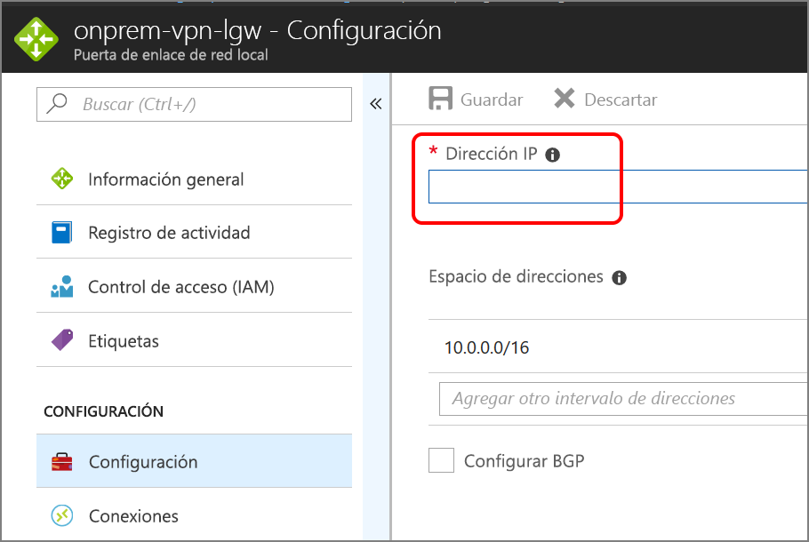

# <a name="implement-a-dmz-between-azure-and-the-internet"></a><span data-ttu-id="e7937-103">Implementación de una zona DMZ entre Azure e Internet</span><span class="sxs-lookup"><span data-stu-id="e7937-103">Implement a DMZ between Azure and the Internet</span></span>

<span data-ttu-id="e7937-104">Esta arquitectura de referencia muestra una red híbrida segura que extiende una red local a Azure y también acepta el tráfico de Internet.</span><span class="sxs-lookup"><span data-stu-id="e7937-104">This reference architecture shows a secure hybrid network that extends an on-premises network to Azure and also accepts Internet traffic.</span></span> <span data-ttu-id="e7937-105">[**Implemente esta solución**](#deploy-the-solution).</span><span class="sxs-lookup"><span data-stu-id="e7937-105">[**Deploy this solution**](#deploy-the-solution).</span></span>


<span data-ttu-id="e7937-107">*Descargue un [archivo Visio][visio-download] de esta arquitectura.*</span><span class="sxs-lookup"><span data-stu-id="e7937-107">*Download a [Visio file][visio-download] of this architecture.*</span></span>

<span data-ttu-id="e7937-108">Esta arquitectura de referencia extiende la arquitectura descrita en [Implementación de una red perimetral entre Azure y el centro de datos local][implementing-a-secure-hybrid-network-architecture].</span><span class="sxs-lookup"><span data-stu-id="e7937-108">This reference architecture extends the architecture described in [Implementing a DMZ between Azure and your on-premises datacenter][implementing-a-secure-hybrid-network-architecture].</span></span> <span data-ttu-id="e7937-109">Agrega una zona DMZ pública que gestiona el tráfico de Internet, además de la zona DMZ privada que gestiona el tráfico de la red local.</span><span class="sxs-lookup"><span data-stu-id="e7937-109">It adds a public DMZ that handles Internet traffic, in addition to the private DMZ that handles traffic from the on-premises network.</span></span>

<span data-ttu-id="e7937-110">Los usos habituales de esta arquitectura incluyen:</span><span class="sxs-lookup"><span data-stu-id="e7937-110">Typical uses for this architecture include:</span></span>

- <span data-ttu-id="e7937-111">Aplicaciones híbridas donde parte de las cargas de trabajo se ejecutan de forma local y parte en Azure.</span><span class="sxs-lookup"><span data-stu-id="e7937-111">Hybrid applications where workloads run partly on-premises and partly in Azure.</span></span>
- <span data-ttu-id="e7937-112">Infraestructura de Azure que enruta el tráfico entrante procedente del entorno local e Internet.</span><span class="sxs-lookup"><span data-stu-id="e7937-112">Azure infrastructure that routes incoming traffic from on-premises and the Internet.</span></span>

## <a name="architecture"></a><span data-ttu-id="e7937-113">Arquitectura</span><span class="sxs-lookup"><span data-stu-id="e7937-113">Architecture</span></span>

<span data-ttu-id="e7937-114">La arquitectura consta de los siguientes componentes:</span><span class="sxs-lookup"><span data-stu-id="e7937-114">The architecture consists of the following components.</span></span>

- <span data-ttu-id="e7937-115">**Dirección IP pública (PIP)**</span><span class="sxs-lookup"><span data-stu-id="e7937-115">**Public IP address (PIP)**.</span></span> <span data-ttu-id="e7937-116">La dirección IP del punto de conexión público.</span><span class="sxs-lookup"><span data-stu-id="e7937-116">The IP address of the public endpoint.</span></span> <span data-ttu-id="e7937-117">Los usuarios externos conectados a Internet pueden acceder al sistema mediante esta dirección.</span><span class="sxs-lookup"><span data-stu-id="e7937-117">External users connected to the Internet can access the system through this address.</span></span>
- <span data-ttu-id="e7937-118">**Aplicación virtual de red (NVA)**.</span><span class="sxs-lookup"><span data-stu-id="e7937-118">**Network virtual appliance (NVA)**.</span></span> <span data-ttu-id="e7937-119">Esta arquitectura incluye un grupo independiente de NVA para el tráfico que se origina en Internet.</span><span class="sxs-lookup"><span data-stu-id="e7937-119">This architecture includes a separate pool of NVAs for traffic originating on the Internet.</span></span>
- <span data-ttu-id="e7937-120">**Azure Load Balancer**.</span><span class="sxs-lookup"><span data-stu-id="e7937-120">**Azure load balancer**.</span></span> <span data-ttu-id="e7937-121">Todas las solicitudes entrantes de Internet pasan por el equilibrador de carga y se distribuyen a las aplicaciones virtuales de red en la red perimetral pública.</span><span class="sxs-lookup"><span data-stu-id="e7937-121">All incoming requests from the Internet pass through the load balancer and are distributed to the NVAs in the public DMZ.</span></span>
- <span data-ttu-id="e7937-122">**Subred de entrada de red perimetral pública**.</span><span class="sxs-lookup"><span data-stu-id="e7937-122">**Public DMZ inbound subnet**.</span></span> <span data-ttu-id="e7937-123">Esta subred acepta las solicitudes del equilibrador de carga de Azure.</span><span class="sxs-lookup"><span data-stu-id="e7937-123">This subnet accepts requests from the Azure load balancer.</span></span> <span data-ttu-id="e7937-124">Las solicitudes entrantes se pasan a una de las aplicaciones virtuales de red de la red perimetral pública.</span><span class="sxs-lookup"><span data-stu-id="e7937-124">Incoming requests are passed to one of the NVAs in the public DMZ.</span></span>
- <span data-ttu-id="e7937-125">**Subred de salida de red perimetral pública**.</span><span class="sxs-lookup"><span data-stu-id="e7937-125">**Public DMZ outbound subnet**.</span></span> <span data-ttu-id="e7937-126">Las solicitudes que apueba la aplicación virtual de red pasan por esta subred y se dirigen al equilibrador de carga interno en el nivel web.</span><span class="sxs-lookup"><span data-stu-id="e7937-126">Requests that are approved by the NVA pass through this subnet to the internal load balancer for the web tier.</span></span>

## <a name="recommendations"></a><span data-ttu-id="e7937-127">Recomendaciones</span><span class="sxs-lookup"><span data-stu-id="e7937-127">Recommendations</span></span>

<span data-ttu-id="e7937-128">Las siguientes recomendaciones sirven para la mayoría de los escenarios.</span><span class="sxs-lookup"><span data-stu-id="e7937-128">The following recommendations apply for most scenarios.</span></span> <span data-ttu-id="e7937-129">Sígalas a menos que tenga un requisito concreto que las invalide.</span><span class="sxs-lookup"><span data-stu-id="e7937-129">Follow these recommendations unless you have a specific requirement that overrides them.</span></span>

### <a name="nva-recommendations"></a><span data-ttu-id="e7937-130">Recomendaciones para aplicaciones virtuales de red</span><span class="sxs-lookup"><span data-stu-id="e7937-130">NVA recommendations</span></span>

<span data-ttu-id="e7937-131">Se recomienda usar un conjunto de NVA para el tráfico que se origina en Internet y otro para el tráfico que se origina en el entorno local.</span><span class="sxs-lookup"><span data-stu-id="e7937-131">Use one set of NVAs for traffic originating on the Internet, and another for traffic originating on-premises.</span></span> <span data-ttu-id="e7937-132">Utilizar únicamente un conjunto de NVA para ambos es un riesgo de seguridad, ya que no proporciona ningún perímetro de seguridad entre los dos conjuntos de tráfico de red.</span><span class="sxs-lookup"><span data-stu-id="e7937-132">Using only one set of NVAs for both is a security risk, because it provides no security perimeter between the two sets of network traffic.</span></span> <span data-ttu-id="e7937-133">El uso de NVA independientes reduce la complejidad de la comprobación de las reglas de seguridad y deja claro qué reglas se corresponden con cada solicitud de red entrante.</span><span class="sxs-lookup"><span data-stu-id="e7937-133">Using separate NVAs reduces the complexity of checking security rules, and makes it clear which rules correspond to each incoming network request.</span></span> <span data-ttu-id="e7937-134">Un conjunto de NVA implementa reglas solo para el tráfico de Internet, mientras que otro lo hace solo para el tráfico local.</span><span class="sxs-lookup"><span data-stu-id="e7937-134">One set of NVAs implements rules for Internet traffic only, while another set of NVAs implement rules for on-premises traffic only.</span></span>

<span data-ttu-id="e7937-135">Incluya una aplicación virtual de red de capa 7 para terminar las conexiones de aplicación en el nivel de NVA y mantener la compatibilidad con los niveles de back-end.</span><span class="sxs-lookup"><span data-stu-id="e7937-135">Include a layer-7 NVA to terminate application connections at the NVA level and maintain compatibility with the backend tiers.</span></span> <span data-ttu-id="e7937-136">Así se garantiza una conectividad simétrica donde el tráfico de respuesta de los niveles de back-end se devuelve a través de la aplicación virtual de red.</span><span class="sxs-lookup"><span data-stu-id="e7937-136">This guarantees symmetric connectivity where response traffic from the backend tiers returns through the NVA.</span></span>

### <a name="public-load-balancer-recommendations"></a><span data-ttu-id="e7937-137">Recomendaciones para el equilibrador de carga público</span><span class="sxs-lookup"><span data-stu-id="e7937-137">Public load balancer recommendations</span></span>

<span data-ttu-id="e7937-138">Para conseguir escalabilidad y disponibilidad, implemente las aplicaciones virtuales de red de la red perimetral en un [conjunto de disponibilidad][availability-set] y use un [equilibrador de carga accesible desde Internet][load-balancer] para distribuir las solicitudes de Internet entre las aplicaciones virtuales de red de dicho conjunto.</span><span class="sxs-lookup"><span data-stu-id="e7937-138">For scalability and availability, deploy the public DMZ NVAs in an [availability set][availability-set] and use an [Internet facing load balancer][load-balancer] to distribute Internet requests across the NVAs in the availability set.</span></span>

<span data-ttu-id="e7937-139">Configure el equilibrador de carga para que solo acepte solicitudes en los puertos necesarios con el tráfico de Internet.</span><span class="sxs-lookup"><span data-stu-id="e7937-139">Configure the load balancer to accept requests only on the ports necessary for Internet traffic.</span></span> <span data-ttu-id="e7937-140">Por ejemplo, limite las solicitudes HTTP entrantes al puerto 80 y las solicitudes HTTPS entrantes al puerto 443.</span><span class="sxs-lookup"><span data-stu-id="e7937-140">For example, restrict inbound HTTP requests to port 80 and inbound HTTPS requests to port 443.</span></span>

## <a name="scalability-considerations"></a><span data-ttu-id="e7937-141">Consideraciones sobre escalabilidad</span><span class="sxs-lookup"><span data-stu-id="e7937-141">Scalability considerations</span></span>

<span data-ttu-id="e7937-142">Aunque la arquitectura requiera inicialmente una única aplicación virtual de red en la red perimetral pública, se recomienda colocar un equilibrador de carga delante de la red perimetral pública desde el principio.</span><span class="sxs-lookup"><span data-stu-id="e7937-142">Even if your architecture initially requires a single NVA in the public DMZ, we recommend putting a load balancer in front of the public DMZ from the beginning.</span></span> <span data-ttu-id="e7937-143">De esta manera, será más sencillo escalar a varias aplicaciones virtuales de red si es necesario en el futuro.</span><span class="sxs-lookup"><span data-stu-id="e7937-143">That will make it easier to scale to multiple NVAs in the future, if needed.</span></span>

## <a name="availability-considerations"></a><span data-ttu-id="e7937-144">Consideraciones sobre disponibilidad</span><span class="sxs-lookup"><span data-stu-id="e7937-144">Availability considerations</span></span>

<span data-ttu-id="e7937-145">El equilibrador de carga accesible desde Internet necesita cada una de las aplicaciones virtuales de red de la subred de entrada de la red perimetral pública para implementar un [sondeo de estado][lb-probe].</span><span class="sxs-lookup"><span data-stu-id="e7937-145">The Internet facing load balancer requires each NVA in the public DMZ inbound subnet to implement a [health probe][lb-probe].</span></span> <span data-ttu-id="e7937-146">Un sondeo de estado que no responde en este punto de conexión se considera que no disponible y el equilibrador de carga dirigirá las solicitudes a otras aplicaciones virtuales de red del mismo conjunto de disponibilidad.</span><span class="sxs-lookup"><span data-stu-id="e7937-146">A health probe that fails to respond on this endpoint is considered to be unavailable, and the load balancer will direct requests to other NVAs in the same availability set.</span></span> <span data-ttu-id="e7937-147">Tenga en cuenta que si ninguna aplicación virtual de red responde, la aplicación dará error, así que es importante tener configurada la supervisión para que DevOps reviva el aviso cuando el número de instancias de NVA en buen estado descienda por debajo de un umbral definido.</span><span class="sxs-lookup"><span data-stu-id="e7937-147">Note that if all NVAs fail to respond, your application will fail, so it's important to have monitoring configured to alert DevOps when the number of healthy NVA instances falls below a defined threshold.</span></span>

## <a name="manageability-considerations"></a><span data-ttu-id="e7937-148">Consideraciones sobre la manejabilidad</span><span class="sxs-lookup"><span data-stu-id="e7937-148">Manageability considerations</span></span>

<span data-ttu-id="e7937-149">Toda la supervisión y administración de las aplicaciones virtuales de red de la red perimetral pública se debe realizar en el Jumpbox en la subred de administración.</span><span class="sxs-lookup"><span data-stu-id="e7937-149">All monitoring and management for the NVAs in the public DMZ should be performed by the jumpbox in the management subnet.</span></span> <span data-ttu-id="e7937-150">Como se describe en [Implementación de una red perimetral entre Azure y el centro de datos local][implementing-a-secure-hybrid-network-architecture], defina una ruta de red única entre la red local y el Jumpbox que pase por la puerta de enlace, a fin de restringir acceso.</span><span class="sxs-lookup"><span data-stu-id="e7937-150">As discussed in [Implementing a DMZ between Azure and your on-premises datacenter][implementing-a-secure-hybrid-network-architecture], define a single network route from the on-premises network through the gateway to the jumpbox, in order to restrict access.</span></span>

<span data-ttu-id="e7937-151">Aunque la conectividad de puerta de enlace de la red local a Azure esté fuera de servicio, puede comunicarse con el Jumpbox; para ello, implemente una dirección IP pública, agréguela al JumpBox e inicie sesión desde Internet.</span><span class="sxs-lookup"><span data-stu-id="e7937-151">If gateway connectivity from your on-premises network to Azure is down, you can still reach the jumpbox by deploying a public IP address, adding it to the jumpbox, and logging in from the Internet.</span></span>

## <a name="security-considerations"></a><span data-ttu-id="e7937-152">Consideraciones sobre la seguridad</span><span class="sxs-lookup"><span data-stu-id="e7937-152">Security considerations</span></span>

<span data-ttu-id="e7937-153">Esta arquitectura de referencia implementa varios niveles de seguridad:</span><span class="sxs-lookup"><span data-stu-id="e7937-153">This reference architecture implements multiple levels of security:</span></span>

- <span data-ttu-id="e7937-154">El equilibrador de carga accesible desde Internet dirige las solicitudes a las aplicaciones virtuales de red de la subred de la red experimental pública de entrada, y solo en los puertos necesarios de la aplicación.</span><span class="sxs-lookup"><span data-stu-id="e7937-154">The Internet facing load balancer directs requests to the NVAs in the inbound public DMZ subnet, and only on the ports necessary for the application.</span></span>
- <span data-ttu-id="e7937-155">Las reglas NSG de las subredes de la red perimetral pública de entrada y salida impiden que las aplicaciones virtuales de red se pongan en peligro, ya que bloquean las solicitudes que se encuentran fuera de estas reglas.</span><span class="sxs-lookup"><span data-stu-id="e7937-155">The NSG rules for the inbound and outbound public DMZ subnets prevent the NVAs from being compromised, by blocking requests that fall outside of the NSG rules.</span></span>
- <span data-ttu-id="e7937-156">La configuración de enrutamiento NAT de las aplicaciones virtuales de red dirige las solicitudes entrantes en los puertos 80 y 443 al equilibrador de carga de nivel web, pero omite las solicitudes en todos los demás puertos.</span><span class="sxs-lookup"><span data-stu-id="e7937-156">The NAT routing configuration for the NVAs directs incoming requests on port 80 and port 443 to the web tier load balancer, but ignores requests on all other ports.</span></span>

<span data-ttu-id="e7937-157">Todas las solicitudes entrantes se deben registrar en todos los puertos.</span><span class="sxs-lookup"><span data-stu-id="e7937-157">You should log all incoming requests on all ports.</span></span> <span data-ttu-id="e7937-158">Realice auditorías de los registros con regularidad y preste atención a las solicitudes que se encuentran fuera de los parámetros previstos, ya que podrían ser indicio de intentos de intrusión.</span><span class="sxs-lookup"><span data-stu-id="e7937-158">Regularly audit the logs, paying attention to requests that fall outside of expected parameters, as these may indicate intrusion attempts.</span></span>

## <a name="deploy-the-solution"></a><span data-ttu-id="e7937-159">Implementación de la solución</span><span class="sxs-lookup"><span data-stu-id="e7937-159">Deploy the solution</span></span>

<span data-ttu-id="e7937-160">Se puede encontrar una implementación de una arquitectura de referencia que implementa estas recomendaciones en [GitHub][github-folder].</span><span class="sxs-lookup"><span data-stu-id="e7937-160">A deployment for a reference architecture that implements these recommendations is available on [GitHub][github-folder].</span></span>

### <a name="prerequisites"></a><span data-ttu-id="e7937-161">Requisitos previos</span><span class="sxs-lookup"><span data-stu-id="e7937-161">Prerequisites</span></span>

[!INCLUDE [ref-arch-prerequisites.md](../../../includes/ref-arch-prerequisites.md)]

### <a name="deploy-resources"></a><span data-ttu-id="e7937-162">Implementación de recursos</span><span class="sxs-lookup"><span data-stu-id="e7937-162">Deploy resources</span></span>

1. <span data-ttu-id="e7937-163">Vaya a la carpeta `/dmz/secure-vnet-dmz` del repositorio de GitHub de las arquitecturas de referencia.</span><span class="sxs-lookup"><span data-stu-id="e7937-163">Navigate to the `/dmz/secure-vnet-dmz` folder of the reference architectures GitHub repository.</span></span>

2. <span data-ttu-id="e7937-164">Ejecute el siguiente comando:</span><span class="sxs-lookup"><span data-stu-id="e7937-164">Run the following command:</span></span>

    ```bash
    azbb -s <subscription_id> -g <resource_group_name> -l <region> -p onprem.json --deploy
    ```

3. <span data-ttu-id="e7937-165">Ejecute el siguiente comando:</span><span class="sxs-lookup"><span data-stu-id="e7937-165">Run the following command:</span></span>

    ```bash
    azbb -s <subscription_id> -g <resource_group_name> -l <region> -p secure-vnet-hybrid.json --deploy
    ```

### <a name="connect-the-on-premises-and-azure-gateways"></a><span data-ttu-id="e7937-166">Conexión de las puertas de enlace local y de Azure</span><span class="sxs-lookup"><span data-stu-id="e7937-166">Connect the on-premises and Azure gateways</span></span>

<span data-ttu-id="e7937-167">En este paso, conectará las dos puertas de enlace de red local.</span><span class="sxs-lookup"><span data-stu-id="e7937-167">In this step, you will connect the two local network gateways.</span></span>

1. <span data-ttu-id="e7937-168">En Azure Portal, vaya al grupo de recursos que ha creado.</span><span class="sxs-lookup"><span data-stu-id="e7937-168">In the Azure Portal, navigate to the resource group that you created.</span></span>

2. <span data-ttu-id="e7937-169">Busque el recurso llamado `ra-vpn-vgw-pip` y copie la dirección IP que se muestra en la hoja **Información general**.</span><span class="sxs-lookup"><span data-stu-id="e7937-169">Find the resource named `ra-vpn-vgw-pip` and copy the IP address shown in the **Overview** blade.</span></span>

3. <span data-ttu-id="e7937-170">Busque el recurso llamado `onprem-vpn-lgw`.</span><span class="sxs-lookup"><span data-stu-id="e7937-170">Find the resource named `onprem-vpn-lgw`.</span></span>

4. <span data-ttu-id="e7937-171">Haga clic en la hoja **Configuración**.</span><span class="sxs-lookup"><span data-stu-id="e7937-171">Click the **Configuration** blade.</span></span> <span data-ttu-id="e7937-172">En **Dirección IP**, pegue la dirección IP del paso 2.</span><span class="sxs-lookup"><span data-stu-id="e7937-172">Under **IP address**, paste in the IP address from step 2.</span></span>

    

5. <span data-ttu-id="e7937-174">Haga clic en **Guardar** y espere a que finalice la operación.</span><span class="sxs-lookup"><span data-stu-id="e7937-174">Click **Save** and wait for the operation to complete.</span></span> <span data-ttu-id="e7937-175">Puede tardar unos 5 minutos.</span><span class="sxs-lookup"><span data-stu-id="e7937-175">It can take about 5 minutes.</span></span>

6. <span data-ttu-id="e7937-176">Busque el recurso llamado `onprem-vpn-gateway1-pip`.</span><span class="sxs-lookup"><span data-stu-id="e7937-176">Find the resource named `onprem-vpn-gateway1-pip`.</span></span> <span data-ttu-id="e7937-177">Copie la dirección IP que se muestra en la hoja **Información general**.</span><span class="sxs-lookup"><span data-stu-id="e7937-177">Copy the IP address shown in the **Overview** blade.</span></span>

7. <span data-ttu-id="e7937-178">Busque el recurso llamado `ra-vpn-lgw`.</span><span class="sxs-lookup"><span data-stu-id="e7937-178">Find the resource named `ra-vpn-lgw`.</span></span>

8. <span data-ttu-id="e7937-179">Haga clic en la hoja **Configuración**.</span><span class="sxs-lookup"><span data-stu-id="e7937-179">Click the **Configuration** blade.</span></span> <span data-ttu-id="e7937-180">En **Dirección IP**, pegue la dirección IP del paso 6.</span><span class="sxs-lookup"><span data-stu-id="e7937-180">Under **IP address**, paste in the IP address from step 6.</span></span>

9. <span data-ttu-id="e7937-181">Haga clic en **Guardar** y espere a que finalice la operación.</span><span class="sxs-lookup"><span data-stu-id="e7937-181">Click **Save** and wait for the operation to complete.</span></span>

10. <span data-ttu-id="e7937-182">Para comprobar la conexión, vaya a la hoja **Conexiones** de cada puerta de enlace.</span><span class="sxs-lookup"><span data-stu-id="e7937-182">To verify the connection, go to the **Connections** blade for each gateway.</span></span> <span data-ttu-id="e7937-183">El estado debe ser **Conectado**.</span><span class="sxs-lookup"><span data-stu-id="e7937-183">The status should be **Connected**.</span></span>

### <a name="verify-that-network-traffic-reaches-the-web-tier"></a><span data-ttu-id="e7937-184">Compruebe que el tráfico de red llega al nivel web</span><span class="sxs-lookup"><span data-stu-id="e7937-184">Verify that network traffic reaches the web tier</span></span>

1. <span data-ttu-id="e7937-185">En Azure Portal, vaya al grupo de recursos que ha creado.</span><span class="sxs-lookup"><span data-stu-id="e7937-185">In the Azure Portal, navigate to the resource group that you created.</span></span>

2. <span data-ttu-id="e7937-186">Busque el recurso llamado `pub-dmz-lb`, que es el equilibrador de carga que hay delante de la red perimetral pública.</span><span class="sxs-lookup"><span data-stu-id="e7937-186">Find the resource named `pub-dmz-lb`, which is the load balancer in front of the public DMZ.</span></span>

3. <span data-ttu-id="e7937-187">Copie la dirección IP pública de la hoja **Información general** y ábrala en un explorador web.</span><span class="sxs-lookup"><span data-stu-id="e7937-187">Copy the public IP addess from the **Overview** blade and open this address in a web browser.</span></span> <span data-ttu-id="e7937-188">Debería ver la página principal predeterminada del servidor Apache2.</span><span class="sxs-lookup"><span data-stu-id="e7937-188">You should see the default Apache2 server home page.</span></span>

4. <span data-ttu-id="e7937-189">Busque el recurso llamado `int-dmz-lb`, que es el equilibrador de carga que hay delante de la red perimetral privada.</span><span class="sxs-lookup"><span data-stu-id="e7937-189">Find the resource named `int-dmz-lb`, which is the load balancer in front of the private DMZ.</span></span> <span data-ttu-id="e7937-190">Copie la dirección IP privada de la hoja **Información general**.</span><span class="sxs-lookup"><span data-stu-id="e7937-190">Copy the private IP address from the **Overview** blade.</span></span>

5. <span data-ttu-id="e7937-191">Busque la máquina virtual denominada `jb-vm1`.</span><span class="sxs-lookup"><span data-stu-id="e7937-191">Find the VM named `jb-vm1`.</span></span> <span data-ttu-id="e7937-192">Haga clic en **Conectar** y use el escritorio remoto para conectarse a la máquina virtual.</span><span class="sxs-lookup"><span data-stu-id="e7937-192">Click **Connect** and use Remote Desktop to connect to the VM.</span></span> <span data-ttu-id="e7937-193">El nombre de usuario y la contraseña se especifican en el archivo onprem.json.</span><span class="sxs-lookup"><span data-stu-id="e7937-193">The user name and password are specified in the onprem.json file.</span></span>

6. <span data-ttu-id="e7937-194">En la sesión del escritorio remoto, abra un explorador web y vaya a la dirección IP del paso 4.</span><span class="sxs-lookup"><span data-stu-id="e7937-194">From the Remote Desktop Session, open a web browser and navigate to the IP address from step 4.</span></span> <span data-ttu-id="e7937-195">Debería ver la página principal predeterminada del servidor Apache2.</span><span class="sxs-lookup"><span data-stu-id="e7937-195">You should see the default Apache2 server home page.</span></span>

[availability-set]: /azure/virtual-machines/virtual-machines-windows-manage-availability
[github-folder]: https://github.com/mspnp/reference-architectures/tree/master/dmz/secure-vnet-dmz

[implementing-a-secure-hybrid-network-architecture]: ./secure-vnet-hybrid.md
[iptables]: https://help.ubuntu.com/community/IptablesHowTo
[lb-probe]: /azure/load-balancer/load-balancer-custom-probe-overview
[load-balancer]: /azure/load-balancer/load-balancer-Internet-overview
[network-security-group]: /azure/virtual-network/virtual-networks-nsg

[visio-download]: https://archcenter.blob.core.windows.net/cdn/dmz-reference-architectures.vsdx
