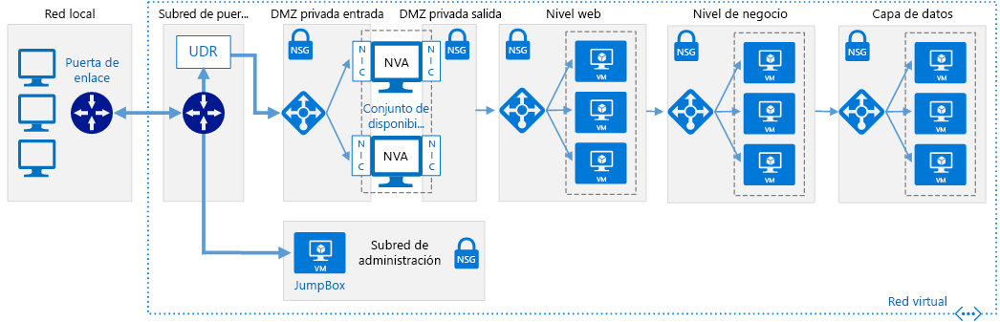

# <a name="implement-a-dmz-between-azure-and-your-on-premises-datacenter"></a><span data-ttu-id="3fb09-103">Implementación de una zona DMZ entre Azure y el centro de datos local</span><span class="sxs-lookup"><span data-stu-id="3fb09-103">Implement a DMZ between Azure and your on-premises datacenter</span></span>

<span data-ttu-id="3fb09-104">Esta arquitectura de referencia muestra una red híbrida segura que extiende una red local a Azure.</span><span class="sxs-lookup"><span data-stu-id="3fb09-104">This reference architecture shows a secure hybrid network that extends an on-premises network to Azure.</span></span> <span data-ttu-id="3fb09-105">La arquitectura implementa una zona DMZ, también conocida como *red perimetral*, entre la red local y una red virtual (VNet).</span><span class="sxs-lookup"><span data-stu-id="3fb09-105">The architecture implements a DMZ, also called a *perimeter network*, between the on-premises network and an Azure virtual network (VNet).</span></span> <span data-ttu-id="3fb09-106">La red perimetral incluye aplicaciones virtuales de red (NVA) que implementan la funcionalidad de seguridad, como firewalls e inspección de paquetes.</span><span class="sxs-lookup"><span data-stu-id="3fb09-106">The DMZ includes network virtual appliances (NVAs) that implement security functionality such as firewalls and packet inspection.</span></span> <span data-ttu-id="3fb09-107">Todo el tráfico saliente de la red virtual se realiza mediante tunelización forzada a Internet a través de la red local, por lo que se puede auditar.</span><span class="sxs-lookup"><span data-stu-id="3fb09-107">All outgoing traffic from the VNet is force-tunneled to the Internet through the on-premises network, so that it can be audited.</span></span> <span data-ttu-id="3fb09-108">[**Implemente esta solución**](#deploy-the-solution).</span><span class="sxs-lookup"><span data-stu-id="3fb09-108">[**Deploy this solution**](#deploy-the-solution).</span></span>



<span data-ttu-id="3fb09-110">*Descargue un [archivo Visio][visio-download] de esta arquitectura.*</span><span class="sxs-lookup"><span data-stu-id="3fb09-110">*Download a [Visio file][visio-download] of this architecture.*</span></span>

<span data-ttu-id="3fb09-111">Esta arquitectura requiere una conexión a su centro de datos local, mediante una [puerta de enlace VPN][ra-vpn] o una conexión [ExpressRoute][ra-expressroute].</span><span class="sxs-lookup"><span data-stu-id="3fb09-111">This architecture requires a connection to your on-premises datacenter, using either a [VPN gateway][ra-vpn] or an [ExpressRoute][ra-expressroute] connection.</span></span> <span data-ttu-id="3fb09-112">Los usos habituales de esta arquitectura incluyen:</span><span class="sxs-lookup"><span data-stu-id="3fb09-112">Typical uses for this architecture include:</span></span>

- <span data-ttu-id="3fb09-113">Aplicaciones híbridas donde una parte de las cargas de trabajo se ejecutan de forma local y otra parte en Azure.</span><span class="sxs-lookup"><span data-stu-id="3fb09-113">Hybrid applications where workloads run partly on-premises and partly in Azure.</span></span>
- <span data-ttu-id="3fb09-114">Infraestructura que requiere un control específico sobre el tráfico que entra en una red virtual de Azure desde un centro de datos local.</span><span class="sxs-lookup"><span data-stu-id="3fb09-114">Infrastructure that requires granular control over traffic entering an Azure VNet from an on-premises datacenter.</span></span>
- <span data-ttu-id="3fb09-115">Aplicaciones que deben auditar el tráfico saliente.</span><span class="sxs-lookup"><span data-stu-id="3fb09-115">Applications that must audit outgoing traffic.</span></span> <span data-ttu-id="3fb09-116">Esto suele ser un requisito de regulación de muchos sistemas comerciales y puede ayudar a evitar la revelación de información privada.</span><span class="sxs-lookup"><span data-stu-id="3fb09-116">This is often a regulatory requirement of many commercial systems and can help to prevent public disclosure of private information.</span></span>

## <a name="architecture"></a><span data-ttu-id="3fb09-117">Arquitectura</span><span class="sxs-lookup"><span data-stu-id="3fb09-117">Architecture</span></span>

<span data-ttu-id="3fb09-118">La arquitectura consta de los siguientes componentes:</span><span class="sxs-lookup"><span data-stu-id="3fb09-118">The architecture consists of the following components.</span></span>

- <span data-ttu-id="3fb09-119">**Red local**.</span><span class="sxs-lookup"><span data-stu-id="3fb09-119">**On-premises network**.</span></span> <span data-ttu-id="3fb09-120">Una red de área local privada implementada dentro de una organización.</span><span class="sxs-lookup"><span data-stu-id="3fb09-120">A  private local-area network implemented in an organization.</span></span>
- <span data-ttu-id="3fb09-121">**Azure Virtual Network (VNet)**.</span><span class="sxs-lookup"><span data-stu-id="3fb09-121">**Azure virtual network (VNet)**.</span></span> <span data-ttu-id="3fb09-122">La red virtual hospeda la aplicación y otros recursos que se ejecutan en Azure.</span><span class="sxs-lookup"><span data-stu-id="3fb09-122">The VNet hosts the application and other resources running in Azure.</span></span>
- <span data-ttu-id="3fb09-123">**Puerta de enlace**.</span><span class="sxs-lookup"><span data-stu-id="3fb09-123">**Gateway**.</span></span> <span data-ttu-id="3fb09-124">Proporciona conectividad entre los enrutadores de la red local y la red virtual.</span><span class="sxs-lookup"><span data-stu-id="3fb09-124">The gateway provides connectivity between the routers in the on-premises network and the VNet.</span></span>
- <span data-ttu-id="3fb09-125">**Aplicación virtual de red (NVA)**.</span><span class="sxs-lookup"><span data-stu-id="3fb09-125">**Network virtual appliance (NVA)**.</span></span> <span data-ttu-id="3fb09-126">NVA es un término genérico que describe una máquina virtual para realizar tareas tales como permitir o denegar el acceso como un firewall; optimizar las operaciones de red de área extensa (WAN), incluida la compresión de red; la distribución personalizada; u otra funcionalidad de red.</span><span class="sxs-lookup"><span data-stu-id="3fb09-126">NVA is a generic term that describes a VM performing tasks such as allowing or denying access as a firewall, optimizing wide area network (WAN) operations (including network compression), custom routing, or other network functionality.</span></span>
- <span data-ttu-id="3fb09-127">**Subredes del nivel de datos, nivel empresarial y nivel web**.</span><span class="sxs-lookup"><span data-stu-id="3fb09-127">**Web tier, business tier, and data tier subnets**.</span></span> <span data-ttu-id="3fb09-128">Las subredes hospedan las máquinas virtuales y los servicios que implementan una aplicación de ejemplo de tres niveles que se ejecuta en la nube.</span><span class="sxs-lookup"><span data-stu-id="3fb09-128">Subnets hosting the VMs and services that implement an example 3-tier application running in the cloud.</span></span> <span data-ttu-id="3fb09-129">Para más información, consulte [Ejecución de máquinas virtuales Windows para una arquitectura de n niveles][ra-n-tier].</span><span class="sxs-lookup"><span data-stu-id="3fb09-129">See [Running Windows VMs for an N-tier architecture on Azure][ra-n-tier] for more information.</span></span>
- <span data-ttu-id="3fb09-130">**Rutas definidas por el usuario (UDR)**.</span><span class="sxs-lookup"><span data-stu-id="3fb09-130">**User defined routes (UDR)**.</span></span> <span data-ttu-id="3fb09-131">[Las rutas definidas por el usuario][udr-overview] definen el flujo de tráfico IP en las redes virtuales Azure.</span><span class="sxs-lookup"><span data-stu-id="3fb09-131">[User defined routes][udr-overview] define the flow of IP traffic within Azure VNets.</span></span>

    > [!NOTE]
    > <span data-ttu-id="3fb09-132">Según los requisitos de la conexión VPN, puede configurar las rutas del Protocolo de puerta de enlace fronteriza (BGP) en lugar de usar UDR para implementar las reglas de reenvío que dirigen el tráfico a través de la red local.</span><span class="sxs-lookup"><span data-stu-id="3fb09-132">Depending on the requirements of your VPN connection, you can configure Border Gateway Protocol (BGP) routes instead of using UDRs to implement the forwarding rules that direct traffic back through the on-premises network.</span></span>
    >

- <span data-ttu-id="3fb09-133">**Subred de administración**.</span><span class="sxs-lookup"><span data-stu-id="3fb09-133">**Management subnet**.</span></span> <span data-ttu-id="3fb09-134">Esta subred contiene máquinas virtuales que implementan las funcionalidades de administración y supervisión de los componentes que se ejecutan en la red virtual.</span><span class="sxs-lookup"><span data-stu-id="3fb09-134">This subnet contains VMs that implement management and monitoring capabilities for the components running in the VNet.</span></span>

## <a name="recommendations"></a><span data-ttu-id="3fb09-135">Recomendaciones</span><span class="sxs-lookup"><span data-stu-id="3fb09-135">Recommendations</span></span>

<span data-ttu-id="3fb09-136">Las siguientes recomendaciones sirven para la mayoría de los escenarios.</span><span class="sxs-lookup"><span data-stu-id="3fb09-136">The following recommendations apply for most scenarios.</span></span> <span data-ttu-id="3fb09-137">Sígalas a menos que tenga un requisito concreto que las invalide.</span><span class="sxs-lookup"><span data-stu-id="3fb09-137">Follow these recommendations unless you have a specific requirement that overrides them.</span></span>

### <a name="access-control-recommendations"></a><span data-ttu-id="3fb09-138">Recomendaciones de control de acceso</span><span class="sxs-lookup"><span data-stu-id="3fb09-138">Access control recommendations</span></span>

<span data-ttu-id="3fb09-139">Use el [control de acceso basado en rol][rbac] (RBAC) para administrar los recursos de la aplicación.</span><span class="sxs-lookup"><span data-stu-id="3fb09-139">Use [Role-Based Access Control][rbac] (RBAC) to manage the resources in your application.</span></span> <span data-ttu-id="3fb09-140">Considere la posibilidad de crear los siguientes [roles personalizados][rbac-custom-roles]:</span><span class="sxs-lookup"><span data-stu-id="3fb09-140">Consider creating the following [custom roles][rbac-custom-roles]:</span></span>

- <span data-ttu-id="3fb09-141">Un rol de DevOps con permisos para administrar la infraestructura de la aplicación, implementar los componentes de las aplicaciones y supervisar y reiniciar las máquinas virtuales.</span><span class="sxs-lookup"><span data-stu-id="3fb09-141">A DevOps role with permissions to administer the infrastructure for the application, deploy the application components, and monitor and restart VMs.</span></span>

- <span data-ttu-id="3fb09-142">Un rol de administrador de TI centralizado para administrar y supervisar los recursos de red.</span><span class="sxs-lookup"><span data-stu-id="3fb09-142">A centralized IT administrator role to manage and monitor network resources.</span></span>

- <span data-ttu-id="3fb09-143">Un rol de administrador de TI de seguridad para administrar los recursos de red seguros, como las aplicaciones virtuales de red (NVA) de seguridad.</span><span class="sxs-lookup"><span data-stu-id="3fb09-143">A security IT administrator role to manage secure network resources such as the NVAs.</span></span>

<span data-ttu-id="3fb09-144">Los roles de DevOps y administrador de TI no deberían tener acceso a los recursos de las aplicaciones virtuales de red.</span><span class="sxs-lookup"><span data-stu-id="3fb09-144">The DevOps and IT administrator roles should not have access to the NVA resources.</span></span> <span data-ttu-id="3fb09-145">Debería limitarse al rol de administrador de TI de seguridad.</span><span class="sxs-lookup"><span data-stu-id="3fb09-145">This should be restricted to the security IT administrator role.</span></span>

### <a name="resource-group-recommendations"></a><span data-ttu-id="3fb09-146">Recomendaciones para grupos de recursos</span><span class="sxs-lookup"><span data-stu-id="3fb09-146">Resource group recommendations</span></span>

<span data-ttu-id="3fb09-147">Los recursos de Azure, como las máquinas virtuales, las redes virtuales y los equilibradores de carga, se pueden administrar fácilmente agrupándolos en grupos de recursos.</span><span class="sxs-lookup"><span data-stu-id="3fb09-147">Azure resources such as VMs, VNets, and load balancers can be easily managed by grouping them together into resource groups.</span></span> <span data-ttu-id="3fb09-148">Asigne roles RBAC a cada grupo de recursos para restringir el acceso.</span><span class="sxs-lookup"><span data-stu-id="3fb09-148">Assign RBAC roles to each resource group to restrict access.</span></span>

<span data-ttu-id="3fb09-149">Se recomienda crear los grupos de recursos siguientes:</span><span class="sxs-lookup"><span data-stu-id="3fb09-149">We recommend creating the following resource groups:</span></span>

- <span data-ttu-id="3fb09-150">Un grupo de recursos que contenga la red virtual (excepto las máquinas virtuales), los grupos de seguridad de red y los recursos de puerta de enlace para conectarse a la red local.</span><span class="sxs-lookup"><span data-stu-id="3fb09-150">A resource group containing the VNet (excluding the VMs), NSGs, and the gateway resources for connecting to the on-premises network.</span></span> <span data-ttu-id="3fb09-151">Asigne el rol de administrador de TI centralizado a este grupo de recursos.</span><span class="sxs-lookup"><span data-stu-id="3fb09-151">Assign the centralized IT administrator role to this resource group.</span></span>
- <span data-ttu-id="3fb09-152">Un grupo de recursos que contenga las máquinas virtuales para las aplicaciones virtuales de red (NVA) (incluido el equilibrador de carga), el JumpBox y otras máquinas virtuales de administración y el UDR para la subred de puerta de enlace que obliga a todo el tráfico a pasar a través de las NVA.</span><span class="sxs-lookup"><span data-stu-id="3fb09-152">A resource group containing the VMs for the NVAs (including the load balancer), the jumpbox and other management VMs, and the UDR for the gateway subnet that forces all traffic through the NVAs.</span></span> <span data-ttu-id="3fb09-153">Asigne el rol de administrador de TI de seguridad a este grupo de recursos.</span><span class="sxs-lookup"><span data-stu-id="3fb09-153">Assign the security IT administrator role to this resource group.</span></span>
- <span data-ttu-id="3fb09-154">Separe los grupos de recursos para cada nivel de aplicación que contenga el equilibrador de carga y las máquinas virtuales.</span><span class="sxs-lookup"><span data-stu-id="3fb09-154">Separate resource groups for each application tier that contain the load balancer and VMs.</span></span> <span data-ttu-id="3fb09-155">Tenga en cuenta que este grupo de recursos no debe incluir las subredes de cada nivel.</span><span class="sxs-lookup"><span data-stu-id="3fb09-155">Note that this resource group shouldn't include the subnets for each tier.</span></span> <span data-ttu-id="3fb09-156">Asigne el rol de DevOps a este grupo de recursos.</span><span class="sxs-lookup"><span data-stu-id="3fb09-156">Assign the DevOps role to this resource group.</span></span>

### <a name="virtual-network-gateway-recommendations"></a><span data-ttu-id="3fb09-157">Recomendaciones para las puertas de enlace de red virtual</span><span class="sxs-lookup"><span data-stu-id="3fb09-157">Virtual network gateway recommendations</span></span>

<span data-ttu-id="3fb09-158">El tráfico local pasa a la red virtual a través de una puerta de enlace de red virtual.</span><span class="sxs-lookup"><span data-stu-id="3fb09-158">On-premises traffic passes to the VNet through a virtual network gateway.</span></span> <span data-ttu-id="3fb09-159">Se recomienda una [puerta de enlace Azure VPN][ guidance-vpn-gateway] o una [puerta de enlace Azure ExpressRoute][guidance-expressroute].</span><span class="sxs-lookup"><span data-stu-id="3fb09-159">We recommend an [Azure VPN gateway][guidance-vpn-gateway] or an [Azure ExpressRoute gateway][guidance-expressroute].</span></span>

### <a name="nva-recommendations"></a><span data-ttu-id="3fb09-160">Recomendaciones para aplicaciones virtuales de red</span><span class="sxs-lookup"><span data-stu-id="3fb09-160">NVA recommendations</span></span>

<span data-ttu-id="3fb09-161">Las aplicaciones virtuales de red proporcionan servicios diferentes para administrar y supervisar el tráfico de red.</span><span class="sxs-lookup"><span data-stu-id="3fb09-161">NVAs provide different services for managing and monitoring network traffic.</span></span> <span data-ttu-id="3fb09-162">[Azure Marketplace][ azure-marketplace-nva] ofrece varias aplicaciones virtuales de red de otros proveedores que puede usar.</span><span class="sxs-lookup"><span data-stu-id="3fb09-162">The [Azure Marketplace][azure-marketplace-nva] offers several third-party vendor NVAs that you can use.</span></span> <span data-ttu-id="3fb09-163">Si ninguna de ellas cumple sus requisitos, puede crear una aplicación virtual de red personalizada usando máquinas virtuales.</span><span class="sxs-lookup"><span data-stu-id="3fb09-163">If none of these third-party NVAs meet your requirements, you can create a custom NVA using VMs.</span></span>

<span data-ttu-id="3fb09-164">Por ejemplo, la implementación de la solución para esta arquitectura de referencia implementa una aplicación virtual de red personalizada con la funcionalidad siguiente en una máquina virtual:</span><span class="sxs-lookup"><span data-stu-id="3fb09-164">For example, the solution deployment for this reference architecture implements an NVA with the following functionality on a VM:</span></span>

- <span data-ttu-id="3fb09-165">El tráfico se enruta mediante [reenvío IP][ip-forwarding] en las interfaces de red NVA personalizadas (NIC).</span><span class="sxs-lookup"><span data-stu-id="3fb09-165">Traffic is routed using [IP forwarding][ip-forwarding] on the NVA network interfaces (NICs).</span></span>
- <span data-ttu-id="3fb09-166">Solo se permite pasar el tráfico a través de la aplicación virtual de red personalizada si es apropiado.</span><span class="sxs-lookup"><span data-stu-id="3fb09-166">Traffic is permitted to pass through the NVA only if it is appropriate to do so.</span></span> <span data-ttu-id="3fb09-167">Cada máquina virtual NVA de la arquitectura de referencia es un simple enrutador Linux.</span><span class="sxs-lookup"><span data-stu-id="3fb09-167">Each NVA VM in the reference architecture is a simple Linux router.</span></span> <span data-ttu-id="3fb09-168">El tráfico entrante llega a la interfaz de red *eth0* y el tráfico de salida hace coincidir las reglas definidas por scripts personalizados que se envían a través de la interfaz de red *eth1*.</span><span class="sxs-lookup"><span data-stu-id="3fb09-168">Inbound traffic arrives on network interface *eth0*, and outbound traffic matches rules defined by custom scripts dispatched through network interface *eth1*.</span></span>
- <span data-ttu-id="3fb09-169">Las aplicaciones virtuales de red personalizadas solo se pueden configurar desde la subred de administración.</span><span class="sxs-lookup"><span data-stu-id="3fb09-169">The NVAs can only be configured from the management subnet.</span></span>
- <span data-ttu-id="3fb09-170">El tráfico enrutado a la subred de administración no pasa por ellas.</span><span class="sxs-lookup"><span data-stu-id="3fb09-170">Traffic routed to the management subnet does not pass through the NVAs.</span></span> <span data-ttu-id="3fb09-171">En caso contrario, si se produjera un error en ellas, no habría ninguna ruta a la subred de administración para corregirlo.</span><span class="sxs-lookup"><span data-stu-id="3fb09-171">Otherwise, if the NVAs fail, there would be no route to the management subnet to fix them.</span></span>
- <span data-ttu-id="3fb09-172">Las máquinas virtuales para la aplicación virtual de red personalizada se colocan en un [conjunto de disponibilidad][availability-set] detrás de un equilibrador de carga.</span><span class="sxs-lookup"><span data-stu-id="3fb09-172">The VMs for the NVA are placed in an [availability set][availability-set] behind a load balancer.</span></span> <span data-ttu-id="3fb09-173">El UDR de la subred de puerta de enlace dirige las solicitudes de aplicación virtual de red al equilibrador de carga.</span><span class="sxs-lookup"><span data-stu-id="3fb09-173">The UDR in the gateway subnet directs NVA requests to the load balancer.</span></span>

<span data-ttu-id="3fb09-174">Incluya una aplicación virtual de red de nivel 7 para terminar las conexiones de aplicación en el nivel de NVA y mantener la afinidad con los niveles de back-end.</span><span class="sxs-lookup"><span data-stu-id="3fb09-174">Include a layer-7 NVA to terminate application connections at the NVA level and maintain affinity with the backend tiers.</span></span> <span data-ttu-id="3fb09-175">Así se garantiza una conectividad simétrica en la que el tráfico de respuesta de los niveles de back-end se devuelve a través de la aplicación virtual de red.</span><span class="sxs-lookup"><span data-stu-id="3fb09-175">This guarantees symmetric connectivity, in which response traffic from the backend tiers returns through the NVA.</span></span>

<span data-ttu-id="3fb09-176">Otra opción que tener en cuenta conecta varias aplicaciones virtuales de red en serie, y cada una realiza una tarea de seguridad especializada.</span><span class="sxs-lookup"><span data-stu-id="3fb09-176">Another option to consider is connecting multiple NVAs in series, with each NVA performing a specialized security task.</span></span> <span data-ttu-id="3fb09-177">Así se permite que cada función de seguridad se administre en función de cada aplicación virtual de red.</span><span class="sxs-lookup"><span data-stu-id="3fb09-177">This allows each security function to be managed on a per-NVA basis.</span></span> <span data-ttu-id="3fb09-178">Por ejemplo, una aplicación virtual de red que implemente un servidor de seguridad podría colocarse en serie con otra que ejecute los servicios de identidad.</span><span class="sxs-lookup"><span data-stu-id="3fb09-178">For example, an NVA implementing a firewall could be placed in series with an NVA running identity services.</span></span> <span data-ttu-id="3fb09-179">El inconveniente con respecto a la facilidad de administración es la adición de saltos de red adicionales que pueden aumentar la latencia, por tanto, asegúrese de que esto no afecta al rendimiento de su aplicación.</span><span class="sxs-lookup"><span data-stu-id="3fb09-179">The tradeoff for ease of management is the addition of extra network hops that may increase latency, so ensure that this doesn't affect your application's performance.</span></span>

### <a name="nsg-recommendations"></a><span data-ttu-id="3fb09-180">Recomendaciones para las aplicaciones virtuales de red</span><span class="sxs-lookup"><span data-stu-id="3fb09-180">NSG recommendations</span></span>

<span data-ttu-id="3fb09-181">La puerta de enlace VPN expone una dirección IP pública para la conexión a la red local.</span><span class="sxs-lookup"><span data-stu-id="3fb09-181">The VPN gateway exposes a public IP address for the connection to the on-premises network.</span></span> <span data-ttu-id="3fb09-182">Se recomienda crear un grupo de seguridad de red (NSG) para cada subred de aplicación virtual de red entrante, con reglas para bloquear todo el tráfico que no se origine en la red local.</span><span class="sxs-lookup"><span data-stu-id="3fb09-182">We recommend creating a network security group (NSG) for the inbound NVA subnet, with rules to block all traffic not originating from the on-premises network.</span></span>

<span data-ttu-id="3fb09-183">También se recomienda usar grupos de seguridad de red para que cada subred proporcione un segundo nivel de protección contra el tráfico entrante a omitir una puerta de enlace configurada incorrectamente o deshabilitada.</span><span class="sxs-lookup"><span data-stu-id="3fb09-183">We also recommend NSGs for each subnet to provide a second level of protection against inbound traffic bypassing an incorrectly configured or disabled NVA.</span></span> <span data-ttu-id="3fb09-184">Por ejemplo, la subred de nivel web en la arquitectura de referencia implementa un grupo de seguridad de red con una regla para pasar por alto todas las solicitudes que no sean de las recibidas desde la red local (192.168.0.0/16) o la red virtual, y otra regla que pasa por alto todas las solicitudes que no se realizan en el puerto 80.</span><span class="sxs-lookup"><span data-stu-id="3fb09-184">For example, the web tier subnet in the reference architecture implements an NSG with a rule to ignore all requests other than those received from the on-premises network (192.168.0.0/16) or the VNet, and another rule that ignores all requests not made on port 80.</span></span>

### <a name="internet-access-recommendations"></a><span data-ttu-id="3fb09-185">Recomendaciones de acceso a Internet</span><span class="sxs-lookup"><span data-stu-id="3fb09-185">Internet access recommendations</span></span>

<span data-ttu-id="3fb09-186">[Aplique tunelización forzada][azure-forced-tunneling] a todo el tráfico saliente de Internet a través de la red local mediante el túnel VPN de sitio a sitio para enrutar a Internet con la traducción de direcciones de red (NAT).</span><span class="sxs-lookup"><span data-stu-id="3fb09-186">[Force-tunnel][azure-forced-tunneling] all outbound Internet traffic through your on-premises network using the site-to-site VPN tunnel, and route to the Internet using network address translation (NAT).</span></span> <span data-ttu-id="3fb09-187">Así se evita la pérdida accidental de la información confidencial almacenada en el nivel de datos y se permite la inspección y auditoría de todo el tráfico saliente.</span><span class="sxs-lookup"><span data-stu-id="3fb09-187">This prevents accidental leakage of any confidential information stored in your data tier and allows inspection and auditing of all outgoing traffic.</span></span>

> [!NOTE]
> <span data-ttu-id="3fb09-188">No bloquee por completo el tráfico de Internet de los niveles de aplicación, ya que esto evitará que estos niveles usen los servicios PaaS de Azure que se basan en direcciones IP públicas, como el registro de diagnóstico de máquina virtual, la descarga de extensiones de máquina virtual y otras funciones.</span><span class="sxs-lookup"><span data-stu-id="3fb09-188">Don't completely block Internet traffic from the application tiers, as this will prevent these tiers from using Azure PaaS services that rely on public IP addresses, such as VM diagnostics logging, downloading of VM extensions, and other functionality.</span></span> <span data-ttu-id="3fb09-189">Los diagnósticos de Azure también requieren que los componentes puedan leer y escribir en una cuenta de Azure Storage.</span><span class="sxs-lookup"><span data-stu-id="3fb09-189">Azure diagnostics also requires that components can read and write to an Azure Storage account.</span></span>

<span data-ttu-id="3fb09-190">Compruebe que el tráfico saliente de Internet se realiza correctamente a través de tunelización forzada.</span><span class="sxs-lookup"><span data-stu-id="3fb09-190">Verify that outbound internet traffic is force-tunneled correctly.</span></span> <span data-ttu-id="3fb09-191">Si utiliza una conexión VPN con el [servicio de acceso remoto y enrutamiento] [ routing-and-remote-access-service] en un servidor local, use una herramienta como [WireShark][wireshark] o [Microsoft Message Analyzer](https://www.microsoft.com/download/details.aspx?id=44226).</span><span class="sxs-lookup"><span data-stu-id="3fb09-191">If you're using a VPN connection with the [routing and remote access service][routing-and-remote-access-service] on an on-premises server, use a tool such as [WireShark][wireshark] or [Microsoft Message Analyzer](https://www.microsoft.com/download/details.aspx?id=44226).</span></span>

### <a name="management-subnet-recommendations"></a><span data-ttu-id="3fb09-192">Recomendaciones para la subred de administración</span><span class="sxs-lookup"><span data-stu-id="3fb09-192">Management subnet recommendations</span></span>

<span data-ttu-id="3fb09-193">La subred de administración contiene un JumpBox que realiza la funcionalidad de supervisión y administración.</span><span class="sxs-lookup"><span data-stu-id="3fb09-193">The management subnet contains a jumpbox that performs management and monitoring functionality.</span></span> <span data-ttu-id="3fb09-194">Restrinja la ejecución de todas las tareas de administración segura al JumpBox.</span><span class="sxs-lookup"><span data-stu-id="3fb09-194">Restrict execution of all secure management tasks to the jumpbox.</span></span>

<span data-ttu-id="3fb09-195">No cree una dirección IP pública para el JumpBox.</span><span class="sxs-lookup"><span data-stu-id="3fb09-195">Do not create a public IP address for the jumpbox.</span></span> <span data-ttu-id="3fb09-196">En su lugar, cree una ruta para tener acceso al JumpBox a través de la puerta de enlace entrante.</span><span class="sxs-lookup"><span data-stu-id="3fb09-196">Instead, create one route to access the jumpbox through the incoming gateway.</span></span> <span data-ttu-id="3fb09-197">Cree reglas NSG para que la subred de administración solo responda a las solicitudes desde la ruta de acceso permitida.</span><span class="sxs-lookup"><span data-stu-id="3fb09-197">Create NSG rules so the management subnet only responds to requests from the allowed route.</span></span>

## <a name="scalability-considerations"></a><span data-ttu-id="3fb09-198">Consideraciones sobre escalabilidad</span><span class="sxs-lookup"><span data-stu-id="3fb09-198">Scalability considerations</span></span>

<span data-ttu-id="3fb09-199">La arquitectura de referencia utiliza un equilibrador de carga para dirigir el tráfico de red local a un grupo de dispositivos de aplicaciones virtuales de red, lo que enruta el tráfico.</span><span class="sxs-lookup"><span data-stu-id="3fb09-199">The reference architecture uses a load balancer to direct on-premises network traffic to a pool of NVA devices, which route the traffic.</span></span> <span data-ttu-id="3fb09-200">Las aplicaciones virtuales de red se colocan en un [conjunto de disponibilidad][availability-set].</span><span class="sxs-lookup"><span data-stu-id="3fb09-200">The NVAs are placed in an [availability set][availability-set].</span></span> <span data-ttu-id="3fb09-201">Este diseño permite supervisar el rendimiento de las aplicaciones virtuales de red a lo largo del tiempo y agregar dispositivos NVA en respuesta a los aumentos de carga.</span><span class="sxs-lookup"><span data-stu-id="3fb09-201">This design allows you to monitor the throughput of the NVAs over time and add NVA devices in response to increases in load.</span></span>

<span data-ttu-id="3fb09-202">La puerta de enlace VPN de SKU estándar admite un rendimiento sostenido de hasta 100 Mbps.</span><span class="sxs-lookup"><span data-stu-id="3fb09-202">The standard SKU VPN gateway supports sustained throughput of up to 100 Mbps.</span></span> <span data-ttu-id="3fb09-203">La SKU de alto rendimiento proporciona hasta 200 Mbps.</span><span class="sxs-lookup"><span data-stu-id="3fb09-203">The High Performance SKU provides up to 200 Mbps.</span></span> <span data-ttu-id="3fb09-204">Para anchos de banda mayores, considere la posibilidad de actualizar a una puerta de enlace de ExpressRoute.</span><span class="sxs-lookup"><span data-stu-id="3fb09-204">For higher bandwidths, consider upgrading to an ExpressRoute gateway.</span></span> <span data-ttu-id="3fb09-205">ExpressRoute proporciona hasta 10 GB/s de ancho de banda con una latencia inferior que una conexión VPN.</span><span class="sxs-lookup"><span data-stu-id="3fb09-205">ExpressRoute provides up to 10 Gbps bandwidth with lower latency than a VPN connection.</span></span>

<span data-ttu-id="3fb09-206">Para más información acerca de la escalabilidad de las puertas de enlace de Azure, vea la sección sobre la consideración de la escalabilidad en [Implementing a hybrid network architecture with Azure and on-premises VPN][guidance-vpn-gateway-scalability] (Implementación de una arquitectura de red híbrida con Azure y VPN local) e [Implementación de una arquitectura de red híbrida con Azure y VPN local][guidance-expressroute-scalability] (Implementación de una arquitectura de red híbrida con Azure ExpressRoute).</span><span class="sxs-lookup"><span data-stu-id="3fb09-206">For more information about the scalability of Azure gateways, see the scalability consideration section in [Implementing a hybrid network architecture with Azure and on-premises VPN][guidance-vpn-gateway-scalability] and [Implementing a hybrid network architecture with Azure ExpressRoute][guidance-expressroute-scalability].</span></span>

## <a name="availability-considerations"></a><span data-ttu-id="3fb09-207">Consideraciones sobre disponibilidad</span><span class="sxs-lookup"><span data-stu-id="3fb09-207">Availability considerations</span></span>

<span data-ttu-id="3fb09-208">Como se mencionó, la arquitectura de referencia utiliza un grupo de dispositivos NVA detrás de un equilibrador de carga.</span><span class="sxs-lookup"><span data-stu-id="3fb09-208">As mentioned, the reference architecture uses a pool of NVA devices behind a load balancer.</span></span> <span data-ttu-id="3fb09-209">El equilibrador de carga utiliza un sondeo de estado para supervisar cada aplicación virtual de red y quitará la que no responda del grupo.</span><span class="sxs-lookup"><span data-stu-id="3fb09-209">The load balancer uses a health probe to monitor each NVA and will remove any unresponsive NVAs from the pool.</span></span>

<span data-ttu-id="3fb09-210">Si usa Azure ExpressRoute para proporcionar conectividad entre la red local y la red virtual, [configure una puerta de enlace VPN para proporcionar conmutación por error] [ra-vpn-failover] si la conexión ExpressRoute no está disponible.</span><span class="sxs-lookup"><span data-stu-id="3fb09-210">If you're using Azure ExpressRoute to provide connectivity between the VNet and on-premises network, [configure a VPN gateway to provide failover][ra-vpn-failover] if the ExpressRoute connection becomes unavailable.</span></span>

<span data-ttu-id="3fb09-211">Para obtener información específica sobre el mantenimiento de la disponibilidad para conexiones VPN y ExpressRoute, consulte las consideraciones de disponibilidad en [Implementing a hybrid network architecture with Azure and on-premises VPN][guidance-vpn-gateway-availability] (Implementación de una arquitectura de red híbrida con Azure y VPN local) e [Implementing a hybrid network architecture with Azure ExpressRoute][guidance-expressroute-availability] (Implementación de una arquitectura de red híbrida con Azure ExpressRoute).</span><span class="sxs-lookup"><span data-stu-id="3fb09-211">For specific information on maintaining availability for VPN and ExpressRoute connections, see the availability considerations in [Implementing a hybrid network architecture with Azure and on-premises VPN][guidance-vpn-gateway-availability] and [Implementing a hybrid network architecture with Azure ExpressRoute][guidance-expressroute-availability].</span></span>

## <a name="manageability-considerations"></a><span data-ttu-id="3fb09-212">Consideraciones sobre la manejabilidad</span><span class="sxs-lookup"><span data-stu-id="3fb09-212">Manageability considerations</span></span>

<span data-ttu-id="3fb09-213">La supervisión de todos los recursos y aplicaciones debería realizarla el JumpBox en la subred de administración.</span><span class="sxs-lookup"><span data-stu-id="3fb09-213">All application and resource monitoring should be performed by the jumpbox in the management subnet.</span></span> <span data-ttu-id="3fb09-214">Dependiendo de los requisitos de la aplicación, puede que necesite recursos adicionales de supervisión en dicha subred.</span><span class="sxs-lookup"><span data-stu-id="3fb09-214">Depending on your application requirements, you may need additional monitoring resources in the management subnet.</span></span> <span data-ttu-id="3fb09-215">Si es así, se debe tener acceso a estos recursos a través del JumpBox.</span><span class="sxs-lookup"><span data-stu-id="3fb09-215">If so, these resources should be accessed through the jumpbox.</span></span>

<span data-ttu-id="3fb09-216">Aunque la conectividad de puerta de enlace de la red local a Azure esté fuera de servicio, todavía puede comunicarse con el JumpBox; para ello, implemente una dirección IP pública, agréguela al JumpBox y conéctese de forma remota desde Internet.</span><span class="sxs-lookup"><span data-stu-id="3fb09-216">If gateway connectivity from your on-premises network to Azure is down, you can still reach the jumpbox by deploying a public IP address, adding it to the jumpbox, and remoting in from the internet.</span></span>

<span data-ttu-id="3fb09-217">La subred de cada nivel de la arquitectura de referencia está protegido por las reglas de NSG.</span><span class="sxs-lookup"><span data-stu-id="3fb09-217">Each tier's subnet in the reference architecture is protected by NSG rules.</span></span> <span data-ttu-id="3fb09-218">Debe crear una regla para abrir el puerto 3389 para el acceso del Protocolo de escritorio remoto (RDP) en las máquinas virtuales Windows o el puerto 22 para el acceso de shell seguro (SSH) en las máquinas virtuales Linux.</span><span class="sxs-lookup"><span data-stu-id="3fb09-218">You may need to create a rule to open port 3389 for remote desktop protocol (RDP) access on Windows VMs or port 22 for secure shell (SSH) access on Linux VMs.</span></span> <span data-ttu-id="3fb09-219">Otras herramientas de supervisión y administración pueden requerir reglas para abrir puertos adicionales.</span><span class="sxs-lookup"><span data-stu-id="3fb09-219">Other management and monitoring tools may require rules to open additional ports.</span></span>

<span data-ttu-id="3fb09-220">Si está usando ExpressRoute para proporcionar conectividad entre el centro de datos local y Azure, use [Azure Connectivity Toolkit (AzureCT)][azurect] para supervisar y solucionar problemas de conexión.</span><span class="sxs-lookup"><span data-stu-id="3fb09-220">If you're using ExpressRoute to provide the connectivity between your on-premises datacenter and Azure, use the [Azure Connectivity Toolkit (AzureCT)][azurect] to monitor and troubleshoot connection issues.</span></span>

<span data-ttu-id="3fb09-221">Puede obtener información adicional destinada en concreto a la supervisión y administración de las conexiones VPN y ExpressRoute en los artículos [Implementing a hybrid network architecture with Azure and on-premises VPN][guidance-vpn-gateway-manageability] (Implementación de una arquitectura de red híbrida con Azure y VPN local) e [Implementing a hybrid network architecture with Azure ExpressRoute][guidance-expressroute-manageability] (Implementación de una arquitectura de red híbrida con Azure ExpressRoute).</span><span class="sxs-lookup"><span data-stu-id="3fb09-221">You can find additional information specifically aimed at monitoring and managing VPN and ExpressRoute connections in the articles [Implementing a hybrid network architecture with Azure and on-premises VPN][guidance-vpn-gateway-manageability] and [Implementing a hybrid network architecture with Azure ExpressRoute][guidance-expressroute-manageability].</span></span>

## <a name="security-considerations"></a><span data-ttu-id="3fb09-222">Consideraciones sobre la seguridad</span><span class="sxs-lookup"><span data-stu-id="3fb09-222">Security considerations</span></span>

<span data-ttu-id="3fb09-223">Esta arquitectura de referencia implementa varios niveles de seguridad.</span><span class="sxs-lookup"><span data-stu-id="3fb09-223">This reference architecture implements multiple levels of security.</span></span>

### <a name="routing-all-on-premises-user-requests-through-the-nva"></a><span data-ttu-id="3fb09-224">Enrutamiento de todas las solicitudes de usuario local a través de la aplicación virtual de red</span><span class="sxs-lookup"><span data-stu-id="3fb09-224">Routing all on-premises user requests through the NVA</span></span>

<span data-ttu-id="3fb09-225">El UDR en la subred de puerta de enlace bloquea todas las solicitudes de usuario distintas de las recibidas desde el entorno local.</span><span class="sxs-lookup"><span data-stu-id="3fb09-225">The UDR in the gateway subnet blocks all user requests other than those received from on-premises.</span></span> <span data-ttu-id="3fb09-226">El UDR pasa las solicitudes permitidas a las aplicaciones virtuales de red en la subred privada de la red perimetral, y estas solicitudes se pasan a la aplicación, si se permiten las reglas de NVA.</span><span class="sxs-lookup"><span data-stu-id="3fb09-226">The UDR passes allowed requests to the NVAs in the private DMZ subnet, and these requests are passed on to the application if they are allowed by the NVA rules.</span></span> <span data-ttu-id="3fb09-227">Puede agregar otras rutas al UDR, pero debe asegurarse de que no omiten accidentalmente las aplicaciones virtuales de red ni bloquean el tráfico administrativo destinado a la subred de administración.</span><span class="sxs-lookup"><span data-stu-id="3fb09-227">You can add other routes to the UDR, but make sure they don't inadvertently bypass the NVAs or block administrative traffic intended for the management subnet.</span></span>

<span data-ttu-id="3fb09-228">El equilibrador de carga delante de las aplicaciones virtuales de red también actúa como un dispositivo de seguridad al pasar por alto el tráfico en los puertos que no estén abiertos en las reglas de equilibrio de carga.</span><span class="sxs-lookup"><span data-stu-id="3fb09-228">The load balancer in front of the NVAs also acts as a security device by ignoring traffic on ports that are not open in the load balancing rules.</span></span> <span data-ttu-id="3fb09-229">Los equilibradores de carga en la arquitectura de referencia solo escuchan las solicitudes HTTP en el puerto 80 y las solicitudes HTTPS en el puerto 443.</span><span class="sxs-lookup"><span data-stu-id="3fb09-229">The load balancers in the reference architecture only listen for HTTP requests on port 80 and HTTPS requests on port 443.</span></span> <span data-ttu-id="3fb09-230">Documente las reglas adicionales que agregue a los equilibradores de carga y supervise el tráfico para asegurarse de que no hay ningún problema de seguridad.</span><span class="sxs-lookup"><span data-stu-id="3fb09-230">Document any additional rules that you add to the load balancers, and monitor traffic to ensure there are no security issues.</span></span>

### <a name="using-nsgs-to-blockpass-traffic-between-application-tiers"></a><span data-ttu-id="3fb09-231">Grupos de seguridad de red para bloquear o permitir el tráfico entre los niveles de aplicación</span><span class="sxs-lookup"><span data-stu-id="3fb09-231">Using NSGs to block/pass traffic between application tiers</span></span>

<span data-ttu-id="3fb09-232">El tráfico entre niveles se restringe mediante grupos de seguridad de red (NSG).</span><span class="sxs-lookup"><span data-stu-id="3fb09-232">Traffic between tiers is restricted by using NSGs.</span></span> <span data-ttu-id="3fb09-233">El nivel empresarial bloquea todo el tráfico que no se origina en el nivel web y el de datos bloquea todo el tráfico que no se origina en el nivel empresarial.</span><span class="sxs-lookup"><span data-stu-id="3fb09-233">The business tier blocks all traffic that doesn't originate in the web tier, and the data tier blocks all traffic that doesn't originate in the business tier.</span></span> <span data-ttu-id="3fb09-234">Si necesita expandir las reglas de NSG a fin de permitir un mayor acceso a estos niveles, sopese estos requisitos con respecto a los riesgos de seguridad.</span><span class="sxs-lookup"><span data-stu-id="3fb09-234">If you have a requirement to expand the NSG rules to allow broader access to these tiers, weigh these requirements against the security risks.</span></span> <span data-ttu-id="3fb09-235">Cada nueva ruta de entrada representa una oportunidad para que se produzca la pérdida accidental o intencionada de datos o la aplicación resulte dañada.</span><span class="sxs-lookup"><span data-stu-id="3fb09-235">Each new inbound pathway represents an opportunity for accidental or purposeful data leakage or application damage.</span></span>

### <a name="devops-access"></a><span data-ttu-id="3fb09-236">Acceso de DevOps</span><span class="sxs-lookup"><span data-stu-id="3fb09-236">DevOps access</span></span>

<span data-ttu-id="3fb09-237">Use [RBAC][rbac] para restringir las operaciones que DevOps puede realizar en cada nivel.</span><span class="sxs-lookup"><span data-stu-id="3fb09-237">Use [RBAC][rbac] to restrict the operations that DevOps can perform on each tier.</span></span> <span data-ttu-id="3fb09-238">Al conceder permisos, use el [principio de los privilegios mínimos][security-principle-of-least-privilege].</span><span class="sxs-lookup"><span data-stu-id="3fb09-238">When granting permissions, use the [principle of least privilege][security-principle-of-least-privilege].</span></span> <span data-ttu-id="3fb09-239">Registre todas las operaciones administrativas y realice auditorías periódicas para asegurarse de que los cambios de configuración se habían planeado.</span><span class="sxs-lookup"><span data-stu-id="3fb09-239">Log all administrative operations and perform regular audits to ensure any configuration changes were planned.</span></span>

## <a name="deploy-the-solution"></a><span data-ttu-id="3fb09-240">Implementación de la solución</span><span class="sxs-lookup"><span data-stu-id="3fb09-240">Deploy the solution</span></span>

<span data-ttu-id="3fb09-241">Se puede encontrar una implementación de una arquitectura de referencia que implementa estas recomendaciones en [GitHub][github-folder].</span><span class="sxs-lookup"><span data-stu-id="3fb09-241">A deployment for a reference architecture that implements these recommendations is available on [GitHub][github-folder].</span></span>

### <a name="prerequisites"></a><span data-ttu-id="3fb09-242">Requisitos previos</span><span class="sxs-lookup"><span data-stu-id="3fb09-242">Prerequisites</span></span>

[!INCLUDE [ref-arch-prerequisites.md](../../../includes/ref-arch-prerequisites.md)]

### <a name="deploy-resources"></a><span data-ttu-id="3fb09-243">Implementación de recursos</span><span class="sxs-lookup"><span data-stu-id="3fb09-243">Deploy resources</span></span>

1. <span data-ttu-id="3fb09-244">Vaya a la carpeta `/dmz/secure-vnet-hybrid` del repositorio de GitHub de las arquitecturas de referencia.</span><span class="sxs-lookup"><span data-stu-id="3fb09-244">Navigate to the `/dmz/secure-vnet-hybrid` folder of the reference architectures GitHub repository.</span></span>

2. <span data-ttu-id="3fb09-245">Ejecute el siguiente comando:</span><span class="sxs-lookup"><span data-stu-id="3fb09-245">Run the following command:</span></span>

    ```bash
    azbb -s <subscription_id> -g <resource_group_name> -l <region> -p onprem.json --deploy
    ```

3. <span data-ttu-id="3fb09-246">Ejecute el siguiente comando:</span><span class="sxs-lookup"><span data-stu-id="3fb09-246">Run the following command:</span></span>

    ```bash
    azbb -s <subscription_id> -g <resource_group_name> -l <region> -p secure-vnet-hybrid.json --deploy
    ```

### <a name="connect-the-on-premises-and-azure-gateways"></a><span data-ttu-id="3fb09-247">Conexión de las puertas de enlace local y de Azure</span><span class="sxs-lookup"><span data-stu-id="3fb09-247">Connect the on-premises and Azure gateways</span></span>

<span data-ttu-id="3fb09-248">En este paso, conectará las dos puertas de enlace de red local.</span><span class="sxs-lookup"><span data-stu-id="3fb09-248">In this step, you will connect the two local network gateways.</span></span>

1. <span data-ttu-id="3fb09-249">En Azure Portal, vaya al grupo de recursos que ha creado.</span><span class="sxs-lookup"><span data-stu-id="3fb09-249">In the Azure Portal, navigate to the resource group that you created.</span></span>

2. <span data-ttu-id="3fb09-250">Busque el recurso llamado `ra-vpn-vgw-pip` y copie la dirección IP que se muestra en la hoja **Información general**.</span><span class="sxs-lookup"><span data-stu-id="3fb09-250">Find the resource named `ra-vpn-vgw-pip` and copy the IP address shown in the **Overview** blade.</span></span>

3. <span data-ttu-id="3fb09-251">Busque el recurso llamado `onprem-vpn-lgw`.</span><span class="sxs-lookup"><span data-stu-id="3fb09-251">Find the resource named `onprem-vpn-lgw`.</span></span>

4. <span data-ttu-id="3fb09-252">Haga clic en la hoja **Configuración**.</span><span class="sxs-lookup"><span data-stu-id="3fb09-252">Click the **Configuration** blade.</span></span> <span data-ttu-id="3fb09-253">En **Dirección IP**, pegue la dirección IP del paso 2.</span><span class="sxs-lookup"><span data-stu-id="3fb09-253">Under **IP address**, paste in the IP address from step 2.</span></span>

    

5. <span data-ttu-id="3fb09-255">Haga clic en **Guardar** y espere a que finalice la operación.</span><span class="sxs-lookup"><span data-stu-id="3fb09-255">Click **Save** and wait for the operation to complete.</span></span> <span data-ttu-id="3fb09-256">Puede tardar unos 5 minutos.</span><span class="sxs-lookup"><span data-stu-id="3fb09-256">It can take about 5 minutes.</span></span>

6. <span data-ttu-id="3fb09-257">Busque el recurso llamado `onprem-vpn-gateway1-pip`.</span><span class="sxs-lookup"><span data-stu-id="3fb09-257">Find the resource named `onprem-vpn-gateway1-pip`.</span></span> <span data-ttu-id="3fb09-258">Copie la dirección IP que se muestra en la hoja **Información general**.</span><span class="sxs-lookup"><span data-stu-id="3fb09-258">Copy the IP address shown in the **Overview** blade.</span></span>

7. <span data-ttu-id="3fb09-259">Busque el recurso llamado `ra-vpn-lgw`.</span><span class="sxs-lookup"><span data-stu-id="3fb09-259">Find the resource named `ra-vpn-lgw`.</span></span>

8. <span data-ttu-id="3fb09-260">Haga clic en la hoja **Configuración**.</span><span class="sxs-lookup"><span data-stu-id="3fb09-260">Click the **Configuration** blade.</span></span> <span data-ttu-id="3fb09-261">En **Dirección IP**, pegue la dirección IP del paso 6.</span><span class="sxs-lookup"><span data-stu-id="3fb09-261">Under **IP address**, paste in the IP address from step 6.</span></span>

9. <span data-ttu-id="3fb09-262">Haga clic en **Guardar** y espere a que finalice la operación.</span><span class="sxs-lookup"><span data-stu-id="3fb09-262">Click **Save** and wait for the operation to complete.</span></span>

10. <span data-ttu-id="3fb09-263">Para comprobar la conexión, vaya a la hoja **Conexiones** de cada puerta de enlace.</span><span class="sxs-lookup"><span data-stu-id="3fb09-263">To verify the connection, go to the **Connections** blade for each gateway.</span></span> <span data-ttu-id="3fb09-264">El estado debe ser **Conectado**.</span><span class="sxs-lookup"><span data-stu-id="3fb09-264">The status should be **Connected**.</span></span>

### <a name="verify-that-network-traffic-reaches-the-web-tier"></a><span data-ttu-id="3fb09-265">Compruebe que el tráfico de red llega al nivel web</span><span class="sxs-lookup"><span data-stu-id="3fb09-265">Verify that network traffic reaches the web tier</span></span>

1. <span data-ttu-id="3fb09-266">En Azure Portal, vaya al grupo de recursos que ha creado.</span><span class="sxs-lookup"><span data-stu-id="3fb09-266">In the Azure Portal, navigate to the resource group that you created.</span></span>

2. <span data-ttu-id="3fb09-267">Busque el recurso llamado `int-dmz-lb`, que es el equilibrador de carga que hay delante de la red perimetral privada.</span><span class="sxs-lookup"><span data-stu-id="3fb09-267">Find the resource named `int-dmz-lb`, which is the load balancer in front of the private DMZ.</span></span> <span data-ttu-id="3fb09-268">Copie la dirección IP privada de la hoja **Información general**.</span><span class="sxs-lookup"><span data-stu-id="3fb09-268">Copy the private IP address from the **Overview** blade.</span></span>

3. <span data-ttu-id="3fb09-269">Busque la máquina virtual denominada `jb-vm1`.</span><span class="sxs-lookup"><span data-stu-id="3fb09-269">Find the VM named `jb-vm1`.</span></span> <span data-ttu-id="3fb09-270">Haga clic en **Conectar** y use el escritorio remoto para conectarse a la máquina virtual.</span><span class="sxs-lookup"><span data-stu-id="3fb09-270">Click **Connect** and use Remote Desktop to connect to the VM.</span></span> <span data-ttu-id="3fb09-271">El nombre de usuario y la contraseña se especifican en el archivo onprem.json.</span><span class="sxs-lookup"><span data-stu-id="3fb09-271">The user name and password are specified in the onprem.json file.</span></span>

4. <span data-ttu-id="3fb09-272">En la sesión del escritorio remoto, abra un explorador web y vaya a la dirección IP del paso 2.</span><span class="sxs-lookup"><span data-stu-id="3fb09-272">From the Remote Desktop Session, open a web browser and navigate to the IP address from step 2.</span></span> <span data-ttu-id="3fb09-273">Debería ver la página principal predeterminada del servidor Apache2.</span><span class="sxs-lookup"><span data-stu-id="3fb09-273">You should see the default Apache2 server home page.</span></span>

## <a name="next-steps"></a><span data-ttu-id="3fb09-274">Pasos siguientes</span><span class="sxs-lookup"><span data-stu-id="3fb09-274">Next steps</span></span>

- <span data-ttu-id="3fb09-275">Aprenda a implementar una [red perimetral entre Azure e Internet](secure-vnet-dmz.md).</span><span class="sxs-lookup"><span data-stu-id="3fb09-275">Learn how to implement a [DMZ between Azure and the Internet](secure-vnet-dmz.md).</span></span>
- <span data-ttu-id="3fb09-276">Aprenda a implementar una [arquitectura de red híbrida de alta disponibilidad][ra-vpn-failover].</span><span class="sxs-lookup"><span data-stu-id="3fb09-276">Learn how to implement a [highly available hybrid network architecture][ra-vpn-failover].</span></span>
- <span data-ttu-id="3fb09-277">Para más información acerca de cómo administrar la seguridad de red con Azure, consulte [Servicios en la nube de Microsoft y seguridad de red][cloud-services-network-security].</span><span class="sxs-lookup"><span data-stu-id="3fb09-277">For more information about managing network security with Azure, see [Microsoft cloud services and network security][cloud-services-network-security].</span></span>
- <span data-ttu-id="3fb09-278">Para información detallada sobre cómo proteger los recursos de Azure, consulte [Introducción a la seguridad de Microsoft Azure][getting-started-with-azure-security].</span><span class="sxs-lookup"><span data-stu-id="3fb09-278">For detailed information about protecting resources in Azure, see [Getting started with Microsoft Azure security][getting-started-with-azure-security].</span></span>
- <span data-ttu-id="3fb09-279">Para detalles adicionales acerca de cómo tratar problemas de seguridad en la conexión de puertas de enlace de Azure, vea [Implementación de una arquitectura de red híbrida con Azure y VPN local][guidance-vpn-gateway-security] e [Implementación de una arquitectura de red híbrida con Azure ExpressRoute][guidance-expressroute-security].</span><span class="sxs-lookup"><span data-stu-id="3fb09-279">For additional details on addressing security concerns across an Azure gateway connection, see [Implementing a hybrid network architecture with Azure and on-premises VPN][guidance-vpn-gateway-security] and [Implementing a hybrid network architecture with Azure ExpressRoute][guidance-expressroute-security].</span></span>
- [<span data-ttu-id="3fb09-280">Solución de problemas de aplicaciones virtuales de red en Azure</span><span class="sxs-lookup"><span data-stu-id="3fb09-280">Troubleshoot network virtual appliance issues in Azure</span></span>](/azure/virtual-network/virtual-network-troubleshoot-nva)

<!-- links -->

[availability-set]: /azure/virtual-machines/virtual-machines-windows-create-availability-set
[azurect]: https://github.com/Azure/NetworkMonitoring/tree/master/AzureCT
[azure-forced-tunneling]: https://azure.microsoft.com/en-gb/documentation/articles/vpn-gateway-forced-tunneling-rm/
[azure-marketplace-nva]: https://azuremarketplace.microsoft.com/marketplace/apps/category/networking
[cloud-services-network-security]: https://azure.microsoft.com/documentation/articles/best-practices-network-security/
[getting-started-with-azure-security]: /azure/security/azure-security-getting-started
[github-folder]: https://github.com/mspnp/reference-architectures/tree/master/dmz/secure-vnet-hybrid
[guidance-expressroute]: ../hybrid-networking/expressroute.md
[guidance-expressroute-availability]: ../hybrid-networking/expressroute.md#availability-considerations
[guidance-expressroute-manageability]: ../hybrid-networking/expressroute.md#manageability-considerations
[guidance-expressroute-security]: ../hybrid-networking/expressroute.md#security-considerations
[guidance-expressroute-scalability]: ../hybrid-networking/expressroute.md#scalability-considerations
[guidance-vpn-gateway]: ../hybrid-networking/vpn.md
[guidance-vpn-gateway-availability]: ../hybrid-networking/vpn.md#availability-considerations
[guidance-vpn-gateway-manageability]: ../hybrid-networking/vpn.md#manageability-considerations
[guidance-vpn-gateway-scalability]: ../hybrid-networking/vpn.md#scalability-considerations
[guidance-vpn-gateway-security]: ../hybrid-networking/vpn.md#security-considerations
[ip-forwarding]: /azure/virtual-network/virtual-networks-udr-overview#ip-forwarding
[ra-expressroute]: ../hybrid-networking/expressroute.md
[ra-n-tier]: ../virtual-machines-windows/n-tier.md
[ra-vpn]: ../hybrid-networking/vpn.md
[ra-vpn-failover]: ../hybrid-networking/expressroute-vpn-failover.md
[rbac]: /azure/active-directory/role-based-access-control-configure
[rbac-custom-roles]: /azure/active-directory/role-based-access-control-custom-roles
[routing-and-remote-access-service]: https://technet.microsoft.com/library/dd469790(v=ws.11).aspx
[security-principle-of-least-privilege]: https://msdn.microsoft.com/library/hdb58b2f(v=vs.110).aspx#Anchor_1
[udr-overview]: /azure/virtual-network/virtual-networks-udr-overview
[visio-download]: https://archcenter.blob.core.windows.net/cdn/dmz-reference-architectures.vsdx
[wireshark]: https://www.wireshark.org/
