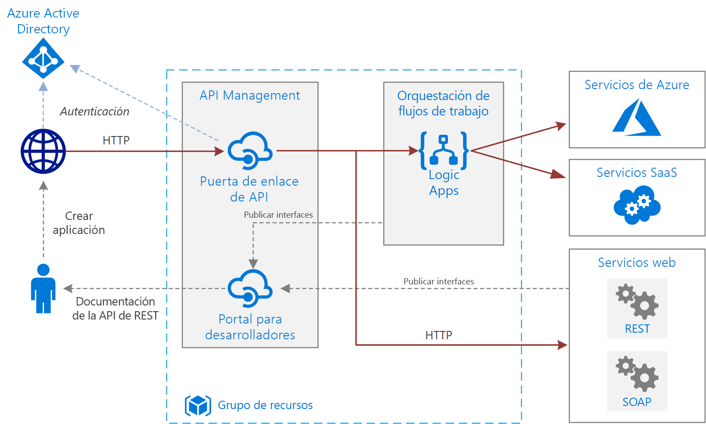

# Integración empresarial básica en AzureBasic enterprise integration on Azure

Esta arquitectura de referencia usa [Azure Integration Services][ integration-services] para orquestar las llamadas a los sistemas de back-end empresariales.This reference architecture uses [Azure Integration Services][integration-services] to orchestrate calls to enterprise backend systems. Los sistemas de back-end pueden incluir sistemas de software como servicio (SaaS), servicios de Azure y servicios web existentes de su empresa.The backend systems may include software as a service (SaaS) systems, Azure services, and existing web services in your enterprise.

Azure Integration Services es una colección de servicios para la integración de aplicaciones y datos.Azure Integration Services is a collection of services for integrating applications and data. Esta arquitectura emplea dos de esos servicios: [Logic Apps][logic-apps] para orquestar los flujos de trabajo, y [API Management][apim] para crear catálogos de API.This architecture uses two of those services: [Logic Apps][logic-apps] to orchestrate workflows, and [API Management][apim] to create catalogs of APIs. Esta arquitectura es suficiente para los escenarios de integración básica en los que las llamadas sincrónicas a servicios back-end desencadenan el flujo de trabajo.This architecture is sufficient for basic integration scenarios where the workflow is triggered by synchronous calls to backend services. Una arquitectura más sofisticada que usa [colas y eventos](./queues-events.md) se basa en esta arquitectura básica.A more sophisticated architecture using [queues and events](./queues-events.md) builds on this basic architecture. 

## ArquitecturaArchitecture

La arquitectura consta de los siguientes componentes:The architecture has the following components:

- **Sistemas de back-end**.**Backend systems**. El lado derecho del diagrama muestra los distintos sistemas de back-end que la empresa ha implementado o usa.The right-hand side of the diagram shows the various backend systems that the enterprise has deployed or relies on. Aquí se incluyen los sistemas SaaS, otros servicios de Azure o servicios web que exponen puntos de conexión REST o SOAP.These might include SaaS systems, other Azure services, or web services that expose REST or SOAP endpoints.

- **Azure Logic Apps**.**Azure Logic Apps**. [Logic Apps][ logic-apps] es una plataforma sin servidor para la creación de flujos de trabajo empresariales que integran aplicaciones, datos y servicios.[Logic Apps][logic-apps] is a serverless platform for building enterprise workflows that integrate applications, data, and services. En esta arquitectura, las aplicaciones lógicas se desencadenan mediante solicitudes HTTP.In this architecture, the logic apps are triggered by HTTP requests. También se pueden anidar flujos de trabajo para una orquestación más compleja.You can also nest workflows for more complex orchestration. Logic Apps usa [conectores][logic-apps-connectors] para integrarse con los servicios usados más comúnmente.Logic Apps uses [connectors][logic-apps-connectors] to integrate with commonly used services. Logic Apps ofrece cientos de conectores, y además puede crear conectores personalizados.Logic Apps offers hundreds of connectors, and you can create custom connectors.

- **Azure API Management**.**Azure API Management**. [API Management][apim] es un servicio administrado para la publicación de catálogos de API de HTTP que promueve la reutilización y la capacidad de detección.[API Management][apim] is a managed service for publishing catalogs of HTTP APIs, to promote reuse and discoverability. API Management consta de dos componentes relacionados:API Management consists of two related components:

    - **Puerta de enlace de API**.**API gateway**. La puerta de enlace de API acepta llamadas HTTP y las enruta al back-end.The API gateway accepts HTTP calls and routes them to the backend. 

    - **Portal para desarrolladores**.**Developer portal**. Cada instancia de Azure API Management proporciona acceso al [portal para desarrolladores][apim-dev-portal].Each instance of Azure API Management provides access to a [developer portal][apim-dev-portal]. Este portal proporciona a los desarrolladores acceso a documentación y ejemplos de código para llamar a las API.This portal gives your developers access to documentation and code samples for calling the APIs. También se pueden probar las API en el portal para desarrolladores.You can also test APIs in the developer portal.

    En esta arquitectura, se crean API compuestas mediante la [importando de aplicaciones lógicas][apim-logic-app] como API.In this architecture, composite APIs are built by [importing logic apps][apim-logic-app] as APIs. También se pueden importar servicios web existentes mediante la [importación de especificaciones de OpenAPI][apim-openapi] (Swagger) o la [importación de API SOAP][apim-soap] a partir de especificaciones WSDL.You can also import existing web services by [importing OpenAPI][apim-openapi] (Swagger) specifications or [importing SOAP APIs][apim-soap] from WSDL specifications. 

    La puerta de enlace de API ayuda a desacoplar los clientes de front-end del back-end.The API gateway helps to decouple front-end clients from the back end. Por ejemplo, puede reescribir las direcciones URL o transformar las solicitudes antes de que lleguen al back-end.For example, it can rewrite URLs, or transform requests before they reach the backend. También controla muchos aspectos transversales como la autenticación, la compatibilidad con uso compartido de recursos entre orígenes (CORS) y el almacenamiento en caché de respuestas.It also handles many cross-cutting concerns such as authentication, cross-origin resource sharing (CORS) support, and response caching.

- **Azure DNS**.**Azure DNS**. [Azure DNS][dns] es un servicio de hospedaje para dominios DNS.[Azure DNS][dns] is a hosting service for DNS domains. Azure DNS proporciona resolución de nombres mediante el uso de la infraestructura de Microsoft Azure.Azure DNS provides name resolution by using the Microsoft Azure infrastructure. Al hospedar dominios en Azure, puede administrar los registros DNS con las mismas credenciales, API, herramientas y facturación que usa con los demás servicios de Azure.By hosting your domains in Azure, you can manage your DNS records by using the same credentials, APIs, tools, and billing that you use for your other Azure services. Para usar un nombre de dominio personalizado, como contoso.com, cree registros DNS que asignen el nombre de dominio personalizado a la dirección IP.To use a custom domain name, such as contoso.com, create DNS records that map the custom domain name to the IP address. Para más información, consulte el artículo sobre cómo [configurar un nombre de dominio personalizado en API Management][apim-domain].For more information, see [Configure a custom domain name in API Management][apim-domain].

- **Azure Active Directory (Azure AD)**.**Azure Active Directory (Azure AD)**. Use [Azure AD][aad] para autenticar a los clientes que llaman a la puerta de enlace de API.Use [Azure AD][aad] to authenticate clients that call the API gateway. Azure AD admite el protocolo OpenID Connect (OIDC).Azure AD supports the OpenID Connect (OIDC) protocol. Los clientes obtienen un token de acceso de Azure AD y la puerta de enlace de API [valida el token][apim-jwt] para autorizar la solicitud.Clients obtain an access token from Azure AD, and API Gateway [validates the token][apim-jwt] to authorize the request. Cuando se usa el nivel Estándar o Premium de API Management, Azure AD también puede proteger el acceso al portal para desarrolladores.When using the Standard or Premium tier of API Management, Azure AD can also secure access to the developer portal.

## RecomendacionesRecommendations

Los requisitos específicos pueden diferir de la arquitectura genérica que se describe aquí.Your specific requirements might differ from the generic architecture shown here. Use las recomendaciones de esta sección como punto de partida.Use the recommendations in this section as a starting point.

### API ManagementAPI Management

Use los niveles Básico, Estándar o Premium de API Management.Use the API Management Basic, Standard, or Premium tiers. Estos niveles ofrecen un Acuerdo de Nivel de Servicio (SLA) de producción y admiten escalabilidad horizontal dentro de la región de Azure.These tiers offer a production service level agreement (SLA) and support scale out within the Azure region. La capacidad de rendimiento de API Management se mide en *unidades*.Throughput capacity for API Management is measured in *units*. Cada plan de tarifa tiene una escalabilidad horizontal máxima. El nivel Premium también admite la escalabilidad horizontal entre varias regiones de Azure.Each pricing tier has a maximum scale-out. The Premium tier also supports scale out across multiple Azure regions. Elija su nivel en función de su conjunto de características y el nivel de rendimiento necesario.Choose your tier based on your feature set and the level of required throughput. Para más información, consulte [Precios de API Management][apim-pricing] y [Capacidad de una instancia de Azure API Management][apim-capacity].For more information, see [API Management pricing][apim-pricing] and [Capacity of an Azure API Management instance][apim-capacity].

Cada instancia de Azure API Management tiene un nombre de dominio predeterminado, que es un subdominio de `azure-api.net`, por ejemplo, `contoso.azure-api.net`.Each Azure API Management instance has a default domain name, which is a subdomain of `azure-api.net` &mdash, for example, `contoso.azure-api.net`. Considere la posibilidad de configurar un [dominio personalizado][apim-domain] para su organización.Consider configuring a [custom domain][apim-domain] for your organization.

### Logic AppsLogic Apps 

Logic Apps funciona mejor en escenarios que no requieren baja latencia para una respuesta, como por ejemplo las llamadas a API asincrónicas o de ejecución semiprolongada.Logic Apps works best in scenarios that don't require low latency for a response, such as asynchronous or semi long-running API calls. Si se requiere una latencia baja, por ejemplo en una llamada que bloquea una interfaz de usuario, use otra tecnología.If low latency is required, for example in a call that blocks a user interface, use a different technology. Por ejemplo, use Azure Functions o una API web implementada en Azure App Service.For example, use Azure Functions or a web API deployed to Azure App Service. Use API Management para enfrentar la API a los consumidores de API.Use API Management to front the API to your API consumers.

### RegionRegion

Para minimizar la latencia de red, coloque API Management y Logic Apps en la misma región.To minimize network latency, put API Management and Logic Apps in the same region. En general, elija la región más cercana a los usuarios (o más cercana a los servicios de back-end).In general, choose the region that's closest to your users (or closest to your backend services).

El grupo de recursos también tiene una región.The resource group also has a region. La región especifica dónde se almacenan los metadatos de implementación y dónde ejecutar la plantilla de implementación.This region specifies where to store deployment metadata and where to execute the deployment template. Coloque el grupo de recursos y sus recursos en la misma región para mejorar la disponibilidad durante la implementación.To improve availability during deployment, put the resource group and resources in the same region.

## Consideraciones sobre escalabilidadScalability considerations

Para aumentar la escalabilidad de API Management, agregue [directivas de almacenamiento en caché][apim-caching] donde corresponda.To increase the scalability of API Management, add [caching policies][apim-caching] where appropriate. El almacenamiento en caché también ayuda a reducir la carga de sus servicios back-end.Caching also helps reduce the load on back-end services.

Para ofrecer mayor capacidad, puede escalar horizontalmente los niveles Básico, Estándar y Premium de Azure API Management en una región de Azure.To offer greater capacity, you can scale out Azure API Management Basic, Standard, and Premium tiers in an Azure region. Para analizar el uso de su servicio, en el menú **Métricas**, seleccione la opción **Métrica de capacidad** y luego escale verticalmente u horizontalmente según corresponda.To analyze the usage for your service, on the **Metrics** menu, select the **Capacity Metric** option and then scale up or scale down as appropriate. El proceso de actualización o escalado puede tardar entre 15 y 45 minutos en aplicarse.The upgrade or scale process can take from 15 to 45 minutes to apply.

Recomendaciones de escalado de un servicio API Management:Recommendations for scaling an API Management service:

- Considere los patrones de tráfico al escalar.Consider traffic patterns when scaling. Los clientes con patrones de tráfico más volátiles necesitan más capacidad.Customers with more volatile traffic patterns need more capacity.

- Una capacidad coherente superior al 66 % puede indicar la necesidad de escalar verticalmente.Consistent capacity that's greater than 66% might indicate a need to scale up.

- Una capacidad coherente inferior al 20 % puede indicar una oportunidad para reducir verticalmente.Consistent capacity that's under 20% might indicate an opportunity to scale down.

- Antes de habilitar la carga en producción, realice siempre una prueba de carga del servicio API Management con una carga representativa.Before you enable the load in production, always load-test your API Management service with a representative load.

Con el nivel Premium, puede escalar una instancia de API Management entre varias regiones de Azure.With the Premium tier, you can scale an API Management instance across multiple Azure regions. Esto hace que API Management sea apto para un SLA superior y le permite aprovisionar servicios cercanos a los usuarios en varias regiones.This makes API Management eligible for a higher SLA, and lets you provision services near users in multiple regions.

El modelo sin servidor de Logic Apps significa que no es necesario que los administradores planifiquen la escalabilidad del servicio.The Logic Apps serverless model means administrators don't have to plan for service scalability. El servicio se escala automáticamente para satisfacer la demanda.The service automatically scales to meet demand.

## Consideraciones sobre disponibilidadAvailability considerations

Revise el SLA de cada servicio:Review the SLA for each service:

- [SLA de API Management][apim-sla][API Management SLA][apim-sla]
- [SLA de Logic Apps][logic-apps-sla][Logic Apps SLA][logic-apps-sla]

Si API Management se implementa en dos o más regiones con el nivel Premium, es apto para un Acuerdo de Nivel de Servicio superior.If you deploy API Management across two or more regions with Premium tier, it is eligible for a higher SLA. Consulte [Precios de API Management][apim-pricing].See [API Management pricing][apim-pricing].

### Copias de seguridadBackups

Realice una [copia de seguridad][apim-backup] periódica de la configuración de API Management.Regularly [back up][apim-backup] your API Management configuration. Almacene los archivos de copia de seguridad en una ubicación o región de Azure diferente de la región donde se implementa el servicio.Store your backup files in a location or Azure region that differs from the region where the service is deployed. En función de su [RTO][rto], elija una estrategia de recuperación ante desastres:Based on your [RTO][rto], choose a disaster recovery strategy:

* En un evento de recuperación ante desastres, aprovisione una nueva instancia de API Management, restaure la copia de seguridad en la instancia nueva y redirija los registros DNS.In a disaster recovery event, provision a new API Management instance, restore the backup to the new instance, and repoint the DNS records.

* Mantenga una instancia pasiva del servicio API Management en otra región de Azure.Keep a passive instance of the API Management service in another Azure region. Restaure con regularidad las copias de seguridad a esa instancia para mantenerlas sincronizadas con el servicio activo.Regularly restore backups to that instance, to keep it in sync with the active service. Para restaurar el servicio durante un evento de recuperación ante desastres, solo es necesario redirigir los registros DNS.To restore the service during a disaster recovery event, you need only repoint the DNS records. Este enfoque conlleva costos adicionales, ya que se paga por la instancia pasiva, pero reduce el tiempo de recuperación.This approach incurs additional cost because you pay for the passive instance, but reduces the time to recover. 

Para las aplicaciones lógicas, se recomienda un enfoque de configuración como código para la copia de seguridad y la restauración.For logic apps, we recommend a configuration-as-code approach to backing up and restoring. Dado que las aplicaciones lógicas son sin servidor, puede volver a crearlas rápidamente a partir de plantillas de Azure Resource Manager.Because logic apps are serverless, you can quickly recreate them from Azure Resource Manager templates. Guarde las plantillas en el control de código fuente e integre las plantillas con el proceso de implementación continua e integración continua (CI/CD).Save the templates in source control, integrate the templates with your continuous integration/continuous deployment (CI/CD) process. En un evento de recuperación ante desastres, implemente la plantilla en una nueva región.In a disaster recovery event, deploy the template to a new region.

Si implementa una aplicación lógica en una región diferente, actualice la configuración en API Management.If you deploy a logic app to a different region, update the configuration in API Management. Puede actualizar la propiedad **Backend** de la API mediante un script de PowerShell básico.You can update the API's **Backend** property by using a basic PowerShell script.

## Consideraciones sobre la manejabilidadManageability considerations

Cree grupos de recursos independientes para entornos de producción, desarrollo y pruebas.Create separate resource groups for production, development, and test environments. Los grupos de recursos independientes facilitan la administración de implementaciones, la eliminación de implementaciones de prueba y la asignación de derechos de acceso.Separate resource groups make it easier to manage deployments, delete test deployments, and assign access rights.

Cuando asigna recursos a los grupos de recursos, debe considerar estos factores:When you assign resources to resource groups, consider these factors:

* **Ciclo de vida**.**Lifecycle**. En general, coloque los recursos que tienen el mismo ciclo de vida en el mismo grupo de recursos.In general, put resources that have the same lifecycle in the same resource group.

* **Acceso**.**Access**. Para aplicar directivas de acceso a los recursos de un grupo, puede usar el [control de acceso basado en rol][rbac] (RBAC).To apply access policies to the resources in a group, you can use [role-based access control][rbac] (RBAC).

* **Facturación**.**Billing**. Puede ver los costos acumulados del grupo de recursos.You can view rollup costs for the resource group.

* **Plan de tarifa de API Management**.**Pricing tier for API Management**. Use el nivel Desarrollador para los entornos de desarrollo y pruebas.Use the Developer tier for development and test environments. Para minimizar los costos durante la preproducción, implemente una réplica del entorno de producción, ejecute las pruebas y, a continuación, apáguela.To minimize costs during preproduction, deploy a replica of your production environment, run your tests, and then shut down.

### ImplementaciónDeployment

Use [plantillas Azure Resource Manager][ arm] para implementar los recursos de Azure.Use [Azure Resource Manager templates][arm] to deploy the Azure resources. Las plantillas facilitan la automatización de las implementaciones mediante PowerShell o la CLI de Azure.Templates make it easier to automate deployments using PowerShell or the Azure CLI.

Coloque las instancias de Azure API Management y cualquier aplicación lógica individual en sus propias plantillas independientes de Resource Manager.Put API Management and any individual logic apps in their own separate Resource Manager templates. Mediante el uso de plantillas independientes, puede almacenar los recursos en sistemas de control de código fuente.By using separate templates, you can store the resources in source control systems. Puede implementar las plantillas en conjunto o por separado como parte de un proceso de CI/CD.You can deploy the templates together or individually as part of a CI/CD process.

### VersionesVersions

Cada vez que realiza un cambio en la configuración de una aplicación lógica o implementa una actualización con una plantilla de Resource Manager, Azure guarda una copia de dicha versión y mantiene todas las versiones que tengan un historial de ejecución.Each time you change a logic app's configuration or deploy an update through a Resource Manager template, Azure keeps a copy of that version and keeps all versions that have a run history. Puede usar estas versiones para hacer el seguimiento de los cambios históricos o promover una versión como configuración actual de la aplicación lógica.You can use these versions to track historical changes or promote a version as the logic app's current configuration. Por ejemplo, puede revertir una aplicación lógica a una versión anterior.For example, you can roll back a logic app to a previous version.

Azure API Management admite dos conceptos de control de versiones distintos, pero complementarios:API Management supports two distinct but complementary versioning concepts:

* Las *versiones* permiten a los consumidores de API elegir una versión de API en función de sus necesidades, por ejemplo, v1, v2, beta o producción.*Versions* allow API consumers to choose an API version based on their needs, for example, v1, v2, beta, or production.

* Las *revisiones* permiten a los administradores de API realizar cambios no importantes en una API e implementar esos cambios, junto con un registro de cambios para informar a los consumidores de API sobre dichos cambios.*Revisions* allow API administrators to make non-breaking changes in an API and deploy those changes, along with a change log to inform API consumers about the changes.

Puede crear una revisión en el entorno de desarrollo e implementar ese cambio entre otros entornos con el uso de plantillas de Resource Manager.You can make a revision in a development environment and deploy that change in other environments by using Resource Manager templates. Para más información, consulte [Publicación de varias versiones de la API][apim-versions].For more information, see [Publish multiple versions of your API][apim-versions]

También puede usar las revisiones para probar una API antes de realizar los cambios actuales y permitir que los usuarios puedan acceder a ella.You can also use revisions to test an API before making the changes current and accessible to users. Sin embargo, este método no se recomienda para pruebas de carga o pruebas de integración.However, this method isn't recommended for load testing or integration testing. En su lugar, use entornos de prueba o preproducción independientes.Use separate test or preproduction environments instead.

## Diagnóstico y supervisiónDiagnostics and monitoring

Puede usar [Azure Monitor][monitor] para la supervisión operativa tanto en API Management como en Logic Apps.Use [Azure Monitor][monitor] for operational monitoring in both API Management and Logic Apps. Azure Monitor proporciona información según las métricas que se configuran para cada servicio y está habilitado de manera predeterminada.Azure Monitor provides information based on the metrics configured for each service and is enabled by default. Para más información, consulte:For more information, see:

- [Supervisión de API publicadas][apim-monitor][Monitor published APIs][apim-monitor]
- [Supervisar el estado, configurar el registro de diagnósticos y activar alertas para Azure Logic Apps][logic-apps-monitor][Monitor status, set up diagnostics logging, and turn on alerts for Azure Logic Apps][logic-apps-monitor]

Cada servicio también tiene estas opciones:Each service also has these options:

* Para realizar análisis más exhaustivos y agregarlos a los paneles, envíe registros de Logic Apps a [Azure Log Analytics][logic-apps-log-analytics].For deeper analysis and dashboarding, send Logic Apps logs to [Azure Log Analytics][logic-apps-log-analytics].

* Para la supervisión de DevOps, puede configurar Azure Application Insights para API Management.For DevOps monitoring, configure Azure Application Insights for API Management.

* API Management admite la [plantilla de solución de Power BI para análisis de API personalizados][apim-pbi].API Management supports the [Power BI solution template for custom API analytics][apim-pbi]. Puede usar esta plantilla de solución para crear su propia solución de análisis.You can use this solution template for creating your own analytics solution. Los informes están disponibles en Power BI para los usuarios empresariales.For business users, Power BI makes reports available.

## Consideraciones sobre la seguridadSecurity considerations

Aunque esta lista no describe completamente todos los procedimientos recomendados de seguridad, estas son algunas consideraciones de seguridad que se aplican específicamente a esta arquitectura:Although this list doesn't completely describe all security best practices, here are some security considerations that apply specifically to this architecture:

* El servicio Azure API Management tiene una dirección IP pública fija.The Azure API Management service has a fixed public IP address. Restrinja el acceso para llamar a los puntos de conexión de Logic Apps a solo la dirección IP de API Management.Restrict access for calling Logic Apps endpoints to only the IP address of API Management. Para más información, consulte [Restricción de las direcciones IP entrantes][logic-apps-restrict-ip].For more information, see [Restrict incoming IP addresses][logic-apps-restrict-ip].

* Para asegurarse de que los usuarios tienen niveles de acceso adecuados, utilice el control de acceso basado en rol (RBAC).To make sure users have appropriate access levels, use role-based access control (RBAC).

* Proteja los puntos de conexión de API públicos en API Management con OAuth o bien OpenID Connect.Secure public API endpoints in API Management by using OAuth or OpenID Connect. Para proteger los puntos de conexión de API públicos, configure un proveedor de identidades y agregue una directiva de validación de JSON Web Token (JWT).To secure public API endpoints, configure an identity provider, and add a JSON Web Token (JWT) validation policy. Para más información, consulte [Protección de una API mediante OAuth 2.0 con Azure Active Directory y API Management][apim-oauth].For more information, see [Protect an API by using OAuth 2.0 with Azure Active Directory and API Management][apim-oauth].

* Conéctese a servicios back-end desde API Management mediante certificados mutuos.Connect to back-end services from API Management by using mutual certificates.

* Exija HTTPS en las API de API Management.Enforce HTTPS on the API Management APIs.

### Almacenamiento de secretosStoring secrets

Nunca compruebe contraseñas, claves de acceso ni cadenas de conexión en el control de código fuente.Never check passwords, access keys, or connection strings into source control. Si estos valores son necesarios, protéjalos e impleméntelos mediante las técnicas oportunas.If these values are required, secure and deploy these values by using the appropriate techniques. 

Si una aplicación lógica requiere valores confidenciales que no se pueden crear dentro de una conexión, almacene esos valores en Azure Key Vault y haga referencia a ellos desde una plantilla de Resource Manager.If a logic app requires any sensitive values that you can't create within a connector, store those values in Azure Key Vault and reference them from a Resource Manager template. Utilice parámetros de plantilla de implementación y archivos de parámetros para cada entorno.Use deployment template parameters and parameter files for each environment. Para más información, consulte [Parámetros seguros y entradas dentro de un flujo de trabajo][logic-apps-secure].For more information, see [Secure parameters and inputs within a workflow][logic-apps-secure].

API Management administra los secretos con objetos denominados *valores con nombre* o *propiedades*.API Management manages secrets by using objects called *named values* or *properties*. Estos objetos almacenan de forma segura los valores a los que se puede acceder a través de directivas de API Management.These objects securely store values that you can access through API Management policies. Para más información, consulte [Cómo usar valores con nombre en las directivas de Azure API Management][apim-properties].For more information, see [How to use Named Values in Azure API Management policies][apim-properties].

## Consideraciones sobre el costoCost considerations

Se le cobra por todas las instancias de API Management cuando están en ejecución.You are charged for all API Management instances when they are running. Si ha escalado verticalmente y no necesita ese nivel de rendimiento todo el tiempo, reduzca verticalmente de forma manual o configure la [escalabilidad automática][apim-autoscale].If you have scaled up and don't need that level of performance all the time, manually scale down or configure [autoscaling][apim-autoscale].

Logic Apps usa un modelo [sin servidor](/azure/logic-apps/logic-apps-serverless-overview).Logic Apps uses a [serverless](/azure/logic-apps/logic-apps-serverless-overview) model. La facturación se calcula en función de la acción y la ejecución del conector.Billing is calculated based on action and connector execution. Para obtener más información, consulte [Precios de Logic Apps](https://azure.microsoft.com/pricing/details/logic-apps/).For more information, see [Logic Apps pricing](https://azure.microsoft.com/pricing/details/logic-apps/). Actualmente no existen consideraciones sobre los niveles en Logic Apps.Currently, there are no tier considerations for Logic Apps.

## Pasos siguientesNext steps

Para obtener mayor confiabilidad y escalabilidad, utilice colas de mensajes y eventos para desacoplar los sistemas de back-end.For greater reliability and scalability, use message queues and events to decouple the backend systems. Este patrón se muestra en la siguiente arquitectura de referencia de esta serie: [Integración empresarial mediante colas de mensajes y eventos](./queues-events.md).This pattern is shown in the next reference architecture in this series: [Enterprise integration using message queues and events](./queues-events.md).

<!-- links -->

[aad]: /azure/active-directory
[apim]: /azure/api-management
[apim-autoscale]: /azure/api-management/api-management-howto-autoscale
[apim-backup]: /azure/api-management/api-management-howto-disaster-recovery-backup-restore
[apim-caching]: /azure/api-management/api-management-howto-cache
[apim-capacity]: /azure/api-management/api-management-capacity
[apim-dev-portal]: /azure/api-management/api-management-key-concepts#a-namedeveloper-portal-a-developer-portal
[apim-domain]: /azure/api-management/configure-custom-domain
[apim-jwt]: /azure/api-management/policies/authorize-request-based-on-jwt-claims
[apim-logic-app]: /azure/api-management/import-logic-app-as-api
[apim-monitor]: /azure/api-management/api-management-howto-use-azure-monitor
[apim-oauth]: /azure/api-management/api-management-howto-protect-backend-with-aad
[apim-openapi]: /azure/api-management/import-api-from-oas
[apim-pbi]: http://aka.ms/apimpbi
[apim-pricing]: https://azure.microsoft.com/pricing/details/api-management/
[apim-properties]: /azure/api-management/api-management-howto-properties
[apim-sla]: https://azure.microsoft.com/support/legal/sla/api-management/
[apim-soap]: /azure/api-management/import-soap-api
[apim-versions]: /azure/api-management/api-management-get-started-publish-versions
[arm]: /azure/azure-resource-manager/resource-group-authoring-templates
[dns]: /azure/dns/
[integration-services]: https://azure.microsoft.com/product-categories/integration/
[logic-apps]: /azure/logic-apps/logic-apps-overview
[logic-apps-connectors]: /azure/connectors/apis-list
[logic-apps-log-analytics]: /azure/logic-apps/logic-apps-monitor-your-logic-apps-oms
[logic-apps-monitor]: /azure/logic-apps/logic-apps-monitor-your-logic-apps
[logic-apps-restrict-ip]: /azure/logic-apps/logic-apps-securing-a-logic-app#restrict-incoming-ip-addresses
[logic-apps-secure]: /azure/logic-apps/logic-apps-securing-a-logic-app#secure-parameters-and-inputs-within-a-workflow
[logic-apps-sla]: https://azure.microsoft.com/support/legal/sla/logic-apps
[monitor]: /azure/azure-monitor/overview
[rbac]: /azure/role-based-access-control/overview
[rto]: ../../resiliency/index.md#rto-and-rpo