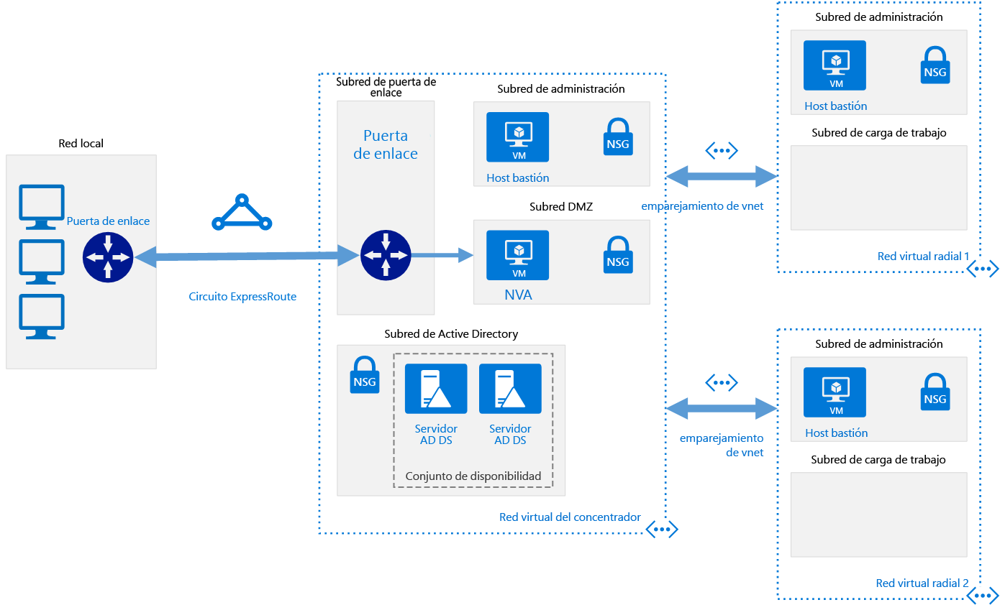

# <a name="implement-a-hub-spoke-network-topology-with-shared-services-in-azure"></a>Implementación de una topología de red en estrella tipo hub-and-spoke con servicios compartidos en Azure

Esta arquitectura de referencia se basa en la arquitectura de referencia tipo [hub-and-spoke][guidance-hub-spoke] para incluir servicios compartidos en el centro que puedan consumir todos los radios. Como primer paso para migrar un centro de datos a la nube y generar un [centro de datos virtual], los primeros servicios que necesitará compartir son los de identidad y seguridad. Esta arquitectura de referencia muestra cómo ampliar los servicios de Active Directory desde el centro de datos local a Azure y cómo agregar una aplicación virtual de red (NVA) que pueda actuar como un firewall, en una topología en estrella tipo hub-and-spoke.  [**Implemente esta solución**](#deploy-the-solution).



*Descargue un [archivo Visio][visio-download] de esta arquitectura.*

Las ventajas de esta topología incluyen:

- **Ahorros en costos** gracias a la centralización de los servicios que se pueden compartir entre varias cargas de trabajo, como las aplicaciones virtuales de red (NVA) y los servidores DNS, en una única ubicación.
- **Superar los límites de las suscripciones** gracias al emparejamiento de las redes virtuales de diferentes suscripciones con el concentrador central.
- **Separación de intereses** entre la TI central (SecOps e InfraOps) y las cargas de trabajo (DevOps).

Los usos habituales de esta arquitectura incluyen:

- Cargas de trabajo implementadas en distintos entornos, como desarrollo, pruebas y producción, que requieren servicios compartidos como DNS, IDS, NTP o AD DS. Los servicios compartidos se colocan en la red virtual del concentrador, mientras que cada entorno se implementa en un radio para mantener el aislamiento.
- Cargas de trabajo que no requieren conectividad entre sí, pero requieren acceso a los servicios compartidos.
- Empresas que requieren el control centralizado sobre aspectos de seguridad, como un firewall en el concentrador como una red perimetral, así como la administración segregada de las cargas de trabajo en cada radio.

## <a name="architecture"></a>Arquitectura

La arquitectura consta de los siguientes componentes:

- **Red local**. Una red de área local privada que se ejecuta dentro de una organización.

- **Dispositivo VPN**. Un dispositivo o servicio que proporciona conectividad externa a la red local. El dispositivo VPN puede ser un dispositivo de hardware, o puede ser una solución de software como el servicio de Enrutamiento y acceso remoto (RRAS) en Windows Server 2012. Para obtener una lista de dispositivos VPN compatibles e información acerca de cómo configurar dispositivos VPN seleccionados para conectarse a Azure, consulte [Acerca de los dispositivos VPN y los parámetros de IPsec/IKE para conexiones de VPN Gateway de sitio a sitio][vpn-appliance].

- **Puerta de enlace de red virtual de VPN o puerta de enlace de ExpressRoute**. La puerta de enlace de red virtual permite que la red virtual se conecte al dispositivo VPN o al circuito de ExpressRoute que se usa para la conectividad con la red local. Para más información, consulte [Conectar una red local con una red virtual de Microsoft Azure][connect-to-an-Azure-vnet].

> [!NOTE]
> Los scripts de implementación para esta arquitectura de referencia usan una instancia de VPN Gateway para la conectividad y una red virtual en Azure para simular la red local.

- **Red virtual del concentrador**. La red virtual de Azure utilizada como el concentrador en la topología en estrella tipo hub-and-spoke. El concentrador es el punto central de conectividad a la red local y un lugar para hospedar los servicios que se pueden usar en las diferentes cargas de trabajo hospedadas en las redes virtuales de los radios.

- **Subred de puerta de enlace**. Las puertas de enlace de red virtual se conservan en la misma subred.

- **Subred de servicios compartidos**. Una subred de la red virtual del concentrador utilizada para hospedar servicios que se pueden compartir entre todos los radios, como DNS o AD DS.

- **Subred DMZ**. Una subred de la red virtual del centro que se usa para hospedar aplicaciones virtuales de red (NVA) que pueden actuar como aplicaciones de seguridad como, por ejemplo, firewalls.

- **Redes virtuales de radios**. Una o varias redes virtuales de Azure que se usan como radios en la topología en estrella tipo hub-and-spoke. Los radios pueden utilizarse para aislar las cargas de trabajo en sus propias redes virtuales, administradas por separado desde otros radios. Cada carga de trabajo puede incluir varios niveles, con varias subredes que se conectan a través de equilibradores de carga de Azure. Para obtener más información acerca de la infraestructura de aplicaciones, consulte [Ejecutar cargas de trabajo de máquinas virtuales Windows][windows-vm-ra] y [Ejecutar cargas de trabajo de máquinas virtuales Linux][linux-vm-ra].

- **Emparejamiento de VNET**. Se pueden conectar dos redes virtuales en la misma región de Azure mediante una [conexión de emparejamiento][vnet-peering]. Las conexiones de emparejamiento son conexiones no transitivas de baja latencia entre las redes virtuales. Una vez establecido el emparejamiento, las redes virtuales intercambian el tráfico mediante la red troncal de Azure, sin necesidad de un enrutador. En una topología de red en estrella tipo hub-and-spoke, el emparejamiento de VNET se usa para conectar el concentrador a cada radio.

> [!NOTE]
> En este artículo solo se tratan las implementaciones de [Resource Manager](/azure/azure-resource-manager/resource-group-overview), pero también puede conectar una red virtual clásica a una red virtual de Resource Manager en la misma suscripción. De este modo, los radios pueden hospedar implementaciones clásicas y seguir beneficiándose de los servicios compartidos en el concentrador.

## <a name="recommendations"></a>Recomendaciones

Todas las recomendaciones de la arquitectura de referencia de tipo [hub-and-spoke][guidance-hub-spoke] también se aplican a la arquitectura de referencia de los servicios compartidos.

Igualmente, las siguientes recomendaciones sirven para la mayoría de escenarios de servicios compartidos. Sígalas a menos que tenga un requisito concreto que las invalide.

### <a name="identity"></a>Identidad

La mayoría de las organizaciones empresariales tienen un entorno de servicios de directorio de Active Directory (ADDS) en su centro de datos local. Para facilitar la administración de los recursos trasladados a Azure desde la red local que depende de ADDS, se recomienda hospedar los controladores de dominio de ADDS en Azure.

Si desea utilizar los objetos de la directiva de grupo que desea controlar de forma independiente para Azure y para el entorno local, use un sitio de AD diferente para cada región de Azure. Sitúe los controladores de dominio en una red virtual central (centro) al que puedan acceder las cargas de trabajo dependientes.

### <a name="security"></a>Seguridad

Al trasladar cargas de trabajo desde el entorno local a Azure, algunas de estas cargas necesitarán hospedarse en máquinas virtuales. Por motivos de cumplimiento normativo, puede que tenga que aplicar restricciones al tráfico que recorre esas cargas de trabajo.

Puede usar aplicaciones virtuales de red (NVA) en Azure para hospedar diferentes tipos de servicios de seguridad y rendimiento. Si está familiarizado con un conjunto determinado de aplicaciones locales actualmente, se recomienda que use las mismas aplicaciones virtualizadas en Azure, si es posible.

> [!NOTE]
> Los scripts de implementación de esta arquitectura de referencia usan una máquina virtual Ubuntu con reenvío IP habilitado para imitar una aplicación virtual de red.

## <a name="considerations"></a>Consideraciones

### <a name="overcoming-vnet-peering-limits"></a>Superación de los límites de emparejamiento de VNET

Asegúrese de tener en cuenta la [limitación del número de emparejamientos de VNET por cada red virtual][vnet-peering-limit] en Azure. Si decide que necesita más radios de los que el límite permitirá, considere la posibilidad de crear una topología en estrella tipo hub-hub-and-spoke-spoke, donde el primer nivel de radios también actúa como concentradores. En el siguiente diagrama se ilustra este enfoque.


También tenga en cuenta qué servicios se comparten en el concentrador, para asegurarse de que el concentrador se escala para tener un número mayor de radios. Por ejemplo, si el concentrador proporciona servicios de firewall, tenga en cuenta los límites de ancho de banda de la solución de firewall al agregar varios radios. Puede mover algunos de estos servicios compartidos a un segundo nivel de concentradores.

## <a name="deploy-the-solution"></a>Implementación de la solución

Hay disponible una implementación de esta arquitectura en [GitHub][ref-arch-repo]. La implementación crea los siguientes grupos de recursos en su suscripción:

- hub-adds-rg
- hub-nva-rg
- hub-vnet-rg
- onprem-vnet-rg
- spoke1-vnet-rg
- spoke2-vent-rg

Los archivos de parámetro de plantilla hacen referencia a estos nombres, por lo que si se cambian es necesario actualizar los archivos de parámetro para que coincidan.

### <a name="prerequisites"></a>Requisitos previos

[!INCLUDE [ref-arch-prerequisites.md](../../../includes/ref-arch-prerequisites.md)]

### <a name="deploy-the-simulated-on-premises-datacenter-using-azbb"></a>Implementación del centro de datos local simulado mediante azbb

En este paso se implementa el centro de datos local simulado como una red virtual de Azure.

1. Vaya a la carpeta `hybrid-networking\shared-services-stack\` del repositorio de GitHub.

2. Abra el archivo `onprem.json` .

3. Busque todas las instancias de `UserName`, `adminUserName`,`Password` y `adminPassword`. Escriba los valores del nombre de usuario y la contraseña en los parámetros y guarde el archivo.

4. Ejecute el siguiente comando:

   ```bash
   azbb -s <subscription_id> -g onprem-vnet-rg -l <location> -p onprem.json --deploy
   ```

5. Espere a que finalice la implementación. Esta implementación crea una red virtual, una máquina virtual Windows y una instancia de VPN Gateway. La creación de la instancia de VPN Gateway puede durar más de cuarenta minutos.

### <a name="deploy-the-hub-vnet"></a>Implementación de la red virtual del concentrador

En este paso se implementa la red virtual de concentrador y la conecta con la red virtual local simulada.

1. Abra el archivo `hub-vnet.json` .

2. Busque `adminPassword` y escriba un nombre de usuario y una contraseña en los parámetros.

3. Busque todas las instancias de `sharedKey` y escriba un valor de clave compartida. Guarde el archivo.

   ```json
   "sharedKey": "abc123",
   ```

4. Ejecute el siguiente comando:

   ```bash
   azbb -s <subscription_id> -g hub-vnet-rg -l <location> -p hub-vnet.json --deploy
   ```

5. Espere a que finalice la implementación. Esta implementación crea una red virtual, una máquina virtual, una instancia de VPN Gateway y una conexión a la puerta de enlace creada en la sección anterior. La puerta de enlace de VPN puede tardar más de 40 minutos en completarse.

### <a name="deploy-ad-ds-in-azure"></a>Implementación de AD DS en Azure

En este paso se implementan los controladores de dominio de AD DS en Azure.

1. Abra el archivo `hub-adds.json` .

2. Busque todas las instancias de `Password` y `adminPassword`. Escriba los valores del nombre de usuario y la contraseña en los parámetros y guarde el archivo.

3. Ejecute el siguiente comando:

   ```bash
   azbb -s <subscription_id> -g hub-adds-rg -l <location> -p hub-adds.json --deploy
   ```

Este paso de implementación puede tardar varios minutos, porque combina las dos máquinas virtuales en el dominio hospedado en el centro de datos simulados del entorno local, e instala AD DS en ellas.

### <a name="deploy-the-spoke-vnets"></a>Implementación de redes virtuales de radios

Este paso implementa las redes virtuales de radio.

1. Abra el archivo `spoke1.json` .

2. Busque `adminPassword` y escriba un nombre de usuario y una contraseña en los parámetros.

3. Ejecute el siguiente comando:

   ```bash
   azbb -s <subscription_id> -g spoke1-vnet-rg -l <location> -p spoke1.json --deploy
   ```

4. Repita los pasos 1 y 2 para el archivo `spoke2.json`.

5. Ejecute el siguiente comando:

   ```bash
   azbb -s <subscription_id> -g spoke2-vnet-rg -l <location> -p spoke2.json --deploy
   ```

### <a name="peer-the-hub-vnet-to-the-spoke-vnets"></a>Emparejamiento de la red virtual de concentrador con las redes virtuales de radio

Para crear una conexión de emparejamiento desde la red virtual de concentrador con las redes virtuales de radio, ejecute el comando siguiente:

```bash
azbb -s <subscription_id> -g hub-vnet-rg -l <location> -p hub-vnet-peering.json --deploy
```

### <a name="deploy-the-nva"></a>Implementación de la aplicación virtual de red

Este paso implementa una aplicación virtual de red en la subred `dmz`.

1. Abra el archivo `hub-nva.json` .

2. Busque `adminPassword` y escriba un nombre de usuario y una contraseña en los parámetros.

3. Ejecute el siguiente comando:

   ```bash
   azbb -s <subscription_id> -g hub-nva-rg -l <location> -p hub-nva.json --deploy
   ```

### <a name="test-connectivity"></a>Comprobación de la conectividad

Pruebe la conectividad desde el entorno local simulado a la red virtual del concentrador.

1. Use Azure Portal para encontrar la máquina virtual denominada `jb-vm1` en el grupo de recursos `onprem-jb-rg`.

2. Haga clic en `Connect` para abrir una sesión de escritorio remoto en la máquina virtual. Usar la contraseña que especificó en el `onprem.json` archivo de parámetros.

3. Abra una consola de PowerShell en la máquina virtual y utilice el cmdlet `Test-NetConnection` para comprobar que puede conectarse a la máquina virtual de JumpBox en la red virtual del concentrador.

   ```powershell
   Test-NetConnection 10.0.0.68 -CommonTCPPort RDP
   ```

La salida debe tener una apariencia similar a la siguiente:

```powershell
ComputerName     : 10.0.0.68
RemoteAddress    : 10.0.0.68
RemotePort       : 3389
InterfaceAlias   : Ethernet 2
SourceAddress    : 192.168.1.000
TcpTestSucceeded : True
```

> [!NOTE]
> De forma predeterminada, las máquinas virtuales de Windows Server no permiten respuestas ICMP en Azure. Si desea usar `ping` para probar la conectividad, debe habilitar el tráfico ICMP en el firewall de Windows con seguridad avanzada para cada máquina virtual.

Repita los mismos pasos para probar la conectividad con las redes virtuales de radio:

```powershell
Test-NetConnection 10.1.0.68 -CommonTCPPort RDP
Test-NetConnection 10.2.0.68 -CommonTCPPort RDP
```

<!-- links -->

[azure-cli-2]: /azure/install-azure-cli
[azbb]: https://github.com/mspnp/template-building-blocks/wiki/Install-Azure-Building-Blocks
[guidance-hub-spoke]: ./hub-spoke.md
[azure-vpn-gateway]: /azure/vpn-gateway/vpn-gateway-about-vpngateways
[best-practices-security]: /azure/best-practices-network-securit
[connect-to-an-Azure-vnet]: https://technet.microsoft.com/library/dn786406.aspx
[guidance-expressroute]: ./expressroute.md
[guidance-vpn]: ./vpn.md
[linux-vm-ra]: ../virtual-machines-linux/index.md
[hybrid-ha]: ./expressroute-vpn-failover.md
[naming conventions]: /azure/guidance/guidance-naming-conventions
[resource-manager-overview]: /azure/azure-resource-manager/resource-group-overview
[centro de datos virtual]: https://aka.ms/vdc
[vnet-peering]: /azure/virtual-network/virtual-network-peering-overview
[vnet-peering-limit]: /azure/azure-subscription-service-limits#networking-limits
[vpn-appliance]: /azure/vpn-gateway/vpn-gateway-about-vpn-devices
[windows-vm-ra]: ../virtual-machines-windows/index.md

[visio-download]: https://archcenter.blob.core.windows.net/cdn/hybrid-network-hub-spoke.vsdx
[ref-arch-repo]: https://github.com/mspnp/reference-architectures
