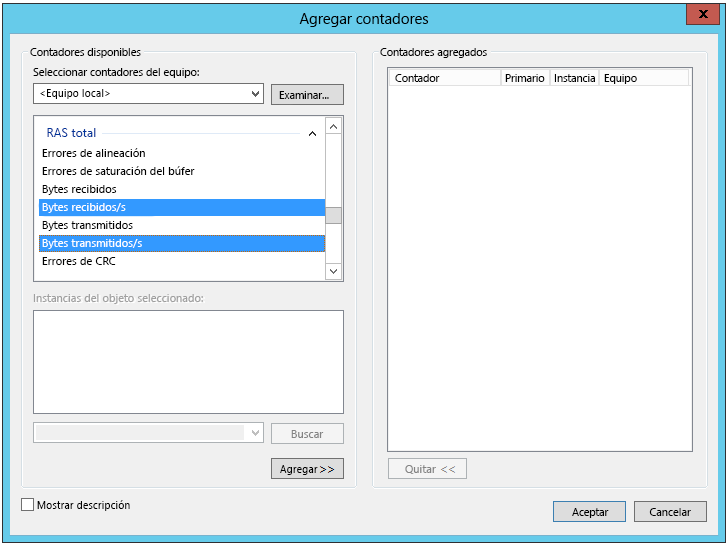
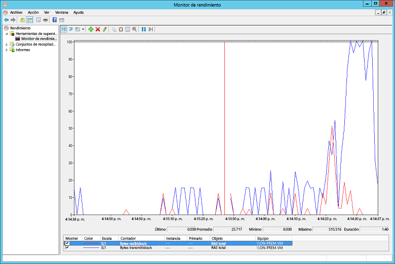

# <a name="troubleshoot-a-hybrid-vpn-connection"></a>Solución de problemas de una conexión VPN híbrida

En este artículo se ofrecen algunas sugerencias para solucionar problemas de una conexión de puerta de enlace VPN en una red local y Azure. Para obtener información general sobre cómo solucionar errores comunes relacionados con la VPN, consulte [Troubleshooting common VPN related errors][troubleshooting-vpn-errors] (Solución de errores comunes relacionados con la VPN).

## <a name="verify-the-vpn-appliance-is-functioning-correctly"></a>Comprobación de que el dispositivo VPN funciona correctamente

Las recomendaciones siguientes son útiles para determinar si su dispositivo VPN local funciona correctamente.

**Compruebe si hay errores en cualquier archivo de registro que generó el dispositivo VPN.** Esto le ayudará a determinar si el dispositivo VPN funciona correctamente. La ubicación de esta información variará según el dispositivo. Por ejemplo, si está usando RRAS en Windows Server 2012, puede usar el siguiente comando de PowerShell para mostrar información de los eventos de error para el servicio RRAS:

```PowerShell
Get-EventLog -LogName System -EntryType Error -Source RemoteAccess | Format-List -Property *
```

La propiedad *Message* de cada entrada proporciona una descripción del error. Algunos ejemplos comunes:

- Incapacidad para conectarse, posiblemente debido a una dirección IP incorrecta especificada para Azure VPN Gateway en la configuración de la interfaz de red VPN de RRAS.

  ```console
  EventID            : 20111
  MachineName        : on-prem-vm
  Data               : {41, 3, 0, 0}
  Index              : 14231
  Category           : (0)
  CategoryNumber     : 0
  EntryType          : Error
  Message            : RoutingDomainID- {00000000-0000-0000-0000-000000000000}: A demand dial connection to the remote
                          interface AzureGateway on port VPN2-4 was successfully initiated but failed to complete
                          successfully because of the  following error: The network connection between your computer and
                          the VPN server could not be established because the remote server is not responding. This could
                          be because one of the network devices (for example, firewalls, NAT, routers, and so on) between your computer
                          and the remote server is not configured to allow VPN connections. Please contact your
                          Administrator or your service provider to determine which device may be causing the problem.
  Source             : RemoteAccess
  ReplacementStrings : {{00000000-0000-0000-0000-000000000000}, AzureGateway, VPN2-4, The network connection between
                          your computer and the VPN server could not be established because the remote server is not
                          responding. This could be because one of the network devices (for example, firewalls, NAT, routers, and so on)
                          between your computer and the remote server is not configured to allow VPN connections. Please
                          contact your Administrator or your service provider to determine which device may be causing the
                          problem.}
  InstanceId         : 20111
  TimeGenerated      : 3/18/2016 1:26:02 PM
  TimeWritten        : 3/18/2016 1:26:02 PM
  UserName           :
  Site               :
  Container          :
  ```

- La clave compartida incorrecta que se especificó en la configuración de la interfaz de red VPN de RRAS.

  ```console
  EventID            : 20111
  MachineName        : on-prem-vm
  Data               : {233, 53, 0, 0}
  Index              : 14245
  Category           : (0)
  CategoryNumber     : 0
  EntryType          : Error
  Message            : RoutingDomainID- {00000000-0000-0000-0000-000000000000}: A demand dial connection to the remote
                          interface AzureGateway on port VPN2-4 was successfully initiated but failed to complete
                          successfully because of the  following error: Internet key exchange (IKE) authentication credentials are unacceptable.

  Source             : RemoteAccess
  ReplacementStrings : {{00000000-0000-0000-0000-000000000000}, AzureGateway, VPN2-4, IKE authentication credentials are
                          unacceptable.
                          }
  InstanceId         : 20111
  TimeGenerated      : 3/18/2016 1:34:22 PM
  TimeWritten        : 3/18/2016 1:34:22 PM
  UserName           :
  Site               :
  Container          :
  ```

También puede obtener información de registro de eventos sobre los intentos de conexión a través del servicio RRAS mediante el siguiente comando de PowerShell:

```powershell
Get-EventLog -LogName Application -Source RasClient | Format-List -Property *
```

Si se produce un error en la conexión, este registro contendrá errores con un aspecto similar al siguiente:

```console
EventID            : 20227
MachineName        : on-prem-vm
Data               : {}
Index              : 4203
Category           : (0)
CategoryNumber     : 0
EntryType          : Error
Message            : CoId={B4000371-A67F-452F-AA4C-3125AA9CFC78}: The user SYSTEM dialed a connection named
                        AzureGateway that has failed. The error code returned on failure is 809.
Source             : RasClient
ReplacementStrings : {{B4000371-A67F-452F-AA4C-3125AA9CFC78}, SYSTEM, AzureGateway, 809}
InstanceId         : 20227
TimeGenerated      : 3/18/2016 1:29:21 PM
TimeWritten        : 3/18/2016 1:29:21 PM
UserName           :
Site               :
Container          :
```

## <a name="verify-connectivity"></a>Verificación de la conectividad

**Compruebe la conectividad y el enrutamiento en VPN Gateway.** Es posible que el dispositivo VPN no enrute correctamente el tráfico a través de Azure VPN Gateway. Use una herramienta como [PsPing][psping] para comprobar la conectividad y el enrutamiento en VPN Gateway. Por ejemplo, para probar la conectividad de una máquina local a un servidor web que se encuentre en la red virtual, ejecute el siguiente comando (reemplazando `<<web-server-address>>` por la dirección del servidor web):

```console
PsPing -t <<web-server-address>>:80
```

Si la máquina local puede enrutar el tráfico al servidor web, debería ver un resultado similar al siguiente:

```console
D:\PSTools>psping -t 10.20.0.5:80

PsPing v2.01 - PsPing - ping, latency, bandwidth measurement utility
Copyright (C) 2012-2014 Mark Russinovich
Sysinternals - www.sysinternals.com

TCP connect to 10.20.0.5:80:
Infinite iterations (warmup 1) connecting test:
Connecting to 10.20.0.5:80 (warmup): 6.21ms
Connecting to 10.20.0.5:80: 3.79ms
Connecting to 10.20.0.5:80: 3.44ms
Connecting to 10.20.0.5:80: 4.81ms

    Sent = 3, Received = 3, Lost = 0 (0% loss),
    Minimum = 3.44ms, Maximum = 4.81ms, Average = 4.01ms
```

Si la máquina local no puede comunicarse con el destino especificado, verá mensajes similares al siguiente:

```console
D:\PSTools>psping -t 10.20.1.6:80

PsPing v2.01 - PsPing - ping, latency, bandwidth measurement utility
Copyright (C) 2012-2014 Mark Russinovich
Sysinternals - www.sysinternals.com

TCP connect to 10.20.1.6:80:
Infinite iterations (warmup 1) connecting test:
Connecting to 10.20.1.6:80 (warmup): This operation returned because the timeout period expired.
Connecting to 10.20.1.6:80: This operation returned because the timeout period expired.
Connecting to 10.20.1.6:80: This operation returned because the timeout period expired.
Connecting to 10.20.1.6:80: This operation returned because the timeout period expired.
Connecting to 10.20.1.6:80:
    Sent = 3, Received = 0, Lost = 3 (100% loss),
    Minimum = 0.00ms, Maximum = 0.00ms, Average = 0.00ms
```

**Compruebe que el firewall local permita que pase el tráfico VPN y que estén abiertos los puertos correctos.**

**Compruebe que el dispositivo VPN local use un método de cifrado que sea compatible con Azure VPN Gateway**. Para el enrutamiento basado en directivas, Azure VPN Gateway admite los algoritmos de cifrado AES256, AES128 y 3DES. Las puertas de enlace basadas en rutas admiten AES256 y 3DES. Para más información, consulte [Acerca de los dispositivos VPN y los parámetros de IPsec/IKE para conexiones de VPN Gateway de sitio a sitio][vpn-appliance].

## <a name="check-for-problems-with-the-azure-vpn-gateway"></a>Comprobación de problemas con Azure VPN Gateway

Las recomendaciones siguientes son útiles para determinar si hay algún problema con Azure VPN Gateway:

**Examine los registros de diagnóstico de Azure VPN Gateway para identificar posibles problemas.** Consulte [Step-by-Step: Capturing Azure Resource Manager VNET Gateway Diagnostic Logs][gateway-diagnostic-logs] (Paso a paso: Captura de registros de diagnóstico de puerta de enlace de red virtual de Azure Resource Manager).

**Compruebe que Azure VPN Gateway y el dispositivo VPN local estén configurados con la misma clave de autenticación compartida.** Puede ver la clave compartida almacenada en Azure VPN Gateway mediante el siguiente comando de la CLI de Azure:

```azurecli
azure network vpn-connection shared-key show <<resource-group>> <<vpn-connection-name>>
```

Use el comando adecuado para que su dispositivo VPN local muestre la clave compartida que se configuró.

Compruebe que la subred *GatewaySubnet* que contiene la Azure VPN Gateway no esté asociada con un NSG.

Puede ver los detalles de la subred con el siguiente comando de la CLI de Azure:

```azurecli
azure network vnet subnet show -g <<resource-group>> -e <<vnet-name>> -n GatewaySubnet
```

Asegúrese de que no hay ningún campo de datos denominado *Identificador del grupo de seguridad de red*. En el ejemplo siguiente se muestran los resultados de una instancia de *GatewaySubnet* que tiene un NSG asignado (*VPN-Gateway-Group*). Esto puede impedir que la puerta de enlace funcione correctamente si no hay ninguna regla definida para este NSG.

```console
C:\>azure network vnet subnet show -g profx-prod-rg -e profx-vnet -n GatewaySubnet
    info:    Executing command network vnet subnet show
    + Looking up virtual network "profx-vnet"
    + Looking up the subnet "GatewaySubnet"
    data:    Id                              : /subscriptions/########-####-####-####-############/resourceGroups/profx-prod-rg/providers/Microsoft.Network/virtualNetworks/profx-vnet/subnets/GatewaySubnet
    data:    Name                            : GatewaySubnet
    data:    Provisioning state              : Succeeded
    data:    Address prefix                  : 10.20.3.0/27
    data:    Network Security Group id       : /subscriptions/########-####-####-####-############/resourceGroups/profx-prod-rg/providers/Microsoft.Network/networkSecurityGroups/VPN-Gateway-Group
    info:    network vnet subnet show command OK
```

**Compruebe que las máquinas virtuales en la red virtual de Azure estén configuradas para permitir el tráfico procedente de fuera de la red virtual.** Compruebe si hay alguna regla de NSG asociada con las subredes que contienen estas máquinas virtuales. Puede ver todas las reglas de NSG con el siguiente comando de la CLI de Azure:

```azurecli
azure network nsg show -g <<resource-group>> -n <<nsg-name>>
```

**Compruebe que Azure VPN Gateway esté conectado.** Puede usar el siguiente comando de Azure PowerShell para comprobar el estado actual de la conexión VPN de Azure. El parámetro `<<connection-name>>` es el nombre de la conexión VPN de Azure que vincula la puerta de enlace de red virtual y la puerta de enlace local.

```powershell
Get-AzureRmVirtualNetworkGatewayConnection -Name <<connection-name>> - ResourceGroupName <<resource-group>>
```

Los fragmentos de código siguientes resaltan la salida que se genera si la puerta de enlace está conectada (primer ejemplo) o desconectada (segundo ejemplo):

```powershell
PS C:\> Get-AzureRmVirtualNetworkGatewayConnection -Name profx-gateway-connection -ResourceGroupName profx-prod-rg

AuthorizationKey           :
VirtualNetworkGateway1     : Microsoft.Azure.Commands.Network.Models.PSVirtualNetworkGateway
VirtualNetworkGateway2     :
LocalNetworkGateway2       : Microsoft.Azure.Commands.Network.Models.PSLocalNetworkGateway
Peer                       :
ConnectionType             : IPsec
RoutingWeight              : 0
SharedKey                  : ####################################
ConnectionStatus           : Connected
EgressBytesTransferred     : 55254803
IngressBytesTransferred    : 32227221
ProvisioningState          : Succeeded
...
```

```powershell
PS C:\> Get-AzureRmVirtualNetworkGatewayConnection -Name profx-gateway-connection2 -ResourceGroupName profx-prod-rg

AuthorizationKey           :
VirtualNetworkGateway1     : Microsoft.Azure.Commands.Network.Models.PSVirtualNetworkGateway
VirtualNetworkGateway2     :
LocalNetworkGateway2       : Microsoft.Azure.Commands.Network.Models.PSLocalNetworkGateway
Peer                       :
ConnectionType             : IPsec
RoutingWeight              : 0
SharedKey                  : ####################################
ConnectionStatus           : NotConnected
EgressBytesTransferred     : 0
IngressBytesTransferred    : 0
ProvisioningState          : Succeeded
...
```

## <a name="miscellaneous-issues"></a>Problemas diversos

Las recomendaciones siguientes son útiles para determinar si hay algún problema con el uso del ancho de banda, la configuración de la máquina virtual host o el rendimiento de la aplicación:

**Compruebe la configuración del firewall.** Compruebe que el firewall del sistema operativo invitado que se ejecuta en las máquinas virtuales de Azure en la subred esté configurado correctamente para permitir el tráfico de los intervalos de IP locales.

**Compruebe que el volumen de tráfico no se acerque al límite del ancho de banda disponible en Azure VPN Gateway.** La manera de comprobarlo depende del dispositivo VPN que se ejecute localmente. Por ejemplo, si está usando RRAS en Windows Server 2012, puede usar el Monitor de rendimiento para el seguimiento del volumen de datos que se recibe y se transmite a través de la conexión VPN. Mediante el objeto *Total de RAS*, seleccione los contadores *Bytes recibidos/s* y *Bytes transmitidos/s*:



Debería comparar los resultados con el ancho de banda disponible para VPN Gateway (desde 100 Mbps para la SKU Básica hasta 1,25 Mbps para la SKU VpnGw3):



**Compruebe que implementó la cantidad y el tamaño correctos de máquinas virtuales para la carga de la aplicación.** Determine si alguna de las máquinas virtuales de la red virtual de Azure se ejecuta con lentitud. Si es así, es posible que estén sobrecargadas, que sean insuficientes para controlar la carga o que los equilibradores de carga no estén configurados correctamente. Para averiguarlo, consulte [Microsoft Azure Virtual Machine Monitoring with Azure Diagnostics Extension][azure-vm-diagnostics] (Supervisión de máquinas virtuales de Microsoft Azure mediante la extensión de Azure Diagnostics). Puede examinar los resultados mediante Azure Portal, aunque también existen muchas herramientas de terceros que pueden proporcionar información detallada sobre los datos de rendimiento.

**Compruebe que la aplicación haga un uso eficaz de los recursos de nube.** Instrumente el código de aplicación que se ejecuta en cada máquina virtual para determinar si las aplicaciones están sacando el máximo partido de los recursos. Puede usar herramientas como [Application Insights][application-insights].

<!-- links -->

[application-insights]: /azure/application-insights/app-insights-overview-usage
[azure-vm-diagnostics]: https://azure.microsoft.com/blog/windows-azure-virtual-machine-monitoring-with-wad-extension/
[gateway-diagnostic-logs]: https://blogs.technet.microsoft.com/keithmayer/2016/10/12/step-by-step-capturing-azure-resource-manager-arm-vnet-gateway-diagnostic-logs/
[psping]: https://technet.microsoft.com/sysinternals/jj729731.aspx
[troubleshooting-vpn-errors]: https://blogs.technet.microsoft.com/rrasblog/2009/08/12/troubleshooting-common-vpn-related-errors/
[vpn-appliance]: /azure/vpn-gateway/vpn-gateway-about-vpn-devices
