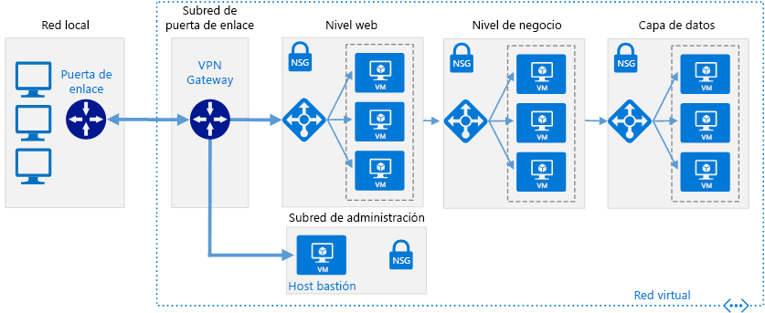
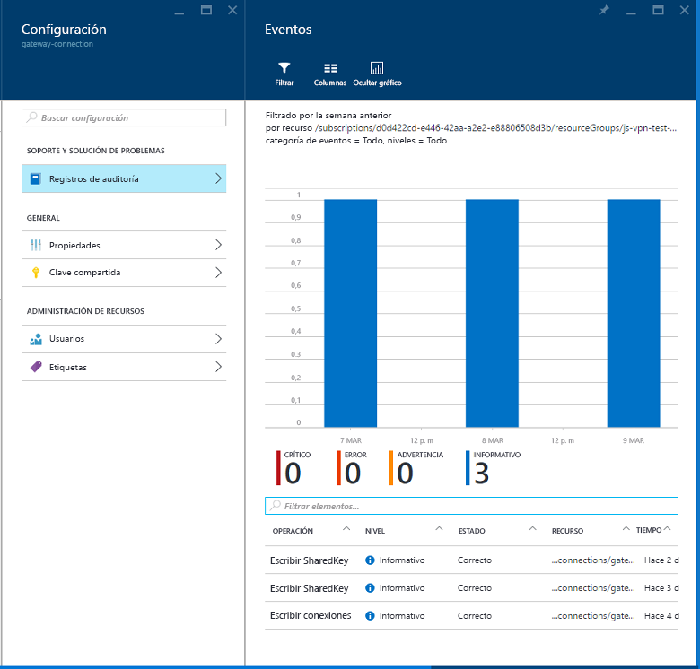

# Conexión de una red local a Azure mediante VPN Gateway

Esta arquitectura de referencia muestra cómo extender una red local a Azure mediante una red privada virtual (VPN) de sitio a sitio. El tráfico fluye entre la red local y Azure Virtual Network (VNet) a través de un túnel VPN de IPSec. [**Implemente esta solución**](#deploy-the-solution).

*Descargue un [archivo Visio][visio-download] de esta arquitectura.*

## Arquitectura

La arquitectura consta de los siguientes componentes:

- **Red local**. Una red de área local privada que se ejecuta dentro de una organización.

- **Dispositivo VPN**. Un dispositivo o servicio que proporciona conectividad externa a la red local. El dispositivo VPN puede ser un dispositivo de hardware, o puede ser una solución de software como el servicio de Enrutamiento y acceso remoto (RRAS) en Windows Server 2012. Para obtener una lista de dispositivos VPN admitidos e información sobre la configuración para conectarlos a Azure VPN Gateway, consulte las instrucciones para el dispositivo seleccionado en el artículo [Acerca de los dispositivos VPN y los parámetros de IPsec/IKE para conexiones de VPN Gateway de sitio a sitio][vpn-appliance].

- **Red virtual**. La aplicación en la nube y los componentes de Azure VPN Gateway se encuentran en la misma red virtual [(VNet)][azure-virtual-network].

- **Azure VPN Gateway**. El servicio [VPN Gateway][azure-vpn-gateway] le permite conectar la red virtual a la red local mediante un dispositivo VPN. Para más información, consulte [Conectar una red local con una red virtual de Microsoft Azure][connect-to-an-Azure-vnet]. VPN Gateway incluye los siguientes elementos:

  - **Puerta de enlace de red virtual**. Recurso que proporciona un dispositivo VPN virtual para la red virtual. Es responsable de enrutar el tráfico de la red local a la red virtual.
  - **Puerta de enlace de red local**. Abstracción del dispositivo VPN local. El tráfico de red de la aplicación en la nube a la red local se enruta a través de esta puerta de enlace.
  - **Conexión**. La conexión tiene propiedades que especifican el tipo de conexión (IPSec) y la clave compartida con el dispositivo VPN local para cifrar el tráfico.
  - **Subred de puerta de enlace**. La puerta de enlace de red virtual se mantiene en su propia subred, que está sujeta a los distintos requisitos que se describen a continuación, en la sección Recomendaciones.

- **Aplicación en la nube**. La aplicación hospedada en Azure. Puede incluir varios niveles, con varias subredes que se conectan a través de equilibradores de carga de Azure. Para obtener más información acerca de la infraestructura de aplicaciones, consulte [Ejecutar cargas de trabajo de máquinas virtuales Windows][windows-vm-ra] y [Ejecutar cargas de trabajo de máquinas virtuales Linux][linux-vm-ra].

- **Equilibrador de carga interno**. El tráfico de red de VPN Gateway se enruta a la aplicación en la nube a través de un equilibrador de carga interno. El equilibrador de carga se encuentra en la subred front-end de la aplicación.

## Recomendaciones

Las siguientes recomendaciones sirven para la mayoría de los escenarios. Sígalas a menos que tenga un requisito concreto que las invalide.

### Red virtual y subred de puerta de enlace

Cree una red virtual de Azure con un espacio de direcciones lo suficientemente grande para todos los recursos necesarios. Asegúrese de que el espacio de direcciones de la red virtual tiene suficiente espacio para crecer si es probable que se necesiten máquinas virtuales adicionales en el futuro. El espacio de direcciones de la red virtual no debe superponerse a la red local. Por ejemplo, en el diagrama anterior se usa el espacio de direcciones 10.20.0.0/16 para la red virtual.

Cree una subred denominada *GatewaySubnet*, con un intervalo de direcciones de /27. Esta subred es necesaria para la puerta de enlace de red virtual. La asignación de treinta y dos direcciones a esta subred ayudará a evitar que se alcancen las limitaciones de tamaño de la puerta de enlace en el futuro. Evite también colocar esta subred en el centro del espacio de direcciones. Una práctica recomendada consiste en establecer el espacio de direcciones para la subred de la puerta de enlace en el extremo superior del espacio de direcciones de la red virtual. El ejemplo que aparece en el diagrama usa 10.20.255.224/27.  Este es un procedimiento rápido para calcular el [CIDR]:

1. Establezca los bits variables del espacio de direcciones de la red virtual en 1 hasta alcanzar los bits que usa la subred de puerta de enlace. A continuación, establezca los bits restantes en 0.
2. Convierta los bits resultantes a decimales y expréselos como un espacio de direcciones con la longitud del prefijo establecida en el tamaño de la subred de puerta de enlace.

Por ejemplo, al aplicar el paso 1 anterior a una red virtual con un intervalo de direcciones IP de 10.20.0.0/16, se convierte en 10.20.0b11111111.0b11100000.  Si se convierte en decimales y se expresa como un espacio de direcciones, da como resultado 10.20.255.224/27.

> [!WARNING]
> No implemente ninguna máquina virtual en la subred de puerta de enlace. Tampoco asigne ningún NSG a esta subred, ya que causaría que la puerta de enlace dejase de funcionar.
>

### Puerta de enlace de red virtual

Asigne una dirección IP pública para la puerta de enlace de la red virtual.

Cree la puerta de enlace de red virtual en la subred de puerta de enlace y asígnele la dirección IP pública recién asignada. Use el tipo de puerta de enlace que mejor se ajuste a sus requisitos y que su dispositivo VPN haya habilitado:

- Cree una [puerta de enlace basada en directivas][policy-based-routing] si necesita controlar estrechamente cómo se enrutan las solicitudes en función de los criterios de las directivas, tales como los prefijos de las direcciones. Las puertas de enlace basadas en directivas utilizan el enrutamiento estático y solo funcionan con conexiones de sitio a sitio.

- Cree una [puerta de enlace basada en rutas][route-based-routing] si se conecta a la red local mediante RRAS, admite conexiones multisitio o entre regiones, o bien si implementa conexiones de red virtual a red virtual (incluidas las rutas que atraviesan varias redes virtuales). Las puertas de enlace basadas en rutas utilizan el enrutamiento dinámico para dirigir el tráfico entre redes. Dado que pueden intentar rutas alternativas, pueden tolerar mejor los errores en la ruta de acceso de red que las rutas estáticas. Las puertas de enlace basadas en rutas también pueden reducir la sobrecarga de administración porque es posible que las rutas no tengan que actualizarse manualmente cuando las direcciones de red cambien.

Para obtener una lista de dispositivos VPN compatibles, consulte [Acerca de los dispositivos VPN y los parámetros de IPsec/IKE para conexiones de VPN Gateway de sitio a sitio][vpn-appliances].

> [!NOTE]
> Tras crear la puerta de enlace, no se puede cambiar entre los tipos de puerta de enlace sin antes eliminarla y volverla a crear.
>

Seleccione la SKU de Azure VPN Gateway que mejor se ajuste a sus requisitos de rendimiento. Para más información, consulte [SKU de puertas de enlace][azure-gateway-skus]

> [!NOTE]
> La SKU Básica no es compatible con Azure ExpressRoute. También puede [cambiar la SKU][changing-SKUs] tras crear la puerta de enlace.
>

Se le aplicará un cargo dependiendo del tiempo de aprovisionamiento y de la disponibilidad de la puerta de enlace. Vea [Precios de VPN Gateway][azure-gateway-charges].

En lugar de permitir que las solicitudes pasen directamente a las máquinas virtuales de la aplicación, cree reglas de enrutamiento para la subred de puerta de enlace que dirige el tráfico de aplicaciones entrante desde la puerta de enlace hacia el equilibrador de carga interno.

### Conexión de red local

Cree una puerta de enlace de red local. Especifique la dirección IP pública del dispositivo VPN local y el espacio de direcciones de la red local. Tenga en cuenta que el dispositivo VPN local debe tener una dirección IP pública a la cual pueda tener acceso la puerta de enlace de red local de Azure VPN Gateway. El dispositivo VPN no puede ubicarse detrás de un dispositivo de traducción de direcciones de red (NAT).

Cree una conexión de sitio a sitio para la puerta de enlace de red virtual y la puerta de enlace de red local. Seleccione el tipo de conexión de sitio a sitio (IPSec) y especifique la clave compartida. El cifrado de sitio a sitio con Azure VPN Gateway se basa en el protocolo IPSec y utiliza claves compartidas previamente para la autenticación. La clave se especifica al crear la instancia de Azure VPN Gateway. Debe configurar el dispositivo VPN que se ejecuta localmente con la misma clave. Actualmente, no se admiten otros mecanismos de autenticación.

Asegúrese de que la infraestructura de enrutamiento local esté configurada para reenviar al dispositivo VPN las solicitudes destinadas a direcciones de la red virtual de Azure.

Abra los puertos de la red local que requiera la aplicación en la nube.

Pruebe la conexión para comprobar que:

- El dispositivo VPN local enruta correctamente el tráfico a la aplicación en la nube a través de Azure VPN Gateway.
- La red virtual enruta correctamente el tráfico a la red local.
- El tráfico prohibido en ambas direcciones está bloqueado correctamente.

## Consideraciones sobre escalabilidad

Puede lograr una escalabilidad vertical limitada si cambia de las SKU de VPN Gateway Estándar o Básica a la SKU Alto rendimiento de VPN.

Para las redes virtuales que esperan un gran volumen de tráfico VPN, considere la posibilidad de distribuir las diferentes cargas de trabajo en redes virtuales más pequeñas independientes y de configurar una puerta de enlace VPN para cada una de ellas.

Puede dividir la red virtual de forma horizontal o vertical. Para dividirla horizontalmente, mueva algunas instancias de máquina virtual de cada capa a subredes de la red virtual nueva. El resultado es que cada red virtual tiene la misma estructura y funcionalidad. Para dividirla verticalmente, vuelva a diseñar cada capa para dividir la funcionalidad en diferentes áreas lógicas (por ejemplo, gestión de pedidos, facturación, administración de cuentas de clientes, etc.). Cada área funcional se puede colocar en su propia red virtual.

Con la replicación de un controlador de dominio de Active Directory local en la red virtual y la implementación de DNS en la red virtual, puede ayudar a reducir tráfico relacionado con la seguridad y la administración que fluye de la red local a la nube. Para obtener más información, consulte [Extensión de Active Directory Domain Services (AD DS) a Azure][adds-extend-domain].

## Consideraciones sobre disponibilidad

Si necesita asegurarse de que la red local sigue estando disponible en Azure VPN Gateway, implemente un clúster de conmutación por error para la instancia de VPN Gateway local.

Si su organización tiene varios sitios locales, cree [conexiones multisitio][vpn-gateway-multi-site] a una o varias redes virtuales de Azure. Este enfoque requiere enrutamiento dinámico (basado en rutas), así que debe asegurarse de que la instancia de VPN Gateway local admite esta característica.

Para obtener más información acerca de los acuerdos de nivel de servicio, consulte [Contrato de nivel de servicio para VPN Gateway][sla-for-vpn-gateway].

## Consideraciones sobre la manejabilidad

Supervise la información de diagnóstico de los dispositivos VPN locales. Este proceso depende de las características que proporcione el dispositivo VPN. Por ejemplo, si usa el servicio de Enrutamiento y acceso remoto en Windows Server 2012, consulte [RRAS logging][rras-logging] (Registro de RRAS).

Use los [diagnósticos de Azure VPN Gateway][ gateway-diagnostic-logs] para capturar información sobre problemas de conectividad. Estos registros se pueden utilizar para realizar el seguimiento de información, como el origen y los destinos de las solicitudes de conexión, el protocolo que se utilizó y cómo se estableció la conexión (o por qué el intento fue erróneo).

Supervise los registros operativos de Azure VPN Gateway mediante los registros de auditoría disponibles en Azure Portal. Hay disponibles registros independientes para la puerta de enlace de red local, la puerta de enlace de red de Azure y la conexión. Esta información puede utilizarse para realizar un seguimiento de los cambios realizados en la puerta de enlace y puede resultar útil si una puerta de enlace que funcionaba previamente dejó de hacerlo por algún motivo.

Supervise la conectividad y realice un seguimiento de los eventos de error de conectividad. Puede usar un paquete de supervisión como [Nagios][nagios] para capturar y notificar esta información.

## Consideraciones sobre la seguridad

Genere una clave compartida diferente para cada instancia de VPN Gateway. Use una clave compartida segura para resistir los ataques de fuerza bruta.

> [!NOTE]
> Actualmente, no se puede usar Azure Key Vault para la compartición de claves previa en Azure VPN Gateway.
>

Asegúrese de que el dispositivo VPN local use un método de cifrado que sea [compatible con Azure VPN Gateway][vpn-appliance-ipsec]. Para el enrutamiento basado en directivas, Azure VPN Gateway admite los algoritmos de cifrado AES256, AES128 y 3DES. Las puertas de enlace basadas en rutas admiten AES256 y 3DES.

Si su dispositivo VPN local se encuentra en una red perimetral (DMZ) que tiene un firewall entre la red perimetral e Internet, es posible que deba configurar [reglas de firewall adicionales][additional-firewall-rules] para permitir la conexión VPN de sitio a sitio.

Si la aplicación en la red virtual envía datos a Internet, considere la posibilidad de [implementar la tunelización forzada][forced-tunneling] para enrutar todo el tráfico vinculado a Internet a través de la red local. Este enfoque le permite auditar las solicitudes salientes que realiza la aplicación desde la infraestructura local.

> [!NOTE]
> La tunelización forzada puede afectar a la conectividad a los servicios de Azure (por ejemplo, el servicio de almacenamiento) y el administrador de licencias de Windows.
>

## Implementación de la solución

**Requisitos previos**. Debe tener una infraestructura local existente ya configurada con un dispositivo de red adecuado.

Para implementar la solución, siga estos pasos:

<!-- markdownlint-disable MD033 -->

1. Haga clic en el botón a continuación: 
2. Espere a que el vínculo abra Azure Portal y, a continuación, siga estos pasos:
   - El nombre del **Grupo de recursos** ya está definido en el archivo de parámetros, así que seleccione **Crear nuevo** y escriba `ra-hybrid-vpn-rg` en el cuadro de texto.
   - Seleccione la región en el cuadro de lista desplegable **Ubicación**.
   - No modifique los cuadros de texto **URI raíz de plantilla** o **URI raíz de parámetro**.
   - Revise los términos y condiciones, y haga clic en la casilla **Acepto los términos y condiciones indicados anteriormente**.
   - Haga clic en el botón **Comprar**.
3. Espere a que la implementación se complete.

<!-- markdownlint-enable MD033 -->

Para solucionar problemas de conexión, consulte [Solución de problemas de una conexión VPN híbrida](./troubleshoot-vpn.md).

<!-- links -->

[adds-extend-domain]: ../identity/adds-extend-domain.md
[windows-vm-ra]: ../virtual-machines-windows/index.md
[linux-vm-ra]: ../virtual-machines-linux/index.md

[azure-cli]: /azure/virtual-machines-command-line-tools
[azure-virtual-network]: /azure/virtual-network/virtual-networks-overview
[vpn-appliance]: /azure/vpn-gateway/vpn-gateway-about-vpn-devices
[azure-vpn-gateway]: https://azure.microsoft.com/services/vpn-gateway/
[azure-gateway-charges]: https://azure.microsoft.com/pricing/details/vpn-gateway/
[azure-gateway-skus]: /azure/vpn-gateway/vpn-gateway-about-vpngateways#gwsku
[connect-to-an-Azure-vnet]: https://technet.microsoft.com/library/dn786406.aspx
[vpn-gateway-multi-site]: /azure/vpn-gateway/vpn-gateway-multi-site
[policy-based-routing]: https://en.wikipedia.org/wiki/Policy-based_routing
[route-based-routing]: https://en.wikipedia.org/wiki/Static_routing
[sla-for-vpn-gateway]: https://azure.microsoft.com/support/legal/sla/vpn-gateway/
[additional-firewall-rules]: https://technet.microsoft.com/library/dn786406.aspx#firewall
[nagios]: https://www.nagios.org/
[changing-SKUs]: https://azure.microsoft.com/blog/azure-virtual-network-gateway-improvements/
[gateway-diagnostic-logs]: https://blogs.technet.microsoft.com/keithmayer/2016/10/12/step-by-step-capturing-azure-resource-manager-arm-vnet-gateway-diagnostic-logs/
[rras-logging]: https://www.petri.com/enable-diagnostic-logging-in-windows-server-2012-r2-routing-and-remote-access
[forced-tunneling]: https://azure.microsoft.com/documentation/articles/vpn-gateway-about-forced-tunneling/
[vpn-appliances]: /azure/vpn-gateway/vpn-gateway-about-vpn-devices
[visio-download]: https://archcenter.blob.core.windows.net/cdn/hybrid-network-architectures.vsdx
[vpn-appliance-ipsec]: /azure/vpn-gateway/vpn-gateway-about-vpn-devices#ipsec-parameters
[azure-cli]: https://azure.microsoft.com/documentation/articles/xplat-cli-install/
[CIDR]: https://en.wikipedia.org/wiki/Classless_Inter-Domain_Routing
