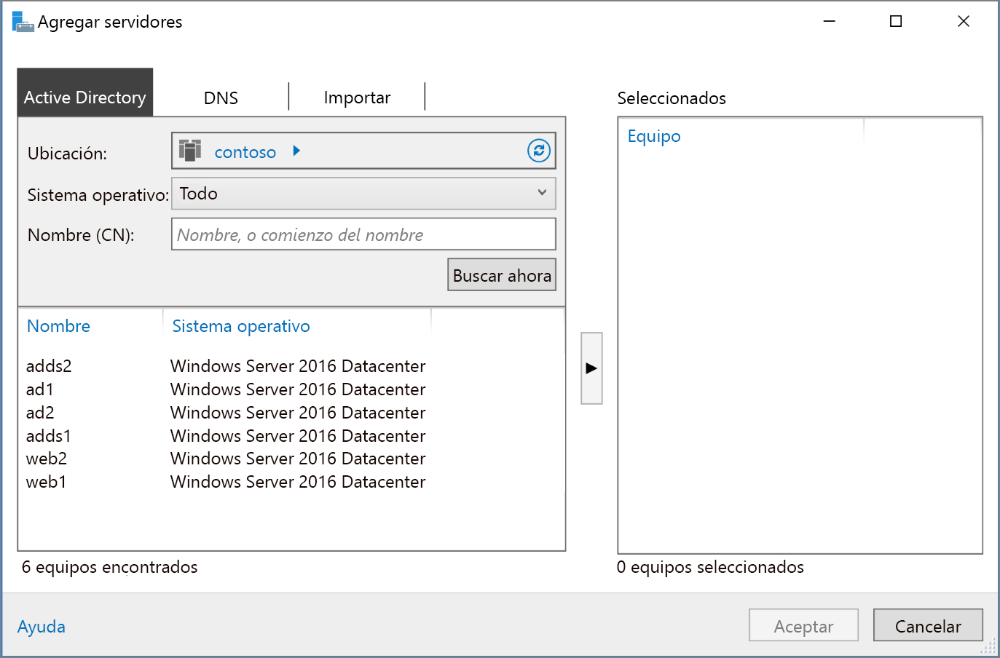

# <a name="extend-active-directory-domain-services-ad-ds-to-azure"></a><span data-ttu-id="5579f-103">Extensión de Active Directory Domain Services (AD DS) a Azure</span><span class="sxs-lookup"><span data-stu-id="5579f-103">Extend Active Directory Domain Services (AD DS) to Azure</span></span>

<span data-ttu-id="5579f-104">En esta arquitectura de referencia se muestra cómo extender el entorno de Active Directory a Azure para proporcionar servicios de autenticación distribuidos mediante Active Directory Domain Services (AD DS).</span><span class="sxs-lookup"><span data-stu-id="5579f-104">This reference architecture shows how to extend your Active Directory environment to Azure to provide distributed authentication services using Active Directory Domain Services (AD DS).</span></span> [<span data-ttu-id="5579f-105">**Implemente esta solución**.</span><span class="sxs-lookup"><span data-stu-id="5579f-105">**Deploy this solution**.</span></span>](#deploy-the-solution)

<span data-ttu-id="5579f-106">[![0]][0]</span><span class="sxs-lookup"><span data-stu-id="5579f-106">[![0]][0]</span></span> 

<span data-ttu-id="5579f-107">*Descargue un [archivo Visio][visio-download] de esta arquitectura.*</span><span class="sxs-lookup"><span data-stu-id="5579f-107">*Download a [Visio file][visio-download] of this architecture.*</span></span>

<span data-ttu-id="5579f-108">AD DS se usa para autenticar usuarios, equipos, aplicaciones u otras entidades que se incluyen en un dominio de seguridad.</span><span class="sxs-lookup"><span data-stu-id="5579f-108">AD DS is used to authenticate user, computer, application, or other identities that are included in a security domain.</span></span> <span data-ttu-id="5579f-109">Se puede hospedar de forma local, pero si parte de la aplicación se hospeda en el entorno local y parte en Azure, puede que resulte más eficaz replicar esta funcionalidad en Azure.</span><span class="sxs-lookup"><span data-stu-id="5579f-109">It can be hosted on-premises, but if your application is hosted partly on-premises and partly in Azure, it may be more efficient to replicate this functionality in Azure.</span></span> <span data-ttu-id="5579f-110">Esto puede reducir la latencia causada por el envío de solicitudes de autorización locales y de autenticación desde la nube a los servicios AD DS que se ejecutan en un entorno local.</span><span class="sxs-lookup"><span data-stu-id="5579f-110">This can reduce the latency caused by sending authentication and local authorization requests from the cloud back to AD DS running on-premises.</span></span> 

<span data-ttu-id="5579f-111">Esta arquitectura suele usarse cuando la red local y la red virtual de Azure están conectadas mediante una conexión VPN o ExpressRoute.</span><span class="sxs-lookup"><span data-stu-id="5579f-111">This architecture is commonly used when the on-premises network and the Azure virtual network are connected by a VPN or ExpressRoute connection.</span></span> <span data-ttu-id="5579f-112">Esta arquitectura también admite la replicación bidireccional, lo que significa que los cambios se pueden realizar en el entorno local o en la nube, de tal forma que se mantiene la coherencia de ambos orígenes.</span><span class="sxs-lookup"><span data-stu-id="5579f-112">This architecture also supports bidirectional replication, meaning changes can be made either on-premises or in the cloud, and both sources will be kept consistent.</span></span> <span data-ttu-id="5579f-113">Los usos típicos de esta arquitectura incluyen aplicaciones híbridas en las que la funcionalidad se distribuye entre el entorno local y Azure, y las aplicaciones y los servicios que realizan la autenticación con Active Directory.</span><span class="sxs-lookup"><span data-stu-id="5579f-113">Typical uses for this architecture include hybrid applications in which functionality is distributed between on-premises and Azure, and applications and services that perform authentication using Active Directory.</span></span>

<span data-ttu-id="5579f-114">Para consideraciones adicionales, consulte [Selección de una solución para la integración de Active Directory local con Azure][considerations].</span><span class="sxs-lookup"><span data-stu-id="5579f-114">For additional considerations, see [Choose a solution for integrating on-premises Active Directory with Azure][considerations].</span></span> 

## <a name="architecture"></a><span data-ttu-id="5579f-115">Arquitectura</span><span class="sxs-lookup"><span data-stu-id="5579f-115">Architecture</span></span> 

<span data-ttu-id="5579f-116">Esta arquitectura extiende la arquitectura mostrada en [Red perimetral entre Internet y Azure][implementing-a-secure-hybrid-network-architecture-with-internet-access].</span><span class="sxs-lookup"><span data-stu-id="5579f-116">This architecture extends the architecture shown in [DMZ between Azure and the Internet][implementing-a-secure-hybrid-network-architecture-with-internet-access].</span></span> <span data-ttu-id="5579f-117">Tiene los siguientes componentes.</span><span class="sxs-lookup"><span data-stu-id="5579f-117">It has the following components.</span></span>

* <span data-ttu-id="5579f-118">**Red local**.</span><span class="sxs-lookup"><span data-stu-id="5579f-118">**On-premises network**.</span></span> <span data-ttu-id="5579f-119">La red local incluye servidores locales de Active Directory que pueden realizar la autenticación y autorización de componentes que se encuentran en entornos locales.</span><span class="sxs-lookup"><span data-stu-id="5579f-119">The on-premises network includes local Active Directory servers that can perform authentication and authorization for components located on-premises.</span></span>
* <span data-ttu-id="5579f-120">**Servidores de Active Directory**.</span><span class="sxs-lookup"><span data-stu-id="5579f-120">**Active Directory servers**.</span></span> <span data-ttu-id="5579f-121">Se trata de controladores de dominio que implementan servicios de directorio (AD DS) que se ejecutan como máquinas virtuales en la nube.</span><span class="sxs-lookup"><span data-stu-id="5579f-121">These are domain controllers implementing directory services (AD DS) running as VMs in the cloud.</span></span> <span data-ttu-id="5579f-122">Estos servidores pueden proporcionar la autenticación de componentes que se ejecutan en la red virtual de Azure.</span><span class="sxs-lookup"><span data-stu-id="5579f-122">These servers can provide authentication of components running in your Azure virtual network.</span></span>
* <span data-ttu-id="5579f-123">**Subred de Active Directory**.</span><span class="sxs-lookup"><span data-stu-id="5579f-123">**Active Directory subnet**.</span></span> <span data-ttu-id="5579f-124">Los servidores de AD DS se hospedan en una subred independiente.</span><span class="sxs-lookup"><span data-stu-id="5579f-124">The AD DS servers are hosted in a separate subnet.</span></span> <span data-ttu-id="5579f-125">Las reglas de los grupos de seguridad de red (NSG) protegen los servidores de AD DS y proporcionan un firewall contra el tráfico procedente de orígenes inesperados.</span><span class="sxs-lookup"><span data-stu-id="5579f-125">Network security group (NSG) rules protect the AD DS servers and provide a firewall against traffic from unexpected sources.</span></span>
* <span data-ttu-id="5579f-126">**Azure Gateway y sincronización de Active Directory**.</span><span class="sxs-lookup"><span data-stu-id="5579f-126">**Azure Gateway and Active Directory synchronization**.</span></span> <span data-ttu-id="5579f-127">Azure Gateway proporciona una conexión entre la red local y la red virtual de Azure.</span><span class="sxs-lookup"><span data-stu-id="5579f-127">The Azure gateway provides a connection between the on-premises network and the Azure VNet.</span></span> <span data-ttu-id="5579f-128">Puede ser una [conexión VPN][azure-vpn-gateway] o [Azure ExpressRoute][azure-expressroute].</span><span class="sxs-lookup"><span data-stu-id="5579f-128">This can be a [VPN connection][azure-vpn-gateway] or [Azure ExpressRoute][azure-expressroute].</span></span> <span data-ttu-id="5579f-129">Todas las solicitudes de sincronización entre los servidores de Active Directory en la nube y locales pasan a través de la puerta de enlace.</span><span class="sxs-lookup"><span data-stu-id="5579f-129">All synchronization requests between the Active Directory servers in the cloud and on-premises pass through the gateway.</span></span> <span data-ttu-id="5579f-130">Las rutas definidas por el usuario (UDR) controlan el enrutamiento del tráfico local que pasa a Azure.</span><span class="sxs-lookup"><span data-stu-id="5579f-130">User-defined routes (UDRs) handle routing for on-premises traffic that passes to Azure.</span></span> <span data-ttu-id="5579f-131">El tráfico hacia y desde los servidores de Active Directory no pasa a través de las aplicaciones virtuales de red (NVA) utilizadas en este escenario.</span><span class="sxs-lookup"><span data-stu-id="5579f-131">Traffic to and from the Active Directory servers does not pass through the network virtual appliances (NVAs) used in this scenario.</span></span>

<span data-ttu-id="5579f-132">Para más información sobre cómo configurar UDR y NVA, vea [Implementación de una arquitectura de red híbrida segura en Azure][implementing-a-secure-hybrid-network-architecture].</span><span class="sxs-lookup"><span data-stu-id="5579f-132">For more information about configuring UDRs and the NVAs, see [Implementing a secure hybrid network architecture in Azure][implementing-a-secure-hybrid-network-architecture].</span></span> 

## <a name="recommendations"></a><span data-ttu-id="5579f-133">Recomendaciones</span><span class="sxs-lookup"><span data-stu-id="5579f-133">Recommendations</span></span>

<span data-ttu-id="5579f-134">Las siguientes recomendaciones sirven para la mayoría de los escenarios.</span><span class="sxs-lookup"><span data-stu-id="5579f-134">The following recommendations apply for most scenarios.</span></span> <span data-ttu-id="5579f-135">Sígalas a menos que tenga un requisito concreto que las invalide.</span><span class="sxs-lookup"><span data-stu-id="5579f-135">Follow these recommendations unless you have a specific requirement that overrides them.</span></span> 

### <a name="vm-recommendations"></a><span data-ttu-id="5579f-136">Recomendaciones de VM</span><span class="sxs-lookup"><span data-stu-id="5579f-136">VM recommendations</span></span>

<span data-ttu-id="5579f-137">Determine los requisitos de [tamaño de la máquina virtual][vm-windows-sizes] en función del volumen esperado de solicitudes de autenticación.</span><span class="sxs-lookup"><span data-stu-id="5579f-137">Determine your [VM size][vm-windows-sizes] requirements based on the expected volume of authentication requests.</span></span> <span data-ttu-id="5579f-138">Use las especificaciones de los equipos que hospedan AD DS de forma local como punto de partida y hágalas coincidir con los tamaños de máquina virtual de Azure.</span><span class="sxs-lookup"><span data-stu-id="5579f-138">Use the specifications of the machines hosting AD DS on premises as a starting point, and match them with the Azure VM sizes.</span></span> <span data-ttu-id="5579f-139">Una vez realizada la implementación, supervise la utilización y escale o reduzca verticalmente en función de la carga real de las máquinas virtuales.</span><span class="sxs-lookup"><span data-stu-id="5579f-139">Once deployed, monitor utilization and scale up or down based on the actual load on the VMs.</span></span> <span data-ttu-id="5579f-140">Para más información sobre cómo ajustar el tamaño de los controladores de dominio de AD DS, vea [Capacity Planning for Active Directory Domain Services][capacity-planning-for-adds] (Planeamiento de capacidad de Active Directory Domain Services).</span><span class="sxs-lookup"><span data-stu-id="5579f-140">For more information about sizing AD DS domain controllers, see [Capacity Planning for Active Directory Domain Services][capacity-planning-for-adds].</span></span>

<span data-ttu-id="5579f-141">Crear un disco de datos virtual independiente para almacenar la base de datos, los registros y SYSVOL de Active Directory.</span><span class="sxs-lookup"><span data-stu-id="5579f-141">Create a separate virtual data disk for storing the database, logs, and SYSVOL for Active Directory.</span></span> <span data-ttu-id="5579f-142">No almacene estos elementos en el mismo disco que el sistema operativo.</span><span class="sxs-lookup"><span data-stu-id="5579f-142">Do not store these items on the same disk as the operating system.</span></span> <span data-ttu-id="5579f-143">Tenga en cuenta que, de forma predeterminada, los disco de datos que están conectados a una máquina virtual usan una caché de escritura simultánea.</span><span class="sxs-lookup"><span data-stu-id="5579f-143">Note that by default, data disks that are attached to a VM use write-through caching.</span></span> <span data-ttu-id="5579f-144">Sin embargo, esta forma de almacenamiento en caché puede entrar en conflicto con los requisitos de AD DS.</span><span class="sxs-lookup"><span data-stu-id="5579f-144">However, this form of caching can conflict with the requirements of AD DS.</span></span> <span data-ttu-id="5579f-145">Por ello, establezca la *preferencia de caché de host* en el disco de datos en *Ninguna*.</span><span class="sxs-lookup"><span data-stu-id="5579f-145">For this reason, set the *Host Cache Preference* setting on the data disk to *None*.</span></span> <span data-ttu-id="5579f-146">Para más información, vea [Selección de ubicación de la base de datos y SYSVOL de Windows Server AD DS][adds-data-disks].</span><span class="sxs-lookup"><span data-stu-id="5579f-146">For more information, see [Placement of the Windows Server AD DS database and SYSVOL][adds-data-disks].</span></span>

<span data-ttu-id="5579f-147">Implemente al menos dos máquinas virtuales que ejecutan AD DS como controladores de dominio y agréguelas a un [conjunto de disponibilidad][availability-set].</span><span class="sxs-lookup"><span data-stu-id="5579f-147">Deploy at least two VMs running AD DS as domain controllers and add them to an [availability set][availability-set].</span></span>

### <a name="networking-recommendations"></a><span data-ttu-id="5579f-148">Recomendaciones de redes</span><span class="sxs-lookup"><span data-stu-id="5579f-148">Networking recommendations</span></span>

<span data-ttu-id="5579f-149">Configure la interfaz de red (NIC) de VM para cada servidor de AD DS con una dirección IP privada estática para la compatibilidad total del Servicio de nombres de dominio (DNS).</span><span class="sxs-lookup"><span data-stu-id="5579f-149">Configure the VM network interface (NIC) for each AD DS server with a static private IP address for full domain name service (DNS) support.</span></span> <span data-ttu-id="5579f-150">Para más información, vea [Configuración de direcciones IP privadas para una máquina virtual mediante Azure Portal][set-a-static-ip-address].</span><span class="sxs-lookup"><span data-stu-id="5579f-150">For more information, see [How to set a static private IP address in the Azure portal][set-a-static-ip-address].</span></span>

> [!NOTE]
> <span data-ttu-id="5579f-151">No configure la NIC de VM para cualquier AD DS con una dirección IP pública.</span><span class="sxs-lookup"><span data-stu-id="5579f-151">Do not configure the VM NIC for any AD DS with a public IP address.</span></span> <span data-ttu-id="5579f-152">Vea las [consideraciones de seguridad][security-considerations] para más información.</span><span class="sxs-lookup"><span data-stu-id="5579f-152">See [Security considerations][security-considerations] for more details.</span></span>
> 
> 

<span data-ttu-id="5579f-153">El NSG de la subred de Active Directory requiere reglas para permitir el tráfico entrante desde el entorno local.</span><span class="sxs-lookup"><span data-stu-id="5579f-153">The Active Directory subnet NSG requires rules to permit incoming traffic from on-premises.</span></span> <span data-ttu-id="5579f-154">Para obtener información detallada sobre los puertos que AD DS utiliza, vea [Active Directory and Active Directory Domain Services Port Requirements][ad-ds-ports] (Requisitos de puertos de Active Directory Domain Services y Active Directory).</span><span class="sxs-lookup"><span data-stu-id="5579f-154">For detailed information on the ports used by AD DS, see [Active Directory and Active Directory Domain Services Port Requirements][ad-ds-ports].</span></span> <span data-ttu-id="5579f-155">Asegúrese también de que las tablas UDR no enruten el tráfico de AD DS a través de las NVA utilizadas en esta arquitectura.</span><span class="sxs-lookup"><span data-stu-id="5579f-155">Also, ensure the UDR tables do not route AD DS traffic through the NVAs used in this architecture.</span></span> 

### <a name="active-directory-site"></a><span data-ttu-id="5579f-156">Sitio de Active Directory</span><span class="sxs-lookup"><span data-stu-id="5579f-156">Active Directory site</span></span>

<span data-ttu-id="5579f-157">En AD DS, un sitio representa una ubicación física, una red o un conjunto de dispositivos.</span><span class="sxs-lookup"><span data-stu-id="5579f-157">In AD DS, a site represents a physical location, network, or collection of devices.</span></span> <span data-ttu-id="5579f-158">Los sitios de AD DS se utilizan para administrar la replicación de base de datos de AD DS mediante la agrupación de objetos de AD DS que se encuentran cerca unos de otros y que están conectados mediante una red de alta velocidad.</span><span class="sxs-lookup"><span data-stu-id="5579f-158">AD DS sites are used to manage AD DS database replication by grouping together AD DS objects that are located close to one another and are connected by a high speed network.</span></span> <span data-ttu-id="5579f-159">AD DS incluye la lógica para seleccionar la mejor estrategia para replicar la base de datos de AD DS entre sitios.</span><span class="sxs-lookup"><span data-stu-id="5579f-159">AD DS includes logic to select the best strategy for replacating the AD DS database between sites.</span></span>

<span data-ttu-id="5579f-160">Se recomienda crear un sitio de AD DS, incluidas las subredes definidas para la aplicación en Azure.</span><span class="sxs-lookup"><span data-stu-id="5579f-160">We recommend that you create an AD DS site including the subnets defined for your application in Azure.</span></span> <span data-ttu-id="5579f-161">Después, configure un vínculo de sitio entre los sitios de AD DS locales, y AD DS realizará automáticamente la replicación de base de datos más eficaz posible.</span><span class="sxs-lookup"><span data-stu-id="5579f-161">Then, configure a site link between your on-premises AD DS sites, and AD DS will automatically perform the most efficient database replication possible.</span></span> <span data-ttu-id="5579f-162">Tenga en cuenta que esta replicación de base de datos requiere poco más aparte de la configuración inicial.</span><span class="sxs-lookup"><span data-stu-id="5579f-162">Note that this database replication requires little beyond the initial configuration.</span></span>

### <a name="active-directory-operations-masters"></a><span data-ttu-id="5579f-163">Maestros de operaciones de Active Directory</span><span class="sxs-lookup"><span data-stu-id="5579f-163">Active Directory operations masters</span></span>

<span data-ttu-id="5579f-164">El rol de maestro de operaciones se puede asignar a los controladores de dominio de AD DS para admitir la comprobación de coherencia entre instancias de bases de datos de AD DS replicadas.</span><span class="sxs-lookup"><span data-stu-id="5579f-164">The operations masters role can be assigned to AD DS domain controllers to support consistency checking between instances of replicated AD DS databases.</span></span> <span data-ttu-id="5579f-165">Hay cinco roles de maestro de operaciones: maestro de esquema, maestro de nomenclatura de dominios, maestro de identificadores relativos, maestro emulador del controlador de dominio principal y maestro de infraestructuras.</span><span class="sxs-lookup"><span data-stu-id="5579f-165">There are five operations master roles: schema master, domain naming master, relative identifier master, primary domain controller master emulator, and infrastructure master.</span></span> <span data-ttu-id="5579f-166">Para más información sobre estos roles, vea [What are Operations Masters?][ad-ds-operations-masters] (¿Qué son los maestros de operaciones?).</span><span class="sxs-lookup"><span data-stu-id="5579f-166">For more information about these roles, see [What are Operations Masters?][ad-ds-operations-masters].</span></span>

<span data-ttu-id="5579f-167">Se recomienda no asignar roles de maestros de operaciones a los controladores de dominio implementados en Azure.</span><span class="sxs-lookup"><span data-stu-id="5579f-167">We recommend you do not assign operations masters roles to the domain controllers deployed in Azure.</span></span>

### <a name="monitoring"></a><span data-ttu-id="5579f-168">Supervisión</span><span class="sxs-lookup"><span data-stu-id="5579f-168">Monitoring</span></span>

<span data-ttu-id="5579f-169">Supervise los recursos de las máquinas virtuales del controlador de dominio y los servicios de AD DS y cree un plan para corregir rápidamente los problemas.</span><span class="sxs-lookup"><span data-stu-id="5579f-169">Monitor the resources of the domain controller VMs as well as the AD DS Services and create a plan to quickly correct any problems.</span></span> <span data-ttu-id="5579f-170">Para más información, vea [Monitoring Active Directory][monitoring_ad] (Supervisión de Active Directory).</span><span class="sxs-lookup"><span data-stu-id="5579f-170">For more information, see [Monitoring Active Directory][monitoring_ad].</span></span> <span data-ttu-id="5579f-171">También puede instalar herramientas como [Microsoft Systems Center][microsoft_systems_center] en un servidor de supervisión (vea el diagrama de la arquitectura) para ayudar a realizar estas tareas.</span><span class="sxs-lookup"><span data-stu-id="5579f-171">You can also install tools such as [Microsoft Systems Center][microsoft_systems_center] on the monitoring server (see the architecture diagram) to help perform these tasks.</span></span>  

## <a name="scalability-considerations"></a><span data-ttu-id="5579f-172">Consideraciones sobre escalabilidad</span><span class="sxs-lookup"><span data-stu-id="5579f-172">Scalability considerations</span></span>

<span data-ttu-id="5579f-173">AD DS está diseñado para ofrecer escalabilidad.</span><span class="sxs-lookup"><span data-stu-id="5579f-173">AD DS is designed for scalability.</span></span> <span data-ttu-id="5579f-174">No es necesario configurar un equilibrador de carga o un controlador de tráfico para dirigir las solicitudes a controladores de dominio de AD DS.</span><span class="sxs-lookup"><span data-stu-id="5579f-174">You don't need to configure a load balancer or traffic controller to direct requests to AD DS domain controllers.</span></span> <span data-ttu-id="5579f-175">La única consideración de escalabilidad consiste en configurar las máquinas virtuales que ejecutan AD DS con el tamaño correcto para los requisitos de la carga de red, supervisar la carga en las máquinas virtuales y escalar y reducir verticalmente, según sea necesario.</span><span class="sxs-lookup"><span data-stu-id="5579f-175">The only scalability consideration is to configure the VMs running AD DS with the correct size for your network load requirements, monitor the load on the VMs, and scale up or down as necessary.</span></span>

## <a name="availability-considerations"></a><span data-ttu-id="5579f-176">Consideraciones sobre disponibilidad</span><span class="sxs-lookup"><span data-stu-id="5579f-176">Availability considerations</span></span>

<span data-ttu-id="5579f-177">Implemente las máquinas virtuales que ejecutan AD DS en un [conjunto de disponibilidad][availability-set].</span><span class="sxs-lookup"><span data-stu-id="5579f-177">Deploy the VMs running AD DS into an [availability set][availability-set].</span></span> <span data-ttu-id="5579f-178">Además, considere la posibilidad de asignar el rol de [maestro de operaciones en modo de espera][standby-operations-masters] al menos a un servidor y, posiblemente más, en función de los requisitos.</span><span class="sxs-lookup"><span data-stu-id="5579f-178">Also, consider assigning the role of [standby operations master][standby-operations-masters] to at least one server, and possibly more depending on your requirements.</span></span> <span data-ttu-id="5579f-179">Un maestro de operaciones en modo de espera es una copia activa del maestro de operaciones que puede usarse en lugar del servidor maestro de operaciones principal durante una conmutación por error.</span><span class="sxs-lookup"><span data-stu-id="5579f-179">A standby operations master is an active copy of the operations master that can be used in place of the primary operations masters server during fail over.</span></span>

## <a name="manageability-considerations"></a><span data-ttu-id="5579f-180">Consideraciones sobre la manejabilidad</span><span class="sxs-lookup"><span data-stu-id="5579f-180">Manageability considerations</span></span>

<span data-ttu-id="5579f-181">Realice copias de seguridad periódicas de AD DS.</span><span class="sxs-lookup"><span data-stu-id="5579f-181">Perform regular AD DS backups.</span></span> <span data-ttu-id="5579f-182">No basta con copiar los archivos VHD de los controladores de dominio en lugar de realizar copias de seguridad periódicas, dado que el archivo de base de datos de AD DS del disco duro virtual puede no tener un estado coherente cuando se copia, lo que puede hacer que sea imposible reiniciar la base de datos.</span><span class="sxs-lookup"><span data-stu-id="5579f-182">Don't simply copy the VHD files of domain controllers instead of performing regular backups, because the AD DS database file on the VHD may not be in a consistent state when it's copied, making it impossible to restart the database.</span></span>

<span data-ttu-id="5579f-183">No apague una máquina virtual del controlador de dominio mediante Azure Portal.</span><span class="sxs-lookup"><span data-stu-id="5579f-183">Do not shut down a domain controller VM using Azure portal.</span></span> <span data-ttu-id="5579f-184">En su lugar, apague y reinicie desde el sistema operativo invitado.</span><span class="sxs-lookup"><span data-stu-id="5579f-184">Instead, shut down and restart from the guest operating system.</span></span> <span data-ttu-id="5579f-185">Si la operación de apagado se realiza desde el portal, la máquina virtual se desasigna, lo que hace que `VM-GenerationID` y `invocationID` se restablezcan en el repositorio de Active Directory.</span><span class="sxs-lookup"><span data-stu-id="5579f-185">Shutting down through the portal causes the VM to be deallocated, which resets both the `VM-GenerationID` and the `invocationID` of the Active Directory repository.</span></span> <span data-ttu-id="5579f-186">Esto descarta el grupo de identificadores relativos (RID) de AD DS y marca SYSVOL como no autoritativo; además, puede requerir la reconfiguración del controlador de dominio.</span><span class="sxs-lookup"><span data-stu-id="5579f-186">This discards the AD DS relative identifier (RID) pool and marks SYSVOL as nonauthoritative, and may require reconfiguration of the domain controller.</span></span>

## <a name="security-considerations"></a><span data-ttu-id="5579f-187">Consideraciones sobre la seguridad</span><span class="sxs-lookup"><span data-stu-id="5579f-187">Security considerations</span></span>

<span data-ttu-id="5579f-188">Los servidores de AD DS proporcionan servicios de autenticación y son un objetivo muy atractivo para los ataques.</span><span class="sxs-lookup"><span data-stu-id="5579f-188">AD DS servers provide authentication services and are an attractive target for attacks.</span></span> <span data-ttu-id="5579f-189">Para protegerlos, evite la conexión directa a Internet mediante la colocación de los servidores de AD DS en una subred independiente con un NSG que actúe como un firewall.</span><span class="sxs-lookup"><span data-stu-id="5579f-189">To secure them, prevent direct Internet connectivity by placing the AD DS servers in a separate subnet with an NSG acting as a firewall.</span></span> <span data-ttu-id="5579f-190">Cierre todos los puertos en los servidores de AD DS, excepto los necesarios para la autenticación, autorización y sincronización del servidor.</span><span class="sxs-lookup"><span data-stu-id="5579f-190">Close all ports on the AD DS servers except those necessary for authentication, authorization, and server synchronization.</span></span> <span data-ttu-id="5579f-191">Para más información, vea [Active Directory and Active Directory Domain Services Port Requirements][ad-ds-ports] (Requisitos de puertos de Active Directory Domain Services y Active Directory).</span><span class="sxs-lookup"><span data-stu-id="5579f-191">For more information, see [Active Directory and Active Directory Domain Services Port Requirements][ad-ds-ports].</span></span>

<span data-ttu-id="5579f-192">Considere la posibilidad de implementar un perímetro de seguridad adicional alrededor de los servidores con un par de subredes y NVA, como se describe en [Implementación de una arquitectura de red híbrida segura con acceso a Internet en Azure][implementing-a-secure-hybrid-network-architecture-with-internet-access].</span><span class="sxs-lookup"><span data-stu-id="5579f-192">Consider implementing an additional security perimeter around servers with a pair of subnets and NVAs, as described in [Implementing a secure hybrid network architecture with Internet access in Azure][implementing-a-secure-hybrid-network-architecture-with-internet-access].</span></span>

<span data-ttu-id="5579f-193">Utilice BitLocker o Azure Disk Encryption para cifrar el disco que hospeda la base de datos de AD DS.</span><span class="sxs-lookup"><span data-stu-id="5579f-193">Use either BitLocker or Azure disk encryption to encrypt the disk hosting the AD DS database.</span></span>

## <a name="deploy-the-solution"></a><span data-ttu-id="5579f-194">Implementación de la solución</span><span class="sxs-lookup"><span data-stu-id="5579f-194">Deploy the solution</span></span>

<span data-ttu-id="5579f-195">Hay disponible una implementación de esta arquitectura en [GitHub][github].</span><span class="sxs-lookup"><span data-stu-id="5579f-195">A deployment for this architecture is available on [GitHub][github].</span></span> <span data-ttu-id="5579f-196">Tenga en cuenta que la implementación completa puede tardar hasta dos horas, lo que incluye la creación de una instancia de VPN Gateway y ejecutar los scripts que configuran AD DS.</span><span class="sxs-lookup"><span data-stu-id="5579f-196">Note that the entire deployment can take up to two hours, which includes creating the VPN gateway and running the scripts that configure AD DS.</span></span>

### <a name="prerequisites"></a><span data-ttu-id="5579f-197">Requisitos previos</span><span class="sxs-lookup"><span data-stu-id="5579f-197">Prerequisites</span></span>

[!INCLUDE [ref-arch-prerequisites.md](../../../includes/ref-arch-prerequisites.md)]

### <a name="deploy-the-simulated-on-premises-datacenter"></a><span data-ttu-id="5579f-198">Implementación del centro de datos local simulado</span><span class="sxs-lookup"><span data-stu-id="5579f-198">Deploy the simulated on-premises datacenter</span></span>

1. <span data-ttu-id="5579f-199">Vaya a la carpeta `identity/adds-extend-domain` del repositorio de GitHub.</span><span class="sxs-lookup"><span data-stu-id="5579f-199">Navigate to the `identity/adds-extend-domain` folder of the GitHub repository.</span></span>

2. <span data-ttu-id="5579f-200">Abra el archivo `onprem.json` .</span><span class="sxs-lookup"><span data-stu-id="5579f-200">Open the `onprem.json` file.</span></span> <span data-ttu-id="5579f-201">Busque instancias de `adminPassword` y `Password` y agregue valores para las contraseñas.</span><span class="sxs-lookup"><span data-stu-id="5579f-201">Search for instances of `adminPassword` and `Password` and add values for the passwords.</span></span>

3. <span data-ttu-id="5579f-202">Ejecute el siguiente comando y espere a que finalice la implementación:</span><span class="sxs-lookup"><span data-stu-id="5579f-202">Run the following command and wait for the deployment to finish:</span></span>

    ```bash
    azbb -s <subscription_id> -g <resource group> -l <location> -p onprem.json --deploy
    ```

### <a name="deploy-the-azure-vnet"></a><span data-ttu-id="5579f-203">Implementación de la red virtual de Azure</span><span class="sxs-lookup"><span data-stu-id="5579f-203">Deploy the Azure VNet</span></span>

1. <span data-ttu-id="5579f-204">Abra el archivo `azure.json` .</span><span class="sxs-lookup"><span data-stu-id="5579f-204">Open the `azure.json` file.</span></span>  <span data-ttu-id="5579f-205">Busque instancias de `adminPassword` y `Password` y agregue valores para las contraseñas.</span><span class="sxs-lookup"><span data-stu-id="5579f-205">Search for instances of `adminPassword` and `Password` and add values for the passwords.</span></span> 

2. <span data-ttu-id="5579f-206">En el mismo archivo, busque instancias de `sharedKey` y escriba las claves compartidas de la conexión VPN.</span><span class="sxs-lookup"><span data-stu-id="5579f-206">In the same file, search for instances of `sharedKey` and enter shared keys for the VPN connection.</span></span> 

    ```bash
    "sharedKey": "",
    ```

3. <span data-ttu-id="5579f-207">Ejecute el siguiente comando y espere a que finalice la implementación.</span><span class="sxs-lookup"><span data-stu-id="5579f-207">Run the following command and wait for the deployment to finish.</span></span>

    ```bash
    azbb -s <subscription_id> -g <resource group> -l <location> -p onoprem.json --deploy
    ```

   <span data-ttu-id="5579f-208">Realice la implementación en el mismo grupo de recursos que la red virtual local.</span><span class="sxs-lookup"><span data-stu-id="5579f-208">Deploy to the same resource group as the on-premises VNet.</span></span>

### <a name="test-connectivity-with-the-azure-vnet"></a><span data-ttu-id="5579f-209">Prueba de conectividad con la red virtual de Azure</span><span class="sxs-lookup"><span data-stu-id="5579f-209">Test connectivity with the Azure VNet</span></span>

<span data-ttu-id="5579f-210">Una vez que se completa la implementación, puede probar la conectividad desde el entorno simulado local a la red virtual de Azure.</span><span class="sxs-lookup"><span data-stu-id="5579f-210">After deployment completes, you can test conectivity from the simulated on-premises environment to the Azure VNet.</span></span>

1. <span data-ttu-id="5579f-211">Use Azure Portal y vaya al grupo de recursos que ha creado.</span><span class="sxs-lookup"><span data-stu-id="5579f-211">Use the Azure portal, navigate to the resource group that you created.</span></span>

2. <span data-ttu-id="5579f-212">Busque la máquina virtual denominada `ra-onpremise-mgmt-vm1`.</span><span class="sxs-lookup"><span data-stu-id="5579f-212">Find the VM named `ra-onpremise-mgmt-vm1`.</span></span>

3. <span data-ttu-id="5579f-213">Haga clic en `Connect` para abrir una sesión de escritorio remoto en la máquina virtual.</span><span class="sxs-lookup"><span data-stu-id="5579f-213">Click `Connect` to open a remote desktop session to the VM.</span></span> <span data-ttu-id="5579f-214">El nombre de usuario es `contoso\testuser` y la contraseña es la que especificó en el archivo de parámetros `onprem.json`.</span><span class="sxs-lookup"><span data-stu-id="5579f-214">The username is `contoso\testuser`, and the password is the one that you specified in the `onprem.json` parameter file.</span></span>

4. <span data-ttu-id="5579f-215">Desde dentro de la sesión de escritorio remoto, abra otra sesión de escritorio remoto en 10.0.4.4, que es la dirección IP dirección de la máquina virtual denominada `adds-vm1`.</span><span class="sxs-lookup"><span data-stu-id="5579f-215">From inside your remote desktop session, open another remote desktop session to 10.0.4.4, which is the IP address of the VM named `adds-vm1`.</span></span> <span data-ttu-id="5579f-216">El nombre de usuario es `contoso\testuser` y la contraseña es la que especificó en el archivo de parámetros `azure.json`.</span><span class="sxs-lookup"><span data-stu-id="5579f-216">The username is `contoso\testuser`, and the password is the one that you specified in the `azure.json` parameter file.</span></span>

5. <span data-ttu-id="5579f-217">Desde dentro de la sesión de escritorio remoto para `adds-vm1`, vaya al **administrador del servidor** y haga clic en **Add other servers to manage** (Agregar otros servidores para administrar).</span><span class="sxs-lookup"><span data-stu-id="5579f-217">From inside the remote desktop session for `adds-vm1`, go to **Server Manager** and click **Add other servers to manage.**</span></span> 

6. <span data-ttu-id="5579f-218">En la pestaña **Active Directory** haga clic en **Find now** (Buscar ahora).</span><span class="sxs-lookup"><span data-stu-id="5579f-218">In the **Active Directory** tab, click **Find now**.</span></span> <span data-ttu-id="5579f-219">Debería ver una lista de las máquinas virtuales de AD, AD DS y de Web.</span><span class="sxs-lookup"><span data-stu-id="5579f-219">You should see a list of the AD, AD DS, and Web VMs.</span></span>

   

## <a name="next-steps"></a><span data-ttu-id="5579f-220">Pasos siguientes</span><span class="sxs-lookup"><span data-stu-id="5579f-220">Next steps</span></span>

* <span data-ttu-id="5579f-221">Conozca los procedimientos recomendados para [crear un bosque de recursos de AD DS][adds-resource-forest] en Azure.</span><span class="sxs-lookup"><span data-stu-id="5579f-221">Learn the best practices for [creating an AD DS resource forest][adds-resource-forest] in Azure.</span></span>
* <span data-ttu-id="5579f-222">Conozca los procedimientos recomendados para [crear una infraestructura de Active Directory Federation Services (AD FS)][adfs] en Azure.</span><span class="sxs-lookup"><span data-stu-id="5579f-222">Learn the best practices for [creating an Active Directory Federation Services (AD FS) infrastructure][adfs] in Azure.</span></span>

<!-- links -->

[adds-resource-forest]: adds-forest.md
[adfs]: adfs.md
[azure-cli-2]: /azure/install-azure-cli
[azbb]: https://github.com/mspnp/template-building-blocks/wiki/Install-Azure-Building-Blocks
[implementing-a-secure-hybrid-network-architecture]: ../dmz/secure-vnet-hybrid.md
[implementing-a-secure-hybrid-network-architecture-with-internet-access]: ../dmz/secure-vnet-dmz.md

[adds-data-disks]: https://msdn.microsoft.com/library/azure/jj156090.aspx#BKMK_PlaceDB
[ad-ds-operations-masters]: https://technet.microsoft.com/library/cc779716(v=ws.10).aspx
[ad-ds-ports]: https://technet.microsoft.com/library/dd772723(v=ws.11).aspx
[availability-set]: /azure/virtual-machines/virtual-machines-windows-create-availability-set
[azure-expressroute]: /azure/expressroute/expressroute-introduction
[azure-vpn-gateway]: /azure/vpn-gateway/vpn-gateway-about-vpngateways
[capacity-planning-for-adds]: https://social.technet.microsoft.com/wiki/contents/articles/14355.capacity-planning-for-active-directory-domain-services.aspx
[considerations]: ./considerations.md
[GitHub]: https://github.com/mspnp/reference-architectures/tree/master/identity/adds-extend-domain
[microsoft_systems_center]: https://www.microsoft.com/server-cloud/products/system-center-2016/
[monitoring_ad]: https://msdn.microsoft.com/library/bb727046.aspx
[security-considerations]: #security-considerations
[set-a-static-ip-address]: /azure/virtual-network/virtual-networks-static-private-ip-arm-pportal
[standby-operations-masters]: https://technet.microsoft.com/library/cc794737(v=ws.10).aspx
[visio-download]: https://archcenter.blob.core.windows.net/cdn/identity-architectures.vsdx
[vm-windows-sizes]: /azure/virtual-machines/virtual-machines-windows-sizes

[0]: ./images/adds-extend-domain.png "Protección de la arquitectura de red híbrida con Active Directory"
