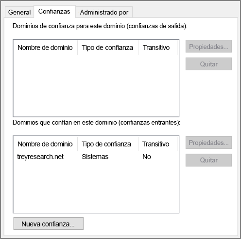

# <a name="create-an-active-directory-domain-services-ad-ds-resource-forest-in-azure"></a><span data-ttu-id="c800c-104">Creación de un bosque de recursos de Active Directory Domain Services (AD DS) en Azure</span><span class="sxs-lookup"><span data-stu-id="c800c-104">Create an Active Directory Domain Services (AD DS) resource forest in Azure</span></span>

<span data-ttu-id="c800c-105">Esta arquitectura de referencia muestra cómo crear un dominio de Active Directory independiente en Azure en el que confíen los dominios del bosque de AD local.</span><span class="sxs-lookup"><span data-stu-id="c800c-105">This reference architecture shows how to create a separate Active Directory domain in Azure that is trusted by domains in your on-premises AD forest.</span></span> [<span data-ttu-id="c800c-106">**Implemente esta solución**.</span><span class="sxs-lookup"><span data-stu-id="c800c-106">**Deploy this solution**.</span></span>](#deploy-the-solution)

<span data-ttu-id="c800c-107">[![0]][0]</span><span class="sxs-lookup"><span data-stu-id="c800c-107">[![0]][0]</span></span> 

<span data-ttu-id="c800c-108">*Descargue un [archivo Visio][visio-download] de esta arquitectura.*</span><span class="sxs-lookup"><span data-stu-id="c800c-108">*Download a [Visio file][visio-download] of this architecture.*</span></span>

<span data-ttu-id="c800c-109">Active Directory Domain Services (AD DS) almacena información de identidad en una estructura jerárquica.</span><span class="sxs-lookup"><span data-stu-id="c800c-109">Active Directory Domain Services (AD DS) stores identity information in a hierarchical structure.</span></span> <span data-ttu-id="c800c-110">El nodo superior de la estructura jerárquica se conoce como bosque.</span><span class="sxs-lookup"><span data-stu-id="c800c-110">The top node in the hierarchical structure is known as a forest.</span></span> <span data-ttu-id="c800c-111">Un bosque contiene dominios y los dominios contienen otros tipos de objetos.</span><span class="sxs-lookup"><span data-stu-id="c800c-111">A forest contains domains, and domains contain other types of objects.</span></span> <span data-ttu-id="c800c-112">Esta arquitectura de referencia crea un bosque de AD DS en Azure con una relación de confianza saliente unidireccional con un dominio local.</span><span class="sxs-lookup"><span data-stu-id="c800c-112">This reference architecture creates an AD DS forest in Azure with a one-way outgoing trust relationship with an on-premises domain.</span></span> <span data-ttu-id="c800c-113">El bosque en Azure contiene un dominio que no existe en el entorno local.</span><span class="sxs-lookup"><span data-stu-id="c800c-113">The forest in Azure contains a domain that does not exist on-premises.</span></span> <span data-ttu-id="c800c-114">Debido a la relación de confianza, se puede confiar en los inicios de sesión realizados en los dominios locales para acceder a los recursos del dominio de Azure independiente.</span><span class="sxs-lookup"><span data-stu-id="c800c-114">Because of the trust relationship, logons made against on-premises domains can be trusted for access to resources in the separate Azure domain.</span></span> 

<span data-ttu-id="c800c-115">Los usos habituales de esta arquitectura incluyen el mantenimiento de la separación de seguridad de objetos e identidades mantenida en la nube y la migración de dominios individuales del entorno local a la nube.</span><span class="sxs-lookup"><span data-stu-id="c800c-115">Typical uses for this architecture include maintaining security separation for objects and identities held in the cloud, and migrating individual domains from on-premises to the cloud.</span></span> 

<span data-ttu-id="c800c-116">Para consideraciones adicionales, consulte [Selección de una solución para la integración de Active Directory local con Azure][considerations].</span><span class="sxs-lookup"><span data-stu-id="c800c-116">For additional considerations, see [Choose a solution for integrating on-premises Active Directory with Azure][considerations].</span></span> 

## <a name="architecture"></a><span data-ttu-id="c800c-117">Arquitectura</span><span class="sxs-lookup"><span data-stu-id="c800c-117">Architecture</span></span>

<span data-ttu-id="c800c-118">La arquitectura tiene los siguientes componentes.</span><span class="sxs-lookup"><span data-stu-id="c800c-118">The architecture has the following components.</span></span>

* <span data-ttu-id="c800c-119">**Red local**</span><span class="sxs-lookup"><span data-stu-id="c800c-119">**On-premises network**.</span></span> <span data-ttu-id="c800c-120">La red local contiene su propio bosque y dominios de Active Directory.</span><span class="sxs-lookup"><span data-stu-id="c800c-120">The on-premises network contains its own Active Directory forest and domains.</span></span>
* <span data-ttu-id="c800c-121">**Servidores de Active Directory**.</span><span class="sxs-lookup"><span data-stu-id="c800c-121">**Active Directory servers**.</span></span> <span data-ttu-id="c800c-122">Son controladores de dominio que implementan servicios de dominio que se ejecutan como máquinas virtuales en la nube.</span><span class="sxs-lookup"><span data-stu-id="c800c-122">These are domain controllers implementing domain services running as VMs in the cloud.</span></span> <span data-ttu-id="c800c-123">Estos servidores hospedan un bosque que contiene uno o varios dominios, que están separados de aquellos ubicados en el entorno local.</span><span class="sxs-lookup"><span data-stu-id="c800c-123">These servers host a forest containing one or more domains, separate from those located on-premises.</span></span>
* <span data-ttu-id="c800c-124">**Relación de confianza unidireccional**.</span><span class="sxs-lookup"><span data-stu-id="c800c-124">**One-way trust relationship**.</span></span> <span data-ttu-id="c800c-125">El ejemplo del diagrama muestra una confianza unidireccional entre el dominio de Azure y el dominio local.</span><span class="sxs-lookup"><span data-stu-id="c800c-125">The example in the diagram shows a one-way trust from the domain in Azure to the on-premises domain.</span></span> <span data-ttu-id="c800c-126">Esta relación permite que los usuarios locales accedan a los recursos que hay en el dominio de Azure, pero no al revés.</span><span class="sxs-lookup"><span data-stu-id="c800c-126">This relationship enables on-premises users to access resources in the domain in Azure, but not the other way around.</span></span> <span data-ttu-id="c800c-127">Es posible crear una confianza bidireccional si los usuarios de la nube también necesitan acceso a los recursos locales.</span><span class="sxs-lookup"><span data-stu-id="c800c-127">It is possible to create a two-way trust if cloud users also require access to on-premises resources.</span></span>
* <span data-ttu-id="c800c-128">**Subred de Active Directory**.</span><span class="sxs-lookup"><span data-stu-id="c800c-128">**Active Directory subnet**.</span></span> <span data-ttu-id="c800c-129">Los servidores de AD DS se hospedan en una subred independiente.</span><span class="sxs-lookup"><span data-stu-id="c800c-129">The AD DS servers are hosted in a separate subnet.</span></span> <span data-ttu-id="c800c-130">Las reglas de grupo de seguridad de red (NSG) protegen los servidores de AD DS y proporcionan un firewall contra el tráfico de orígenes inesperados.</span><span class="sxs-lookup"><span data-stu-id="c800c-130">Network security group (NSG) rules protect the AD DS servers and provide a firewall against traffic from unexpected sources.</span></span>
* <span data-ttu-id="c800c-131">**Puerta de enlace de Azure**.</span><span class="sxs-lookup"><span data-stu-id="c800c-131">**Azure gateway**.</span></span> <span data-ttu-id="c800c-132">La puerta de enlace de Azure proporciona una conexión entre la red local y la red virtual de Azure.</span><span class="sxs-lookup"><span data-stu-id="c800c-132">The Azure gateway provides a connection between the on-premises network and the Azure VNet.</span></span> <span data-ttu-id="c800c-133">Puede ser una [conexión VPN] [ azure-vpn-gateway] o de [Azure ExpressRoute][azure-expressroute].</span><span class="sxs-lookup"><span data-stu-id="c800c-133">This can be a [VPN connection][azure-vpn-gateway] or [Azure ExpressRoute][azure-expressroute].</span></span> <span data-ttu-id="c800c-134">Para más información, consulte [Implementación de una arquitectura de red híbrida segura en Azure][implementing-a-secure-hybrid-network-architecture].</span><span class="sxs-lookup"><span data-stu-id="c800c-134">For more information, see [Implementing a secure hybrid network architecture in Azure][implementing-a-secure-hybrid-network-architecture].</span></span>

## <a name="recommendations"></a><span data-ttu-id="c800c-135">Recomendaciones</span><span class="sxs-lookup"><span data-stu-id="c800c-135">Recommendations</span></span>

<span data-ttu-id="c800c-136">Si necesita recomendaciones específicas sobre cómo implementar Active Directory en Azure, consulte los siguientes artículos:</span><span class="sxs-lookup"><span data-stu-id="c800c-136">For specific recommendations on implementing Active Directory in Azure, see the following articles:</span></span>

- <span data-ttu-id="c800c-137">[Extending Active Directory Domain Services (AD DS) to Azure][adds-extend-domain] (Extensión de Active Directory Domain Services (AD DS) a Azure).</span><span class="sxs-lookup"><span data-stu-id="c800c-137">[Extending Active Directory Domain Services (AD DS) to Azure][adds-extend-domain].</span></span> 
- <span data-ttu-id="c800c-138">[Directrices para implementar Windows Server Active Directory en Azure Virtual Machines][ad-azure-guidelines].</span><span class="sxs-lookup"><span data-stu-id="c800c-138">[Guidelines for Deploying Windows Server Active Directory on Azure Virtual Machines][ad-azure-guidelines].</span></span>

### <a name="trust"></a><span data-ttu-id="c800c-139">Trust</span><span class="sxs-lookup"><span data-stu-id="c800c-139">Trust</span></span>

<span data-ttu-id="c800c-140">Los dominios locales están dentro de un bosque diferente de los dominios en la nube.</span><span class="sxs-lookup"><span data-stu-id="c800c-140">The on-premises domains are contained within a different forest from the domains in the cloud.</span></span> <span data-ttu-id="c800c-141">Para permitir la autenticación de usuarios locales en la nube, los dominios de Azure deben confiar en el dominio de inicio de sesión del bosque local.</span><span class="sxs-lookup"><span data-stu-id="c800c-141">To enable authentication of on-premises users in the cloud, the domains in Azure must trust the logon domain in the on-premises forest.</span></span> <span data-ttu-id="c800c-142">De forma similar, si la nube proporciona un dominio de inicio de sesión para los usuarios externos, puede ser necesario que el bosque local confíe en el dominio en la nube.</span><span class="sxs-lookup"><span data-stu-id="c800c-142">Similarly, if the cloud provides a logon domain for external users, it may be necessary for the on-premises forest to trust the cloud domain.</span></span>

<span data-ttu-id="c800c-143">Puede establecer relaciones de confianza en el nivel de bosque mediante la [creación de confianzas de bosque][creating-forest-trusts], o en el nivel de dominio mediante la [creación de confianzas externas][creating-external-trusts].</span><span class="sxs-lookup"><span data-stu-id="c800c-143">You can establish trusts at the forest level by [creating forest trusts][creating-forest-trusts], or at the domain level by [creating external trusts][creating-external-trusts].</span></span> <span data-ttu-id="c800c-144">Una nivel de confianza de bosque crea una relación entre todos los dominios de los dos bosques.</span><span class="sxs-lookup"><span data-stu-id="c800c-144">A forest level trust creates a relationship between all domains in two forests.</span></span> <span data-ttu-id="c800c-145">Una confianza de nivel de dominio externo solo crea una relación entre dos dominios especificados.</span><span class="sxs-lookup"><span data-stu-id="c800c-145">An external domain level trust only creates a relationship between two specified domains.</span></span> <span data-ttu-id="c800c-146">Solo se deben crear confianzas de nivel de dominio externo entre dominios de diferentes bosques.</span><span class="sxs-lookup"><span data-stu-id="c800c-146">You should only create external domain level trusts between domains in different forests.</span></span>

<span data-ttu-id="c800c-147">Las relaciones de confianza pueden ser en un solo sentido (unidireccionales) o en ambos sentidos (bidireccionales):</span><span class="sxs-lookup"><span data-stu-id="c800c-147">Trusts can be unidirectional (one-way) or bidirectional (two-way):</span></span>

* <span data-ttu-id="c800c-148">Una confianza unidireccional permite a los usuarios de un dominio o bosque (conocido como el dominio o bosque *entrante* dominio o bosque) acceder a los recursos mantenidos en otro (el dominio o bosque *saliente*).</span><span class="sxs-lookup"><span data-stu-id="c800c-148">A one-way trust enables users in one domain or forest (known as the *incoming* domain or forest) to access the resources held in another (the *outgoing* domain or forest).</span></span>
* <span data-ttu-id="c800c-149">Una confianza bidireccional permite a los usuarios del dominio o bosque acceder a los recursos mantenidos en los otros.</span><span class="sxs-lookup"><span data-stu-id="c800c-149">A two-way trust enables users in either domain or forest to access resources held in the other.</span></span>

<span data-ttu-id="c800c-150">En la tabla siguiente se resumen las configuraciones de confianza para algunos escenarios sencillos:</span><span class="sxs-lookup"><span data-stu-id="c800c-150">The following table summarizes trust configurations for some simple scenarios:</span></span>

| <span data-ttu-id="c800c-151">Escenario</span><span class="sxs-lookup"><span data-stu-id="c800c-151">Scenario</span></span> | <span data-ttu-id="c800c-152">Confianza local</span><span class="sxs-lookup"><span data-stu-id="c800c-152">On-premises trust</span></span> | <span data-ttu-id="c800c-153">Confianza en la nube</span><span class="sxs-lookup"><span data-stu-id="c800c-153">Cloud trust</span></span> |
| --- | --- | --- |
| <span data-ttu-id="c800c-154">Los usuarios locales necesitan acceso a los recursos de la nube, pero no al revés.</span><span class="sxs-lookup"><span data-stu-id="c800c-154">On-premises users require access to resources in the cloud, but not vice versa</span></span> |<span data-ttu-id="c800c-155">Unidireccional, entrante</span><span class="sxs-lookup"><span data-stu-id="c800c-155">One-way, incoming</span></span> |<span data-ttu-id="c800c-156">Unidireccional, saliente</span><span class="sxs-lookup"><span data-stu-id="c800c-156">One-way, outgoing</span></span> |
| <span data-ttu-id="c800c-157">Los usuarios de la nube necesitan acceso a los recursos ubicados en el entorno local, pero no al revés.</span><span class="sxs-lookup"><span data-stu-id="c800c-157">Users in the cloud require access to resources located on-premises, but not vice versa</span></span> |<span data-ttu-id="c800c-158">Unidireccional, saliente</span><span class="sxs-lookup"><span data-stu-id="c800c-158">One-way, outgoing</span></span> |<span data-ttu-id="c800c-159">Unidireccional, entrante</span><span class="sxs-lookup"><span data-stu-id="c800c-159">One-way, incoming</span></span> |
| <span data-ttu-id="c800c-160">Los usuarios de la nube y locales necesitan acceso a los recursos mantenidos en la nube y locales.</span><span class="sxs-lookup"><span data-stu-id="c800c-160">Users in the cloud and on-premises both requires access to resources held in the cloud and on-premises</span></span> |<span data-ttu-id="c800c-161">Bidireccional, entrante y saliente</span><span class="sxs-lookup"><span data-stu-id="c800c-161">Two-way, incoming and outgoing</span></span> |<span data-ttu-id="c800c-162">Bidireccional, entrante y saliente</span><span class="sxs-lookup"><span data-stu-id="c800c-162">Two-way, incoming and outgoing</span></span> |

## <a name="scalability-considerations"></a><span data-ttu-id="c800c-163">Consideraciones sobre escalabilidad</span><span class="sxs-lookup"><span data-stu-id="c800c-163">Scalability considerations</span></span>

<span data-ttu-id="c800c-164">Active Directory es escalable automáticamente para los controladores de dominio que forman parte del mismo dominio.</span><span class="sxs-lookup"><span data-stu-id="c800c-164">Active Directory is automatically scalable for domain controllers that are part of the same domain.</span></span> <span data-ttu-id="c800c-165">Las solicitudes se distribuyen entre todos los controladores de un dominio.</span><span class="sxs-lookup"><span data-stu-id="c800c-165">Requests are distributed across all controllers within a domain.</span></span> <span data-ttu-id="c800c-166">Si agrega otro controlador de dominio, este se sincroniza automáticamente con el dominio.</span><span class="sxs-lookup"><span data-stu-id="c800c-166">You can add another domain controller, and it synchronizes automatically with the domain.</span></span> <span data-ttu-id="c800c-167">No configure un equilibrador de carga independiente para dirigir el tráfico a los controladores dentro del dominio.</span><span class="sxs-lookup"><span data-stu-id="c800c-167">Do not configure a separate load balancer to direct traffic to controllers within the domain.</span></span> <span data-ttu-id="c800c-168">Asegúrese de que todos los controladores de dominio tengan suficientes recursos de memoria y almacenamiento para administrar la base de datos de dominio.</span><span class="sxs-lookup"><span data-stu-id="c800c-168">Ensure that all domain controllers have sufficient memory and storage resources to handle the domain database.</span></span> <span data-ttu-id="c800c-169">Iguale el tamaño de todas las máquinas virtuales de controlador de dominio.</span><span class="sxs-lookup"><span data-stu-id="c800c-169">Make all domain controller VMs the same size.</span></span>

## <a name="availability-considerations"></a><span data-ttu-id="c800c-170">Consideraciones sobre disponibilidad</span><span class="sxs-lookup"><span data-stu-id="c800c-170">Availability considerations</span></span>

<span data-ttu-id="c800c-171">Aprovisione al menos dos controladores de dominio para cada dominio.</span><span class="sxs-lookup"><span data-stu-id="c800c-171">Provision at least two domain controllers for each domain.</span></span> <span data-ttu-id="c800c-172">Esto permite la replicación automática entre servidores.</span><span class="sxs-lookup"><span data-stu-id="c800c-172">This enables automatic replication between servers.</span></span> <span data-ttu-id="c800c-173">Cree un conjunto de disponibilidad para las máquinas virtuales que actúan como servidores de Active Directory que administran cada dominio.</span><span class="sxs-lookup"><span data-stu-id="c800c-173">Create an availability set for the VMs acting as Active Directory servers handling each domain.</span></span> <span data-ttu-id="c800c-174">Coloque al menos dos servidores en este conjunto de disponibilidad.</span><span class="sxs-lookup"><span data-stu-id="c800c-174">Put at least two servers in this availability set.</span></span>

<span data-ttu-id="c800c-175">Además, considere la posibilidad de designar uno o más servidores de cada dominio como [maestro de operaciones en espera][standby-operations-masters] para los casos en que se produzca un error de conectividad a un servidor que actúa con el rol de operación de maestro único flexible (FSMO).</span><span class="sxs-lookup"><span data-stu-id="c800c-175">Also, consider designating one or more servers in each domain as [standby operations masters][standby-operations-masters] in case connectivity to a server acting as a flexible single master operation (FSMO) role fails.</span></span>

## <a name="manageability-considerations"></a><span data-ttu-id="c800c-176">Consideraciones sobre la manejabilidad</span><span class="sxs-lookup"><span data-stu-id="c800c-176">Manageability considerations</span></span>

<span data-ttu-id="c800c-177">Para conocer las consideraciones sobre administración y supervisión, consulte [Extensión de Active Directory a Azure][adds-extend-domain].</span><span class="sxs-lookup"><span data-stu-id="c800c-177">For information about management and monitoring considerations, see [Extending Active Directory to Azure][adds-extend-domain].</span></span> 
 
<span data-ttu-id="c800c-178">Para más información, consulte [Supervisión de Active Directory][monitoring_ad].</span><span class="sxs-lookup"><span data-stu-id="c800c-178">For additional information, see [Monitoring Active Directory][monitoring_ad].</span></span> <span data-ttu-id="c800c-179">Puede instalar herramientas como [Microsoft Systems Center][microsoft_systems_center] en un servidor de supervisión en la subred de administración para ayudar a realizar estas tareas.</span><span class="sxs-lookup"><span data-stu-id="c800c-179">You can install tools such as [Microsoft Systems Center][microsoft_systems_center] on a monitoring server in the management subnet to help perform these tasks.</span></span>

## <a name="security-considerations"></a><span data-ttu-id="c800c-180">Consideraciones sobre la seguridad</span><span class="sxs-lookup"><span data-stu-id="c800c-180">Security considerations</span></span>

<span data-ttu-id="c800c-181">Las confianzas de nivel de bosque son transitivas.</span><span class="sxs-lookup"><span data-stu-id="c800c-181">Forest level trusts are transitive.</span></span> <span data-ttu-id="c800c-182">Si establece una confianza de nivel de bosque entre un bosque local y un bosque en la nube, esta confianza se extiende a otros dominios nuevos creados en cualquiera de los bosques.</span><span class="sxs-lookup"><span data-stu-id="c800c-182">If you establish a forest level trust between an on-premises forest and a forest in the cloud, this trust is extended to other new domains created in either forest.</span></span> <span data-ttu-id="c800c-183">Si usa dominios para proporcionar separación por motivos de seguridad, considere la posibilidad de crear confianzas solo en el nivel de dominio.</span><span class="sxs-lookup"><span data-stu-id="c800c-183">If you use domains to provide separation for security purposes, consider creating trusts at the domain level only.</span></span> <span data-ttu-id="c800c-184">Las confianzas de nivel de dominio son no transitivas.</span><span class="sxs-lookup"><span data-stu-id="c800c-184">Domain level trusts are non-transitive.</span></span>

<span data-ttu-id="c800c-185">Para conocer las consideraciones sobre seguridad específicas de Active Directory, consulte la sección [Extensión de Active Directory a Azure][adds-extend-domain].</span><span class="sxs-lookup"><span data-stu-id="c800c-185">For Active Directory-specific security considerations, see the security considerations section in [Extending Active Directory to Azure][adds-extend-domain].</span></span>

## <a name="deploy-the-solution"></a><span data-ttu-id="c800c-186">Implementación de la solución</span><span class="sxs-lookup"><span data-stu-id="c800c-186">Deploy the solution</span></span>

<span data-ttu-id="c800c-187">Hay disponible una implementación de esta arquitectura en [GitHub][github].</span><span class="sxs-lookup"><span data-stu-id="c800c-187">A deployment for this architecture is available on [GitHub][github].</span></span> <span data-ttu-id="c800c-188">Tenga en cuenta que la implementación completa puede tardar hasta dos horas, lo que incluye la creación de una instancia de VPN Gateway y ejecutar los scripts que configuran AD DS.</span><span class="sxs-lookup"><span data-stu-id="c800c-188">Note that the entire deployment can take up to two hours, which includes creating the VPN gateway and running the scripts that configure AD DS.</span></span>

### <a name="prerequisites"></a><span data-ttu-id="c800c-189">Requisitos previos</span><span class="sxs-lookup"><span data-stu-id="c800c-189">Prerequisites</span></span>

[!INCLUDE [ref-arch-prerequisites.md](../../../includes/ref-arch-prerequisites.md)]

### <a name="deploy-the-simulated-on-premises-datacenter"></a><span data-ttu-id="c800c-190">Implementación del centro de datos local simulado</span><span class="sxs-lookup"><span data-stu-id="c800c-190">Deploy the simulated on-premises datacenter</span></span>

1. <span data-ttu-id="c800c-191">Vaya a la carpeta `identity/adds-forest` del repositorio de GitHub.</span><span class="sxs-lookup"><span data-stu-id="c800c-191">Navigate to the `identity/adds-forest` folder of the GitHub repository.</span></span>

2. <span data-ttu-id="c800c-192">Abra el archivo `onprem.json` .</span><span class="sxs-lookup"><span data-stu-id="c800c-192">Open the `onprem.json` file.</span></span> <span data-ttu-id="c800c-193">Busque instancias de `adminPassword` y `Password` y agregue valores para las contraseñas.</span><span class="sxs-lookup"><span data-stu-id="c800c-193">Search for instances of `adminPassword` and `Password` and add values for the passwords.</span></span>

3. <span data-ttu-id="c800c-194">Ejecute el siguiente comando y espere a que finalice la implementación:</span><span class="sxs-lookup"><span data-stu-id="c800c-194">Run the following command and wait for the deployment to finish:</span></span>

    ```bash
    azbb -s <subscription_id> -g <resource group> -l <location> -p onprem.json --deploy
    ```

### <a name="deploy-the-azure-vnet"></a><span data-ttu-id="c800c-195">Implementación de la red virtual de Azure</span><span class="sxs-lookup"><span data-stu-id="c800c-195">Deploy the Azure VNet</span></span>

1. <span data-ttu-id="c800c-196">Abra el archivo `azure.json` .</span><span class="sxs-lookup"><span data-stu-id="c800c-196">Open the `azure.json` file.</span></span> <span data-ttu-id="c800c-197">Busque instancias de `adminPassword` y `Password` y agregue valores para las contraseñas.</span><span class="sxs-lookup"><span data-stu-id="c800c-197">Search for instances of `adminPassword` and `Password` and add values for the passwords.</span></span>

2. <span data-ttu-id="c800c-198">En el mismo archivo, busque instancias de `sharedKey` y escriba las claves compartidas de la conexión VPN.</span><span class="sxs-lookup"><span data-stu-id="c800c-198">In the same file, search for instances of `sharedKey` and enter shared keys for the VPN connection.</span></span> 

    ```bash
    "sharedKey": "",
    ```

3. <span data-ttu-id="c800c-199">Ejecute el siguiente comando y espere a que finalice la implementación.</span><span class="sxs-lookup"><span data-stu-id="c800c-199">Run the following command and wait for the deployment to finish.</span></span>

    ```bash
    azbb -s <subscription_id> -g <resource group> -l <location> -p onoprem.json --deploy
    ```

   <span data-ttu-id="c800c-200">Realice la implementación en el mismo grupo de recursos que la red virtual local.</span><span class="sxs-lookup"><span data-stu-id="c800c-200">Deploy to the same resource group as the on-premises VNet.</span></span>


### <a name="test-the-ad-trust-relation"></a><span data-ttu-id="c800c-201">Comprobación de la relación de confianza de AD</span><span class="sxs-lookup"><span data-stu-id="c800c-201">Test the AD trust relation</span></span>

1. <span data-ttu-id="c800c-202">Use Azure Portal y vaya al grupo de recursos que ha creado.</span><span class="sxs-lookup"><span data-stu-id="c800c-202">Use the Azure portal, navigate to the resource group that you created.</span></span>

2. <span data-ttu-id="c800c-203">Para la máquina virtual denominada `ra-adt-mgmt-vm1` use Azure Portal.</span><span class="sxs-lookup"><span data-stu-id="c800c-203">Use the Azure portal to find the VM named `ra-adt-mgmt-vm1`.</span></span>

2. <span data-ttu-id="c800c-204">Haga clic en `Connect` para abrir una sesión de escritorio remoto en la máquina virtual.</span><span class="sxs-lookup"><span data-stu-id="c800c-204">Click `Connect` to open a remote desktop session to the VM.</span></span> <span data-ttu-id="c800c-205">El nombre de usuario es `contoso\testuser` y la contraseña es la que especificó en el archivo de parámetros `onprem.json`.</span><span class="sxs-lookup"><span data-stu-id="c800c-205">The username is `contoso\testuser`, and the password is the one that you specified in the `onprem.json` parameter file.</span></span>

3. <span data-ttu-id="c800c-206">Desde dentro de la sesión de escritorio remoto, abra otra sesión de escritorio remoto en 192.168.0.4, que es la dirección IP de la máquina virtual denominada `ra-adtrust-onpremise-ad-vm1`.</span><span class="sxs-lookup"><span data-stu-id="c800c-206">From inside your remote desktop session, open another remote desktop session to 192.168.0.4, which is the IP address of the VM named `ra-adtrust-onpremise-ad-vm1`.</span></span> <span data-ttu-id="c800c-207">El nombre de usuario es `contoso\testuser` y la contraseña es la que especificó en el archivo de parámetros `azure.json`.</span><span class="sxs-lookup"><span data-stu-id="c800c-207">The username is `contoso\testuser`, and the password is the one that you specified in the `azure.json` parameter file.</span></span>

4. <span data-ttu-id="c800c-208">Desde dentro de la sesión de escritorio remoto para `ra-adtrust-onpremise-ad-vm1`, vaya al **administrador del servidor** y haga clic en **Herramientas** > **Dominios y confianzas de Active Directory**.</span><span class="sxs-lookup"><span data-stu-id="c800c-208">From inside the remote desktop session for `ra-adtrust-onpremise-ad-vm1`, go to **Server Manager** and click **Tools** > **Active Directory Domains and Trusts**.</span></span> 

5. <span data-ttu-id="c800c-209">En el panel izquierdo, haga clic con el botón derecho en contoso.com y seleccione **Propiedades**.</span><span class="sxs-lookup"><span data-stu-id="c800c-209">In the left pane, right-click on the contoso.com and select **Properties**.</span></span>

6. <span data-ttu-id="c800c-210">Haga clic en la pestaña **Trusts** (Confianzas). Debería ver que treyresearch.net aparece como una confianza entrante.</span><span class="sxs-lookup"><span data-stu-id="c800c-210">Click the **Trusts** tab. You should see treyresearch.net listed as an incoming trust.</span></span>




## <a name="next-steps"></a><span data-ttu-id="c800c-211">Pasos siguientes</span><span class="sxs-lookup"><span data-stu-id="c800c-211">Next steps</span></span>

* <span data-ttu-id="c800c-212">Conozca los procedimientos recomendados para [extender el dominio de AD DS local a Azure][adds-extend-domain]</span><span class="sxs-lookup"><span data-stu-id="c800c-212">Learn the best practices for [extending your on-premises AD DS domain to Azure][adds-extend-domain]</span></span>
* <span data-ttu-id="c800c-213">Conozca los procedimientos recomendados para [crear una infraestructura de AD FS][adfs] en Azure.</span><span class="sxs-lookup"><span data-stu-id="c800c-213">Learn the best practices for [creating an AD FS infrastructure][adfs] in Azure.</span></span>

<!-- links -->
[adds-extend-domain]: adds-extend-domain.md
[adfs]: adfs.md
[azure-cli-2]: /azure/install-azure-cli
[azbb]: https://github.com/mspnp/template-building-blocks/wiki/Install-Azure-Building-Blocks

[implementing-a-secure-hybrid-network-architecture]: ../dmz/secure-vnet-hybrid.md
[implementing-a-secure-hybrid-network-architecture-with-internet-access]: ../dmz/secure-vnet-dmz.md

[running-VMs-for-an-N-tier-architecture-on-Azure]: ../virtual-machines-windows/n-tier.md

[ad-azure-guidelines]: https://msdn.microsoft.com/library/azure/jj156090.aspx
[azure-expressroute]: https://azure.microsoft.com/documentation/articles/expressroute-introduction/
[azure-vpn-gateway]: https://azure.microsoft.com/documentation/articles/vpn-gateway-about-vpngateways/
[considerations]: ./considerations.md
[creating-external-trusts]: https://technet.microsoft.com/library/cc816837(v=ws.10).aspx
[creating-forest-trusts]: https://technet.microsoft.com/library/cc816810(v=ws.10).aspx
[github]: https://github.com/mspnp/identity-reference-architectures/tree/master/adds-forest
[incoming-trust]: https://raw.githubusercontent.com/mspnp/identity-reference-architectures/master/adds-forest/extensions/incoming-trust.ps1
[microsoft_systems_center]: https://microsoft.com/cloud-platform/system-center
[monitoring_ad]: https://msdn.microsoft.com/library/bb727046.aspx
[resource-manager-overview]: /azure/azure-resource-manager/resource-group-overview
[solution-script]: https://raw.githubusercontent.com/mspnp/identity-reference-architectures/master/adds-forest/Deploy-ReferenceArchitecture.ps1
[standby-operations-masters]: https://technet.microsoft.com/library/cc794737(v=ws.10).aspx
[outgoing-trust]: https://raw.githubusercontent.com/mspnp/identity-reference-architectures/master/adds-forest/extensions/outgoing-trust.ps1
[verify-a-trust]: https://technet.microsoft.com/library/cc753821.aspx
[visio-download]: https://archcenter.blob.core.windows.net/cdn/identity-architectures.vsdx
[0]: ./images/adds-forest.png "Protección de la arquitectura de red híbrida con dominios independientes de Active Directory"
