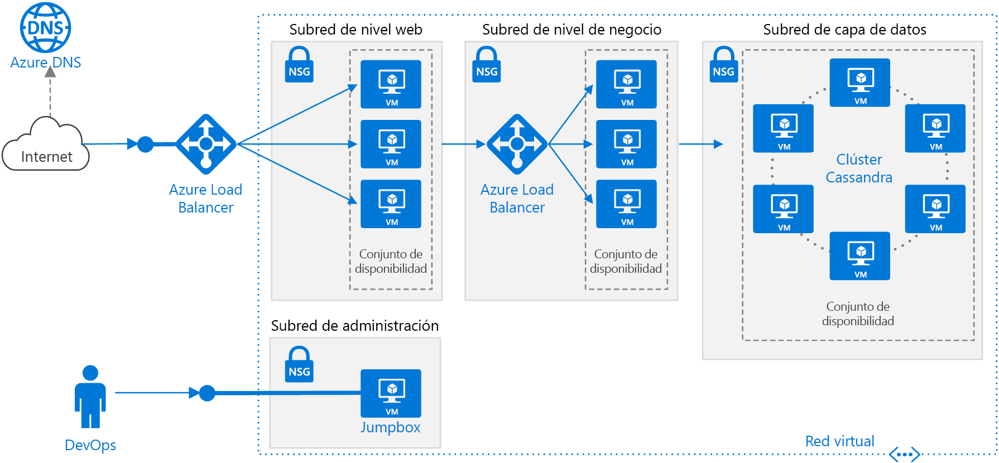

# <a name="linux-n-tier-application-in-azure-with-apache-cassandra"></a><span data-ttu-id="bc9a7-103">Aplicación Linux de n niveles en Azure con Apache Cassandra</span><span class="sxs-lookup"><span data-stu-id="bc9a7-103">Linux N-tier application in Azure with Apache Cassandra</span></span>

<span data-ttu-id="bc9a7-104">Esta arquitectura de referencia muestra cómo implementar máquinas virtuales (VM) y una red virtual configurada para una aplicación de n niveles, con Apache Cassandra en Linux para la capa de datos.</span><span class="sxs-lookup"><span data-stu-id="bc9a7-104">This reference architecture shows how to deploy virtual machines (VMs) and a virtual network configured for an N-tier application, using Apache Cassandra on Linux for the data tier.</span></span> <span data-ttu-id="bc9a7-105">[**Implemente esta solución**](#deploy-the-solution).</span><span class="sxs-lookup"><span data-stu-id="bc9a7-105">[**Deploy this solution**](#deploy-the-solution).</span></span>



<span data-ttu-id="bc9a7-107">*Descargue un [archivo Visio][visio-download] de esta arquitectura.*</span><span class="sxs-lookup"><span data-stu-id="bc9a7-107">*Download a [Visio file][visio-download] of this architecture.*</span></span>

## <a name="architecture"></a><span data-ttu-id="bc9a7-108">Arquitectura</span><span class="sxs-lookup"><span data-stu-id="bc9a7-108">Architecture</span></span>

<span data-ttu-id="bc9a7-109">La arquitectura consta de los siguientes componentes:</span><span class="sxs-lookup"><span data-stu-id="bc9a7-109">The architecture has the following components:</span></span>

- <span data-ttu-id="bc9a7-110">**Grupo de recursos**.</span><span class="sxs-lookup"><span data-stu-id="bc9a7-110">**Resource group**.</span></span> <span data-ttu-id="bc9a7-111">Los [grupos de recursos][resource-manager-overview] se utilizan para agrupar los recursos, para que puedan administrarse según su duración, su propietario u otros criterios.</span><span class="sxs-lookup"><span data-stu-id="bc9a7-111">[Resource groups][resource-manager-overview] are used to group resources so they can be managed by lifetime, owner, or other criteria.</span></span>

- <span data-ttu-id="bc9a7-112">**Red virtual (VNet) y subredes**.</span><span class="sxs-lookup"><span data-stu-id="bc9a7-112">**Virtual network (VNet) and subnets**.</span></span> <span data-ttu-id="bc9a7-113">Cada máquina virtual de Azure se implementa en una red virtual que se puede dividir en subredes.</span><span class="sxs-lookup"><span data-stu-id="bc9a7-113">Every Azure VM is deployed into a VNet that can be segmented into subnets.</span></span> <span data-ttu-id="bc9a7-114">Cree una subred independiente para cada nivel.</span><span class="sxs-lookup"><span data-stu-id="bc9a7-114">Create a separate subnet for each tier.</span></span>

- <span data-ttu-id="bc9a7-115">**NSG**.</span><span class="sxs-lookup"><span data-stu-id="bc9a7-115">**NSGs**.</span></span> <span data-ttu-id="bc9a7-116">Use [grupos de seguridad de red][nsg] (NSG) para restringir el tráfico de red dentro de la red virtual.</span><span class="sxs-lookup"><span data-stu-id="bc9a7-116">Use [network security groups][nsg] (NSGs) to restrict network traffic within the VNet.</span></span> <span data-ttu-id="bc9a7-117">Por ejemplo, en la arquitectura de tres niveles que se muestra aquí, el nivel de base de datos acepta tráfico del nivel de empresa y la subred de administración, pero no desde el front-end web.</span><span class="sxs-lookup"><span data-stu-id="bc9a7-117">For example, in the three-tier architecture shown here, the database tier accepts traffic from the business tier and the management subnet, but not the web front end.</span></span>

- <span data-ttu-id="bc9a7-118">**Protección contra DDoS**.</span><span class="sxs-lookup"><span data-stu-id="bc9a7-118">**DDoS Protection**.</span></span> <span data-ttu-id="bc9a7-119">Aunque la plataforma Azure proporciona protección básica contra ataques de denegación de servicio distribuido (DDoS), se recomienda usar el [estándar de protección contra DDoS][ddos], que tiene características de mitigación de DDoS.</span><span class="sxs-lookup"><span data-stu-id="bc9a7-119">Although the Azure platform provides basic protection against distributed denial of service (DDoS) attacks, we recommend using [DDoS Protection Standard][ddos], which has enhanced DDoS mitigation features.</span></span> <span data-ttu-id="bc9a7-120">Consulte [Consideraciones sobre la seguridad](#security-considerations).</span><span class="sxs-lookup"><span data-stu-id="bc9a7-120">See [Security considerations](#security-considerations).</span></span>

- <span data-ttu-id="bc9a7-121">**Máquinas virtuales**.</span><span class="sxs-lookup"><span data-stu-id="bc9a7-121">**Virtual machines**.</span></span> <span data-ttu-id="bc9a7-122">Para obtener recomendaciones sobre la configuración de máquinas virtuales, consulte [Ejecución de una VM con Windows en Azure](./windows-vm.md) y [Ejecución de una VM con Linux en Azure](./linux-vm.md).</span><span class="sxs-lookup"><span data-stu-id="bc9a7-122">For recommendations on configuring VMs, see [Run a Windows VM on Azure](./windows-vm.md) and [Run a Linux VM on Azure](./linux-vm.md).</span></span>

- <span data-ttu-id="bc9a7-123">**Conjuntos de disponibilidad**.</span><span class="sxs-lookup"><span data-stu-id="bc9a7-123">**Availability sets**.</span></span> <span data-ttu-id="bc9a7-124">Cree un [conjunto de disponibilidad][azure-availability-sets] y aprovisione al menos dos máquinas virtuales en cada nivel, que hace que las máquinas virtuales que sean aptas para un [Acuerdo de Nivel de Servicio (SLA)][vm-sla] superior.</span><span class="sxs-lookup"><span data-stu-id="bc9a7-124">Create an [availability set][azure-availability-sets] for each tier, and provision at least two VMs in each tier, which makes the VMs eligible for a higher [service level agreement (SLA)][vm-sla].</span></span>

- <span data-ttu-id="bc9a7-125">**Equilibradores de carga de Azure**.</span><span class="sxs-lookup"><span data-stu-id="bc9a7-125">**Azure load balancers**.</span></span> <span data-ttu-id="bc9a7-126">Los [equilibradores de carga][load-balancer] distribuyen las solicitudes entrantes de Internet a las instancias de máquina virtual.</span><span class="sxs-lookup"><span data-stu-id="bc9a7-126">The [load balancers][load-balancer] distribute incoming Internet requests to the VM instances.</span></span> <span data-ttu-id="bc9a7-127">Use un [equilibrador de carga público][load-balancer-external] para distribuir el tráfico entrante de Internet al nivel Web y un [equilibrador de carga interno][load-balancer-internal] para distribuir el tráfico de red del nivel Web al nivel Business.</span><span class="sxs-lookup"><span data-stu-id="bc9a7-127">Use a [public load balancer][load-balancer-external] to distribute incoming Internet traffic to the web tier, and an [internal load balancer][load-balancer-internal] to distribute network traffic from the web tier to the business tier.</span></span>

- <span data-ttu-id="bc9a7-128">**Dirección IP pública**.</span><span class="sxs-lookup"><span data-stu-id="bc9a7-128">**Public IP address**.</span></span> <span data-ttu-id="bc9a7-129">Se necesita una dirección IP pública para que el equilibrador de carga reciba tráfico de Internet.</span><span class="sxs-lookup"><span data-stu-id="bc9a7-129">A public IP address is needed for the public load balancer to receive Internet traffic.</span></span>

- <span data-ttu-id="bc9a7-130">**JumpBox**.</span><span class="sxs-lookup"><span data-stu-id="bc9a7-130">**Jumpbox**.</span></span> <span data-ttu-id="bc9a7-131">También se denomina [host bastión].</span><span class="sxs-lookup"><span data-stu-id="bc9a7-131">Also called a [bastion host].</span></span> <span data-ttu-id="bc9a7-132">Se trata de una máquina virtual segura en la red que usan los administradores para conectarse al resto de máquinas virtuales.</span><span class="sxs-lookup"><span data-stu-id="bc9a7-132">A secure VM on the network that administrators use to connect to the other VMs.</span></span> <span data-ttu-id="bc9a7-133">El JumpBox tiene un NSG que solo permite el tráfico remoto que procede de direcciones IP públicas de una lista segura.</span><span class="sxs-lookup"><span data-stu-id="bc9a7-133">The jumpbox has an NSG that allows remote traffic only from public IP addresses on a safe list.</span></span> <span data-ttu-id="bc9a7-134">El grupo de seguridad de red debe permitir el tráfico SSH.</span><span class="sxs-lookup"><span data-stu-id="bc9a7-134">The NSG should allow ssh traffic.</span></span>

- <span data-ttu-id="bc9a7-135">**Base de datos Apache Cassandra**.</span><span class="sxs-lookup"><span data-stu-id="bc9a7-135">**Apache Cassandra database**.</span></span> <span data-ttu-id="bc9a7-136">Proporciona alta disponibilidad en el nivel de datos, al habilitar la replicación y la conmutación por error.</span><span class="sxs-lookup"><span data-stu-id="bc9a7-136">Provides high availability at the data tier, by enabling replication and failover.</span></span>

- <span data-ttu-id="bc9a7-137">**Azure DNS**.</span><span class="sxs-lookup"><span data-stu-id="bc9a7-137">**Azure DNS**.</span></span> <span data-ttu-id="bc9a7-138">[Azure DNS][azure-dns] es un servicio de hospedaje para dominios DNS.</span><span class="sxs-lookup"><span data-stu-id="bc9a7-138">[Azure DNS][azure-dns] is a hosting service for DNS domains.</span></span> <span data-ttu-id="bc9a7-139">Proporciona resolución de nombres mediante la infraestructura de Microsoft Azure.</span><span class="sxs-lookup"><span data-stu-id="bc9a7-139">It provides name resolution using Microsoft Azure infrastructure.</span></span> <span data-ttu-id="bc9a7-140">Al hospedar dominios en Azure, puede administrar los registros DNS con las mismas credenciales, API, herramientas y facturación que con los demás servicios de Azure.</span><span class="sxs-lookup"><span data-stu-id="bc9a7-140">By hosting your domains in Azure, you can manage your DNS records using the same credentials, APIs, tools, and billing as your other Azure services.</span></span>

## <a name="recommendations"></a><span data-ttu-id="bc9a7-141">Recomendaciones</span><span class="sxs-lookup"><span data-stu-id="bc9a7-141">Recommendations</span></span>

<span data-ttu-id="bc9a7-142">Los requisitos pueden diferir de los de la arquitectura que se describe aquí.</span><span class="sxs-lookup"><span data-stu-id="bc9a7-142">Your requirements might differ from the architecture described here.</span></span> <span data-ttu-id="bc9a7-143">Use estas recomendaciones como punto inicial.</span><span class="sxs-lookup"><span data-stu-id="bc9a7-143">Use these recommendations as a starting point.</span></span>

### <a name="vnet--subnets"></a><span data-ttu-id="bc9a7-144">Red virtual/subredes</span><span class="sxs-lookup"><span data-stu-id="bc9a7-144">VNet / Subnets</span></span>

<span data-ttu-id="bc9a7-145">Cuando cree la red virtual, determine cuántas direcciones IP requieren los recursos de cada subred.</span><span class="sxs-lookup"><span data-stu-id="bc9a7-145">When you create the VNet, determine how many IP addresses your resources in each subnet require.</span></span> <span data-ttu-id="bc9a7-146">Especifique una máscara de subred y un intervalo de direcciones de la red virtual lo suficientemente grande para la dirección IP requerida con el uso de la notación [CIDR].</span><span class="sxs-lookup"><span data-stu-id="bc9a7-146">Specify a subnet mask and a VNet address range large enough for the required IP addresses, using [CIDR] notation.</span></span> <span data-ttu-id="bc9a7-147">Use un espacio de direcciones que se encuentre dentro de los [bloques de direcciones IP privados][private-ip-space] estándar, que son 10.0.0.0/8, 172.16.0.0/12 y 192.168.0.0/16.</span><span class="sxs-lookup"><span data-stu-id="bc9a7-147">Use an address space that falls within the standard [private IP address blocks][private-ip-space], which are 10.0.0.0/8, 172.16.0.0/12, and 192.168.0.0/16.</span></span>

<span data-ttu-id="bc9a7-148">Si va a necesitar configurar una puerta de enlace entre la red virtual y la red local más adelante, elija un intervalo de direcciones que no se superponga con la red local.</span><span class="sxs-lookup"><span data-stu-id="bc9a7-148">Choose an address range that doesn't overlap with your on-premises network, in case you need to set up a gateway between the VNet and your on-premise network later.</span></span> <span data-ttu-id="bc9a7-149">Una vez creada la red virtual, no se puede cambiar el intervalo de direcciones.</span><span class="sxs-lookup"><span data-stu-id="bc9a7-149">Once you create the VNet, you can't change the address range.</span></span>

<span data-ttu-id="bc9a7-150">Diseñe subredes teniendo en cuenta los requisitos de funcionalidad y seguridad.</span><span class="sxs-lookup"><span data-stu-id="bc9a7-150">Design subnets with functionality and security requirements in mind.</span></span> <span data-ttu-id="bc9a7-151">Todas las máquinas virtuales dentro del mismo nivel o rol deben incluirse en la misma subred, lo que puede servir como un límite de seguridad.</span><span class="sxs-lookup"><span data-stu-id="bc9a7-151">All VMs within the same tier or role should go into the same subnet, which can be a security boundary.</span></span> <span data-ttu-id="bc9a7-152">Para obtener más información sobre el diseño de redes virtuales y subredes, vea [Planeación y diseño de redes virtuales de Azure][plan-network].</span><span class="sxs-lookup"><span data-stu-id="bc9a7-152">For more information about designing VNets and subnets, see [Plan and design Azure Virtual Networks][plan-network].</span></span>

### <a name="load-balancers"></a><span data-ttu-id="bc9a7-153">Equilibradores de carga</span><span class="sxs-lookup"><span data-stu-id="bc9a7-153">Load balancers</span></span>

<span data-ttu-id="bc9a7-154">No exponga las máquinas virtuales directamente a Internet.</span><span class="sxs-lookup"><span data-stu-id="bc9a7-154">Do not expose the VMs directly to the Internet.</span></span> <span data-ttu-id="bc9a7-155">En su lugar, asigne a cada máquina virtual una dirección IP privada.</span><span class="sxs-lookup"><span data-stu-id="bc9a7-155">Instead, give each VM a private IP address.</span></span> <span data-ttu-id="bc9a7-156">Los clientes se conectan con la dirección IP del equilibrador de carga público.</span><span class="sxs-lookup"><span data-stu-id="bc9a7-156">Clients connect using the IP address of the public load balancer.</span></span>

<span data-ttu-id="bc9a7-157">Defina reglas del equilibrador de carga para dirigir el tráfico de red a las máquinas virtuales.</span><span class="sxs-lookup"><span data-stu-id="bc9a7-157">Define load balancer rules to direct network traffic to the VMs.</span></span> <span data-ttu-id="bc9a7-158">Por ejemplo, para habilitar el tráfico HTTP, cree una regla que asigne el puerto 80 de la configuración de front-end al puerto 80 del grupo de direcciones de back-end.</span><span class="sxs-lookup"><span data-stu-id="bc9a7-158">For example, to enable HTTP traffic, create a rule that maps port 80 from the front-end configuration to port 80 on the back-end address pool.</span></span> <span data-ttu-id="bc9a7-159">Cuando un cliente envía una solicitud HTTP al puerto 80, el equilibrador de carga selecciona una dirección IP de back-end mediante un [algoritmo hash][load-balancer-hashing] que incluye la dirección IP de origen.</span><span class="sxs-lookup"><span data-stu-id="bc9a7-159">When a client sends an HTTP request to port 80, the load balancer selects a back-end IP address by using a [hashing algorithm][load-balancer-hashing] that includes the source IP address.</span></span> <span data-ttu-id="bc9a7-160">Las solicitudes del cliente se distribuyen entre todas las máquinas virtuales.</span><span class="sxs-lookup"><span data-stu-id="bc9a7-160">Client requests are distributed across all the VMs.</span></span>

### <a name="network-security-groups"></a><span data-ttu-id="bc9a7-161">Grupos de seguridad de red</span><span class="sxs-lookup"><span data-stu-id="bc9a7-161">Network security groups</span></span>

<span data-ttu-id="bc9a7-162">Use reglas NSG para restringir el tráfico entre los niveles.</span><span class="sxs-lookup"><span data-stu-id="bc9a7-162">Use NSG rules to restrict traffic between tiers.</span></span> <span data-ttu-id="bc9a7-163">Por ejemplo, en la arquitectura de tres niveles mostrada anteriormente, el nivel web no se comunica directamente con el nivel de base de datos.</span><span class="sxs-lookup"><span data-stu-id="bc9a7-163">For example, in the three-tier architecture shown above, the web tier does not communicate directly with the database tier.</span></span> <span data-ttu-id="bc9a7-164">Para exigir esto, el nivel de base de datos debe bloquear el tráfico entrante desde la subred del nivel Web.</span><span class="sxs-lookup"><span data-stu-id="bc9a7-164">To enforce this, the database tier should block incoming traffic from the web tier subnet.</span></span>

1. <span data-ttu-id="bc9a7-165">Deniegue todo el tráfico entrante de la red virtual.</span><span class="sxs-lookup"><span data-stu-id="bc9a7-165">Deny all inbound traffic from the VNet.</span></span> <span data-ttu-id="bc9a7-166">(Use la etiqueta `VIRTUAL_NETWORK` de la regla).</span><span class="sxs-lookup"><span data-stu-id="bc9a7-166">(Use the `VIRTUAL_NETWORK` tag in the rule.)</span></span>
2. <span data-ttu-id="bc9a7-167">Permita el tráfico entrante de la subred del nivel Business.</span><span class="sxs-lookup"><span data-stu-id="bc9a7-167">Allow inbound traffic from the business tier subnet.</span></span>
3. <span data-ttu-id="bc9a7-168">Permita el tráfico entrante de la propia subred del nivel de la base de datos.</span><span class="sxs-lookup"><span data-stu-id="bc9a7-168">Allow inbound traffic from the database tier subnet itself.</span></span> <span data-ttu-id="bc9a7-169">Esta regla permite la comunicación entre las máquinas virtuales de la base de datos, lo cual es necesario para la replicación y la conmutación por error de esta.</span><span class="sxs-lookup"><span data-stu-id="bc9a7-169">This rule allows communication between the database VMs, which is needed for database replication and failover.</span></span>
4. <span data-ttu-id="bc9a7-170">Permita el tráfico SSH (puerto 22) desde la subred de JumpBox.</span><span class="sxs-lookup"><span data-stu-id="bc9a7-170">Allow ssh traffic (port 22) from the jumpbox subnet.</span></span> <span data-ttu-id="bc9a7-171">Esta regla permite a los administradores conectarse al nivel de base de datos desde JumpBox.</span><span class="sxs-lookup"><span data-stu-id="bc9a7-171">This rule lets administrators connect to the database tier from the jumpbox.</span></span>

<span data-ttu-id="bc9a7-172">Cree las reglas 2 &ndash; 4 con una prioridad más alta que la primera regla para que puedan invalidarla.</span><span class="sxs-lookup"><span data-stu-id="bc9a7-172">Create rules 2 &ndash; 4 with higher priority than the first rule, so they override it.</span></span>

### <a name="cassandra"></a><span data-ttu-id="bc9a7-173">Cassandra</span><span class="sxs-lookup"><span data-stu-id="bc9a7-173">Cassandra</span></span>

<span data-ttu-id="bc9a7-174">Se recomienda [DataStax Enterprise][datastax] para usos de producción, pero estas recomendaciones se aplican a cualquier edición de Cassandra.</span><span class="sxs-lookup"><span data-stu-id="bc9a7-174">We recommend [DataStax Enterprise][datastax] for production use, but these recommendations apply to any Cassandra edition.</span></span> <span data-ttu-id="bc9a7-175">Para más información sobre cómo ejecutar DataStax en Azure, consulte [DataStax Enterprise Deployment Guide for Azure][cassandra-in-azure] (Guía de implementación de DataStax Enterprise Deployment para Azure).</span><span class="sxs-lookup"><span data-stu-id="bc9a7-175">For more information on running DataStax in Azure, see [DataStax Enterprise Deployment Guide for Azure][cassandra-in-azure].</span></span>

<span data-ttu-id="bc9a7-176">Coloque las máquinas virtuales de un clúster de Cassandra en un conjunto de disponibilidad para asegurarse de que las réplicas de Cassandra se distribuyen entre varios dominios de error y dominios de actualización.</span><span class="sxs-lookup"><span data-stu-id="bc9a7-176">Put the VMs for a Cassandra cluster in an availability set to ensure that the Cassandra replicas are distributed across multiple fault domains and upgrade domains.</span></span> <span data-ttu-id="bc9a7-177">Para obtener más información sobre los dominios de error y los dominios de actualización, vea [Administración de la disponibilidad de las máquinas virtuales][azure-availability-sets].</span><span class="sxs-lookup"><span data-stu-id="bc9a7-177">For more information about fault domains and upgrade domains, see [Manage the availability of virtual machines][azure-availability-sets].</span></span>

<span data-ttu-id="bc9a7-178">Configure tres dominios de error como máximo por cada conjunto de disponibilidad y dieciocho dominios de actualización por cada conjunto de disponibilidad.</span><span class="sxs-lookup"><span data-stu-id="bc9a7-178">Configure three fault domains (the maximum) per availability set and 18 upgrade domains per availability set.</span></span> <span data-ttu-id="bc9a7-179">Esto proporciona el número máximo de dominios de actualización que todavía se pueden distribuir uniformemente entre los dominios de error.</span><span class="sxs-lookup"><span data-stu-id="bc9a7-179">This provides the maximum number of upgrade domains that can still be distributed evenly across the fault domains.</span></span>

<span data-ttu-id="bc9a7-180">Configure los nodos en el modo de reconocimiento del bastidor.</span><span class="sxs-lookup"><span data-stu-id="bc9a7-180">Configure nodes in rack-aware mode.</span></span> <span data-ttu-id="bc9a7-181">Asigne los dominios de error a los bastidores en el archivo `cassandra-rackdc.properties`.</span><span class="sxs-lookup"><span data-stu-id="bc9a7-181">Map fault domains to racks in the `cassandra-rackdc.properties` file.</span></span>

<span data-ttu-id="bc9a7-182">No se necesita un equilibrador de carga delante del clúster.</span><span class="sxs-lookup"><span data-stu-id="bc9a7-182">You don't need a load balancer in front of the cluster.</span></span> <span data-ttu-id="bc9a7-183">El cliente se conecta directamente a un nodo del clúster.</span><span class="sxs-lookup"><span data-stu-id="bc9a7-183">The client connects directly to a node in the cluster.</span></span>

<span data-ttu-id="bc9a7-184">Para lograr alta disponibilidad, implemente Cassandra en más de una región de Azure.</span><span class="sxs-lookup"><span data-stu-id="bc9a7-184">For high availability, deploy Cassandra in more than one Azure region.</span></span> <span data-ttu-id="bc9a7-185">En cada región, los nodos están configurados en modo compatible con bastidor con dominios de error y actualización para proporcionar resistencia dentro de la región.</span><span class="sxs-lookup"><span data-stu-id="bc9a7-185">Nodes within each region are configured in rack-aware mode with fault and upgrade domains, for resiliency inside the region.</span></span>

### <a name="jumpbox"></a><span data-ttu-id="bc9a7-186">JumpBox</span><span class="sxs-lookup"><span data-stu-id="bc9a7-186">Jumpbox</span></span>

<span data-ttu-id="bc9a7-187">No permita el acceso SSH desde la red pública de Internet a las máquinas virtuales que ejecutan la carga de trabajo de la aplicación.</span><span class="sxs-lookup"><span data-stu-id="bc9a7-187">Don't allow ssh access from the public Internet to the VMs that run the application workload.</span></span> <span data-ttu-id="bc9a7-188">En su lugar, todo el acceso SSH a estas máquinas virtuales debe realizarse a través de JumpBox.</span><span class="sxs-lookup"><span data-stu-id="bc9a7-188">Instead, all ssh access to these VMs must come through the jumpbox.</span></span> <span data-ttu-id="bc9a7-189">Un administrador inicia sesión en JumpBox y, después, en la otra máquina virtual desde JumpBox.</span><span class="sxs-lookup"><span data-stu-id="bc9a7-189">An administrator logs into the jumpbox, and then logs into the other VM from the jumpbox.</span></span> <span data-ttu-id="bc9a7-190">JumpBox permite el tráfico SSH desde Internet, pero solo desde direcciones IP conocidas y seguras.</span><span class="sxs-lookup"><span data-stu-id="bc9a7-190">The jumpbox allows ssh traffic from the Internet, but only from known, safe IP addresses.</span></span>

<span data-ttu-id="bc9a7-191">JumpBox tiene unos requisitos de rendimiento mínimos, por lo que puede seleccionar un pequeño tamaño de máquina virtual.</span><span class="sxs-lookup"><span data-stu-id="bc9a7-191">The jumpbox has minimal performance requirements, so select a small VM size.</span></span> <span data-ttu-id="bc9a7-192">Cree una [dirección IP pública] para JumpBox.</span><span class="sxs-lookup"><span data-stu-id="bc9a7-192">Create a [public IP address] for the jumpbox.</span></span> <span data-ttu-id="bc9a7-193">Coloque JumpBox en la misma red virtual que las demás máquinas virtuales, pero en una subred de administración independiente.</span><span class="sxs-lookup"><span data-stu-id="bc9a7-193">Place the jumpbox in the same VNet as the other VMs, but in a separate management subnet.</span></span>

<span data-ttu-id="bc9a7-194">Para proteger JumpBox, agregue una regla de grupo de seguridad de red que permita las conexiones SSH solo desde un conjunto seguro de direcciones IP públicas.</span><span class="sxs-lookup"><span data-stu-id="bc9a7-194">To secure the jumpbox, add an NSG rule that allows ssh connections only from a safe set of public IP addresses.</span></span> <span data-ttu-id="bc9a7-195">Configure el NSG para las demás subredes, a fin de permitir el tráfico SSH de la subred de administración.</span><span class="sxs-lookup"><span data-stu-id="bc9a7-195">Configure the NSGs for the other subnets to allow ssh traffic from the management subnet.</span></span>

## <a name="scalability-considerations"></a><span data-ttu-id="bc9a7-196">Consideraciones sobre escalabilidad</span><span class="sxs-lookup"><span data-stu-id="bc9a7-196">Scalability considerations</span></span>

<span data-ttu-id="bc9a7-197">Para los niveles web y de empresa, considere la posibilidad de usar [conjuntos de escalado de máquinas virtuales][vmss], en lugar de implementar máquinas virtuales independientes en un conjunto de disponibilidad.</span><span class="sxs-lookup"><span data-stu-id="bc9a7-197">For the web and business tiers, consider using [virtual machine scale sets][vmss], instead of deploying separate VMs into an availability set.</span></span> <span data-ttu-id="bc9a7-198">Los conjuntos de escalado facilitan la implementación y administración de un conjunto de máquinas virtuales idénticas y el escalado automático de dichas máquinas en función de sus métricas de rendimiento.</span><span class="sxs-lookup"><span data-stu-id="bc9a7-198">A scale set makes it easy to deploy and manage a set of identical VMs, and autoscale the VMs based on performance metrics.</span></span> <span data-ttu-id="bc9a7-199">A medida que aumenta la carga en las máquinas virtuales, se agregan más máquinas virtuales automáticamente al equilibrador de carga.</span><span class="sxs-lookup"><span data-stu-id="bc9a7-199">As the load on the VMs increases, additional VMs are automatically added to the load balancer.</span></span> <span data-ttu-id="bc9a7-200">Considere la posibilidad de usar conjuntos de escalado si necesita escalar horizontalmente las máquinas virtuales de inmediato o si necesita realizar el escalado automático.</span><span class="sxs-lookup"><span data-stu-id="bc9a7-200">Consider scale sets if you need to quickly scale out VMs, or need to autoscale.</span></span>

<span data-ttu-id="bc9a7-201">Hay dos maneras básicas de configurar máquinas virtuales implementadas en un conjunto de escalado:</span><span class="sxs-lookup"><span data-stu-id="bc9a7-201">There are two basic ways to configure VMs deployed in a scale set:</span></span>

- <span data-ttu-id="bc9a7-202">Use extensiones para configurar la máquina virtual después de implementarla.</span><span class="sxs-lookup"><span data-stu-id="bc9a7-202">Use extensions to configure the VM after it's deployed.</span></span> <span data-ttu-id="bc9a7-203">Con este método, las nuevas instancias de máquina virtual pueden tardar más en iniciarse que una máquina virtual sin extensiones.</span><span class="sxs-lookup"><span data-stu-id="bc9a7-203">With this approach, new VM instances may take longer to start up than a VM with no extensions.</span></span>

- <span data-ttu-id="bc9a7-204">Implemente un [disco administrado](/azure/storage/storage-managed-disks-overview) con una imagen de disco personalizada.</span><span class="sxs-lookup"><span data-stu-id="bc9a7-204">Deploy a [managed disk](/azure/storage/storage-managed-disks-overview) with a custom disk image.</span></span> <span data-ttu-id="bc9a7-205">Esta opción puede ser más rápida de implementar.</span><span class="sxs-lookup"><span data-stu-id="bc9a7-205">This option may be quicker to deploy.</span></span> <span data-ttu-id="bc9a7-206">Sin embargo, requiere que la imagen esté actualizada.</span><span class="sxs-lookup"><span data-stu-id="bc9a7-206">However, it requires you to keep the image up-to-date.</span></span>

<span data-ttu-id="bc9a7-207">Para más información, consulte [Consideraciones de diseño para conjuntos de escalado][vmss-design].</span><span class="sxs-lookup"><span data-stu-id="bc9a7-207">For more information, see [Design considerations for scale sets][vmss-design].</span></span>

> [!TIP]
> <span data-ttu-id="bc9a7-208">Cuando utilice cualquier solución de escalado automático, pruébela con antelación con cargas de trabajo de nivel de producción.</span><span class="sxs-lookup"><span data-stu-id="bc9a7-208">When using any autoscale solution, test it with production-level workloads well in advance.</span></span>

<span data-ttu-id="bc9a7-209">Cada suscripción de Azure tiene límites predeterminados establecidos, incluido un número máximo de máquinas virtuales por región.</span><span class="sxs-lookup"><span data-stu-id="bc9a7-209">Each Azure subscription has default limits in place, including a maximum number of VMs per region.</span></span> <span data-ttu-id="bc9a7-210">Puede aumentar el límite si rellena una solicitud de soporte técnico.</span><span class="sxs-lookup"><span data-stu-id="bc9a7-210">You can increase the limit by filing a support request.</span></span> <span data-ttu-id="bc9a7-211">Para más información, consulte [Límites, cuotas y restricciones de suscripción y servicios de Microsoft Azure][subscription-limits].</span><span class="sxs-lookup"><span data-stu-id="bc9a7-211">For more information, see [Azure subscription and service limits, quotas, and constraints][subscription-limits].</span></span>

## <a name="availability-considerations"></a><span data-ttu-id="bc9a7-212">Consideraciones sobre disponibilidad</span><span class="sxs-lookup"><span data-stu-id="bc9a7-212">Availability considerations</span></span>

<span data-ttu-id="bc9a7-213">Si no usa conjuntos de escalado de máquinas virtuales, coloque las máquinas virtuales del mismo nivel en un conjunto de disponibilidad.</span><span class="sxs-lookup"><span data-stu-id="bc9a7-213">If you don't use virtual machine scale sets, put VMs for the same tier into an availability set.</span></span> <span data-ttu-id="bc9a7-214">Cree al menos dos máquinas virtuales en el conjunto de disponibilidad, para admitir el [SLA de disponibilidad para máquinas virtuales de Azure][vm-sla].</span><span class="sxs-lookup"><span data-stu-id="bc9a7-214">Create at least two VMs in the availability set to support the [availability SLA for Azure VMs][vm-sla].</span></span> <span data-ttu-id="bc9a7-215">Para más información, consulte [Administración de la disponibilidad de las máquinas virtuales][availability-set].</span><span class="sxs-lookup"><span data-stu-id="bc9a7-215">For more information, see [Manage the availability of virtual machines][availability-set].</span></span> <span data-ttu-id="bc9a7-216">Los conjuntos de escalado usan automáticamente *grupos de selección de ubicación*, que actúan como un conjunto de disponibilidad implícito.</span><span class="sxs-lookup"><span data-stu-id="bc9a7-216">Scale sets automatically use *placement groups*, which act as an implicit availability set.</span></span>

<span data-ttu-id="bc9a7-217">El equilibrador de carga usa [sondeos de mantenimiento][health-probes] para supervisar la disponibilidad de las instancias de máquina virtual.</span><span class="sxs-lookup"><span data-stu-id="bc9a7-217">The load balancer uses [health probes][health-probes] to monitor the availability of VM instances.</span></span> <span data-ttu-id="bc9a7-218">Si un sondeo no puede acceder a una instancia antes de que expire, el equilibrador de carga deja de enviar tráfico a esa máquina virtual.</span><span class="sxs-lookup"><span data-stu-id="bc9a7-218">If a probe can't reach an instance within a timeout period, the load balancer stops sending traffic to that VM.</span></span> <span data-ttu-id="bc9a7-219">pero continua con el sondeo y si la máquina virtual vuelve a estar disponible, vuelve a enviarle tráfico.</span><span class="sxs-lookup"><span data-stu-id="bc9a7-219">The load balancer will continue to probe, and if the VM becomes available again, the load balancer resumes sending traffic to that VM.</span></span>

<span data-ttu-id="bc9a7-220">A continuación, se presentan algunas recomendaciones sobre los sondeos de mantenimiento del equilibrador de carga:</span><span class="sxs-lookup"><span data-stu-id="bc9a7-220">Here are some recommendations on load balancer health probes:</span></span>

- <span data-ttu-id="bc9a7-221">Los sondeos pueden probar los protocolos HTTP o TCP.</span><span class="sxs-lookup"><span data-stu-id="bc9a7-221">Probes can test either HTTP or TCP.</span></span> <span data-ttu-id="bc9a7-222">Si las máquinas virtuales ejecutan un servidor HTTP, cree un sondeo HTTP.</span><span class="sxs-lookup"><span data-stu-id="bc9a7-222">If your VMs run an HTTP server, create an HTTP probe.</span></span> <span data-ttu-id="bc9a7-223">De lo contrario, cree un sondeo TCP.</span><span class="sxs-lookup"><span data-stu-id="bc9a7-223">Otherwise create a TCP probe.</span></span>
- <span data-ttu-id="bc9a7-224">Para un sondeo HTTP, especifique la ruta de acceso a un punto de conexión HTTP.</span><span class="sxs-lookup"><span data-stu-id="bc9a7-224">For an HTTP probe, specify the path to an HTTP endpoint.</span></span> <span data-ttu-id="bc9a7-225">El sondeo comprueba si hay una respuesta HTTP 200 desde esta ruta de acceso.</span><span class="sxs-lookup"><span data-stu-id="bc9a7-225">The probe checks for an HTTP 200 response from this path.</span></span> <span data-ttu-id="bc9a7-226">Puede ser la ruta de acceso raíz ("/") o un punto de conexión de supervisión de mantenimiento que implementa alguna lógica personalizada para comprobar el mantenimiento de la aplicación.</span><span class="sxs-lookup"><span data-stu-id="bc9a7-226">This can be the root path ("/"), or a health-monitoring endpoint that implements some custom logic to check the health of the application.</span></span> <span data-ttu-id="bc9a7-227">El punto de conexión debe permitir solicitudes HTTP anónimas.</span><span class="sxs-lookup"><span data-stu-id="bc9a7-227">The endpoint must allow anonymous HTTP requests.</span></span>
- <span data-ttu-id="bc9a7-228">El sondeo se envía desde una [dirección IP conocida][health-probe-ip], 168.63.129.16.</span><span class="sxs-lookup"><span data-stu-id="bc9a7-228">The probe is sent from a [known IP address][health-probe-ip], 168.63.129.16.</span></span> <span data-ttu-id="bc9a7-229">Asegúrese de que no bloquea el tráfico que llega a esta dirección IP, ni el que parte de ella, en las directivas de firewall o en las reglas del grupo de seguridad de red.</span><span class="sxs-lookup"><span data-stu-id="bc9a7-229">Make sure you don't block traffic to or from this IP address in any firewall policies or NSG rules.</span></span>
- <span data-ttu-id="bc9a7-230">Use [registros de sondeo de mantenimiento][health-probe-log] para ver el estado de los sondeos de mantenimiento.</span><span class="sxs-lookup"><span data-stu-id="bc9a7-230">Use [health probe logs][health-probe-log] to view the status of the health probes.</span></span> <span data-ttu-id="bc9a7-231">Habilite el registro en Azure Portal para cada equilibrador de carga.</span><span class="sxs-lookup"><span data-stu-id="bc9a7-231">Enable logging in the Azure portal for each load balancer.</span></span> <span data-ttu-id="bc9a7-232">Los registros se escriben en Azure Blob Storage.</span><span class="sxs-lookup"><span data-stu-id="bc9a7-232">Logs are written to Azure Blob storage.</span></span> <span data-ttu-id="bc9a7-233">Los registros muestran el número de máquinas virtuales que no reciben tráfico de red debido la falta de respuesta en los sondeos.</span><span class="sxs-lookup"><span data-stu-id="bc9a7-233">The logs show how many VMs aren't getting network traffic because of failed probe responses.</span></span>

<span data-ttu-id="bc9a7-234">En el caso del clúster de Cassandra. los escenarios de conmutación por error dependen tanto de los niveles de coherencia que use la aplicación como del número de réplicas.</span><span class="sxs-lookup"><span data-stu-id="bc9a7-234">For the Cassandra cluster, the failover scenarios depend on the consistency levels used by the application and the number of replicas.</span></span> <span data-ttu-id="bc9a7-235">Para más información sobre los niveles de coherencia y el uso en Cassandra, consulte [Configuración de la coherencia de datos][cassandra-consistency] y [Cassandra: ¿Con cuántos nodos se comunica con cuórum?][cassandra-consistency-usage]</span><span class="sxs-lookup"><span data-stu-id="bc9a7-235">For consistency levels and usage in Cassandra, see [Configuring data consistency][cassandra-consistency] and [Cassandra: How many nodes are talked to with Quorum?][cassandra-consistency-usage]</span></span> <span data-ttu-id="bc9a7-236">La disponibilidad de datos en Cassandra viene determinada por el nivel de coherencia usado por la aplicación y el mecanismo de replicación.</span><span class="sxs-lookup"><span data-stu-id="bc9a7-236">Data availability in Cassandra is determined by the consistency level used by the application and the replication mechanism.</span></span> <span data-ttu-id="bc9a7-237">Para más información sobre la replicación en Cassandra, consulte [Data Replication in NoSQL Databases Explained][cassandra-replication] (Explicación de la replicación de datos en bases de datos NoSQL).</span><span class="sxs-lookup"><span data-stu-id="bc9a7-237">For replication in Cassandra, see [Data Replication in NoSQL Databases Explained][cassandra-replication].</span></span>

## <a name="security-considerations"></a><span data-ttu-id="bc9a7-238">Consideraciones sobre la seguridad</span><span class="sxs-lookup"><span data-stu-id="bc9a7-238">Security considerations</span></span>

<span data-ttu-id="bc9a7-239">Las redes virtuales son un límite de aislamiento del tráfico de Azure.</span><span class="sxs-lookup"><span data-stu-id="bc9a7-239">Virtual networks are a traffic isolation boundary in Azure.</span></span> <span data-ttu-id="bc9a7-240">Las máquinas virtuales de una red virtual no se pueden comunicar directamente con las de otra.</span><span class="sxs-lookup"><span data-stu-id="bc9a7-240">VMs in one VNet can't communicate directly with VMs in a different VNet.</span></span> <span data-ttu-id="bc9a7-241">Las máquinas virtuales que se encuentran en la misma red virtual se pueden comunicar entre sí, a menos que se creen [grupos de seguridad de red][nsg] (NSG) para restringir el tráfico.</span><span class="sxs-lookup"><span data-stu-id="bc9a7-241">VMs within the same VNet can communicate, unless you create [network security groups][nsg] (NSGs) to restrict traffic.</span></span> <span data-ttu-id="bc9a7-242">Para más información, consulte [Servicios en la nube de Microsoft y seguridad de red][network-security].</span><span class="sxs-lookup"><span data-stu-id="bc9a7-242">For more information, see [Microsoft cloud services and network security][network-security].</span></span>

<span data-ttu-id="bc9a7-243">Para el tráfico entrante de Internet, las reglas del equilibrador de carga definen qué tráfico puede alcanzar el back-end.</span><span class="sxs-lookup"><span data-stu-id="bc9a7-243">For incoming Internet traffic, the load balancer rules define which traffic can reach the back end.</span></span> <span data-ttu-id="bc9a7-244">Sin embargo, las reglas del equilibrador de carga no son compatibles con las listas seguras de IP, por lo que si desea agregar determinadas direcciones IP públicas a una lista segura, agregue un NSG a la subred.</span><span class="sxs-lookup"><span data-stu-id="bc9a7-244">However, load balancer rules don't support IP safe lists, so if you want to add certain public IP addresses to a safe list, add an NSG to the subnet.</span></span>

<span data-ttu-id="bc9a7-245">**DMZ**.</span><span class="sxs-lookup"><span data-stu-id="bc9a7-245">**DMZ**.</span></span> <span data-ttu-id="bc9a7-246">Considere la posibilidad de agregar una aplicación virtual de red (NVA) para crear una red perimetral entre la red de Internet y la red virtual de Azure.</span><span class="sxs-lookup"><span data-stu-id="bc9a7-246">Consider adding a network virtual appliance (NVA) to create a DMZ between the Internet and the Azure virtual network.</span></span> <span data-ttu-id="bc9a7-247">NVA es un término genérico para una aplicación virtual que puede realizar tareas relacionadas con la red, como firewall, inspección de paquetes, auditoría y enrutamiento personalizado.</span><span class="sxs-lookup"><span data-stu-id="bc9a7-247">NVA is a generic term for a virtual appliance that can perform network-related tasks, such as firewall, packet inspection, auditing, and custom routing.</span></span> <span data-ttu-id="bc9a7-248">Para más información, vea [Implementación de una red perimetral entre Internet y Azure][dmz].</span><span class="sxs-lookup"><span data-stu-id="bc9a7-248">For more information, see [Implementing a DMZ between Azure and the Internet][dmz].</span></span>

<span data-ttu-id="bc9a7-249">**Cifrado**.</span><span class="sxs-lookup"><span data-stu-id="bc9a7-249">**Encryption**.</span></span> <span data-ttu-id="bc9a7-250">Cifre información confidencial en reposo y use [Azure Key Vault][azure-key-vault] para administrar las claves de cifrado de la base de datos.</span><span class="sxs-lookup"><span data-stu-id="bc9a7-250">Encrypt sensitive data at rest and use [Azure Key Vault][azure-key-vault] to manage the database encryption keys.</span></span> <span data-ttu-id="bc9a7-251">Key Vault puede almacenar las claves de cifrado en módulos de seguridad de hardware (HSM).</span><span class="sxs-lookup"><span data-stu-id="bc9a7-251">Key Vault can store encryption keys in hardware security modules (HSMs).</span></span> <span data-ttu-id="bc9a7-252">También se recomienda almacenar los secretos de aplicación como, por ejemplo, las cadenas de conexión de base de datos, en Key Vault.</span><span class="sxs-lookup"><span data-stu-id="bc9a7-252">It's also recommended to store application secrets, such as database connection strings, in Key Vault.</span></span>

<span data-ttu-id="bc9a7-253">**DDoS Protection**.</span><span class="sxs-lookup"><span data-stu-id="bc9a7-253">**DDoS protection**.</span></span> <span data-ttu-id="bc9a7-254">De forma predeterminada, la plataforma Azure proporciona protección básica contra DDoS.</span><span class="sxs-lookup"><span data-stu-id="bc9a7-254">The Azure platform provides basic DDoS protection by default.</span></span> <span data-ttu-id="bc9a7-255">El objetivo de dicha es proteger la infraestructura de Azure en su conjunto.</span><span class="sxs-lookup"><span data-stu-id="bc9a7-255">This basic protection is targeted at protecting the Azure infrastructure as a whole.</span></span> <span data-ttu-id="bc9a7-256">Aunque la protección básica contra DDoS se habilita automáticamente, se recomienda usar [DDoS Protection Estándar][ddos].</span><span class="sxs-lookup"><span data-stu-id="bc9a7-256">Although basic DDoS protection is automatically enabled, we recommend using [DDoS Protection Standard][ddos].</span></span> <span data-ttu-id="bc9a7-257">Para detectar las amenazas, la protección estándar usa un ajuste que se puede adaptar en función de los patrones de tráfico de red de la aplicación,</span><span class="sxs-lookup"><span data-stu-id="bc9a7-257">Standard protection uses adaptive tuning, based on your application's network traffic patterns, to detect threats.</span></span> <span data-ttu-id="bc9a7-258">lo que le permite aplicar mitigaciones frente a ataques de denegación de servicio distribuido que podrían pasar desapercibidas para las directivas de DDoS para toda la infraestructura.</span><span class="sxs-lookup"><span data-stu-id="bc9a7-258">This allows it to apply mitigations against DDoS attacks that might go unnoticed by the infrastructure-wide DDoS policies.</span></span> <span data-ttu-id="bc9a7-259">La protección estándar también proporciona alertas, telemetría y análisis a través de Azure Monitor.</span><span class="sxs-lookup"><span data-stu-id="bc9a7-259">Standard protection also provides alerting, telemetry, and analytics through Azure Monitor.</span></span> <span data-ttu-id="bc9a7-260">Para más información, consulte [Azure DDoS Protection: procedimientos recomendados y arquitecturas de referencia][ddos-best-practices].</span><span class="sxs-lookup"><span data-stu-id="bc9a7-260">For more information, see [Azure DDoS Protection: Best practices and reference architectures][ddos-best-practices].</span></span>

## <a name="deploy-the-solution"></a><span data-ttu-id="bc9a7-261">Implementación de la solución</span><span class="sxs-lookup"><span data-stu-id="bc9a7-261">Deploy the solution</span></span>

<span data-ttu-id="bc9a7-262">Hay disponible una implementación de esta arquitectura de referencia en [GitHub][github-folder].</span><span class="sxs-lookup"><span data-stu-id="bc9a7-262">A deployment for this reference architecture is available on [GitHub][github-folder].</span></span>

### <a name="prerequisites"></a><span data-ttu-id="bc9a7-263">Requisitos previos</span><span class="sxs-lookup"><span data-stu-id="bc9a7-263">Prerequisites</span></span>

[!INCLUDE [ref-arch-prerequisites.md](../../../includes/ref-arch-prerequisites.md)]

### <a name="deploy-the-solution-using-azbb"></a><span data-ttu-id="bc9a7-264">Implementación de la solución con AZBB</span><span class="sxs-lookup"><span data-stu-id="bc9a7-264">Deploy the solution using azbb</span></span>

<span data-ttu-id="bc9a7-265">Para implementar las máquinas virtuales de Linux en una arquitectura de referencia de la aplicación de N niveles, siga estos pasos:</span><span class="sxs-lookup"><span data-stu-id="bc9a7-265">To deploy the Linux VMs for an N-tier application reference architecture, follow these steps:</span></span>

1. <span data-ttu-id="bc9a7-266">Vaya a la carpeta `virtual-machines\n-tier-linux` del repositorio que clonó en el paso 1 donde se detallaron los requisitos previos.</span><span class="sxs-lookup"><span data-stu-id="bc9a7-266">Navigate to the `virtual-machines\n-tier-linux` folder for the repository you cloned in step 1 of the pre-requisites above.</span></span>

2. <span data-ttu-id="bc9a7-267">El archivo de parámetros especifica un nombre de usuario administrador y una contraseña predeterminados para cada máquina virtual de la implementación.</span><span class="sxs-lookup"><span data-stu-id="bc9a7-267">The parameter file specifies a default administrator user name and password for each VM in the deployment.</span></span> <span data-ttu-id="bc9a7-268">Cámbielos antes de implementar la arquitectura de referencia.</span><span class="sxs-lookup"><span data-stu-id="bc9a7-268">Change these before you deploy the reference architecture.</span></span> <span data-ttu-id="bc9a7-269">Abra el archivo `n-tier-linux.json` y reemplace los campos **adminUsername** y **adminPassword** con la nueva configuración.</span><span class="sxs-lookup"><span data-stu-id="bc9a7-269">Open the `n-tier-linux.json` file and replace each **adminUsername** and **adminPassword** field with your new settings.</span></span>   <span data-ttu-id="bc9a7-270">Guarde el archivo.</span><span class="sxs-lookup"><span data-stu-id="bc9a7-270">Save the file.</span></span>

3. <span data-ttu-id="bc9a7-271">Implemente la arquitectura de referencia mediante la herramienta **azbb** como se muestra a continuación.</span><span class="sxs-lookup"><span data-stu-id="bc9a7-271">Deploy the reference architecture using the **azbb** tool as shown below.</span></span>

   ```azurecli
   azbb -s <your subscription_id> -g <your resource_group_name> -l <azure region> -p n-tier-linux.json --deploy
   ```

<span data-ttu-id="bc9a7-272">Para obtener más información sobre la implementación de esta arquitectura de referencia de ejemplo mediante Azure Bulding Blocks, visite el [repositorio de GitHub][git].</span><span class="sxs-lookup"><span data-stu-id="bc9a7-272">For more information on deploying this sample reference architecture using Azure Building Blocks, visit the [GitHub repository][git].</span></span>

<!-- links -->

[dmz]: ../dmz/secure-vnet-dmz.md
[multi-vm]: ./multi-vm.md
[naming conventions]: /azure/guidance/guidance-naming-conventions
[azure-availability-sets]: /azure/virtual-machines/virtual-machines-linux-manage-availability
[azure-dns]: /azure/dns/dns-overview
[azure-key-vault]: https://azure.microsoft.com/services/key-vault

[host bastión]: https://en.wikipedia.org/wiki/Bastion_host
[bastion host]: https://en.wikipedia.org/wiki/Bastion_host
[cassandra-in-azure]: https://academy.datastax.com/resources/deployment-guide-azure
[cassandra-consistency]: https://docs.datastax.com/en/cassandra/2.0/cassandra/dml/dml_config_consistency_c.html
[cassandra-replication]: https://academy.datastax.com/planet-cassandra/data-replication-in-nosql-databases-explained
[cassandra-consistency-usage]: https://medium.com/@foundev/cassandra-how-many-nodes-are-talked-to-with-quorum-also-should-i-use-it-98074e75d7d5#.b4pb4alb2

[CIDR]: https://en.wikipedia.org/wiki/Classless_Inter-Domain_Routing
[cidr]: https://en.wikipedia.org/wiki/Classless_Inter-Domain_Routing
[datastax]: https://www.datastax.com/products/datastax-enterprise
[ddos]: /azure/virtual-network/ddos-protection-overview
[ddos-best-practices]: /azure/security/azure-ddos-best-practices
[git]: https://github.com/mspnp/template-building-blocks
[github-folder]: https://github.com/mspnp/reference-architectures/tree/master/virtual-machines/n-tier-linux
[load-balancer-external]: /azure/load-balancer/load-balancer-internet-overview
[load-balancer-internal]: /azure/load-balancer/load-balancer-internal-overview
[nsg]: /azure/virtual-network/virtual-networks-nsg
[nsg-rules]: /azure/azure-resource-manager/best-practices-resource-manager-security#network-security-groups
[plan-network]: /azure/virtual-network/virtual-network-vnet-plan-design-arm
[private-ip-space]: https://en.wikipedia.org/wiki/Private_network#Private_IPv4_address_spaces
[Dirección IP pública]: /azure/virtual-network/virtual-network-ip-addresses-overview-arm
[public IP address]: /azure/virtual-network/virtual-network-ip-addresses-overview-arm
[vm-sla]: https://azure.microsoft.com/support/legal/sla/virtual-machines
[visio-download]: https://archcenter.blob.core.windows.net/cdn/vm-reference-architectures.vsdx

[resource-manager-overview]: /azure/azure-resource-manager/resource-group-overview
[vmss]: /azure/virtual-machine-scale-sets/virtual-machine-scale-sets-overview
[load-balancer]: /azure/load-balancer/load-balancer-get-started-internet-arm-cli
[load-balancer-hashing]: /azure/load-balancer/load-balancer-overview#load-balancer-features
[vmss-design]: /azure/virtual-machine-scale-sets/virtual-machine-scale-sets-design-overview
[subscription-limits]: /azure/azure-subscription-service-limits
[availability-set]: /azure/virtual-machines/virtual-machines-windows-manage-availability
[health-probes]: /azure/load-balancer/load-balancer-overview#load-balancer-features
[health-probe-log]: /azure/load-balancer/load-balancer-monitor-log
[health-probe-ip]: /azure/virtual-network/virtual-networks-nsg#special-rules
[network-security]: /azure/best-practices-network-security
