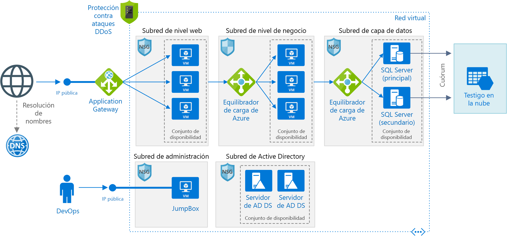

# <a name="windows-n-tier-application-on-azure-with-sql-server"></a>Aplicación Windows de n niveles en Azure con SQL Server

Esta arquitectura de referencia muestra cómo implementar máquinas virtuales y una red virtual configurada para una aplicación de n niveles, con SQL Server en Windows para la capa de datos. [**Implemente esta solución**](#deploy-the-solution).



*Descargue un [archivo Visio][visio-download] de esta arquitectura.*

## <a name="architecture"></a>Arquitectura

La arquitectura consta de los siguientes componentes:

- **Grupo de recursos**. Los [grupos de recursos][resource-manager-overview] se utilizan para agrupar los recursos, para que puedan administrarse según su duración, su propietario u otros criterios.

- **Red virtual (VNet) y subredes**. Cada máquina virtual de Azure se implementa en una red virtual que se puede dividir en subredes. Cree una subred independiente para cada nivel.

- **Application Gateway**. [Azure Application Gateway](/azure/application-gateway/) es un equilibrador de carga de nivel 7. En esta arquitectura, enruta las solicitudes HTTP al front-end web. Application Gateway proporciona también un [firewall de aplicaciones web](/azure/application-gateway/waf-overview) (WAF) que protege la aplicación contra puntos vulnerables de la seguridad comunes.

- **NSG**. Use [grupos de seguridad de red][nsg] (NSG) para restringir el tráfico de red dentro de la red virtual. Por ejemplo, en la arquitectura de tres niveles que se muestra aquí, el nivel de base de datos no acepta el tráfico procedente del front-end web, solo el procedente del nivel de empresa y la subred de administración.

- **Protección contra DDoS**. Aunque la plataforma Azure proporciona protección básica contra ataques de denegación de servicio distribuido (DDoS), se recomienda usar el [estándar de protección contra DDoS][ddos], que tiene características de mitigación de DDoS. Consulte [Consideraciones sobre la seguridad](#security-considerations).

- **Máquinas virtuales**. Para obtener recomendaciones sobre la configuración de máquinas virtuales, consulte [Ejecución de una VM con Windows en Azure](./windows-vm.md) y [Ejecución de una VM con Linux en Azure](./linux-vm.md).

- **Conjuntos de disponibilidad**. Cree un [conjunto de disponibilidad][azure-availability-sets] y aprovisione al menos dos máquinas virtuales en cada nivel, que hace que las máquinas virtuales que sean aptas para un [Acuerdo de Nivel de Servicio (SLA)][vm-sla] superior.

- **Equilibradores de carga.** Use [Azure Load Balancer][load-balancer] para distribuir el tráfico de red desde el nivel web al nivel de empresa y desde el nivel de empresa a SQL Server.

- **Dirección IP pública**. Se necesita una dirección IP pública para que la aplicación reciba el tráfico de Internet.

- **JumpBox**. También se denomina [host bastión]. Se trata de una máquina virtual segura en la red que usan los administradores para conectarse al resto de máquinas virtuales. El JumpBox tiene un NSG que solo permite el tráfico remoto que procede de direcciones IP públicas de una lista segura. El NSG debe permitir el tráfico de escritorio remoto (RDP).

- **Grupo de disponibilidad AlwaysOn de SQL Server** Proporciona alta disponibilidad en el nivel de datos, al habilitar la replicación y la conmutación por error. Usa la tecnología de clúster de conmutación por error de Windows Server (WSFC) para la conmutación por error.

- **Servidores de Active Directory Domain Services (AD DS)**. Los objetos de equipo del clúster de conmutación por error y sus roles en clúster asociados se crean en Active Directory Domain Services (AD DS).

- **Testigo en la nube**. Un clúster de conmutación por error requiere que más de la mitad de sus nodos se estén ejecutando, lo que se conoce como tener cuórum. Si el clúster tiene solo dos nodos, una partición de la red podría provocar que cada uno de ellos creyera que es el principal. En ese caso, se necesita un *testigo* que sea quien dilucide cuál es el principal y establezca el cuórum. Un testigo es un recurso, como por ejemplo un disco compartido, que puede actuar como dilucidador para establecer el cuórum. Un testigo en la nube es un tipo de testigo que usa Azure Blob Storage. Para más información acerca del concepto de quórum, consulte [Understanding cluster and pool quorum](/windows-server/storage/storage-spaces/understand-quorum) (Descripción del cuórum de clúster y de grupo). Para más información acerca del testigo en la nube, consulte [Implementación de un testigo en la nube en un clúster de conmutación por error](/windows-server/failover-clustering/deploy-cloud-witness).

- **Azure DNS**. [Azure DNS][azure-dns] es un servicio de hospedaje para dominios DNS. Proporciona resolución de nombres mediante la infraestructura de Microsoft Azure. Al hospedar dominios en Azure, puede administrar los registros DNS con las mismas credenciales, API, herramientas y facturación que con los demás servicios de Azure.

## <a name="recommendations"></a>Recomendaciones

Los requisitos pueden diferir de los de la arquitectura que se describe aquí. Use estas recomendaciones como punto inicial.

### <a name="vnet--subnets"></a>Red virtual/subredes

Cuando cree la red virtual, determine cuántas direcciones IP requieren los recursos de cada subred. Especifique una máscara de subred y un intervalo de direcciones de la red virtual lo suficientemente grande para la dirección IP requerida con el uso de la notación [CIDR]. Use un espacio de direcciones que se encuentre dentro de los [bloques de direcciones IP privados][private-ip-space] estándar, que son 10.0.0.0/8, 172.16.0.0/12 y 192.168.0.0/16.

Elija un intervalo de direcciones que no se superponga con la red local, en caso de que necesite configurar una puerta de enlace entre la red virtual y la red local más adelante. Una vez creada la red virtual, no se puede cambiar el intervalo de direcciones.

Diseñe subredes teniendo en cuenta los requisitos de funcionalidad y seguridad. Todas las máquinas virtuales dentro del mismo nivel o rol deben incluirse en la misma subred, lo que puede servir como un límite de seguridad. Para obtener más información sobre el diseño de redes virtuales y subredes, vea [Planeación y diseño de redes virtuales de Azure][plan-network].

### <a name="load-balancers"></a>Equilibradores de carga

No exponga las máquinas virtuales directamente a Internet; en su lugar, asigne una dirección IP privada a cada una. El cliente se conecta mediante una dirección IP pública asociada a la puerta de enlace de aplicaciones.

Defina reglas del equilibrador de carga para dirigir el tráfico de red a las máquinas virtuales. Por ejemplo, para habilitar el tráfico HTTP, asigne el puerto 80 de la configuración de front-end al puerto 80 del grupo de direcciones de back-end. Cuando un cliente envía una solicitud HTTP al puerto 80, el equilibrador de carga selecciona una dirección IP de back-end mediante un [algoritmo hash][load-balancer-hashing] que incluye la dirección IP de origen. Las solicitudes del cliente se distribuyen entre todas las máquinas virtuales del grupo de direcciones de back-end.

### <a name="network-security-groups"></a>Grupos de seguridad de red

Use reglas NSG para restringir el tráfico entre los niveles. En la arquitectura de tres niveles mostrada anteriormente, el nivel web no se comunica directamente con el nivel de base de datos. Para exigir esto, el nivel de base de datos debe bloquear el tráfico entrante desde la subred del nivel Web.

1. Deniegue todo el tráfico entrante de la red virtual. (Use la etiqueta `VIRTUAL_NETWORK` de la regla).
2. Permita el tráfico entrante de la subred del nivel Business.
3. Permita el tráfico entrante de la propia subred del nivel de la base de datos. Esta regla permite la comunicación entre las máquinas virtuales de la base de datos, lo cual es necesario para la replicación y la conmutación por error de esta.
4. Permita el tráfico RDP (puerto 3389) desde la subred de JumpBox. Esta regla permite a los administradores conectarse al nivel de base de datos desde JumpBox.

Cree las reglas 2 &ndash; 4 con una prioridad más alta que la primera regla para que puedan invalidarla.

### <a name="sql-server-always-on-availability-groups"></a>Grupos de disponibilidad AlwaysOn de SQL Server

Se recomiendan los [grupos de disponibilidad AlwaysOn][sql-alwayson] para alta disponibilidad de SQL Server. Antes de Windows Server 2016, los grupos de disponibilidad AlwaysOn requerían un controlador de dominio y todos los nodos del grupo de disponibilidad debían estar en el mismo dominio de AD.

Otros niveles se conectan a la base de datos a través de una [escucha de grupo de disponibilidad][sql-alwayson-listeners]. La escucha permite a un cliente SQL conectarse sin conocer el nombre de la instancia física de SQL Server. Las máquinas virtuales que acceden a la base de datos deben estar unidas al dominio. El cliente (en este caso, otro nivel) utiliza DNS para resolver el nombre de la red virtual de la escucha en direcciones IP.

Configure el grupo de disponibilidad AlwaysOn de SQL Server como sigue:

1. Cree un clúster de clústeres de conmutación por error de Windows Server (WSFC), un grupo de disponibilidad AlwaysOn de SQL Server y una réplica principal. Para más información, vea [Introducción a Grupos de disponibilidad AlwaysOn][sql-alwayson-getting-started].
2. Cree un equilibrador de carga interno con una dirección IP privada estática.
3. Cree una escucha de grupo de disponibilidad y asigne el nombre DNS de la escucha a la dirección IP del equilibrador de carga interno.
4. Cree una regla del equilibrador de carga para el puerto de escucha de SQL Server (puerto TCP 1433 de forma predeterminada). La regla del equilibrador de carga debe habilitar la *IP flotante*, también denominada Direct Server Return. Esto causa que la máquina virtual responda directamente al cliente, lo que permite establecer una conexión directa con la réplica principal.

   > [!NOTE]
   > Cuando la IP flotante está habilitada, el número de puerto de front-end debe ser el mismo que el número de puerto de back-end en la regla del equilibrador de carga.
   >

Cuando un cliente SQL intenta conectarse, el equilibrador de carga enruta la solicitud de conexión a la réplica principal. Si se produce una conmutación por error a otra réplica, el equilibrador de carga enruta automáticamente las nuevas solicitudes a una nueva réplica principal. Para más información, vea [Configuración de un equilibrador de carga para Grupos de disponibilidad AlwaysOn de SQL Server][sql-alwayson-ilb].

Durante una conmutación por error, se cierran las conexiones de cliente existentes. Una vez completada la conmutación por error, las conexiones nuevas se enrutarán a la nueva réplica principal.

Si la aplicación realiza significativamente más lecturas que escrituras, puede descargar algunas de las consultas de solo lectura en una réplica secundaria. Vea [Usar un agente de escucha para conectarse a una réplica secundaria de solo lectura (enrutamiento de solo lectura)][sql-alwayson-read-only-routing].

Pruebe la implementación mediante el [forzado de una conmutación por error manual][sql-alwayson-force-failover] del grupo de disponibilidad.

### <a name="jumpbox"></a>JumpBox

No permita el acceso mediante RDP desde la red pública de Internet a las máquinas virtuales que ejecutan la carga de trabajo de la aplicación. En su lugar, todo el acceso RDP a estas máquinas virtuales debe realizarse a través de JumpBox. Un administrador inicia sesión en JumpBox y, después, en la otra máquina virtual desde JumpBox. JumpBox permite el tráfico RDP desde Internet, pero solo desde direcciones IP conocidas y seguras.

JumpBox tiene unos requisitos de rendimiento mínimos, por lo que puede seleccionar un pequeño tamaño de máquina virtual. Cree una [dirección IP pública] para JumpBox. Coloque JumpBox en la misma red virtual que las demás máquinas virtuales, pero en una subred de administración independiente.

Para proteger JumpBox, agregue una regla de grupo de seguridad de red que permita las conexiones RDP solo desde un conjunto seguro de direcciones IP públicas. Configure el NSG para las demás subredes, a fin de permitir el tráfico RDP de la subred de administración.

## <a name="scalability-considerations"></a>Consideraciones sobre escalabilidad

Para los niveles web y de empresa, considere la posibilidad de usar [conjuntos de escalado de máquinas virtuales][vmss], en lugar de implementar máquinas virtuales independientes en un conjunto de disponibilidad. Los conjuntos de escalado facilitan la implementación y administración de un conjunto de máquinas virtuales idénticas y el escalado automático de dichas máquinas en función de sus métricas de rendimiento. A medida que aumenta la carga en las máquinas virtuales, se agregan más máquinas virtuales automáticamente al equilibrador de carga. Considere la posibilidad de usar conjuntos de escalado si necesita escalar horizontalmente las máquinas virtuales de inmediato o si necesita realizar el escalado automático.

Hay dos maneras básicas de configurar máquinas virtuales implementadas en un conjunto de escalado:

- Use extensiones para configurar la máquina virtual después de implementarla. Con este método, las nuevas instancias de máquina virtual pueden tardar más en iniciarse que una máquina virtual sin extensiones.

- Implemente un [disco administrado](/azure/storage/storage-managed-disks-overview) con una imagen de disco personalizada. Esta opción puede ser más rápida de implementar. Sin embargo, requiere que la imagen esté actualizada.

Para más información, consulte [Consideraciones de diseño para conjuntos de escalado][vmss-design].

> [!TIP]
> Cuando utilice cualquier solución de escalado automático, pruébela con antelación con cargas de trabajo de nivel de producción.

Cada suscripción de Azure tiene límites predeterminados establecidos, incluido un número máximo de máquinas virtuales por región. Puede aumentar el límite si rellena una solicitud de soporte técnico. Para más información, consulte [Límites, cuotas y restricciones de suscripción y servicios de Microsoft Azure][subscription-limits].

## <a name="availability-considerations"></a>Consideraciones sobre disponibilidad

Si no usa conjuntos de escalado de máquinas virtuales, coloque las máquinas virtuales del mismo nivel en un conjunto de disponibilidad. Cree al menos dos máquinas virtuales en el conjunto de disponibilidad, para admitir el [SLA de disponibilidad para máquinas virtuales de Azure][vm-sla]. Para más información, consulte [Administración de la disponibilidad de las máquinas virtuales][availability-set]. Los conjuntos de escalado usan automáticamente *grupos de selección de ubicación*, que actúan como un conjunto de disponibilidad implícito.

El equilibrador de carga usa [sondeos de mantenimiento][health-probes] para supervisar la disponibilidad de las instancias de máquina virtual. Si un sondeo no puede acceder a una instancia antes de que expire, el equilibrador de carga deja de enviar tráfico a esa máquina virtual. Sin embargo, el equilibrador de carga continuará con el sondeo y, si la máquina virtual vuelve a estar disponible, el equilibrador de carga reanudará el envío del tráfico a esa máquina virtual.

A continuación, se presentan algunas recomendaciones sobre los sondeos de mantenimiento del equilibrador de carga:

- Los sondeos pueden probar los protocolos HTTP o TCP. Si las máquinas virtuales ejecutan un servidor HTTP, cree un sondeo HTTP. De lo contrario, cree un sondeo TCP.
- Para un sondeo HTTP, especifique la ruta de acceso a un punto de conexión HTTP. El sondeo comprueba si hay una respuesta HTTP 200 desde esta ruta de acceso. Puede ser la ruta de acceso raíz ("/") o un punto de conexión de supervisión de mantenimiento que implementa alguna lógica personalizada para comprobar el mantenimiento de la aplicación. El punto de conexión debe permitir solicitudes HTTP anónimas.
- El sondeo se envía desde una [dirección IP conocida][health-probe-ip], 168.63.129.16. No bloquee el tráfico que llega a esta dirección IP, ni el que parte de ella, en las directivas de firewall o en las reglas del grupo de seguridad de red.
- Use [registros de sondeo de mantenimiento][health-probe-log] para ver el estado de los sondeos de mantenimiento. Habilite el registro en Azure Portal para cada equilibrador de carga. Los registros se escriben en Azure Blob Storage. Los registros muestran el número de máquinas virtuales que no reciben tráfico de red debido la falta de respuesta en los sondeos.

Si necesita más disponibilidad de la que proporciona el [Acuerdo de Nivel de Servicio de Azure para máquinas virtuales][vm-sla], considere la replicación de la aplicación entre dos regiones y use Azure Traffic Manager para la conmutación por error. Para más información, consulte [Aplicación de n niveles para varias regiones para obtener alta disponibilidad][multi-dc].

## <a name="security-considerations"></a>Consideraciones sobre la seguridad

Las redes virtuales son un límite de aislamiento del tráfico de Azure. Las máquinas virtuales de una red virtual no se pueden comunicar directamente con las de otra. Las máquinas virtuales que se encuentran en la misma red virtual se pueden comunicar entre sí, a menos que se creen [grupos de seguridad de red][nsg] (NSG) para restringir el tráfico. Para más información, consulte [Servicios en la nube de Microsoft y seguridad de red][network-security].

**DMZ**. Considere la posibilidad de agregar una aplicación virtual de red (NVA) para crear una red perimetral entre la red de Internet y la red virtual de Azure. NVA es un término genérico para una aplicación virtual que puede realizar tareas relacionadas con la red, como firewall, inspección de paquetes, auditoría y enrutamiento personalizado. Para más información, vea [Implementación de una red perimetral entre Internet y Azure][dmz].

**Cifrado**. Cifre información confidencial en reposo y use [Azure Key Vault][azure-key-vault] para administrar las claves de cifrado de la base de datos. Key Vault puede almacenar las claves de cifrado en módulos de seguridad de hardware (HSM). Para más información, consulte [Configuración de la integración de Azure Key Vault para SQL Server en máquinas virtuales de Azure][sql-keyvault]. También se recomienda almacenar los secretos de aplicación como, por ejemplo, las cadenas de conexión de base de datos, en Key Vault.

**DDoS Protection**. De forma predeterminada, la plataforma Azure proporciona protección básica contra DDoS. El objetivo de dicha es proteger la infraestructura de Azure en su conjunto. Aunque la protección básica contra DDoS se habilita automáticamente, se recomienda usar [DDoS Protection Estándar][ddos]. Para detectar las amenazas, la protección estándar usa un ajuste que se puede adaptar en función de los patrones de tráfico de red de la aplicación, lo que le permite aplicar mitigaciones frente a ataques de denegación de servicio distribuido que podrían pasar desapercibidas para las directivas de DDoS para toda la infraestructura. La protección estándar también proporciona alertas, telemetría y análisis a través de Azure Monitor. Para más información, consulte [Azure DDoS Protection: procedimientos recomendados y arquitecturas de referencia][ddos-best-practices].

## <a name="deploy-the-solution"></a>Implementación de la solución

Hay disponible una implementación de esta arquitectura de referencia en [GitHub][github-folder]. La implementación completa puede tardar un máximo de dos horas, lo que incluye la ejecución de los scripts para configurar AD DS, el clúster de conmutación por error de Windows Server y el grupo de disponibilidad de SQL Server.

### <a name="prerequisites"></a>Requisitos previos

[!INCLUDE [ref-arch-prerequisites.md](../../../includes/ref-arch-prerequisites.md)]

### <a name="deployment-steps"></a>Pasos de implementación

1. Ejecute el siguiente comando para crear un grupo de recursos.

    ```azurecli
    az group create --location <location> --name <resource-group-name>
    ```

2. Ejecute el siguiente comando para crear una cuenta de almacenamiento para el testigo en la nube.

    ```azurecli
    az storage account create --location <location> \
      --name <storage-account-name> \
      --resource-group <resource-group-name> \
      --sku Standard_LRS
    ```

3. Vaya a la carpeta `virtual-machines\n-tier-windows` del repositorio de GitHub de las arquitecturas de referencia.

4. Abra el archivo `n-tier-windows.json` .

5. Busque todas las instancias de "witnessStorageBlobEndPoint" y reemplace el texto del marcador de posición por el nombre de la cuenta de almacenamiento del paso 2.

    ```json
    "witnessStorageBlobEndPoint": "https://[replace-with-storageaccountname].blob.core.windows.net",
    ```

6. Ejecute el siguiente comando para mostrar las claves de la cuenta de almacenamiento.

    ```azurecli
    az storage account keys list \
      --account-name <storage-account-name> \
      --resource-group <resource-group-name>
    ```

    La salida debe tener un aspecto similar al siguiente. Copie el valor de `key1`.

    ```json
    [
    {
        "keyName": "key1",
        "permissions": "Full",
        "value": "..."
    },
    {
        "keyName": "key2",
        "permissions": "Full",
        "value": "..."
    }
    ]
    ```

7. En el archivo `n-tier-windows.json`, busque todas las instancias de "witnessStorageAccountKey" y pegue la clave de la cuenta.

    ```json
    "witnessStorageAccountKey": "[replace-with-storagekey]"
    ```

8. En el archivo `n-tier-windows.json`, busque todas las instancias de `[replace-with-password]` y `[replace-with-sql-password]`, y reemplácelas por una contraseña segura. Guarde el archivo.

    > [!NOTE]
    > Si cambia el nombre de usuario del administrador, también debe actualizar los bloques `extensions` en el archivo JSON.

9. Ejecute el siguiente comando para implementar la arquitectura.

    ```azurecli
    azbb -s <your subscription_id> -g <resource_group_name> -l <location> -p n-tier-windows.json --deploy
    ```

Para obtener más información sobre la implementación de esta arquitectura de referencia de ejemplo mediante Azure Bulding Blocks, visite el [repositorio de GitHub][git].

<!-- links -->
[dmz]: ../dmz/secure-vnet-dmz.md
[multi-dc]: multi-region-sql-server.md
[n-tier]: n-tier.md
[azure-availability-sets]: /azure/virtual-machines/virtual-machines-windows-manage-availability#configure-each-application-tier-into-separate-availability-sets
[azure-dns]: /azure/dns/dns-overview
[azure-key-vault]: https://azure.microsoft.com/services/key-vault
[host bastión]: https://en.wikipedia.org/wiki/Bastion_host
[CIDR]: https://en.wikipedia.org/wiki/Classless_Inter-Domain_Routing
[ddos]: /azure/virtual-network/ddos-protection-overview
[ddos-best-practices]: /azure/security/azure-ddos-best-practices
[git]: https://github.com/mspnp/template-building-blocks
[github-folder]: https://github.com/mspnp/reference-architectures/tree/master/virtual-machines/n-tier-windows
[nsg]: /azure/virtual-network/virtual-networks-nsg
[plan-network]: /azure/virtual-network/virtual-network-vnet-plan-design-arm
[private-ip-space]: https://en.wikipedia.org/wiki/Private_network#Private_IPv4_address_spaces
[Dirección IP pública]: /azure/virtual-network/virtual-network-ip-addresses-overview-arm
[sql-alwayson]: https://msdn.microsoft.com/library/hh510230.aspx
[sql-alwayson-force-failover]: https://msdn.microsoft.com/library/ff877957.aspx
[sql-alwayson-getting-started]: https://msdn.microsoft.com/library/gg509118.aspx
[sql-alwayson-ilb]: /azure/virtual-machines/windows/sql/virtual-machines-windows-portal-sql-alwayson-int-listener
[sql-alwayson-listeners]: https://msdn.microsoft.com/library/hh213417.aspx
[sql-alwayson-read-only-routing]: https://technet.microsoft.com/library/hh213417.aspx#ConnectToSecondary
[sql-keyvault]: /azure/virtual-machines/virtual-machines-windows-ps-sql-keyvault
[vm-sla]: https://azure.microsoft.com/support/legal/sla/virtual-machines
[vnet faq]: /azure/virtual-network/virtual-networks-faq
[wsfc-whats-new]: https://technet.microsoft.com/windows-server-docs/failover-clustering/whats-new-in-failover-clustering
[visio-download]: https://archcenter.blob.core.windows.net/cdn/vm-reference-architectures.vsdx
[resource-manager-overview]: /azure/azure-resource-manager/resource-group-overview
[vmss]: /azure/virtual-machine-scale-sets/virtual-machine-scale-sets-overview
[load-balancer]: /azure/load-balancer/
[load-balancer-hashing]: /azure/load-balancer/load-balancer-overview#load-balancer-features
[vmss-design]: /azure/virtual-machine-scale-sets/virtual-machine-scale-sets-design-overview
[subscription-limits]: /azure/azure-subscription-service-limits
[availability-set]: /azure/virtual-machines/virtual-machines-windows-manage-availability
[health-probes]: /azure/load-balancer/load-balancer-overview#load-balancer-features
[health-probe-log]: /azure/load-balancer/load-balancer-monitor-log
[health-probe-ip]: /azure/virtual-network/virtual-networks-nsg#special-rules
[network-security]: /azure/best-practices-network-security
