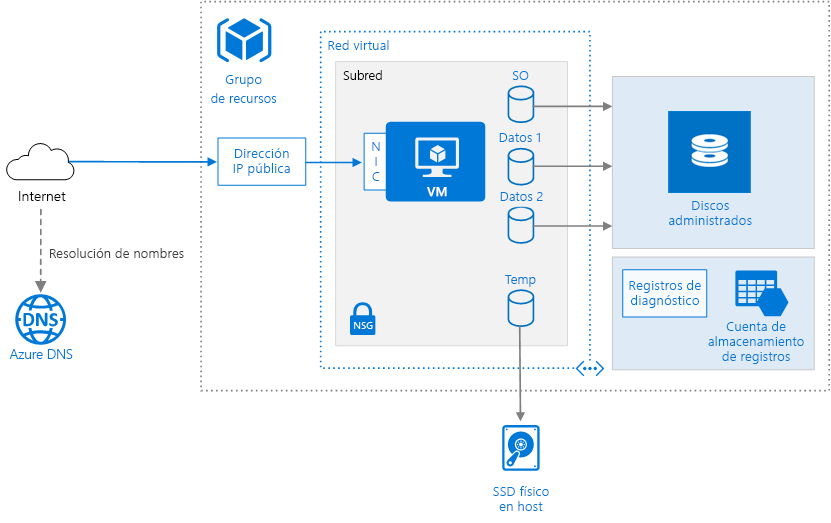

# <a name="run-a-windows-virtual-machine-on-azure"></a>Ejecución de una máquina virtual Windows en Azure

En este artículo se muestran prácticas demostradas para ejecutar una máquina virtual (VM) Windows en Azure. Incluye recomendaciones para el aprovisionamiento de la máquina virtual junto con los componentes de red y almacenamiento. [**Implemente esta solución**](#deploy-the-solution).



## <a name="components"></a>Componentes

El aprovisionamiento de una máquina virtual de Azure requiere componentes adicionales además de la propia máquina virtual, por ejemplo, recursos de proceso, de red y de almacenamiento.

- **Grupo de recursos**. Un [grupo de recursos][resource-manager-overview] es un contenedor lógico que incluye recursos de Azure relacionados. En general, los grupos de recursos se basan en su duración y quién los administra.

- **Máquina virtual**. Puede aprovisionar una máquina virtual desde una lista de imágenes publicadas, desde una imagen administrada personalizada o desde un archivo de disco duro virtual (VHD) cargado en Azure Blob Storage.

- **Managed Disks**. [Azure Managed Disks] [ managed-disks] simplifica la administración de discos y controla el almacenamiento automáticamente. El disco del sistema operativo es un disco duro virtual almacenado en [Azure Storage][azure-storage], por lo que se conserva incluso cuando la máquina host está inactiva. También se recomienda crear uno o varios [discos de datos][data-disk], que son discos duros virtuales persistentes que se usan para los datos de aplicación.

- **Disco temporal**. La VM se crea con un disco temporal (la unidad `D:` de Windows). Este disco se almacena en una unidad física del equipo host. *No* se guarda en Azure Storage y es posible que se elimine durante los reinicios y otros eventos del ciclo de vida de la máquina virtual. Use este disco solo para datos temporales, como archivos de paginación o de intercambio.

- **Red virtual**. Cada máquina virtual de Azure se implementa en una red virtual que se puede dividir en varias subredes.

- **Interfaz de red (NIC)**. La NIC permite que la VM se comunique con la red virtual.

- **Dirección IP pública**. Es necesaria una dirección IP pública para comunicarse con la máquina virtual, por ejemplo, a través de Escritorio remoto (RDP).

- **Azure DNS**. [Azure DNS][azure-dns] es un servicio de hospedaje para dominios DNS que permite resolver nombres mediante la infraestructura de Microsoft Azure. Al hospedar dominios en Azure, puede administrar los registros DNS con las mismas credenciales, API, herramientas y facturación que con los demás servicios de Azure.

- **Grupo de seguridad de red (NSG)**. [Los grupos de seguridad de red][nsg] se utilizan para permitir o denegar el tráfico de red a las máquinas virtuales. Los grupos de seguridad de red se pueden asociar con subredes o con instancias de máquina virtual individuales.

- **Diagnóstico**.  El registro de diagnóstico es fundamental para administrar y solucionar problemas de la VM.

## <a name="vm-recommendations"></a>Recomendaciones de VM

Azure ofrece numerosos tamaños diferentes de máquina virtual. Para obtener más información, consulte [Tamaños de máquinas virtuales en Azure][virtual-machine-sizes]. Si desplaza una carga de trabajo existente a Azure, comience con el tamaño de máquina virtual que más se parezca a los servidores locales. Luego, mida el rendimiento de la carga de trabajo real con respecto a la CPU, la memoria y las operaciones de entrada/salida por segundo (IOPS) de disco, y ajuste el tamaño según sea necesario. Si necesita varios adaptadores de red para la máquina virtual, tenga en cuenta que hay un número máximo definido para cada [tamaño de máquina virtual][vm-size-tables].

Por lo general, se recomienda elegir una región de Azure más cercana a los usuarios internos o clientes. Sin embargo, es posible que no todos los tamaños de máquina virtual estén disponibles en todas las regiones. Para más información, consulte [Productos disponibles por región][services-by-region]. Para obtener una lista de los tamaños de máquina virtual disponibles en una región específica, ejecute el siguiente comando en la interfaz de la línea de comandos (CLI) de Azure:

```azurecli
az vm list-sizes --location <location>
```

Para obtener información sobre cómo elegir una imagen de VM publicada, consulte [Búsqueda de imágenes de VM de Windows][select-vm-image].

Habilite la supervisión y el diagnóstico, como las métricas básicas de estado, los registros de infraestructura de diagnóstico y los [diagnósticos de arranque][boot-diagnostics]. Los diagnósticos de arranque pueden ayudarle a diagnosticar errores de arranque si la máquina virtual entra en un estado de imposibilidad de arranque. Para más información, consulte [Habilitación de supervisión y diagnóstico][enable-monitoring].

## <a name="disk-and-storage-recommendations"></a>Recomendaciones de discos y almacenamiento

Para un mejor rendimiento de la E/S de disco, se recomienda [Premium Storage][premium-storage], que almacena los datos en unidades de estado sólido (SSD). El costo se basa en la capacidad del disco aprovisionado. Las E/S por segundo y el rendimiento (es decir, la velocidad de transferencia de datos), también dependen del tamaño del disco, por lo que al aprovisionar un disco, debería tener en cuenta los tres factores (capacidad, E/S por segundo y rendimiento).

También se recomienda usar [Managed Disks][managed-disks]. Los discos administrados no requieren una cuenta de almacenamiento. Solo debe especificar el tamaño y el tipo de disco, y se implementará como un recurso de alta disponibilidad.

Agregue uno o más discos de datos. Cuando se crea un disco duro virtual, no tiene formato. Inicie sesión en la VM para dar formato al disco. Cuando sea posible, instale las aplicaciones en un disco de datos, no en el disco del sistema operativo. Es posible que algunas aplicaciones heredadas deban instalar componentes en la unidad C:. En ese caso, puede [cambiar el tamaño del disco del sistema operativo][resize-os-disk] mediante PowerShell.

Cree una cuenta de almacenamiento para conservar los registros de diagnóstico. Una cuenta de almacenamiento con redundancia local (LRS) estándar es suficiente para este tipo de registros.

> [!NOTE]
> Si no usa Managed Disks, cree cuentas de almacenamiento de Azure distintas para cada máquina virtual para almacenar los discos duros virtuales (VHD) con el fin de evitar alcanzar los [límites de IOPS][vm-disk-limits] para cuentas de almacenamiento. Tenga en cuenta el límite total de E/S de la cuenta de almacenamiento. Para más información, consulte [Límites de discos de máquinas virtuales][vm-disk-limits].

## <a name="network-recommendations"></a>Recomendaciones de red

La dirección IP pública puede ser dinámica o estática. El valor predeterminado es dinámica.

- Reserve una [dirección IP estática][static-ip] si necesita una dirección IP fija que no cambie; por ejemplo, si tiene que crear un registro "A" en DNS o agregar la dirección IP a una lista segura.
- También puede crear un nombre de dominio completo (FQDN) para la dirección IP. Después, puede registrar un [registro CNAME][cname-record] en DNS que apunte al nombre de dominio completo. Para más información, consulte [Crear un nombre de dominio completo en Azure Portal][fqdn].

Todos los NSG contienen un conjunto de [reglas predeterminadas][nsg-default-rules], incluida una que bloquea todo el tráfico de entrada de Internet. No se puede eliminar las reglas predeterminadas, pero otras reglas pueden reemplazarlas. Para permitir el tráfico de Internet, cree reglas que permitan el tráfico entrante a puertos específicos; por ejemplo, el puerto 80 para HTTP.

Para habilitar RDP, agregue una regla de NSG que permita el tráfico entrante al puerto TCP 3389.

## <a name="scalability-considerations"></a>Consideraciones sobre escalabilidad

Puede escalar o reducir verticalmente una máquina virtual [cambiando su tamaño][vm-resize]. Para escalar horizontalmente, coloque dos o más máquinas virtuales detrás de un equilibrador de carga. Para más información, consulte la sección [Arquitectura de referencia de n niveles](./n-tier-sql-server.md).

## <a name="availability-considerations"></a>Consideraciones sobre disponibilidad

Para una mayor disponibilidad, implemente varias máquinas virtuales en un conjunto de disponibilidad. Este procedimiento también ofrece un [Acuerdo de Nivel de Servicio (SLA)][vm-sla] superior.

La máquina virtual puede verse afectada por un [mantenimiento planeado][planned-maintenance] o un [mantenimiento no planeado][manage-vm-availability]. Puede usar [registros de reinicio de máquina virtual][reboot-logs] para determinar si se produjo un reinicio de la máquina virtual por un mantenimiento planeado.

Para protegerse de la pérdida accidental de datos durante las operaciones normales (por ejemplo, debido a errores de usuario), debe implementar también copias de seguridad de un momento dado mediante [instantáneas de blobs][blob-snapshot] u otra herramienta.

## <a name="manageability-considerations"></a>Consideraciones sobre la manejabilidad

**Grupos de recursos**. Coloque los recursos estrechamente asociados que comparten el mismo ciclo de vida en un mismo [grupo de recursos][resource-manager-overview]. Los grupos de recursos permiten implementar y supervisar los recursos como un grupo, y realizar un seguimiento de los costos de facturación por grupo de recursos. También se pueden eliminar recursos en conjunto, lo que resulta muy útil para implementaciones de prueba. Asigne nombres de recursos significativos para simplificar la ubicación de un recurso específico y comprender su rol. Para obtener más información, consulte las recomendaciones de [Convenciones de nomenclatura para los recursos de Azure][naming-conventions].

**Detención de una máquina virtual**. Azure hace una distinción entre los estados "Detenido" y "Desasignado". Se le cobra cuando el estado de la máquina virtual se detiene, pero no cuando se desasigna la máquina virtual. En Azure Portal, con el botón **Detener**, se desasigna la máquina virtual. Si apaga desde dentro del sistema operativo mientras tiene la sesión iniciada, la VM se detiene pero **no** se desasigna, por lo que se le seguirá cobrando.

**Eliminación de una máquina virtual**.  Si elimina una VM, no se eliminarán los discos duros virtuales. Esto significa que puede eliminar de forma segura la VM sin perder datos. Sin embargo, se le seguirá cobrando por el almacenamiento. Para eliminar el VHD, elimine el archivo de [Blob Storage][blob-storage]. Para evitar eliminaciones por error, use un [bloqueo de recurso][resource-lock] para bloquear el grupo de recursos completo o recursos individuales, como una máquina virtual.

## <a name="security-considerations"></a>Consideraciones sobre la seguridad

Use [Azure Security Center][security-center] para obtener una visión central del estado de la seguridad de sus recursos en Azure. Security Center supervisa los posibles problemas de seguridad y proporciona una imagen completa del estado de seguridad de su implementación. El Centro de seguridad se configura por cada suscripción de Azure. Habilite la recopilación de datos de seguridad como se describe en la [Guía de inicio rápido de Azure Security Center][security-center-get-started]. Una vez que habilite la recolección, el Centro de seguridad busca automáticamente las VM creadas en esa suscripción.

**Administración de revisiones**. Si está habilitada esta opción, Security Center comprueba si falta alguna actualización crítica y de seguridad. Use la [configuración de directiva de grupo][group-policy] de la máquina virtual para habilitar las actualizaciones automáticas del sistema.

**Antimalware**.  Si está habilitada esta opción, el Centro de seguridad comprueba si está instalado software antimalware. También puede Security Center para instalar software antimalware desde el Portal de Azure.

**Operaciones**. Use el [control de acceso basado en rol (RBAC)][rbac] para controlar el acceso a los recursos de Azure que implementa. RBAC le permite asignar roles de autorización a los miembros de su equipo de DevOps. Por ejemplo, el rol de lector puede ver recursos de Azure pero no crearlos, administrarlos o eliminarlos. Algunos roles son específicos de un tipo de recurso de Azure determinado. Por ejemplo, el rol Colaborador de la máquina virtual puede reiniciar o desasignar una máquina virtual, restablecer la contraseña de administrador, crear una nueva máquina virtual, etc. Otros [roles de RBAC integrados][rbac-roles] que pueden resultar útiles para esta arquitectura son, por ejemplo, el de [Usuario de DevTest Labs][rbac-devtest] y el de [Colaborador de la red][rbac-network]. Un usuario puede asignarse a varios roles, y es posible crear roles personalizados para una especificación aún más detallada de los permisos.

> [!NOTE]
> RBAC no limita las acciones que puede realizar un usuario que ha iniciado sesión en una máquina virtual. Esos permisos están determinados por el tipo de cuenta en el sistema operativo invitado.

Use los [registros de auditoría][audit-logs] para ver las acciones de aprovisionamiento y otros eventos de la máquina virtual.

**Cifrado de datos**. Considere la posibilidad de usar [Azure Disk Encryption][disk-encryption] si necesita cifrar los discos de datos y del sistema operativo.

**DDoS Protection**. Se recomienda habilitar [DDoS Protection Standard](/azure/virtual-network/ddos-protection-overview), que mitiga los riesgos de DDoS para los recursos de una red virtual. Aunque la protección contra DDoS básica se habilita automáticamente como parte de la plataforma Azure, DDoS Protection Standard proporciona funcionalidades de mitigación de riesgos ajustadas específicamente a los recursos de Azure Virtual Network.

## <a name="deploy-the-solution"></a>Implementación de la solución

Hay disponible una implementación de esta arquitectura en [GitHub][github-folder]. Implementa lo siguiente:

- Una red virtual con una sola subred denominada **web** utilizada para hospedar la máquina virtual.
- Un NSG con dos reglas de entrada para permitir el tráfico RDP y HTTP a la máquina virtual.
- Una VM en la que se ejecuta la última versión de Windows Server 2016 Datacenter Edition.
- Una extensión de script personalizada de ejemplo que da formato a los dos discos de datos y un script DSC de PowerShell que implementa Internet Information Services (IIS).

### <a name="prerequisites"></a>Requisitos previos

[!INCLUDE [ref-arch-prerequisites.md](../../../includes/ref-arch-prerequisites.md)]

### <a name="deployment-steps"></a>Pasos de implementación

Para implementar esta arquitectura de referencia, siga estos pasos:

1. Navegue hasta la carpeta `virtual-machines\single-vm\parameters\windows` del repositorio que descargó en el paso de requisitos previos anterior.

2. Abra el archivo `single-vm-v2.json`, escriba un nombre de usuario y la contraseña entre comillas y, después, guarde el archivo.

    ```json
    "adminUsername": "",
    "adminPassword": "",
    ```

3. Ejecute `azbb` para implementar la máquina virtual de ejemplo, tal y como se muestra a continuación.

  ```azurecli
  azbb -s <subscription_id> -g <resource_group_name> -l <location> -p single-vm-v2.json --deploy
  ```

Para comprobar la implementación, ejecute el siguiente comando de la CLI de Azure para encontrar la dirección IP pública de la máquina virtual:

```azurecli
az vm show -n ra-single-windows-vm1 -g <resource-group-name> -d -o table
```

Si va a esta dirección en un explorador web, verá la página de inicio predeterminada de IIS.

Para más información acerca de cómo personalizar esta implementación, visite nuestro [repositorio de GitHub][git].

<!-- links -->
[audit-logs]: https://azure.microsoft.com/blog/analyze-azure-audit-logs-in-powerbi-more/
[availability-set]: /azure/virtual-machines/virtual-machines-windows-create-availability-set
[azbb]: https://github.com/mspnp/template-building-blocks/wiki/Install-Azure-Building-Blocks
[azbbv2]: https://github.com/mspnp/template-building-blocks
[azure-cli-2]: /cli/azure/install-azure-cli?view=azure-cli-latest
[azure-dns]: /azure/dns/dns-overview
[azure-storage]: /azure/storage/storage-introduction
[blob-snapshot]: /azure/storage/storage-blob-snapshots
[blob-storage]: /azure/storage/storage-introduction
[boot-diagnostics]: https://azure.microsoft.com/blog/boot-diagnostics-for-virtual-machines-v2/
[cname-record]: https://en.wikipedia.org/wiki/CNAME_record
[data-disk]: /azure/virtual-machines/virtual-machines-windows-about-disks-vhds
[disk-encryption]: /azure/security/azure-security-disk-encryption
[enable-monitoring]: /azure/monitoring-and-diagnostics/insights-how-to-use-diagnostics
[fqdn]: /azure/virtual-machines/virtual-machines-windows-portal-create-fqdn
[git]: https://github.com/mspnp/reference-architectures/tree/master/virtual-machines/single-vm
[github-folder]: https://github.com/mspnp/reference-architectures/tree/master/virtual-machines/single-vm
[group-policy]: https://docs.microsoft.com/previous-versions/windows/it-pro/windows-server-2012-R2-and-2012/dn595129(v=ws.11)
[log-collector]: https://azure.microsoft.com/blog/simplifying-virtual-machine-troubleshooting-using-azure-log-collector/
[manage-vm-availability]: /azure/virtual-machines/virtual-machines-windows-manage-availability
[managed-disks]: /azure/storage/storage-managed-disks-overview
[naming-conventions]: ../../best-practices/naming-conventions.md
[nsg]: /azure/virtual-network/virtual-networks-nsg
[nsg-default-rules]: /azure/virtual-network/virtual-networks-nsg#default-rules
[planned-maintenance]: /azure/virtual-machines/virtual-machines-windows-planned-maintenance
[premium-storage]: /azure/virtual-machines/windows/premium-storage
[premium-storage-supported]: /azure/virtual-machines/windows/premium-storage#supported-vms
[rbac]: /azure/active-directory/role-based-access-control-what-is
[rbac-roles]: /azure/active-directory/role-based-access-built-in-roles
[rbac-devtest]: /azure/active-directory/role-based-access-built-in-roles#devtest-labs-user
[rbac-network]: /azure/active-directory/role-based-access-built-in-roles#network-contributor
[reboot-logs]: https://azure.microsoft.com/blog/viewing-vm-reboot-logs/
[ref-arch-repo]: https://github.com/mspnp/reference-architectures
[resize-os-disk]: /azure/virtual-machines/virtual-machines-windows-expand-os-disk
[resource-lock]: /azure/resource-group-lock-resources
[resource-manager-overview]: /azure/azure-resource-manager/resource-group-overview
[security-center]: /azure/security-center/security-center-intro
[security-center-get-started]: /azure/security-center/security-center-get-started
[select-vm-image]: /azure/virtual-machines/virtual-machines-windows-cli-ps-findimage
[services-by-region]: https://azure.microsoft.com/regions/#services
[static-ip]: /azure/virtual-network/virtual-networks-reserved-public-ip
[virtual-machine-sizes]: /azure/virtual-machines/virtual-machines-windows-sizes
[visio-download]: https://archcenter.blob.core.windows.net/cdn/vm-reference-architectures.vsdx
[vm-disk-limits]: /azure/azure-subscription-service-limits#virtual-machine-disk-limits
[vm-resize]: /azure/virtual-machines/virtual-machines-linux-change-vm-size
[vm-size-tables]: /azure/virtual-machines/virtual-machines-windows-sizes
[vm-sla]: https://azure.microsoft.com/support/legal/sla/virtual-machines
