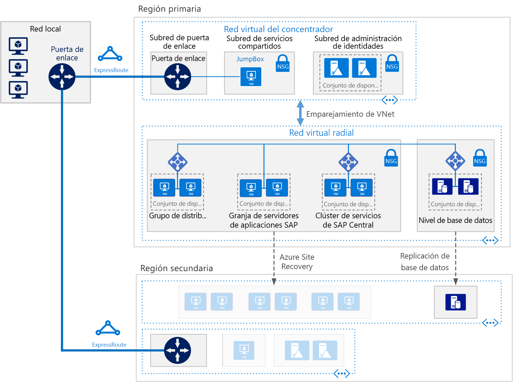

# Implementación de SAP NetWeaver (Windows) para AnyDB en Azure Virtual Machines

Esta arquitectura de referencia muestra un conjunto de prácticas probadas para ejecutar SAP NetWeaver en un entorno Windows en Azure con alta disponibilidad. La base de datos es AnyDB, el término de SAP para todos los sistemas de administración de bases de datos compatibles que no sean SAP HANA. Esta arquitectura se implementa con tamaños de máquina virtual (VM) específicos que se pueden cambiar para acomodarse a las necesidades de la organización.

*Descargue un [archivo Visio][visio-download] de esta arquitectura.*

> [!NOTE] 
> La implementación de esta arquitectura de referencia requiere licencias adecuadas de los productos de SAP y de otras tecnologías que no son de Microsoft.

## Arquitectura
La arquitectura consta de la siguiente infraestructura y los siguientes componentes de software clave.

**Red virtual**. El servicio de Azure Virtual Network conecta los recursos de Azure entre sí de forma segura. En esta arquitectura, la red virtual se conecta a un entorno local a través de una puerta de enlace de VPN implementada en el concentrador de una topología en estrella tipo [hub-spoke](../hybrid-networking/hub-spoke.md). El radio es la red virtual que se usa tanto para las aplicaciones de SAP como para el nivel de base de datos.

**Subredes**. La red virtual se divide a su vez en subredes independientes para cada nivel: aplicación (SAP NetWeaver), base de datos, servicios compartidos (JumpBox) y Active Directory.
    
**Máquinas virtuales**. Esta arquitectura usa para la capa de aplicación y el nivel de base de datos máquinas virtuales agrupadas como se indica a continuación:

- **SAP NetWeaver**. La capa de aplicación usa máquinas virtuales de Windows y ejecuta tanto SAP Central Services como los servidores de aplicaciones de SAP. Las máquinas virtuales que ejecutan Central Services están configurados como un Clúster de conmutación por error de Windows Server para poder ofrecer alta disponibilidad y son compatibles con SIOS DataKeeper Cluster Edition.
- **AnyDB**. El nivel de base de datos ejecuta AnyDB como base de datos de origen, como Microsoft SQL Server, Oracle o IBM DB2.
- **JumpBox**. También se denomina bastion host. Se trata de una máquina virtual segura en la red que usan los administradores para conectarse al resto de máquinas virtuales.
- **Controladores de dominio de Windows Server Active Directory**. Los controladores de dominio se utilizan en todas las máquinas virtuales y usuarios del dominio.

**Equilibradores de carga.** Las instancias de [Azure Load Balancer](/azure/load-balancer/load-balancer-overview) se utilizan para distribuir el tráfico a las máquinas virtuales en la subred de la capa de aplicaciones. En la capa de datos, se puede lograr alta disponibilidad mediante equilibradores de carga SAP integrados, Azure Load Balancer u otros mecanismos, dependiendo del DBMS. Para más información, consulte [Implementación de DBMS en Azure Virtual Machines para SAP NetWeaver](/azure/virtual-machines/workloads/sap/dbms-guide). 

**Conjuntos de disponibilidad**. En las máquinas virtuales de SAP Web Dispatcher, el servidor de aplicaciones de SAP y (A)SCS, los roles se agrupan en [conjuntos de disponibilidad](/azure/virtual-machines/windows/tutorial-availability-sets) independientes y se aprovisionan un mínimo de dos máquinas virtuales por rol, lo que hace que las máquinas virtuales sean aptas para un [Acuerdo de Nivel de Servicio](https://azure.microsoft.com/support/legal/sla/virtual-machines) (SLA) mayor.

**NIC**. Las [tarjetas de interfaz de red](/azure/virtual-network/virtual-network-network-interface) (NIC) permiten la comunicación de las máquinas virtuales en una red virtual.

**Grupos de seguridad de red**. Para restringir el tráfico restringir el tráfico de entrada, de salida e interno de las subredes en la red virtual, se pueden crear [grupos de seguridad de red](/azure/virtual-network/virtual-networks-nsg) (NSG).

**Puerta de enlace**. Una puerta de enlace extiende una red local a la red virtual de Azure. [ExpressRoute](/azure/architecture/reference-architectures/hybrid-networking/expressroute) es el servicio de Azure recomendado para crear conexiones privadas que no atraviesen Internet, pero también se puede usar una conexión de [sitio a sitio](/azure/vpn-gateway/vpn-gateway-howto-site-to-site-resource-manager-portal).

**Azure Storage**. Para proporcionar un almacenamiento persistente de disco duro virtual (VHD) de una máquina virtual, se requiere [Azure Storage](/azure/storage/storage-standard-storage). También lo usa [Cloud Witness](/windows-server/failover-clustering/deploy-cloud-witness) para implementar una operación de un clúster de conmutación por error. 

## Recomendaciones
Los requisitos pueden diferir de los de la arquitectura que se describe aquí. Use estas recomendaciones como punto de partida.

### Grupo de SAP Web Dispatcher

El componente Web Dispatcher se usa como equilibrador de carga para el tráfico SAP que circula entre los servidores de aplicaciones de SAP. Para lograr una alta disponibilidad para el componente Web Dispatcher, se usa Azure Load Balancer para implementar la configuración paralela de Web Dispatcher. Web Dispatcher se utiliza en una configuración round robin para la distribución del tráfico HTTP(S) entre los distribuidores web disponibles en el grupo de equilibradores.

Para más información acerca de la ejecución de SAP NetWeaver en Azure Virtual Machines, consulte [Planeación e implementación de Azure Virtual Machines para SAP en NetWeaver](/azure/virtual-machines/workloads/sap/planning-guide).

### Grupo de servidores de aplicaciones

Para administrar grupos de inicio de sesión para servidores de aplicaciones de ABAP, se utiliza la transacción SMLG. Usa la función de equilibrio de carga en el servidor de mensajes de Central Services para distribuir la carga de trabajo entre el grupo de servidores de aplicaciones de SAP para SAPGUI y el tráfico de RFC. La conexión de servidor de aplicaciones para Central Services de alta disponibilidad se realiza a través del nombre de la red virtual del clúster.

### Clúster de SAP Central Services

Esta arquitectura de referencia ejecuta Central Services en máquinas virtuales en la capa de aplicación. Central Services es un posible único punto de error (SPOF) cuando se implementa en una sola máquina virtual (que es la implementación más habitual cuando la alta disponibilidad no es un requisito). Para implementar una solución de alta disponibilidad, se pueden utilizar un clúster de disco compartido o en un clúster de recurso compartido de archivos.

Para configurar las máquinas virtuales para un clúster de disco compartido, use [Windows Server Failover Cluster](https://blogs.sap.com/2018/01/25/how-to-create-sap-resources-in-windows-failover-cluster/). [Cloud Witness](/windows-server/failover-clustering/deploy-cloud-witness) se recomienda como testigo de cuórum. Para admitir el entorno del clúster de conmutación por error, [SIOS DataKeeper Cluster Edition](https://azuremarketplace.microsoft.com/marketplace/apps/sios_datakeeper.sios-datakeeper-8) realiza la función de volumen compartido de clústeres mediante la replicación de discos independientes que pertenecen a los nodos del clúster. Azure no admite de forma nativa discos compartidos y, por consiguiente, requiere las soluciones que proporciona SIOS.

Para obtener información, consulte "3. Important Update for SAP Customers Running ASCS on SIOS on Azure” (Actualización importante para clientes de SAP que ejecuten ASCS en SIOS en Azure) en [Running SAP applications on the Microsoft platform](https://blogs.msdn.microsoft.com/saponsqlserver/2017/05/04/sap-on-azure-general-update-for-customers-partners-april-2017/) (Ejecución de aplicaciones SAP en la plataforma Microsoft).

Otra forma de controlar la agrupación en clústeres es implementar un clúster de recurso compartido de archivos mediante Windows Server Failover Cluster. [SAP](https://blogs.sap.com/2018/03/19/migration-from-a-shared-disk-cluster-to-a-file-share-cluster/) ha modificado recientemente el modelo de implementación de Central Services para acceder a los directorios globales de /sapmnt a través de una ruta de acceso UNC. Este cambio [elimina la necesidad](https://blogs.msdn.microsoft.com/saponsqlserver/2017/08/10/high-available-ascs-for-windows-on-file-share-shared-disk-no-longer-required/) de SIOS u otras soluciones de disco compartido en las máquinas virtuales de Central Services. Sigue siendo recomendable asegurarse de que el recurso compartido UNC /sapmnt tiene [alta disponibilidad](https://blogs.sap.com/2017/07/21/how-to-create-a-high-available-sapmnt-share/). Esto se puede realizar en la instancia de Central Services mediante Windows Server Failover Cluster con las características [Servidor de archivos de escalabilidad horizontal](https://blogs.msdn.microsoft.com/saponsqlserver/2017/11/14/file-server-with-sofs-and-s2d-as-an-alternative-to-cluster-shared-disk-for-clustering-of-an-sap-ascs-instance-in-azure-is-generally-available/) (SOFS) y [Espacios de almacenamiento directo ](https://blogs.sap.com/2018/03/07/your-sap-on-azure-part-5-ascs-high-availability-with-storage-spaces-direct/) (S2D) en Windows Server 2016. 

### Conjuntos de disponibilidad

Los conjuntos de disponibilidad distribuyen los servidores en distintos grupos físicos de actualización y de infraestructura físicos para mejorar la disponibilidad del servicio. La colocación de máquinas virtuales que realicen el mismo rol en conjuntos de disponibilidad ayudan a protegerse contra el tiempo de inactividad que provoca el mantenimiento de la infraestructura de Azure y a cumplir los[Acuerdos de Nivel de Servicio](https://azure.microsoft.com/support/legal/sla/virtual-machines). Se recomiendan dos, o más, máquinas virtuales por conjunto de disponibilidad.

Todas las máquinas virtuales de un conjunto deben realizar el misma rol. No mezcle servidores de distintos roles en el mismo conjunto de disponibilidad. Por ejemplo, no coloque un nodo de Central Services en el mismo conjunto de disponibilidad que el servidor de aplicaciones.

### Tarjetas de red

En las implementaciones de SAP locales tradicionales se implementan varias tarjetas de interfaz de red (NIC) por máquina para aislar el tráfico administrativo del tráfico del negocio. En Azure, la red virtual es una red definida por el software que envía todo el tráfico a través del mismo tejido de red. Por tanto, no es necesario el uso de varias tarjetas de interfaz de red. Sin embargo, si su organización necesita separar el tráfico, puede implementar varias tarjetas de interfaz de red por máquina virtual, conecte cada una de ellas a una subred diferente y, después, use los grupos de seguridad de red para aplicar las distintas directivas de control de acceso.

### Subredes y grupos de seguridad de red

Esta arquitectura divide el espacio de direcciones de la red virtual en subredes. Esta arquitectura de referencia se centra principalmente en la subred de la capa de aplicación. Cada subred se puede asociar con un grupo de seguridad de red que define las directivas de acceso para la subred. Coloque los servidores de aplicaciones en una subred independiente para poder protegerlos más fácilmente mediante la administración de las directivas de seguridad de la subred, no de los servidores individuales.

Cuando un grupo de seguridad de red se asocia a una subred, se aplica a todos los servidores de esta. Para más información acerca del uso de los grupos de seguridad de red para tener un control específico sobre los servidores de una subred, consulte [Filtro del tráfico de red con grupos de seguridad de red](https://azure.microsoft.com/en-us/blog/multiple-vm-nics-and-network-virtual-appliances-in-azure/).

### Equilibradores de carga

[SAP Web Dispatcher](https://help.sap.com/doc/saphelp_nw73ehp1/7.31.19/en-US/48/8fe37933114e6fe10000000a421937/frameset.htm) controla el equilibrio de carga del tráfico HTTP(S) en un grupo de servidores de aplicaciones SAP.

Para el tráfico de clientes de la GUI de SAP que se conectan a un servidor SAP a través del protocolo DIAG o de instancias de Remote Function Call (RFC), el servidor de mensajes de Central Services equilibra la carga a través de los [grupos de inicio de sesión](https://wiki.scn.sap.com/wiki/display/SI/ABAP+Logon+Group+based+Load+Balancing) del servidor de aplicaciones de SAP, por lo que se necesita un equilibrador de carga adicional.

### Azure Storage

En todas las máquinas virtuales del servidor de bases de datos, se recomienda utilizar Azure Premium Storage para que la latencia de lectura y escritura sea consistente. En el caso de cualquier máquina virtual de una sola instancia que use Premium Storage para todos los discos del sistema operativo y discos de datos, consulte [Contrato de nivel de servicio para Virtual Machines](https://azure.microsoft.com/support/legal/sla/virtual-machines). Además, en el caso de los sistemas SAP de producción, es aconsejable usar [Azure Managed Disks](/azure/storage/storage-managed-disks-overview) Premium en todos los casos. Por confiabilidad, se usan discos administrados para administrar los archivos de VHD en los discos. Los discos administrados garantizan que los discos de las máquinas virtuales de un conjunto de disponibilidad están aislados, con el fin de evitar únicos puntos de error.

En el caso de los servidores de aplicaciones SAP, lo que incluye las máquinas virtuales de Central Services, puede usar Azure Standard Storage para reducir el costo, ya que la aplicación se ejecuta en la memoria y los discos solo se usan para el registro. Sin embargo, en este momento, Standard Storage solo está certificado para el almacenamiento no administrado. Puesto que los servidores de aplicaciones no hospeda ningún dato, también puede usar los discos de P4 y almacenamiento de Premium P6 más pequeños para ayudar a minimizar el costo.

[Cloud Witness](/windows-server/failover-clustering/deploy-cloud-witness) también usa Azure Storage para mantener el cuórum con un dispositivo de una región remota de Azure alejada de la región primaria en la que residen el clúster.

En el almacén de datos de copia de seguridad, se recomienda utilizar el [nivel de almacenamiento esporádico](/azure/storage/storage-blob-storage-tiers) y el [almacenamiento de nivel de acceso de archivo](/azure/storage/storage-blob-storage-tiers) de Azure. Estos niveles de almacenamiento son formas rentables de almacenamiento de datos de larga duración a los que se accede con poca frecuencia.

## Consideraciones sobre rendimiento

Los servidores de aplicaciones SAP establecen comunicaciones constantes con los servidores de bases de datos. En el caso de las aplicaciones con un rendimiento crítico que se ejecutan en cualquier plataforma de base datos, entre las que se incluye SAP HANA, considere la posibilidad de habilitar el [acelerador de escritura](/azure/virtual-machines/linux/how-to-enable-write-accelerator) para mejorar la latencia de la escritura de registro. Para optimizar las comunicaciones entre servidores, utilice la [red acelerada](https://azure.microsoft.com/blog/linux-and-windows-networking-performance-enhancements-accelerated-networking/). Tenga en cuenta que estos aceleradores solo están disponibles para determinadas series de máquinas virtuales.

Para lograr un rendimiento del ancho de banda de disco y un IOPS altos, las prácticas habituales de [optimización del rendimiento](/azure/virtual-machines/windows/premium-storage-performance) del volumen de almacenamiento se aplican al diseño de Azure Storage. Por ejemplo, la combinación de varios discos para crear un volumen de disco con secciones mejora el rendimiento de E/S. La habilitación de la caché de lectura en el contenido de almacenamiento que cambia con poca frecuencia mejora la velocidad de recuperación de datos.

En el caso de SAP en SQL, el blog [Top 10 Key Considerations for Deploying SAP Applications on Azure](https://blogs.msdn.microsoft.com/saponsqlserver/2015/05/25/top-10-key-considerations-for-deploying-sap-applications-on-azure/) (Diez consideraciones clave para implementar aplicaciones SAP en Azure) ofrece un consejos excelentes para optimizar Azure Storage para las cargas de trabajo SAP en SQL Server.

## Consideraciones sobre escalabilidad

En el nivel de aplicación de SAP, Azure ofrece una amplia variedad de tamaños de máquina virtual tanto para el escalado vertical como para el horizontal. Para ver una lista inclusiva, consulte [SAP note 1928533](https://launchpad.support.sap.com/#/notes/1928533) - SAP Applications on Azure: Supported Products and Azure VM Types (para acceder se requiere una cuenta de SAP Service Marketplace). Tanto los servidores de aplicaciones SAP como los clústeres de Central Services pueden realizar escalados y reducciones verticales o escalados horizontales mediante la adición de más instancias. La base de datos de AnyDB puede realizar escalados y reducciones verticales, pero no escalados horizontales. El contenedor de base de datos SAP para AnyDB no admite el particionamiento.

## Consideraciones sobre disponibilidad

La redundancia de recursos es el tema general en las soluciones de infraestructura de alta disponibilidad. Para las empresas que tienen un Acuerdo de Nivel de Servicio menos estrictos, las máquinas virtuales de Azure de instancia única ofrecen un SLA de tiempo de actividad. Para más información, consulte [Contratos de nivel de servicio](https://azure.microsoft.com/support/legal/sla/).

En esta instalación distribuida de la aplicación SAP, la instalación base se replica para lograr una alta disponibilidad. Para cada capa de la arquitectura, el diseño de la alta disponibilidad varía.

### Capa de aplicación

La alta disponibilidad de SAP Web Dispatcher se logra mediante instancias redundantes. Consulte [SAP Web Dispatcher](https://help.sap.com/doc/saphelp_nw70ehp2/7.02.16/en-us/48/8fe37933114e6fe10000000a421937/frameset.htm) en la documentación de SAP.

La alta disponibilidad de Central Services se implementa con Windows Server Failover Cluster. Cuando se implementa en Azure, el almacenamiento de clúster del clúster de conmutación por error puede configurarse mediante dos métodos: un volumen compartido en clústeres o un recurso compartido de archivos.

Dado que los discos compartidos no son posibles en Azure, se usa SIOS Datakeeper para replicar el contenido de los discos independientes conectados a los nodos del clúster y para resumir las unidades de disco como un volumen compartido de clústeres para el Administrador de clústeres. Para obtener detalles acerca de la implementación, consulte [Clustering SAP ASCS on Azure](https://blogs.msdn.microsoft.com/saponsqlserver/2015/05/20/clustering-sap-ascs-instance-using-windows-server-failover-cluster-on-microsoft-azure-with-sios-datakeeper-and-azure-internal-load-balancer/) (Agrupación de SAP ASCS en clústeres en Azure).

Otra opción consiste en usar un recurso compartido de archivos servido por [Scale Out Fileserver](https://blogs.msdn.microsoft.com/saponsqlserver/2017/11/14/file-server-with-sofs-and-s2d-as-an-alternative-to-cluster-shared-disk-for-clustering-of-an-sap-ascs-instance-in-azure-is-generally-available/) (SOFS). SOFS ofrece recursos compartidos de archivos resistentes que se puede usar como volumen compartido de clústeres para el clúster de Windows. Un clúster de SOFS se puede compartir entre varios nodos de Central Services. En el momento de redacción de este documento, SOFS se usa solo para el diseño de alta disponibilidad, ya que el clúster de SOFS no se extiende entre regiones para proporcionar soporte para la recuperación ante desastres.

La alta disponibilidad para los servidores de aplicaciones SAP se logra mediante el equilibrio de carga del tráfico dentro de un grupo de servidores de aplicaciones.
Consulte [Configuraciones y certificaciones de SAP que se ejecutan en Microsoft Azure](/azure/virtual-machines/workloads/sap/sap-certifications).

### Nivel de base de datos

Esta arquitectura de referencia asume que la base de datos de origen se ejecuta en AnyDB (es decir, un DBMS, como SQL Server, SAP ASE, IBM DB2 u Oracle). La característica de replicación nativa del nivel de base de datos proporciona conmutación automática por error manual o automática entre los nodos replicados.

Para obtener detalles de la implementación de los sistemas de base de datos específicos, consulte [Implementación de DBMS de Azure Virtual Machines para SAP NetWeaver](/azure/virtual-machines/workloads/sap/dbms-guide).

## Consideraciones acerca de la recuperación ante desastres

Para la recuperación ante desastres (DR), debe ser capaz de realizar la conmutación por error en una región secundaria. Cada nivel utiliza una estrategia diferente para proporcionar protección mediante la recuperación ante desastres (DR).

- **Nivel de servidores de aplicaciones**. Los servidores de aplicaciones de SAP no contienen datos empresariales. En Azure, una estrategia de recuperación ante desastres simple es crear servidores de aplicaciones SAP en la región secundaria y apagarlos. Tras cualquier cambio de configuración o actualización del kernel en el servidor de aplicaciones principal, los mismos cambios se deben copiar en las máquinas virtuales de la región secundaria. Por ejemplo, los archivos ejecutables del kernel copiados en las máquinas virtuales de recuperación ante desastres. Para la replicación automática de los servidores de aplicaciones en una región secundaria, [Azure Site Recovery](/azure/site-recovery/site-recovery-overview) es la solución recomendada.

- **Central Services**. Este componente de la pila de aplicaciones SAP tampoco conserva los datos empresariales. Puede crear una máquina virtual en la región de recuperación ante desastres para ejecutar el rol de Central Services. El único contenido del nodo de Central Services principal que se sincroniza es el del recurso compartido /sapmnt. Además, si los cambios de configuración o las actualizaciones del kernel tienen lugar en los servidores principales de Central Services, se deben repetir en la máquina virtual de la región de recuperación ante desastres que ejecuta Central Services. Para sincronizar los dos servidores, puede usar Azure Site Recovery para replicar los nodos del clúster o simplemente usar un trabajo de copia programado regularmente para copiar /sapmnt en la región de recuperación ante desastres. Para más información acerca del proceso de creación, copia y conmutación por error de prueba de este método de replicación simple, descargue [SAP NetWeaver: Building a Hyper-V and Microsoft Azure–based Disaster Recovery Solution](https://download.microsoft.com/download/9/5/6/956FEDC3-702D-4EFB-A7D3-2DB7505566B6/SAP%20NetWeaver%20-%20Building%20an%20Azure%20based%20Disaster%20Recovery%20Solution%20V1_5%20.docx) (SAP NetWeaver: Creación de una solución de recuperación ante desastres basada en Hyper-V y Microsoft Azure) y consulte "4.3. Capa de SAP SPOF (ASCS)."

- **Nivel de base de datos**. La recuperación ante desastres se implementa mejor con la tecnología de replicación integrada propia de la base de datos. Por ejemplo, en el caso de SQL Server, se recomienda usar Grupos de disponibilidad AlwaysOn para establecer una réplica en una región remota, lo que replica las transacciones de forma asincrónica con la conmutación por error manual. La replicación asincrónica que el rendimiento de las cargas de trabajo interactivas del sitio principal resulte afectado. La conmutación por error manual ofrece la oportunidad de que una persona evalúe el impacto de recuperación ante desastres y decida si está justificada la operación desde el sitio de recuperación ante desastres.

Para usar Azure Site Recovery para generar automáticamente un sitio de producción totalmente replicado del original, debe ejecutar [scripts de implementación](/azure/site-recovery/site-recovery-runbook-automation) personalizados. Site Recovery implementa en primer lugar las máquinas virtuales en conjuntos de disponibilidad y, después, ejecuta scripts para agregar recursos como los equilibradores de carga.

## Consideraciones sobre la manejabilidad

Azure proporciona varias funciones para la [supervisión y el diagnóstico](/azure/architecture/best-practices/monitoring) de la infraestructura global. Además, la supervisión mejorada de las máquinas virtuales de Azure la controla Azure Operations Management Suite (OMS).

Para proporcionar supervisión basada en SAP de los recursos y del rendimiento de los servicios de la infraestructura de SAP, se usa la extensión [Azure SAP Enhanced Monitoring](/azure/virtual-machines/workloads/sap/deployment-guide#detailed-tasks-for-sap-software-deployment). Esta extensión introduce las estadísticas de supervisión de Azure en la aplicación de SAP para la supervisión de sistema operativo y las funciones de DBA Cockpit.

## Consideraciones sobre la seguridad

SAP tiene su propio motor de administración de usuarios (UME) para controlar el acceso basado en rol y la autorización en la aplicación de SAP. Para más información, consulte [SAP NetWeaver Application Server for ABAP Security Guide](https://help.sap.com/doc/7b932ef4728810148a4b1a83b0e91070/1610 001/en-US/frameset.htm?4dde53b3e9142e51e10000000a42189c.html) (Guía de seguridad de SAP NetWeaver Application Server para ABAP) y [SAP NetWeaver Application Server Java Security Guide](https://help.sap.com/doc/saphelp_snc_uiaddon_10/1.0/en-US/57/d8bfcf38f66f48b95ce1f52b3f5184/frameset.htm) (Guía de seguridad de SAP NetWeaver Application Server Java).

Para aumentar la seguridad de la red, considere la posibilidad de implementar un [red perimetral](../dmz/secure-vnet-hybrid.md), que utiliza una aplicación virtual de red para crear un firewall delante de la subred para Web Dispatcher.

Para la seguridad de la infraestructura, los datos se cifran tanto en tránsito como en reposo. En la sección "Security considerations" (Consideraciones de seguridad) de [SAP NetWeaver on Azure Virtual Machines (VMs) – Planning and Implementation Guide](/azure/virtual-machines/workloads/sap/planning-guide) se empieza a afrontar la seguridad de la red. La guía también especifica los puertos de red que se deben abrir en los firewalls para permitir la comunicación de la aplicación.

Para cifrar discos de una máquina virtual Windows, puede usar [Azure Disk Encryption](/azure/security/azure-security-disk-encryption). Utiliza la característica BitLocker de Windows para proporcionar el cifrado del volumen de los discos de datos y del sistema operativo. La solución también funciona con Azure Key Vault para ayudarle a controlar y administrar las claves y los secretos del cifrado de discos en la suscripción de Key Vault. Los datos de los discos de máquinas virtuales se cifran en reposo en Azure Storage.

## Comunidades

Las comunidades pueden responder preguntas y ayudarle a configurar una implementación correcta. Tenga en cuenta lo siguiente.

- [Blog Ejecución de aplicaciones SAP en la plataforma de Microsoft](https://blogs.msdn.microsoft.com/saponsqlserver/2017/05/04/sap-on-azure-general-update-for-customers-partners-april-2017/)
- [Soporte técnico de la comunidad de Azure](https://azure.microsoft.com/support/community/)
- [SAP Community](https://www.sap.com/community.html)
- [Desbordamiento de la pila](https://stackoverflow.com/tags/sap/)

[visio-download]: https://archcenter.blob.core.windows.net/cdn/sap-reference-architectures.vsdx
