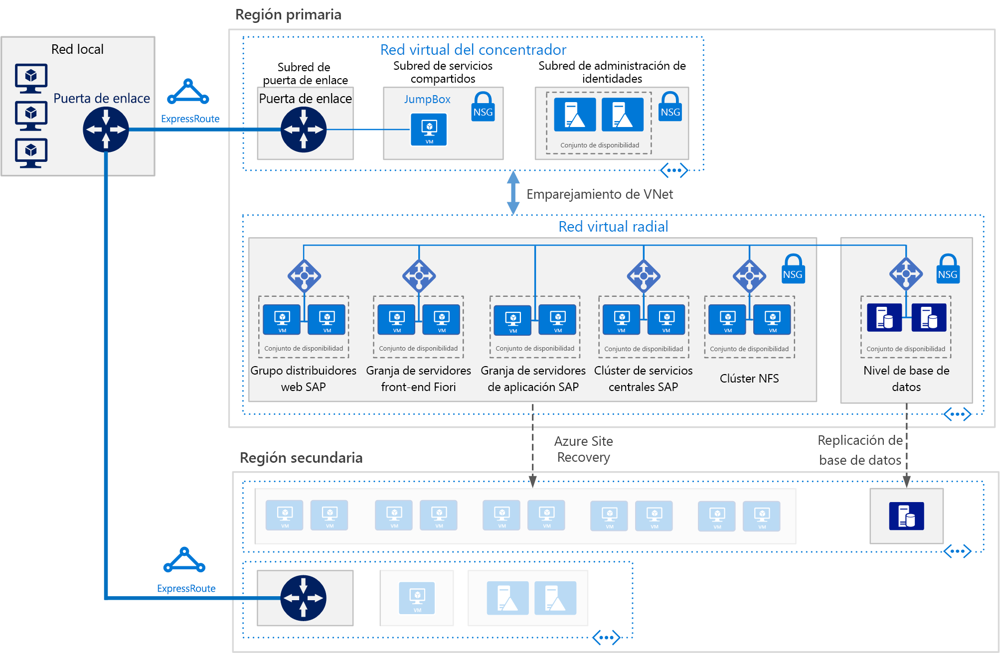

# SAP S/4HANA para Linux Virtual Machines en Azure

Esta arquitectura de referencia muestra un conjunto de procedimientos probados para ejecutar S/4HANA en un entorno de alta disponibilidad que admita recuperación ante desastres en Azure. Esta arquitectura se implementa con tamaños de máquina virtual (VM) específicos que se pueden cambiar para acomodarse a las necesidades de la organización. 

*Descargue un [archivo Visio][visio-download] de esta arquitectura.*

> [!NOTE] 
> La implementación de esta arquitectura de referencia requiere licencias adecuadas de los productos de SAP y de otras tecnologías que no son de Microsoft.

## Arquitectura
 
Esta arquitectura de referencia describe un sistema de producción de nivel empresarial. Para adaptarse a las necesidades de su empresa, esta configuración se puede reducir a una sola máquina virtual. Sin embargo, se requieren los siguientes componentes:

**Red virtual**. El servicio [Azure Virtual Network](/azure/virtual-network/virtual-networks-overview) conecta los recursos de Azure entre sí de forma segura. En esta arquitectura, la red virtual se conecta a un entorno local a través de una puerta de enlace implementada en el concentrador de una [topología en estrella tipo hub-and-spoke](../hybrid-networking/hub-spoke.md). El radio es la red virtual que se usa para las aplicaciones de SAP.

**Subredes**. La red virtual se subdivide en diferentes [subredes](/azure/virtual-network/virtual-network-manage-subnet) para cada nivel: puerta de enlace, aplicación, base de datos y servicios compartidos. 

**Máquinas virtuales**. Esta arquitectura usa máquinas virtuales que ejecutan Linux en la capa de aplicación y el nivel de base de datos, agrupadas como se indica a continuación:

- **Capa de aplicación**. Incluye el clúster de servidores front-end Fiori, el grupo de SAP Web Dispatcher, el clúster de servidores de aplicaciones y el clúster de SAP Central Services. Para lograr la alta disponibilidad de Central Services en máquinas virtuales Linux de Azure, se requiere un servicio Network File System (NFS) con alta disponibilidad.
- **Clúster NFS**. Esta arquitectura utiliza un servidor [NFS](/azure/virtual-machines/workloads/sap/high-availability-guide-suse-nfs) que se ejecuta en un clúster de Linux para almacenar datos compartidos entre los sistemas SAP. Este clúster centralizado se puede compartir entre varios sistemas SAP. Para lograr la alta disponibilidad del servicio NFS, se utiliza la extensión de alta disponibilidad adecuada para la distribución de Linux seleccionada.
- **SAP HANA**. El nivel de base de datos usa dos o más máquinas virtuales de Linux en un clúster para conseguir alta disponibilidad. La replicación del sistema de HANA (HSR) se usa para replicar contenidos entre los sistemas HANA principal y secundario. La agrupación en clústeres de Linux se usa para detectar errores del sistema y facilitar la conmutación automática por error. Se puede usar un mecanismo de barrera basado en almacenamiento o basado en la nube para garantizar que el sistema con errores se aísla o se cierra para evitar el síndrome de cerebro dividido.
- **JumpBox**. También se denomina bastion host. Se trata de una máquina virtual segura en la red que usan los administradores para conectarse al resto de máquinas virtuales. Se puede ejecutar en Windows o Linux. Utilice un jumpbox de Windows para una mejor navegación web al usar las herramientas de administración de HANA Cockpit o HANA Studio.

**Equilibradores de carga.** Tanto los equilibradores de carga de SAP integrados como [Azure Load Balancer](/azure/load-balancer/load-balancer-overview) se utilizan para lograr alta disponibilidad. Las instancias de Azure Load Balancer se utilizan para distribuir el tráfico a las máquinas virtuales en la subred de la capa de aplicación.

**Conjuntos de disponibilidad**. En las máquinas virtuales de todos los grupos y clústeres (Web Dispatcher, el servidor de aplicaciones de SAP, Central Services, NFS y HANA), los roles se agrupan en [conjuntos de disponibilidad](/azure/virtual-machines/windows/tutorial-availability-sets) independientes y se aprovisionan un mínimo de dos máquinas virtuales por rol, lo que hace que las máquinas virtuales sean aptas para un [Acuerdo de Nivel de Servicio](https://azure.microsoft.com/support/legal/sla/virtual-machines) (SLA) mayor. 

**NIC**. Las [tarjetas de interfaz de red](/azure/virtual-network/virtual-network-network-interface) (NIC) permiten la comunicación de las máquinas virtuales en una red virtual.

**Grupos de seguridad de red**. Para restringir el tráfico entrante, saliente y de la intra-subnet en la red virtual, se usan [grupos de seguridad de red](/azure/virtual-network/virtual-networks-nsg) (NSG).

**Puerta de enlace**. Una puerta de enlace extiende una red local a la red virtual de Azure. [ExpressRoute](/azure/architecture/reference-architectures/hybrid-networking/expressroute) es el servicio de Azure recomendado para crear conexiones privadas que no atraviesen Internet, pero también se puede usar una conexión de [sitio a sitio](/azure/vpn-gateway/vpn-gateway-howto-site-to-site-resource-manager-portal). 

**Azure Storage**. Para proporcionar un almacenamiento persistente de disco duro virtual (VHD) de una máquina virtual, se requiere [Azure Storage](/azure/storage/). 

## Recomendaciones

Esta arquitectura describe una pequeña implementación empresarial en el nivel de producción. La implementación será diferente en función de sus requisitos empresariales. Use estas recomendaciones como punto de partida.

### Máquinas virtuales

En las granjas y clústeres de servidores de aplicaciones, ajuste el número de máquinas virtuales según sus requisitos. La [guía de planeación e implementación de Azure Virtual Machines](/azure/virtual-machines/workloads/sap/planning-guide) incluye detalles sobre cómo ejecutar SAP NetWeaver en máquinas virtuales, pero la información también se puede aplicar a SAP S/4HANA.

Para más información acerca de la compatibilidad de SAP con Azure y las métricas de rendimiento (SAPS), consulte la [nota de SAP 1928533](https://launchpad.support.sap.com/#/notes/1928533). 

### Grupo de SAP Web Dispatcher

El componente Web Dispatcher se usa como equilibrador de carga para el tráfico SAP que circula entre los servidores de aplicaciones de SAP. Para lograr una alta disponibilidad para el componente de Web Dispatcher, se usa Azure Load Balancer para implementar la configuración paralela de Web Dispatcher en una configuración round-robin para la distribución del tráfico HTTP(S) entre las instancias disponibles de Web Dispatcher del grupo back-end de equilibradores de carga. 

### Servidor front-end de Fiori

El servidor front-end de Fiori utiliza una [puerta de enlace de NetWeaver](https://help.sap.com/doc/saphelp_gateway20sp12/2.0/en-US/76/08828d832e4aa78748e9f82204a864/content.htm?no_cache=true). Para pequeñas implementaciones, se puede cargar en el servidor Fiori. Para implementaciones grandes, se puede implementar un servidor independiente para la puerta de enlace de NetWeaver delante del clúster de servidores front-end de Fiori.

### Grupo de servidores de aplicaciones

Para administrar grupos de inicio de sesión para servidores de aplicaciones de ABAP, se utiliza la transacción SMLG. Usa la función de equilibrio de carga en el servidor de mensajes de Central Services para distribuir la carga de trabajo entre el grupo de servidores de aplicaciones de SAP para SAPGUI y el tráfico de RFC. La conexión de servidor de aplicaciones para Central Services de alta disponibilidad se realiza a través del nombre de la red virtual del clúster. Esto evita la necesidad de cambiar el perfil del servidor de aplicaciones para la conectividad de Central Services después de una conmutación por error local. 

### Clúster de SAP Central Services

Central Services se puede implementar en una única máquina virtual si la alta disponibilidad no es un requisito. Sin embargo, la máquina virtual única se convierte en un único punto de error (SPOF) para el entorno de SAP. Para una implementación de Central Services de alta disponibilidad, se utilizan un clúster NFS de alta disponibilidad y un clúster de Central Services de alta disponibilidad.

### Clúster NFS

Se usa DRBD (Distributed Replicated Block Device) para la replicación entre los nodos del clúster NFS.

### Conjuntos de disponibilidad

Los conjuntos de disponibilidad distribuyen los servidores en distintos grupos físicos de actualización y de infraestructura físicos para mejorar la disponibilidad del servicio. La colocación de máquinas virtuales que realicen el mismo rol en conjuntos de disponibilidad ayudan a protegerse contra el tiempo de inactividad que provoca el mantenimiento de la infraestructura de Azure y a cumplir los[Acuerdos de Nivel de Servicio](https://azure.microsoft.com/support/legal/sla/virtual-machines). Se recomiendan dos, o más, máquinas virtuales por conjunto de disponibilidad.

Todas las máquinas virtuales de un conjunto deben realizar el misma rol. No mezcle servidores de distintos roles en el mismo conjunto de disponibilidad. Por ejemplo, no coloque un nodo de ASCS en el mismo conjunto de disponibilidad que el servidor de aplicaciones.

### Tarjetas de red

En las implementaciones de entornos de SAP locales tradicionales se implementan varias tarjetas de interfaz de red (NIC) por máquina para aislar el tráfico administrativo del tráfico del negocio. En Azure, la red virtual es una red definida por el software que envía todo el tráfico a través del mismo tejido de red. Por tanto, no es necesario el uso de varias tarjetas de interfaz de red. Sin embargo, si su organización necesita separar el tráfico, puede implementar varias tarjetas de interfaz de red por máquina virtual, conecte cada una de ellas a una subred diferente y, después, use los grupos de seguridad de red para aplicar las distintas directivas de control de acceso.

### Subredes y grupos de seguridad de red

Esta arquitectura divide el espacio de direcciones de la red virtual en subredes. Cada subred se puede asociar con un grupo de seguridad de red que define las directivas de acceso para la subred. Coloque los servidores de aplicaciones en una subred independiente para poder protegerlos más fácilmente mediante la administración de las directivas de seguridad de la subred, no de los servidores individuales.

Cuando un grupo de seguridad de red se asocia a una subred, se aplica a todos los servidores de esta. Para más información acerca del uso de los grupos de seguridad de red para tener un control específico sobre los servidores de una subred, consulte [Filtro del tráfico de red con grupos de seguridad de red](https://azure.microsoft.com/blog/multiple-vm-nics-and-network-virtual-appliances-in-azure/).

Consulte también, [Planeamiento y diseño de VPN Gateway](/azure/vpn-gateway/vpn-gateway-plan-design).

### Equilibradores de carga

[SAP Web Dispatcher](https://help.sap.com/doc/saphelp_nw73ehp1/7.31.19/en-US/48/8fe37933114e6fe10000000a421937/frameset.htm) controla el equilibrio de carga del tráfico HTTP(S), incluido el de las aplicaciones de estilo Fiori, en un grupo de servidores de aplicaciones SAP. 

Para el tráfico de clientes de la GUI de SAP que se conectan a un servidor SAP a través del protocolo DIAG o de instancias de Remote Function Call (RFC), el servidor de mensajes de Central Services equilibra la carga a través de los [grupos de inicio de sesión](https://wiki.scn.sap.com/wiki/display/SI/ABAP+Logon+Group+based+Load+Balancing) del servidor de aplicaciones de SAP, por lo que se necesita un equilibrador de carga adicional. 

### Azure Storage

Se recomienda utilizar Azure Premium Storage para las máquinas virtuales del servidor de bases de datos. Premium Storage proporciona latencias de lectura-escritura coherentes. Para más información sobre el uso de Premium Storage para todos los discos del sistema operativo y discos de datos, consulte [Contrato de nivel de servicio para Virtual Machines](https://azure.microsoft.com/support/legal/sla/virtual-machines/). 

Para todos los sistemas SAP de producción, es aconsejable usar [Azure Managed Disks](/azure/storage/storage-managed-disks-overview) Premium. Se usan discos administrados para administrar los archivos de VHD en los discos, lo cual proporciona confiabillidad. Estos también garantizan que los discos de las máquinas virtuales de un conjunto de disponibilidad están aislados, con el fin de evitar únicos puntos de error.

En el caso de los servidores de aplicaciones SAP, lo que incluye las máquinas virtuales de Central Services, puede usar Azure Standard Storage para reducir el costo, ya que la aplicación se ejecuta en la memoria y los discos solo se usan para el registro. Sin embargo, en este momento, Standard Storage solo está certificado para el almacenamiento no administrado. Puesto que los servidores de aplicaciones no hospeda ningún dato, también puede usar los discos de P4 y almacenamiento de Premium P6 más pequeños para ayudar a minimizar el costo.

En el almacén de datos de copia de seguridad, se recomienda utilizar el [nivel de almacenamiento de acceso esporádico y el almacenamiento de nivel de acceso de archivo de Azure](/azure/storage/storage-blob-storage-tiers). Estos niveles de almacenamiento son formas rentables de almacenamiento de datos de larga duración a los que se accede con poca frecuencia.

## Consideraciones sobre rendimiento

Los servidores de aplicaciones SAP establecen comunicaciones constantes con los servidores de bases de datos. Para las máquinas virtuales de base de datos HANA, considere la posibilidad de habilitar el [acelerador de escritura](/azure/virtual-machines/linux/how-to-enable-write-accelerator) para mejorar la latencia de la escritura de registro. Para optimizar las comunicaciones entre servidores, utilice la [red acelerada](https://azure.microsoft.com/blog/linux-and-windows-networking-performance-enhancements-accelerated-networking/). Tenga en cuenta que estos aceleradores solo están disponibles para determinadas series de máquinas virtuales.

Para lograr un rendimiento del ancho de banda de disco y un IOPS altos, las prácticas habituales de [optimización del rendimiento](/azure/virtual-machines/linux/premium-storage-performance) del volumen de almacenamiento se aplican al diseño de Azure Storage. Por ejemplo, la combinación de varios discos para crear un volumen de disco con secciones mejora el rendimiento de E/S. La habilitación de la caché de lectura en el contenido de almacenamiento que cambia con poca frecuencia mejora la velocidad de recuperación de datos. Para más información acerca de los requisitos de rendimiento, consulte [SAP note 1943937 - Hardware Configuration Check Tool](https://launchpad.support.sap.com/#/notes/1943937) (SAP nota 1943937: Herramienta de comprobación de la configuración del hardware). Se requiere una cuenta de SAP Service Marketplace para acceder.

## Consideraciones sobre escalabilidad

En el nivel de aplicación de SAP, Azure ofrece una amplia variedad de tamaños de máquina virtual tanto para el escalado vertical como para el horizontal. Para ver una lista inclusiva, consulte [SAP note 1928533 - Applications on Azure: Supported Products and Azure VM types](https://launchpad.support.sap.com/#/notes/1928533) (SAP nota 1928533: Aplicaciones de SAP en Azure: tipos de máquina virtual de Azure y productos compatibles). Se requiere una cuenta de SAP Service Marketplace para acceder. A medida que continuamos certificando más tipos de máquinas virtuales, puede escalar o reducir verticalmente con la misma implementación en la nube. 

En la capa de base de datos, esta arquitectura ejecuta HANA en máquinas virtuales. Si la carga de trabajo supera el tamaño máximo de las máquinas virtuales, Microsoft también ofrece [Azure Large Instances](/azure/virtual-machines/workloads/sap/hana-overview-architecture) para SAP HANA. Estos servidores físicos se ubican en un centro de datos certificado de Microsoft Azure y, en el momento en que se redactó este documento, proporcionaban hasta 20 TB de capacidad de memoria para una sola instancia. La configuración con varios nodos también es posible con una capacidad de memoria total de hasta 60 TB.

## Consideraciones sobre disponibilidad

La redundancia de recursos es el tema general en las soluciones de infraestructura de alta disponibilidad. Para las empresas que tienen un Acuerdo de Nivel de Servicio menos estrictos, las máquinas virtuales de Azure de instancia única ofrecen un SLA de tiempo de actividad. Para más información, consulte [Contratos de nivel de servicio](https://azure.microsoft.com/support/legal/sla/).

En esta instalación distribuida de la aplicación SAP, la instalación base se replica para lograr una alta disponibilidad. Para cada capa de la arquitectura, el diseño de la alta disponibilidad varía. 

### Capa de aplicación

- Web Dispatcher. La alta disponibilidad se logra mediante instancias redundantes de Web Dispatcher. Consulte [SAP Web Dispatcher](https://help.sap.com/doc/saphelp_nw70ehp2/7.02.16/en-us/48/8fe37933114e6fe10000000a421937/frameset.htm) en la documentación de SAP.
- Servidores Fiori. La alta disponibilidad se logra mediante el equilibrio de la carga de tráfico dentro de un grupo de servidores.
- Central Services. Para lograr la alta disponibilidad de Central Services en máquinas virtuales Linux de Azure, se utiliza la extensión de alta disponibilidad adecuada para la distribución de Linux seleccionada y el clúster NFS de alta disponibilidad hospeda el almacenamiento DRBD.
- Servidores de aplicaciones. La alta disponibilidad se logra mediante el equilibrio de la carga de tráfico dentro de un grupo de servidores de aplicaciones.

### Nivel de base de datos

Esta arquitectura de referencia muestra un sistema de base de datos de SAP HANA de alta disponibilidad que consiste en dos máquinas virtuales de Azure. La característica de replicación del sistema nativa del nivel de base de datos proporciona conmutación automática por error manual o automática entre los nodos replicados:

- Para la conmutación por error manual, implemente más de una instancia de HANA y utilice la replicación del sistema de HANA (HSR).
- Para la conmutación automática por error, use HSR y la extensión de alta disponibilidad (HAE) de Linux adecuada para su distribución de Linux. Linux HAE proporciona los servicios de clúster a los recursos de HANA, detecta eventos de error y orquesta la conmutación por error de los servicios errantes en el nodo en buen estado. 

Consulte [Configuraciones y certificaciones de SAP que se ejecutan en Microsoft Azure](/azure/virtual-machines/workloads/sap/sap-certifications).

### Consideraciones acerca de la recuperación ante desastres
Cada nivel utiliza una estrategia diferente para proporcionar protección mediante la recuperación ante desastres (DR).

- **Nivel de servidores de aplicaciones**. Los servidores de aplicaciones de SAP no contienen datos empresariales. En Azure, una estrategia de recuperación ante desastres simple es crear servidores de aplicaciones SAP en la región secundaria y apagarlos. Tras cualquier cambio de configuración o actualización del kernel en el servidor de aplicaciones principal, los mismos cambios se deben aplicar a las máquinas virtuales de la región secundaria. Por ejemplo, copie los archivos ejecutables del kernel de SAP en las máquinas virtuales de recuperación ante desastres. Para la replicación automática de los servidores de aplicaciones en una región secundaria, [Azure Site Recovery](/azure/site-recovery/site-recovery-overview) es la solución recomendada. Al redactar este documento, ASR aún no admite la replicación de la configuración de la red acelerada en máquinas virtuales de Azure.

- **Central Services**. Este componente de la pila de aplicaciones SAP tampoco conserva los datos empresariales. Puede crear una máquina virtual en la región secundaria para ejecutar el rol de Central Services. El único contenido del nodo de Central Services principal que se sincroniza es el del recurso compartido /sapmnt. Además, si los cambios de configuración o las actualizaciones del kernel tienen lugar en los servidores principales de Central Services, se deben repetir en la máquina virtual de la región secundaria que ejecuta Central Services. Para sincronizar los dos servidores, puede usar Azure Site Recovery para replicar los nodos del clúster o simplemente usar un trabajo de copia programado regularmente para copiar /sapmnt en el lado de la recuperación ante desastres. Para más información acerca del proceso de compilación, copia y conmutación por error de prueba, descargue [SAP NetWeaver: Building a Hyper-V and Microsoft Azure–based Disaster Recovery Solution](https://download.microsoft.com/download/9/5/6/956FEDC3-702D-4EFB-A7D3-2DB7505566B6/SAP%20NetWeaver%20-%20Building%20an%20Azure%20based%20Disaster%20Recovery%20Solution%20V1_5%20.docx) (SAP NetWeaver: creación de una solución de recuperación ante desastres basada en Hyper-V y Microsoft Azure) y consulte la sección 4.3 "Capa de SAP SPOF (ASCS)". Este documento se aplica a la instancia de NetWeaver que se ejecuta en Windows, pero puede crear una configuración equivalente para Linux. Para Central Services, use [Azure Site Recovery](/en-us/azure/site-recovery/site-recovery-overview) para replicar los nodos y el almacenamiento de clúster. Para Linux, cree un clúster de replicación geográfica de tres nodos mediante una extensión de alta disponibilidad. 

- **Nivel de base de datos de SAP**. Usar HSR para la replicación compatible con HANA. Además de una configuración local de dos nodos de alta disponibilidad, HSR admite la replicación multinivel, en la que un tercer nodo de una región de Azure independiente que actúa como una entidad externa, que no forma parte del clúster, se registra en la réplica secundaria del par HSR con clústeres como su destino de replicación. De este modo se forma una cadena de margarita de replicación. La conmutación por error en el nodo de recuperación ante desastres es un proceso manual.

Para usar Azure Site Recovery para generar automáticamente un sitio de producción totalmente replicado del original, debe ejecutar [scripts de implementación](/azure/site-recovery/site-recovery-runbook-automation) personalizados. Site Recovery implementa en primer lugar las máquinas virtuales en conjuntos de disponibilidad y, después, ejecuta scripts para agregar recursos como los equilibradores de carga. 

## Consideraciones sobre la manejabilidad

SAP HANA tiene una característica de copia de seguridad que usa la infraestructura subyacente de Azure. Para hacer una copia de seguridad de la base de datos de SAP HANA que se ejecuta en las máquinas virtuales de Azure, tanto la instantánea de SAP HANA como la de Azure Storage se usan para asegurar la coherencia de los archivos de copia de seguridad. Para más información, consulte [Guía de copia de seguridad de SAP HANA en Azure Virtual Machines](/azure/virtual-machines/workloads/sap/sap-hana-backup-guide) y [Preguntas sobre el servicio Azure Backup](/azure/backup/backup-azure-backup-faq). Solo las implementaciones de contenedor único de HANA admiten instantáneas de Azure Storage.

### Administración de identidades

Controle el acceso a los recursos mediante el uso de un sistema de administración de identidades centralizado en todos los niveles:

- Proporcione acceso a los recursos de Azure mediante el [control de acceso basado en rol](/azure/active-directory/role-based-access-control-what-is) (RBAC). 
- Conceda acceso a las máquinas virtuales de Azure a través de LDAP, Azure Active Directory, Kerberos u otro sistema. 
- Ofrezca acceso a las propias aplicaciones mediante los servicios que proporciona SAP o use [OAuth 2.0 y Azure Active Directory](/azure/active-directory/develop/active-directory-protocols-oauth-code). 

### Supervisión

Azure proporciona varias funciones para la [supervisión y el diagnóstico](/azure/architecture/best-practices/monitoring) de la infraestructura global. Además, la supervisión mejorada de las máquinas virtuales de Azure (Linux o Windows) la controla Azure Operations Management Suite (OMS). 

Para proporcionar supervisión basada en SAP de los recursos y del rendimiento de los servicios de la infraestructura de SAP, se usa la extensión [Azure SAP Enhanced Monitoring](/azure/virtual-machines/workloads/sap/deployment-guide#d98edcd3-f2a1-49f7-b26a-07448ceb60ca). Esta extensión introduce las estadísticas de supervisión de Azure en la aplicación de SAP para la supervisión de sistema operativo y las funciones de DBA Cockpit. La supervisión mejorada de SAP es un requisito obligatorio para ejecutar SAP en Azure. Para más información, consulte la [nota de SAP 2191498](https://launchpad.support.sap.com/#/notes/2191498) "SAP on Linux with Azure: Enhanced Monitoring" (SAP en Linux con Azure: supervisión mejorada).

## Consideraciones sobre la seguridad

SAP tiene su propio motor de administración de usuarios (UME) para controlar el acceso basado en rol y la autorización en la aplicación de SAP. Para más información, consulte [SAP HANA Security—An Overview](https://archive.sap.com/documents/docs/DOC-62943) (Seguridad de SAP HANA). Se requiere una cuenta de SAP Service Marketplace para acceder.

Para aumentar la seguridad de la red, considere la posibilidad de implementar un [red perimetral](/azure/architecture/reference-architectures/dmz/secure-vnet-hybrid), que utiliza una aplicación virtual de red para crear un firewall delante de la subred para Web Dispatcher y para los grupos de servidores front-end de Fiori.

Para la seguridad de la infraestructura, los datos se cifran tanto en tránsito como en reposo. La sección "Security considerations" (Consideraciones de seguridad) de [SAP NetWeaver on Azure Virtual Machines – Planning and Implementation Guide](/azure/virtual-machines/workloads/sap/planning-guide) empieza a afrontar la seguridad de la red y se aplica a S/4HANA. La guía también especifica los puertos de red que se deben abrir en los firewalls para permitir la comunicación de la aplicación. 

Para cifrar discos de una máquina virtual IaaS Linux, puede usar [Azure Disk Encryption](/azure/security/azure-security-disk-encryption). Utiliza la característica DM-Crypt de Linux para proporcionar el cifrado del volumen de los discos de datos y del sistema operativo. La solución también funciona con Azure Key Vault para ayudarle a controlar y administrar las claves y los secretos del cifrado de discos en la suscripción de Key Vault. Los datos de los discos de máquinas virtuales se cifran en reposo en Azure Storage.

Para el cifrado de datos en reposo de SAP HANA, se recomienda utilizar la tecnología de cifrado nativa de SAP HANA. 

> [!NOTE]
> No utilice el cifrado de datos en reposo de HANA con Azure Disk Encryption en el mismo servidor. Para HANA, use solo el cifrado de datos de HANA.

## Comunidades

Las comunidades pueden responder preguntas y ayudarle a configurar una implementación correcta. Tenga en cuenta lo siguiente.

- [Blog Ejecución de aplicaciones SAP en la plataforma de Microsoft](https://blogs.msdn.microsoft.com/saponsqlserver/2017/05/04/sap-on-azure-general-update-for-customers-partners-april-2017/)
- [Soporte técnico de la comunidad de Azure](https://azure.microsoft.com/support/community/)
- [SAP Community](https://www.sap.com/community.html)
- [Desbordamiento de la pila](https://stackoverflow.com/tags/sap/)

[visio-download]: https://archcenter.blob.core.windows.net/cdn/sap-reference-architectures.vsdx
